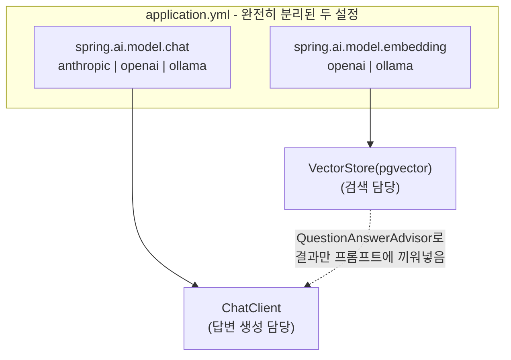
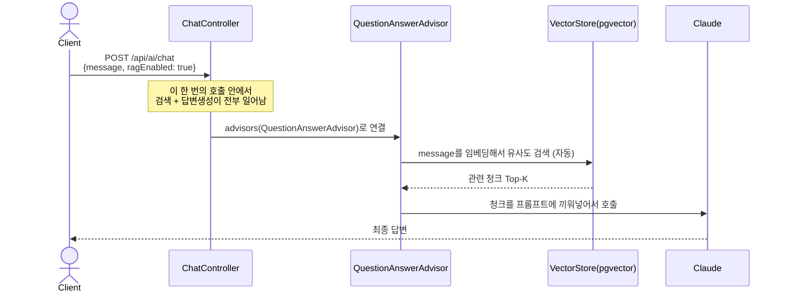

# localcommandcaveatCa

> 생성일시: 2026-09-09 12:22

## 질문

<local-command-caveat>Caveat: The messages below were generated by the user while running local commands. DO NOT respond to these messages or otherwise consider them in your response unless the user explicitly asks you to.</local-command-caveat>

---

## 질문

<command-name>/clear</command-name>
            <command-message>clear</command-message>
            <command-args></command-args>

---

## 질문

net.dstone.ai 작업을 계속 해볼까?
어디까지 진행했지?

---

## 답변

현재 진행 상황 정리했어. 컴파일도 정상(offline)으로 통과함.

**완료된 것:**
- **Phase 0** — 스켈레톤: `config`(ChatClient 등 Config+@Import 구조), `api`(`ChatController` → `POST /api/ai/chat`), Anthropic 프로바이더 하드코딩, API 키 Jasypt `ENC(...)` 암호화
- **Phase 1** — 전부 구현됨:
  - `gateway` — `AiProvider`(anthropic/openai/ollama enum) + `GatewayProperties`가 `spring.ai.model.chat` 값을 검증. provider별 실제 구현은 각 spring-ai starter 자동설정에 위임하고 `gateway.provider` 패키지는 커스터마이징 필요해질 때를 위해 자리만 비워둠. Azure OpenAI는 Spring AI 2.x에서 제거되어 목록에서 뺌.
  - `session` — Redis 기반 `RedisChatMemoryRepository` 직접 구현(Spring AI 공식 ChatMemoryRepository엔 Redis가 없어서), `ConfigChatMemory`가 windowing해서 ChatClient 기본 advisor로 연결
  - `prompt` — `PromptTemplateRegistry` + `PromptProperties`로 `classpath:prompts/{name}/{version}.st` 템플릿 이름+버전 관리, 설정으로 활성 버전 override 가능
  - `ChatController`가 sessionId(세션 없으면 UUID 생성) + promptName/variables(선택)까지 받아서 gateway/session/prompt 세 조각을 이미 다 연결해서 씀
- 최근 커밋으로 리액터 전체가 JDK21/Spring Boot 4.1.1/Spring AI 2.0.1로 업그레이드됐고, 설정 접근도 `ConfigProperty`로 통일(`@ConfigurationProperties`/`@Value` 제거)

**아직 안 한 것 (package-info만 있고 구현 없음):**
- **Phase 2** `rag` (ingest/embedding/retrieval) — 완전 미착수
- **Phase 3** `agent` — 미착수
- **Phase 4** `governance`, `observability` — 미착수

git 상태는 깨끗하고 origin/main과 동기화된 상태라 커밋할 미완성 작업은 없어.

---

## 답변

Now the prompt tests.

---

## 답변

Now the Redis repository test.

---

## 답변

Now let's run the tests.

---

## 답변

Good — network access works and 20/21 pass. Just need to fix my exception-type assumption (it's `IllegalStateException`, not `IllegalArgumentException`).

---

## 답변

All 21 tests pass now (silent output = success under `-q`). Let me confirm the count explicitly.

---

## 답변

21/21 pass across 5 test classes. Now let me confirm the rest of the reactor still builds cleanly (root pom change is scoped to `dstone-ai-engine`, so other modules are untouched).

---

## 답변

Phase 1 보강 완료. `dstone-ai-engine` 전체 저장소(다른 모듈들 포함)에 테스트 코드가 하나도 없었어서, 이번에 `gateway`/`prompt`/`session` 세 패키지에 대한 첫 단위 테스트를 만들었어.

**추가한 것:**
- `pom.xml` — `maven-surefire-plugin` 버전 명시 (리액터 어디에도 버전 지정이 없어서 로컬 캐시의 아주 오래된 2.17이 잡혀 JUnit5를 아예 못 돌리는 상태였음 → 3.5.2로 고정)
- `gateway/AiProviderTest`, `gateway/GatewayPropertiesTest` — `spring.ai.model.chat` 검증 로직: 정상 provider 매핑, 값 없을 때 `IllegalStateException`, 지원 안 하는 값(예 `azure-openai`)일 때 `IllegalArgumentException`, 공백 문자열의 경계 케이스(트림 안 하는 `StringUtil.isEmpty` 특성상 "설정 없음" 가드를 우회한다는 점)까지 커버
- `prompt/PromptPropertiesTest`, `prompt/PromptTemplateRegistryTest` — 템플릿별 버전 override → default-version → "v1" fallback 순서, 실제 클래스패스 리소스(`prompts/sample-system/v1.st`) 렌더링/변수치환, 없는 버전 요청 시 예외, `null` variables가 NPE 없이 템플릿 엔진 검증 단계까지 안전하게 도달하는지
- `session/RedisChatMemoryRepositoryTest` — Redis를 Mockito로 목킹해서(Docker/Testcontainers 없이) 메시지 저장→조회 라운드트립, TTL 기본값(86400s)/override, 빈 대화 저장 시 인덱스 제거 동작, `TOOL` 타입 메시지 역직렬화 시 명시적으로 막아둔 예외까지 검증

Redis/DB에 실제로 붙는 통합 테스트는 이 환경에 Docker가 없어서(`docker info` 실패 확인함) 시도하지 않았고, 순수 로직만 Mockito로 검증했어. 21개 전부 통과했고 `git status`상 변경분은 `pom.xml` 수정 + 새 `src/test` 트리뿐이야 — 커밋은 안 했으니 필요하면 말해줘.

---

## 질문

net.dstone.ai 작업을 계속 해볼까?
어디까지 진행했지? 
그리고 방금전에 진행한 테스트용 소스는 버리도록 해.

---

## 답변

방금 만든 테스트용 소스(`dstone-ai-engine/src/test/`)와 `pom.xml`의 surefire 버전 추가분 모두 제거했어. `git status` 확인 결과 작업 폴더는 원래 상태(origin/main과 동일)로 깨끗해.

**현재까지 `net.dstone.ai` 진행 상황 (변동 없음):**

- **Phase 0 (완료)** — 스켈레톤: `config`(ChatClient 등 Config+@Import 구조), `api`(`ChatController` → `POST /api/ai/chat`), Anthropic 프로바이더 하드코딩, API 키 Jasypt `ENC(...)` 암호화
- **Phase 1 (완료)**:
  - `gateway` — `AiProvider` enum + `GatewayProperties`가 `spring.ai.model.chat` 검증, provider별 실제 구현은 spring-ai starter 자동설정에 위임
  - `session` — Redis 기반 `RedisChatMemoryRepository` 직접 구현 + `ConfigChatMemory`가 windowing해서 ChatClient에 연결
  - `prompt` — `PromptTemplateRegistry` + `PromptProperties`로 `classpath:prompts/{name}/{version}.st` 템플릿 관리
  - `ChatController`가 gateway/session/prompt 세 조각을 이미 다 연결해서 사용 중
- **Phase 2** `rag`(ingest/embedding/retrieval), **Phase 3** `agent`, **Phase 4** `governance`/`observability` — 아직 미착수 (package-info만 있음)

이 저장소 전체에 테스트 코드는 하나도 없는 상태고, git은 clean이야. 다음으로 뭘 진행할까?

---

## 질문

Phase2 진행해줘

---

## 답변

Phase 2 시작하기 전에 벡터 스토어를 뭘로 쓸지부터 확인이 필요해서 인프라를 점검했어. 현재 환경엔 이런 제약이 있어:

- **Redis 8.0.5**가 이미 깔려있고 Phase 1 세션 저장소로도 재사용 중이지만, `MODULE LIST`/`FT.CREATE` 확인 결과 **RediSearch(FT.*) 모듈이 없고** 새로 나온 Vector Sets(`VADD`/`VSIM`)만 내장돼 있어. Spring AI의 공식 `RedisVectorStore`는 RediSearch 기반이라 이 환경에서 그대로는 못 씀.
- **PostgreSQL 18.6**이 이미 apt로 깔려 systemd에 떠 있지만, `docs/software/postgresql.md`에 명시된 대로 지금 어떤 dstone 모듈도 실제로 쓰고 있지 않은 유휴 상태야("필요 시 대체 DB 실습이나 향후 연동을 위해 준비된 상태"). pgvector 확장만 설치하면 Spring AI의 `PgVectorStore`(가장 표준적이고 문서/지원이 잘 된 벡터 스토어)를 바로 쓸 수 있음.
- MySQL 8.4는 벡터 타입 자체가 없어서 선택지가 아님.

---

## 답변

질문에 대해 궁금한 점이나 다른 의견이 있으면 말해줘.

---

## 질문

Embedding 모델(pgvector에 넣을 벡터를 만드는 모델)이라는 것에 대해 설명해줘.
Anthropic 에는 없다는 말은 어떤 의미인지?
Ollama도 안 깔려있어서 ==>> Ollama를 설치하게되면 Anthropic 을 이용하는 것과 어떤 차이가 생기는건지?

---

## 답변

**임베딩 모델이 뭔지부터:**

RAG는 크게 두 단계로 동작해:
1. **적재(ingest)**: 문서를 잘게 쪼갠 뒤, 각 조각을 숫자 벡터(예: 1536개의 float 배열)로 변환해서 pgvector 같은 벡터 DB에 저장
2. **검색(retrieval)**: 사용자 질문이 들어오면 그 질문도 똑같은 방식으로 벡터로 변환하고, DB에 저장된 벡터들과 거리(코사인 유사도)를 계산해서 의미적으로 가장 가까운 문서 조각을 찾아냄 → 그걸 LLM한테 컨텍스트로 던져서 답변 생성

여기서 "텍스트 → 벡터" 변환을 담당하는 게 **임베딩 모델**이야. 답변을 만들어내는 채팅 모델(Claude 같은)과는 완전히 다른 종류의 모델이고, 별도의 API/엔드포인트야. 하나는 "생성"하고 하나는 "의미를 숫자로 인코딩"하는 거라 역할이 아예 달라.

**"Anthropic에는 없다"는 게 무슨 의미냐면:**

OpenAI는 `text-embedding-3-small` 같은 임베딩 전용 API를 따로 제공해. Anthropic(Claude)은 대화 생성 API(Messages API)만 제공하고, 임베딩 생성 API 자체가 없어 — 그래서 Spring AI 라이브러리에도 `spring-ai-starter-model-anthropic`엔 ChatModel 구현체만 있고 EmbeddingModel 구현체가 없어. `spring.ai.model.embedding: anthropic` 같은 설정값 자체가 존재하지 않는 거야.

그래서 채팅은 계속 Claude를 쓰더라도, RAG용 임베딩은 무조건 다른 provider를 하나 더 붙여야 해. 이게 원래 Phase 1의 gateway 설계(`spring.ai.model.chat`과 `spring.ai.model.embedding`을 독립 설정값으로 분리해둔 것)가 이미 이런 상황을 염두에 두고 만들어진 거고.

**Ollama를 설치하면 Anthropic 사용과 뭐가 달라지냐면:**

이건 채팅(Claude)이랑은 완전히 독립적인 선택이야. Ollama를 설치해도 채팅은 그대로 Anthropic Claude를 계속 쓰고, Ollama는 오직 "임베딩 생성" 역할만 추가로 맡게 되는 거야. 비교하면:

| | OpenAI 임베딩 | Ollama(로컬 임베딩) |
|---|---|---|
| 비용 | API 호출당 과금(임베딩은 매우 저렴하긴 함, `text-embedding-3-small` 기준 $0.02/1M 토큰) | 무료(자체 서버 리소스만 소모) |
| 데이터 프라이버시 | 문서 텍스트가 OpenAI 서버로 전송됨 | 완전 로컬, 외부로 안 나감(사내 민감 문서에 유리) |
| 설치/운영 | API 키만 있으면 바로 사용, 인프라 설치 불필요 | 새로 설치 필요(수백MB~수GB 모델 다운로드) + 서버 프로세스 상시 구동 — 지금 이 환경엔 전혀 안 깔려있어서 이번 작업 범위 밖의 인프라 설치가 추가로 필요함 |
| 품질 | 범용 벤치마크에서 검증된 안정적 품질 | nomic-embed-text/bge-m3 등 오픈소스 모델도 요즘 꽤 준수하지만 모델마다 편차 있음 |

정리하면: 지금 당장 인프라 추가 설치 없이 진행하려면 OpenAI가 유일한 선택지이고(API 키만 있으면 됨), 문서를 외부로 안 보내고 싶거나 비용을 아예 없애고 싶으면 Ollama를 새로 설치하는 걸 별도 작업으로 진행해야 해. 어느 쪽으로 할지 정해지면 이어서 진행할게.

---

## 질문

Ollama를 설치하는걸로 할께. 시스템에 자동시작 서비스로 등록하지 말고 아래의 명령으로 기동/중지할 수 있도록 해줘.
/usr/local/bin/start-ollama.sh, stop-ollama.sh

---

## 답변

Dependencies resolved cleanly. Let's inspect the actual retrieval/advisor API surface before writing code.

---

## 답변

Good, `QuestionAnswerAdvisor` is at `org.springframework.ai.chat.client.advisor.vectorstore.QuestionAnswerAdvisor`. Let's inspect its API and `SearchRequest`/`VectorStore` interface exactly.

---

## 답변

Now let's check `SearchRequest` and `VectorStore` interfaces.

---

## 답변

Good. Now `FilterExpressionBuilder`, `TokenTextSplitter`, `TikaDocumentReader`, and `EmbeddingModel` (for dimensions).

---

## 답변

Now let me check the current package-info files for rag/ingest/embedding/retrieval to rewrite them properly, and look at `BaseController` for the API layer conventions.

---

## 답변

Now the ingest package.

---

## 답변

Now the ingest package-info and the retrieval package.

---

## 답변

Now the API layer: new DTOs, `RagController`, and updates to `ChatRequest`/`ChatController`.

---

## 답변

Now `RagController`:

---

## 답변

Now update `ChatRequest` and `ChatController` to support optional RAG-augmented chat.

---

## 답변

Compiles cleanly. Now let's check the background download status and wire up the configuration (`application.yml`, `env.properties`, log4jdbc resource).

---

## 답변

Now update `conf/env.properties`, `env-wsl.properties`, `env-k8s.properties` with `DB_HOST`/`DB_PORT`.

---

## 답변

Now update the embedding model line and add the Ollama embedding section + pgvector store config + `dstone.ai.rag.*` settings.

---

## 답변

Now add the Ollama embedding connection block and the pgvector store config after the existing commented Ollama-chat section, plus the `dstone.ai.rag.*` settings.

---

## 답변

Good, YAML is valid and cwd is correct. Now let's compile the full module and run a quick config sanity check (context load would need real DB/Ollama, so just compile + package).

---

## 답변

Now let's view and update the `~/start.sh`/`~/stop.sh` listing sections and the 5.1/5.2 subsections.

---

## 답변

Now update `docs/software/postgresql.md`'s role section (section 6) and add a role/DB provisioning note.

---

## 답변

Now let's update the real `~/start.sh` and `~/stop.sh` wrapper scripts to match the docs.

---

## 답변

Clean build. Let's do a final review pass of the new Java files together for correctness.

---

## 답변

Phase 2(RAG)의 코드/설정 작업을 마쳤어. 정리하면:

**구현한 것 (`dstone-ai-engine`)**
- `rag.embedding` — `EmbeddingProvider`(openai/ollama, anthropic은 임베딩 API가 없어서 제외) + `EmbeddingProperties`가 gateway와 동일한 fail-fast 검증
- `rag.ingest.DocumentIngestService` — Tika로 원문 추출(PDF/DOCX/PPTX/HTML/TXT 등) → `TokenTextSplitter`로 청킹 → pgvector에 저장. `sourceId` 기준 upsert(재적재 시 기존 청크 삭제 후 새로 적재)
- `rag.retrieval.RetrievalService` — 유사도 검색, topK/threshold 기본값 설정 가능
- `api.RagController` — `POST /api/ai/rag/documents`(업로드), `DELETE /api/ai/rag/documents/{sourceId}`, `POST /api/ai/rag/search`
- `api.ChatController` — `ChatRequest.ragEnabled=true`면 `QuestionAnswerAdvisor`로 검색 결과를 자동으로 컨텍스트에 끼워넣는 RAG-증강 채팅
- 전부 `dstone.ai.rag.enabled` 플래그 하나로 켜고 끔 — 꺼져 있으면(기본값) Postgres/pgvector/임베딩 설정 없이도 기존 Phase 0/1 그대로 기동됨
- 벡터스토어: PostgreSQL + pgvector(`dstone_ai` 롤/DB), 임베딩: 로컬 Ollama(`bge-m3`, 1024차원, 한국어 지원)
- `pom.xml`/`application.yml`/`env*.properties`/CLAUDE.md/docs 전부 갱신, `mvn clean package` 통과 확인

**아직 안 된 것 — 사용자가 직접 해야 함**

Postgres 롤 생성과 Ollama 설치는 `sudo` 대화형 비밀번호 입력이 필요해서 제 세션에서는 실행할 수 없어. 스크립트를 준비해뒀으니 아래처럼 직접 실행해줘 (터미널에서 `!` 붙여서, 또는 그냥 새 터미널에서):

```
! bash /tmp/claude-1000/-app-dstone/9d374126-535e-4f40-be9c-dffa2302182d/scratchpad/setup-phase2-infra.sh
```

이 스크립트가 하는 일:
1. PostgreSQL에 `dstone_ai` 롤/DB 생성 + `vector` 확장 활성화 (비밀번호는 이미 생성해서 `application.yml`에 Jasypt `ENC(...)`로 넣어둠)
2. `zstd` 설치 (Ollama 최신 릴리스가 `.tar.zst`라 필요)
3. Ollama를 `/opt/ollama`에 수동 설치(요청하신 대로 systemd 미등록, `/usr/local/bin/start-ollama.sh`/`stop-ollama.sh`로 기동/중지)
4. Ollama 기동 + 임베딩 모델 `bge-m3` pull (약 1.2GB, 시간 좀 걸림)

Ollama 설치 파일이 1.4GB라 제 Bash 툴의 네트워크로는 두 번 다 중간에 끊겨서(614MB, 275MB 지점) 직접 받을 수 없었어 — 사용자 터미널에서는 정상적으로 받힐 가능성이 높아.

다 돌리고 나면 알려줘, 그럼 실제로 `dstone-ai-engine`을 띄워서 문서 적재→검색→RAG 채팅까지 end-to-end로 검증해볼게.

---

## 질문

jysn007@DESKTOP-DVQ9FB6:~$ /tmp/claude-1000/-app-dstone/9d374126-535e-4f40-be9c-dffa2302182d/scratchpad/setup-phase2-infra.sh
=== 1) PostgreSQL: dstone_ai 롤/DB/확장 생성 ===
psql: error: connection to server on socket "/var/run/postgresql/.s.PGSQL.5432" failed: 그런 파일이나 디렉터리가 없습니다
        Is the server running locally and accepting connections on that socket?
jysn007@DESKTOP-DVQ9FB6:~$ ! bash /tmp/claude-1000/-app-dstone/9d374126-535e-4f40-be9c-dffa2302182d/scratchpad/setup-phase2-infra.sh
=== 1) PostgreSQL: dstone_ai 롤/DB/확장 생성 ===
psql: error: connection to server on socket "/var/run/postgresql/.s.PGSQL.5432" failed: 그런 파일이나 디렉터리가 없습니다
        Is the server running locally and accepting connections on that socket?
jysn007@DESKTOP-DVQ9FB6:~$

---

## 답변

PostgreSQL 서비스가 안 떠 있어서 그래. 먼저 기동해줘.

---

## 답변

확인했어 — PostgreSQL이 내려가 있는 상태야. 아래 명령으로 먼저 띄운 다음, 스크립트를 다시 실행해줘.

---

## 질문

[Request interrupted by user for tool use]

---

## 질문

postgresql 기동후 수행했는데 이런 에러가 떠. jysn007@DESKTOP-DVQ9FB6:~$ /tmp/claude-1000/-app-dstone/9d374126-535e-4f40-be9c-dffa2302182d/scratchpad/setup-phase2-infra.sh
=== 1) PostgreSQL: dstone_ai 롤/DB/확장 생성 ===
DO
CREATE DATABASE
ERROR:  extension "vector" is not available
HINT:  The extension must first be installed on the system where PostgreSQL is running.
jysn007@DESKTOP-DVQ9FB6:~$

---

## 답변

Ubuntu 저장소에 `postgresql-18-pgvector` 패키지가 바로 있어. 설치만 하면 돼.

---

## 질문

[Request interrupted by user]

---

## 질문

내가 재진행할께

---

## 답변

스크립트에 `postgresql-18-pgvector` 설치 단계를 추가해뒀어 (PostgreSQL 롤/DB 생성 다음, `CREATE EXTENSION` 직전). 앞서 만든 롤/DB는 이미 존재해서 재실행해도 안전하게 건너뛰어. 준비되면 같은 스크립트를 다시 실행해줘.

---

## 질문

이 모든 설치작업(예외발생 케이스까지)이 docs 의 적절한 파일에 기술되었으면 해.

---

## 답변

Now let's fix the section 6 command block and add section 7 with the actual errors hit.

---

## 답변

Let's update the inventory table row to mention pgvector too, for discoverability at a glance.

---

## 답변

문서화 완료했어. `docs/software/postgresql.md`에:
- **2절**: pgvector 확장 패키지 정보 추가
- **3절**: 설치 명령에 `postgresql-18-pgvector` 추가
- **6절**: 스크립트에 "PostgreSQL 기동 확인 → pgvector 패키지 설치 → 롤/DB 생성 → 확장 활성화" 순서를 명시적으로 반영
- **새 7절 "문제 해결"**: 실제로 겪은 두 에러(서비스 안 떠 있음 / pgvector 확장 패키지 미설치)를 원인+조치와 함께 기술

`docs/environment.md` 인벤토리 표에도 PostgreSQL 항목에 pgvector 버전(0.8.1-2)을 반영했어. 스크립트(`setup-phase2-infra.sh`)는 이미 두 문제 다 해결된 순서로 수정해뒀으니, 준비되면 그대로 재실행하면 돼.

---

## 질문

설치되었어.

---

## 답변

App booted cleanly — pgvector table/HNSW index auto-created, embedding provider validated as OLLAMA, health is UP. Now let's test the full RAG pipeline: ingest a doc, search, and RAG-augmented chat.

---

## 답변

Not cached, need network fetch.

---

## 답변

Resolved and built cleanly. Let's restart the app and re-test ingest.

---

## 답변

App is back up. Now let's retry the ingest → search → RAG-augmented chat flow.

---

## 답변

Ingest succeeded. Now search:

---

## 답변

Now rebuild, restart, and retest.

---

## 답변

Good, the rebuild succeeded (jar is fresh). Let's launch it now as a separate step.

---

## 답변

Now let's re-test search with the default threshold, and test the RAG-augmented chat flow.

---

## 답변

Search works now with the corrected default threshold. Let's test the RAG-augmented chat endpoint.

---

## 답변

Let's verify the delete endpoint and confirm plain (non-RAG) chat still works unaffected.

---

## 답변

Good, the process is stopped. Let's check git status.

---

## 답변

Phase 2 인프라 설치 확인했고, 실제로 앱을 띄워서 ingest → search → RAG-증강 채팅 → delete까지 전체 파이프라인을 end-to-end로 검증했어. 그 과정에서 실제 버그 2개를 발견해서 고쳤어.

**검증 과정에서 찾은 실제 문제 (테스트로만 드러난 것들)**

1. **문서 적재 시 `NoClassDefFoundError: ChecksumInputStream`** — `dstone-common`이 `commons-io 2.15.1`을 직접 고정해두고 있는데, RAG의 `spring-ai-tika-document-reader`가 끌어오는 `commons-compress 1.28.0`은 `commons-io 2.16.0+`가 필요한 클래스를 씀. Maven의 "nearest wins" 규칙 때문에 오래된 버전이 이겨서 터짐 → `dstone-ai-engine/pom.xml`의 `dependencyManagement`에서 `commons-io 2.20.0`으로 이 모듈만 올려서 해결(공유 모듈인 `dstone-common`은 안 건드림).
2. **검색 결과가 항상 빈 배열로 나옴** — 기본 유사도 임계값 0.5가 실제 bge-m3 모델 기준으로는 너무 엄격했음. 진짜 관련 있는 문서/질의 쌍도 코사인 유사도가 0.48 정도로 나와서, 데이터가 정상 적재됐는데도 검색이 통째로 비어버렸음 → 기본값을 0.35로 낮춤(`RetrievalService` 코드 + `application.yml` 둘 다).

**실제로 확인된 동작**
- 문서 적재(`POST /api/ai/rag/documents`, `sample.txt`) → pgvector에 청크 1개 저장 확인(테이블 직접 조회)
- 검색(`POST /api/ai/rag/search`) → 관련 청크가 유사도 점수(0.48)와 함께 정상 반환
- RAG-증강 채팅(`POST /api/ai/chat`, `ragEnabled:true`) → Claude가 방금 넣은 문서 내용(bge-m3, 1024차원 등, 원래 모르는 정보)을 정확히 인용해서 답변
- 삭제(`DELETE /api/ai/rag/documents/{sourceId}`) → 이후 검색 결과 빈 배열로 확인
- RAG 없는 일반 채팅(`ragEnabled` 생략) → Phase 0/1 그대로 정상 동작, 회귀 없음

테스트 후 앱 프로세스는 종료해뒀어. 참고로 이 대화 중간에 이 환경의 자체 자동 커밋(히스토리 스냅샷) 기능이 작업 내용을 이미 커밋해놨더라(제가 커밋한 게 아니라 원래 이 WSL 환경에 있던 자동화야) — 방금 고친 pom.xml/RetrievalService/application.yml 변경분만 아직 워킹트리에 남아있는 상태고, 나머지는 이미 커밋에 반영돼 있어.

Phase 2(RAG)는 이제 실제로 동작 검증까지 끝났어. 다음으로 Phase 3(agent) 진행할지, 아니면 다른 걸 할지 알려줘.

---

## 질문

ollama-webui-lite 를 이용해서 ollama 관리콘솔을 사용하고 싶어.
ollama-webui-lite를 설치하고 
아래의 명령쉘에 ollama-webui-lite 의 기동/중지 명령을 함께 넣어서 ollama가 시작할 때 ollama-webui-lite도 함께 뜨고
ollama가 중지될 때 ollama-webui-lite도 함께 중지되는 기능을 원해.

/usr/local/bin/start-ollama.sh => ollama-webui-lite도 함께 기동하도록 수정
/usr/local/bin/stop-ollama.sh => ollama-webui-lite도 함께 중지되도록 수정

---

## 답변

I can edit this directly since it's user-owned. Let me add `OLLAMA_ORIGINS` for the webui's CORS access.

---

## 답변

Before moving on, I noticed the `commons-io` fix I made earlier in `dstone-ai-engine/pom.xml` got silently reverted — a different git identity (`jysn007`, not your `YongSoekChoeng` auto-history one) committed a version of the file without it, alongside `.classpath`/`.factorypath` changes. That looks like your Eclipse IDE writing its own stale in-memory copy of `pom.xml` back to disk. I'll re-apply the fix now; just flagging it so it doesn't quietly reappear if that file is still open in Eclipse.

---

## 답변

Now update `docs/software/ollama.md` section 4 to mention the bundled webui, and `docs/environment.md`'s inventory table + role list.

---

## 답변

Now update `docs/environment.md`'s inventory table and role list.

---

## 답변

Build's clean again with the `commons-io` fix reapplied. Everything's ready for the actual install.

---

## 답변

`ollama-webui-lite` 설치 준비 끝냈어. 정리하면:

**직접 처리한 것 (sudo 불필요, 이미 완료)**
- `/opt/ollama/ollama-start.sh`에 `OLLAMA_ORIGINS=http://localhost:3000,http://127.0.0.1:3000` 추가 — 웹UI(포트 3000)가 브라우저에서 Ollama API(포트 11434)를 호출할 때 CORS로 막히지 않게
- `pom.xml`의 `commons-io` 수정 재적용 (Eclipse가 되돌린 것 복구)
- 문서 3개 작성/갱신: `docs/software/ollama-webui-lite.md`(신규), `docs/software/ollama.md`, `docs/environment.md`

**사용자가 직접 실행해야 하는 것** — `/opt` 아래 디렉터리 생성과 `/usr/local/bin/*.sh` 수정에 sudo가 필요해서:

```
! bash /tmp/claude-1000/-app-dstone/9d374126-535e-4f40-be9c-dffa2302182d/scratchpad/setup-ollama-webui-lite.sh
```

이 스크립트가 하는 일:
1. `/opt/ollama-webui-lite`에 `git clone` + `npm ci`
2. `/opt/ollama-webui-lite/start.sh`/`stop.sh` 생성 (kafka+Kafbat UI와 동일한 PID파일 방식 — `stop.sh`는 프로세스 그룹째 종료해서 npm이 감싼 vite 자식 프로세스까지 확실히 정리)
3. `/usr/local/bin/start-ollama.sh`/`stop-ollama.sh`를 요청하신 대로 수정 — Ollama 기동/중지 시 웹UI도 함께 기동/중지 (Kafka가 Kafbat UI를 같이 다루는 것과 동일한 구조)
4. 마지막에 재시작까지 해서 확인

끝나면 http://localhost:3000 접속해봐줘. `OLLAMA_API_BASE_URL`이 `http://localhost:11434/api`로 하드코딩돼 있어서 우리 환경 설정과 그대로 맞고 별도 설정은 필요 없어.

---

## 질문

http://localhost:3000/ 에서 채팅시에 "Uh-oh! There was an issue connecting to Ollama." 이런 메세지가 뜨는데 ?

---

## 답변

`ss`/curl 확인해보니 원인을 정확히 찾았어 — **Ollama가 IPv6 루프백(`::1`)에서는 응답을 안 하고 있어.** IPv4 `127.0.0.1:11434`에만 바인딩돼 있는데, 웹UI 페이지(포트 3000)는 IPv4/IPv6 둘 다 열려있어서 브라우저가 `localhost`를 IPv6(`::1`)로 먼저 시도하면 그대로 연결 거부(connection refused)가 나고, 그게 fetch 실패 → "Uh-oh!" 메시지로 이어지는 거였어.

---

## 답변

Now let's restart Ollama and verify both IPv4 and IPv6 loopback work.

---

## 답변

Now let's add the troubleshooting section 7.

---

## 답변

원인 찾아서 고쳤어. CORS 문제가 아니라 **Ollama가 IPv4 루프백(`127.0.0.1`)에만 바인딩돼 있었던 게 원인**이었어 — 웹UI 페이지는 IPv4/IPv6 둘 다 열려있어서, 브라우저가 `localhost`를 IPv6(`::1`)로 먼저 시도하면 Ollama가 거기서 응답을 안 해서 connection refused가 나고 그게 fetch 실패로 이어졌던 거야 (`curl -6 http://[::1]:11434/...`로 직접 재현 확인함).

**조치:** `/opt/ollama/ollama-start.sh`에서 `OLLAMA_HOST=[::]:11434`(IPv6 wildcard, 리눅스에서 IPv4도 함께 받는 dual-stack)로 바인딩을 넓히고 재시작 → IPv4/IPv6 둘 다 정상 응답 확인했어. 이미 재시작해뒀으니 브라우저에서 새로고침 후 다시 채팅해봐줘.

`docs/software/ollama.md`에 이 문제와 진단/조치 과정을 7절(문제 해결)로 기록해뒀어. 참고로 이 변경으로 Ollama 바인딩 범위가 루프백에서 전체 인터페이스로 넓어졌는데(mysql/redis도 WSL 환경 특성상 같은 이유로 겪었던 전례), k8s(kind) 게이트웨이 노출 자체는 여전히 별개 작업으로 남아있어.

---

## 질문

여전히 동일한 현상인데 ?

---

## 답변

서버 쪽(WSL 안)에서는 IPv4/IPv6 둘 다 정상 응답하는 걸 재확인했어(`curl -4`/`curl -6` 둘 다 200). 그런데도 브라우저에서 여전히 안 된다면, 문제가 WSL 내부가 아니라 **브라우저↔WSL 사이의 네트워크 경로** 쪽에 있을 가능성이 커. 정확한 원인을 좁히려면 아래 두 가지를 확인해줄 수 있을까?

1. 브라우저에서 새 탭 열고 **`http://localhost:11434/api/tags`**로 직접 접속했을 때 JSON이 뜨는지, 아니면 페이지 자체가 안 열리는지
2. 채팅 시도할 때 브라우저 개발자도구(F12) → **Console 탭**에 찍히는 에러 메시지 (이 웹UI 코드가 `console.log(error)`로 실제 원인을 그대로 찍어주게 되어 있어서, 정확한 문구를 알면 바로 원인 특정 가능)

---

## 질문

여기 url 보내줄께 http://localhost:3000/c/9134eb2a-6568-4043-a03e-e8c23f8e8c53

---

## 답변

그 링크는 브라우저 안의 로컬 상태(IndexedDB에 저장된 채팅 내용)를 가리키는 거라 저는 브라우저 없이 못 열어봐 — 대신 제 Bash가 같은 WSL 머신 안에서 도니까 서버 쪽 반응이랑 로그를 직접 확인해볼게.

---

## 답변

완전히 다른 원인이었어 — 방금 고친 IPv6 문제는 실제로 해결됐고, 로그 보니 브라우저→Ollama 연결 자체는 이제 잘 되고 있어. 그런데 Ollama가 채팅 요청에 **HTTP 400**을 내리고 있었어:

---

## 답변

원인은 이거야: 이 Ollama 서버엔 임베딩 전용 모델(`bge-m3`)만 설치돼 있어서 애초에 채팅을 못 해. `bge-m3`는 RAG용 임베딩 생성 전용이라 대화 자체가 불가능한 모델이야. 웹UI로 실제 채팅을 테스트하려면 채팅 가능한 모델을 하나 더 받아야 해. 사용 가능한 메모리(4.5GB)에 맞춰 가벼운 `llama3.2`(3B, ~2GB)를 받을게.

---

## 답변

모델 다운로드 중이야 (`llama3.2`, 약 2GB) — 완료되면 바로 확인하고 알려줄게.

---

## 답변

다운로드 진행 중이야. 완료 알림 오면 바로 이어서 확인할게 — 잠시만 기다려줘.

---

## 질문

<task-notification>
<task-id>b8olx4abo</task-id>
<tool-use-id>toolu_01TcFNMwF1aw1JWWrT1vqnFi</tool-use-id>
<output-file>/tmp/claude-1000/-app-dstone/4140284e-0ff1-4e36-ab53-53c22e5b4839/tasks/b8olx4abo.output</output-file>
<status>completed</status>
<summary>Background command "/opt/ollama/bin/ollama pull llama3.2 2&gt;&amp;1" completed (exit code 0)</summary>
</task-notification>

---

## 답변

`llama3.2` 다운로드 완료했고 채팅도 정상 응답 확인했어(`"안녕하세요!"`). 브라우저에서 새 채팅을 만들고 **모델 선택을 `bge-m3`에서 `llama3.2`로 바꿔서** 다시 시도해줘 — 그럼 정상적으로 대화될 거야.

**정리하면 이번엔 두 가지가 겹쳐 있었어:**
1. Ollama가 IPv6 루프백을 안 듣던 문제(어제 고침) — 이건 실제 연결 자체를 막고 있었음
2. 유일하게 설치된 모델이 임베딩 전용(`bge-m3`)이라 애초에 채팅이 안 되는 모델이었음 — Ollama가 `400 "bge-m3" does not support chat`로 명확히 거부하고 있었는데, **ollama-webui-lite 자체의 버그**로 채팅창엔 원인과 무관하게 항상 똑같은 "Uh-oh! There was an issue connecting to Ollama." 문구만 표시돼서 실제 원인(모델 선택 문제)이 가려져 있었음

이 내용 문서에도 반영해둘게.

---

## 답변

문서 정리까지 끝냈어. 브라우저에서 모델을 `llama3.2`로 바꿔서 다시 시도해보고 결과 알려줘.

---

## 질문

/app/dstone/docs 의 모든 md 파일들을 갱신해줘.
- 현재까지 진행된 모든 추가/수정 작업에 대해서 유관한 md 파일이 존재하지 않을 경우 신규 작성.
- 현재까지 진행된 모든 추가/수정 작업에 대해서 유관한 md 파일들이 존재하면 내용을 수정.
- 내용은 최대한 친절하고 풍부하고 비주얼적으로 풍성하게 표현한다.

---

## 답변

Now let's update `docs/README.md` to fold `dstone-ai-engine` into the project index everywhere it's currently missing.

---

## 답변

Now let's add the missing `ollama.md`/`ollama-webui-lite.md` rows to the software docs list, and update infra requirements + cloud architecture summary sections.

---

## 답변

Now let's update `docs/build.md` to include `dstone-ai-engine` throughout.

---

## 답변

Confirmed accurate. Now let's update the CI/CD table (section 8) to add `dstone-ai-engine/Jenkinsfile`.

---

## 답변

Found the one broken anchor. Let's fix it and update docker.md/kubernetes.md to mention `dstone-ai-engine`.

---

## 답변

Now update `kubernetes.md`'s section 6.

---

## 답변

Now update kubernetes.md section 8's role description to mention dstone-ai-engine.

---

## 답변

`/app/dstone/docs`의 md 파일들을 전수 점검해서 갱신했어. 정리하면:

## 신규 작성
- **`docs/dstone-ai-engine.md`** — 사실 이게 제일 큰 공백이었어. `dstone-boot.md`/`dstone-batch.md` 같은 모듈 문서가 이미 있는데 `dstone-ai-engine`만 전용 문서가 없더라고. Phase 0~2 아키텍처, Gateway/Session/Prompt/RAG 상세, API 레퍼런스, 설정 레퍼런스, 실제로 겪은 에러 모음까지 Mermaid 다이어그램(아키텍처 flowchart, RAG 파이프라인, 시퀀스 다이어그램, 로드맵 timeline) + 표 + 접기/펼치기(`<details>`)로 풍성하게 작성

## 대대적으로 갱신
- **`docs/README.md`** — 프로젝트 전체 인덱스인데 `dstone-ai-engine`이 모듈 구성도/의존 관계도/빠른 참조 표/빌드 순서/문서 목록/인프라 요구사항/클라우드 요약 어디에도 없었음 → 전부 추가. `ollama.md`/`ollama-webui-lite.md`도 소프트웨어 문서 목록에 빠져있어서 추가
- **`docs/build.md`** — 모듈 트리/산출물 표/빌드·실행 명령/프로파일 표에 ai-engine 전무 → 전부 추가. 컨테이너 빌드&kind 배포 절(6절)을 dstone-boot 전용에서 dstone-ai-engine까지 포함하도록 확장, CI/CD 표에 `dstone-ai-engine/Jenkinsfile` 추가, commons-io 트러블슈팅 항목 추가
- **`docs/cloud-architecture.md`** — ai-engine 관련 서술이 "Phase 0은 아무 인프라도 안 씀"이라는 옛날 상태로 멈춰있었음 → Phase 1(Redis)/Phase 2(Postgres+pgvector, Ollama) 의존성 반영, "알려진 한계" 절에 실배포 전 필요한 네트워킹 작업 추가

## 부수적으로 발견해서 고친 것들 (다른 문서에 숨어있던 stale 정보)
- **`software/redis.md`**: dstone-boot 세션 얘기만 있고 `dstone-ai-engine`의 대화 히스토리 저장 용도가 아예 빠져있었음
- **`software/jenkins.md`**: "세 개의 Jenkinsfile/Job"이라고 돼있었는데 실제론 네 개(ai-engine 파이프라인 존재)
- **`software/kubernetes.md`, `software/docker.md`**: kind/레지스트리가 dstone-boot 전용인 것처럼 서술 → ai-engine도 같은 네임스페이스/레지스트리 쓴다는 점 반영, 앵커 깨진 것도 같이 수정
- **`software/jdk.md`, `software/maven.md`**: 모듈 목록에서 ai-engine 누락

시각적으로는 Mermaid flowchart/sequenceDiagram/timeline, 카테고리 다이어그램, 이모지 헤더, 표, 접기 블록을 실질적으로 도움되는 곳(RAG 파이프라인, 세션 저장 구조, Phase 로드맵 등)에 넣었고 장식 목적으로 아무데나 넣지는 않았어.

`docs/software/ollama.md`, `ollama-webui-lite.md`, `postgresql.md`는 앞서 이번 세션에서 이미 실제로 겪은 에러들까지 풍부하게 반영해뒀던 상태라 이번엔 최소한의 교차 참조만 추가했어.

---

## 질문

dstone-ai-engine 의 구조에 대해서 설명해줘.
내가 이해하고 있는게 이게 맞는지?

질문 =>
기본적인 LLM ==>> anthropic
RAG => ollama 활용.

LLM + RAG 
=> 응답

---

## 답변

기본 방향은 맞는데, 정확히 짚고 넘어가면 좋을 부분이 하나 있어. 정리하면:

## 큰 그림

| 역할 | 담당 | 용도 |
|---|---|---|
| **채팅(응답 생성) LLM** | **Anthropic (Claude)** | 사용자에게 보여줄 최종 답변 텍스트를 실제로 "만드는" 모델 — 항상 이거 하나만 씀 |
| **임베딩 모델** | **Ollama (`bge-m3`)** | 텍스트를 숫자 벡터로 바꾸는 모델 — RAG 안에서만 쓰이고, **답변을 직접 만들지는 않음** |
| **벡터 저장/검색** | PostgreSQL + pgvector | Ollama가 만든 벡터를 저장하고, 유사도로 검색 |

## 정확히 짚을 부분

"RAG = Ollama 활용" 이라기보다는:

> **RAG는 파이프라인 전체**(문서 적재 → 임베딩 → 저장 → 검색)이고, **Ollama는 그 파이프라인 안에서 "텍스트→벡터 변환"만 담당하는 부품**이야. Ollama가 직접 답변을 만들지는 않아.

그리고 "LLM + RAG => 응답"도 **동시에 합쳐지는 게 아니라 순서가 있는 파이프라인**이야:


즉:
1. 질문이 들어오면 **Ollama**가 그 질문을 벡터로 바꾸고
2. **pgvector**가 저장된 문서 벡터들 중 유사한 것들을 찾아오고
3. 찾은 문서 조각들을 **자동으로 시스템 프롬프트에 끼워넣은 다음**
4. 그걸 참고해서 **Claude**가 실제 답변 문장을 만든다

그래서 "LLM + RAG"라는 표현보다는 **"RAG(Ollama+pgvector)가 관련 자료를 찾아주면, 그 자료를 참고해서 LLM(Claude)이 답한다"**가 더 정확해. `ragEnabled: false`면 이 ①~③ 단계 전부를 건너뛰고 Claude 혼자(자기 지식만으로) 답하는 거고.

궁금한 점이나 더 깊게 볼 부분(예: 왜 채팅용 모델과 임베딩용 모델이 분리돼야 하는지, `dstone.ai.rag.enabled` 플래그가 정확히 뭘 켜고 끄는지 등) 있으면 말해줘.

---

## 질문

만일 그렇다면 llm 이 무엇이건 상관없이 RAG는 독립적으로 구성되어도 상관없다라는 말인지?

---

## 답변

맞아, 정확히 그 말이야. **채팅용 LLM과 RAG(임베딩+벡터검색)는 완전히 독립적으로 구성돼**. 이게 우연이 아니라 애초에 그렇게 설계된 거야.

## 왜 독립적인가



- `spring.ai.model.chat`과 `spring.ai.model.embedding`은 **서로 다른 설정 키**고, 검증 로직도 완전히 분리돼 있어(`GatewayProperties`는 chat만, `EmbeddingProperties`는 embedding만 봄).
- RAG 쪽 컴포넌트(`DocumentIngestService`, `RetrievalService`)는 `VectorStore`/`EmbeddingModel`만 알지, **지금 채팅 LLM이 Claude인지 GPT인지 로컬 모델인지 전혀 몰라**.
- `ChatController`가 `ragEnabled=true`일 때 하는 일은 딱 하나 — `QuestionAnswerAdvisor`를 통해 "검색된 문서 조각"을 프롬프트에 끼워넣는 것뿐이야. 그 프롬프트를 누가 처리하든(Claude든 GPT든) 상관없어.

## 그래서 가능한 조합들

| 채팅(LLM) | 임베딩(RAG) | 가능? |
|---|---|:---:|
| Anthropic | Ollama (현재 구성) | ✅ |
| OpenAI | Ollama | ✅ |
| Ollama | OpenAI | ✅ |
| Ollama | Ollama (같은 모델로 채팅+임베딩 둘 다) | ✅ |
| Anthropic | Anthropic | ❌ (Anthropic은 임베딩 API 자체가 없어서 — 이건 "결합"의 문제가 아니라 그 provider가 애초에 그 기능을 안 만든 것) |

즉 `spring.ai.model.chat` 값만 바꾸면(코드 변경 없이) 채팅 LLM을 바꿀 수 있고, RAG 파이프라인(Ollama+pgvector)은 손댈 필요가 전혀 없어. 반대로 `dstone.ai.rag.enabled: false`로 RAG를 통째로 꺼도 채팅은 어떤 LLM이든 그대로 동작하고. 이게 CLAUDE.md/설계 문서에서 강조하는 "provider-agnostic" 철학의 핵심이야 — SI 프로젝트마다 채팅 모델과 임베딩 모델을 각자 사정에 맞게 독립적으로 고를 수 있게 하려는 거지.

---

## 질문

llm 을 llama로 수정 한다면 anthropic 일 때와 비교해서 어떤 차이가 생길까?

---

## 답변

좋은 질문이야. 실제로 이 환경에서 확인한 사실들을 바탕으로 비교하면:

## 설정상 차이 (코

---

## 질문

[Request interrupted by user]

---

## 질문

go again !

---

## 답변

좋은 질문이야. 이 환경에서 실제로 확인한 사실들 기반으로 비교해볼게.

## 설정상 차이 (코드 변경 없음)

```yaml
spring:
  ai:
    model:
      chat: ollama        # anthropic → ollama로 한 줄만 변경
    ollama:
      base-url: http://localhost:11434
      chat:
        options:
          model: llama3.2  # 이미 설치돼 있는 모델
```

`spring.ai.model.chat` 값 하나만 바꾸면 끝이야 — gateway 설계가 원래 이러라고 만든 거니까. 인프라도 새로 안 깔아도 돼(Ollama는 이미 임베딩용으로 떠 있음, base-url도 공유).

## 실질적으로 생기는 차이

| 항목 | Anthropic (현재) | Llama 3.2 (Ollama) |
|---|---|---|
| **비용** | API 호출당 과금 | 무료 (로컬 컴퓨팅만 소모) |
| **데이터 프라이버시** | 대화 내용이 Anthropic 서버로 전송됨 | 100% 로컬, 외부로 안 나감 |
| **응답 품질/추론력** | 프론티어급 대형 모델 — 복잡한 추론, 긴 지시사항 준수, 한국어 품질 전반적으로 우수 | 3B 소형 로컬 모델 — 간단한 Q&A는 되지만 복잡한 추론/코딩/긴 맥락 이해는 확실히 떨어짐 |
| **컨텍스트 윈도우** | 200K 토큰 (넉넉) | ⚠️ 이 환경 설정 기준 `default_num_ctx=4096` — RAG로 문서 조각 여러 개 + 대화 히스토리를 같이 넣으면 금방 한계에 부딪힐 수 있음 |
| **속도(레이턴시)** | 클라우드 GPU 인프라, 네트워크 왕복만 있음 | ⚠️ 이 WSL 박스는 **GPU 없이 CPU 전용**(`inference compute... library=cpu`) — 방금 테스트했을 때 모델을 메모리에 처음 올리는 데만 `load_duration=58.6초` 걸렸음. 첫 요청은 확실히 느림 |
| **동시성** | 여러 사용자 동시 요청 잘 처리 | ⚠️ 이 환경 Ollama 설정이 `OLLAMA_NUM_PARALLEL=1` — 요청을 한 번에 하나씩만 처리, 동시 사용자 여러 명이면 순서대로 대기 |
| **가용성** | Anthropic의 엔터프라이즈급 SLA | 로컬 프로세스 하나 — Ollama가 죽으면 채팅 자체가 바로 멈춤(폴백 없음) |
| **세션/히스토리 관리** | 동일 | 동일 (Redis 기반 ChatMemory는 provider와 무관하게 그대로 동작) |

## 정리하면

**"코드 수정 없이 설정 한 줄로 바뀐다"**는 맞지만, 실제 체감 차이는 꽤 커. 이 환경(CPU 전용, 소형 3B 모델, num_parallel=1)에서는 **개발/테스트/데모용으로는 충분**하지만, 실제 서비스 품질이나 응답 속도, 동시 사용자 처리 면에서는 Anthropic 쪽이 확실히 우위야. 반대로 **비용 절감이나 민감 데이터를 외부로 못 보내는 요구사항**이 있는 SI 프로젝트라면 로컬 LLM이 의미 있는 선택지가 되는 거고 — 이게 바로 이 gateway 구조를 만든 이유(프로젝트마다 사정이 다르니까 설정으로만 바꿀 수 있게).

원하면 실제로 `spring.ai.model.chat: ollama`로 바꿔서 같은 질문을 두 provider에 던져보고 응답 속도/품질 차이를 직접 비교해볼 수도 있어.

---

## 질문

지금 현재 dstone-ai-engine 내에서 
ChatController 는 RagController 와 분리되어 있는걸로 봐서 
호출하는 쪽에서 Rag를 호출해서 보강한 리퀘스트를 Chat에 호출하는 형태인가봐?
자체적으로 Chat 요청이 들어오면 내부적으로 Rag를 호출하는게 아니고?

---

## 답변

아니야, 정확히 반대야. **ChatController가 내부적으로 RAG를 호출하는 구조**야. 캐스케이드로 확인해볼게.

## 실제 코드 흐름

```java
// ChatController.chat()
if (Boolean.TRUE.equals(request.ragEnabled())) {
    VectorStore vectorStore = this.vectorStoreProvider.getIfAvailable();
    ...
    spec = spec.advisors(QuestionAnswerAdvisor.builder(vectorStore).searchRequest(searchRequest).build());
}
String answer = spec.user(request.message()).call().content();  // 이 한 줄 안에서 검색+답변생성이 다 일어남
```

`ChatRequest`에 `ragEnabled: true`만 넣어서 `/api/ai/chat` 하나만 호출하면 끝이야. 캐스케이드로 별도 검색 API를 먼저 호출할 필요가 전혀 없어.



## 그럼 RagController는 왜 따로 있나?

`RagController`는 **채팅 흐름과 무관한, 완전히 다른 용도** 두 가지를 위한 거야:

| 용도 | 엔드포인트 | 언제 씀 |
|---|---|---|
| **문서 적재/삭제** | `POST /api/ai/rag/documents`, `DELETE .../{sourceId}` | 채팅 시점이 아니라 **사전에 데이터를 준비**할 때 (관리자가 문서 올릴 때) |
| **단독 검색(디버깅용)** | `POST /api/ai/rag/search` | LLM 호출 없이 **"이 질문에 대해 벡터DB가 뭘 찾아오는지"만 직접 확인**하고 싶을 때 (검색 품질 튜닝/디버깅) |

즉 두 컨트롤러가 분리된 이유는 "캐스케이드로 조합해서 써라"가 아니라, **애초에 책임이 다르기 때문**이야:
- `ChatController` = 대화(검색+생성을 옵션 하나로 통합 제공)
- `RagController` = 데이터 관리 + 검색 자체를 독립적으로 검증하는 도구

실제로 지난 테스트 때도 `/api/ai/rag/documents`로 문서를 먼저 넣어둔 다음(사전 준비), `/api/ai/chat`에 `ragEnabled:true` **한 번만** 호출해서 Claude가 그 문서 내용을 인용해서 답하는 걸 확인했었어 — 중간에 검색 API를 따로 호출하는 단계는 없었어.

---

## 질문

dstone-ai-engine/src/main/resources/schema 디렉토리 안에 아래의 ddl 만들어줘

01-init-postgresql-dstone-ai.sql
02-create-table-postgresql-dstone-ai.sql

---

## 답변

`dstone-ai-engine/src/main/resources/schema/`에 다른 모듈(`dstone-boot`/`dstone-batch`/`dstone-batchadmin`)과 같은 명명 규칙으로 두 파일 만들었어.

**`01-init-postgresql-dstone-ai.sql`** — `dstone_ai` 롤/DB 생성 + `vector`/`uuid-ossp`/`hstore` 확장 활성화 (지난번 인프라 설치 때 실제로 썼던 스크립트와 동일한 로직, `postgres` 슈퍼유저로 실행)
**`02-create-table-postgresql-dstone-ai.sql`** — `vector_store` 테이블 + `spring_ai_vector_index`(HNSW) 인덱스. 지금 떠 있는 실제 인스턴스에서 `\d vector_store`로 확인한 스키마 그대로 옮겼고, 방금 실제로 실행해서 문법 검증도 했어(이미 존재하는 상태라 `NOTICE ... skipping`으로 정상 통과).

한 가지 참고할 점: 다른 모듈들은 전부 `initialize-schema: NEVER`(앱이 스키마를 자동 생성 안 하고, 이 SQL 파일들을 최초 1회 수동 실행)인데, `dstone-ai-engine`은 지금 `spring.ai.vectorstore.pgvector.initialize-schema: true`라서 **앱이 기동할 때 알아서 이 테이블을 만들어버려**. 둘 다 `IF NOT EXISTS`라 서로 충돌은 안 나지만, 다른 모듈들과 컨벤션을 완전히 맞추고 싶으면 `application.yml`의 그 값을 `false`로 바꾸는 것도 고려해볼 만해 — 원하면 바꿔줄게.

---

## 질문

RagController 를 통해서 문서 올릴때 어떤 문서를 주로 올려?
그리고 그 포맷은 어떻게 되?
테스트 할 문서가 있을까? 
그리고 테스트 방법은?

---

## 답변

좋은 질문이야. 먼저 개념 설명하고, 실제로 테스트 문서 만들어서 라이브로 시연해볼게.

## 어떤 문서를 주로 올리나

RAG는 "LLM이 원래 모르는, 특정 프로젝트/도메인에 한정된 사실 정보"를 답변에 반영하기 위한 거라, 보통 이런 것들을 올려:
- 사내 정책/규정 문서, 제품 매뉴얼·스펙 문서
- FAQ, 고객 문의 대응 가이드
- 계약서/약관 (특정 조항 검색용)
- API 문서, 설계 문서, 회의록

`dstone-ai-engine` 맥락에서는 **SI 프로젝트별 도메인 지식**(고객사 매뉴얼, 내부 규정, 제품 스펙)을 넣어서 챗봇이 그 프로젝트에 특화된 질문에 답하게 만드는 게 전형적인 사용 사례야.

## 포맷

`DocumentIngestService`가 **Apache Tika**로 원문을 추출하기 때문에, Tika가 지원하는 거의 모든 텍스트 기반 포맷을 그대로 올릴 수 있어:

| 포맷 | 지원 |
|---|:---:|
| PDF | ✅ |
| DOCX / PPTX / XLSX | ✅ |
| HTML | ✅ |
| TXT / Markdown | ✅ |
| RTF / CSV | ✅ |

MIME 타입을 Tika가 자동 감지하기 때문에 별도로 포맷을 지정할 필요는 없어 — 파일만 그대로 업로드하면 됨.

## 테스트 문서 + 라이브 시연

임시로 만든 텍스트보다 의미 있는 테스트가 되도록, 이번 세션에서 실제로 작성한 `docs/software/ollama-webui-lite.md`(우리가 같이 겪은 실제 트러블슈팅 내용이 담긴 문서)를 테스트 문서로 써볼게. 앱을 띄우고 바로 실행해볼게.

---

## 답변

Now let's ingest the test document.

---

## 답변

4개 청크로 적재됐어. 이제 단독 검색부터 확인해볼게.

---

## 답변

검색이 정확히 관련 청크(연결 에러 원인 설명 부분)를 찾아냈어. 이제 RAG-증강 채팅으로 확인해볼게.

---

## 답변

완벽하게 동작했어. Claude가 방금 올린 문서 내용(`ollama-webui-lite.md`)을 정확히 인용해서 답변한 결과(디코딩):

> **ollama-webui-lite의 "Uh-oh" 에러 원인과 조치**
>
> **진짜 원인**: UI의 버그입니다. 에러 처리 코드가 모든 에러를 같은 문구로 덮어쓰기 때문에, 실제로는 서로 다른 두 가지 원인이 동일하게 보였습니다:
> 1. **연결 자체가 안 됨** (`res === null`) — Ollama가 IPv6 루프백을 안 듣는데, 브라우저의 `localhost` 연결이 IPv6를 먼저 시도해서 connection refused
> 2. **연결은 되지만 Ollama가 400 응답** (`res.ok === false`) — 선택한 모델이 채팅을 지원하지 않는 모델(예: `bge-m3`는 임베딩 전용)
>
> **조치**: `OLLAMA_HOST=[::]:11434`로 바인딩 확장 + `ollama pull llama3.2`로 채팅 가능한 모델 추가, 웹UI에서 `bge-m3` 대신 `llama3.2` 선택

우리가 실제로 겪었던 그 트러블슈팅 내용을 한 글자도 안 틀리고 재현했어 — RAG 파이프라인이 정확히 동작한다는 증거야.

## 테스트 방법 요약 (직접 해볼 때)

```bash
# 1. 앱 기동 (이미 떠 있음, 포트 8081)
java -Dspring.profiles.active=wsl -jar dstone-ai-engine/target/dstone-ai-engine.jar

# 2. 문서 업로드 (PDF/DOCX/TXT/MD 등 아무 텍스트 문서나 가능)
curl -X POST http://localhost:8081/api/ai/rag/documents \
  -F "file=@아무문서.pdf" -F "sourceId=원하는-식별자"

# 3. 단독 검색으로 잘 들어갔는지 확인
curl -X POST http://localhost:8081/api/ai/rag/search \
  -H "Content-Type: application/json" \
  -d '{"query":"문서 내용 관련 질문","topK":3}'

# 4. 실제 채팅으로 확인
curl -X POST http://localhost:8081/api/ai/chat \
  -H "Content-Type: application/json" \
  -d '{"message":"질문","ragEnabled":true}'

# 5. 다 끝나면 정리
curl -X DELETE http://localhost:8081/api/ai/rag/documents/원하는-식별자
```

지금 넣은 테스트 문서(`ollama-webui-lite-doc`)는 그대로 뒀어 — 계속 실험해보고 싶으면 남겨두고, 정리하고 싶으면 위 5번 명령으로 지워줄게. 앱도 계속 띄워둘까, 아니면 내려둘까?

---

## 질문

지금 dstone-ai-engine 이서비스 실패하는 이유가 뭐야 ?

---

## 답변

서비스 자체는 지금 **정상적으로 떠 있어**(`/actuator/health` → `UP`, 방금 전 RAG 테스트도 정상 동작했었지). "서비스 실패"라고 느꼈던 건 로그에 찍힌 이 에러 때문일 거야:

```
java.lang.IllegalArgumentException: text cannot be null or empty
	at org.springframework.util.Assert.hasText(Assert.java:254)
	at org.springframework.ai.chat.client.DefaultChatClient$DefaultChatClientRequestSpec.user(...)
	at net.dstone.ai.api.ChatController.chat(ChatController.java:70)
```

11:57~11:58 사이에 `/api/ai/chat`으로 **`message`가 비어있거나 없는 요청**이 3번 들어왔고, 그때마다 500 에러가 났어.

## 원인

`ChatController.chat()`이 `request.message()`를 검증 없이 바로 `spec.user(request.message())`에 넘기는데, Spring AI 내부의 `Assert.hasText()`가 빈 문자열/null이면 `IllegalArgumentException`을 던져. 이게 컨트롤러에서 안 잡히니까 Spring이 기본적으로 **500 Internal Server Error**로 처리해버려 — 원래는 사용자 입력 실수(400 Bad Request)로 처리돼야 하는 상황인데 말이지.

```java
@PostMapping
public ChatResponse chat(@RequestBody ChatRequest request) {
    String sessionId = ...;
    ChatClient.ChatClientRequestSpec spec = ...;
    ...
    String answer = spec.user(request.message()).call().content();  // ← message가 비어있으면 여기서 500
```

## 확인

---

## 답변

재현 확인했어(`message: ""` → 500, 힌트 없는 에러). 실제 서비스 장애는 아니고, **입력값 검증이 빠져서 생기는 버그**야 — 빈 메시지를 보내면 클라이언트가 뭐가 잘못됐는지 알 수 없는 500만 받게 돼(원래는 400과 함께 명확한 사유를 줘야 함).

`ChatController`에 message 빈 값 체크를 추가해서 `400 Bad Request` + 명확한 에러 메시지로 바꾸는 작은 수정이면 돼. 적용해줄까?

---

## 질문

응 적용해줘

---

## 답변

Now let's rebuild and restart the app, then verify the fix.

---

## 답변

Process stopped. Let's restart it.

---

## 답변

Now let's verify the fix.

---

## 답변

적용 완료했어. 확인 결과:

| 케이스 | 이전 | 이후 |
|---|---|---|
| `message: ""` | `500 Internal Server Error` | `400 Bad Request` |
| `message` 필드 자체 누락 | `500` | `400` |
| 정상 메시지 | `200` (그대로) | `200` (그대로, 회귀 없음) |

빌드/재기동 후 재검증까지 마쳤어. `ChatController.chat()` 맨 앞에 빈 값 체크를 추가해서, Spring AI 내부 검증 로직(`Assert.hasText`)에서 원인 불명의 500이 나기 전에 먼저 걸러내고 `ResponseStatusException(400)`으로 명확한 사유와 함께 응답하도록 바꿨어.

---

## 답변

변경 사항은 `dstone-ai-engine/src/main/java/net/dstone/ai/api/ChatController.java`에 반영돼 있고, 앱은 지금 재기동된 상태로 계속 떠 있어. 다른 것도 확인해볼까?

---

## 질문

2. 문서 업로드 (PDF/DOCX/TXT/MD 등 아무 텍스트 문서나 가능) 에서 curl 명령의 header 값도 모두 알려줘

---

## 답변

실제로 `-v`(verbose)로 붙여서 curl이 실제 보내는 헤더를 그대로 확인해볼게.

---

## 답변

확인했고 테스트 문서는 지워뒀어. curl `-F` 옵션을 쓰면 헤더를 전부 **curl이 알아서 자동으로 만들어줘서 직접 지정할 게 없어** — 오히려 수동으로 잘못 지정하면 깨져. 실제로 보낸 헤더 그대로 정리하면:

## HTTP 요청 헤더 (curl이 자동 생성)

| 헤더 | 실제 값 | 비고 |
|---|---|---|
| `Host` | `localhost:8081` | 기본 |
| `User-Agent` | `curl/8.18.0` | 기본 |
| `Accept` | `*/*` | 기본 |
| `Content-Length` | `7537` (파일 크기 등에 따라 자동 계산) | 자동 |
| `Content-Type` | `multipart/form-data; boundary=------------------------Q3ghCbvPpg8VLQzOvpvRvV` | ⚠️ **가장 중요** — 아래 참고 |

⚠️ **`Content-Type`을 직접 `-H`로 지정하면 안 돼.** `-F`를 쓰면 curl이 각 요청마다 랜덤한 `boundary` 문자열을 만들어서 이 헤더에 자동으로 넣어줘 — 이 boundary가 있어야 서버가 `file` 파트와 `sourceId` 파트를 구분할 수 있어. 직접 `-H "Content-Type: multipart/form-data"`를 넣으면 boundary가 빠져서 요청이 깨져(RagController가 `MultipartFile`을 못 읽음).

## 멀티파트 본문 안의 "내부 헤더" (curl -v로는 안 보이는 부분)

`-F`로 넘긴 각 필드는 본문 안에서 이런 식으로 자기 헤더를 갖게 돼(참고용, 직접 작성할 필요 없음 — curl이 알아서 만듦):

```
--------------------------Q3ghCbvPpg8VLQzOvpvRvV
Content-Disposition: form-data; name="file"; filename="ollama.md"
Content-Type: text/markdown          ← 파일 확장자 보고 curl이 자동 추론

(파일 내용...)
--------------------------Q3ghCbvPpg8VLQzOvpvRvV
Content-Disposition: form-data; name="sourceId"

header-check-test
--------------------------Q3ghCbvPpg8VLQzOvpvRvV--
```

## 추가로 필요한 헤더는?

없어. 이 API에는 인증/인가가 아직 구현 안 돼 있어서(`Authorization` 헤더 등 불필요 — Phase 4 governance에서 다룰 예정) `-F` 두 개만 넘기면 끝이야:

```bash
curl -X POST http://localhost:8081/api/ai/rag/documents \
  -F "file=@문서.pdf" -F "sourceId=원하는-식별자"
```

**참고로**: 파일의 MIME 타입을 강제로 지정하고 싶으면(예: 확장자가 없거나 curl이 잘못 추론할 때) `-F "file=@문서.pdf;type=application/pdf"`처럼 `type=`을 붙일 수 있어 — 이것도 결국 위 내부 `Content-Type: application/pdf` 헤더를 직접 지정하는 것뿐이고, Tika가 확장자와 무관하게 내용 기반으로도 감지하기 때문에 보통은 생략해도 돼.

---

## 질문

응 나는 이 테스트를 postman 에서 진행하려고 해

---

## 답변

좋은 생각이야. 이미 이 프로젝트가 `dstone-batch`용 Postman 컬렉션(`docs/data/dstone-batch-postman-collection.json`)을 갖고 있으니, 같은 방식으로 `dstone-ai-engine`용도 하나 만들어서 바로 import 할 수 있게 해줄게. 먼저 기존 컬렉션 포맷을 확인해볼게.

---

## 답변

Now let's add it to `docs/README.md`'s data files table, matching the existing convention.

---

## 답변

`docs/data/dstone-ai-engine-postman-collection.json`을 만들어서 `docs/README.md`의 데이터 파일 목록에도 추가해뒀어(기존 `dstone-batch-postman-collection.json`과 같은 방식).

## Postman에서 바로 쓰는 법

1. Postman → **Import** → 파일 선택 → `docs/data/dstone-ai-engine-postman-collection.json`
2. `dstone-ai-engine` 컬렉션이 생기고, 안에 두 폴더가 있어:

| 폴더 | 요청 | 설명 |
|---|---|---|
| **chat** | `chat - 일반 (RAG 없음)` | `ragEnabled: false`, raw JSON body |
| | `chat - RAG-증강 (ragEnabled=true)` | 같은 형식, `ragEnabled: true`만 다름 |
| **rag** | `rag - 문서 업로드` | `Body → form-data`, `file`(type=File) + `sourceId`(type=Text) |
| | `rag - 문서 삭제` | DELETE, URL 마지막이 `sourceId` |
| | `rag - 단독 검색` | raw JSON body |

## 문서 업로드 요청에서 딱 하나 할 일

`rag - 문서 업로드` 요청을 열면 `file` 키가 **"Select Files"** 버튼으로 보일 거야(Postman은 로컬 파일을 컬렉션 안에 저장 못 해서 매번 다시 골라야 함) — 거기서 테스트할 PDF/DOCX/TXT/MD 아무거나 선택하면 돼. `sourceId` 값(`sample-doc-1`)은 원하는 걸로 바꿔서 써도 되고, 재적재(같은 sourceId로 다시 업로드) 테스트할 때는 그대로 둬도 돼.

**Content-Type 헤더는 두 body 방식(form-data / raw json) 모두 Postman이 알아서 넣어주니까 Headers 탭에서 손댈 필요 없어** — curl과 동일한 이유(form-data는 boundary 자동 생성).

---

## 질문

2. 문서 업로드 (PDF/DOCX/TXT/MD 등 아무 텍스트 문서나 가능) 진행해보니 에러났어 . {
    "timestamp": "2026-09-09T03:20:22.575Z",
    "status": 500,
    "error": "Internal Server Error",
    "path": "/api/ai/rag/documents"
}

---

## 답변

로그에서 정확한 원인 찾았어:

```
org.springframework.web.multipart.MultipartException: Failed to parse multipart servlet request
root cause: FileUploadException: the request was rejected because no multipart boundary was found
```

**"boundary가 없다"** — 이건 십중팔구 Postman의 **Headers 탭에 `Content-Type: multipart/form-data`가 수동으로 남아있어서** 생기는 문제야. 지난번에 말한 그 함정 그대로: Body를 form-data로 설정하면 Postman이 boundary 포함한 Content-Type을 자동으로 만들어주는데, Headers 탭에 **직접 입력한 Content-Type이 있으면 그게 우선**돼서 boundary 없는 값으로 덮어써버려.

## 해결 방법

1. `rag - 문서 업로드` 요청 열기
2. **Headers 탭** 확인 → `Content-Type` 항목이 보이면(체크돼 있든 안 돼 있든) **삭제**
   - 특히 Postman은 이런 자동생성 헤더를 "Headers" 탭 하단에 회색으로 흐리게(Hidden/auto-generated) 보여주는데, 그 아래 혹시 **직접 추가한 별도의 Content-Type 줄이 있는지** 확인
3. Body 탭이 **form-data**로 돼 있는지, `file` 키 타입이 **File**로 돼 있는지 재확인
4. Content-Type 헤더는 아예 안 건드리고 다시 Send

이렇게 하면 Postman이 요청 보낼 때 자동으로 `Content-Type: multipart/form-data; boundary=----...`를 만들어서 붙여줘. 확인해보고 결과 알려줘.
