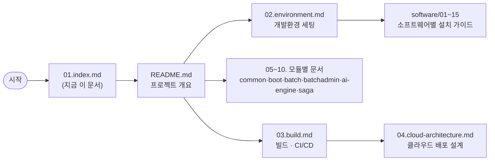

# 📖 dstone 문서 인덱스

`/app/dstone/docs` 아래 모든 `.md` 문서를 번호순으로 정리한 마스터 인덱스다. 이 폴더의 문서는 **2자리 번호 접두어**(`02.`, `03.`, ...)를 붙여 관리한다 — 파일 탐색기/에디터에서 정렬했을 때 "읽는 순서"가 그대로 파일 목록 순서가 되게 하기 위해서다. `docs/`(루트)와 `docs/software/`(하위 폴더)는 **각자 독립된 번호 체계**를 쓴다 — 예를 들어 `04.cloud-architecture.md`(루트)와 `software/04.mysql.md`(software)는 서로 무관한 별개의 문서다.

> ℹ️ **`README.md`는 번호를 붙이지 않는다(의도적 예외)**: GitHub/GitLab 등에서 폴더를 열었을 때 `README.md`를 자동으로 화면에 띄워주는 기능은 파일명이 정확히 `README.md`일 때만 동작한다 — 그래서 이 파일만 번호 규칙에서 제외하고 원래 이름을 유지한다. 파일 탐색기 등에서 이름순 정렬하면 숫자(`0`-`9`)가 대문자(`R`)보다 앞이라 `README.md`는 오히려 `01.index.md`~`10.dstone-saga.md` **뒤로 밀려서** 보이지만, 실제로 읽는 순서상으로는 이 인덱스(`01.index.md`) 바로 다음으로 가장 먼저 보는 문서다.

---

## 🗺️ 어디서부터 볼까?

- **처음 이 프로젝트를 받았다면**: `README.md` → `02.environment.md` → 필요한 `software/*.md` 순으로 읽으며 로컬 개발 환경을 세팅한다.
- **특정 모듈(예: AI 엔진)의 기능/API를 알고 싶다면**: 아래 "모듈별 문서" 표에서 바로 해당 파일로 이동한다.
- **빌드/배포/CI-CD 방식이 궁금하다면**: `03.build.md`(빌드·산출물·파이프라인 개요) → `04.cloud-architecture.md`(왜 그렇게 설계했는지, K8s/VM 매핑 상세) 순으로 본다.

---

## 🏗️ 개발환경 · 빌드 · 아키텍처 문서 (`docs/`)

| 파일명(링크) | 간략 설명 |
|---|---|
| [README.md](README.md) | 🏠 프로젝트 전체 개요 — 모듈 구성/의존관계, 공통 아키텍처 패턴(설정 분리·보안·DB), 인프라 요구사항 (번호 없음 — GitHub 자동 렌더링용 예외) |
| [02.environment.md](02.environment.md) | 💻 WSL 개발 환경에 설치된 전체 소프트웨어 목록, 시작/정지 스크립트(`~/start.sh` 등) 운용, 환경을 다른 PC로 이전(export/import)하는 절차 |
| [03.build.md](03.build.md) | 🔨 전 모듈 빌드 명령, 산출물, VM 스타일(`bin/*.sh`)/컨테이너(kind) 배포 방식, Jenkins CI/CD 파이프라인 종합 정리 |
| [04.cloud-architecture.md](04.cloud-architecture.md) | ☁️ dstone을 실제 클라우드 아키텍처와 유사하게 운용하기 위한 설계 기록 — 무엇을 무엇에 대응시켰고 왜 그런지(K8s 배포, VM 운영, CI/CD 네트워킹 상세) |

## 📦 모듈별 문서 (`docs/`)

| 파일명(링크) | 간략 설명 |
|---|---|
| [05.dstone-common.md](05.dstone-common.md) | 🧰 전 모듈이 공유하는 공통 라이브러리 — 유틸리티, Jasypt 암호화(`ENC(...)`), 데이터 접근, 메시징 |
| [06.dstone-boot.md](06.dstone-boot.md) | 🌐 웹 애플리케이션 프레임워크(WAR) — Spring Security, OAuth2 소셜 로그인, Java 소스 코드 정적 분석기 |
| [07.dstone-batch.md](07.dstone-batch.md) | ⚙️ Spring Batch 기반 배치 잡 개발 프레임워크(JAR) — `@AutoRegJob` 표준 잡 등록 패턴 |
| [08.dstone-batchadmin.md](08.dstone-batchadmin.md) | 🎛️ `dstone-batch` 잡을 관리하는 웹 애플리케이션(WAR) — 목록/상세/이력 조회, 시작·중지·재시작, CRON 자동 스케줄링 |
| [09.dstone-ai-engine.md](09.dstone-ai-engine.md) | 🤖 Spring AI 기반 provider-agnostic AI/MLOps 엔진(JAR) — Chat/Gateway/Session/Prompt(Phase 0~1), RAG(Phase 2), Agent·Tool/Function Calling(Phase 3), **Governance·API Key 인증(Phase 4, 진행 중)** |
| [10.dstone-saga.md](10.dstone-saga.md) | 🔄 SAGA + Outbox 패턴 샘플 기능의 전체 실행 흐름 추적(기동 초기화 → 사가 시작 → Outbox 릴레이 → Kafka 컨슈머 → 종결/보상) |

---

## 💿 소프트웨어 설치 가이드 (`docs/software/`)

WSL 개발 환경에 필요한 소프트웨어별 설치·설정·서비스 시작/정지 절차다. 번호는 [02.environment.md](02.environment.md) 2절에 정리된 설치 순서를 그대로 따른다.

| 파일명(링크) | 간략 설명 |
|---|---|
| [software/01.jdk.md](software/01.jdk.md) | ☕ OpenJDK 21 설치 |
| [software/02.maven.md](software/02.maven.md) | 📦 Apache Maven 설치 |
| [software/03.git.md](software/03.git.md) | 🔧 Git 설치 및 리포지토리 클론/연결 |
| [software/04.mysql.md](software/04.mysql.md) | 🐬 MySQL Server 설치 · 계정/스키마 구성 · 서비스 시작/정지 |
| [software/05.postgresql.md](software/05.postgresql.md) | 🐘 PostgreSQL 설치(+ pgvector, RAG 벡터 저장소용) |
| [software/06.redis.md](software/06.redis.md) | 🟥 Redis 설치 · 서비스 시작/정지(세션·대화 히스토리 저장) |
| [software/07.rabbitmq.md](software/07.rabbitmq.md) | 🐰 RabbitMQ 설치 · dstone용 vhost/사용자/큐/익스체인지 구성 · 서비스 시작/정지 |
| [software/08.kafka.md](software/08.kafka.md) | 📨 Apache Kafka(KRaft 모드) 설치 · 리스너 구성 · 서비스 시작/정지 |
| [software/09.kafbat-ui.md](software/09.kafbat-ui.md) | 🔍 Kafka 관리 콘솔(Kafbat UI) 설치 |
| [software/10.docker.md](software/10.docker.md) | 🐳 Docker CE + Compose plugin 설치 · 서비스 시작/정지 |
| [software/11.kubernetes.md](software/11.kubernetes.md) | ☸️ kubectl + kind(로컬 K8s) 설치 · 클러스터/로컬 레지스트리 시작·정지 |
| [software/12.jenkins.md](software/12.jenkins.md) | 🚀 Jenkins 설치 · 서비스 시작/정지 · 파이프라인 Job 설정 |
| [software/13.nodejs.md](software/13.nodejs.md) | 🟩 Node.js + npm 설치 |
| [software/14.ollama.md](software/14.ollama.md) | 🦙 Ollama(로컬 LLM/임베딩 런타임) 설치 · `dstone-ai-engine` RAG 임베딩(`bge-m3`) 연동 · 서비스 시작/정지 |
| [software/15.ollama-webui-lite.md](software/15.ollama-webui-lite.md) | 🖥️ Ollama 관리 콘솔(Ollama Web UI Lite) 설치 · CORS/IPv6 연동 이슈 해결 |

---

## 🖼️ 그 밖의 자료 (md 외)

인덱스 대상은 아니지만 문서 본문에서 참조되는 보조 자료다 — 필요할 때 아래 항목이 있다는 정도만 기억해두면 된다.

- **다이어그램**: [images/](images/) — 각 문서 본문에 인라인으로 삽입되는 SVG (Jenkins 파이프라인 흐름, SAGA 실행 흐름 등). 목록은 [README.md 2.3절](README.md#23-다이어그램-images) 참고.
- **데이터 파일**: [data/](data/) — Postman 컬렉션(`dstone-batch`/`dstone-ai-engine` API 호출용), RabbitMQ Definitions JSON. 목록은 [README.md 2.4절](README.md#24-데이터-파일-data) 참고.

---

## 📝 문서 관리 규칙

- 새 문서를 추가할 때는 해당 폴더(`docs/` 또는 `docs/software/`)의 다음 번호를 이어서 붙이고, 이 인덱스에도 행을 추가한다.
- `CLAUDE.md`, 각 모듈의 `conf/*.properties`/`application.yml` 등 **`docs/` 바깥에서 문서를 경로로 직접 참조하는 곳**이 있다 — 문서를 다시 rename/이동할 때는 이 인덱스뿐 아니라 그런 외부 참조도 함께 갱신해야 한다(예: `CLAUDE.md`의 `docs/software/14.ollama.md`, `docs/04.cloud-architecture.md` 참조).
- 문서 내용은 `CLAUDE.md`의 "Documentation" 원칙(리소스 변경 시 관련 문서를 확인하고 필요하면 갱신)을 따른다.
