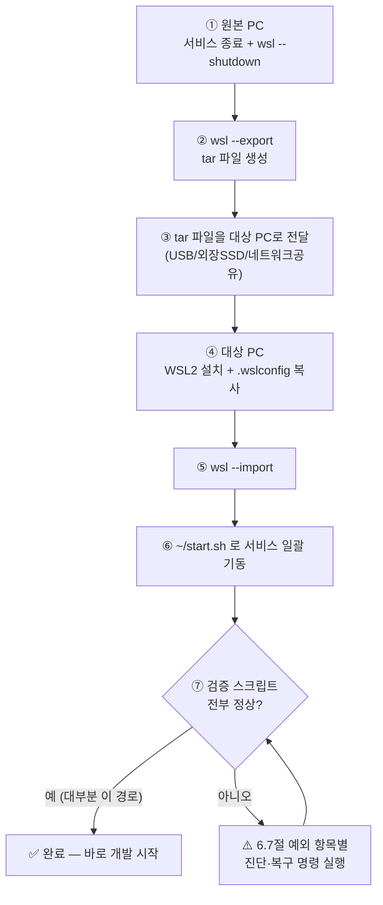

# 개발 환경 (WSL) 소프트웨어 목록

## 목차

- [1. 운영 원칙 (중요)](#1-운영-원칙-중요)
- [2. 목록](#2-목록)
- [3. 클라우드 아키텍처 시뮬레이션](#3-클라우드-아키텍처-시뮬레이션)
- [4. dstone 프로젝트와의 연결 관계](#4-dstone-프로젝트와의-연결-관계)
- [5. 개발환경 시작/정지 (`~/start.sh` / `~/stop.sh`)](#5-개발환경-시작정지-startsh--stopsh)
- [6. WSL Export/Import로 개발 환경 이전하기](#6-wsl-exportimport로-개발-환경-이전하기)

dstone 프로젝트를 개발하기 위해 WSL(Ubuntu) 환경에 수동으로 설치·구성한 소프트웨어 목록이다.
각 항목의 설치 방법 및 상세 설정은 `docs/software/{소프트웨어명}.md` 문서를 참고한다.

- 최초 작성일: 2026-09-03
- 대상 환경: WSL2 Ubuntu 26.04 LTS (Resolute Raccoon)
- 갱신 방식: 새 소프트웨어를 설치하거나 주요 설정을 변경할 때마다 이 문서와 `docs/software/*.md`를 함께 갱신한다.

## 1. 운영 원칙 (중요)

WSL은 기본적으로 systemd 서비스를 부팅 시 자동 기동하지 않도록 운용 중이다. 그래서 DB/메시징/CI 등 대부분의 서비스는
`/usr/local/bin/start-*.sh`, `/usr/local/bin/stop-*.sh` 스크립트로 수동 기동/중지한다 (아래 표의 "시작 스크립트" 참고).
WSL을 재시작했다면 필요한 서비스를 먼저 `start-*.sh`로 올려야 한다.

## 2. 목록

| 구분 | 소프트웨어 | 버전(확인 시점) | 설치 방식 | 주요 포트 | 시작 스크립트 | 상세 문서 |
|---|---|---|---|---|---|---|
| 언어/런타임 | OpenJDK (JDK) | 21.0.12 | Ubuntu 공식 저장소 (`apt install openjdk-21-jdk`) | - | - | [01.jdk.md](software/01.jdk.md) |
| 빌드 도구 | Apache Maven | 3.9.12 | Ubuntu 공식 저장소 (`apt install maven`) | - | - | [02.maven.md](software/02.maven.md) |
| 형상관리 | Git | 2.53.0 | Ubuntu 공식 저장소 (`apt install git`) | - | - | [03.git.md](software/03.git.md) |
| 데이터베이스 | MySQL Server | 8.4.11 | Ubuntu 공식 저장소 (`apt install mysql-server`) | 3306 | `start-mysql.sh` / `stop-mysql.sh` | [04.mysql.md](software/04.mysql.md) |
| 데이터베이스 | PostgreSQL (+ pgvector 0.8.1-2) | 18.6 | Ubuntu 공식 저장소 (`apt install postgresql postgresql-18-pgvector`) | 5432 | `start-postgresql.sh` / `stop-postgresql.sh` | [05.postgresql.md](software/05.postgresql.md) |
| 캐시/세션 | Redis | 8.0.5 | Ubuntu 공식 저장소 (`apt install redis-server`) | 6379 | `start-redis.sh` / `stop-redis.sh` | [06.redis.md](software/06.redis.md) |
| 메시지 큐 | RabbitMQ | 4.0.5 | Ubuntu 공식 저장소 (`apt install rabbitmq-server`) | 5672 (AMQP), 15672 (관리 콘솔) | `start-rabbitmq.sh` / `stop-rabbitmq.sh` | [07.rabbitmq.md](software/07.rabbitmq.md) |
| 메시지 큐 | Apache Kafka (KRaft 모드) | 4.2.1 (Scala 2.13) | 수동 설치 (tar.gz, `/opt/kafka`) | 9092 (broker, 로컬/WSL 전용), 9094 (broker, kind Pod 전용), 9093 (controller) | `/opt/kafka/kafka-start.sh` (`start-kafka.sh`에 포함) | [08.kafka.md](software/08.kafka.md) |
| 관리 도구 | Kafbat UI (Kafka 관리 콘솔) | jar 배포판 | 수동 설치 (jar, `/opt/kafka/admin-tools/KafbatUI`) | 9099 | `/opt/kafka/admin-tools/KafbatUI/start.sh` (`start-kafka.sh`에 포함) | [09.kafbat-ui.md](software/09.kafbat-ui.md) |
| 컨테이너 | Docker CE + Compose plugin | 29.7.2 / Compose v5.5.0 | Docker 공식 저장소 (`download.docker.com`) | - (unix socket) | `start-docker.sh` / `stop-docker.sh` | [10.docker.md](software/10.docker.md) |
| 컨테이너 오케스트레이션 | kubectl + kind (로컬 K8s) | kubectl v1.37.0 / kind v0.27.0 | 수동 설치 (바이너리 다운로드, `/usr/local/bin`) | kind API 서버는 임의 포트 | `start-kube.sh` (`k8s-start.sh`) / `stop-kube.sh` (`k8s-stop.sh`) | [11.kubernetes.md](software/11.kubernetes.md) |
| CI/CD | Jenkins | 2.568.3 | Jenkins 공식 저장소 (`pkg.jenkins.io`) | 8080 | `start-jenkins.sh` / `stop-jenkins.sh` | [12.jenkins.md](software/12.jenkins.md) |
| 런타임(부가) | Node.js + npm | 20.20.2 / 10.8.2 | NodeSource 저장소 (`deb.nodesource.com`) | - | - | [13.nodejs.md](software/13.nodejs.md) |
| AI 모델 런타임 | Ollama | v0.33.3 | 수동 설치 (tar.zst, `/opt/ollama`, systemd 미등록) | 11434 | `start-ollama.sh` / `stop-ollama.sh` | [14.ollama.md](software/14.ollama.md) |
| 관리 도구 | Ollama Web UI Lite | git HEAD | 수동 설치 (`git clone`, `/opt/ollama-webui-lite`) | 3000 | `/opt/ollama-webui-lite/start.sh` (`start-ollama.sh`에 포함) | [15.ollama-webui-lite.md](software/15.ollama-webui-lite.md) |

한눈에 보는 그룹 구성:


## 3. 클라우드 아키텍처 시뮬레이션

dstone-boot와 dstone-ai-engine은 [kind](software/11.kubernetes.md)에 컨테이너 Pod로(단, dstone-ai-engine은 매니페스트만 준비된 상태로 아직 미배포), dstone-batch/dstone-batchadmin은 systemd 없이 `bin/*.sh` 쉘 스크립트로 제어되는 VM 스타일 프로세스로 운용한다. MySQL/Redis/RabbitMQ/Kafka/PostgreSQL/Ollama는 CSP 매니지드 서비스(또는 자체 호스팅 추론 서버)에 대응시켜 클러스터 바깥에 둔다. 설계 배경과 네트워킹/레지스트리/CI-CD 세부사항은 [04.cloud-architecture.md](04.cloud-architecture.md) 참고.

## 4. dstone 프로젝트와의 연결 관계

- **MySQL**: `dstone-common`/`dstone-boot`/`dstone-batch`/`dstone-batchadmin` 공통 메인 데이터 저장소(`sampleDB` 등). `conf/env.properties`의 `DB_HOST`/`DB_PORT`로 접속 정보 주입.
- **Redis**: `dstone-boot`의 분산 세션 저장소(`dstone:session` 네임스페이스).
- **RabbitMQ**: `dstone-boot`의 메시지 큐 연동.
- **Kafka**: 애플리케이션에서 메시징 연동 실험/개발용 (로컬 KRaft 단일 브로커).
- **Jenkins**: `dstone-batch/Jenkinsfile`, `dstone-boot/Jenkinsfile` 파이프라인 실행.
- **Docker / kind**: `dstone-boot`을 컨테이너 이미지로 빌드해 로컬 `kind` 클러스터에 Pod로 배포하는 환경(`dstone-boot/Dockerfile`, `dstone-boot/k8s/`). 상세는 [04.cloud-architecture.md](04.cloud-architecture.md) 참고.
- **PostgreSQL**: **(2026-09-08 변경)** `dstone-ai-engine`의 RAG(Phase 2) VectorStore(pgvector)가 사용한다 - `dstone_ai` 롤/DB에 `vector` 확장을 켜서 문서 임베딩을 저장한다. 상세: [05.postgresql.md 6절](software/05.postgresql.md#6-dstone-프로젝트에서의-역할).
- **Ollama**: `dstone-ai-engine`의 RAG(Phase 2) 임베딩 전용 로컬 모델 런타임(`bge-m3`). Anthropic은 임베딩 API가 없고 이 환경엔 OpenAI 키 대신 로컬 모델을 쓰기로 해서 추가했다 - 채팅(Claude)과는 무관하다.
- **Ollama Web UI Lite**: Ollama 모델 조회/pull/삭제·수동 채팅 테스트용 관리 콘솔. `dstone` 애플리케이션 자체와는 직접적인 런타임 의존관계가 없는 부가 도구(Kafka의 Kafbat UI와 같은 역할) - `start-ollama.sh`/`stop-ollama.sh`가 Ollama와 함께 기동/중지한다.
- **Node.js**: 현재 dstone 서비스 자체 설정(`application.yml`)에서는 사용하지 않는 것으로 보이며, 개발 환경 실습/부가 도구 용도로 설치되어 있음. 실제 프로젝트 연동이 생기면 이 문서와 CLAUDE.md를 갱신할 것.

## 5. 개발환경 시작/정지 (`~/start.sh` / `~/stop.sh`)

WSL을 새로 띄운 뒤 개발환경 전체를 한 번에 올리고 내리기 위한 최상위 스크립트다. 각 소프트웨어별 `start-*.sh`/`stop-*.sh`(`/usr/local/bin`, root 소유, `755`)를 순서대로 호출하기만 하는 얇은 래퍼이며, 개별 소프트웨어의 설치/설정 자체는 [2. 목록](#2-목록) 표의 "상세 문서" 링크를 참고한다.

### 5.1 개발환경 시작 (`~/start.sh`)

```sh
#! /bin/sh

# docker
start-docker.sh

# kubenetes
start-kube.sh

# mysql
start-mysql.sh

# postgresql
start-postgresql.sh

# rabbitmq
start-rabbitmq.sh

# redis
start-redis.sh

# kafka
start-kafka.sh

# ollama
start-ollama.sh

# jenkins
start-jenkins.sh
```

`/usr/local/bin`에 있는 개별 `start-*.sh`를 순서대로 실행하기만 하는 쉘 스크립트다. **(2026-09-07 변경) 순서 제약이 사라졌다.** 예전에는 MySQL(`mysqld.cnf`)과 Redis(`redis.conf`)가 `bind-address`/`bind`에 `127.0.0.1`뿐 아니라 `172.18.0.1`(Docker의 `kind` 브리지 네트워크 게이트웨이)도 명시적으로 나열하고 있었다. `kind` 클러스터 안에서 도는 `dstone-boot` Pod가 host의 MySQL/Redis에 접근하려면 이 게이트웨이 IP로 접속해야 하기 때문인데, 이 IP는 dockerd가 뜨고 `kind` 네트워크 브리지(`br-*`)가 attach된 뒤에만 존재해서 **Docker/kind가 뜨기 전에 mysql·redis를 먼저 켜면 `bind: Cannot assign requested address`로 기동이 실패**했다 (2026-09-06 장애 진단 참고 — 과거에는 mysql/postgresql/rabbitmq/redis/kafka → docker → kube 순서였고, MySQL은 systemd 자동 재시작 타이밍이 맞아 우연히 살아났지만 Redis는 `StartLimitBurst`(기본 5회/10초)에 걸려 항상 죽어 있었다).

이 레이스 컨디션을 근본적으로 없애기 위해 MySQL/Redis의 바인딩을 `0.0.0.0`(모든 인터페이스)으로 바꿨다(상세는 [04.mysql.md 4절](software/04.mysql.md#4-서비스-시작중지), [06.redis.md 4절](software/06.redis.md#4-서비스-시작중지) 참고). 이러면 mysql/redis 기동 시점에 `172.18.0.1`이 존재하든 안 하든 상관없고, 이후 Docker/kind가 떠서 그 IP가 새로 생겨도 mysql/redis 재시작 없이 바로 접근된다. **따라서 이제 위 목록의 순서는 예시일 뿐이며, 필요에 따라 선택적으로 구성하면 된다:**

- **온프레미스만(Docker/kind 불필요)**: mysql/postgresql/rabbitmq/redis/kafka 등 "일반 소프트웨어 그룹"만 올리고, `dstone-boot`은 `dstone-boot/bin/startApp.sh`(`-Dspring.profiles.active=wsl`, `localhost` 접속)로 WSL에 네이티브 기동한다.
- **클라우드(kind)까지 포함**: 위에 더해 `start-docker.sh`/`start-kube.sh`로 Docker/kind를 올리고, `k8s` 프로파일 기반 컨테이너로 `dstone-boot`을 배포한다([04.cloud-architecture.md](04.cloud-architecture.md) 참고).

각 `start-*.sh`의 실제 내용과 상세 설명은 해당 소프트웨어 문서에 있다 (스크립트 원문을 이 문서에 중복 기재하지 않고 링크만 둔다):

#### 5.1.1 Docker 시작 (`/usr/local/bin/start-docker.sh`)
→ [10.docker.md 4절](software/10.docker.md#4-서비스-시작중지)

#### 5.1.2 Kubernetes 시작 (`/usr/local/bin/start-kube.sh`)
→ [11.kubernetes.md 5절](software/11.kubernetes.md#5-서비스클러스터-시작중지)

#### 5.1.3 MySQL 시작 (`/usr/local/bin/start-mysql.sh`)
→ [04.mysql.md 4절](software/04.mysql.md#4-서비스-시작중지)

#### 5.1.4 PostgreSQL 시작 (`/usr/local/bin/start-postgresql.sh`)
→ [05.postgresql.md 4절](software/05.postgresql.md#4-서비스-시작중지)

#### 5.1.5 RabbitMQ 시작 (`/usr/local/bin/start-rabbitmq.sh`)
→ [07.rabbitmq.md 4절](software/07.rabbitmq.md#4-서비스-시작중지)

#### 5.1.6 Redis 시작 (`/usr/local/bin/start-redis.sh`)
→ [06.redis.md 4절](software/06.redis.md#4-서비스-시작중지)

#### 5.1.7 Kafka 시작 (`/usr/local/bin/start-kafka.sh`)
→ [08.kafka.md 5절](software/08.kafka.md#5-서비스-시작중지) (+ [09.kafbat-ui.md 5절](software/09.kafbat-ui.md#5-서비스-시작중지))

#### 5.1.8 Ollama 시작 (`/usr/local/bin/start-ollama.sh`)
→ [14.ollama.md 4절](software/14.ollama.md#4-서비스-시작중지)

#### 5.1.9 Jenkins 시작 (`/usr/local/bin/start-jenkins.sh`)
→ [12.jenkins.md 5절](software/12.jenkins.md#5-서비스-시작중지)

### 5.2 개발환경 정지 (`~/stop.sh`)

```sh
#! /bin/sh

# mysql
stop-mysql.sh

# postgresql
stop-postgresql.sh

# rabbitmq
stop-rabbitmq.sh

# redis
stop-redis.sh

# kafka
stop-kafka.sh

# ollama
stop-ollama.sh

# docker
stop-docker.sh

# kubenetes
stop-kube.sh

# jenkins
stop-jenkins.sh
```

`/usr/local/bin`에 있는 개별 `stop-*.sh`를 순서대로 실행하기만 하는 쉘 스크립트다. 정지 순서는 기동 순서(5.1)만큼 엄격하지 않다 — Docker/kind가 살아있는 동안 mysql/redis를 먼저 내려도 재현되는 장애는 없다. 5.1과 마찬가지로 각 `stop-*.sh`의 상세는 해당 소프트웨어 문서를 참고한다.

#### 5.2.1 MySQL 정지 (`/usr/local/bin/stop-mysql.sh`)
→ [04.mysql.md 4절](software/04.mysql.md#4-서비스-시작중지)

#### 5.2.2 PostgreSQL 정지 (`/usr/local/bin/stop-postgresql.sh`)
→ [05.postgresql.md 4절](software/05.postgresql.md#4-서비스-시작중지)

#### 5.2.3 RabbitMQ 정지 (`/usr/local/bin/stop-rabbitmq.sh`)
→ [07.rabbitmq.md 4절](software/07.rabbitmq.md#4-서비스-시작중지)

#### 5.2.4 Redis 정지 (`/usr/local/bin/stop-redis.sh`)
→ [06.redis.md 4절](software/06.redis.md#4-서비스-시작중지)

#### 5.2.5 Kafka 정지 (`/usr/local/bin/stop-kafka.sh`)
→ [08.kafka.md 5절](software/08.kafka.md#5-서비스-시작중지) (+ [09.kafbat-ui.md 5절](software/09.kafbat-ui.md#5-서비스-시작중지))

#### 5.2.6 Ollama 정지 (`/usr/local/bin/stop-ollama.sh`)
→ [14.ollama.md 4절](software/14.ollama.md#4-서비스-시작중지)

#### 5.2.7 Docker 정지 (`/usr/local/bin/stop-docker.sh`)
→ [10.docker.md 4절](software/10.docker.md#4-서비스-시작중지)

#### 5.2.8 Kubernetes 정지 (`/usr/local/bin/stop-kube.sh`)
→ [11.kubernetes.md 5절](software/11.kubernetes.md#5-서비스클러스터-시작중지) — `--delete` 옵션(클러스터 완전 삭제)은 [11.kubernetes.md 6절](software/11.kubernetes.md#6-로컬-사설-레지스트리-dstone-boot--dstone-ai-engine-이미지-배포용)에 정리되어 있으며, `~/stop.sh` 경유로는 전달할 수 없어 필요하면 `k8s-stop.sh --delete`를 직접 호출해야 한다.

**주의**: 5.2.7(`stop-docker.sh`)과 5.2.8(`stop-kube.sh`)이 각각 dockerd를 내리는 경로를 갖고 있어 dockerd 정지 시도가 사실상 중복 실행된다(문제는 없음 — 상세는 두 문서 참고).

#### 5.2.9 Jenkins 정지 (`/usr/local/bin/stop-jenkins.sh`)
→ [12.jenkins.md 5절](software/12.jenkins.md#5-서비스-시작중지)

트러블슈팅(예: mysql/redis 기동 실패 시 진단 절차, 과거의 `bind-address`/`172.18.0.1` 레이스 컨디션 이력)은 각 소프트웨어 문서(`04.mysql.md`, `06.redis.md`, `10.docker.md`, `11.kubernetes.md`)의 시작/중지 절을 참고.

## 6. WSL Export/Import로 개발 환경 이전하기

> 🎯 **이 절의 목표**: 이 절 하나만 위에서 아래로 그대로 따라가면(명령어를 그대로 복사/붙여넣기 실행), 지금 이 PC에 구축된 WSL 개발 환경(JDK/Maven/MySQL/PostgreSQL/Redis/RabbitMQ/Kafka/Ollama/Docker/kind/Jenkins 전부 + `/app/dstone` 프로젝트 자체)을 **다른 PC에서 거의 동일하게** 재현할 수 있다. `wsl --export`/`wsl --import`는 배포판 전체를 파일 그대로 복제하는 것이라 [2. 목록](#2-목록)의 소프트웨어를 하나씩 재설치할 필요가 없다 — 대신 "파일은 복사되지만 실행 중 상태나 PC 고유 정보는 복사되지 않는" 지점들이 있고, 이 환경을 실제로 구성하면서 겪었던 예외 사례들(바인딩 레이스 컨디션, pgvector 확장 누락, RabbitMQ vhost 미구성 등)이 새 PC에서 그대로 재발할 수 있다. 아래 절차는 그 예외들을 **점검 명령 + 안 되면 바로 쓸 수 있는 복구 명령**까지 각 단계에 포함해뒀다.



### 6.1 배경 — 왜 export/import 한 번으로 재현되는가

- 이 환경의 소프트웨어(JDK, Maven, MySQL, PostgreSQL, Redis, RabbitMQ, Kafka, Ollama, Docker, kind, Jenkins)와 그 데이터/설정, 그리고 `/app/dstone` 프로젝트(git 저장소, `conf/env*.properties`, Jasypt 복호화 키가 하드코딩된 `EncUtil.java` 포함) 전부가 `/mnt/c` 같은 Windows 쪽 경로가 아니라 **WSL 배포판 자체의 ext4 루트 파일시스템(`/`) 안**에 있다. `df -h /` 기준 현재 사용량은 약 45G(전체 가상 디스크 크기는 1007G, `.wslconfig`의 `sparseVhd=true`로 실제 사용한 만큼만 디스크를 차지). 배포판을 통째로 tar로 내보내고(export) 다른 PC에서 그대로 복원하면(import), 이 파일시스템 전체가 그대로 옮겨진다.
- **Jasypt `ENC(...)` 값은 재암호화가 필요 없다.** 복호화 키가 환경변수가 아니라 `dstone-common`의 `EncUtil.java` 소스 코드 자체에 고정돼 있고, 이 소스도 `/app/dstone` git 저장소의 일부로 함께 복사되기 때문에 `application.yml`의 모든 `ENC(...)` 값(DB 비밀번호, Anthropic API 키 등)이 새 PC에서도 그대로 복호화된다.
- 현재 등록된 배포판은 `wsl -l -v` 기준 이름 `Ubuntu`(WSL 버전 2)이며, `/etc/wsl.conf`에 `systemd=true`와 기본 사용자 `jysn007`이 이미 지정되어 있어 이 설정도 export/import에 포함된다.
- 반대로 **"파일이 아니라 PC/네트워크 환경에 의존하는 것"은 복사돼도 그대로 동작한다는 보장이 없다** — Windows 쪽에만 있는 설정(`.wslconfig`), Docker/kind처럼 커널 네임스페이스·cgroup 등 런타임 상태를 갖는 것, RabbitMQ처럼 호스트명을 노드 식별자로 쓰는 것, "PC 두 대 동시 사용" 시 충돌하는 것(Jenkins 등)이 대표적이다. 이런 항목은 6.4/6.7절에서 점검·복구 명령까지 함께 다룬다.

### 6.2 원본 PC에서 사전 준비

1. 서비스 정상 종료: [5.2절](#52-개발환경-정지-stopsh)의 `~/stop.sh`로 mysql/postgresql/rabbitmq/redis/kafka/ollama/docker/kube/jenkins를 내린다.
   ```bash
   ~/stop.sh
   ```
2. 디스크 여유 공간을 먼저 확인한다 — export되는 tar 파일은 현재 `/` 사용량과 비슷한 크기가 된다.
   ```bash
   df -h /
   ```
3. Windows PowerShell(관리자 권한 권장)에서 WSL 전체를 완전히 종료한다.
   ```powershell
   wsl --shutdown
   ```
   실행 중인 배포판을 export하면 파일시스템 일관성이 깨질 수 있으므로, **반드시 `--shutdown` 이후 몇 초 뒤에** export한다 (`wsl -l -v`로 상태가 `Stopped`인지 확인하고 진행하면 더 안전하다).

### 6.3 Export (원본 PC, Windows PowerShell)

```powershell
# 1) 배포판 이름/상태 확인 (Ubuntu, Stopped 여야 함)
wsl -l -v

# 2) 내보낼 폴더 생성 (없으면)
New-Item -ItemType Directory -Force -Path D:\wsl-backup | Out-Null

# 3) 배포판 전체를 tar로 내보내기
wsl --export Ubuntu D:\wsl-backup\dstone-ubuntu.tar

# 4) (선택) 압축본으로 내보내기 — WSL 버전에 따라 --format 옵션 미지원일 수 있음, 그러면 3번 방식만 사용
wsl --version   # "WSL 버전" 확인
wsl --export Ubuntu D:\wsl-backup\dstone-ubuntu.tar.gz --format tar.gz

# 5) 파일 생성/크기 확인
Get-Item D:\wsl-backup\dstone-ubuntu.tar* | Select-Object Name, Length, LastWriteTime
```

만들어진 tar 파일을 USB, 외장 드라이브, 사내 네트워크 공유, 클라우드 스토리지 등으로 대상 PC에 옮긴다. **이 파일 안에는 DB 비밀번호, Jasypt 복호화 키가 담긴 소스, Jenkins Credential/SSH 배포 키 등 민감정보가 평문 그대로(또는 이 저장소만으로 복호화 가능한 형태로) 들어있으므로**, USB 분실이나 접근 권한이 없는 네트워크 공유에 올려두는 것을 피하고 전송·보관 경로를 신뢰할 수 있는 채널로 한정한다.

### 6.4 대상 PC 준비

1. **WSL2 자체 설치** (Windows 11, 또는 WSL2를 지원하는 Windows 10):
   ```powershell
   wsl --install --no-distribution
   ```
   Microsoft Store의 Ubuntu 앱을 따로 받을 필요는 없다 — import 자체가 새 배포판을 만드는 과정이다. 설치 후 재부팅을 요구하면 재부팅한다.
2. **WSL 커널/버전이 최신인지 확인** (`networkingMode=mirrored`를 쓰려면 필요):
   ```powershell
   wsl --update
   wsl --version
   ```
3. **`.wslconfig` 이전**: 원본 PC의 `C:\Users\<사용자명>\.wslconfig`를 대상 PC의 동일 경로로 복사한다. 현재 값:
   ```ini
   [wsl2]
   networkingMode=mirrored

   memory=8GB
   processors=4
   swap=2GB

   [experimental]
   hostAddressLoopback=true
   autoProxy=true
   autoMemoryReclaim=gradual
   sparseVhd=true
   ```
   - ⚠️ **`memory`/`processors`/`swap`은 대상 PC의 실제 사양에 맞게 반드시 다시 조정한다** — 원본 PC 값을 그대로 옮기면 대상 PC 메모리가 부족해 MySQL/PostgreSQL/Kafka/kind 동시 기동 시 OOM이 날 수 있다. Docker/kind까지 쓸 계획이면 최소 8GB 이상을 권장한다([11.kubernetes.md 1절](software/11.kubernetes.md#1-개요) 참고).
   - ⚠️ **`networkingMode=mirrored`는 Windows 11 22H2 이상 + WSL 커널 업데이트가 필요하다.** 대상 PC가 조건을 만족하지 못하면 WSL 시작 시 조용히 무시되거나 오류가 날 수 있다 — 이 경우 이 줄을 지우고 기본(NAT) 네트워킹으로 동작시킨다. **NAT 모드로 바뀌면 `localhost` 포트포워딩 동작과 `172.18.0.1`(kind 브리지 게이트웨이) 전제가 mirrored 모드와 달라질 수 있으므로**, [04.cloud-architecture.md](04.cloud-architecture.md)의 네트워킹 섹션을 재확인하고 6.7.1/6.7.3절의 Docker/kind·Kafka 점검 항목을 특히 꼼꼼히 확인한다.
   - 수정 후 반영을 위해:
     ```powershell
     wsl --shutdown
     ```

### 6.5 Import (대상 PC, Windows PowerShell)

```powershell
# 1) 설치 위치(빈 폴더) 생성
New-Item -ItemType Directory -Force -Path D:\WSL\Ubuntu-dstone | Out-Null

# 2) wsl --import <배포판이름> <설치위치> <tar 파일 경로> --version 2
wsl --import Ubuntu-dstone D:\WSL\Ubuntu-dstone D:\wsl-backup\dstone-ubuntu.tar --version 2

# 3) 등록 확인
wsl -l -v

# 4) 접속 (기본 사용자로 들어가지는지 확인)
wsl -d Ubuntu-dstone
whoami            # jysn007 이 나와야 함
```

- 배포판 이름은 자유롭게 정할 수 있다(원본과 똑같이 `Ubuntu`로 해도 되고, 대상 PC에 이미 다른 용도의 `Ubuntu` 배포판이 있다면 `Ubuntu-dstone`처럼 구분되는 이름을 쓴다). 이 프로젝트나 문서 어디에도 배포판 이름 자체를 코드에서 참조하는 곳은 없으므로 이름은 운영에 영향을 주지 않는다.
- `/etc/wsl.conf`에 이미 기본 사용자(`jysn007`)와 `systemd=true`가 들어있는 상태로 import되므로 별도 설정 없이 `wsl -d Ubuntu-dstone` 실행 시 jysn007 사용자로 systemd가 뜬 상태로 들어가야 한다.
- **`whoami`가 `jysn007`이 아니라 `root`로 나오면**, `/etc/wsl.conf`의 `[user]` 섹션이 온전히 복사됐는지 확인한다:
  ```bash
  cat /etc/wsl.conf
  # [user] default=jysn007 이 없다면 아래로 직접 추가 후
  # (Windows PowerShell에서) wsl --shutdown 후 wsl -d Ubuntu-dstone 재접속
  ```
- **systemd가 안 떠 있다면** (`systemctl` 실행 시 `System has not been booted with systemd` 등 오류):
  ```bash
  cat /etc/wsl.conf   # [boot] systemd=true 확인
  ```
  Windows에서 `wsl --shutdown` 후 재접속해도 안 되면 WSL 자체 업데이트(`wsl --update`, 6.4절 2번)가 안 돼 있을 가능성이 크다.

### 6.6 대상 PC: 서비스 일괄 기동 (여기서부터가 "실행만 하면 되는" 구간)

```bash
# WSL 안에서 실행
cd /app/dstone && git status && git log --oneline -3   # 프로젝트가 절대경로 그대로 살아있는지 먼저 확인

~/start.sh
```

`~/start.sh`는 [5.1절](#51-개발환경-시작-startsh)에서 설명한 대로 docker → kube → mysql → postgresql → rabbitmq → redis → kafka → ollama → jenkins 순으로 개별 `start-*.sh`를 호출한다. MySQL/Redis 바인딩이 `0.0.0.0`으로 열려 있어 순서 제약은 없지만(5.1절 참고), **한 번 실행 후 바로 아래 6.7절 검증을 돌려서 전부 정상인지 확인하고 넘어가는 것**을 권장한다 — 이 시점에서 이상이 있으면 서비스를 하나씩 다시 켤 필요 없이 문제 있는 항목만 짚어 고칠 수 있다.

### 6.7 예외사항 점검 & 복구 — 항목별 실제 명령

아래 표의 각 행은 "이 환경을 만들면서 실제로 한 번 이상 겪었던 문제"다. **대부분은 정상이라 확인만 하면 끝나지만**, 혹시 걸리면 바로 옆의 복구 명령을 그대로 실행하면 된다.

#### 6.7.1 Docker / kind — 가장 깨지기 쉬운 항목

Docker/kind는 커널 네트워크 네임스페이스·cgroup 같은 **런타임 상태**를 갖고 있어서, 파일은 복사돼도 컨테이너가 그 상태 그대로 다시 살아난다는 보장이 가장 약한 영역이다.

```bash
# 1) dockerd 정상 기동 확인
docker info > /dev/null && echo "OK: dockerd 정상"

# 2) kind 클러스터/노드 상태 확인
kind get clusters
kubectl get nodes
docker ps -a --filter "name=dev-control-plane"
```

- **`kubectl get nodes`가 응답 없음/타임아웃, 또는 노드가 `NotReady`, 또는 `docker ps -a`에 `dev-control-plane`이 `Exited` 상태로만 보이는 경우** — 대부분 컨테이너를 그대로 되살리려 하지 말고 **깨끗하게 삭제 후 재생성**하는 편이 빠르고 안전하다:
  ```bash
  k8s-stop.sh --delete       # kind 클러스터 완전 삭제 (~/stop.sh 경유로는 --delete 전달 불가, 직접 호출)
  docker rm -f kind-registry 2>/dev/null   # 로컬 레지스트리 컨테이너도 함께 정리(있었다면)
  start-kube.sh              # k8s-start.sh가 레지스트리+클러스터를 처음부터 재생성
  kubectl get nodes           # Ready 확인
  ```
- **로컬 사설 레지스트리(`localhost:5000`) 재확인** — 클러스터를 재생성했다면 레지스트리 컨테이너도 새로 만들어진 것이라 이전에 push했던 이미지는 남아있지 않다:
  ```bash
  docker network inspect kind --format '{{range .Containers}}{{.Name}}{{"\n"}}{{end}}'   # kind-registry가 보여야 함
  ```
  `dstone-boot`(또는 `dstone-ai-engine`)을 kind에 배포해서 쓰고 있었다면, 이미지를 다시 빌드/push하고 재배포한다([03.build.md 6절](03.build.md#6-dstone-boot--dstone-ai-engine--컨테이너-빌드--kind-배포)):
  ```bash
  cd /app/dstone
  docker build -f dstone-boot/Dockerfile -t localhost:5000/dstone-boot:latest .
  docker push localhost:5000/dstone-boot:latest
  kubectl apply -f dstone-boot/k8s/
  kubectl rollout restart deployment/dstone-boot -n dstone
  kubectl get pods -n dstone
  ```
- **kind 브리지 게이트웨이 IP가 `172.18.0.1`이 아닌 경우** — Docker는 이미 다른 네트워크가 있는 새 PC에서 `kind` 네트워크에 다른 서브넷을 할당할 수 있다(예: `172.19.0.1`). 이 환경의 Kafka DOCKER 리스너(6.7.3절)는 `172.18.0.1`을 하드코딩하고 있으므로 실제 IP와 비교 확인한다:
  ```bash
  docker network inspect kind --format '{{(index .IPAM.Config 0).Gateway}}'
  ```
  값이 `172.18.0.1`이 아니면, `dstone-boot`을 kind에서 쓸 때 참고하는 [04.cloud-architecture.md](04.cloud-architecture.md)의 네트워킹 섹션과 아래 6.7.3절의 Kafka `advertised.listeners`를 실제 값으로 갱신해야 한다(단순 로컬 개발 — kind/Pod에서 Kafka에 접근할 계획이 없다면 당장은 무시해도 무방).

#### 6.7.2 RabbitMQ — vhost/큐가 안 보일 수 있다 (호스트명 이슈)

RabbitMQ는 내부적으로 **리눅스 호스트명을 노드 식별자**(`rabbit@<hostname>`)로 써서 데이터를 저장한다. WSL은 기본 설정(`/etc/wsl.conf`에 `[network] generateHosts=false`가 없는 상태)에서 **Windows PC의 컴퓨터 이름을 리눅스 호스트명으로 동기화**하므로, 원본 PC와 대상 PC의 Windows 컴퓨터 이름이 다르면 RabbitMQ가 이전과 다른 노드 이름으로 새로 뜨면서 6절에서 만들어둔 vhost/사용자/큐가 "사라진 것처럼" 보일 수 있다.

```bash
# 1) 현재 호스트명 확인 (원본 PC와 비교해볼 것)
hostname

# 2) RabbitMQ가 정상 기동했는지, 그리고 dstone용 구성이 살아있는지 확인
sudo rabbitmqctl status | head -5
sudo rabbitmqctl list_vhosts
sudo rabbitmqctl list_queues -p /dstone-mq name messages
```

- **`/dstone-mq` vhost가 안 보이거나 큐 목록이 비어 있으면**, [07.rabbitmq.md 7절](software/07.rabbitmq.md#7-기본-설정-import)에 정확히 이 상황을 위해 만들어둔 Definitions 파일로 한 번에 복구한다:
  ```bash
  sudo rabbitmqctl import_definitions /app/dstone/docs/data/rabbitmq-basic-config.json
  sudo rabbitmqctl list_vhosts                       # /dstone-mq 가 보이는지 재확인
  sudo rabbitmqctl list_queues -p /dstone-mq name    # app.notifications.queue / app.orders.queue 확인
  ```
  이 파일은 사용자 비밀번호를 해시로만 담고 있어 평문은 복구되지 않는다 — 새로 임포트한 경우 필요하면 비밀번호를 재설정한다:
  ```bash
  sudo rabbitmqctl change_password dstone <새비밀번호>   # 6절에서 만든 dstone 계정 기준 예시
  ```
  비밀번호를 바꿨다면 `dstone-boot/conf/application.yml`의 `spring.rabbitmq.username`/`password`(Jasypt `ENC(...)`)도 [04.mysql.md 7절](software/04.mysql.md#7-비밀번호jasypt-enc-다루기)의 방법으로 새로 암호화해 갱신해야 한다.

#### 6.7.3 Kafka — 브로커/토픽 확인

Kafka 데이터(`/opt/kafka/kafka_2.13-4.2.1/data/kraft-combined-logs`)와 `node.id`/`cluster.id`는 파일로 저장되므로 그대로 복사되고, `advertised.listeners`도 호스트명이 아니라 고정 IP(`127.0.0.1`, `172.18.0.1`)를 쓰므로 로컬(WSL 내부) 연결은 대부분 문제없이 살아난다.

```bash
KAFKA_BIN=/opt/kafka/kafka_2.13-4.2.1/bin
$KAFKA_BIN/kafka-topics.sh --bootstrap-server localhost:9092 --list
$KAFKA_BIN/kafka-broker-api-versions.sh --bootstrap-server localhost:9092 | head -3
```

- 토픽 목록이 비어있거나 접속 자체가 안 되면 `start-kafka.sh` 재실행 후 `/opt/kafka` 하위 로그(`journalctl`/`kafka-start.sh`가 남기는 로그)를 확인한다. `172.18.0.1` 기반 DOCKER 리스너는 kind/Pod에서 접근할 때만 쓰이므로, 로컬 개발만 한다면 이 리스너 오류는 무시해도 된다(6.7.1절 참고).

#### 6.7.4 PostgreSQL + pgvector — 롤/DB/확장 확인

```bash
sudo -u postgres psql -c "\du" | grep dstone_ai        # 롤 존재 확인
sudo -u postgres psql -l | grep dstone_ai               # DB 존재 확인
sudo -u postgres psql -d dstone_ai -c "\dx" | grep vector   # vector 확장 활성화 확인
```

- 위 세 확인이 전부 통과하면 데이터까지 그대로 복사된 것이므로 추가 조치가 필요 없다. 혹시 하나라도 비어 있으면(정상적인 export/import라면 발생하지 않아야 하지만) [05.postgresql.md 6절](software/05.postgresql.md#6-dstone-프로젝트에서의-역할)의 명령을 그대로 재실행한다:
  ```bash
  sudo -u postgres psql -c "CREATE ROLE dstone_ai LOGIN PASSWORD '<비밀번호>';"
  sudo -u postgres psql -c "CREATE DATABASE dstone_ai OWNER dstone_ai;"
  sudo -u postgres psql -d dstone_ai -c "CREATE EXTENSION IF NOT EXISTS vector;"
  ```
  `postgresql-18-pgvector` 패키지 자체가 새 PC에 없다는 `extension "vector" is not available` 오류가 나면(패키지는 apt로 설치하는 것이라 시스템 바이너리 위치에 따라 export/import로 안 옮겨질 수 있음) [05.postgresql.md 7절](software/05.postgresql.md#7-문제-해결-phase-2-설치-중-실제로-겪은-에러)의 7.2 항목대로 `sudo apt-get install -y postgresql-18-pgvector`부터 다시 설치한다.

#### 6.7.5 MySQL — 스키마 확인

```bash
sudo mysql -u root -e "SHOW DATABASES;"
# sampleDB / analyzeDB / dataflow / batchadmin 4개가 보여야 함
mysql -u sampleuser -psampleuser -h 127.0.0.1 -e "SHOW TABLES;" sampleDB
```

- 4개 DB가 전부 보이면 데이터까지 그대로 복사된 것이다. 혹시 스키마 자체를 처음부터 다시 만들어야 하는 상황이라면(예: DB 없이 소스만 새로 클론한 경우) [04.mysql.md 6절](software/04.mysql.md#6-dstone-데이터베이스사용자스키마-초기화-설치-후-필수)의 SQL을 순서대로 재실행한다.

#### 6.7.6 Ollama — 모델까지 그대로 복사됐는지 확인

모델 파일은 `/opt/ollama/data`(`OLLAMA_MODELS` 지정 경로) 안에 있어 export/import로 그대로 옮겨진다 — 수 GB짜리 모델을 다시 받을 필요가 없다는 뜻이다.

```bash
curl -s http://localhost:11434/api/tags | grep -o '"name":"[^"]*"'
# "bge-m3:latest" 와 "llama3.2:latest" 둘 다 보여야 함
```

- 둘 중 하나라도 없으면(용량 문제로 tar 전송 중 손상됐거나, 애초에 다른 PC에서 pull한 적 없는 경우) 다시 pull한다([14.ollama.md 4절](software/14.ollama.md#4-서비스-시작중지) 서버가 떠 있어야 함):
  ```bash
  /opt/ollama/bin/ollama pull bge-m3
  /opt/ollama/bin/ollama pull llama3.2
  ```

#### 6.7.7 Jenkins — 홈 디렉터리는 그대로, 단 동시 실행 금지

```bash
curl -I http://localhost:8080          # 응답 확인
```

- Jenkins 홈(`/var/lib/jenkins`: Job 설정, 빌드 이력, Credential, GitHub 배포용 SSH 키)이 파일 그대로 복사되므로 **재설정이 필요 없다.** 대신 **원본 PC와 대상 PC에서 동시에 같은 Jenkins를 띄우지 않는다** — 같은 Job이 두 인스턴스에서 동시에 GitHub/에이전트에 접속하면 빌드 충돌이 날 수 있다. 완전한 이전이 목적이면 원본은 6.9절대로 정리하거나 최소한 Jenkins만 내려둔다(`~/stop.sh` 또는 `stop-jenkins.sh`).
- Job의 SCM 설정이 로컬 경로(`file:///app/dstone`)가 아니라 실제 GitHub 원격 저장소를 가리키고 있어야 두 PC 어디서 실행하든 동일하게 동작한다 — Jenkins 관리 화면(`Manage Jenkins → System`)에서 Job의 Repository URL을 한 번 확인해둔다.

#### 6.7.8 Windows 전용 설정 — 자동으로 안 옮겨지는 것들

| 항목 | Import 후 상태 | 조치 |
|---|---|---|
| Windows `.wslconfig` | 배포판 밖(Windows 사용자 프로필)에 있어 **자동으로 복사되지 않음** | 6.4절대로 수동 복사 후 사양 재조정 |
| VS Code Remote-WSL 서버(`~/.vscode-server`) | 배포판 안에 있어 함께 복사됨 | Windows 쪽 VS Code에서 새 배포판(예: `Ubuntu-dstone`)으로 다시 연결만 하면 재사용됨 |
| WSL 네트워킹 모드(mirrored/NAT) | `.wslconfig` 값에 따름, 대상 PC의 Windows 버전 제약을 받음 | 6.4절 참고 — mirrored 불가 시 NAT로 폴백되고 kind 게이트웨이 IP 전제가 달라질 수 있음(6.7.1절) |

### 6.8 최종 통합 검증 스크립트 (대상 PC, 한 번에 실행)

6.7절을 다 확인했다면, 아래 한 블록으로 전체를 한 번 더 훑어 최종 확인한다. 그대로 복사해서 붙여넣으면 된다.

```bash
echo "== 언어/빌드 도구 =="
java -version && mvn -v && git --version

echo "== MySQL =="
sudo mysql -u root -e "SHOW DATABASES;" | grep -E "sampleDB|analyzeDB|dataflow|batchadmin"

echo "== PostgreSQL + pgvector =="
sudo -u postgres psql -d dstone_ai -c "\dx" | grep vector

echo "== Redis =="
redis-cli ping

echo "== RabbitMQ =="
sudo rabbitmqctl list_vhosts | grep dstone-mq
sudo rabbitmqctl list_queues -p /dstone-mq name

echo "== Kafka =="
/opt/kafka/kafka_2.13-4.2.1/bin/kafka-topics.sh --bootstrap-server localhost:9092 --list

echo "== Ollama =="
curl -s http://localhost:11434/api/tags | grep -o '"name":"[^"]*"'

echo "== Docker / kind =="
docker ps
kubectl get nodes

echo "== Jenkins =="
curl -I http://localhost:8080

echo "== dstone 프로젝트 빌드 =="
cd /app/dstone && mvn -pl dstone-common -am clean install
```

모든 출력이 정상이면 이전이 끝난 것이다. 모듈별 기동/빌드는 [03.build.md](03.build.md), 클라우드 아키텍처 관련 세부 검증(kind Pod 상태 등)은 [04.cloud-architecture.md](04.cloud-architecture.md)를 참고.

### 6.9 (선택) 원본 PC 배포판 정리 — "이전"이 목적일 때만

완전히 새 PC로 옮기고 원본은 더 이상 쓰지 않을 계획이라면, 원본 PC에서 배포판을 등록 해제할 수 있다. **배포판 파일 자체가 삭제되는 되돌릴 수 없는 작업**이므로, 반드시 대상 PC에서 6.8절 검증 스크립트가 전부 정상으로 통과하는 것을 확인한 뒤에만 실행한다.

```powershell
wsl --unregister Ubuntu
```

단순히 "복제해서 여러 PC에서 같이 쓰고 싶다"는 경우라면 이 단계는 생략하고 두 배포판을 각자 이름으로 유지하되, 6.7.7절의 Jenkins처럼 동시 실행 시 충돌하는 것만 한쪽에서 꺼두는 방식으로 운용한다.
