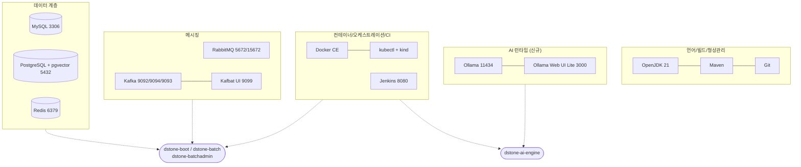
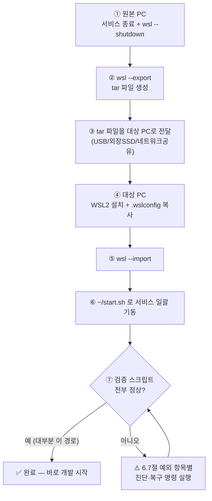
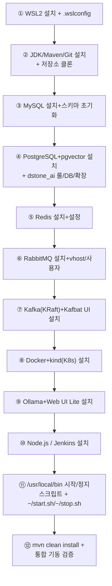
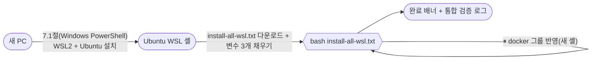

# 개발 환경 (WSL) 소프트웨어 목록

## 목차

- [1. 운영 원칙 (중요)](#1-운영-원칙-중요)
- [2. 목록](#2-목록)
- [3. 클라우드 아키텍처 시뮬레이션](#3-클라우드-아키텍처-시뮬레이션)
- [4. dstone 프로젝트와의 연결 관계](#4-dstone-프로젝트와의-연결-관계)
- [5. 개발환경 시작/정지 (`~/start.sh` / `~/stop.sh`)](#5-개발환경-시작정지-startsh--stopsh)
- [6. WSL Export/Import로 개발 환경 이전하기](#6-wsl-exportimport로-개발-환경-이전하기)
- [7. WSL 개발 환경 신규 구축 (Export/Import 없이)](#7-wsl-개발-환경-신규-구축-exportimport-없이)

dstone 프로젝트를 개발하기 위해 WSL(Ubuntu) 환경에 수동으로 설치·구성한 소프트웨어 목록이다.
각 항목의 설치 방법 및 상세 설정은 `docs/software/{소프트웨어명}.md` 문서를 참고한다.

- 최초 작성일: 2026-09-03
- 대상 환경: WSL2 Ubuntu 26.04 LTS (Resolute Raccoon)
- 갱신 방식: 새 소프트웨어를 설치하거나 주요 설정을 변경할 때마다 이 문서와 `docs/software/*.md`를 함께 갱신한다.

## 1. 운영 원칙 (중요)

WSL은 기본적으로 systemd 서비스를 부팅 시 자동 기동하지 않도록 운용 중이다. 그래서 DB/메시징/CI 등 대부분의 서비스는
`/usr/local/bin/start-*.sh`, `/usr/local/bin/stop-*.sh` 스크립트로 수동 기동/중지한다 (아래 표의 "시작 스크립트" 참고).
WSL을 재시작했다면 필요한 서비스를 먼저 `start-*.sh`로 올려야 한다.

## 2. 목록

| 구분 | 소프트웨어 | 버전(확인 시점) | 설치 방식 | 주요 포트 | 시작 스크립트 | 상세 문서 |
|---|---|---|---|---|---|---|
| 언어/런타임 | OpenJDK (JDK) | 21.0.12 | Ubuntu 공식 저장소 (`apt install openjdk-21-jdk`) | - | - | [01.jdk.md](software/01.jdk.md) |
| 빌드 도구 | Apache Maven | 3.9.12 | Ubuntu 공식 저장소 (`apt install maven`) | - | - | [02.maven.md](software/02.maven.md) |
| 형상관리 | Git | 2.53.0 | Ubuntu 공식 저장소 (`apt install git`) | - | - | [03.git.md](software/03.git.md) |
| 데이터베이스 | MySQL Server | 8.4.11 | Ubuntu 공식 저장소 (`apt install mysql-server`) | 3306 | `start-mysql.sh` / `stop-mysql.sh` | [04.mysql.md](software/04.mysql.md) |
| 데이터베이스 | PostgreSQL (+ pgvector 0.8.1-2) | 18.6 | Ubuntu 공식 저장소 (`apt install postgresql postgresql-18-pgvector`) | 5432 | `start-postgresql.sh` / `stop-postgresql.sh` | [05.postgresql.md](software/05.postgresql.md) |
| 캐시/세션 | Redis | 8.0.5 | Ubuntu 공식 저장소 (`apt install redis-server`) | 6379 | `start-redis.sh` / `stop-redis.sh` | [06.redis.md](software/06.redis.md) |
| 메시지 큐 | RabbitMQ | 4.0.5 | Ubuntu 공식 저장소 (`apt install rabbitmq-server`) | 5672 (AMQP), 15672 (관리 콘솔) | `start-rabbitmq.sh` / `stop-rabbitmq.sh` | [07.rabbitmq.md](software/07.rabbitmq.md) |
| 메시지 큐 | Apache Kafka (KRaft 모드) | 4.2.1 (Scala 2.13) | 수동 설치 (tar.gz, `/opt/kafka`) | 9092 (broker, 로컬/WSL 전용), 9094 (broker, kind Pod 전용), 9093 (controller) | `/opt/kafka/kafka-start.sh` (`start-kafka.sh`에 포함) | [08.kafka.md](software/08.kafka.md) |
| 관리 도구 | Kafbat UI (Kafka 관리 콘솔) | jar 배포판 | 수동 설치 (jar, `/opt/kafka/admin-tools/KafbatUI`) | 9099 | `/opt/kafka/admin-tools/KafbatUI/start.sh` (`start-kafka.sh`에 포함) | [09.kafbat-ui.md](software/09.kafbat-ui.md) |
| 컨테이너 | Docker CE + Compose plugin | 29.7.2 / Compose v5.5.0 | Docker 공식 저장소 (`download.docker.com`) | - (unix socket) | `start-docker.sh` / `stop-docker.sh` | [10.docker.md](software/10.docker.md) |
| 컨테이너 오케스트레이션 | kubectl + kind (로컬 K8s) | kubectl v1.37.0 / kind v0.27.0 | 수동 설치 (바이너리 다운로드, `/usr/local/bin`) | kind API 서버는 임의 포트 | `start-kube.sh` (`k8s-start.sh`) / `stop-kube.sh` (`k8s-stop.sh`) | [11.kubernetes.md](software/11.kubernetes.md) |
| CI/CD | Jenkins | 2.568.3 | Jenkins 공식 저장소 (`pkg.jenkins.io`) | 8080 | `start-jenkins.sh` / `stop-jenkins.sh` | [12.jenkins.md](software/12.jenkins.md) |
| 런타임(부가) | Node.js + npm | 20.20.2 / 10.8.2 | NodeSource 저장소 (`deb.nodesource.com`) | - | - | [13.nodejs.md](software/13.nodejs.md) |
| AI 모델 런타임 | Ollama | v0.33.3 | 수동 설치 (tar.zst, `/opt/ollama`, systemd 미등록) | 11434 | `start-ollama.sh` / `stop-ollama.sh` | [14.ollama.md](software/14.ollama.md) |
| 관리 도구 | Ollama Web UI Lite | git HEAD | 수동 설치 (`git clone`, `/opt/ollama-webui-lite`) | 3000 | `/opt/ollama-webui-lite/start.sh` (`start-ollama.sh`에 포함) | [15.ollama-webui-lite.md](software/15.ollama-webui-lite.md) |

한눈에 보는 그룹 구성:



## 3. 클라우드 아키텍처 시뮬레이션

dstone-boot와 dstone-ai-engine은 [kind](software/11.kubernetes.md)에 컨테이너 Pod로(단, dstone-ai-engine은 매니페스트만 준비된 상태로 아직 미배포), dstone-batch/dstone-batchadmin은 systemd 없이 `bin/*.sh` 쉘 스크립트로 제어되는 VM 스타일 프로세스로 운용한다. MySQL/Redis/RabbitMQ/Kafka/PostgreSQL/Ollama는 CSP 매니지드 서비스(또는 자체 호스팅 추론 서버)에 대응시켜 클러스터 바깥에 둔다. 설계 배경과 네트워킹/레지스트리/CI-CD 세부사항은 [04.cloud-architecture.md](04.cloud-architecture.md) 참고.

## 4. dstone 프로젝트와의 연결 관계

- **MySQL**: `dstone-common`/`dstone-boot`/`dstone-batch`/`dstone-batchadmin` 공통 메인 데이터 저장소(`sampleDB` 등). `conf/env.properties`의 `DB_HOST`/`DB_PORT`로 접속 정보 주입.
- **Redis**: `dstone-boot`의 분산 세션 저장소(`dstone:session` 네임스페이스).
- **RabbitMQ**: `dstone-boot`의 메시지 큐 연동.
- **Kafka**: 애플리케이션에서 메시징 연동 실험/개발용 (로컬 KRaft 단일 브로커).
- **Jenkins**: `dstone-batch/Jenkinsfile`, `dstone-boot/Jenkinsfile` 파이프라인 실행.
- **Docker / kind**: `dstone-boot`을 컨테이너 이미지로 빌드해 로컬 `kind` 클러스터에 Pod로 배포하는 환경(`dstone-boot/Dockerfile`, `dstone-boot/k8s/`). 상세는 [04.cloud-architecture.md](04.cloud-architecture.md) 참고.
- **PostgreSQL**: **(2026-09-08 변경)** `dstone-ai-engine`의 RAG(Phase 2) VectorStore(pgvector)가 사용한다 - `dstone_ai` 롤/DB에 `vector` 확장을 켜서 문서 임베딩을 저장한다. 상세: [05.postgresql.md 6절](software/05.postgresql.md#6-dstone-프로젝트에서의-역할).
- **Ollama**: `dstone-ai-engine`의 RAG(Phase 2) 임베딩 전용 로컬 모델 런타임(`bge-m3`). Anthropic은 임베딩 API가 없고 이 환경엔 OpenAI 키 대신 로컬 모델을 쓰기로 해서 추가했다 - 채팅(Claude)과는 무관하다.
- **Ollama Web UI Lite**: Ollama 모델 조회/pull/삭제·수동 채팅 테스트용 관리 콘솔. `dstone` 애플리케이션 자체와는 직접적인 런타임 의존관계가 없는 부가 도구(Kafka의 Kafbat UI와 같은 역할) - `start-ollama.sh`/`stop-ollama.sh`가 Ollama와 함께 기동/중지한다.
- **Node.js**: 현재 dstone 서비스 자체 설정(`application.yml`)에서는 사용하지 않는 것으로 보이며, 개발 환경 실습/부가 도구 용도로 설치되어 있음. 실제 프로젝트 연동이 생기면 이 문서와 CLAUDE.md를 갱신할 것.

## 5. 개발환경 시작/정지 (`~/start.sh` / `~/stop.sh`)

WSL을 새로 띄운 뒤 개발환경 전체를 한 번에 올리고 내리기 위한 최상위 스크립트다. 각 소프트웨어별 `start-*.sh`/`stop-*.sh`(`/usr/local/bin`, root 소유, `755`)를 순서대로 호출하기만 하는 얇은 래퍼이며, 개별 소프트웨어의 설치/설정 자체는 [2. 목록](#2-목록) 표의 "상세 문서" 링크를 참고한다.

### 5.1 개발환경 시작 (`~/start.sh`)

```sh
#! /bin/sh

# docker
start-docker.sh

# kubenetes
start-kube.sh

# mysql
start-mysql.sh

# postgresql
start-postgresql.sh

# rabbitmq
start-rabbitmq.sh

# redis
start-redis.sh

# kafka
start-kafka.sh

# ollama
start-ollama.sh

# jenkins
start-jenkins.sh
```

`/usr/local/bin`에 있는 개별 `start-*.sh`를 순서대로 실행하기만 하는 쉘 스크립트다. **(2026-09-07 변경) 순서 제약이 사라졌다.** 예전에는 MySQL(`mysqld.cnf`)과 Redis(`redis.conf`)가 `bind-address`/`bind`에 `127.0.0.1`뿐 아니라 `172.18.0.1`(Docker의 `kind` 브리지 네트워크 게이트웨이)도 명시적으로 나열하고 있었다. `kind` 클러스터 안에서 도는 `dstone-boot` Pod가 host의 MySQL/Redis에 접근하려면 이 게이트웨이 IP로 접속해야 하기 때문인데, 이 IP는 dockerd가 뜨고 `kind` 네트워크 브리지(`br-*`)가 attach된 뒤에만 존재해서 **Docker/kind가 뜨기 전에 mysql·redis를 먼저 켜면 `bind: Cannot assign requested address`로 기동이 실패**했다 (2026-09-06 장애 진단 참고 — 과거에는 mysql/postgresql/rabbitmq/redis/kafka → docker → kube 순서였고, MySQL은 systemd 자동 재시작 타이밍이 맞아 우연히 살아났지만 Redis는 `StartLimitBurst`(기본 5회/10초)에 걸려 항상 죽어 있었다).

이 레이스 컨디션을 근본적으로 없애기 위해 MySQL/Redis의 바인딩을 `0.0.0.0`(모든 인터페이스)으로 바꿨다(상세는 [04.mysql.md 4절](software/04.mysql.md#4-서비스-시작중지), [06.redis.md 4절](software/06.redis.md#4-서비스-시작중지) 참고). 이러면 mysql/redis 기동 시점에 `172.18.0.1`이 존재하든 안 하든 상관없고, 이후 Docker/kind가 떠서 그 IP가 새로 생겨도 mysql/redis 재시작 없이 바로 접근된다. **따라서 이제 위 목록의 순서는 예시일 뿐이며, 필요에 따라 선택적으로 구성하면 된다:**

- **온프레미스만(Docker/kind 불필요)**: mysql/postgresql/rabbitmq/redis/kafka 등 "일반 소프트웨어 그룹"만 올리고, `dstone-boot`은 `dstone-boot/bin/startApp.sh`(`-Dspring.profiles.active=wsl`, `localhost` 접속)로 WSL에 네이티브 기동한다.
- **클라우드(kind)까지 포함**: 위에 더해 `start-docker.sh`/`start-kube.sh`로 Docker/kind를 올리고, `k8s` 프로파일 기반 컨테이너로 `dstone-boot`을 배포한다([04.cloud-architecture.md](04.cloud-architecture.md) 참고).

각 `start-*.sh`의 실제 내용과 상세 설명은 해당 소프트웨어 문서에 있다 (스크립트 원문을 이 문서에 중복 기재하지 않고 링크만 둔다):

#### 5.1.1 Docker 시작 (`/usr/local/bin/start-docker.sh`)
→ [10.docker.md 4절](software/10.docker.md#4-서비스-시작중지)

#### 5.1.2 Kubernetes 시작 (`/usr/local/bin/start-kube.sh`)
→ [11.kubernetes.md 5절](software/11.kubernetes.md#5-서비스클러스터-시작중지)

#### 5.1.3 MySQL 시작 (`/usr/local/bin/start-mysql.sh`)
→ [04.mysql.md 4절](software/04.mysql.md#4-서비스-시작중지)

#### 5.1.4 PostgreSQL 시작 (`/usr/local/bin/start-postgresql.sh`)
→ [05.postgresql.md 4절](software/05.postgresql.md#4-서비스-시작중지)

#### 5.1.5 RabbitMQ 시작 (`/usr/local/bin/start-rabbitmq.sh`)
→ [07.rabbitmq.md 4절](software/07.rabbitmq.md#4-서비스-시작중지)

#### 5.1.6 Redis 시작 (`/usr/local/bin/start-redis.sh`)
→ [06.redis.md 4절](software/06.redis.md#4-서비스-시작중지)

#### 5.1.7 Kafka 시작 (`/usr/local/bin/start-kafka.sh`)
→ [08.kafka.md 5절](software/08.kafka.md#5-서비스-시작중지) (+ [09.kafbat-ui.md 5절](software/09.kafbat-ui.md#5-서비스-시작중지))

#### 5.1.8 Ollama 시작 (`/usr/local/bin/start-ollama.sh`)
→ [14.ollama.md 4절](software/14.ollama.md#4-서비스-시작중지)

#### 5.1.9 Jenkins 시작 (`/usr/local/bin/start-jenkins.sh`)
→ [12.jenkins.md 5절](software/12.jenkins.md#5-서비스-시작중지)

### 5.2 개발환경 정지 (`~/stop.sh`)

```sh
#! /bin/sh

# mysql
stop-mysql.sh

# postgresql
stop-postgresql.sh

# rabbitmq
stop-rabbitmq.sh

# redis
stop-redis.sh

# kafka
stop-kafka.sh

# ollama
stop-ollama.sh

# docker
stop-docker.sh

# kubenetes
stop-kube.sh

# jenkins
stop-jenkins.sh
```

`/usr/local/bin`에 있는 개별 `stop-*.sh`를 순서대로 실행하기만 하는 쉘 스크립트다. 정지 순서는 기동 순서(5.1)만큼 엄격하지 않다 — Docker/kind가 살아있는 동안 mysql/redis를 먼저 내려도 재현되는 장애는 없다. 5.1과 마찬가지로 각 `stop-*.sh`의 상세는 해당 소프트웨어 문서를 참고한다.

#### 5.2.1 MySQL 정지 (`/usr/local/bin/stop-mysql.sh`)
→ [04.mysql.md 4절](software/04.mysql.md#4-서비스-시작중지)

#### 5.2.2 PostgreSQL 정지 (`/usr/local/bin/stop-postgresql.sh`)
→ [05.postgresql.md 4절](software/05.postgresql.md#4-서비스-시작중지)

#### 5.2.3 RabbitMQ 정지 (`/usr/local/bin/stop-rabbitmq.sh`)
→ [07.rabbitmq.md 4절](software/07.rabbitmq.md#4-서비스-시작중지)

#### 5.2.4 Redis 정지 (`/usr/local/bin/stop-redis.sh`)
→ [06.redis.md 4절](software/06.redis.md#4-서비스-시작중지)

#### 5.2.5 Kafka 정지 (`/usr/local/bin/stop-kafka.sh`)
→ [08.kafka.md 5절](software/08.kafka.md#5-서비스-시작중지) (+ [09.kafbat-ui.md 5절](software/09.kafbat-ui.md#5-서비스-시작중지))

#### 5.2.6 Ollama 정지 (`/usr/local/bin/stop-ollama.sh`)
→ [14.ollama.md 4절](software/14.ollama.md#4-서비스-시작중지)

#### 5.2.7 Docker 정지 (`/usr/local/bin/stop-docker.sh`)
→ [10.docker.md 4절](software/10.docker.md#4-서비스-시작중지)

#### 5.2.8 Kubernetes 정지 (`/usr/local/bin/stop-kube.sh`)
→ [11.kubernetes.md 5절](software/11.kubernetes.md#5-서비스클러스터-시작중지) — `--delete` 옵션(클러스터 완전 삭제)은 [11.kubernetes.md 6절](software/11.kubernetes.md#6-로컬-사설-레지스트리-dstone-boot--dstone-ai-engine-이미지-배포용)에 정리되어 있으며, `~/stop.sh` 경유로는 전달할 수 없어 필요하면 `k8s-stop.sh --delete`를 직접 호출해야 한다.

**주의**: 5.2.7(`stop-docker.sh`)과 5.2.8(`stop-kube.sh`)이 각각 dockerd를 내리는 경로를 갖고 있어 dockerd 정지 시도가 사실상 중복 실행된다(문제는 없음 — 상세는 두 문서 참고).

#### 5.2.9 Jenkins 정지 (`/usr/local/bin/stop-jenkins.sh`)
→ [12.jenkins.md 5절](software/12.jenkins.md#5-서비스-시작중지)

트러블슈팅(예: mysql/redis 기동 실패 시 진단 절차, 과거의 `bind-address`/`172.18.0.1` 레이스 컨디션 이력)은 각 소프트웨어 문서(`04.mysql.md`, `06.redis.md`, `10.docker.md`, `11.kubernetes.md`)의 시작/중지 절을 참고.

## 6. WSL Export/Import로 개발 환경 이전하기

> 🎯 **이 절의 목표**: 이 절 하나만 위에서 아래로 그대로 따라가면(명령어를 그대로 복사/붙여넣기 실행), 지금 이 PC에 구축된 WSL 개발 환경(JDK/Maven/MySQL/PostgreSQL/Redis/RabbitMQ/Kafka/Ollama/Docker/kind/Jenkins 전부 + `/app/dstone` 프로젝트 자체)을 **다른 PC에서 거의 동일하게** 재현할 수 있다. `wsl --export`/`wsl --import`는 배포판 전체를 파일 그대로 복제하는 것이라 [2. 목록](#2-목록)의 소프트웨어를 하나씩 재설치할 필요가 없다 — 대신 "파일은 복사되지만 실행 중 상태나 PC 고유 정보는 복사되지 않는" 지점들이 있고, 이 환경을 실제로 구성하면서 겪었던 예외 사례들(바인딩 레이스 컨디션, pgvector 확장 누락, RabbitMQ vhost 미구성 등)이 새 PC에서 그대로 재발할 수 있다. 아래 절차는 그 예외들을 **점검 명령 + 안 되면 바로 쓸 수 있는 복구 명령**까지 각 단계에 포함해뒀다.



### 6.1 배경 — 왜 export/import 한 번으로 재현되는가

- 이 환경의 소프트웨어(JDK, Maven, MySQL, PostgreSQL, Redis, RabbitMQ, Kafka, Ollama, Docker, kind, Jenkins)와 그 데이터/설정, 그리고 `/app/dstone` 프로젝트(git 저장소, `conf/env*.properties`, Jasypt 복호화 키가 하드코딩된 `EncUtil.java` 포함) 전부가 `/mnt/c` 같은 Windows 쪽 경로가 아니라 **WSL 배포판 자체의 ext4 루트 파일시스템(`/`) 안**에 있다. `df -h /` 기준 현재 사용량은 약 45G(전체 가상 디스크 크기는 1007G, `.wslconfig`의 `sparseVhd=true`로 실제 사용한 만큼만 디스크를 차지). 배포판을 통째로 tar로 내보내고(export) 다른 PC에서 그대로 복원하면(import), 이 파일시스템 전체가 그대로 옮겨진다.
- **Jasypt `ENC(...)` 값은 재암호화가 필요 없다.** 복호화 키가 환경변수가 아니라 `dstone-common`의 `EncUtil.java` 소스 코드 자체에 고정돼 있고, 이 소스도 `/app/dstone` git 저장소의 일부로 함께 복사되기 때문에 `application.yml`의 모든 `ENC(...)` 값(DB 비밀번호, Anthropic API 키 등)이 새 PC에서도 그대로 복호화된다.
- 현재 등록된 배포판은 `wsl -l -v` 기준 이름 `Ubuntu`(WSL 버전 2)이며, `/etc/wsl.conf`에 `systemd=true`와 기본 사용자 `jysn007`이 이미 지정되어 있어 이 설정도 export/import에 포함된다.
- 반대로 **"파일이 아니라 PC/네트워크 환경에 의존하는 것"은 복사돼도 그대로 동작한다는 보장이 없다** — Windows 쪽에만 있는 설정(`.wslconfig`), Docker/kind처럼 커널 네임스페이스·cgroup 등 런타임 상태를 갖는 것, RabbitMQ처럼 호스트명을 노드 식별자로 쓰는 것, "PC 두 대 동시 사용" 시 충돌하는 것(Jenkins 등)이 대표적이다. 이런 항목은 6.4/6.7절에서 점검·복구 명령까지 함께 다룬다.

### 6.2 원본 PC에서 사전 준비

1. 서비스 정상 종료: [5.2절](#52-개발환경-정지-stopsh)의 `~/stop.sh`로 mysql/postgresql/rabbitmq/redis/kafka/ollama/docker/kube/jenkins를 내린다.
   ```bash
   ~/stop.sh
   ```
2. 디스크 여유 공간을 먼저 확인한다 — export되는 tar 파일은 현재 `/` 사용량과 비슷한 크기가 된다.
   ```bash
   df -h /
   ```
3. Windows PowerShell(관리자 권한 권장)에서 WSL 전체를 완전히 종료한다.
   ```powershell
   wsl --shutdown
   ```
   실행 중인 배포판을 export하면 파일시스템 일관성이 깨질 수 있으므로, **반드시 `--shutdown` 이후 몇 초 뒤에** export한다 (`wsl -l -v`로 상태가 `Stopped`인지 확인하고 진행하면 더 안전하다).

### 6.3 Export (원본 PC, Windows PowerShell)

```powershell
# 1) 배포판 이름/상태 확인 (Ubuntu, Stopped 여야 함)
wsl -l -v

# 2) 내보낼 폴더 생성 (없으면)
New-Item -ItemType Directory -Force -Path D:\wsl-backup | Out-Null

# 3) 배포판 전체를 tar로 내보내기
wsl --export Ubuntu D:\wsl-backup\dstone-ubuntu.tar

# 4) (선택) 압축본으로 내보내기 — WSL 버전에 따라 --format 옵션 미지원일 수 있음, 그러면 3번 방식만 사용
wsl --version   # "WSL 버전" 확인
wsl --export Ubuntu D:\wsl-backup\dstone-ubuntu.tar.gz --format tar.gz

# 5) 파일 생성/크기 확인
Get-Item D:\wsl-backup\dstone-ubuntu.tar* | Select-Object Name, Length, LastWriteTime
```

만들어진 tar 파일을 USB, 외장 드라이브, 사내 네트워크 공유, 클라우드 스토리지 등으로 대상 PC에 옮긴다. **이 파일 안에는 DB 비밀번호, Jasypt 복호화 키가 담긴 소스, Jenkins Credential/SSH 배포 키 등 민감정보가 평문 그대로(또는 이 저장소만으로 복호화 가능한 형태로) 들어있으므로**, USB 분실이나 접근 권한이 없는 네트워크 공유에 올려두는 것을 피하고 전송·보관 경로를 신뢰할 수 있는 채널로 한정한다.

### 6.4 대상 PC 준비

1. **WSL2 자체 설치** (Windows 11, 또는 WSL2를 지원하는 Windows 10):
   ```powershell
   wsl --install --no-distribution
   ```
   Microsoft Store의 Ubuntu 앱을 따로 받을 필요는 없다 — import 자체가 새 배포판을 만드는 과정이다. 설치 후 재부팅을 요구하면 재부팅한다.
2. **WSL 커널/버전이 최신인지 확인** (`networkingMode=mirrored`를 쓰려면 필요):
   ```powershell
   wsl --update
   wsl --version
   ```
3. **`.wslconfig` 이전**: 원본 PC의 `C:\Users\<사용자명>\.wslconfig`를 대상 PC의 동일 경로로 복사한다. 현재 값:
   ```ini
   [wsl2]
   networkingMode=mirrored

   memory=8GB
   processors=4
   swap=2GB

   [experimental]
   hostAddressLoopback=true
   autoProxy=true
   autoMemoryReclaim=gradual
   sparseVhd=true
   ```
   - ⚠️ **`memory`/`processors`/`swap`은 대상 PC의 실제 사양에 맞게 반드시 다시 조정한다** — 원본 PC 값을 그대로 옮기면 대상 PC 메모리가 부족해 MySQL/PostgreSQL/Kafka/kind 동시 기동 시 OOM이 날 수 있다. Docker/kind까지 쓸 계획이면 최소 8GB 이상을 권장한다([11.kubernetes.md 1절](software/11.kubernetes.md#1-개요) 참고).
   - ⚠️ **`networkingMode=mirrored`는 Windows 11 22H2 이상 + WSL 커널 업데이트가 필요하다.** 대상 PC가 조건을 만족하지 못하면 WSL 시작 시 조용히 무시되거나 오류가 날 수 있다 — 이 경우 이 줄을 지우고 기본(NAT) 네트워킹으로 동작시킨다. **NAT 모드로 바뀌면 `localhost` 포트포워딩 동작과 `172.18.0.1`(kind 브리지 게이트웨이) 전제가 mirrored 모드와 달라질 수 있으므로**, [04.cloud-architecture.md](04.cloud-architecture.md)의 네트워킹 섹션을 재확인하고 6.7.1/6.7.3절의 Docker/kind·Kafka 점검 항목을 특히 꼼꼼히 확인한다.
   - 수정 후 반영을 위해:
     ```powershell
     wsl --shutdown
     ```

### 6.5 Import (대상 PC, Windows PowerShell)

```powershell
# 1) 설치 위치(빈 폴더) 생성
New-Item -ItemType Directory -Force -Path D:\WSL\Ubuntu-dstone | Out-Null

# 2) wsl --import <배포판이름> <설치위치> <tar 파일 경로> --version 2
wsl --import Ubuntu-dstone D:\WSL\Ubuntu-dstone D:\wsl-backup\dstone-ubuntu.tar --version 2

# 3) 등록 확인
wsl -l -v

# 4) 접속 (기본 사용자로 들어가지는지 확인)
wsl -d Ubuntu-dstone
whoami            # jysn007 이 나와야 함
```

- 배포판 이름은 자유롭게 정할 수 있다(원본과 똑같이 `Ubuntu`로 해도 되고, 대상 PC에 이미 다른 용도의 `Ubuntu` 배포판이 있다면 `Ubuntu-dstone`처럼 구분되는 이름을 쓴다). 이 프로젝트나 문서 어디에도 배포판 이름 자체를 코드에서 참조하는 곳은 없으므로 이름은 운영에 영향을 주지 않는다.
- `/etc/wsl.conf`에 이미 기본 사용자(`jysn007`)와 `systemd=true`가 들어있는 상태로 import되므로 별도 설정 없이 `wsl -d Ubuntu-dstone` 실행 시 jysn007 사용자로 systemd가 뜬 상태로 들어가야 한다.
- **`whoami`가 `jysn007`이 아니라 `root`로 나오면**, `/etc/wsl.conf`의 `[user]` 섹션이 온전히 복사됐는지 확인한다:
  ```bash
  cat /etc/wsl.conf
  # [user] default=jysn007 이 없다면 아래로 직접 추가 후
  # (Windows PowerShell에서) wsl --shutdown 후 wsl -d Ubuntu-dstone 재접속
  ```
- **systemd가 안 떠 있다면** (`systemctl` 실행 시 `System has not been booted with systemd` 등 오류):
  ```bash
  cat /etc/wsl.conf   # [boot] systemd=true 확인
  ```
  Windows에서 `wsl --shutdown` 후 재접속해도 안 되면 WSL 자체 업데이트(`wsl --update`, 6.4절 2번)가 안 돼 있을 가능성이 크다.

### 6.6 대상 PC: 서비스 일괄 기동 (여기서부터가 "실행만 하면 되는" 구간)

```bash
# WSL 안에서 실행
cd /app/dstone && git status && git log --oneline -3   # 프로젝트가 절대경로 그대로 살아있는지 먼저 확인

~/start.sh
```

`~/start.sh`는 [5.1절](#51-개발환경-시작-startsh)에서 설명한 대로 docker → kube → mysql → postgresql → rabbitmq → redis → kafka → ollama → jenkins 순으로 개별 `start-*.sh`를 호출한다. MySQL/Redis 바인딩이 `0.0.0.0`으로 열려 있어 순서 제약은 없지만(5.1절 참고), **한 번 실행 후 바로 아래 6.7절 검증을 돌려서 전부 정상인지 확인하고 넘어가는 것**을 권장한다 — 이 시점에서 이상이 있으면 서비스를 하나씩 다시 켤 필요 없이 문제 있는 항목만 짚어 고칠 수 있다.

### 6.7 예외사항 점검 & 복구 — 항목별 실제 명령

아래 표의 각 행은 "이 환경을 만들면서 실제로 한 번 이상 겪었던 문제"다. **대부분은 정상이라 확인만 하면 끝나지만**, 혹시 걸리면 바로 옆의 복구 명령을 그대로 실행하면 된다.

#### 6.7.1 Docker / kind — 가장 깨지기 쉬운 항목

Docker/kind는 커널 네트워크 네임스페이스·cgroup 같은 **런타임 상태**를 갖고 있어서, 파일은 복사돼도 컨테이너가 그 상태 그대로 다시 살아난다는 보장이 가장 약한 영역이다.

```bash
# 1) dockerd 정상 기동 확인
docker info > /dev/null && echo "OK: dockerd 정상"

# 2) kind 클러스터/노드 상태 확인
kind get clusters
kubectl get nodes
docker ps -a --filter "name=dev-control-plane"
```

- **`kubectl get nodes`가 응답 없음/타임아웃, 또는 노드가 `NotReady`, 또는 `docker ps -a`에 `dev-control-plane`이 `Exited` 상태로만 보이는 경우** — 대부분 컨테이너를 그대로 되살리려 하지 말고 **깨끗하게 삭제 후 재생성**하는 편이 빠르고 안전하다:
  ```bash
  k8s-stop.sh --delete       # kind 클러스터 완전 삭제 (~/stop.sh 경유로는 --delete 전달 불가, 직접 호출)
  docker rm -f kind-registry 2>/dev/null   # 로컬 레지스트리 컨테이너도 함께 정리(있었다면)
  start-kube.sh              # k8s-start.sh가 레지스트리+클러스터를 처음부터 재생성
  kubectl get nodes           # Ready 확인
  ```
- **로컬 사설 레지스트리(`localhost:5000`) 재확인** — 클러스터를 재생성했다면 레지스트리 컨테이너도 새로 만들어진 것이라 이전에 push했던 이미지는 남아있지 않다:
  ```bash
  docker network inspect kind --format '{{range .Containers}}{{.Name}}{{"\n"}}{{end}}'   # kind-registry가 보여야 함
  ```
  `dstone-boot`(또는 `dstone-ai-engine`)을 kind에 배포해서 쓰고 있었다면, 이미지를 다시 빌드/push하고 재배포한다([03.build.md 6절](03.build.md#6-dstone-boot--dstone-ai-engine--컨테이너-빌드--kind-배포)):
  ```bash
  cd /app/dstone
  docker build -f dstone-boot/Dockerfile -t localhost:5000/dstone-boot:latest .
  docker push localhost:5000/dstone-boot:latest
  kubectl apply -f dstone-boot/k8s/
  kubectl rollout restart deployment/dstone-boot -n dstone
  kubectl get pods -n dstone
  ```
- **kind 브리지 게이트웨이 IP가 `172.18.0.1`이 아닌 경우** — Docker는 이미 다른 네트워크가 있는 새 PC에서 `kind` 네트워크에 다른 서브넷을 할당할 수 있다(예: `172.19.0.1`). 이 환경의 Kafka DOCKER 리스너(6.7.3절)는 `172.18.0.1`을 하드코딩하고 있으므로 실제 IP와 비교 확인한다:
  ```bash
  docker network inspect kind --format '{{(index .IPAM.Config 0).Gateway}}'
  ```
  값이 `172.18.0.1`이 아니면, `dstone-boot`을 kind에서 쓸 때 참고하는 [04.cloud-architecture.md](04.cloud-architecture.md)의 네트워킹 섹션과 아래 6.7.3절의 Kafka `advertised.listeners`를 실제 값으로 갱신해야 한다(단순 로컬 개발 — kind/Pod에서 Kafka에 접근할 계획이 없다면 당장은 무시해도 무방).

#### 6.7.2 RabbitMQ — vhost/큐가 안 보일 수 있다 (호스트명 이슈)

RabbitMQ는 내부적으로 **리눅스 호스트명을 노드 식별자**(`rabbit@<hostname>`)로 써서 데이터를 저장한다. WSL은 기본 설정(`/etc/wsl.conf`에 `[network] generateHosts=false`가 없는 상태)에서 **Windows PC의 컴퓨터 이름을 리눅스 호스트명으로 동기화**하므로, 원본 PC와 대상 PC의 Windows 컴퓨터 이름이 다르면 RabbitMQ가 이전과 다른 노드 이름으로 새로 뜨면서 6절에서 만들어둔 vhost/사용자/큐가 "사라진 것처럼" 보일 수 있다.

```bash
# 1) 현재 호스트명 확인 (원본 PC와 비교해볼 것)
hostname

# 2) RabbitMQ가 정상 기동했는지, 그리고 dstone용 구성이 살아있는지 확인
sudo rabbitmqctl status | head -5
sudo rabbitmqctl list_vhosts
sudo rabbitmqctl list_queues -p /dstone-mq name messages
```

- **`/dstone-mq` vhost가 안 보이거나 큐 목록이 비어 있으면**, [07.rabbitmq.md 7절](software/07.rabbitmq.md#7-기본-설정-import)에 정확히 이 상황을 위해 만들어둔 Definitions 파일로 한 번에 복구한다:
  ```bash
  sudo rabbitmqctl import_definitions /app/dstone/docs/data/rabbitmq-basic-config.json
  sudo rabbitmqctl list_vhosts                       # /dstone-mq 가 보이는지 재확인
  sudo rabbitmqctl list_queues -p /dstone-mq name    # app.notifications.queue / app.orders.queue 확인
  ```
  이 파일은 사용자 비밀번호를 해시로만 담고 있어 평문은 복구되지 않는다 — 새로 임포트한 경우 필요하면 비밀번호를 재설정한다:
  ```bash
  sudo rabbitmqctl change_password dstone <새비밀번호>   # 6절에서 만든 dstone 계정 기준 예시
  ```
  비밀번호를 바꿨다면 `dstone-boot/conf/application.yml`의 `spring.rabbitmq.username`/`password`(Jasypt `ENC(...)`)도 [04.mysql.md 7절](software/04.mysql.md#7-비밀번호jasypt-enc-다루기)의 방법으로 새로 암호화해 갱신해야 한다.

#### 6.7.3 Kafka — 브로커/토픽 확인

Kafka 데이터(`/opt/kafka/kafka_2.13-4.2.1/data/kraft-combined-logs`)와 `node.id`/`cluster.id`는 파일로 저장되므로 그대로 복사되고, `advertised.listeners`도 호스트명이 아니라 고정 IP(`127.0.0.1`, `172.18.0.1`)를 쓰므로 로컬(WSL 내부) 연결은 대부분 문제없이 살아난다.

```bash
KAFKA_BIN=/opt/kafka/kafka_2.13-4.2.1/bin
$KAFKA_BIN/kafka-topics.sh --bootstrap-server localhost:9092 --list
$KAFKA_BIN/kafka-broker-api-versions.sh --bootstrap-server localhost:9092 | head -3
```

- 토픽 목록이 비어있거나 접속 자체가 안 되면 `start-kafka.sh` 재실행 후 `/opt/kafka` 하위 로그(`journalctl`/`kafka-start.sh`가 남기는 로그)를 확인한다. `172.18.0.1` 기반 DOCKER 리스너는 kind/Pod에서 접근할 때만 쓰이므로, 로컬 개발만 한다면 이 리스너 오류는 무시해도 된다(6.7.1절 참고).

#### 6.7.4 PostgreSQL + pgvector — 롤/DB/확장 확인

```bash
sudo -u postgres psql -c "\du" | grep dstone_ai        # 롤 존재 확인
sudo -u postgres psql -l | grep dstone_ai               # DB 존재 확인
sudo -u postgres psql -d dstone_ai -c "\dx" | grep vector   # vector 확장 활성화 확인
```

- 위 세 확인이 전부 통과하면 데이터까지 그대로 복사된 것이므로 추가 조치가 필요 없다. 혹시 하나라도 비어 있으면(정상적인 export/import라면 발생하지 않아야 하지만) [05.postgresql.md 6절](software/05.postgresql.md#6-dstone-프로젝트에서의-역할)의 명령을 그대로 재실행한다:
  ```bash
  sudo -u postgres psql -c "CREATE ROLE dstone_ai LOGIN PASSWORD '<비밀번호>';"
  sudo -u postgres psql -c "CREATE DATABASE dstone_ai OWNER dstone_ai;"
  sudo -u postgres psql -d dstone_ai -c "CREATE EXTENSION IF NOT EXISTS vector;"
  ```
  `postgresql-18-pgvector` 패키지 자체가 새 PC에 없다는 `extension "vector" is not available` 오류가 나면(패키지는 apt로 설치하는 것이라 시스템 바이너리 위치에 따라 export/import로 안 옮겨질 수 있음) [05.postgresql.md 7절](software/05.postgresql.md#7-문제-해결-phase-2-설치-중-실제로-겪은-에러)의 7.2 항목대로 `sudo apt-get install -y postgresql-18-pgvector`부터 다시 설치한다.

#### 6.7.5 MySQL — 스키마 확인

```bash
sudo mysql -u root -e "SHOW DATABASES;"
# sampleDB / analyzeDB / dataflow / batchadmin 4개가 보여야 함
mysql -u sampleuser -psampleuser -h 127.0.0.1 -e "SHOW TABLES;" sampleDB
```

- 4개 DB가 전부 보이면 데이터까지 그대로 복사된 것이다. 혹시 스키마 자체를 처음부터 다시 만들어야 하는 상황이라면(예: DB 없이 소스만 새로 클론한 경우) [04.mysql.md 6절](software/04.mysql.md#6-dstone-데이터베이스사용자스키마-초기화-설치-후-필수)의 SQL을 순서대로 재실행한다.

#### 6.7.6 Ollama — 모델까지 그대로 복사됐는지 확인

모델 파일은 `/opt/ollama/data`(`OLLAMA_MODELS` 지정 경로) 안에 있어 export/import로 그대로 옮겨진다 — 수 GB짜리 모델을 다시 받을 필요가 없다는 뜻이다.

```bash
curl -s http://localhost:11434/api/tags | grep -o '"name":"[^"]*"'
# "bge-m3:latest" 와 "llama3.2:latest" 둘 다 보여야 함
```

- 둘 중 하나라도 없으면(용량 문제로 tar 전송 중 손상됐거나, 애초에 다른 PC에서 pull한 적 없는 경우) 다시 pull한다([14.ollama.md 4절](software/14.ollama.md#4-서비스-시작중지) 서버가 떠 있어야 함):
  ```bash
  /opt/ollama/bin/ollama pull bge-m3
  /opt/ollama/bin/ollama pull llama3.2
  ```

#### 6.7.7 Jenkins — 홈 디렉터리는 그대로, 단 동시 실행 금지

```bash
curl -I http://localhost:8080          # 응답 확인
```

- Jenkins 홈(`/var/lib/jenkins`: Job 설정, 빌드 이력, Credential, GitHub 배포용 SSH 키)이 파일 그대로 복사되므로 **재설정이 필요 없다.** 대신 **원본 PC와 대상 PC에서 동시에 같은 Jenkins를 띄우지 않는다** — 같은 Job이 두 인스턴스에서 동시에 GitHub/에이전트에 접속하면 빌드 충돌이 날 수 있다. 완전한 이전이 목적이면 원본은 6.9절대로 정리하거나 최소한 Jenkins만 내려둔다(`~/stop.sh` 또는 `stop-jenkins.sh`).
- Job의 SCM 설정이 로컬 경로(`file:///app/dstone`)가 아니라 실제 GitHub 원격 저장소를 가리키고 있어야 두 PC 어디서 실행하든 동일하게 동작한다 — Jenkins 관리 화면(`Manage Jenkins → System`)에서 Job의 Repository URL을 한 번 확인해둔다.

#### 6.7.8 Windows 전용 설정 — 자동으로 안 옮겨지는 것들

| 항목 | Import 후 상태 | 조치 |
|---|---|---|
| Windows `.wslconfig` | 배포판 밖(Windows 사용자 프로필)에 있어 **자동으로 복사되지 않음** | 6.4절대로 수동 복사 후 사양 재조정 |
| VS Code Remote-WSL 서버(`~/.vscode-server`) | 배포판 안에 있어 함께 복사됨 | Windows 쪽 VS Code에서 새 배포판(예: `Ubuntu-dstone`)으로 다시 연결만 하면 재사용됨 |
| WSL 네트워킹 모드(mirrored/NAT) | `.wslconfig` 값에 따름, 대상 PC의 Windows 버전 제약을 받음 | 6.4절 참고 — mirrored 불가 시 NAT로 폴백되고 kind 게이트웨이 IP 전제가 달라질 수 있음(6.7.1절) |

### 6.8 최종 통합 검증 스크립트 (대상 PC, 한 번에 실행)

6.7절을 다 확인했다면, 아래 한 블록으로 전체를 한 번 더 훑어 최종 확인한다. 그대로 복사해서 붙여넣으면 된다.

```bash
echo "== 언어/빌드 도구 =="
java -version && mvn -v && git --version

echo "== MySQL =="
sudo mysql -u root -e "SHOW DATABASES;" | grep -E "sampleDB|analyzeDB|dataflow|batchadmin"

echo "== PostgreSQL + pgvector =="
sudo -u postgres psql -d dstone_ai -c "\dx" | grep vector

echo "== Redis =="
redis-cli ping

echo "== RabbitMQ =="
sudo rabbitmqctl list_vhosts | grep dstone-mq
sudo rabbitmqctl list_queues -p /dstone-mq name

echo "== Kafka =="
/opt/kafka/kafka_2.13-4.2.1/bin/kafka-topics.sh --bootstrap-server localhost:9092 --list

echo "== Ollama =="
curl -s http://localhost:11434/api/tags | grep -o '"name":"[^"]*"'

echo "== Docker / kind =="
docker ps
kubectl get nodes

echo "== Jenkins =="
curl -I http://localhost:8080

echo "== dstone 프로젝트 빌드 =="
cd /app/dstone && mvn -pl dstone-common -am clean install
```

모든 출력이 정상이면 이전이 끝난 것이다. 모듈별 기동/빌드는 [03.build.md](03.build.md), 클라우드 아키텍처 관련 세부 검증(kind Pod 상태 등)은 [04.cloud-architecture.md](04.cloud-architecture.md)를 참고.

### 6.9 (선택) 원본 PC 배포판 정리 — "이전"이 목적일 때만

완전히 새 PC로 옮기고 원본은 더 이상 쓰지 않을 계획이라면, 원본 PC에서 배포판을 등록 해제할 수 있다. **배포판 파일 자체가 삭제되는 되돌릴 수 없는 작업**이므로, 반드시 대상 PC에서 6.8절 검증 스크립트가 전부 정상으로 통과하는 것을 확인한 뒤에만 실행한다.

```powershell
wsl --unregister Ubuntu
```

단순히 "복제해서 여러 PC에서 같이 쓰고 싶다"는 경우라면 이 단계는 생략하고 두 배포판을 각자 이름으로 유지하되, 6.7.7절의 Jenkins처럼 동시 실행 시 충돌하는 것만 한쪽에서 꺼두는 방식으로 운용한다.

## 7. WSL 개발 환경 신규 구축 (Export/Import 없이)

> 🎯 **이 절의 목표**: 6절(Export/Import)은 "이미 만들어진 환경을 복제"하는 방법이었다. 이 절은 그 tar 파일 없이, **깨끗한 새 PC에서 WSL2 설치부터 시작해 이 문서가 기술하는 개발 환경 전체를 명령어만으로 재구축**하는 방법이다. 순서대로 위에서 아래로 실행하면 되고, 각 소프트웨어마다 "이 환경에서 실제로 필요했던 예외 설정"(자동시작 비활성화, 바인딩 범위, vhost/롤 생성 등)을 **처음부터 반영한 최종 명령**으로 적어뒀다 — 과거에 겪었던 시행착오(레이스 컨디션, 확장 누락 등)를 다시 겪지 않도록, 그 원인이 된 실수를 재현하지 않는 순서와 값으로 구성했다.

**언제 6절 대신 이 절을 쓰나**: 원본 PC의 tar 백업이 없거나(디스크 공간 부족, 최초 구축), 데이터 없이 완전히 새 환경만 필요하거나, 이 문서의 절차 자체를 검증하고 싶을 때. 데이터(DB 내용, Jenkins Job, Ollama 모델 등)까지 그대로 옮기고 싶다면 6절을 먼저 시도한다.



### 7.1 사전 준비 — WSL2 설치 (Windows PowerShell, 관리자 권한)

```powershell
# 1) WSL2 + Ubuntu 배포판 설치 (Windows 기능이 꺼져 있으면 자동으로 켜고 재부팅을 요구할 수 있음)
wsl --install -d Ubuntu-26.04

# 2) 재부팅 후 최초 1회 실행 시 리눅스 사용자 계정/비밀번호를 만들라는 프롬프트가 뜬다 — 그대로 진행
#    (이 문서 기준 사용자명은 jysn007. 다른 이름을 쓴다면 이후 명령의 "jysn007"을 전부 그 이름으로 바꿔 읽는다)

# 3) WSL 커널/배포판 목록 최신화
wsl --update
wsl -l -v
```

`.wslconfig` 배치(6.4절과 동일 — 처음 만드는 경우이므로 여기서도 반복 기재한다):
```powershell
notepad $env:USERPROFILE\.wslconfig
```
아래 내용을 붙여넣고 저장(사양은 실제 PC에 맞게 조정, 특히 `memory`/`processors`):
```ini
[wsl2]
networkingMode=mirrored

memory=8GB
processors=4
swap=2GB

[experimental]
hostAddressLoopback=true
autoProxy=true
autoMemoryReclaim=gradual
sparseVhd=true
```
`networkingMode=mirrored`는 Windows 11 22H2 이상 + 최신 WSL 커널이 필요하다(6.4절 참고) — 조건을 만족 못 하면 이 줄을 빼고 기본 NAT 모드로 진행한다(그 경우 아래 Docker/kind/Kafka의 `172.18.0.1` 관련 단계에서 실제 게이트웨이 IP를 다시 확인해야 한다, 7.9절 참고).

```powershell
wsl --shutdown
wsl -d Ubuntu-26.04
```

### 7.2 WSL 안 기초 설정

```bash
# 시간대(한국 기준, 필요 시 조정)
sudo timedatectl set-timezone Asia/Seoul

# 기본 패키지 인덱스 최신화
sudo apt update && sudo apt upgrade -y

# 프로젝트 루트가 위치할 디렉터리 준비 (/app/dstone에 클론할 예정)
sudo mkdir -p /app
sudo chown "$USER":"$USER" /app
```

`/etc/wsl.conf`에 기본 사용자/systemd가 이미 설정돼 있는지 확인(WSL 설치 마법사가 대부분 자동으로 채워준다):
```bash
cat /etc/wsl.conf
```
아래와 다르면 직접 만들어 채운다(`sudo tee /etc/wsl.conf`):
```ini
[boot]
systemd=true

[user]
default=jysn007
```
수정했다면 Windows에서 `wsl --shutdown` 후 재접속해야 반영된다.

### 7.3 JDK / Maven / Git 설치 + 저장소 클론

```bash
# JDK 21
sudo apt install -y openjdk-21-jdk
java -version && javac -version

# Maven
sudo apt install -y maven
mvn -version   # "Java version"이 21로 잡히는지 확인

# ~/.bashrc에 Maven 환경변수 등록 (JDK는 update-alternatives 기본 경로를 그대로 사용, 별도 등록 불필요)
cat >> ~/.bashrc << 'EOF'
export MAVEN_HOME=/usr/share/maven
export PATH=$PATH:$MAVEN_HOME/bin
EOF
source ~/.bashrc

# Git
sudo apt install -y git
git --version
git config --global user.name "본인 이름"
git config --global user.email "본인 이메일"
```

SSH로 GitHub에 접속할 계획이면 키를 먼저 만들어 등록한다(이미 등록된 키가 있다면 생략):
```bash
ssh-keygen -t ed25519 -C "본인 이메일"
cat ~/.ssh/id_ed25519.pub   # 이 내용을 GitHub 계정 → Settings → SSH and GPG keys에 등록
ssh -T git@github.com       # "Hi <계정>! You've successfully authenticated..." 확인
```

저장소 클론:
```bash
git clone git@github.com:YongSoekChoeng/dstone.git /app/dstone
# 또는 SSH 키 미등록 시: git clone https://github.com/YongSoekChoeng/dstone.git /app/dstone

cd /app/dstone && git log --oneline -3
```

> ℹ️ **Jasypt `ENC(...)` 값은 소스에 이미 들어있다.** 이 저장소를 클론하는 것만으로 `dstone-common`의 `EncUtil.java`(복호화 키 포함)와 각 모듈 `conf/application.yml`의 `ENC(...)` 암호문이 함께 받아지므로, 아래에서 DB/RabbitMQ 계정을 **이 문서와 정확히 같은 이름/비밀번호**로 만들기만 하면 애플리케이션 설정을 전혀 손대지 않고 그대로 기동된다.

### 7.4 MySQL 설치 및 dstone 스키마 초기화

```bash
# 설치
sudo apt install -y mysql-server

# (선택, 권장) 초기 보안 설정 — 비밀번호 정책을 강하게 걸면 7.4.3의 SET GLOBAL로 낮춰야 한다
sudo mysql_secure_installation

# 예외사항 ①: apt 설치 직후 mysql.service는 기본 enabled 상태다 - 이 환경 정책(1절)대로 비활성화한다
sudo systemctl disable mysql
```

설정 파일을 최종 상태로 덮어쓴다 — **예외사항 ②: `bind-address`를 `0.0.0.0`으로 처음부터 연다.** (과거 `172.18.0.1`만 추가했다가 Docker/kind가 뜨기 전엔 mysql이 못 뜨는 레이스 컨디션을 겪었던 자리 — 처음부터 이렇게 하면 그 문제 자체가 없다.)
```bash
sudo tee /etc/mysql/mysql.conf.d/mysqld.cnf > /dev/null << 'EOF'
[mysqld]
mysql_native_password = ON
user                   = mysql
bind-address           = 0.0.0.0
mysqlx-bind-address    = 127.0.0.1
key_buffer_size        = 16M
myisam-recover-options = BACKUP
log_error              = /var/log/mysql/error.log
max_binlog_size        = 100M
EOF

sudo systemctl restart mysql
sudo mysql -u root -e "select 1"   # OS 사용자 소켓 인증으로 바로 접속돼야 함
```

**dstone 스키마/사용자/테이블 초기화** (리포지토리에 이미 포함된 SQL을 순서대로 실행 — 전부 `CREATE ... IF NOT EXISTS`라 재실행해도 안전):
```bash
cd /app/dstone

# 1) DB + 사용자 생성
sudo mysql -u root < dstone-boot/src/main/resources/schema/01-init-mysql-dstone-boot.sql        # sampleDB + sampleuser
sudo mysql -u root < dstone-boot/src/main/resources/schema/01-init-mysql-dstone-analyze.sql      # analyzeDB + analyzeuser
sudo mysql -u root < dstone-batch/src/main/resources/schema/01-init-mysql-dstone-batch.sql       # sampleDB(중복,무해) + dataflow + 사용자
sudo mysql -u root < dstone-batchadmin/src/main/resources/schema/01-init-mysql-dstone-batchadmin.sql  # batchadmin + 사용자

# 2) 테이블 생성
sudo mysql -u root < dstone-boot/src/main/resources/schema/02-create-table-mysql-dstone-boot.sql
sudo mysql -u root < dstone-boot/src/main/resources/schema/02-create-table-mysql-dstone-analyze.sql
sudo mysql -u root < dstone-batch/src/main/resources/schema/02-create-table-mysql-dstone-batch.sql
sudo mysql -u root < dstone-batchadmin/src/main/resources/schema/02-create-table-mysql-dstone-batchadmin.sql

# 3) (선택, 권장) 샘플/초기 데이터
sudo mysql -u root < dstone-boot/src/main/resources/schema/03-create-data-mysql-dstone-boot.sql
sudo mysql -u root < dstone-batchadmin/src/main/resources/schema/03-create-data-mysql-dstone-batchadmin.sql
```

> ⚠️ **예외사항 ③**: 7.4의 `mysql_secure_installation`에서 `validate_password` 컴포넌트를 활성화했다면, 위 2번째 명령(`01-init-mysql-dstone-batchadmin.sql`)이 시도하는 `SET GLOBAL validate_password.policy = LOW; SET GLOBAL validate_password.length = 4;`가 먼저 실행되어 이후 계정 생성의 단순 비밀번호(`sampleuser`, `dataflow` 등)를 통과시켜준다. 컴포넌트가 없으면 이 두 줄은 에러 없이 무시된다. 만약 `ERROR 1819 (HY000): Your password does not satisfy the current policy requirements`가 나면 이 SQL 파일의 앞 두 줄이 정말 먼저 실행됐는지(파일 순서를 바꾸지 않았는지) 확인한다.

검증:
```bash
sudo mysql -u root -e "SHOW DATABASES;"   # sampleDB / analyzeDB / dataflow / batchadmin 확인
mysql -u sampleuser -psampleuser -h 127.0.0.1 -e "SHOW TABLES;" sampleDB
mysql -u dataflow -pdataflow -h 127.0.0.1 -e "SHOW TABLES;" dataflow
```

### 7.5 PostgreSQL + pgvector 설치 및 `dstone_ai` 구성 (RAG용)

```bash
# 설치 (pgvector 확장 패키지는 postgresql 본체와 별도 - 버전에 종속된 패키지명이라 postgresql-<major>-pgvector 형태)
sudo apt install -y postgresql
sudo apt install -y postgresql-18-pgvector   # PostgreSQL 메이저 버전이 다르면 18을 그 버전으로 교체

psql --version
pg_lsclusters
```

> ℹ️ **예외사항 ④(주의)**: `postgresql.service`는 apt 설치 후 **기본값(enabled) 그대로 둔다** — 다른 서비스(mysql/redis/rabbitmq/docker)와 달리 여기서는 `systemctl disable` 하지 **않는다**. 이 환경은 실제로 postgresql만 예외적으로 자동시작 상태로 운용해왔다(1절의 "systemd 자동 기동 안 함" 원칙의 유일한 예외). 원칙과 다르게 두는 이유가 특별히 있는 건 아니고 그동안 그렇게 운용돼 온 것이라, 통일하고 싶다면 `sudo systemctl disable postgresql`을 추가로 실행해도 무방하다(그 경우 `~/start.sh`의 `start-postgresql.sh`가 실제로 서버를 띄우는 역할을 하게 된다 — 지금은 이미 떠 있어서 사실상 no-op이다).

`dstone_ai` 전용 롤/DB/확장 생성:
```bash
sudo -u postgres psql <<'SQL'
CREATE ROLE dstone_ai LOGIN PASSWORD '<비밀번호>';
CREATE DATABASE dstone_ai OWNER dstone_ai;
SQL

sudo -u postgres psql -d dstone_ai -c "CREATE EXTENSION IF NOT EXISTS vector;"
```
- `<비밀번호>`는 `dstone-ai-engine/conf/application.yml`의 `spring.datasource.password`에 이미 들어있는 Jasypt `ENC(...)` 값을 복호화한 평문과 **반드시 일치**해야 한다 — 이 문서만으로는 그 평문을 알 수 없으므로, 새로 구축하는 환경이라면 원하는 비밀번호로 만든 뒤 `cd dstone-common && mvn -q exec:java -Dexec.mainClass=net.dstone.common.utils.EncUtil -Dexec.args="<정한 비밀번호>"`(터미널에서 직접 실행 — 평문이 대화 기록에 남지 않도록)로 나온 `ENC(...)` 값을 `dstone-ai-engine/conf/application.yml`에 반영한다.

검증:
```bash
sudo -u postgres psql -c "\du" | grep dstone_ai
sudo -u postgres psql -l | grep dstone_ai
sudo -u postgres psql -d dstone_ai -c "\dx" | grep vector
```

### 7.6 Redis 설치 및 설정

```bash
sudo apt install -y redis
redis-server --version

# 예외사항 ⑤: 자동시작 비활성화
sudo systemctl disable redis-server
```

**예외사항 ⑥ — 바인딩을 처음부터 `0.0.0.0`으로, `protected-mode`도 함께 끈다**(바인딩을 넓히면 `protected-mode yes`가 비밀번호 없는 원격 접속을 자체 차단하므로 둘을 같이 바꿔야 한다):
```bash
sudo sed -i "s/^bind .*/bind 0.0.0.0 -::1/" /etc/redis/redis.conf
sudo sed -i 's/^protected-mode yes/protected-mode no/' /etc/redis/redis.conf
sudo systemctl restart redis-server
redis-cli ping   # PONG
```
> 인증(`requirepass`)은 이 로컬 개발 환경에서는 미설정 상태로 둔다 — 외부에 노출하는 환경이라면 반드시 설정하고 `dstone-boot`의 `spring.data.redis.password`도 함께 채워야 한다.

### 7.7 RabbitMQ 설치 및 dstone용 vhost/사용자 구성

```bash
sudo apt install -y rabbitmq-server
sudo rabbitmq-plugins enable rabbitmq_management

# 예외사항 ⑦: 자동시작 비활성화
sudo systemctl disable rabbitmq-server

sudo systemctl start rabbitmq-server
sudo rabbitmqctl status
```

**dstone-boot이 요구하는 vhost(`/dstone-mq`)와 계정을 최초 1회 생성** — apt로 설치한 상태 그대로는 이 vhost가 없어 애플리케이션 기동 시 커넥션 자체가 실패한다:
```bash
sudo rabbitmqctl add_vhost /dstone-mq

sudo rabbitmqctl add_user dstone dstone123          # 사용자명/비밀번호는 예시 - 원하는 값으로 변경 가능
sudo rabbitmqctl set_permissions -p /dstone-mq dstone ".*" ".*" ".*"
sudo rabbitmqctl set_user_tags dstone management     # 관리 콘솔(15672) 로그인 허용(선택)
```
- 새 비밀번호로 만들었다면 `dstone-boot/conf/application.yml`의 `spring.rabbitmq.username`/`password`(Jasypt `ENC(...)`)도 위 [7.5절 EncUtil 방법]대로 새로 암호화해 넣어야 한다. 간단히 가려면 대신 `guest` 계정에 권한만 추가하고 `guest`로 암호화해 넣는 방법도 있다: `sudo rabbitmqctl set_permissions -p /dstone-mq guest ".*" ".*" ".*"`.
- **큐/익스체인지는 직접 만들 필요가 없다** — `dstone-boot`의 `ConfigRabbitMQ`가 `application.yml`의 `spring.rabbitmq.bindings` 리스트를 읽어 기동 시점에 자동 선언(declare)한다. vhost와 계정 권한만 맞으면 된다.

**(선택) Definitions 파일로 한 번에 구성** — 위 CLI 대신 리포지토리에 이미 내보내둔 파일로 vhost/사용자/권한을 한 번에 반영할 수도 있다:
```bash
sudo rabbitmqctl import_definitions /app/dstone/docs/data/rabbitmq-basic-config.json
sudo rabbitmqctl change_password dstone <새비밀번호>   # 사용자 비밀번호는 해시로만 들어있어 평문 재설정 필요
```

검증:
```bash
sudo rabbitmqctl list_vhosts
sudo rabbitmqctl list_queues -p /dstone-mq name
```

### 7.8 Kafka(KRaft 모드) + Kafbat UI 설치

```bash
# 1) 설치 디렉터리 준비 + 다운로드
sudo mkdir -p /opt/kafka
sudo chown "$USER":"$USER" /opt/kafka
cd /opt/kafka

wget https://downloads.apache.org/kafka/4.2.1/kafka_2.13-4.2.1.tgz
tar -xzf kafka_2.13-4.2.1.tgz
rm kafka_2.13-4.2.1.tgz
cd kafka_2.13-4.2.1
```

**예외사항 ⑧ — 리스너를 용도별로 분리한 최종 설정으로 먼저 바꾼 뒤에 스토리지를 포맷한다** (포맷 명령이 `log.dirs` 값을 그 시점 설정 파일에서 읽어가므로 반드시 이 순서):
```bash
# 기존 값(활성/주석 어느 쪽이든) 제거 후 최종 값 추가 - 스톡 템플릿 상태에 안전하게 동작
for key in listeners advertised.listeners listener.security.protocol.map log.dirs; do
  sudo sed -i -E "/^#?${key//./\\.}=.*/d" config/server.properties
done
cat >> config/server.properties << 'EOF'
listeners=PLAINTEXT://:9092,DOCKER://:9094,CONTROLLER://:9093
advertised.listeners=PLAINTEXT://127.0.0.1:9092,DOCKER://172.18.0.1:9094,CONTROLLER://127.0.0.1:9093
listener.security.protocol.map=CONTROLLER:PLAINTEXT,PLAINTEXT:PLAINTEXT,DOCKER:PLAINTEXT,SSL:SSL,SASL_PLAINTEXT:SASL_PLAINTEXT,SASL_SSL:SASL_SSL
log.dirs=/opt/kafka/kafka_2.13-4.2.1/data/kraft-combined-logs
EOF

# 9092(PLAINTEXT)=로컬/WSL 클라이언트용(항상 127.0.0.1), 9094(DOCKER)=kind Pod 전용(172.18.0.1, 아직 존재 안 해도 무방 - "광고"만 하는 값이라 실제 바인딩과 무관)

# KRaft 스토리지 초기화 (최초 1회)
KAFKA_CLUSTER_ID="$(bin/kafka-storage.sh random-uuid)"
bin/kafka-storage.sh format --standalone -t "$KAFKA_CLUSTER_ID" -c config/server.properties
```

**시작/중지 스크립트 생성** (systemd 미등록 - PID파일 방식으로 직접 관리):
```bash
sudo tee /opt/kafka/kafka-start.sh > /dev/null << 'EOF'
#!/bin/bash
# Kafka 시작 스크립트 (백그라운드 실행, KRaft 모드)

KAFKA_HOME="/opt/kafka/kafka_2.13-4.2.1"
LOG_FILE="$KAFKA_HOME/logs/kafka-server.out"
PID_FILE="$KAFKA_HOME/kafka-server.pid"

# 이미 실행 중인지 확인
if [ -f "$PID_FILE" ] && kill -0 "$(cat "$PID_FILE")" 2>/dev/null; then
    echo "Kafka가 이미 실행 중입니다. (PID: $(cat "$PID_FILE"))"
    exit 1
fi

mkdir -p "$KAFKA_HOME/logs"

echo "Kafka를 백그라운드로 시작합니다..."
nohup "$KAFKA_HOME/bin/kafka-server-start.sh" "$KAFKA_HOME/config/server.properties" \
    > "$LOG_FILE" 2>&1 &

echo $! > "$PID_FILE"

sleep 2

if kill -0 "$(cat "$PID_FILE")" 2>/dev/null; then
    echo "Kafka가 시작되었습니다. (PID: $(cat "$PID_FILE"))"
    echo "로그: $LOG_FILE"
else
    echo "Kafka 시작에 실패했습니다. 로그를 확인하세요: $LOG_FILE"
    rm -f "$PID_FILE"
    exit 1
fi
EOF

sudo tee /opt/kafka/kafka-stop.sh > /dev/null << 'EOF'
#!/bin/bash
# Kafka 중지 스크립트

KAFKA_HOME="/opt/kafka/kafka_2.13-4.2.1"
PID_FILE="$KAFKA_HOME/kafka-server.pid"

if [ ! -f "$PID_FILE" ]; then
    echo "PID 파일이 없습니다. kafka-server-stop.sh로 시도합니다..."
    "$KAFKA_HOME/bin/kafka-server-stop.sh"
    exit 0
fi

PID="$(cat "$PID_FILE")"

if ! kill -0 "$PID" 2>/dev/null; then
    echo "PID $PID 프로세스가 이미 종료된 상태입니다."
    rm -f "$PID_FILE"
    exit 0
fi

echo "Kafka를 종료합니다... (PID: $PID)"
kill "$PID"

# 정상 종료 대기 (최대 30초)
COUNT=0
while kill -0 "$PID" 2>/dev/null; do
    sleep 1
    COUNT=$((COUNT + 1))
    if [ "$COUNT" -ge 30 ]; then
        echo "정상 종료가 지연되어 강제 종료합니다 (kill -9)."
        kill -9 "$PID"
        break
    fi
done

rm -f "$PID_FILE"
echo "Kafka가 종료되었습니다."
EOF

sudo chmod +x /opt/kafka/kafka-start.sh /opt/kafka/kafka-stop.sh
```

**Kafbat UI(관리 콘솔) 설치**:
```bash
mkdir -p /opt/kafka/admin-tools/KafbatUI
cd /opt/kafka/admin-tools/KafbatUI

JAR_URL="$(curl -s https://api.github.com/repos/kafbat/kafka-ui/releases/207609969 \
  | grep -oE '"browser_download_url":\s*"[^"]*api[^"]*\.jar"' \
  | grep -oE 'https://[^"]+' | head -1)"
wget -O kafbat-ui.jar "$JAR_URL"

mkdir -p conf
tee conf/application-local.yml > /dev/null << 'EOF'
server:
  port: 9099

kafka:
  clusters:
    - name: local
      bootstrapServers: 127.0.0.1:9092
EOF

tee start.sh > /dev/null << 'EOF'
#!/bin/bash
# Kafbat UI 시작 스크립트 (백그라운드 실행)

APP_HOME="/opt/kafka/admin-tools/KafbatUI"
APP_JAR="$APP_HOME/kafbat-ui.jar"
CONF_DIR="$APP_HOME/conf"
LOG_FILE="$APP_HOME/logs/kafbat-ui.out"
PID_FILE="$APP_HOME/kafbat-ui.pid"

# 이미 실행 중인지 확인
if [ -f "$PID_FILE" ] && kill -0 "$(cat "$PID_FILE")" 2>/dev/null; then
    echo "Kafbat UI가 이미 실행 중입니다. (PID: $(cat "$PID_FILE"))"
    exit 1
fi

mkdir -p "$APP_HOME/logs"

echo "Kafbat UI를 백그라운드로 시작합니다..."
# setsid + stdin 분리: 터미널(tty)과 완전히 분리해야 세션 종료 시 프롬프트가 걸리지 않음
setsid nohup java -jar "$APP_JAR" \
    --spring.config.additional-location="$CONF_DIR/application-local.yml" \
    < /dev/null > "$LOG_FILE" 2>&1 &

echo $! > "$PID_FILE"

sleep 2

if kill -0 "$(cat "$PID_FILE")" 2>/dev/null; then
    echo "Kafbat UI가 시작되었습니다. (PID: $(cat "$PID_FILE"))"
    echo "로그: $LOG_FILE"
else
    echo "Kafbat UI 시작에 실패했습니다. 로그를 확인하세요: $LOG_FILE"
    rm -f "$PID_FILE"
    exit 1
fi
EOF

tee stop.sh > /dev/null << 'EOF'
#!/bin/bash
# Kafbat UI 중지 스크립트

APP_HOME="/opt/kafka/admin-tools/KafbatUI"
PID_FILE="$APP_HOME/kafbat-ui.pid"

if [ ! -f "$PID_FILE" ]; then
    echo "PID 파일이 없습니다. Kafbat UI가 실행 중이 아닌 것으로 보입니다."
    exit 0
fi

PID="$(cat "$PID_FILE")"

if ! kill -0 "$PID" 2>/dev/null; then
    echo "PID $PID 프로세스가 이미 종료된 상태입니다."
    rm -f "$PID_FILE"
    exit 0
fi

echo "Kafbat UI를 종료합니다... (PID: $PID)"
kill "$PID"

# 정상 종료 대기 (최대 30초)
COUNT=0
while kill -0 "$PID" 2>/dev/null; do
    sleep 1
    COUNT=$((COUNT + 1))
    if [ "$COUNT" -ge 30 ]; then
        echo "정상 종료가 지연되어 강제 종료합니다 (kill -9)."
        kill -9 "$PID"
        break
    fi
done

rm -f "$PID_FILE"
echo "Kafbat UI가 종료되었습니다."
EOF

chmod +x start.sh stop.sh
```

검증:
```bash
/opt/kafka/kafka-start.sh
/opt/kafka/admin-tools/KafbatUI/start.sh
cd /opt/kafka/kafka_2.13-4.2.1/bin && ./kafka-topics.sh --list --bootstrap-server localhost:9092
curl -I http://localhost:9099   # Kafbat UI
```

### 7.9 Docker CE + kind(Kubernetes) 설치

```bash
# 1) Docker 공식 저장소 등록
sudo apt install -y ca-certificates curl
sudo install -m 0755 -d /etc/apt/keyrings
sudo curl -fsSL https://download.docker.com/linux/ubuntu/gpg -o /etc/apt/keyrings/docker.asc
sudo chmod a+r /etc/apt/keyrings/docker.asc

echo \
  "deb [arch=$(dpkg --print-architecture) signed-by=/etc/apt/keyrings/docker.asc] https://download.docker.com/linux/ubuntu \
  $(. /etc/os-release && echo "$VERSION_CODENAME") stable" | \
  sudo tee /etc/apt/sources.list.d/docker.list > /dev/null

sudo apt update
sudo apt install -y docker-ce docker-ce-cli containerd.io docker-buildx-plugin docker-compose-plugin

# 2) 현재 사용자를 docker 그룹에 추가 (재로그인 필요 - WSL 재시작으로 적용)
sudo usermod -aG docker "$USER"

# 예외사항 ⑨: WSL은 dockerd를 systemd로 자동기동하지 않고 직접 nohup으로 띄운다 - 자동시작 비활성화
sudo systemctl disable docker
```
그룹 적용을 위해 WSL을 재시작한다:
```powershell
wsl --shutdown
```
```bash
wsl -d Ubuntu-26.04   # (또는 실제 배포판 이름)
groups   # docker가 보여야 함
```

**kubectl + kind 설치**:
```bash
curl -LO "https://dl.k8s.io/release/$(curl -L -s https://dl.k8s.io/release/stable.txt)/bin/linux/amd64/kubectl"
chmod +x kubectl
sudo mv kubectl /usr/local/bin/kubectl

curl -Lo ./kind https://kind.sigs.k8s.io/dl/v0.27.0/kind-linux-amd64
chmod +x kind
sudo mv kind /usr/local/bin/kind

kubectl version --client
kind version
```

**kubeconfig 디렉터리 준비** — `/etc` 하위라 최초 1회 root 권한으로 만들고 `docker` 그룹이 읽을 수 있게 setgid를 걸어둔다(이후 클러스터 생성 시 자동 생성되는 kubeconfig 파일이 이 권한을 그대로 물려받는다):
```bash
sudo mkdir -p /etc/kind
sudo chgrp docker /etc/kind
sudo chmod 2775 /etc/kind
```

`~/.bashrc`에 KUBECONFIG 등록(매번 `--kubeconfig` 옵션 없이 `kubectl` 쓰기 위함):
```bash
cat >> ~/.bashrc << 'EOF'
export KUBECONFIG=/etc/kind/dev.config
EOF
source ~/.bashrc
```

**Docker 기동 스크립트**(`docker-start.sh`/`docker-stop.sh`, nohup으로 dockerd 직접 관리):
```bash
sudo tee /usr/local/bin/docker-start.sh > /dev/null << 'EOF'
#!/bin/bash

LOG_DIR="$HOME/.docker"
LOG_FILE="$LOG_DIR/dockerd.log"

mkdir -p "$LOG_DIR"

if pgrep -x dockerd >/dev/null; then
    echo "Docker is already running."
    exit 0
fi

echo "Starting Docker..."

sudo sh -c "nohup dockerd > '$LOG_FILE' 2>&1 &"

echo -n "Waiting for Docker"

for i in {1..30}; do
    if docker info >/dev/null 2>&1; then
        echo
        echo "Docker is ready."
        exit 0
    fi

    echo -n "."
    sleep 1
done

echo
echo "Failed to start Docker."
echo "Check: $LOG_FILE"

tail -30 "$LOG_FILE"

exit 1
EOF

sudo tee /usr/local/bin/docker-stop.sh > /dev/null << 'EOF'
#!/bin/bash

PID=$(pgrep -x dockerd)

if [ -z "$PID" ]; then
    echo "Docker is not running."
    exit 0
fi

echo "Stopping Docker..."

sudo kill "$PID"

sleep 2

if pgrep -x dockerd > /dev/null; then
    echo "Docker is still running."
    exit 1
else
    echo "Docker stopped."
fi
EOF

sudo chmod +x /usr/local/bin/docker-start.sh /usr/local/bin/docker-stop.sh
```

**kind 클러스터 + 로컬 사설 레지스트리 기동 스크립트**(`k8s-start.sh`/`k8s-stop.sh`) — 로컬 레지스트리(`kind-registry`, `localhost:5000`)를 만들고, 그 레지스트리를 컨테이너 이미지 미러로 등록한 kind 클러스터(`dev`)를 생성/재사용한다:
```bash
sudo tee /usr/local/bin/k8s-start.sh > /dev/null << 'SCRIPT'
#!/usr/bin/env bash
#
# k8s-start.sh
# WSL에서 docker(dockerd) + kind 클러스터 + 로컬 사설 레지스트리를 수동으로 기동합니다.
# 모든 사용자가 실행 가능해야 하며, docker 그룹 소속이어야 합니다.
#
set -euo pipefail

CLUSTER_NAME="${KIND_CLUSTER_NAME:-dev}"
KUBECONFIG_PATH="${KUBECONFIG:-/etc/kind/dev.config}"
DOCKER_WAIT_TIMEOUT=30
REGISTRY_NAME="kind-registry"
REGISTRY_PORT="5000"

log() { echo "[k8s-start] $*"; }

# 0. 사전 체크: docker 그룹 소속 여부
if ! id -nG "$USER" | tr ' ' '\n' | grep -qx docker; then
  echo "[k8s-start] ERROR: 사용자 '$USER'가 docker 그룹에 속해있지 않습니다." >&2
  echo "            관리자가 'sudo usermod -aG docker $USER' 실행 후 재로그인하세요." >&2
  exit 1
fi

# 1. dockerd 기동 여부 확인 및 시작
if docker info >/dev/null 2>&1; then
  log "docker 데몬이 이미 실행 중입니다."
else
  log "docker 데몬을 시작합니다. (sudo systemctl start docker)"
  sudo systemctl start docker

  log "docker 데몬이 응답할 때까지 대기합니다 (최대 ${DOCKER_WAIT_TIMEOUT}s)..."
  waited=0
  until docker info >/dev/null 2>&1; do
    sleep 1
    waited=$((waited + 1))
    if [ "$waited" -ge "$DOCKER_WAIT_TIMEOUT" ]; then
      echo "[k8s-start] ERROR: docker 데몬이 시간 내에 기동되지 않았습니다." >&2
      exit 1
    fi
  done
  log "docker 데몬 기동 완료."
fi

# 2. 로컬 사설 레지스트리 컨테이너 기동(없으면 생성) - ECR/GCR 대체용
if [ "$(docker inspect -f '{{.State.Running}}' "$REGISTRY_NAME" 2>/dev/null || true)" != 'true' ]; then
  log "로컬 레지스트리 컨테이너(${REGISTRY_NAME}:${REGISTRY_PORT})를 생성합니다."
  docker run -d --restart=always -p "127.0.0.1:${REGISTRY_PORT}:5000" --network bridge --name "$REGISTRY_NAME" registry:2 >/dev/null
else
  log "로컬 레지스트리 컨테이너가 이미 실행 중입니다."
fi

# 3. kind 클러스터 존재 여부 확인 후 생성(레지스트리 미러 설정 포함) 또는 재사용
if kind get clusters 2>/dev/null | grep -qx "$CLUSTER_NAME"; then
  log "kind 클러스터 '$CLUSTER_NAME' 는 이미 존재합니다. (재시작 시 자동 복원됨)"
else
  log "kind 클러스터 '$CLUSTER_NAME' 를 로컬 레지스트리 미러 설정과 함께 새로 생성합니다."
  mkdir -p "$(dirname "$KUBECONFIG_PATH")" 2>/dev/null || true
  kind create cluster --name "$CLUSTER_NAME" --kubeconfig "$KUBECONFIG_PATH" --config=- <<EOF
kind: Cluster
apiVersion: kind.x-k8s.io/v1alpha4
containerdConfigPatches:
- |-
  [plugins."io.containerd.grpc.v1.cri".registry.mirrors."localhost:${REGISTRY_PORT}"]
    endpoint = ["http://${REGISTRY_NAME}:${REGISTRY_PORT}"]
EOF
  chmod g+r "$KUBECONFIG_PATH" 2>/dev/null || true
fi

# 4. 레지스트리 컨테이너를 kind 도커 네트워크에 연결(클러스터가 생성된 후에만 "kind" 네트워크가 존재함)
if [ "$(docker inspect -f='{{json .NetworkSettings.Networks.kind}}' "$REGISTRY_NAME" 2>/dev/null)" = 'null' ]; then
  log "레지스트리 컨테이너를 kind 도커 네트워크에 연결합니다."
  docker network connect "kind" "$REGISTRY_NAME"
fi

# 5. 클러스터 노드가 실제로 떠있는지(재시작 케이스 포함) 확인
log "노드 상태 확인 중..."
if ! kubectl --kubeconfig "$KUBECONFIG_PATH" get nodes >/dev/null 2>&1; then
  echo "[k8s-start] WARNING: kubectl로 노드 조회에 실패했습니다. kind 컨테이너 상태를 확인하세요." >&2
  docker ps -a --filter "label=io.x-k8s.kind.cluster=${CLUSTER_NAME}"
  exit 1
fi

log "클러스터 준비 완료. KUBECONFIG=${KUBECONFIG_PATH}, 레지스트리=localhost:${REGISTRY_PORT}"
kubectl --kubeconfig "$KUBECONFIG_PATH" get nodes
SCRIPT

sudo tee /usr/local/bin/k8s-stop.sh > /dev/null << 'SCRIPT'
#!/usr/bin/env bash
#
# k8s-stop.sh
# WSL에서 kind 클러스터 / docker(dockerd) 를 수동으로 정지합니다.
#
# 사용법:
#   k8s-stop.sh              # docker 데몬만 정지 (클러스터는 유지, 다음 start 시 자동 복원)
#   k8s-stop.sh --delete     # kind 클러스터까지 완전 삭제 후 docker 데몬 정지
#
set -euo pipefail

CLUSTER_NAME="${KIND_CLUSTER_NAME:-dev}"
KUBECONFIG_PATH="${KUBECONFIG:-/etc/kind/dev.config}"
DELETE_CLUSTER=false

if [ "${1:-}" = "--delete" ]; then
  DELETE_CLUSTER=true
fi

log() { echo "[k8s-stop] $*"; }

if ! id -nG "$USER" | tr ' ' '\n' | grep -qx docker; then
  echo "[k8s-stop] ERROR: 사용자 '$USER'가 docker 그룹에 속해있지 않습니다." >&2
  exit 1
fi

if ! docker info >/dev/null 2>&1; then
  log "docker 데몬이 이미 정지된 상태입니다."
  exit 0
fi

if [ "$DELETE_CLUSTER" = true ]; then
  if kind get clusters 2>/dev/null | grep -qx "$CLUSTER_NAME"; then
    log "kind 클러스터 '$CLUSTER_NAME' 를 삭제합니다."
    kind delete cluster --name "$CLUSTER_NAME" --kubeconfig "$KUBECONFIG_PATH"
  else
    log "삭제할 kind 클러스터 '$CLUSTER_NAME' 가 없습니다."
  fi
else
  log "클러스터는 유지한 채 docker 데몬만 정지합니다. (컨테이너는 restart-policy에 의해 다음 start 시 자동 복원)"
fi

log "docker 데몬을 정지합니다. (sudo systemctl stop docker)"
sudo systemctl stop docker

log "정지 완료."
SCRIPT

sudo chmod +x /usr/local/bin/k8s-start.sh /usr/local/bin/k8s-stop.sh
```

검증:
```bash
/usr/local/bin/k8s-start.sh
kubectl get nodes                                              # Ready 확인
docker network inspect kind --format '{{(index .IPAM.Config 0).Gateway}}'   # 172.18.0.1 이면 이 문서의 다른 값(Kafka DOCKER 리스너 등)과 그대로 맞음
```
> ⚠️ **예외사항 ⑩**: 위 게이트웨이 IP가 `172.18.0.1`이 아니면(이미 다른 Docker 네트워크가 있는 PC라 다른 대역이 할당된 경우), 7.8절 Kafka의 `advertised.listeners`(DOCKER 리스너)와 [04.cloud-architecture.md](04.cloud-architecture.md)의 네트워킹 전제를 그 실제 값으로 갱신해야 한다. 로컬 개발만 하고 kind Pod에서 Kafka/MySQL/Redis에 접근할 계획이 없다면 당장은 무시해도 된다.

### 7.10 Ollama + Ollama Web UI Lite 설치 (RAG 임베딩 런타임)

```bash
sudo apt-get install -y zstd   # 최신 Ollama 릴리스가 tar.zst로 배포됨

sudo mkdir -p /opt/ollama
sudo chown "$USER":"$USER" /opt/ollama
cd /opt/ollama

curl -L -o ollama.tar.zst \
  "https://github.com/ollama/ollama/releases/download/v0.33.3/ollama-linux-amd64.tar.zst"
tar --zstd -xf ollama.tar.zst
rm ollama.tar.zst

mkdir -p /opt/ollama/data /opt/ollama/logs
/opt/ollama/bin/ollama --version
```

**시작 스크립트 생성** — 여기서 두 가지 예외사항을 처음부터 반영한다: `OLLAMA_MODELS`를 설치 경로 안으로(홈 디렉터리 기본값 대신), `OLLAMA_HOST`를 IPv6 wildcard(`[::]`)로 열어 Ollama Web UI Lite 연동 시 겪었던 IPv6 루프백 미지원 문제를 처음부터 피한다:
```bash
tee /opt/ollama/ollama-start.sh > /dev/null << 'EOF'
#!/bin/bash
# Ollama 시작 스크립트 (백그라운드 실행, systemd 미사용 - dstone-batch/kafka와 동일한 PID파일 방식)

OLLAMA_HOME="/opt/ollama"
LOG_FILE="$OLLAMA_HOME/logs/ollama-server.out"
PID_FILE="$OLLAMA_HOME/ollama-server.pid"

if [ -f "$PID_FILE" ] && kill -0 "$(cat "$PID_FILE")" 2>/dev/null; then
    echo "Ollama가 이미 실행 중입니다. (PID: $(cat "$PID_FILE"))"
    exit 1
fi

mkdir -p "$OLLAMA_HOME/logs"

echo "Ollama를 백그라운드로 시작합니다..."
# OLLAMA_MODELS: 모델 데이터를 /opt/ollama 안에 두어 kafka 데이터 디렉터리와 같은 방식으로 자체 포함시킴.
# OLLAMA_HOST: 원래 기본값(127.0.0.1, IPv4 루프백 전용)이었는데, ollama-webui-lite(vite dev 서버)는
# IPv4/IPv6 둘 다 열려있어서 브라우저가 "localhost"를 IPv6(::1)로 먼저 시도하면 Ollama가 IPv6
# 루프백은 안 듣고 있어 connection refused가 나고 웹UI에서 "Uh-oh! There was an issue connecting
# to Ollama."로 이어졌다(실측 확인: `curl -6 http://[::1]:11434/...`가 거부됨). "[::]"(IPv6 wildcard)로
# 바인딩하면 리눅스에서 기본적으로 IPv4도 함께 받아 dual-stack으로 동작한다 - 결과적으로 바인딩
# 범위가 루프백에서 전체 인터페이스로 넓어지지만, mysql/redis도 WSL 네트워크 특성상 같은 이유로
# 0.0.0.0으로 넓힌 전례가 있다(각 문서의 4-5절 참고). k8s(kind) 게이트웨이 노출은 여전히 별개 작업.
# OLLAMA_ORIGINS: ollama-webui-lite(브라우저에서 http://localhost:3000으로 서빙)가 다른 포트인
# http://localhost:11434로 fetch를 보내는 건 브라우저 기준 cross-origin이라, Ollama의 기본
# CORS 허용 목록에 3000 포트를 추가해줘야 웹UI에서 API 호출이 막히지 않는다.
OLLAMA_MODELS="$OLLAMA_HOME/data" \
    OLLAMA_HOST="[::]:11434" \
    OLLAMA_ORIGINS="http://localhost:3000,http://127.0.0.1:3000" \
    nohup "$OLLAMA_HOME/bin/ollama" serve \
    > "$LOG_FILE" 2>&1 &

echo $! > "$PID_FILE"

sleep 2

if kill -0 "$(cat "$PID_FILE")" 2>/dev/null; then
    echo "Ollama가 시작되었습니다. (PID: $(cat "$PID_FILE"))"
    echo "로그: $LOG_FILE"
else
    echo "Ollama 시작에 실패했습니다. 로그를 확인하세요: $LOG_FILE"
    rm -f "$PID_FILE"
    exit 1
fi
EOF

tee /opt/ollama/ollama-stop.sh > /dev/null << 'EOF'
#!/bin/bash
# Ollama 중지 스크립트

OLLAMA_HOME="/opt/ollama"
PID_FILE="$OLLAMA_HOME/ollama-server.pid"

if [ ! -f "$PID_FILE" ]; then
    echo "PID 파일이 없습니다. Ollama가 실행 중이 아닌 것 같습니다."
    exit 0
fi

PID="$(cat "$PID_FILE")"

if ! kill -0 "$PID" 2>/dev/null; then
    echo "PID $PID 프로세스가 이미 종료된 상태입니다."
    rm -f "$PID_FILE"
    exit 0
fi

echo "Ollama를 종료합니다... (PID: $PID)"
kill "$PID"

COUNT=0
while kill -0 "$PID" 2>/dev/null; do
    sleep 1
    COUNT=$((COUNT + 1))
    if [ "$COUNT" -ge 30 ]; then
        echo "정상 종료가 지연되어 강제 종료합니다 (kill -9)."
        kill -9 "$PID"
        break
    fi
done

rm -f "$PID_FILE"
echo "Ollama가 종료되었습니다."
EOF

chmod +x /opt/ollama/ollama-start.sh /opt/ollama/ollama-stop.sh

# 모델 pull (서버가 떠 있어야 함)
/opt/ollama/ollama-start.sh
/opt/ollama/bin/ollama pull bge-m3      # dstone-ai-engine RAG 임베딩 전용, 1024차원
/opt/ollama/bin/ollama pull llama3.2    # Ollama Web UI Lite 수동 채팅 테스트용(가벼운 3B 모델 - CPU 전용 환경 고려)
```

**Ollama Web UI Lite(관리 콘솔) 설치** — Node.js가 먼저 필요하다(7.12절을 아직 안 했다면 먼저 실행):
```bash
sudo mkdir -p /opt/ollama-webui-lite
sudo chown "$USER":"$USER" /opt/ollama-webui-lite
git clone https://github.com/ollama-webui/ollama-webui-lite.git /opt/ollama-webui-lite
cd /opt/ollama-webui-lite
npm ci
```
- Ollama API 주소(`src/lib/constants.ts`의 `OLLAMA_API_BASE_URL=http://localhost:11434/api`)는 이 환경의 기본 설정과 이미 일치해 수정이 필요 없다.
- CORS는 위 `ollama-start.sh`의 `OLLAMA_ORIGINS`가 이미 3000 포트를 허용해뒀으므로 추가 설정이 필요 없다.

```bash
tee /opt/ollama-webui-lite/start.sh > /dev/null << 'EOF'
#!/bin/bash
# ollama-webui-lite 시작 스크립트 (백그라운드 실행, systemd 미사용 - kafka/kafbat-ui와 동일한 방식)

WEBUI_HOME="/opt/ollama-webui-lite"
LOG_FILE="$WEBUI_HOME/logs/webui.out"
PID_FILE="$WEBUI_HOME/webui.pid"

if [ -f "$PID_FILE" ] && kill -0 "$(cat "$PID_FILE")" 2>/dev/null; then
    echo "ollama-webui-lite가 이미 실행 중입니다. (PID: $(cat "$PID_FILE"))"
    exit 1
fi

mkdir -p "$WEBUI_HOME/logs"
cd "$WEBUI_HOME" || exit 1

echo "ollama-webui-lite를 백그라운드로 시작합니다..."
# setsid로 새 세션을 만들어야 stop.sh에서 프로세스 그룹(-PID) 전체를 죽여
# npm이 spawn하는 실제 vite 자식 프로세스까지 함께 종료할 수 있다.
setsid nohup npm run dev > "$LOG_FILE" 2>&1 &

echo $! > "$PID_FILE"

sleep 3

if kill -0 "$(cat "$PID_FILE")" 2>/dev/null; then
    echo "ollama-webui-lite가 시작되었습니다. (PID: $(cat "$PID_FILE"))"
    echo "로그: $LOG_FILE"
else
    echo "ollama-webui-lite 시작에 실패했습니다. 로그를 확인하세요: $LOG_FILE"
    rm -f "$PID_FILE"
    exit 1
fi
EOF

tee /opt/ollama-webui-lite/stop.sh > /dev/null << 'EOF'
#!/bin/bash
# ollama-webui-lite 중지 스크립트

WEBUI_HOME="/opt/ollama-webui-lite"
PID_FILE="$WEBUI_HOME/webui.pid"

if [ ! -f "$PID_FILE" ]; then
    echo "PID 파일이 없습니다. ollama-webui-lite가 실행 중이 아닌 것 같습니다."
    exit 0
fi

PID="$(cat "$PID_FILE")"

if ! kill -0 "$PID" 2>/dev/null; then
    echo "PID $PID 프로세스가 이미 종료된 상태입니다."
    rm -f "$PID_FILE"
    exit 0
fi

echo "ollama-webui-lite를 종료합니다... (PID: $PID)"
# PID 하나만 죽이면 npm이 감싼 실제 vite 프로세스가 남을 수 있어 프로세스 그룹째 종료한다.
kill -- "-$PID" 2>/dev/null || kill "$PID"

COUNT=0
while kill -0 "$PID" 2>/dev/null; do
    sleep 1
    COUNT=$((COUNT + 1))
    if [ "$COUNT" -ge 30 ]; then
        echo "정상 종료가 지연되어 강제 종료합니다 (kill -9)."
        kill -9 -- "-$PID" 2>/dev/null || kill -9 "$PID"
        break
    fi
done

rm -f "$PID_FILE"
echo "ollama-webui-lite가 종료되었습니다."
EOF

chmod +x /opt/ollama-webui-lite/start.sh /opt/ollama-webui-lite/stop.sh
```

검증:
```bash
curl -s http://localhost:11434/api/tags | grep -o '"name":"[^"]*"'   # bge-m3, llama3.2 확인
/opt/ollama-webui-lite/start.sh
curl -I http://localhost:3000
```

### 7.11 Node.js 설치 (보조 도구)

Ollama Web UI Lite가 필요로 하므로 7.10절보다 먼저(또는 지금) 설치해도 된다:
```bash
curl -fsSL https://deb.nodesource.com/setup_20.x | sudo -E bash -
sudo apt install -y nodejs
node -v && npm -v
```

### 7.12 Jenkins 설치 및 파이프라인 권한 설정

```bash
sudo mkdir -p /etc/apt/keyrings
curl -fsSL https://pkg.jenkins.io/debian-stable/jenkins.io-2026.key | \
  sudo tee /etc/apt/keyrings/jenkins-keyring.asc > /dev/null

echo "deb [signed-by=/etc/apt/keyrings/jenkins-keyring.asc] https://pkg.jenkins.io/debian-stable binary/" | \
  sudo tee /etc/apt/sources.list.d/jenkins.list > /dev/null

sudo apt update
sudo apt install -y jenkins   # JDK가 선행 설치돼 있어야 함(7.3절)
```

> ℹ️ **예외사항 ⑪**: `jenkins.service`도 postgresql처럼 **기본값(enabled) 그대로 둔다** — `systemctl disable` 하지 않는다. WSL 부팅 시 자동으로 뜨는 두 서비스(postgresql, jenkins)는 이 환경에서 의도적으로 예외 처리된 것이라기보다는 "그렇게 운용돼 온 현재 상태"이니 그대로 재현한다.

**docker/kubectl 실행 권한** — `dstone-boot` 파이프라인이 Jenkins 에이전트(로컬)에서 직접 `docker build/push`, `kubectl apply`를 실행하므로 `jenkins` 시스템 계정에 권한을 추가한다:
```bash
sudo usermod -aG docker jenkins
sudo usermod -aG "$(id -gn "$USER")" jenkins   # dstone-batch/batchadmin이 리포지토리 자기 디렉터리에 배포 파일을 직접 복사하므로 필요
sudo systemctl restart jenkins                  # 그룹 변경은 재시작 후 적용
groups jenkins                                  # "jenkins docker <내 그룹>" 확인

sudo chmod g+ws /app/dstone/dstone-batch /app/dstone/dstone-batchadmin
```

**초기 설정**:
```bash
sudo cat /var/lib/jenkins/secrets/initialAdminPassword
```
브라우저에서 http://localhost:8080 접속 → 위 비밀번호 입력 → **"Install suggested plugins"** 선택(Docker/Kubernetes 전용 플러그인은 불필요 — 파이프라인이 `docker`/`kubectl` CLI를 `sh` 스텝으로 직접 호출) → 관리자 계정 생성.

파이프라인 Job(`dstone-boot-deploy`, `dstone-batch-deploy`, `dstone-batchadmin-deploy`, `dstone-ai-engine-deploy`) 생성은 화면 조작이 필요한 부분이라 이 문서 범위를 벗어난다 — 절차는 [04.cloud-architecture.md 5절](04.cloud-architecture.md#5-cicd-파이프라인)을 그대로 따라간다.

### 7.13 `/usr/local/bin` 최상위 시작/정지 스크립트 등록

지금까지 설치한 소프트웨어별 시작/정지를 한 번에 묶는 얇은 래퍼들이다. MySQL/Redis(자동 재시도 포함)를 제외하면 대부분 단순 `systemctl start/stop` 한 줄 + 안내 메시지다.

```bash
# --- MySQL ---
sudo tee /usr/local/bin/start-mysql.sh > /dev/null << 'EOF'
#!/bin/sh

# 이전 실행에서 StartLimitBurst에 걸려 failed 상태로 남아있으면 start가 거부되므로 먼저 리셋
sudo systemctl reset-failed mysql.service >/dev/null 2>&1

sudo systemctl start mysql

for i in 1 2 3 4 5; do
    if systemctl is-active --quiet mysql.service; then
        echo "Mysql started !!!"
        exit 0
    fi
    sleep 1
done

echo "Mysql FAILED to start. Check: sudo systemctl status mysql.service / sudo journalctl -xeu mysql.service" >&2
exit 1
EOF
sudo tee /usr/local/bin/stop-mysql.sh > /dev/null << 'EOF'
sudo systemctl stop mysql
echo "Mysql stopped !!!"
EOF

# --- PostgreSQL ---
sudo tee /usr/local/bin/start-postgresql.sh > /dev/null << 'EOF'
sudo systemctl start postgresql
echo "Postgresql started !!!"
EOF
sudo tee /usr/local/bin/stop-postgresql.sh > /dev/null << 'EOF'
sudo systemctl stop postgresql
echo "Postgresql stopped !!!"
EOF

# --- Redis ---
sudo tee /usr/local/bin/start-redis.sh > /dev/null << 'EOF'
#!/bin/sh

# 이전 실행에서 StartLimitBurst에 걸려 failed 상태로 남아있으면 start가 거부되므로 먼저 리셋
sudo systemctl reset-failed redis-server.service >/dev/null 2>&1

sudo systemctl start redis-server

for i in 1 2 3 4 5; do
    if systemctl is-active --quiet redis-server.service; then
        echo "Redis started !!! For realtime administration, Use Tool /DB/Tools/Redis-Desktop-Manager/Version/Another Redis Desktop Manager.exe"
        exit 0
    fi
    sleep 1
done

echo "Redis FAILED to start. Check: sudo systemctl status redis-server.service / sudo journalctl -xeu redis-server.service" >&2
exit 1
EOF
sudo tee /usr/local/bin/stop-redis.sh > /dev/null << 'EOF'
sudo systemctl stop redis-server
echo "Redis stopped !!!"
EOF

# --- RabbitMQ ---
sudo tee /usr/local/bin/start-rabbitmq.sh > /dev/null << 'EOF'
sudo systemctl start rabbitmq-server
echo "Rabbitmq started !!! Admin Console URL : http://localhost:15672"
EOF
sudo tee /usr/local/bin/stop-rabbitmq.sh > /dev/null << 'EOF'
sudo systemctl stop rabbitmq-server
echo "Rabbitmq stopped !!!"
EOF

# --- Kafka (+ Kafbat UI) ---
sudo tee /usr/local/bin/start-kafka.sh > /dev/null << 'EOF'
/opt/kafka/kafka-start.sh
echo "Kafka started !!!"
/opt/kafka/admin-tools/KafbatUI/start.sh
echo "KafbatUI(Kafka관리툴) started !!! Admin Console URL : http://localhost:9099"
EOF
sudo tee /usr/local/bin/stop-kafka.sh > /dev/null << 'EOF'
/opt/kafka/kafka-stop.sh
echo "Kafka stopped !!!"
/opt/kafka/admin-tools/KafbatUI/stop.sh
echo "KafbatUI(Kafka관리툴) stopped !!!"
EOF

# --- Ollama (+ Ollama Web UI Lite) ---
sudo tee /usr/local/bin/start-ollama.sh > /dev/null << 'EOF'
#!/bin/sh
/opt/ollama/ollama-start.sh
echo "Ollama started !!! (dstone-ai-engine RAG 임베딩 전용 로컬 모델 런타임, http://localhost:11434)"
/opt/ollama-webui-lite/start.sh
echo "Ollama Web UI Lite started !!! http://localhost:3000"
EOF
sudo tee /usr/local/bin/stop-ollama.sh > /dev/null << 'EOF'
#!/bin/sh
/opt/ollama/ollama-stop.sh
echo "Ollama stopped !!!"
/opt/ollama-webui-lite/stop.sh
echo "Ollama Web UI Lite stopped !!!"
EOF

# --- Docker / Kubernetes ---
sudo tee /usr/local/bin/start-docker.sh > /dev/null << 'EOF'
/usr/local/bin/docker-start.sh
echo "Docker started !!!"
EOF
sudo tee /usr/local/bin/stop-docker.sh > /dev/null << 'EOF'
/usr/local/bin/docker-stop.sh
echo "Docker stopped !!!"
EOF
sudo tee /usr/local/bin/start-kube.sh > /dev/null << 'EOF'
/usr/local/bin/k8s-start.sh
echo "Kubenetes started !!!"
EOF
sudo tee /usr/local/bin/stop-kube.sh > /dev/null << 'EOF'
/usr/local/bin/k8s-stop.sh
echo "Kubenetes stopped !!!"
EOF

# --- Jenkins ---
sudo tee /usr/local/bin/start-jenkins.sh > /dev/null << 'EOF'
sudo systemctl start jenkins
echo "Jenkins started !!!"
EOF
sudo tee /usr/local/bin/stop-jenkins.sh > /dev/null << 'EOF'
sudo systemctl stop jenkins
echo "Jenkins stopped !!!"
EOF

sudo chmod +x /usr/local/bin/start-*.sh /usr/local/bin/stop-*.sh
```

**최상위 `~/start.sh` / `~/stop.sh`** (5.1/5.2절과 동일한 내용 — 여기서 처음 만든다):
```bash
tee ~/start.sh > /dev/null << 'EOF'
#! /bin/sh
# docker
start-docker.sh
# kubenetes
start-kube.sh
# mysql
start-mysql.sh
# postgresql
start-postgresql.sh
# rabbitmq
start-rabbitmq.sh
# redis
start-redis.sh
# kafka
start-kafka.sh
# ollama
start-ollama.sh
# jenkins
start-jenkins.sh
EOF

tee ~/stop.sh > /dev/null << 'EOF'
#! /bin/sh
# mysql
stop-mysql.sh
# postgresql
stop-postgresql.sh
# rabbitmq
stop-rabbitmq.sh
# redis
stop-redis.sh
# kafka
stop-kafka.sh
# ollama
stop-ollama.sh
# docker
stop-docker.sh
# kubenetes
stop-kube.sh
# jenkins
stop-jenkins.sh
EOF

chmod +x ~/start.sh ~/stop.sh
```
`/usr/local/bin`이 이미 `PATH`에 포함돼 있어(Ubuntu 기본) `start-mysql.sh`처럼 스크립트 이름만으로 호출된다. 지금까지 이미 각 서비스를 개별적으로 띄워봤다면 한 번 전부 내렸다가 처음부터 다시 올려 전체 흐름을 검증한다:
```bash
~/stop.sh
~/start.sh
```

### 7.14 최종 빌드 & 통합 기동 검증

```bash
cd /app/dstone
mvn -pl dstone-common -am clean install     # 공통 라이브러리 먼저
mvn clean install                            # 전체 모듈 빌드
```

6.8절의 통합 검증 스크립트를 그대로 재사용해 전체를 한 번에 확인한다:
```bash
echo "== 언어/빌드 도구 =="
java -version && mvn -v && git --version

echo "== MySQL =="
sudo mysql -u root -e "SHOW DATABASES;" | grep -E "sampleDB|analyzeDB|dataflow|batchadmin"

echo "== PostgreSQL + pgvector =="
sudo -u postgres psql -d dstone_ai -c "\dx" | grep vector

echo "== Redis =="
redis-cli ping

echo "== RabbitMQ =="
sudo rabbitmqctl list_vhosts | grep dstone-mq
sudo rabbitmqctl list_queues -p /dstone-mq name

echo "== Kafka =="
/opt/kafka/kafka_2.13-4.2.1/bin/kafka-topics.sh --bootstrap-server localhost:9092 --list

echo "== Ollama =="
curl -s http://localhost:11434/api/tags | grep -o '"name":"[^"]*"'

echo "== Docker / kind =="
docker ps
kubectl get nodes

echo "== Jenkins =="
curl -I http://localhost:8080
```

모든 항목이 정상이면 새 PC에 이 환경이 완전히 재구축된 것이다. 실제로 각 모듈(`dstone-boot`/`dstone-batch`/`dstone-batchadmin`/`dstone-ai-engine`)을 기동해 애플리케이션 레벨까지 확인하려면 [03.build.md](03.build.md)를, 이 위에 `dstone-boot`을 kind에 배포하는 것까지 진행하려면 [04.cloud-architecture.md](04.cloud-architecture.md)를 참고한다.

### 7.15 이 절에서 처음부터 반영해둔 예외사항 총정리

| # | 항목 | 무엇을 다르게 했나 | 이유 |
|---|---|---|---|
| ① | MySQL 자동시작 | `systemctl disable mysql` | 1절 운영 원칙(수동 기동) 준수 |
| ② | MySQL `bind-address` | 처음부터 `0.0.0.0` | Docker/kind 선행 기동 요구했던 과거 레이스 컨디션을 원천 차단 |
| ③ | MySQL 비밀번호 정책 | `01-init-*.sql`이 `validate_password`를 LOW로 낮추는 줄 포함 | 단순 비밀번호(sampleuser 등) 계정 생성 허용 |
| ④ | PostgreSQL 자동시작 | **비활성화하지 않음**(기본 enabled 유지) | 이 환경의 실제 운용 상태(예외) — 통일하고 싶으면 직접 disable 가능 |
| ⑤ | Redis 자동시작 | `systemctl disable redis-server` | 1절 운영 원칙 준수 |
| ⑥ | Redis `bind`/`protected-mode` | `0.0.0.0`+`protected-mode no` | 넓은 바인딩과 protected-mode는 세트로 바꿔야 접속 거부가 안 남 |
| ⑦ | RabbitMQ 자동시작 | `systemctl disable rabbitmq-server` | 1절 운영 원칙 준수 |
| ⑧ | Kafka 리스너 | PLAINTEXT(9092, 로컬)/DOCKER(9094, kind)로 용도별 분리 | 리스너 하나엔 주소 하나만 가능해 mysql/redis처럼 "전체 개방"이 안 됨 |
| ⑨ | Docker 자동시작 | `systemctl disable docker` + `docker-start.sh`(nohup)로 직접 관리 | WSL 특성상 dockerd를 systemd로 자동 기동하지 않음(단, kind 스크립트 자체는 fallback으로 `systemctl start docker`도 시도) |
| ⑩ | kind 브리지 게이트웨이 IP | `172.18.0.1` 가정, 다르면 갱신 필요 | Docker의 서브넷 자동 할당은 PC 환경에 따라 달라질 수 있음 |
| ⑪ | Jenkins 자동시작 | **비활성화하지 않음**(기본 enabled 유지) | postgresql과 동일한 예외 |

> 이 표에 없는 나머지(JDK/Maven/Git/Node.js/Kafbat UI/Ollama Web UI Lite)는 기본 설치 그대로 특별한 예외 처리가 필요 없었다.

### 7.16 설치명령일괄다운로드

> 🎯 위 7.1~7.15절을 하나씩 복사-붙여넣기 하는 대신, **7.2~7.14의 실제 명령을 한 파일로 이어붙인 스크립트**를 받아 WSL 안에서 한 번에 실행할 수 있다.

**📥 [`data/install-all-wsl.txt`](data/install-all-wsl.txt)** — 이 파일 하나가 "깨끗한 Ubuntu WSL"에서 dstone 프로젝트에 필요한 MySQL / PostgreSQL(+pgvector) / Redis / RabbitMQ / Kafka(+Kafbat UI) / Docker(+kind) / Ollama(+Web UI Lite) / Node.js / Jenkins 전부와 `~/start.sh`·`~/stop.sh`까지 구성하고, 마지막에 `mvn clean install`과 전체 인프라 통합 검증까지 실행한다.



#### 이 파일의 정체

이 스크립트는 **새로운 절차가 아니라 7.2~7.14절 명령의 "실행판"이다.** 7.2절부터 7.14절까지 나오는 코드 블록을 순서 그대로 이어붙이고, 아래 2가지만 더했다:

| 추가한 것 | 왜 |
|---|---|
| 상단 "0) 커스터마이즈 변수" 5개 | 문서 곳곳에 흩어져 있던 `본인 이름`/`본인 이메일`/`<비밀번호>` 같은 자리표시자를 스크립트 맨 위 한 곳에 모아, 실행 전에 딱 한 번만 채우면 되게 했다 |
| ⏸ **MANUAL** 체크포인트 3곳 | 사람이 실제로 판단/입력해야 하는 지점(아래 표)까지 자동화하려고 하지 않았다 — 억지로 무인화하면 오히려 뭐가 잘못됐는지 알기 어려워진다 |

#### ⚠️ 실행 전 반드시 채워야 하는 변수

| 변수 | 기본값 | 설명 |
|---|---|---|
| `GIT_USER_NAME` / `GIT_USER_EMAIL` | `__CHANGE_ME__`(비워두면 실행 거부) | `git config --global`에 쓰일 값 |
| `DSTONE_REPO_URL` | `git@github.com:YongSoekChoeng/dstone.git` | 이 저장소를 포크했다면 본인 URL로 교체 |
| `PG_MAJOR_VERSION` | `18` | 실제 설치되는 PostgreSQL 메이저 버전과 다르면 수정(7.5절) |
| `POSTGRES_DSTONE_AI_PASSWORD` | `__CHANGE_ME__`(비워두면 실행 거부) | **`dstone-ai-engine/conf/application.yml`의 `spring.datasource.password`(`ENC(...)`)를 `EncUtil`로 복호화한 평문과 정확히 일치해야 한다** — 안 맞으면 `dstone-ai-engine`이 pgvector에 연결하지 못한다 |
| `RABBITMQ_PASSWORD` | `dstone123` | 문서 예시값 그대로도 로컬 개발용으로는 충분하다 |

#### ⏸ 스스로 멈추는 3개 지점

| # | 지점(절) | 왜 사람이 필요한가 |
|:---:|---|---|
| 1 | SSH 키 등록 (7.3절) | 공개키를 GitHub 웹 UI(`Settings → SSH and GPG keys`)에 등록하는 건 브라우저 조작이라 스크립트가 대신할 수 없다 |
| 2 | `mysql_secure_installation` (7.4절) | root 비밀번호/익명 사용자 제거 등을 묻는 대화형 위저드 자체가 원래 그렇게 설계돼 있다 |
| 3 | Docker 그룹 반영 (7.9절) | 리눅스 그룹 변경은 **새 로그인 셸**에서만 반영된다 — 같은 셸에서 계속 진행하면 이후 `docker`/`kind` 명령이 permission denied로 실패한다. 화면 안내대로 새 터미널을 열거나 `newgrp docker`를 실행한 뒤 이어간다 |

#### 실행

```bash
# 1) 파일을 열어 "0) 커스터마이즈 변수" 5개를 실제 값으로 수정한 뒤
# 2) 로그를 남기면서 실행 (중간에 실패한 지점을 나중에 찾기 쉽다)
bash /app/dstone/docs/data/install-all-wsl.txt 2>&1 | tee ~/dstone-install.log
```

- `set -e`를 걸지 않았다 — 스크립트 안에 설정 직후 확인용 `grep`(예: `SHOW DATABASES | grep ...`)이 섞여 있어서, `set -e`였다면 정상 상황에서도 grep 매칭 실패로 스크립트가 중간에 죽을 수 있기 때문이다. 각 블록의 성공 여부는 로그로 직접 확인하고, 실패한 블록만 그 부분을 다시 복사해 재실행하면 된다.
- git clone은 `/app/dstone/.git`이 이미 있으면 건너뛰도록 방어해뒀지만, 그 외 구간(특히 PostgreSQL 롤/RabbitMQ 사용자 생성)은 7절 문서 원문과 마찬가지로 **최초 1회 실행을 전제**로 한다 — 이미 구성된 환경에서 처음부터 다시 실행하면 일부 단계(`CREATE ROLE`, `rabbitmqctl add_user` 등)가 "이미 존재함" 에러를 낼 수 있다(무해하지만 놀라지 않도록 미리 적어둔다).
- 이 스크립트가 하는 일이 정확히 7.2~7.14절과 같으므로, 각 단계의 "왜 이렇게 했는가"(예외사항 ①~⑪)는 이 파일 안의 주석보다 해당 절 본문이 더 자세하다 — 실행하다 막히면 스크립트의 배너 주석(`# 7.X ...`)으로 해당 절을 찾아가 원문을 읽는 걸 권장한다.

> ℹ️ 6절(Export/Import)로 이미 만들어둔 환경을 복제하는 경우라면 이 스크립트가 필요 없다 — 6절은 데이터까지 그대로 옮기는 다른 방법이다.
