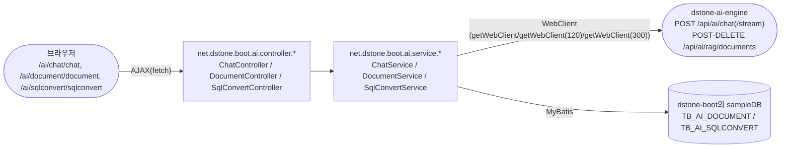
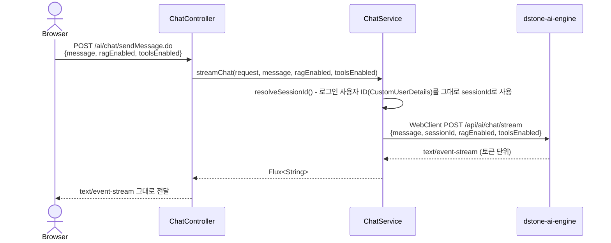
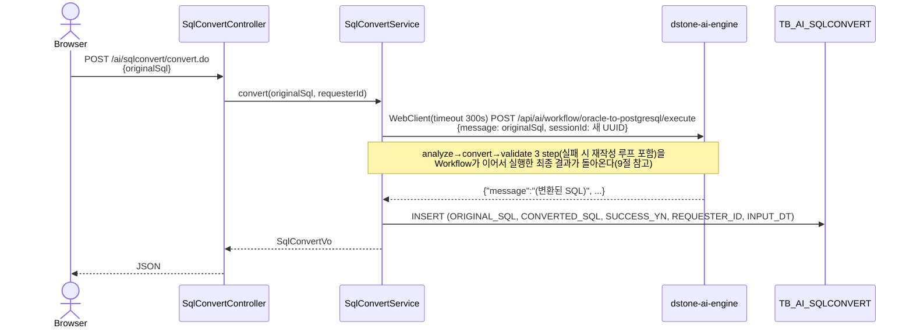

# dstone-boot

## 목차

- [1. 개요](#1-개요)
- [2. 기술 스택](#2-기술-스택)
- [3. 패키지 구조](#3-패키지-구조)
- [4. 설정 (`conf/application.yml`)](#4-설정-confapplicationyml)
  - [4.1 서버 설정](#41-서버-설정)
  - [4.2 다중 데이터소스](#42-다중-데이터소스)
  - [4.3 세션 및 캐시](#43-세션-및-캐시)
  - [4.4 소셜 로그인](#44-소셜-로그인)
  - [4.5 파일 업로드](#45-파일-업로드)
- [5. 소스 코드 분석기 (Analyzer)](#5-소스-코드-분석기-analyzer)
  - [5.1 분석 흐름](#51-분석-흐름)
  - [5.2 주요 클래스](#52-주요-클래스)
  - [5.3 분석 대상 및 추출 정보](#53-분석-대상-및-추출-정보)
- [6. 보안 (Spring Security)](#6-보안-spring-security)
- [7. AOP (Aspect-Oriented Programming)](#7-aop-aspect-oriented-programming)
- [8. 샘플 코드](#8-샘플-코드)
- [9. 빌드 및 실행](#9-빌드-및-실행)
  - [9.1 컨테이너 / 쿠버네티스 배포](#91-컨테이너--쿠버네티스-배포)
- [10. AI 연동 (`dstone-ai-engine` 프록시) 🤖](#10-ai-연동-dstone-ai-engine-프록시-)
  - [10.1 왜 `dstone-boot`가 직접 Spring AI를 쓰지 않는가](#101-왜-dstone-boot가-직접-spring-ai를-쓰지-않는가)
  - [10.2 화면 구성](#102-화면-구성)
  - [10.3 채팅 — SSE 스트리밍 프록시](#103-채팅--sse-스트리밍-프록시)
  - [10.4 문서 업로드 — RAG 적재 + 자체 메타데이터](#104-문서-업로드--rag-적재--자체-메타데이터)
  - [10.5 SQL 변환 — 동기 호출 + 이력 저장(폴링 없음)](#105-sql-변환--동기-호출--이력-저장폴링-없음)
  - [10.6 설정](#106-설정)

## 1. 개요

`dstone-boot`는 Spring Boot 기반의 통합 웹 애플리케이션 프레임워크입니다. 두 가지 주요 기능을 하나의 애플리케이션으로 제공합니다.

1. **웹 애플리케이션 프레임워크**: 다중 데이터베이스, 소셜 로그인, 메시징(RabbitMQ), WebSocket 등 현대적인 웹 애플리케이션 개발에 필요한 공통 기능과 유틸리티를 통합
2. **소스 코드 분석 도구**: Java 웹 애플리케이션의 소스 코드(Java, JSP, MyBatis XML)를 정적 분석하여 아키텍처와 의존성을 시각적으로 매핑

- **Artifact ID:** `dstone-boot`
- **Packaging:** WAR
- **Main Class:** `net.dstone.boot.DstoneBootApplication`
- **기본 포트:** 7081

---

## 2. 기술 스택

| 영역 | 기술 |
|---|---|
| 코어 | Java 21, Spring Boot 4.1.x (Spring Framework 7), dstone-common |
| 웹 | Spring MVC, JSP/JSTL, jQuery |
| 보안 | Spring Security, OAuth2 (Google/Naver/Kakao) |
| 데이터 | MyBatis, HikariCP, MySQL / Oracle / PostgreSQL / H2 |
| 캐시/세션 | Redis (Lettuce), Spring Session |
| 메시징 | RabbitMQ, WebSocket |
| 코드 분석 | javaparser 3.28.1, JSQLParser 4.7, ClassGraph 4.8.165, jsoup 1.11.3 |
| AOP | AspectJ (aspectjrt, aspectjweaver, aspectjtools) |
| API 문서 | springdoc-openapi 3.1.1 (OpenAPI 3, springfox는 2020년 마지막 릴리스 이후 방치되어 Spring Framework 7 비호환이라 교체됨) |
| 규칙 엔진 | Easy Rules 4.1.0 |
| 외부 연동 | Google Drive API, Google Sheets API |
| 기타 | Weka (머신러닝), Tess4j (OCR), ByteBuddy, Lombok |
| 빌드 | Maven (WAR 패키징) |

---

## 3. 패키지 구조

```
src/main/java/net/dstone/boot/
├── DstoneBootApplication.java          # 메인 진입점 (SpringBootServletInitializer 상속)
├── analyzer/                           # 소스 코드 분석 기능(웹 계층)
│   ├── controller/                     # AnalysisController(분석 요청)·ConfigurationController(분석 설정 화면)·ReportController(리포트)
│   ├── service/                        # ConfigurationService·ReportService
│   ├── dao/                            # ConfigurationDao·ReportDao(MyBatis)
│   ├── cud/                            # 분석 결과 CRUD(AnalyzerCudDao + Tb*CudVo 9종)
│   ├── taskitem/                       # AnalysisItem - 비동기 분석 작업 단위
│   └── vo/                             # 분석 결과 VO(AnalysisVo/OverAllVo/SysVo)
├── ai/                                 # dstone-ai-engine 연동 화면(10절) - REST controller/service/dao/vo 계층
│   ├── controller/                     # ChatController(/ai/chat/*), DocumentController(/ai/document/*), SqlConvertController(/ai/sqlconvert/*)
│   ├── service/                        # ChatService(SSE 프록시), DocumentService(업로드/삭제 프록시 + 메타데이터 기록), SqlConvertService(동기 호출 + 이력 기록)
│   ├── dao/                            # DocumentDao - TB_AI_DOCUMENT, SqlConvertDao - TB_AI_SQLCONVERT(모두 MyBatis)
│   └── vo/                             # ChatMessageRequest, DocumentVo, IngestResult, SqlConvertRequest, SqlConvertVo, ChatCallResult
└── common/
    ├── config/                         # 애플리케이션 설정
    │   ├── Config.java                 # 메인 설정
    │   ├── ConfigDatasource.java       # 다중 데이터소스 설정
    │   ├── ConfigTransaction.java      # 트랜잭션 관리(AOP 기반 txAdvisorCommon)
    │   ├── ConfigMapper.java           # MyBatis 매퍼 설정
    │   ├── ConfigRedis.java            # Redis 설정
    │   ├── ConfigRabbitMQ.java         # RabbitMQ 설정
    │   ├── ConfigKafka.java            # Kafka 설정(SAGA/Outbox 샘플용, spring.kafka.enabled 조건)
    │   ├── ConfigMessaging.java        # OutboxAppender/OutboxRelay/SagaOrchestrator 빈 구성(10절 참고)
    │   ├── ConfigAspect.java           # AOP/AspectJ 설정
    │   ├── ConfigListener.java         # SessionListener 서블릿 리스너 등록
    │   ├── ConfigSecurity.java         # Spring Security 설정(URL 권한/로그인/로그아웃, 소셜 로그인 포함) — 6절
    │   ├── ConfigSwagger.java          # springdoc-openapi 설정
    │   ├── ConfigWebMvc.java           # Spring MVC 설정
    │   └── ConfigWebSocket.java        # WebSocket 설정
    ├── security/                       # ConfigSecurity가 참조하는 인증/인가 구현체
    │   ├── Custom*Handler/Provider/Filter.java  # 로그인 성공·실패, 접근거부, 인증 필터/프로바이더
    │   ├── dao/ · svc/                 # CustomUserDao·CustomUserService(사용자/권한 조회)
    │   ├── vo/                         # CustomUserDetails
    │   └── web/                       # CustomSecurityController
    ├── web/                           # SessionListener(HttpSessionListener - 로그인 세션 카운트/속성 관리)
    ├── messaging/                      # SAGA + Outbox 패턴 샘플 기능의 dstone-boot측 배선 — 10.dstone-saga.md 전체 참고
    │   ├── saga/                       # SagaDao·SagaTransactionService(Impl) - dstone-common의 SagaOrchestrator를 트랜잭션 AOP 경계 안에서 호출
    │   └── outbox/                     # OutboxDao·OutboxRelayScheduler - dstone-common의 OutboxRelay를 주기적으로(@Scheduled) 실행
    ├── tools/
    │   ├── analyzer/                   # AppAnalyzer - 핵심 분석 엔진
    │   ├── bizgen/ · datagen/          # BizGenerator/DataGenerator - 코드/데이터 생성 유틸
    │   └── rule/                       # RuleEngine(Easy Rules 래퍼)
    └── biz/                           # BaseController/BaseService/BaseDao/BaseVo - 공통 계층 베이스 클래스

src/main/java/net/dstone/boot/sample/  # 기능별 샘플
    ├── admin/                          # 관리자 화면 샘플(AdminController/Service/Dao)
    ├── analyze/                        # 분석 샘플(BaseBiz/BaseController 등 - analyzer와 별개의 독자 샘플 계층)
    ├── cud/                            # CRUD 샘플
    ├── google/                         # Google Drive/Sheets API 연동 샘플
    ├── kafka/                          # Kafka 프로듀서/컨슈머 샘플(KafkaController/Service, SAGA 샘플과 별개)
    ├── kakao/                          # 카카오 소셜 로그인 샘플
    ├── market/                         # 커머스(구매/판매) 도메인 모델링 샘플
    ├── naver/                          # 네이버 소셜 로그인 샘플
    ├── rabbitmq/                       # RabbitMQ 발행/구독 샘플
    ├── rule/                           # Easy Rules 규칙 구현체 샘플(AgeTestRule/PositionTestRule)
    ├── saga/                           # SAGA+Outbox 주문 처리 샘플(OrderSagaController/Step01~03*Service/OrderSagaReplyListener) — 상세: 10.dstone-saga.md
    ├── swagger/                        # Swagger(springdoc-openapi) API 문서 샘플
    ├── user/                           # 사용자 관리 샘플
    └── vo/                             # 샘플 공용 VO

src/main/webapp/                        # 웹 리소스 (JSP, CSS, JS)
```

---

## 4. 설정 (`conf/application.yml`)

### 4.1 서버 설정

```yaml
server:
  port: 7081
  tomcat:
    max-threads: 200
    min-spare-threads: 10
    max-connections: 10000
  servlet:
    encoding:
      charset: UTF-8
      force-response: true
  ssl:
    enabled: false    # TLS/SSL 활성화 시 true로 변경
```

### 4.2 다중 데이터소스

세 개의 독립적인 데이터소스를 운영합니다:

| 데이터소스 | 용도 | 데이터베이스 |
|---|---|---|
| `common` | 메인 애플리케이션 | sampleDB |
| `sample` | 샘플 데이터 | sampleDB |
| `analyzer` | 분석 결과 저장 | analyzeDB |

### 4.3 세션 및 캐시

```yaml
spring:
  session:
    store-type: redis
    redis:
      namespace: dstone:session   # Redis 세션 네임스페이스
  data.redis:
    enabled: true
    client-type: lettuce
    host: ${REDIS_HOST}
    port: ${REDIS_PORT}
```

### 4.4 소셜 로그인

```yaml
# Naver OAuth2
naver:
  client-id: ...
  client-secret: ...

# Kakao OAuth2
kakao:
  client-id: ...

# Google OAuth2
google:
  client-id: ...
  client-secret: ...
```

### 4.5 파일 업로드

```yaml
spring.servlet.multipart:
  location: ${FILE_UPLOAD_ROOT}
  max-file-size: 100MB
  max-request-size: 100MB
```

---

## 5. 소스 코드 분석기 (Analyzer)

`dstone-boot`의 핵심 차별화 기능입니다. 지정된 경로의 Java 웹 애플리케이션 소스 코드를 정적 분석하여 구조와 의존성을 파악합니다.

### 5.1 분석 흐름

```
사용자 (웹 UI)
    │
    ▼ 분석 경로 지정 & 시작
AnalysisController
    │
    ▼ 비동기 처리 (UI 블로킹 없음)
AppAnalyzer (핵심 엔진)
    │
    ├── Java 파일 파싱    → javaparser    (클래스, 메소드, 어노테이션, 호출 관계)
    ├── JSP 파일 파싱     → jsoup         (화면 구조, URL 링크)
    └── MyBatis XML 파싱  → JSQLParser    (SQL 쿼리, 테이블 CRUD 관계)
    │
    ▼ 분석 결과 저장
analyzer 데이터베이스 (H2 / MySQL)
    │
    ▼ 웹 UI 조회 및 시각화
ReportController
```

### 5.2 주요 클래스

| 클래스 | 역할 |
|---|---|
| `net.dstone.boot.analyzer.controller.AnalysisController` | 분석 작업 웹 요청 처리(비동기 시작/진행상태 조회) |
| `net.dstone.boot.common.tools.analyzer.AppAnalyzer` | 실제 소스 코드 분석 엔진 |
| `net.dstone.boot.analyzer.controller.ConfigurationController` / `analyzer.service.ConfigurationService` | 분석 대상 경로·데이터소스 등 분석 설정 관리 화면 |
| `net.dstone.boot.analyzer.controller.ReportController` / `analyzer.service.ReportService` | 분석 결과 리포트 조회/시각화 |

### 5.3 분석 대상 및 추출 정보

| 파일 유형 | 파싱 라이브러리 | 추출 정보 |
|---|---|---|
| `.java` | javaparser 3.28.1 | 클래스 계층, 메소드 호출 관계, URL 매핑, 어노테이션 |
| `.jsp` | jsoup 1.11.3 | 화면 구조, 스크립트릿, URL 링크 |
| `.xml` (MyBatis) | JSQLParser 4.7 | SQL 쿼리, 파라미터, CRUD 대상 테이블 |

---

## 6. 보안 (Spring Security)

```yaml
spring.security.enabled: true
```

- **자체 인증/인가**: `ConfigSecurity.java`에서 URL별 접근 권한 설정
- **소셜 로그인**: Google, Naver, Kakao OAuth2 지원
- **세션 관리**: Redis 기반 분산 세션 (`dstone:session` 네임스페이스)
- **SSL/TLS**: `application.yml`의 `server.ssl` 설정으로 활성화 가능

---

## 7. AOP (Aspect-Oriented Programming)

`ConfigAspect.java`에서 AspectJ `@Around` 어드바이스로 계층별 호출 로그를 남깁니다(실행 시간 측정은 하지 않음):

| 대상 | 포인트컷 | 하는 일 |
|---|---|---|
| Controller | `net.dstone.boot..*Controller.*(..)` | 호출 시작/종료를 `START`/`END` 구분선과 함께 로깅, 응답 헤더 `successYn`을 `"Y"`로 기본 세팅(예외 발생 시 아래 `DsExceptionResolver`가 `"N"`으로 되돌림) |
| Service | `net.dstone.boot..*Service*.*(..)` | 호출 로그만 남김 |
| DAO | `net.dstone.boot..*Dao.*(..)` | 호출 로그 + `@NoAspectLog`가 붙은 메소드는 `ThreadContext`에 `SUPPRESS_SQL_LOG=Y`를 세팅해 log4jdbc의 SQL 로그를 일시적으로 끔 |

세 어드바이스 모두 `@annotation(net.dstone.common.annotation.NoAspectLog)`가 붙은 메소드는 (DAO의 SQL-로그-억제 용도를 제외하면) 로깅 대상에서 제외한다.

**예외 공통 처리는 AOP가 아니다.** 컨트롤러에서 발생한 예외를 공통 응답(`successYn=N` 등)으로 바꿔주는 것은 `ConfigWebMvc.configureHandlerExceptionResolvers()`에 등록된 `net.dstone.common.exception.resolver.DsExceptionResolver`(`dstone-common`)가 하는 일이며, `ConfigAspect`/AspectJ와는 별개의 Spring MVC `HandlerExceptionResolver` 메커니즘이다.

---

## 8. 샘플 코드

`src/main/java/net/dstone/boot/sample/` 경로에 다음 기능별 샘플을 제공합니다:

| 패키지 | 설명 |
|---|---|
| `admin/` | 관리자 화면(회원/그룹/권한 관리) 예제 |
| `analyze/` | 소스 분석 결과 활용 예제 |
| `cud/` | MyBatis CRUD 연동 예제 |
| `google/` | Google Drive/Sheets API 연동 |
| `kafka/` | Kafka 프로듀서/컨슈머 기본 발행·구독 예제 |
| `kakao/` | 카카오 소셜 로그인 구현 |
| `market/` | 구매자/판매자/상품 도메인 모델링(다형성) 예제 |
| `naver/` | 네이버 소셜 로그인 구현 |
| `rabbitmq/` | RabbitMQ 발행/구독 예제 |
| `rule/` | Easy Rules 규칙 엔진 적용 |
| `saga/` | **SAGA + Outbox 패턴** 주문 처리 샘플(재고차감→결제→주문확정, 실패 시 자동 보상) — 전체 실행 흐름은 [10.dstone-saga.md](10.dstone-saga.md)에 단계별 시퀀스 다이어그램으로 정리되어 있다 |
| `swagger/` | Swagger(springdoc-openapi) API 문서 자동화 |
| `user/` | 사용자 관리 예제 |

---

## 9. 빌드 및 실행

```bash
# 빌드 (WAR, executable)
cd dstone-boot
mvn clean package

# 로컬 실행 (내장 Tomcat)
java -jar target/dstone-boot.war

# 외부 Tomcat 배포 시 WAR 파일을 webapps/에 배포
```

### 9.1 컨테이너 / 쿠버네티스 배포

`dstone-boot`은 `dstone-boot/Dockerfile`(멀티스테이지 리액터 빌드)로 이미지를 만들어 로컬 `kind` 클러스터에 Pod로 배포한다(`dstone-boot/k8s/`). 상세 설계와 절차는 [04.cloud-architecture.md](04.cloud-architecture.md) 참고.

---

## 10. AI 연동 (`dstone-ai-engine` 프록시) 🤖

`dstone-boot`에 로그인한 사용자가 브라우저에서 바로 쓸 수 있는 **채팅 화면**, **RAG 문서 업로드 화면**, **SQL 변환 화면** 세 가지를 제공한다. 실제 LLM 호출/RAG 검색/문서 적재는 전부 [`dstone-ai-engine`](09.dstone-ai-engine.md)이 처리하고, `dstone-boot`의 `net.dstone.boot.ai` 패키지는 그 API를 **로그인 세션과 연결해주는 얇은 프록시 계층**이다.



### 10.1 왜 `dstone-boot`가 직접 Spring AI를 쓰지 않는가

`dstone-ai-engine`이 이미 provider-agnostic AI 서빙 플랫폼으로 따로 존재하므로(09.dstone-ai-engine.md 참고), `dstone-boot`는 Spring AI 의존성을 전혀 추가하지 않고 **순수 HTTP 클라이언트(WebClient)로만** 그 REST API를 호출한다. `dstone-common`이 제공하는 `BaseService.getWebClient()`/`getWebClient(int readTimeoutSeconds)`를 그대로 재사용하므로 `dstone-boot` 쪽에 추가 라이브러리가 필요 없다 — 두 모듈은 REST 계약(JSON 필드 이름)으로만 연동되고 클래스를 공유하지 않는다(`IngestResult`가 `dstone-ai-engine`의 `IngestResponse`와 JSON 모양만 맞춘 별도 record인 것도 같은 이유).

### 10.2 화면 구성

| URL | 파일 | 설명 |
|---|---|---|
| `/defaultLink.do?defaultLink=ai/index` | `WEB-INF/views/ai/index.jsp` | 채팅/문서업로드/SQL변환 세 카드로 이동하는 랜딩 페이지 |
| `/defaultLink.do?defaultLink=ai/chat/chat` | `WEB-INF/views/ai/chat/chat.jsp` + `webapp/ai/assets/js/chat.js` | 채팅 화면 - RAG/Tool 체크박스 + SSE로 토큰 단위 렌더링 |
| `/defaultLink.do?defaultLink=ai/document/document` | `WEB-INF/views/ai/document/document.jsp` + `webapp/ai/assets/js/document.js` | 문서 업로드/삭제/목록 화면 |
| `/defaultLink.do?defaultLink=ai/sqlconvert/sqlconvert` | `WEB-INF/views/ai/sqlconvert/sqlconvert.jsp` + `webapp/ai/assets/js/sqlconvert.js` | 오라클→PostgreSQL SQL 변환 화면 + 최근 이력 |

`BaseController`의 `defaultLink.do` 공통 라우팅(다른 화면들과 동일한 방식, CLAUDE.md 문서화 대상 아님)을 그대로 쓰고, 이 기능만을 위한 별도 `@RequestMapping` 뷰 컨트롤러는 없다.

### 10.3 채팅 — SSE 스트리밍 프록시

`ChatController.sendMessage()`(`POST /ai/chat/sendMessage.do`)는 `@RestController`(다른 화면 컨트롤러와 달리 `ModelAndView`를 반환하지 않고 전부 AJAX/SSE라서)로, `text/event-stream`을 그대로 클라이언트에 흘려보낸다.



- **`sessionId` = 로그인 사용자 ID.** 화면에서 별도 세션 ID를 받지 않고 `CustomUserDetails.getUsername()`을 그대로 `dstone-ai-engine`의 `sessionId`로 보낸다 — 사용자 한 명당 대화가 하나만 계속 이어지는 구조다(같은 사용자가 여러 대화방을 동시에 가질 수 없음). `dstone-boot ↔ dstone-ai-engine`은 서버 대 서버 호출이라 브라우저 쿠키가 전달되지 않으므로, `sessionId`를 매 요청 명시적으로 실어 보내야 `dstone-ai-engine`의 Redis 기반 대화 히스토리(09.dstone-ai-engine.md 5.3절)가 끊기지 않는다.
- **로그인 필요.** `resolveSessionId()`가 세션의 `CustomUserDetails`를 곧바로 캐스팅해서 쓰므로, 로그인하지 않은 상태로 호출하면 `NullPointerException`이 난다 — 이 화면은 다른 인증된 화면들과 동일하게 `ConfigSecurity`의 로그인 필수 정책 아래에 있다는 전제다.
- **RAG/Tool 토글은 요청 하나짜리 스위치**: `chat-rag-enabled`/`chat-tools-enabled` 체크박스 값이 그대로 `dstone-ai-engine`의 `ChatRequest.ragEnabled`/`toolsEnabled`로 전달된다(09.dstone-ai-engine.md 6.6절/9절 참고) — `dstone-boot`는 이 값을 검증하거나 가공하지 않고 그대로 중계만 한다.

### 10.4 문서 업로드 — RAG 적재 + 자체 메타데이터

`dstone-ai-engine`의 `/api/ai/rag/**`는 **적재된 문서 목록을 조회하는 API가 없다**(업로드/삭제/검색만 제공, 09.dstone-ai-engine.md 9절 참고). 그래서 "지금까지 뭘 올렸는지" 화면에 보여주려면 `dstone-boot`가 직접 그 메타데이터를 들고 있어야 하고, 그 역할이 `TB_AI_DOCUMENT`(MySQL, `common` 데이터소스/`sampleDB`)다.


- **파일은 이 코드베이스의 기존 업로드 관례를 그대로 따른다.** `DocumentController`가 `RequestUtil`로 멀티파트를 먼저 `FILE_UPLOAD_ROOT`(4.5절)에 저장한 뒤, 그 저장된 `File`을 `DocumentService`가 `FileSystemResource`로 감싸 `dstone-ai-engine`에 다시 업로드한다 - `dstone-boot`가 이미 갖고 있던 업로드 파이프라인 재사용이라 별도 멀티파트 처리 코드를 새로 만들지 않았다.
- **타임아웃 5분**: `getWebClient(300)`으로 오버로드 - Tika 텍스트 추출부터 청킹, 로컬 Ollama 임베딩까지 전부 끝나야 `dstone-ai-engine`이 응답하는 동기 호출이라, 문서 크기에 따라 기본 60초 타임아웃을 쉽게 넘긴다(`dstone-ai-engine` 쪽은 끝까지 정상 처리되는데 클라이언트만 먼저 타임아웃 나던 문제를 실측으로 확인 후 조치).
- **삭제/목록은 `TB_AI_DOCUMENT`와 `dstone-ai-engine`을 함께/따로 다룬다**: 삭제(`deleteDocument`)는 `DELETE /api/ai/rag/documents/{sourceId}` 호출과 `TB_AI_DOCUMENT` 행 삭제를 둘 다 하지만, 목록(`listDocument`)은 `TB_AI_DOCUMENT`만 조회한다(`dstone-ai-engine`에 물어볼 목록 API 자체가 없으므로).
- **`TB_AI_DOCUMENT`는 pgvector의 실제 적재 상태와 100% 동기화되어 있다는 보장이 없다** — 예를 들어 `dstone-ai-engine`을 API Key 등으로 직접 호출해 문서를 지우면(09.dstone-ai-engine.md 8.2절) 이 테이블에는 반영되지 않는다. 지금은 "`dstone-boot` 화면을 통해서만 문서를 관리한다"는 전제로 단순하게 구현돼 있다.

### 10.5 SQL 변환 — 동기 호출 + 이력 저장(폴링 없음)

오라클 SQL을 입력하면 [`dstone-ai-engine`의 `oracle-to-postgresql` Workflow](09.dstone-ai-engine.md#9-yaml-정의-작성법)를 그대로 호출해서 PostgreSQL SQL로 바꿔주는 화면이다. 채팅/문서업로드와 달리 **진행상태를 따로 폴링하는 큐가 없다** — SQL 변환 1건은 보통 수 초~수십 초면 끝나서, `DocumentService`가 이미 쓰고 있는 "동기 호출 + 넉넉한 타임아웃" 패턴을 그대로 재사용하는 것으로 충분하다고 판단했다(소스 분석기의 큐/폴링 방식은 검토했지만, 여러 건 동시 처리나 긴 백그라운드 작업이 필요한 게 아니라서 쓰지 않았다. `dstone-ai-engine`은 같은 Workflow의 비동기 계약(`/submit`+`/status/{jobId}`)도 갖고 있지만, 이 화면은 굳이 그걸 쓸 만큼 오래 걸리지 않는다).



- **매 요청마다 새 `sessionId`(UUID)를 발급한다.** 로그인 사용자 ID를 그대로 쓰는 채팅 화면과 달리, SQL 변환은 요청 하나하나가 완전히 독립적이어야 한다 — 이전 변환 내용이 다음 변환에 섞여 들어가면 안 되기 때문이다.
- **실패해도 예외를 던지지 않고 이력에 남긴다.** `dstone-ai-engine` 호출이 타임아웃 나거나 5xx를 반환해도, `SqlConvertService.convert()`는 `SUCCESS_YN='N'` + `ERROR_MESSAGE`로 `TB_AI_SQLCONVERT`에 기록한 뒤 그 결과를 그대로 화면에 돌려준다 - 화면은 "왜 실패했는지"를 사용자에게 바로 보여줄 수 있다.
- **타임아웃 5분(300초)**: `getWebClient(5 * 60)` - validate step에서 문법 검증이 실패하면 fix step으로 되돌아가는 재작성 루프(09.dstone-ai-engine.md 5절)가 붙어서 일반 채팅(기본 60초)보다 오래 걸릴 수 있어 여유를 크게 뒀다(문서 업로드와 동일한 5분 폭).
- **`TB_AI_SQLCONVERT`는 진행상태 컬럼이 없다.** 이 화면은 요청-응답이 한 번에 끝나는 동기 흐름이라 상태(PENDING/RUNNING 등) 개념 자체가 필요 없고, 그래서 이 테이블은 순수하게 "누가 언제 무엇을 변환했는지" 조회용 이력일 뿐이다.

### 10.6 설정

```yaml
interface:
  ai-engine:
    # 로컬 실행 시 localhost, kind 클러스터 배포 시엔 같은 네임스페이스(dstone)의
    # Service DNS(dstone-ai-engine)를 가리키도록 env.properties의 AI_ENGINE_HOST 값만 바꾸면 된다.
    base-url: http://${AI_ENGINE_HOST}:${AI_ENGINE_PORT}
```

`AI_ENGINE_HOST`/`AI_ENGINE_PORT`는 `conf/env.properties`에서 관리한다(다른 System Properties와 동일한 컨벤션). `dstone-ai-engine`이 아직 이 환경의 kind 클러스터에 실제 배포되지 않은 상태(09.dstone-ai-engine.md 1절 참고)라, 지금은 로컬에서 직접 기동한 `dstone-ai-engine`(포트 8081)을 가리키는 것이 유일하게 검증된 조합이다.

> 전체 모듈 빌드 명령, 배포 방식, CI/CD 파이프라인 종합 정리는 [03.build.md](03.build.md) 참고.
