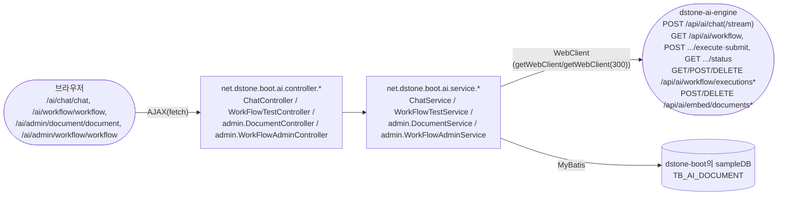
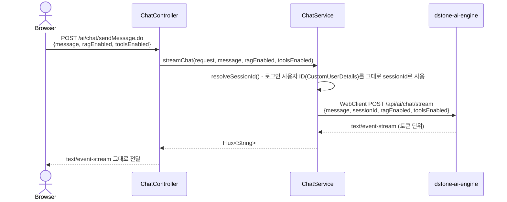
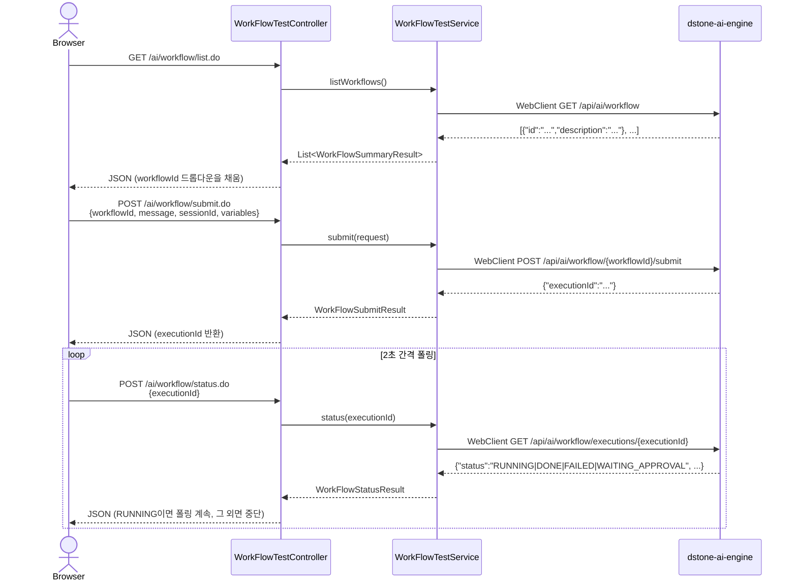
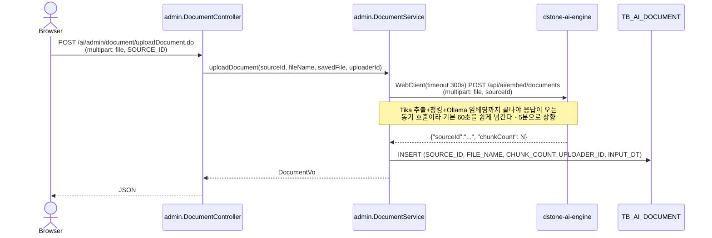
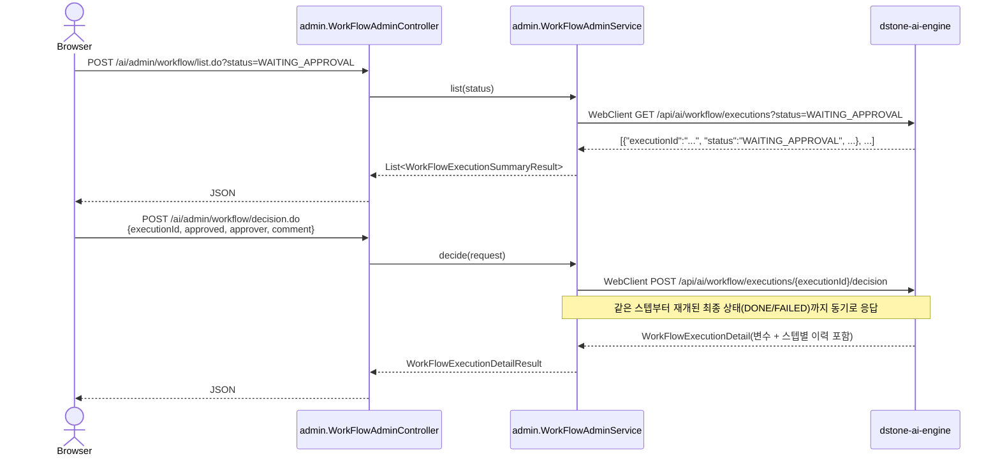

# dstone-boot

## 목차

- [1. 개요](#1-개요)
- [2. 기술 스택](#2-기술-스택)
- [3. 패키지 구조](#3-패키지-구조)
- [4. 설정 (`conf/application.yml`)](#4-설정-confapplicationyml)
  - [4.1 서버 설정](#41-서버-설정)
  - [4.2 다중 데이터소스](#42-다중-데이터소스)
  - [4.3 세션 및 캐시](#43-세션-및-캐시)
  - [4.4 소셜 로그인](#44-소셜-로그인)
  - [4.5 파일 업로드](#45-파일-업로드)
- [5. 소스 코드 분석기 (Analyzer)](#5-소스-코드-분석기-analyzer)
  - [5.1 분석 흐름](#51-분석-흐름)
  - [5.2 주요 클래스](#52-주요-클래스)
  - [5.3 분석 대상 및 추출 정보](#53-분석-대상-및-추출-정보)
- [6. 보안 (Spring Security)](#6-보안-spring-security)
- [7. AOP (Aspect-Oriented Programming)](#7-aop-aspect-oriented-programming)
- [8. 샘플 코드](#8-샘플-코드)
- [9. 빌드 및 실행](#9-빌드-및-실행)
  - [9.1 컨테이너 / 쿠버네티스 배포](#91-컨테이너--쿠버네티스-배포)
- [10. AI 연동 (`dstone-ai-engine` 프록시) 🤖](#10-ai-연동-dstone-ai-engine-프록시-)
  - [10.1 왜 `dstone-boot`가 직접 Spring AI를 쓰지 않는가](#101-왜-dstone-boot가-직접-spring-ai를-쓰지-않는가)
  - [10.2 화면 구성](#102-화면-구성)
  - [10.3 채팅 — SSE 스트리밍 프록시](#103-채팅--sse-스트리밍-프록시)
  - [10.4 Workflow 테스트 — 임의 Workflow 비동기 실행](#104-workflow-테스트--임의-workflow-비동기-실행)
  - [10.5 문서 임베딩 관리(관리자) — RAG 적재 + 자체 메타데이터](#105-문서-임베딩-관리관리자--rag-적재--자체-메타데이터)
  - [10.6 Workflow 실행 관리(관리자) — 조회 + 승인/반려](#106-workflow-실행-관리관리자--조회--승인반려)
  - [10.7 설정](#107-설정)

## 1. 개요

`dstone-boot`는 Spring Boot 기반의 통합 웹 애플리케이션 프레임워크입니다. 두 가지 주요 기능을 하나의 애플리케이션으로 제공합니다.

1. **웹 애플리케이션 프레임워크**: 다중 데이터베이스, 소셜 로그인, 메시징(RabbitMQ), WebSocket 등 현대적인 웹 애플리케이션 개발에 필요한 공통 기능과 유틸리티를 통합
2. **소스 코드 분석 도구**: Java 웹 애플리케이션의 소스 코드(Java, JSP, MyBatis XML)를 정적 분석하여 아키텍처와 의존성을 시각적으로 매핑

- **Artifact ID:** `dstone-boot`
- **Packaging:** WAR
- **Main Class:** `net.dstone.boot.DstoneBootApplication`
- **기본 포트:** 7081

---

## 2. 기술 스택

| 영역 | 기술 |
|---|---|
| 코어 | Java 21, Spring Boot 4.1.x (Spring Framework 7), dstone-common |
| 웹 | Spring MVC, JSP/JSTL, jQuery |
| 보안 | Spring Security, OAuth2 (Google/Naver/Kakao) |
| 데이터 | MyBatis, HikariCP, MySQL / Oracle / PostgreSQL / H2 |
| 캐시/세션 | Redis (Lettuce), Spring Session |
| 메시징 | RabbitMQ, WebSocket |
| 코드 분석 | javaparser 3.28.1, JSQLParser 4.7, ClassGraph 4.8.165, jsoup 1.11.3 |
| AOP | AspectJ (aspectjrt, aspectjweaver, aspectjtools) |
| API 문서 | springdoc-openapi 3.1.1 (OpenAPI 3, springfox는 2020년 마지막 릴리스 이후 방치되어 Spring Framework 7 비호환이라 교체됨) |
| 규칙 엔진 | Easy Rules 4.1.0 |
| 외부 연동 | Google Drive API, Google Sheets API |
| 기타 | Weka (머신러닝), Tess4j (OCR), ByteBuddy, Lombok |
| 빌드 | Maven (WAR 패키징) |

---

## 3. 패키지 구조

```
src/main/java/net/dstone/boot/
├── DstoneBootApplication.java          # 메인 진입점 (SpringBootServletInitializer 상속)
├── analyzer/                           # 소스 코드 분석 기능(웹 계층)
│   ├── controller/                     # AnalysisController(분석 요청)·ConfigurationController(분석 설정 화면)·ReportController(리포트)
│   ├── service/                        # ConfigurationService·ReportService
│   ├── dao/                            # ConfigurationDao·ReportDao(MyBatis)
│   ├── cud/                            # 분석 결과 CRUD(AnalyzerCudDao + Tb*CudVo 9종)
│   ├── taskitem/                       # AnalysisItem - 비동기 분석 작업 단위
│   └── vo/                             # 분석 결과 VO(AnalysisVo/OverAllVo/SysVo)
├── ai/                                 # dstone-ai-engine 연동 화면(10절) - REST controller/service/dao/vo 계층
│   ├── controller/                     # ChatController(/ai/chat/*), WorkFlowTestController(/ai/workflow/*) - 사용자용(로그인만 하면 누구나)
│   │   └── admin/                      # DocumentController(/ai/admin/document/*), WorkFlowAdminController(/ai/admin/workflow/*) - 관리자용
│   ├── service/                        # ChatService(SSE 프록시), WorkFlowTestService(목록/submit/status 프록시)
│   │   └── admin/                      # DocumentService(업로드/삭제/목록 프록시 + 메타데이터 기록), WorkFlowAdminService(실행 조회/승인 프록시)
│   ├── dao/                            # DocumentDao - TB_AI_DOCUMENT(MyBatis, 관리자 화면 전용 메타데이터)
│   └── vo/                             # ChatMessageRequest, DocumentVo, IngestResult, ChatCallResult, WorkFlow*(Test/Summary/Status/Submit)*, WorkFlowTestRequest
│       └── admin/                      # WorkFlowDecisionRequest, WorkFlowExecution(Summary/Detail)Result, WorkFlowStepHistoryResult
└── common/
    ├── config/                         # 애플리케이션 설정
    │   ├── Config.java                 # 메인 설정
    │   ├── ConfigDatasource.java       # 다중 데이터소스 설정
    │   ├── ConfigTransaction.java      # 트랜잭션 관리(AOP 기반 txAdvisorCommon)
    │   ├── ConfigMapper.java           # MyBatis 매퍼 설정
    │   ├── ConfigRedis.java            # Redis 설정
    │   ├── ConfigRabbitMQ.java         # RabbitMQ 설정
    │   ├── ConfigKafka.java            # Kafka 설정(SAGA/Outbox 샘플용, spring.kafka.enabled 조건)
    │   ├── ConfigMessaging.java        # OutboxAppender/OutboxRelay/SagaOrchestrator 빈 구성(10절 참고)
    │   ├── ConfigAspect.java           # AOP/AspectJ 설정
    │   ├── ConfigListener.java         # SessionListener 서블릿 리스너 등록
    │   ├── ConfigSecurity.java         # Spring Security 설정(URL 권한/로그인/로그아웃, 소셜 로그인 포함) — 6절
    │   ├── ConfigSwagger.java          # springdoc-openapi 설정
    │   ├── ConfigWebMvc.java           # Spring MVC 설정
    │   └── ConfigWebSocket.java        # WebSocket 설정
    ├── security/                       # ConfigSecurity가 참조하는 인증/인가 구현체
    │   ├── Custom*Handler/Provider/Filter.java  # 로그인 성공·실패, 접근거부, 인증 필터/프로바이더
    │   ├── dao/ · svc/                 # CustomUserDao·CustomUserService(사용자/권한 조회)
    │   ├── vo/                         # CustomUserDetails
    │   └── web/                       # CustomSecurityController
    ├── web/                           # SessionListener(HttpSessionListener - 로그인 세션 카운트/속성 관리)
    ├── messaging/                      # SAGA + Outbox 패턴 샘플 기능의 dstone-boot측 배선 — 10.dstone-saga.md 전체 참고
    │   ├── saga/                       # SagaDao·SagaTransactionService(Impl) - dstone-common의 SagaOrchestrator를 트랜잭션 AOP 경계 안에서 호출
    │   └── outbox/                     # OutboxDao·OutboxRelayScheduler - dstone-common의 OutboxRelay를 주기적으로(@Scheduled) 실행
    ├── tools/
    │   ├── analyzer/                   # AppAnalyzer - 핵심 분석 엔진
    │   ├── bizgen/ · datagen/          # BizGenerator/DataGenerator - 코드/데이터 생성 유틸
    │   └── rule/                       # RuleEngine(Easy Rules 래퍼)
    └── biz/                           # BaseController/BaseService/BaseDao/BaseVo - 공통 계층 베이스 클래스

src/main/java/net/dstone/boot/sample/  # 기능별 샘플
    ├── admin/                          # 관리자 화면 샘플(AdminController/Service/Dao)
    ├── analyze/                        # 분석 샘플(BaseBiz/BaseController 등 - analyzer와 별개의 독자 샘플 계층)
    ├── cud/                            # CRUD 샘플
    ├── google/                         # Google Drive/Sheets API 연동 샘플
    ├── kafka/                          # Kafka 프로듀서/컨슈머 샘플(KafkaController/Service, SAGA 샘플과 별개)
    ├── kakao/                          # 카카오 소셜 로그인 샘플
    ├── market/                         # 커머스(구매/판매) 도메인 모델링 샘플
    ├── naver/                          # 네이버 소셜 로그인 샘플
    ├── rabbitmq/                       # RabbitMQ 발행/구독 샘플
    ├── rule/                           # Easy Rules 규칙 구현체 샘플(AgeTestRule/PositionTestRule)
    ├── saga/                           # SAGA+Outbox 주문 처리 샘플(OrderSagaController/Step01~03*Service/OrderSagaReplyListener) — 상세: 10.dstone-saga.md
    ├── swagger/                        # Swagger(springdoc-openapi) API 문서 샘플
    ├── user/                           # 사용자 관리 샘플
    └── vo/                             # 샘플 공용 VO

src/main/webapp/                        # 웹 리소스 (JSP, CSS, JS)
```

---

## 4. 설정 (`conf/application.yml`)

### 4.1 서버 설정

```yaml
server:
  port: 7081
  tomcat:
    max-threads: 200
    min-spare-threads: 10
    max-connections: 10000
  servlet:
    encoding:
      charset: UTF-8
      force-response: true
  ssl:
    enabled: false    # TLS/SSL 활성화 시 true로 변경
```

### 4.2 다중 데이터소스

세 개의 독립적인 데이터소스를 운영합니다:

| 데이터소스 | 용도 | 데이터베이스 |
|---|---|---|
| `common` | 메인 애플리케이션 | sampleDB |
| `sample` | 샘플 데이터 | sampleDB |
| `analyzer` | 분석 결과 저장 | analyzeDB |

### 4.3 세션 및 캐시

```yaml
spring:
  session:
    store-type: redis
    redis:
      namespace: dstone:session   # Redis 세션 네임스페이스
  data.redis:
    enabled: true
    client-type: lettuce
    host: ${REDIS_HOST}
    port: ${REDIS_PORT}
```

### 4.4 소셜 로그인

```yaml
# Naver OAuth2
naver:
  client-id: ...
  client-secret: ...

# Kakao OAuth2
kakao:
  client-id: ...

# Google OAuth2
google:
  client-id: ...
  client-secret: ...
```

### 4.5 파일 업로드

```yaml
spring.servlet.multipart:
  location: ${FILE_UPLOAD_ROOT}
  max-file-size: 100MB
  max-request-size: 100MB
```

---

## 5. 소스 코드 분석기 (Analyzer)

`dstone-boot`의 핵심 차별화 기능입니다. 지정된 경로의 Java 웹 애플리케이션 소스 코드를 정적 분석하여 구조와 의존성을 파악합니다.

### 5.1 분석 흐름

```
사용자 (웹 UI)
    │
    ▼ 분석 경로 지정 & 시작
AnalysisController
    │
    ▼ 비동기 처리 (UI 블로킹 없음)
AppAnalyzer (핵심 엔진)
    │
    ├── Java 파일 파싱    → javaparser    (클래스, 메소드, 어노테이션, 호출 관계)
    ├── JSP 파일 파싱     → jsoup         (화면 구조, URL 링크)
    └── MyBatis XML 파싱  → JSQLParser    (SQL 쿼리, 테이블 CRUD 관계)
    │
    ▼ 분석 결과 저장
analyzer 데이터베이스 (H2 / MySQL)
    │
    ▼ 웹 UI 조회 및 시각화
ReportController
```

### 5.2 주요 클래스

| 클래스 | 역할 |
|---|---|
| `net.dstone.boot.analyzer.controller.AnalysisController` | 분석 작업 웹 요청 처리(비동기 시작/진행상태 조회) |
| `net.dstone.boot.common.tools.analyzer.AppAnalyzer` | 실제 소스 코드 분석 엔진 |
| `net.dstone.boot.analyzer.controller.ConfigurationController` / `analyzer.service.ConfigurationService` | 분석 대상 경로·데이터소스 등 분석 설정 관리 화면 |
| `net.dstone.boot.analyzer.controller.ReportController` / `analyzer.service.ReportService` | 분석 결과 리포트 조회/시각화 |

### 5.3 분석 대상 및 추출 정보

| 파일 유형 | 파싱 라이브러리 | 추출 정보 |
|---|---|---|
| `.java` | javaparser 3.28.1 | 클래스 계층, 메소드 호출 관계, URL 매핑, 어노테이션 |
| `.jsp` | jsoup 1.11.3 | 화면 구조, 스크립트릿, URL 링크 |
| `.xml` (MyBatis) | JSQLParser 4.7 | SQL 쿼리, 파라미터, CRUD 대상 테이블 |

---

## 6. 보안 (Spring Security)

```yaml
spring.security.enabled: true
```

- **자체 인증/인가**: `ConfigSecurity.java`에서 URL별 접근 권한 설정
- **소셜 로그인**: Google, Naver, Kakao OAuth2 지원
- **세션 관리**: Redis 기반 분산 세션 (`dstone:session` 네임스페이스)
- **SSL/TLS**: `application.yml`의 `server.ssl` 설정으로 활성화 가능

---

## 7. AOP (Aspect-Oriented Programming)

`ConfigAspect.java`에서 AspectJ `@Around` 어드바이스로 계층별 호출 로그를 남깁니다(실행 시간 측정은 하지 않음):

| 대상 | 포인트컷 | 하는 일 |
|---|---|---|
| Controller | `net.dstone.boot..*Controller.*(..)` | 호출 시작/종료를 `START`/`END` 구분선과 함께 로깅, 응답 헤더 `successYn`을 `"Y"`로 기본 세팅(예외 발생 시 아래 `DsExceptionResolver`가 `"N"`으로 되돌림) |
| Service | `net.dstone.boot..*Service*.*(..)` | 호출 로그만 남김 |
| DAO | `net.dstone.boot..*Dao.*(..)` | 호출 로그 + `@NoAspectLog`가 붙은 메소드는 `ThreadContext`에 `SUPPRESS_SQL_LOG=Y`를 세팅해 log4jdbc의 SQL 로그를 일시적으로 끔 |

세 어드바이스 모두 `@annotation(net.dstone.common.annotation.NoAspectLog)`가 붙은 메소드는 (DAO의 SQL-로그-억제 용도를 제외하면) 로깅 대상에서 제외한다.

**예외 공통 처리는 AOP가 아니다.** 컨트롤러에서 발생한 예외를 공통 응답(`successYn=N` 등)으로 바꿔주는 것은 `ConfigWebMvc.configureHandlerExceptionResolvers()`에 등록된 `net.dstone.common.exception.resolver.DsExceptionResolver`(`dstone-common`)가 하는 일이며, `ConfigAspect`/AspectJ와는 별개의 Spring MVC `HandlerExceptionResolver` 메커니즘이다.

---

## 8. 샘플 코드

`src/main/java/net/dstone/boot/sample/` 경로에 다음 기능별 샘플을 제공합니다:

| 패키지 | 설명 |
|---|---|
| `admin/` | 관리자 화면(회원/그룹/권한 관리) 예제 |
| `analyze/` | 소스 분석 결과 활용 예제 |
| `cud/` | MyBatis CRUD 연동 예제 |
| `google/` | Google Drive/Sheets API 연동 |
| `kafka/` | Kafka 프로듀서/컨슈머 기본 발행·구독 예제 |
| `kakao/` | 카카오 소셜 로그인 구현 |
| `market/` | 구매자/판매자/상품 도메인 모델링(다형성) 예제 |
| `naver/` | 네이버 소셜 로그인 구현 |
| `rabbitmq/` | RabbitMQ 발행/구독 예제 |
| `rule/` | Easy Rules 규칙 엔진 적용 |
| `saga/` | **SAGA + Outbox 패턴** 주문 처리 샘플(재고차감→결제→주문확정, 실패 시 자동 보상) — 전체 실행 흐름은 [10.dstone-saga.md](10.dstone-saga.md)에 단계별 시퀀스 다이어그램으로 정리되어 있다 |
| `swagger/` | Swagger(springdoc-openapi) API 문서 자동화 |
| `user/` | 사용자 관리 예제 |

---

## 9. 빌드 및 실행

```bash
# 빌드 (WAR, executable)
cd dstone-boot
mvn clean package

# 로컬 실행 (내장 Tomcat)
java -jar target/dstone-boot.war

# 외부 Tomcat 배포 시 WAR 파일을 webapps/에 배포
```

### 9.1 컨테이너 / 쿠버네티스 배포

`dstone-boot`은 `dstone-boot/Dockerfile`(멀티스테이지 리액터 빌드)로 이미지를 만들어 로컬 `kind` 클러스터에 Pod로 배포한다(`dstone-boot/k8s/`). 상세 설계와 절차는 [04.cloud-architecture.md](04.cloud-architecture.md) 참고.

---

## 10. AI 연동 (`dstone-ai-engine` 프록시) 🤖

`dstone-boot`가 제공하는 AI 화면은 "사용자"(로그인만 하면 누구나) 두 개 - **채팅**, **Workflow 테스트** -
와 "관리자"(운영자용) 두 개 - **문서 임베딩 관리**, **Workflow 실행 관리** - 로 나뉜다(2026-09-21
메뉴 개편 - 이전에 있던 "SQL 변환" 전용 화면은 Oracle→PostgreSQL 변환이라는 특정 도메인 하나만
다뤘는데, 이제는 그 자리를 "Workflow 테스트"가 대신한다 - 어떤 Workflow든 골라 실행해볼 수 있으므로
SQL 변환도 `dstone-ai-engine`에 그런 Workflow가 등록돼 있으면 그 화면에서 그대로 확인할 수 있다).
실제 LLM 호출/RAG 검색/문서 적재/Workflow 실행은 전부 [`dstone-ai-engine`](09.dstone-ai-engine.md)이
처리하고, `dstone-boot`의 `net.dstone.boot.ai` 패키지는 그 API를 **로그인 세션과 연결해주는 얇은 프록시
계층**이다.



### 10.1 왜 `dstone-boot`가 직접 Spring AI를 쓰지 않는가

`dstone-ai-engine`이 이미 provider-agnostic AI 서빙 플랫폼으로 따로 존재하므로(09.dstone-ai-engine.md 참고), `dstone-boot`는 Spring AI 의존성을 전혀 추가하지 않고 **순수 HTTP 클라이언트(WebClient)로만** 그 REST API를 호출한다. `dstone-common`이 제공하는 `BaseService.getWebClient()`/`getWebClient(int readTimeoutSeconds)`를 그대로 재사용하므로 `dstone-boot` 쪽에 추가 라이브러리가 필요 없다 — 두 모듈은 REST 계약(JSON 필드 이름)으로만 연동되고 클래스를 공유하지 않는다(`IngestResult`가 `dstone-ai-engine`의 `IngestResponse`와 JSON 모양만 맞춘 별도 record인 것도 같은 이유).

### 10.2 화면 구성

| 구분 | URL | 파일 | 설명 |
|---|---|---|---|
| - | `/defaultLink.do?defaultLink=ai/index` | `WEB-INF/views/ai/index.jsp` | 사용자/관리자 네 카드로 이동하는 랜딩 페이지 |
| 사용자 | `/defaultLink.do?defaultLink=ai/chat/chat` | `WEB-INF/views/ai/chat/chat.jsp` + `webapp/ai/assets/js/chat.js` | 채팅 화면 - RAG/Tool 체크박스 + SSE로 토큰 단위 렌더링 |
| 사용자 | `/defaultLink.do?defaultLink=ai/workflow/workflow` | `WEB-INF/views/ai/workflow/workflow.jsp` + `webapp/ai/assets/js/workflow.js` | 등록된 Workflow를 드롭다운에서 골라 submit/status 비동기 호출을 확인 |
| 관리자 | `/defaultLink.do?defaultLink=ai/admin/document/document` | `WEB-INF/views/ai/admin/document/document.jsp` + `webapp/ai/assets/js/document.js` | 문서 임베딩 업로드/삭제/목록 화면 |
| 관리자 | `/defaultLink.do?defaultLink=ai/admin/workflow/workflow` | `WEB-INF/views/ai/admin/workflow/workflow.jsp` + `webapp/ai/assets/js/workflow-admin.js` | Workflow 실행 조회 + APPROVAL 승인/반려 |

`BaseController`의 `defaultLink.do` 공통 라우팅(다른 화면들과 동일한 방식, CLAUDE.md 문서화 대상 아님)을 그대로 쓰고, 이 기능만을 위한 별도 `@RequestMapping` 뷰 컨트롤러는 없다. 다섯 화면 모두 `WEB-INF/views/ai/common/header.jsp`의 공유 상단 네비게이션(메인/채팅/Workflow 테스트/문서 임베딩 관리/Workflow 실행 관리)을 include한다 - "사용자"/"관리자" 구분은 URL 패키지 관례(`controller.admin`, `/ai/admin/**`)일 뿐이고, 그 이상의 별도 권한 체크는 아직 없다(`ConfigSecurity`의 로그인 필수 정책만 공통으로 적용된다 - 6절 참고).

### 10.3 채팅 — SSE 스트리밍 프록시

`ChatController.sendMessage()`(`POST /ai/chat/sendMessage.do`)는 `@RestController`(다른 화면 컨트롤러와 달리 `ModelAndView`를 반환하지 않고 전부 AJAX/SSE라서)로, `text/event-stream`을 그대로 클라이언트에 흘려보낸다.



- **`sessionId` = 로그인 사용자 ID.** 화면에서 별도 세션 ID를 받지 않고 `CustomUserDetails.getUsername()`을 그대로 `dstone-ai-engine`의 `sessionId`로 보낸다 — 사용자 한 명당 대화가 하나만 계속 이어지는 구조다(같은 사용자가 여러 대화방을 동시에 가질 수 없음). `dstone-boot ↔ dstone-ai-engine`은 서버 대 서버 호출이라 브라우저 쿠키가 전달되지 않으므로, `sessionId`를 매 요청 명시적으로 실어 보내야 `dstone-ai-engine`의 Redis 기반 대화 히스토리(09.dstone-ai-engine.md 5.3절)가 끊기지 않는다.
- **로그인 필요.** `resolveSessionId()`가 세션의 `CustomUserDetails`를 곧바로 캐스팅해서 쓰므로, 로그인하지 않은 상태로 호출하면 `NullPointerException`이 난다 — 이 화면은 다른 인증된 화면들과 동일하게 `ConfigSecurity`의 로그인 필수 정책 아래에 있다는 전제다.
- **RAG/Tool 토글은 요청 하나짜리 스위치**: `chat-rag-enabled`/`chat-tools-enabled` 체크박스 값이 그대로 `dstone-ai-engine`의 `ChatRequest.ragEnabled`/`toolsEnabled`로 전달된다(09.dstone-ai-engine.md 6.6절/9절 참고) — `dstone-boot`는 이 값을 검증하거나 가공하지 않고 그대로 중계만 한다.

### 10.4 Workflow 테스트 — 임의 Workflow 비동기 실행

임의의 `dstone-ai-engine` Workflow(09.dstone-ai-engine.md 9절 - `resources/workflows/*.yml`)를 골라
`submit`+`status` 비동기 계약으로 직접 눌러보는 개발/테스트 화면이다. `WorkFlowTestController`
(`/ai/workflow/*`)는 세 액션을 제공한다 - `GET /list.do`(등록된 Workflow id+description 목록,
드롭다운을 채우는 용도), `POST /submit.do`, `POST /status.do`.



- **workflowId는 화면에서 목록으로 고른다.** `WorkFlowTestService.listWorkflows()`가 `GET /api/ai/workflow`를
  그대로 중계한다(`common.registry.WorkFlowRegistry.list()`가 caller의 `allowedCallers`를 통과한
  Workflow만 걸러주므로, 여기 나온 id는 그대로 submit해도 caller 검증에서 막히지 않는다).
- **submit()/status() 둘 다 예외를 위로 던지지 않고 결과 VO의 `error` 필드에 담는다** - 화면은 항상
  JSON으로 성공/실패를 받아야 한다(`listWorkflows()`만 예외적으로 그대로 던진다 - 초기 로딩 실패는
  드롭다운이 비는 것으로 화면에서 자연스럽게 드러나면 된다).
- **실행 목록 조회나 APPROVAL 승인/반려는 여기 없다** - 그건 10.6절의 관리자 화면(`WorkFlowAdminController`)
  책임이다. 이 화면은 어디까지나 "Workflow 하나를 골라 실행하고 결과를 확인"하는 개발자용 테스트다.

### 10.5 문서 임베딩 관리(관리자) — RAG 적재 + 자체 메타데이터

`dstone-ai-engine`의 `EmbedController`(`/api/ai/embed/**`)는 업로드/삭제/목록 API를 전부 제공하지만,
`dstone-boot`는 그 목록 API를 그대로 쓰지 않고 자체적으로 `TB_AI_DOCUMENT`(MySQL, `common` 데이터소스/
`sampleDB`)에 메타데이터를 한 번 더 남긴다(업로더 ID처럼 `dstone-ai-engine`이 모르는 `dstone-boot`
쪽 정보까지 같이 보여주기 위함). 개발자가 찔러보는 "테스트"가 아니라 실제로 벡터스토어에 데이터를
넣고 빼는 관리 작업이라 `controller.admin` 패키지, `/ai/admin/document/*` URL에 있다.



- **파일은 이 코드베이스의 기존 업로드 관례를 그대로 따른다.** `DocumentController`가 `RequestUtil`로 멀티파트를 먼저 `FILE_UPLOAD_ROOT`(4.5절)에 저장한 뒤, 그 저장된 `File`을 `DocumentService`가 `FileSystemResource`로 감싸 `dstone-ai-engine`에 다시 업로드한다 - `dstone-boot`가 이미 갖고 있던 업로드 파이프라인 재사용이라 별도 멀티파트 처리 코드를 새로 만들지 않았다.
- **타임아웃 5분**: `getWebClient(300)`으로 오버로드 - Tika 텍스트 추출부터 청킹, 로컬 Ollama 임베딩까지 전부 끝나야 `dstone-ai-engine`이 응답하는 동기 호출이라, 문서 크기에 따라 기본 60초 타임아웃을 쉽게 넘긴다(`dstone-ai-engine` 쪽은 끝까지 정상 처리되는데 클라이언트만 먼저 타임아웃 나던 문제를 실측으로 확인 후 조치).
- **삭제/목록은 `TB_AI_DOCUMENT`와 `dstone-ai-engine`을 함께/따로 다룬다**: 삭제(`deleteDocument`)는 `DELETE /api/ai/embed/documents/{sourceId}` 호출과 `TB_AI_DOCUMENT` 행 삭제를 둘 다 하지만, 목록(`listDocument`)은 `TB_AI_DOCUMENT`만 조회한다(`dstone-ai-engine`의 `GET /api/ai/embed/documents`를 대신 쓸 수도 있지만, 업로더 ID 등 `dstone-boot` 쪽 메타데이터까지 같이 보여주려면 자체 테이블이 더 간단하다).
- **`TB_AI_DOCUMENT`는 pgvector의 실제 적재 상태와 100% 동기화되어 있다는 보장이 없다** — 예를 들어 `dstone-ai-engine`을 API Key 등으로 직접 호출해 문서를 지우면 이 테이블에는 반영되지 않는다. 지금은 "`dstone-boot` 화면을 통해서만 문서를 관리한다"는 전제로 단순하게 구현돼 있다.

### 10.6 Workflow 실행 관리(관리자) — 조회 + 승인/반려

이미 시작된 Workflow 실행(10.4절의 "Workflow 테스트" 화면이든, `dstone-ai-engine`을 직접 호출한
다른 caller든)을 목록에서 찾아 상세(스텝별 이력 포함)를 보고, `APPROVAL` 스텝에서 멈춰
`WAITING_APPROVAL` 상태인 실행을 승인/반려하는 운영자용 화면이다. `WorkFlowAdminController`
(`/ai/admin/workflow/*`)가 `dstone-ai-engine`의 `WorkFlowExecutionController`
(`GET /executions`, `GET /executions/{id}`, `POST /executions/{id}/decision`)를 그대로 중계한다.



- **`dstone-boot`는 자체 DB를 갖지 않는다** - 실행 상태/이력은 전부 `dstone-ai-engine`이
  `AI_WORKFLOW_EXECUTION*`(PostgreSQL)에 영속화한 것을 그때그때 조회만 한다(09.dstone-ai-engine.md
  11절 참고). 문서 임베딩 관리(10.5절)의 `TB_AI_DOCUMENT`처럼 자체 메타데이터를 따로 갖지 않는 이유는,
  "누가 업로드했는지"처럼 `dstone-ai-engine`이 모르는 정보를 추가할 필요가 없기 때문이다.
- **승인/반려(`decision.do`)는 동기 호출이다.** 승인되면 같은 스텝부터 재개돼 다음 스텝들까지 전부
  실행된 뒤(성공하면 `DONE`, 이후 스텝이 실패하면 `FAILED`) 그 최종 상태로 응답한다 - "승인했다"는
  사실만 기록하고 끝나는 게 아니라, 재개 이후의 실행까지 이 호출 하나로 끝까지 지켜본다.

### 10.7 설정

```yaml
interface:
  ai-engine:
    # 로컬 실행 시 localhost, kind 클러스터 배포 시엔 같은 네임스페이스(dstone)의
    # Service DNS(dstone-ai-engine)를 가리키도록 env.properties의 AI_ENGINE_HOST 값만 바꾸면 된다.
    base-url: http://${AI_ENGINE_HOST}:${AI_ENGINE_PORT}
```

`AI_ENGINE_HOST`/`AI_ENGINE_PORT`는 `conf/env.properties`에서 관리한다(다른 System Properties와 동일한 컨벤션). `dstone-ai-engine`이 아직 이 환경의 kind 클러스터에 실제 배포되지 않은 상태(09.dstone-ai-engine.md 1절 참고)라, 지금은 로컬에서 직접 기동한 `dstone-ai-engine`(포트 8081)을 가리키는 것이 유일하게 검증된 조합이다.

> 전체 모듈 빌드 명령, 배포 방식, CI/CD 파이프라인 종합 정리는 [03.build.md](03.build.md) 참고.
