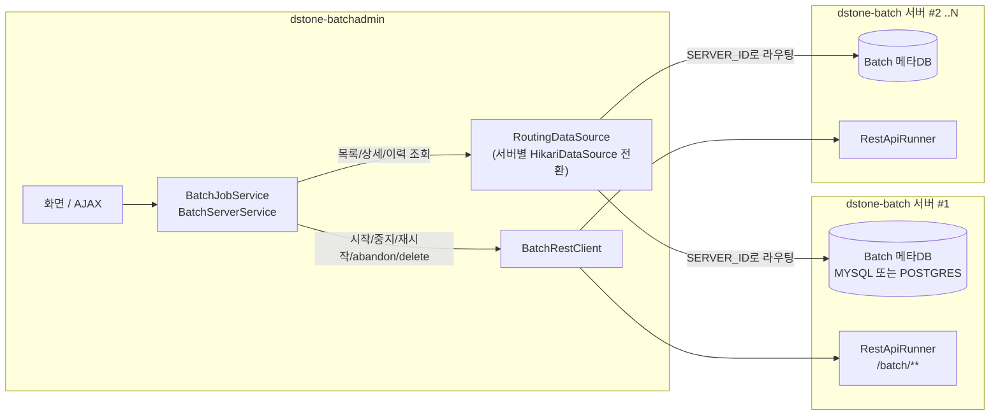
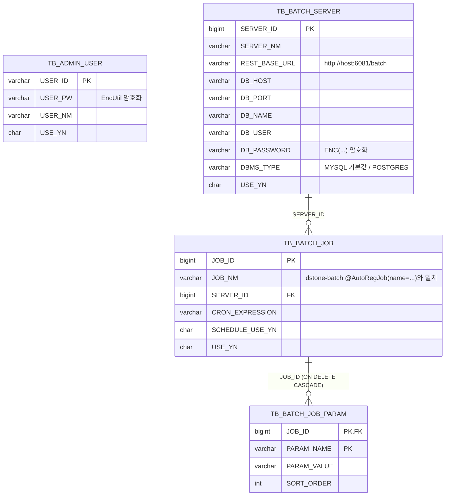

# dstone-batchadmin

## 목차

- [1. 개요](#1-개요)
- [2. 핵심 특징](#2-핵심-특징)
- [3. 프로젝트 구조](#3-프로젝트-구조)
- [4. 아키텍처 — 두 가지 연동 경로](#4-아키텍처--두-가지-연동-경로)
  - [4.1 직접 DB 조회 (목록/상세/이력)](#41-직접-db-조회-목록상세이력)
  - [4.2 REST 호출 (제어 명령)](#42-rest-호출-제어-명령)
  - [4.3 데이터소스 두 개](#43-데이터소스-두-개)
  - [4.4 잡 메타데이터 매칭 규칙](#44-잡-메타데이터-매칭-규칙)
  - [4.5 CRON 자동 스케줄링](#45-cron-자동-스케줄링)
  - [4.6 데이터 모델 한눈에 보기](#46-데이터-모델-한눈에-보기)
- [5. 보안](#5-보안)
- [6. VM 스타일 운영 (bin/*.sh)](#6-vm-스타일-운영-binsh)
- [7. 빌드 및 실행](#7-빌드-및-실행)

## 1. 개요

`dstone-batchadmin`은 하나 이상의 `dstone-batch` 서버 인스턴스를 목록/상세 조회, 시작/중지/재시작, CRON 자동 스케줄링으로 관리하는 웹 애플리케이션이다. `dstone-batch`처럼 배치 잡을 직접 실행하지는 않으며, 등록된 `dstone-batch` 서버의 REST API를 원격 호출하고 그 서버의 Spring Batch 메타데이터 테이블을 직접 조회하는 "관제탑" 역할을 한다.

- **Artifact ID:** `dstone-batchadmin`
- **Packaging:** WAR
- **Main Class:** `net.dstone.batchadmin.DstoneBatchAdminApplication`
- **기본 포트:** 5081

---

## 2. 핵심 특징

| 특징 | 설명 |
|---|---|
| 다중 배치 서버 관리 | `TB_BATCH_SERVER`에 등록된 여러 `dstone-batch` 인스턴스를 하나의 화면에서 관리 |
| 런타임 라우팅 데이터소스 | 서버마다 다른 DB 커넥션을 `RoutingDataSource`로 실행 시점에 전환 |
| REST 기반 원격 제어 | 시작/중지/재시작/abandon/delete는 대상 `dstone-batch`의 `RestApiRunner` API를 호출 |
| CRON 자동 스케줄링 | `SCHEDULE_USE_YN='Y'`인 잡을 `ThreadPoolTaskScheduler`+`CronTrigger`로 자동 실행 |
| 단순 보안 모델 | 로그인은 필요하지만 URL별 권한 체크는 없는 단일 역할 내부 관리 도구 |

---

## 3. 프로젝트 구조

```
dstone-batchadmin/
├── bin/                            # VM 스타일 기동/중지 스크립트 (systemd 미사용)
│   ├── startApp.sh
│   ├── stopApp.sh
│   └── statusApp.sh
├── conf/                           # 외부 설정 파일
│   ├── application.yml
│   ├── env*.properties             # local/dev/wsl/vm 프로파일별 설정
│   └── log4j2.xml
└── src/main/
    ├── java/net/dstone/batchadmin/
    │   ├── DstoneBatchAdminApplication.java   # 메인 진입점
    │   ├── common/
    │   │   ├── config/             # Config, ConfigDatasource, ConfigTransaction, ConfigMapper, ConfigScheduler, ConfigListener, ConfigAspect, ConfigWebMvc, ConfigSecurity
    │   │   ├── datasource/         # RoutingDataSource, RoutingDataSourceContextHolder, BatchServerDataSourceRegistry
    │   │   ├── rest/                # BatchRestClient - 대상 dstone-batch 서버 REST 호출
    │   │   ├── scheduler/          # JobScheduleManager - CRON 자동 기동
    │   │   ├── security/           # ConfigSecurity가 참조하는 로그인/인증 컴포넌트(CustomAuthenticationProvider, CustomAuth*Handler 등)
    │   │   ├── web/                 # SessionListener - 세션 등록/중복로그인 추적(ConfigListener가 서블릿 리스너로 등록)
    │   │   └── biz/                # BaseController/BaseDao/BaseService/BaseVo 공통 계층 — job/server 패키지의 모든 Controller/Dao/Service/Vo가 이걸 상속
    │   ├── job/                    # BatchJobController/Service/Dao/Vo - 잡 메타데이터·실행이력 관리
    │   └── server/                 # BatchServerController/Service/Dao/Vo - 배치서버 등록/관리
    └── resources/
        ├── schema/                 # TB_ADMIN_USER, TB_BATCH_SERVER, TB_BATCH_JOB 등 생성 스크립트
        └── sqlmap/{common,server,job}/  # MyBatis 매퍼 XML
```

---

## 4. 아키텍처 — 두 가지 연동 경로

각 등록된 배치 서버(`TB_BATCH_SERVER`)마다 두 가지 방식으로 상호작용한다. "조회"는 대상 서버의 DB를 직접 들여다보고, "제어"는 대상 서버에 REST로 명령만 던진다 — 이 둘은 완전히 분리된 경로라는 점이 이 아키텍처의 핵심이다.



### 4.1 직접 DB 조회 (목록/상세/이력)
`RoutingDataSource`(`common/datasource/RoutingDataSource.java`)가 요청마다 대상 서버의 `HikariDataSource`로 라우팅해, 그 서버의 Spring Batch 메타데이터 테이블(`BATCH_JOB_INSTANCE`/`BATCH_JOB_EXECUTION`/`BATCH_STEP_EXECUTION`)을 직접 조회한다. `BatchServerDataSourceRegistry`가 서버별 데이터소스를 빌드·캐시한다.

`RoutingDataSource`를 쓰면 MyBatis의 `databaseIdProvider`가 쿼리마다 DB 종류를 판별하지 못하므로, MySQL/PostgreSQL 페이징 문법 차이는 `databaseId` 매퍼 속성 대신 명시적 `DBMS_TYPE` 파라미터 + `<choose>` 분기(`sqlmap/job/BatchJobExecDao.xml`)로 처리한다.

### 4.2 REST 호출 (제어 명령)
시작/중지/재시작/abandon/delete 같은 제어 액션은 `common/rest/BatchRestClient.java`가 대상 서버의 `dstone-batch` `RestApiRunner` 엔드포인트(`/batch/startJob/{jobName}`, `/batch/stopJob/{id}` 등)를 호출한다.

### 4.3 데이터소스 두 개
- `common` → `batchadmin` 스키마(정적) — 자체 로그인 사용자(`TB_ADMIN_USER`), 서버 등록정보(`TB_BATCH_SERVER`), 잡 메타데이터(`TB_BATCH_JOB`)
- `batch` → 위의 `RoutingDataSource`(동적, 등록된 서버 수만큼 대상 존재)

### 4.4 잡 메타데이터 매칭 규칙
`TB_BATCH_JOB.JOB_NM`은 대상 `dstone-batch` 서버의 `@AutoRegJob(name=...)` 값과 정확히 일치해야 한다. `dstone-batchadmin`은 새 Job 로직을 만들 수 없고, 이미 존재하는 Job의 메타데이터 관리와 REST API 트리거만 담당한다.

### 4.5 CRON 자동 스케줄링
`common/scheduler/JobScheduleManager.java`가 Spring 내장 `ThreadPoolTaskScheduler` + `CronTrigger`를 사용한다(Quartz 미사용). 기동 시 `SCHEDULE_USE_YN='Y'`인 `TB_BATCH_JOB` 행을 전부 읽어 CRON 표현식으로 예약해두고(`@PostConstruct`), 이후 잡을 저장/삭제할 때마다 `BatchJobService`가 `scheduleJob()`/`unscheduleJob()`을 호출해 스케줄을 그때그때 갱신한다 — 별도 폴링 없이 저장 시점에 즉시 반영된다. 실제 기동 순간에는 `fireJob()`이 그 잡이 여전히 `USE_YN='Y'` && `SCHEDULE_USE_YN='Y'`인지, 대상 서버가 `USE_YN='Y'`인지 다시 한번 확인한 뒤에만 `BatchRestClient.startJob()`을 호출한다.

> 💡 자동 스케줄과 화면에서의 수동 "시작" 버튼은 최종적으로 같은 경로(`BatchRestClient.startJob()` → 대상 서버 `RestApiRunner`)를 탄다 — 차이는 "누가/언제 호출을 트리거하느냐" 뿐이다.

### 4.6 데이터 모델 한눈에 보기

`dstone-batchadmin` 자체 스키마(`common` 데이터소스)는 아래 4개 테이블로 구성된다. 실제 생성 스크립트는 `src/main/resources/schema/02-create-table-mysql-dstone-batchadmin.sql`.



- **`TB_BATCH_SERVER.DBMS_TYPE`**: 서버마다 `MYSQL`/`POSTGRES`를 독립적으로 지정할 수 있다 — `BatchServerDataSourceRegistry`가 이 값으로 드라이버/JDBC URL을 갈라 만들고(`net.sf.log4jdbc...DriverSpy` vs `org.postgresql.Driver`), 매퍼 XML(`BatchJobExecDao.xml`)도 같은 값을 파라미터로 받아 페이징/날짜파싱 SQL을 분기한다. 즉 하나의 `dstone-batchadmin`이 MySQL 배치서버와 PostgreSQL 배치서버를 동시에 관리할 수 있다.
- **`TB_BATCH_JOB_PARAM`**: Job 등록화면에서 입력한 실행파라미터를 저장해뒀다가, "시작" 버튼이나 CRON 자동기동 양쪽 모두에서 `dstone-batch`의 `startJob` REST 호출 쿼리파라미터로 그대로 실어 보낸다.
- 초기 샘플 데이터(`03-create-data-mysql-dstone-batchadmin.sql`)에는 `dstone-batch`가 실제로 제공하는 11개 샘플 잡(`sampleJob`, `tableDataGenType01/02Job`, `tableUpdateType01~03Job`, `fileDataGenJob`, `fileCopyType01/02Job`, `fileToTableJob`, `tableToFileJob`)이 등록돼 있어, 최초 기동 직후에도 바로 화면에서 조회/기동해볼 수 있다.

---

## 5. 보안

- 로그인 필요(`TB_ADMIN_USER`, `BCryptPasswordEncoder`)
- `dstone-boot`과 달리 URL별 role/permission 체크는 없음 — 단일 역할 내부 관리 도구로 단순화
- `common/security/`에 `ConfigSecurity`, `CustomAuthenticationProvider`, `CustomUserService` 등 로그인 처리 컴포넌트가 있음

---

## 6. VM 스타일 운영 (bin/*.sh)

systemd에 등록하지 않고 쉘 스크립트로만 기동/중지한다. `dstone-batch`와 동일한 패턴(PID 캡처, glob 기반 아티팩트 탐색, `DSTONE_PROFILE` 환경변수로 프로파일 선택)이다.

```bash
cd dstone-batchadmin/bin
./startApp.sh          # 기본 프로파일: wsl (APP_CONF_DIR=/app/dstone/dstone-batchadmin/conf)
DSTONE_PROFILE=vm ./startApp.sh   # Jenkins CI/CD 배포 경로용 프로파일
./statusApp.sh
./stopApp.sh
```

프로파일별 대상 및 설계 배경은 [04.cloud-architecture.md](04.cloud-architecture.md#4-dstone-batch--dstone-batchadmin--vm-스타일) 참고.

---

## 7. 빌드 및 실행

```bash
cd dstone-batchadmin
mvn clean package

# 실행 (executable WAR)
java -jar target/dstone-batchadmin.war
```

> CLAUDE.md 기준 CI/CD 파이프라인: `dstone-batchadmin/Jenkinsfile`이 Maven 리액터 빌드 후 `bin/startApp.sh`로 재기동한다.

> 전체 모듈 빌드 명령, 배포 방식, CI/CD 파이프라인 종합 정리는 [03.build.md](03.build.md) 참고.
