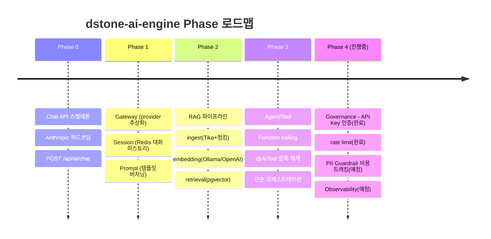
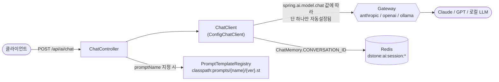
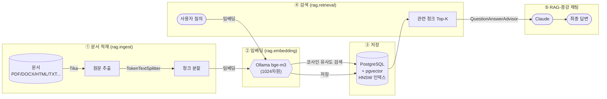
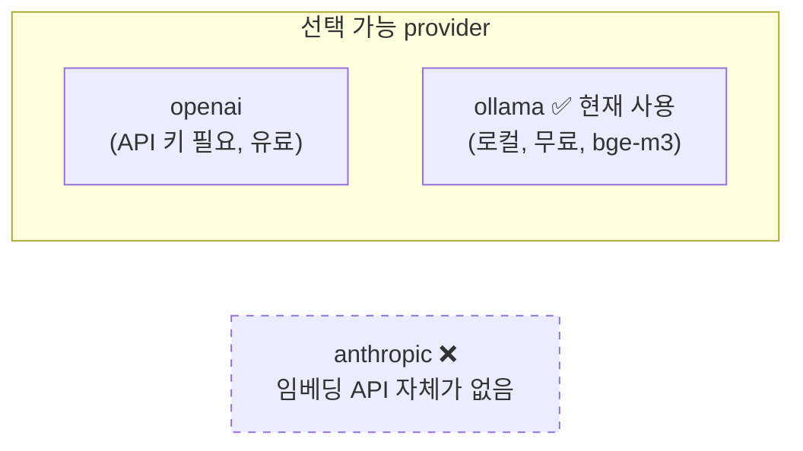
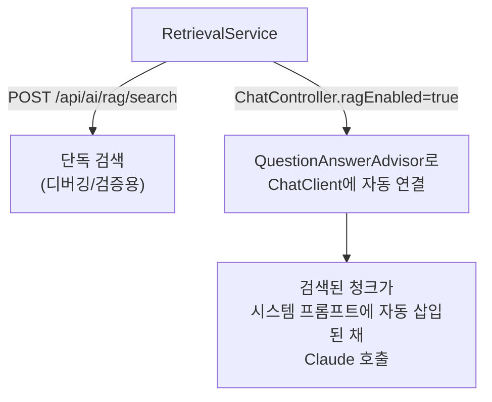
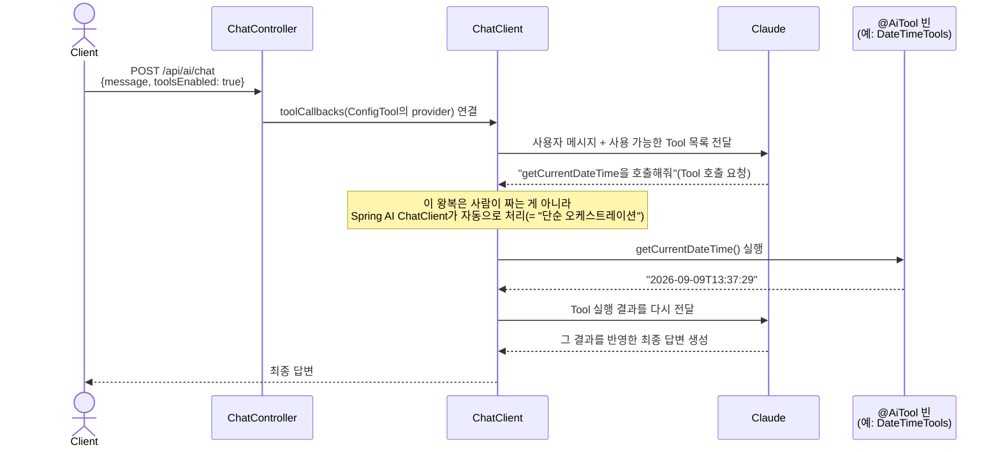
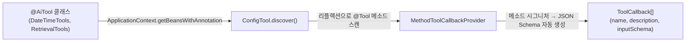
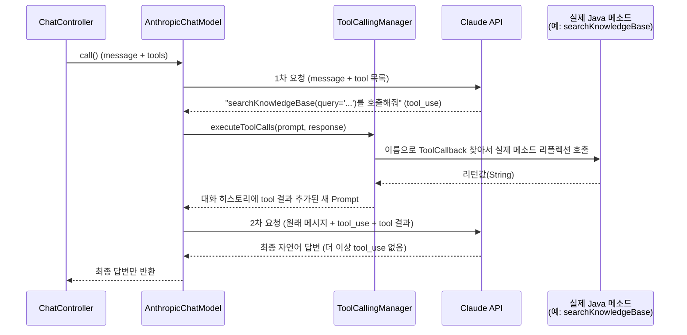
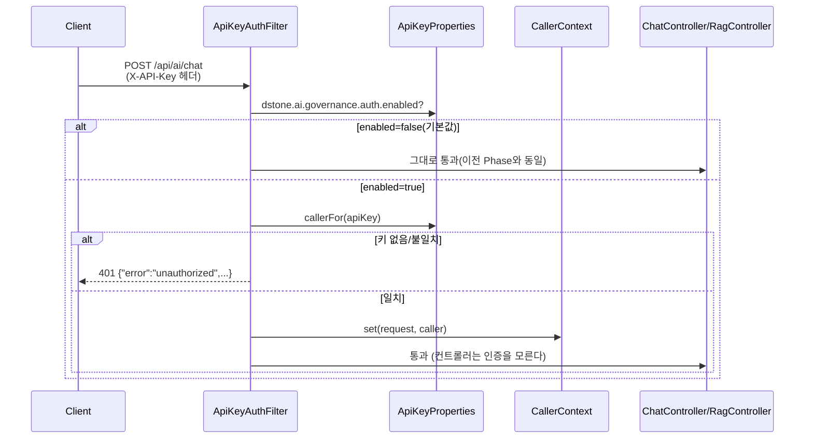
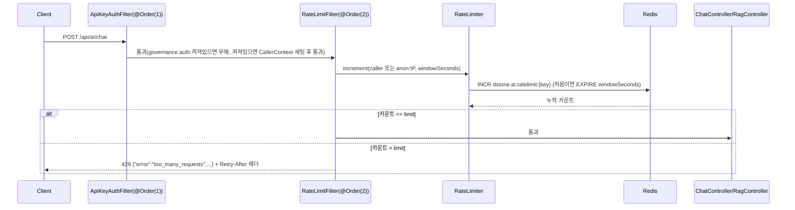

# dstone-ai-engine 🤖

## 목차

- [1. 개요](#1-개요)
- [2. 기술 스택](#2-기술-스택)
- [3. 패키지 구조 (Phase별)](#3-패키지-구조-phase별)
- [4. Phase 로드맵](#4-phase-로드맵)
- [5. Phase 0~1 — Chat API, Gateway, Session, Prompt](#5-phase-01--chat-api-gateway-session-prompt)
  - [5.1 아키텍처](#51-아키텍처)
  - [5.2 Gateway — provider를 설정 한 줄로 교체](#52-gateway--provider를-설정-한-줄로-교체)
  - [5.3 Session — Redis 기반 대화 히스토리](#53-session--redis-기반-대화-히스토리)
  - [5.4 Prompt — 템플릿 버저닝](#54-prompt--템플릿-버저닝)
- [6. Phase 2 — RAG (Retrieval-Augmented Generation)](#6-phase-2--rag-retrieval-augmented-generation)
  - [6.1 RAG 파이프라인 한눈에 보기](#61-rag-파이프라인-한눈에-보기)
  - [6.2 문서 적재 (ingest)](#62-문서-적재-ingest)
  - [6.3 임베딩 (embedding)](#63-임베딩-embedding)
  - [6.4 검색 (retrieval) 과 RAG-증강 채팅](#64-검색-retrieval-과-rag-증강-채팅)
  - [6.5 on/off 스위치 하나로 켜고 끄기](#65-onoff-스위치-하나로-켜고-끄기)
- [7. Phase 3 — Agent/Tool (Function Calling)](#7-phase-3--agenttool-function-calling)
  - [7.1 Tool 호출 흐름](#71-tool-호출-흐름)
  - [7.2 Tool 등록 체계 — `@AiTool` 하나로 등록](#72-tool-등록-체계--aitool-하나로-등록)
  - [7.3 "단순 오케스트레이션"이 의미하는 것](#73-단순-오케스트레이션이-의미하는-것)
  - [7.4 실동작 검증](#74-실동작-검증)
  - [7.5 Agentic RAG — RAG 검색도 Tool로](#75-agentic-rag--rag-검색도-tool로)
  - [7.6 tool_choice 강제 — `requiredTool`](#76-tool_choice-강제--requiredtool)
- [8. Phase 4 — Governance (API Key 인증, Rate Limit)](#8-phase-4--governance-api-key-인증-rate-limit)
  - [8.1 왜 API Key인가](#81-왜-api-key인가)
  - [8.2 설정과 동작](#82-설정과-동작)
  - [8.3 Rate Limit — caller별 요청 제한](#83-rate-limit--caller별-요청-제한)
- [9. API 레퍼런스](#9-api-레퍼런스)
- [10. 설정 레퍼런스 (`conf/application.yml`)](#10-설정-레퍼런스-confapplicationyml)
- [11. 필요 인프라](#11-필요-인프라)
- [12. 빌드 및 실행](#12-빌드-및-실행)
- [13. 문제 해결 (실제로 겪은 에러 모음)](#13-문제-해결-실제로-겪은-에러-모음)
- [14. 다음 단계 (Phase 4)](#14-다음-단계-phase-4)

## 1. 개요

`dstone-ai-engine`은 Spring AI 기반의 **provider-agnostic AI & MLOps 코어 엔진**이다. 특정 SI 프로젝트 하나만을 위한 기능이 아니라, **미래의 여러 SI 프로젝트가 공통으로 가져다 쓸 수 있는 AI 서빙 플랫폼**을 목표로 Phase 0부터 단계적으로 쌓아 올리고 있다.

> 💡 **왜 "provider-agnostic"이 중요한가?**
> LLM/임베딩 provider(Anthropic, OpenAI, 로컬 Ollama 등)는 프로젝트마다, 시기마다 바뀔 수 있다. `dstone-ai-engine`은 코드를 고치지 않고 `application.yml`의 값 하나만 바꿔서 provider를 교체할 수 있게 설계되어 있다 — 이게 이 엔진의 핵심 설계 철학이다.

- **Artifact ID:** `dstone-ai-engine`
- **Packaging:** JAR (Spring Boot executable)
- **Main Class:** `net.dstone.ai.DstoneAiEngineApplication`
- **기본 포트:** 8081
- **루트 패키지:** `net.dstone.ai`
- **의존:** `dstone-common` (Redis/DB/Jasypt 등 공통 인프라 재사용)
- **배포 형태:** `dstone-boot`와 동일하게 컨테이너화 후 로컬 `kind` 클러스터에 Pod로 배포(상세: [04.cloud-architecture.md](04.cloud-architecture.md)) — ⚠️ 매니페스트/Dockerfile은 준비돼 있지만 **아직 실제로 `kubectl apply` 하지는 않은 상태**다.

---

## 2. 기술 스택

| 영역 | 기술 |
|---|---|
| 코어 | Java 21, Spring Boot 4.1.x (Spring Framework 7), dstone-common |
| AI | **Spring AI 2.0.1** (Boot 4 / Framework 7 대응 2.x 라인) |
| Chat LLM | Anthropic Claude (`spring-ai-starter-model-anthropic`) — OpenAI/Ollama starter도 함께 클래스패스에 두고 설정으로만 교체 |
| Embedding | Ollama 로컬 모델(`bge-m3`) — OpenAI로도 교체 가능 |
| 세션 저장소 | Redis (`dstone-common`의 Redis 인프라 재사용) |
| 벡터 저장소 | PostgreSQL + **pgvector** 0.8.1 (`spring-ai-starter-vector-store-pgvector`) |
| 문서 적재 | Apache Tika (`spring-ai-tika-document-reader`) — PDF/DOCX/PPTX/HTML/TXT 등 대부분 포맷 커버 |
| 텍스트 분할 | `TokenTextSplitter` (토큰 단위 청킹) |
| DB 접근 | HikariCP + log4jdbc (SQL 로깅), 표준 Spring Boot 단일 DataSource 자동설정 |
| 관리 콘솔(부가) | [Ollama Web UI Lite](software/15.ollama-webui-lite.md) — Ollama 모델 관리/수동 채팅 테스트용, dstone 애플리케이션과 런타임 의존 없음 |
| 빌드 | Maven (JAR 패키징, `spring-boot-maven-plugin`) |

---

## 3. 패키지 구조 (Phase별)

```
src/main/java/net/dstone/ai/
├── DstoneAiEngineApplication.java   # 메인 진입점 (env-<profile>.properties 부트스트랩)
├── config/                          # Phase 0 — ChatClient 등 공통 빈 wiring
│   ├── Config.java                  # dstone-common @Import (net.dstone.common 컴포넌트 스캔 보완)
│   ├── ConfigChatClient.java        # provider 무관하게 동작하는 ChatClient 빈
│   ├── ConfigChatMemory.java        # ChatMemory(windowing) 빈 - Phase 1
│   ├── ConfigRedis.java             # Redis 인프라
│   ├── ConfigAspect.java            # AOP(컨트롤러/서비스 프로파일링)
│   └── ConfigTool.java              # @AiTool 빈을 기동 시 스캔해 ToolCallbackProvider로 묶음 - Phase 3
├── common/                          # dstone-ai-engine 자체 공통 유틸(AI 특화) - dstone-common과는 별개
│   └── annotation/AiTool.java       # Tool 등록용 마커 애노테이션 - agent 밖(rag.retrieval)에서도 써서 여기 둠
├── api/                             # Phase 0 — REST 컨트롤러
│   ├── ChatController.java          # POST /api/ai/chat (+ RAG-증강 옵션)
│   ├── RagController.java           # /api/ai/rag/* (Phase 2)
│   └── dto/                         # ChatRequest/Response, RagSearchRequest, IngestResponse, RetrievedChunk
├── gateway/                         # Phase 1 — LLM provider 추상화
│   ├── AiProvider.java              # anthropic | openai | ollama
│   ├── GatewayProperties.java       # spring.ai.model.chat 검증(fail-fast)
│   └── provider/                    # provider별 커스터마이징 필요해지면 담을 자리(현재 비어있음)
├── prompt/                          # Phase 1 — 프롬프트 템플릿 관리
│   ├── PromptTemplateRegistry.java  # classpath:prompts/{name}/{version}.st 렌더링
│   └── PromptProperties.java        # 템플릿별 활성 버전 설정
├── session/                         # Phase 1 — 대화 히스토리
│   └── RedisChatMemoryRepository.java  # Spring AI ChatMemoryRepository의 Redis 구현체
├── rag/                             # Phase 2 — RAG 파이프라인 (dstone.ai.rag.enabled=true일 때만 활성)
│   ├── ingest/DocumentIngestService.java     # Tika 추출 → 청킹 → VectorStore 저장(upsert)
│   ├── embedding/EmbeddingProvider.java      # openai | ollama (anthropic 불가)
│   ├── embedding/EmbeddingProperties.java    # spring.ai.model.embedding 검증(fail-fast)
│   └── retrieval/
│       ├── RetrievalService.java             # 유사도 검색 (topK/threshold 기본값 관리)
│       └── RetrievalTools.java                # @AiTool - RAG 검색을 Tool로 노출("Agentic RAG", Phase 3)
├── agent/                           # Phase 3 — Tool/Function calling
│   └── tool/
│       └── sample/DateTimeTools.java  # 샘플 Tool(현재 날짜/시간) - dstone-boot의 sample/과 같은 성격
│                                       # (등록 로직 자체는 config/ConfigTool.java, config/Config.java에서 @Import)
├── governance/                      # Phase 4 — Guardrail, PII 필터, rate limit, 비용 트래킹, 인증
│   ├── auth/                        # ✅ 구현됨 — API Key 인증(@Order(1))
│   │   ├── ApiKeyProperties.java    # dstone.ai.governance.auth.keys 바인딩(Binder) + key→caller 매핑
│   │   ├── ApiKeyAuthFilter.java    # X-API-Key 헤더 검증(OncePerRequestFilter, /actuator/** 제외)
│   │   └── CallerContext.java       # 인증 통과한 caller를 request attribute로 전달(후속 기능 재사용 지점)
│   └── ratelimit/                   # ✅ 구현됨 — caller별 요청 제한(@Order(2), auth 뒤에서 실행. 비용 트래킹은 아직 예정)
│       ├── RateLimitProperties.java # dstone.ai.governance.ratelimit.overrides 바인딩(Binder) + caller→limit 매핑
│       ├── RateLimiter.java         # Redis INCR 기반 고정 윈도우 카운터(dstone:ai:ratelimit:{caller|IP})
│       ├── RateLimitFilter.java     # 한도 초과 시 429(OncePerRequestFilter, /actuator/** 제외)
│       └── RateLimitOverride.java   # overrides 항목(caller, limit) 레코드
└── observability/  # Phase 4(예정) — 토큰 사용량/비용/트레이싱/Eval
```

---

## 4. Phase 로드맵



| Phase | 상태 | 핵심 산출물 |
|:---:|:---:|---|
| 0 | ✅ 완료 | `ChatController`, Anthropic 하드코딩, Jasypt `ENC(...)` 키 관리 |
| 1 | ✅ 완료 | `gateway`(provider 추상화), `session`(Redis 히스토리), `prompt`(템플릿 버저닝) |
| 2 | ✅ 완료 (실동작 검증됨) | `rag.ingest`/`rag.embedding`/`rag.retrieval`, pgvector, `RagController`, `ChatController.ragEnabled` |
| 3 | ✅ 완료 (실동작 검증됨, `requiredTool`은 미검증) | `@AiTool` 등록 체계, `config.ConfigTool`, `ChatController.toolsEnabled`/`requiredTool`(tool_choice 강제), 샘플 `DateTimeTools`, Agentic RAG `RetrievalTools` |
| 4 | 🚧 진행 중 (`governance.auth`/`governance.ratelimit` 완료, 둘 다 실동작 검증됨) | `governance.auth` — API Key 인증(`ApiKeyAuthFilter`/`CallerContext`). `governance.ratelimit` — caller별 요청 제한(`RateLimitFilter`/`RateLimiter`). 남은 것: 비용 트래킹/PII 필터/Guardrail(`governance`), 토큰·비용·트레이싱·Eval(`observability`) |

---

## 5. Phase 0~1 — Chat API, Gateway, Session, Prompt

### 5.1 아키텍처



- `GatewayProperties`가 `@PostConstruct`에서 `spring.ai.model.chat` 값을 검증해, 값이 비어있거나 지원하지 않는 값이면 **"ChatModel 빈이 없다"는 원인불명 에러 대신** 명확한 메시지로 기동을 실패시킨다.
- `ConfigChatClient`는 `GatewayProperties`를 빈 팩토리 메서드의 첫 파라미터로 받아, 그 검증이 `ChatClient.Builder` 해석보다 먼저 실행되도록 순서를 강제한다.

### 5.2 Gateway — provider를 설정 한 줄로 교체

```yaml
spring:
  ai:
    model:
      chat: anthropic   # anthropic | openai | ollama 중 하나로만 교체하면 끝
```

| Provider | 설정 위치 | 비고 |
|---|---|---|
| `anthropic` (현재 사용 중) | `spring.ai.anthropic.api-key` | API 키는 Jasypt `ENC(...)`로 암호화, `env.properties` 경유하지 않음 |
| `openai` | `spring.ai.openai.api-key`, `base-url` | 로컬 vLLM(OpenAI 호환 API) 연결 시 `base-url`만 vLLM 서버로 override |
| `ollama` | `spring.ai.ollama.base-url` | 사내망/로컬 Ollama, API 키 불필요 |

> ⚠️ Azure OpenAI는 Spring AI 2.x에서 chat model provider로 완전히 제거되어(vector-store 용도만 남음) 지원 목록에 없다.

### 5.3 Session — Redis 기반 대화 히스토리

Spring AI가 공식 제공하는 `ChatMemoryRepository`는 jdbc/cassandra/neo4j뿐이라(Redis 없음), `RedisChatMemoryRepository`를 직접 구현했다.


| 설정 | 기본값 | 설명 |
|---|---:|---|
| `dstone.ai.session.max-messages` | 20 | 세션당 유지할 최대 메시지 수 (초과 시 오래된 것부터 잘림) |
| `dstone.ai.session.ttl-seconds` | 86400 (1일) | Redis에 저장된 세션 히스토리 만료 시간 |

`dstone-boot`의 `dstone:session`(HTTP 세션) 네임스페이스와 겹치지 않도록 `dstone:ai:session:*`으로 분리했다.

**conversationId(=`sessionId`) 결정 순서.** `ChatController.chat()`은 다음 우선순위로 하나를 고른다: ① 서블릿 `HttpSession`에 이미 `DEFAULT_SESSION_KEY`(`net.dstone.common.biz.BaseController`) 속성이 있으면 그 값 → ② 없으면 요청 바디의 `sessionId` → ③ 그것도 없으면 `UUID.randomUUID()`로 신규 발급. ①은 HTTP 세션(쿠키)에 대화 ID를 고정해두는 자리를 미리 만들어 둔 것인데, **현재 이 리포지토리 어디에도 `DEFAULT_SESSION_KEY`를 실제로 채워 넣는 코드가 없다** — 즉 지금은 항상 ②/③ 경로로만 동작하고(기존과 동일), ①은 향후 `dstone-boot` 로그인 세션과 연동하는 등의 용도로 미리 열어둔 훅이다. 이 상태(①이 항상 비어있음)가 의도한 설계인지, 아니면 세션 고정 로직을 마저 채워 넣어야 하는지는 확인이 필요하다.

### 5.4 Prompt — 템플릿 버저닝

```
src/main/resources/prompts/
└── {템플릿명}/
    ├── v1.st
    └── v2.st   (SI 프로젝트별로 파일만 추가/교체하면 커스터마이징 끝 - 코드 변경 불필요)
```

```yaml
dstone:
  ai:
    prompt:
      default-version: v1
      versions:
        sample-system: v2   # 템플릿명별 override, 없으면 default-version 사용
```

---

## 6. Phase 2 — RAG (Retrieval-Augmented Generation)

### 6.1 RAG 파이프라인 한눈에 보기



**실제로 검증된 e2e 흐름**: 문서 업로드 → pgvector 저장 확인 → 유사도 검색으로 관련 청크 반환 → `ragEnabled:true`로 채팅했을 때 Claude가 방금 넣은 문서 내용을 정확히 인용해 답변 — 전 과정이 정상 동작함을 실제로 확인했다.

### 6.2 문서 적재 (ingest)

`DocumentIngestService`가 담당한다.

```mermaid
sequenceDiagram
    autonumber
    actor Client
    participant Ctrl as RagController
    participant Ingest as DocumentIngestService
    participant Tika as TikaDocumentReader
    participant Splitter as TokenTextSplitter
    participant VS as VectorStore(pgvector)

    Client->>Ctrl: POST /api/ai/rag/documents<br/>(file, sourceId)
    Ctrl->>Ingest: ingest(resource, sourceId, metadata)
    Ingest->>Tika: get() - 원문 추출
    Tika-->>Ingest: List&lt;Document&gt;
    Ingest->>Splitter: apply() - 청크 분할
    Splitter-->>Ingest: List&lt;Document&gt; (청크들)
    Note over Ingest: 청크마다 metadata에<br/>sourceId 태깅
    Ingest->>VS: delete(filter: sourceId == ?)
    Note over Ingest,VS: 같은 sourceId 재적재 시<br/>upsert처럼 동작(기존 청크 선삭제)
    Ingest->>VS: add(tagged chunks)
    VS-->>Client: {"sourceId": "...", "chunkCount": N}
```

- **왜 upsert가 필요한가**: `sourceId`(호출 쪽이 부여하는 논리적 문서 식별자, 예: 파일명)로 재적재하면 오래된 청크를 먼저 지운 뒤 새로 넣는다 — 안 그러면 문서를 갱신할 때마다 오래된 청크가 검색 결과에 계속 섞여 나온다.
- **포맷 커버리지**: Apache Tika 하나로 PDF/DOCX/PPTX/HTML/TXT 등 대부분의 SI 문서 포맷을 커버한다.
- **빈 결과 안전장치**: 텍스트 추출/청킹 결과가 비어 있으면 기존 청크를 지우지 않고 그대로 종료한다(손상된 파일 재적재로 기존 정상 데이터가 날아가는 것을 방지).

### 6.3 임베딩 (embedding)



| 항목 | 값 |
|---|---|
| 활성 provider | `ollama` (`spring.ai.model.embedding: ollama`) |
| 모델 | `bge-m3` (다국어/한국어 지원, 1024차원) |
| 선택 이유 | Anthropic은 임베딩 API 미제공, 이 환경엔 OpenAI 키도 없어서 로컬 무료 모델 채택 |
| 검증 | `EmbeddingProperties`가 `GatewayProperties`와 동일한 철학으로 fail-fast 검증(단, `dstone.ai.rag.enabled=true`일 때만 빈이 존재 — RAG를 안 쓰는 배포에는 영향 없음) |

> 📌 **채팅 provider와 임베딩 provider는 완전히 독립적으로 선택된다.** 지금은 "채팅=Anthropic Claude + 임베딩=Ollama bge-m3" 조합이지만, `spring.ai.model.chat`/`spring.ai.model.embedding` 두 값을 각각 바꾸면 어떤 조합도 가능하다.

### 6.4 검색 (retrieval) 과 RAG-증강 채팅

`RetrievalService`가 `VectorStore.similaritySearch`를 감싸며, 독립 검색 API와 채팅 통합 양쪽에서 재사용된다.



| 설정 | 기본값 | 비고 |
|---|---:|---|
| `dstone.ai.rag.retrieval.top-k` | 5 | 검색할 청크 수 |
| `dstone.ai.rag.retrieval.similarity-threshold` | **0.35** | ⚠️ 실측 기반 조정값(6.5절 하단 참고) |

> ⚠️ **실측으로 찾은 함정**: 처음엔 0.5로 뒀는데, `bge-m3` 기준으로는 진짜 관련 있는 문서/질의 쌍도 코사인 유사도가 0.48 정도밖에 안 나와서 **데이터가 정상 적재됐는데도 검색 결과가 통째로 비어버리는** 문제가 있었다. 임베딩 모델/도메인마다 유사도 분포가 다르므로 실제 서비스에서는 자신의 데이터로 임계값을 다시 측정/조정해야 한다.

### 6.5 on/off 스위치 하나로 켜고 끄기

```yaml
dstone:
  ai:
    rag:
      enabled: true   # false(또는 미설정)면 Postgres/pgvector/임베딩 설정 없이도 그대로 기동
```

`rag.ingest`/`rag.embedding`/`rag.retrieval`의 모든 빈과 `RagController`, `ChatController`의 `ragEnabled` 옵션은 `dstone.ai.rag.enabled=true`일 때만 활성화된다(`@ConditionalOnProperty`). **RAG가 필요 없는 SI 프로젝트는 이 값만 안 켜면 Phase 0/1까지의 기능만으로 완전히 정상 동작한다** — 이게 이 엔진을 "여러 프로젝트가 공유하는 플랫폼"으로 설계한 핵심 포인트다.

---

## 7. Phase 3 — Agent/Tool (Function Calling)

Spring AI의 Tool Calling(Function Calling)을 감싸서, **SI 프로젝트가 애노테이션 하나로 자기만의 Tool을 추가**할 수 있게 하는 게 이 Phase의 전부다. RAG처럼 새 인프라가 필요하지 않다(순수 Java 코드 실행) — 그래서 on/off 플래그 없이 항상 켜져 있고, 등록된 Tool이 없으면 그냥 빈 상태로 존재한다.

### 7.1 Tool 호출 흐름

한눈에 보면 이렇다 — 등록(기동 시 1회) → LLM에게 통지(요청마다) → 실행 루프(tool_use가 나올 때마다), 3단계로 나뉜다.



#### 1단계 — 기동 시점: Tool 등록 (Reflection 기반)



`ConfigTool`이 `@AiTool` 빈들을 찾아서, 그 안의 **`public` + `@Tool` 붙은 메소드**를 리플렉션으로 뒤진다. 각 메소드마다 `ToolDefinition`을 만드는데, 이때 메소드의 **파라미터 타입/이름(`-parameters` 컴파일 옵션 필요)과 `@ToolParam` 설명**을 보고 **JSON Schema를 자동 생성**한다.

| 메소드 | 생성되는 JSON Schema(개념) |
|---|---|
| `getCurrentDateTime()` (파라미터 없음) | 빈 스키마 |
| `searchKnowledgeBase(@ToolParam(description="검색할 질문 또는 키워드") String query)` | `{"query": {"type":"string", "description":"검색할 질문 또는 키워드"}}` |

#### 2단계 — 채팅 요청 시: LLM에게 "이런 도구들이 있다"고 알려줌

`ChatController`가 `.toolCallbacks(configTool.toolCallbackProvider())`로 붙이면, 이 요청이 Claude API로 나갈 때 **`tools` 파라미터에 방금 만든 ToolDefinition 목록(이름/설명/스키마)이 그대로 실린다**. Claude는 이 설명"만" 보고 — 실제 코드는 전혀 모른 채로 — "이 질문엔 이 도구를 써야겠다"를 스스로 판단한다. **이 판단 자체가 별도 로직이 아니라 Claude 모델 자체의 생성 결과**다(tool-use를 학습한 LLM이 다음 토큰으로 "일반 텍스트" 대신 "도구 호출 요청" 형태를 생성하는 것 - 6.5절/7.5절에서 본 "LLM이 스스로 판단"이 바로 이 지점이다).

#### 3단계 — 실제 실행 루프: `ToolCallingManager`



핵심은 `org.springframework.ai.model.tool.ToolCallingManager`(구현체 `DefaultToolCallingManager`)다:
- `resolveToolDefinitions()` — 요청에 실을 도구 목록 준비
- `executeToolCalls(Prompt, ChatResponse)` — Claude 응답에 tool 호출 요청이 있으면, **이름으로 매칭되는 `ToolCallback`을 찾아 실제 자바 메소드를 리플렉션으로 실행**하고, 결과를 새 메시지(`ToolResponseMessage`)로 만들어 대화 히스토리에 추가

이 왕복(1차 요청 → tool 실행 → 2차 요청 → 최종 답변)이 **Claude가 더 이상 tool을 요청하지 않을 때까지 자동으로 반복**되는 게 바로 7.3절에서 말하는 "단순 오케스트레이션"의 정체다 — `ChatModel.call()` 내부에서 다 처리되고, `ChatController` 입장에선 `.call().content()` 한 줄이 끝날 때까지 이 왕복이 몇 번 일어났는지조차 알 필요가 없다.

| 단계 | 누가 | 뭘 함 |
|---|---|---|
| 등록 | `ConfigTool` (기동 시 1회) | 리플렉션으로 `@Tool` 메소드 → JSON Schema 생성 |
| 판단 | Claude (매 요청) | 도구 설명만 보고 호출 여부/인자 스스로 결정 |
| 실행 | `ToolCallingManager` (매 tool_use마다) | 이름 매칭 → 실제 메소드 리플렉션 호출 |
| 반복 | `ChatModel` 내부 루프 | tool_use 없어질 때까지 1~3 반복 |

### 7.2 Tool 등록 체계 — `@AiTool` 하나로 등록

```java
@AiTool                       // net.dstone.ai.common.annotation.AiTool - 이 한 줄이면 자동으로 발견됨
public class DateTimeTools {

    @Tool(description = "현재 날짜와 시간을 ISO-8601 형식으로 반환한다. "
            + "사용자가 '오늘', '지금 몇 시' 등을 물어볼 때 사용한다.")
    public String getCurrentDateTime() {
        return LocalDateTime.now().format(DateTimeFormatter.ISO_LOCAL_DATE_TIME);
    }
}
```

- `config.ConfigTool`이 기동 시점에 이 빈을 찾아 등록하는 정확한 과정은 7.1절 1단계 참고 - dstone-boot/batch/batchadmin과 동일한 컨벤션대로 `config.Config`에서 다른 `Config*` 클래스들과 함께 `@Import`된다.
- `@Tool(description = ...)`이 곧 LLM에게 "이 도구가 뭘 하는지" 알려주는 설명이다 — LLM은 이 설명만 보고 언제 호출할지 스스로 판단한다(사람이 if/else로 분기하지 않음).
- 새 Tool이 필요하면 이 패턴 그대로 클래스 하나 추가하면 끝 — `gateway`/`prompt` 패키지와 동일한 "설정/컨벤션만 따르면 코드 추가 없이 동작"하는 철학이다.
- SI 프로젝트마다 실제로 필요한 Tool은 완전히 다를 것이므로(사내 시스템 API 호출, 계산기, 검색 등), 지금 포함된 `DateTimeTools`는 **패턴을 보여주는 샘플**이다(`dstone-boot`의 `sample/` 패키지와 같은 성격 - 실제 배포 시 지우거나 자기 도메인 Tool로 교체).

### 7.3 "단순 오케스트레이션"이 의미하는 것

별도의 워크플로우/그래프 엔진을 직접 만들지 않는다. 7.1절 3단계에서 본 `ToolCallingManager`의 반복 루프가 이미 Spring AI `ChatModel` 안에 내장돼 있고, `dstone-ai-engine`은 그 루프에 어떤 Tool을 쓸 수 있는지만 알려주는 역할이다. 대화 히스토리(memory)도 Phase 1의 `ChatMemory`(Redis)를 그대로 공유한다 — Tool 호출을 위한 별도 memory를 새로 만들지 않았다.

### 7.4 실동작 검증

Tool 없이 물으면 모른다고 답하고, `toolsEnabled: true`로 물으면 실제 Tool을 호출해서 정확한 값으로 답하는 것을 실제로 확인했다:

```bash
# toolsEnabled 없음 - 모델이 "실시간 정보에 접근할 수 없다"고 답함
curl -X POST http://localhost:8081/api/ai/chat -H "Content-Type: application/json" \
  -d '{"message":"지금 정확한 날짜와 시간이 몇 시야?","toolsEnabled":false}'

# toolsEnabled: true - getCurrentDateTime을 호출해서 실제 시스템 시간으로 정확히 답함
curl -X POST http://localhost:8081/api/ai/chat -H "Content-Type: application/json" \
  -d '{"message":"지금 정확한 날짜와 시간이 몇 시야?","toolsEnabled":true}'
# → "2026-09-09T13:37:29" (실제 시스템 시간과 1초 이내로 일치)
```

기동 로그에서도 등록된 Tool 목록을 바로 확인할 수 있다:
```
dstone-ai-engine agent: 등록된 Tool = getCurrentDateTime, searchKnowledgeBase
```

### 7.5 Agentic RAG — RAG 검색도 Tool로

`rag.retrieval.RetrievalTools`(`@AiTool` + `dstone.ai.rag.enabled=true`일 때만 존재)가 `RetrievalService.search`를 `searchKnowledgeBase` Tool로 노출한다. `ChatController.ragEnabled`(6.4절)는 **요청마다 무조건** `QuestionAnswerAdvisor`로 검색부터 하고 시작하는 반면, 이 Tool은 `toolsEnabled: true`로 붙여두면 **LLM이 질문 성격을 스스로 판단해서 필요할 때만** 호출한다 — 잡담·일반 상식 질문에서는 검색을 건너뛴다.

실제로 세 가지 질문으로 검증했다(Ollama의 `/api/embed` 호출 로그로 실제 검색 여부까지 교차 확인):

| 질문 | LLM의 판단 | 실제 검색 호출 |
|---|---|:---:|
| "ollama-webui-lite Uh-oh 에러 원인이 뭐였어?" (지식베이스에 있는 내용) | 검색 필요 → 정확한 원인/해결법으로 답변 | ✅ |
| "1부터 10까지 더하면?" | 검색 없이 직접 계산 | ❌ |
| "파이썬 리스트 정렬 방법?" | 검색 없이 직접 답변 (9초 관찰 동안 새 임베딩 호출 없음) | ❌ |

`ragEnabled`와 `toolsEnabled`(+`searchKnowledgeBase`)는 같이 켜도 되지만 중복이다 - 보통은 "항상 이 지식베이스를 참고해야 하는 챗봇"이면 `ragEnabled`를, "여러 판단을 스스로 해야 하는 좀 더 범용적인 어시스턴트"면 `toolsEnabled`를 쓰는 식으로 용도에 따라 고른다.

### 7.6 tool_choice 강제 — `requiredTool`

`toolsEnabled: true`는 Tool을 "쓸 수 있게" 붙여줄 뿐, 실제로 호출할지 말지는 여전히 LLM의 판단(Anthropic `tool_choice=auto`)에 맡긴다. 반드시 특정 Tool을 한 번 호출하고 넘어가야 하는 흐름(예: 특정 액션을 확정하기 전에 항상 검증 Tool을 태워야 하는 경우)에는 `requiredTool`에 `@AiTool` 메서드명을 지정한다 — `ChatController`가 Anthropic의 `tool_choice={"type":"tool","name":...}` + `disable_parallel_tool_use:true`를 걸어 그 Tool을 강제로, 정확히 한 번 호출하게 만든다(`toolsEnabled` 값과 무관하게 동작).

```bash
curl -X POST http://localhost:8081/api/ai/chat -H "Content-Type: application/json" \
  -d '{"message":"지금 몇 시야?","requiredTool":"getCurrentDateTime"}'
```

주의할 점:
- **Anthropic 전용.** `tool_choice` 강제는 Spring AI의 `AnthropicChatOptions`를 통해서만 걸리므로, `spring.ai.model.chat`이 `openai`/`ollama`면 `IllegalStateException`으로 막는다(gateway 추상화를 아직 안 탐 — provider별로 조용히 auto로 흘러가는 것을 방지하기 위함).
- `requiredTool` 값이 `ConfigTool`에 등록된 이름과 정확히 일치하지 않으면 400을 반환한다.
- Anthropic API 자체가 `tool_choice=any`/`tool`을 지원하지 않는 모델(예: Claude Fable/Mythos 5.1 계열)로 바뀌면 400 에러가 나므로, 강제 호출이 필요한 배포는 사용 모델이 forced tool use를 지원하는지 먼저 확인한다.

---

## 8. Phase 4 — Governance (API Key 인증, Rate Limit)

Phase 4는 `governance`(Guardrail/PII 필터/rate limit/비용 트래킹/인증)와 `observability`(토큰/비용/트레이싱/Eval) 두 패키지를 다루는데, `governance.auth`(API Key 인증)부터 구현했다 — rate limit/비용 트래킹은 "누가 호출했는지"가 먼저 정해져야 의미가 있기 때문이다. 그 첫 소비자로 `governance.ratelimit`(caller별 요청 제한, 8.3절)을 이어서 구현했다.

### 8.1 왜 API Key인가

모노레포 어디에도 OAuth2 Authorization Server(IdP)가 없다 — `dstone-boot`의 OAuth2는 소셜 로그인(Google/Naver/Kakao)의 **client**일 뿐, `dstone-ai-engine`을 호출하는 SI 프로젝트들에게 토큰을 발급해줄 **서버**가 아니다. client-credentials 플로우를 타려면 Spring Authorization Server 같은 IdP를 이 Phase에서 새로 구축해야 하는데, 이 엔진을 호출하는 대상이 정해진 SI 프로젝트들(서비스-투-서비스)이라는 점을 감안하면 과한 투자다. 그래서 SI 프로젝트별로 키를 하나씩 발급하는 API Key 방식을 골랐다.

이 모듈은 Phase 0부터 `SecurityAutoConfiguration`을 통째로 제외해왔다(conf/application.yml, CLAUDE.md 참고). Spring Security를 다시 끌어와 인가 규칙을 구성하는 대신, 헤더 하나만 검증하는 `OncePerRequestFilter`로 최소 구현했다 — 세션/쿠키 없이 매 요청마다 조회 한 번으로 끝나 이 엔진의 무상태(stateless) REST 호출 패턴에 그대로 맞는다.

### 8.2 설정과 동작



- `dstone.ai.governance.auth.enabled`(기본 `false`)를 켜야만 실제로 막는다 — `dstone.ai.rag.enabled`와 동일한 옵트인 철학이라, 이 기능을 안 쓰는 기존 배포는 이 변경만으로 깨지지 않는다.
- `dstone.ai.governance.auth.keys`는 YAML 시퀀스(`key`/`caller` 쌍)다. `key`는 DB 패스워드와 동일한 컨벤션으로 `ENC(...)` 암호화를 권장한다. 이 값은 리스트-오브-오브젝트라 `GatewayProperties`/`PromptProperties`처럼 `ConfigProperty.getProperty(String)`(단순 스칼라 조회)로는 못 읽어서, `ApiKeyProperties`만 Spring Boot의 `Binder`를 직접 써서 바인딩한다 — `ENC(...)` 복호화는 PropertySource 레벨에서 일어나므로(`net.dstone.common.config.ConfigProperty`) `Binder`로 읽어도 `@ConfigurationProperties`와 동일하게 적용된다.
- `/actuator/**`는 인증 없이 통과한다 — 이 모듈은 `management.server.port`를 따로 안 쓰고 앱과 같은 포트를 공유하므로(conf/application.yml), 필터가 걸리면 k8s liveness/readiness probe가 막혀버린다.
- 인증을 통과한 요청의 caller는 `CallerContext`(request attribute)에 담긴다 — 아직 소비하는 곳은 없지만, 뒤에 만들 rate limit/비용 트래킹이 헤더를 다시 파싱하지 않고 여기서 재사용하도록 만든 연결 지점이다.
- `ChatController.chat()`이 이미 쓰던 `AnthropicChatOptions`(7.6절, `requiredTool`)와는 무관한 별도 계층이다 — API Key 인증은 "누가 호출했는지", `tool_choice` 강제는 "무엇을 호출해야 하는지"를 다룬다.

```bash
# enabled=true, keys에 caller=sample-si-project로 등록된 키라고 가정
curl -X POST http://localhost:8081/api/ai/chat \
  -H "Content-Type: application/json" \
  -H "X-API-Key: <발급받은 키>" \
  -d '{"message": "안녕"}'

# 헤더를 빼먹거나 등록 안 된 키를 보내면
curl -X POST http://localhost:8081/api/ai/chat -H "Content-Type: application/json" -d '{"message": "안녕"}'
# → 401 {"error":"unauthorized","message":"API Key 헤더[X-API-Key]가 없습니다."}
```

✅ 실동작 검증됨(2026-09-10, WSL 환경) — `conf/application.yml`에 `enabled: true`와 테스트용 키 1개(`caller=local-verify`)를 임시로 넣고 `-Dspring.profiles.active=wsl`로 기동한 뒤 아래 4가지를 curl로 직접 확인했다(검증 후 설정은 원상복구):
> - 헤더 없음 → `401 {"error":"unauthorized","message":"API Key 헤더[X-API-Key]가 없습니다."}`
> - 잘못된 키 → `401 {"error":"unauthorized","message":"유효하지 않은 API Key 입니다."}`
> - `/actuator/health` → 키 없이 `200`(인증 우회 확인)
> - 등록된 키 → `200`과 함께 실제 Anthropic 응답(`{"message":"OK","provider":"anthropic",...}`) 정상 수신

### 8.3 Rate Limit — caller별 요청 제한

`governance.auth`가 "누가 호출했는지"를 식별해주는 지점이라면, `governance.ratelimit`은 그 식별 결과를 소비하는 첫 기능이다 — caller(또는 auth가 꺼져 있으면 클라이언트 IP)별로 일정 시간(window) 동안 허용할 요청 수를 제한한다.



- **필터 순서가 중요하다**: `RateLimitFilter`(`@Order(2)`)는 `ApiKeyAuthFilter`(`@Order(1)`)가 먼저 실행돼 `CallerContext`를 채워둔 뒤에 돌아야 caller 단위로 키를 잡을 수 있다. `governance.auth.enabled=false`(기본값)면 `CallerContext`가 항상 비어있으므로 이때는 `anon:{클라이언트IP}`를 키로 쓴다(프록시 뒤에서 `X-Forwarded-For` 처리는 아직 안 함).
- **카운터 방식**: Redis `INCR` 기반 고정 윈도우(fixed window) — 키가 처음 만들어질 때(`count==1`)만 `EXPIRE windowSeconds`를 걸고, 그 뒤 요청은 TTL을 갱신하지 않는다. 정확한 sliding window/token bucket이 아니라서 윈도우 경계에서 순간적으로 `limit`의 최대 2배까지 허용될 수 있다는 알려진 한계가 있다 — MVP 단계에서는 구현 단순성을 택했고, 더 정교한 제어가 필요해지면 Redis Lua 스크립트 기반으로 교체할 수 있다.
- **enabled=false(기본값)**면 이전 Phase와 동일하게 제한 없이 전부 통과한다(`dstone.ai.rag.enabled`/`dstone.ai.governance.auth.enabled`와 동일한 옵트인 철학).
- **enabled=true인데 Redis가 꺼져 있으면**(`spring.data.redis.enabled=false`) `RateLimitProperties`가 `@PostConstruct`에서 명확한 메시지로 기동을 실패시킨다("RedisTemplate 빈이 없다"는 원인불명 에러 대신).
- `dstone.ai.governance.ratelimit.overrides`는 `governance.auth.keys`와 동일한 이유(리스트-오브-오브젝트)로 `Binder`를 직접 써서 caller별 한도를 바인딩한다 — 지정 안 된 caller는 `default-limit`을 쓴다.
- 401로 거부된 요청(`ApiKeyAuthFilter`에서 막힘)은 `RateLimitFilter`까지 도달하지 않으므로 카운터를 소비하지 않는다 — 잘못된 키로 두들겨도 정상 caller의 한도에 영향을 주지 않는다.
- `/actuator/**`는 `ApiKeyAuthFilter`와 동일하게 인증·제한 모두 우회한다(k8s probe 보호).

```bash
# enabled=true, window-seconds=10, default-limit=3 이라고 가정 (governance.auth는 꺼둔 상태 예시)
for i in 1 2 3 4; do
  curl -s -o /dev/null -w "%{http_code}\n" -X POST http://localhost:8081/api/ai/chat \
    -H "Content-Type: application/json" -d '{"message": "안녕"}'
done
# → 200, 200, 200, 429

# 한도 초과 시 응답
# HTTP/1.1 429
# Retry-After: 10
# {"error":"too_many_requests","message":"요청 한도(3회/10초)를 초과했습니다."}
```

✅ 실동작 검증됨(2026-09-10, WSL 환경) — `conf/application.yml`에 `ratelimit.enabled: true`(window-seconds=10, default-limit=3)를 임시로 넣고 기동해 확인했다(검증 후 설정은 원상복구):
> - `governance.auth` 없이 단독 사용: 같은 IP로 4번째 요청부터 `429`, `Retry-After: 10` 헤더 확인, 10초 대기 후 재요청 시 `200`으로 정상 복구
> - `governance.auth`와 함께 사용(`caller-a`는 `default-limit=3`, `caller-b`는 `overrides`로 `limit=1`): 두 caller의 카운터가 `dstone:ai:ratelimit:caller-a`/`dstone:ai:ratelimit:caller-b`로 독립적으로 관리되고, 각자 설정된 한도에서 정확히 `429`로 전환됨을 확인
> - 인증 실패(401) 요청은 Redis 카운터를 전혀 소비하지 않음을 확인(`ApiKeyAuthFilter`가 먼저 막아 `RateLimitFilter`에 도달하지 않음)

---

## 9. API 레퍼런스

> 💡 아래 요청들을 curl 없이 바로 눌러보고 싶다면 [Postman 컬렉션](data/dstone-ai-engine-postman-collection.json)을 import한다 — 일반 채팅/RAG-증강/Tool 사용 채팅과 RAG 문서 업로드/삭제/검색까지 전부 준비돼 있다.
>
> 🔒 `dstone.ai.governance.auth.enabled=true`(8.2절)면 아래 `/api/ai/**` 요청 전부(문서 업로드/삭제/검색 포함)에 `X-API-Key`(기본 헤더명) 헤더가 필요하고, `dstone.ai.governance.ratelimit.enabled=true`(8.3절)면 같은 요청들에 caller(또는 IP)별 호출 횟수 제한이 걸린다 — 아래 curl 예시들은 둘 다 꺼진(기본값) 상태 기준이다.

### `POST /api/ai/chat` — 채팅 (일반 / RAG-증강 / Tool 사용)

<details>
<summary>요청/응답 예시 펼쳐보기</summary>

```bash
# 일반 채팅 (Phase 0/1)
curl -X POST http://localhost:8081/api/ai/chat \
  -H "Content-Type: application/json" \
  -d '{
        "message": "안녕, 짧게 인사만 해줘.",
        "sessionId": null,
        "promptName": null,
        "variables": null,
        "ragEnabled": false,
        "toolsEnabled": false
      }'
# → {"message":"안녕하세요! 😊","provider":"anthropic","sessionId":"3fde76a9-..."}
```

```bash
# RAG-증강 채팅 (Phase 2, dstone.ai.rag.enabled=true 필요)
curl -X POST http://localhost:8081/api/ai/chat \
  -H "Content-Type: application/json" \
  -d '{"message": "우리 RAG 파이프라인에서 임베딩 모델로 뭘 쓰는지 알려줘.", "ragEnabled": true}'
# → Claude가 pgvector에 저장된 관련 문서 조각을 인용해서 답변
```

```bash
# Tool 사용 채팅 (Phase 3)
curl -X POST http://localhost:8081/api/ai/chat \
  -H "Content-Type: application/json" \
  -d '{"message": "지금 정확한 날짜와 시간이 몇 시야?", "toolsEnabled": true}'
# → getCurrentDateTime Tool을 호출해서 실제 시스템 시간으로 답변
```
</details>

| 필드 | 타입 | 설명 |
|---|---|---|
| `message` | String | 사용자 메시지 (필수, 비어있으면 `400 Bad Request`) |
| `sessionId` | String | 비워두면 서버가 새로 발급 (응답의 `sessionId`로 이어서 사용) |
| `promptName` | String | 지정 시 `PromptTemplateRegistry`가 렌더링해 시스템 프롬프트로 사용 |
| `variables` | Map | `promptName` 템플릿 렌더링용 변수 |
| `ragEnabled` | Boolean | `true`면 `QuestionAnswerAdvisor`로 검색 결과 자동 삽입 (RAG 꺼져 있으면 `IllegalStateException`) |
| `toolsEnabled` | Boolean | `true`면 `ConfigTool`에 등록된 모든 Tool을 ChatClient에 연결(Phase 3) — RAG와 달리 항상 사용 가능. 실제 호출 여부는 LLM 판단(`tool_choice=auto`) |
| `requiredTool` | String | 지정하면 해당 Tool명으로 `tool_choice=tool` 강제(7.6절) — Anthropic 전용, `toolsEnabled` 값과 무관 |

### `POST /api/ai/rag/documents` — 문서 적재 (Phase 2, RAG 활성 시)

```bash
curl -X POST http://localhost:8081/api/ai/rag/documents \
  -F "file=@spec.pdf" -F "sourceId=spec-v1"
# → {"sourceId":"spec-v1","chunkCount":12}
```

### `DELETE /api/ai/rag/documents/{sourceId}` — 문서 삭제

```bash
curl -X DELETE http://localhost:8081/api/ai/rag/documents/spec-v1
```

### `POST /api/ai/rag/search` — 단독 유사도 검색 (디버깅/검증용)

```bash
curl -X POST http://localhost:8081/api/ai/rag/search \
  -H "Content-Type: application/json" \
  -d '{"query": "환불 정책이 어떻게 되나요?", "topK": 3, "similarityThreshold": null, "sourceId": null}'
```

| 필드 | 타입 | 설명 |
|---|---|---|
| `query` | String | 검색 질의 (필수) |
| `topK` | Integer | 비우면 `dstone.ai.rag.retrieval.top-k` 기본값 |
| `similarityThreshold` | Double | 비우면 `dstone.ai.rag.retrieval.similarity-threshold` 기본값 |
| `sourceId` | String | 지정 시 그 문서로 적재된 청크로만 검색 범위 제한 |

응답: `[{"text": "...", "metadata": {...}, "score": 0.48}, ...]`

---

## 10. 설정 레퍼런스 (`conf/application.yml`)

<details>
<summary>전체 설정 트리 펼쳐보기 (실제 값은 예시로 마스킹)</summary>

```yaml
spring:
  data:
    redis:
      enabled: true
      host: ${REDIS_HOST}
      port: ${REDIS_PORT}
  datasource:                                    # RAG(Phase 2) 전용, pgvector가 사용
    driver-class-name: net.sf.log4jdbc.sql.jdbcapi.DriverSpy
    url: jdbc:log4jdbc:postgresql://${DB_HOST}:${DB_PORT}/dstone_ai
    username: dstone_ai
    password: ENC(...)
  servlet:
    multipart:
      max-file-size: 20MB                        # 문서 업로드 대비 상향
      max-request-size: 20MB
  ai:
    model:
      chat: anthropic                            # anthropic | openai | ollama
      embedding: ollama                          # openai | ollama (RAG용, anthropic 불가)
    anthropic:
      api-key: ENC(...)
    ollama:
      base-url: http://localhost:11434
      embedding:
        model: bge-m3
    vectorstore:
      pgvector:
        initialize-schema: true
        dimensions: 1024                         # 임베딩 모델 출력 차원과 반드시 일치

dstone:
  ai:
    session:
      max-messages: 20
      ttl-seconds: 86400
    prompt:
      default-version: v1
    rag:
      enabled: true                              # false면 RAG 관련 빈 전부 비활성화
      ingest:
        chunk-size: 800
      retrieval:
        top-k: 5
        similarity-threshold: 0.35
    governance:
      auth:
        enabled: false                           # true면 X-API-Key 헤더 필수(8.2절)
        header-name: X-API-Key                   # 생략 시 기본값
        keys:
          - key: ENC(...)
            caller: sample-si-project
      ratelimit:
        enabled: false                           # true면 caller(또는 IP)별 요청 제한(8.3절)
        window-seconds: 60                       # 생략 시 기본값
        default-limit: 60                        # 생략 시 기본값, window당 허용 요청 수
        overrides:
          - caller: sample-si-project
            limit: 200
```
</details>

---

## 11. 필요 인프라

| 인프라 | 용도 | 필수 여부 |
|---|---|:---:|
| Anthropic API (또는 다른 LLM provider) | Chat 모델 추론 | ✅ 항상 |
| Redis | 대화 세션 히스토리 | ✅ 항상 (Phase 1부터) |
| PostgreSQL + pgvector | RAG 벡터 저장소 | `dstone.ai.rag.enabled=true`일 때만 |
| Ollama (또는 OpenAI) | RAG 임베딩 모델 추론 | `dstone.ai.rag.enabled=true`일 때만 |

설치 방법은 각각 [software/06.redis.md](software/06.redis.md), [software/05.postgresql.md](software/05.postgresql.md), [software/14.ollama.md](software/14.ollama.md) 참고. 부가 관리 도구로 [Ollama Web UI Lite](software/15.ollama-webui-lite.md)도 함께 운용 중이다.

---

## 12. 빌드 및 실행

```bash
# dstone-common을 먼저 설치해야 함(다른 모듈과 동일)
cd dstone-common && mvn clean install

# 빌드
cd dstone-ai-engine && mvn clean package

# 로컬(WSL) 실행 - env-wsl.properties 프로파일
java -Dspring.profiles.active=wsl -jar target/dstone-ai-engine.jar
```

기동 로그에서 아래 두 줄이 보이면 gateway/RAG 검증이 정상 통과한 것이다:
```
dstone-ai-engine gateway: 활성 LLM provider = ANTHROPIC
dstone-ai-engine rag: 활성 임베딩 provider = OLLAMA
```

> 컨테이너 빌드/kind 배포 절차는 `dstone-boot`과 동일한 패턴을 따른다 — [03.build.md 6절](03.build.md#6-dstone-boot--dstone-ai-engine--컨테이너-빌드--kind-배포) 참고.

---

## 13. 문제 해결 (실제로 겪은 에러 모음)

Phase 2를 실제로 붙이고 e2e 테스트하는 과정에서 겪은 진짜 에러들이다 — 같은 삽질을 반복하지 않도록 원인/조치를 남긴다.

| 증상 | 원인 | 조치 |
|---|---|---|
| 문서 적재 시 `NoClassDefFoundError: ChecksumInputStream` | `dstone-common`이 직접 고정한 `commons-io 2.15.1`이 Maven "nearest wins"로 이겨서, `spring-ai-tika-document-reader`(→ commons-compress 1.28.0)가 필요로 하는 `commons-io 2.16.0+`의 클래스가 없음 | `dstone-ai-engine/pom.xml`의 `dependencyManagement`에서 이 모듈만 `commons-io 2.20.0`으로 상향 |
| 검색 결과가 데이터 있는데도 항상 `[]` | `similarity-threshold` 기본값 0.5가 `bge-m3` 실측 유사도(0.48 등)보다 높음 | 기본값을 0.35로 하향(6.4절 참고) — 임베딩 모델/도메인별 재조정 필요 |
| `ERROR: extension "vector" is not available` | `postgresql`/`postgresql-18` 패키지만으로는 pgvector 확장이 없음 | `sudo apt-get install -y postgresql-18-pgvector` 후 `CREATE EXTENSION` 재시도 — 상세: [software/05.postgresql.md 7절](software/05.postgresql.md#7-문제-해결-phase-2-설치-중-실제로-겪은-에러) |
| Ollama Web UI Lite에서 채팅 시 `Uh-oh! There was an issue connecting to Ollama.` | ① Ollama가 IPv4 루프백에만 바인딩되어 브라우저의 IPv6(`::1`) 시도가 거부됨, ② 채팅 가능한 모델이 없이 임베딩 전용 `bge-m3`만 설치돼 있었음(둘 다 웹UI 자체 버그로 동일한 문구로만 표시됨) | ① `OLLAMA_HOST=[::]:11434`(dual-stack)로 바인딩 확장 ② 채팅용 모델(`llama3.2`) 별도 pull — 상세: [software/14.ollama.md 7절](software/14.ollama.md#7-문제-해결-ollama-web-ui-lite-연동-중-실제로-겪은-에러), [software/15.ollama-webui-lite.md 8절](software/15.ollama-webui-lite.md#8-문제-해결-실제로-겪은-에러) |

---

## 14. 다음 단계 (Phase 4)

| Phase | 패키지 | 상태 | 계획 |
|---|---|:---:|---|
| 4 | `governance.auth` | ✅ 완료 (실동작 검증됨, 8.2절 참고) | API Key 인증 — `ApiKeyAuthFilter`/`ApiKeyProperties`/`CallerContext` |
| 4 | `governance.ratelimit` | ✅ 완료 (실동작 검증됨, 8.3절 참고) | caller별 요청 제한 — `RateLimitFilter`/`RateLimitProperties`/`RateLimiter`(Redis 고정 윈도우) |
| 4 | `governance` (auth/ratelimit 제외) | ⏳ 예정 | Guardrail, PII 필터링, 비용 트래킹 — `CallerContext`로 caller를 이미 식별할 수 있으므로 caller별 집계로 이어서 구현 |
| 4 | `observability` | ⏳ 예정 | 토큰 사용량/비용/트레이싱, Eval 결과 로깅 |

Phase 3(`agent.tool`)는 "단순 오케스트레이션"(Spring AI ChatClient의 내장 tool-calling 루프)까지 완료된 상태다. 여러 Tool을 사람이 미리 정한 순서로 묶어 실행하는 멀티스텝 워크플로우/그래프 엔진처럼 더 복잡한 오케스트레이션이 필요해지면 그건 별도 후속 작업으로 다룬다.

대량/오프라인 AI 작업(재임베딩, 주기적 Eval, 세션 정리)은 엔진 자체에 스케줄러를 두지 않고 기존 `dstone-batch`(`@AutoRegJob`) 패턴에 위임할 계획이다.

> 전체 모듈 빌드 명령, 배포 방식, CI/CD 파이프라인 종합 정리는 [03.build.md](03.build.md) 참고. 클라우드 아키텍처 시뮬레이션 관점의 배포 설계는 [04.cloud-architecture.md](04.cloud-architecture.md) 참고.
