# dstone-ai-engine 🤖

## 목차

- [1. 개요](#1-개요)
- [2. 기술 스택](#2-기술-스택)
- [3. 패키지 구조 (Phase별)](#3-패키지-구조-phase별)
- [4. Phase 로드맵](#4-phase-로드맵)
- [5. Phase 0~1 — Chat API, Gateway, Session, Prompt](#5-phase-01--chat-api-gateway-session-prompt)
  - [5.1 아키텍처](#51-아키텍처)
  - [5.2 Provider 선택 — 설정 한 줄로 LLM 교체](#52-provider-선택--설정-한-줄로-llm-교체)
  - [5.3 Session — Redis 기반 대화 히스토리](#53-session--redis-기반-대화-히스토리)
  - [5.4 Prompt — 템플릿 버저닝](#54-prompt--템플릿-버저닝)
- [6. Phase 2 — RAG (Retrieval-Augmented Generation)](#6-phase-2--rag-retrieval-augmented-generation)
  - [6.1 RAG 파이프라인 한눈에 보기](#61-rag-파이프라인-한눈에-보기)
  - [6.2 설계 원칙 — `RagService`가 항상 존재하는 이유](#62-설계-원칙--ragservice가-항상-존재하는-이유)
  - [6.3 문서 적재 (ingest)](#63-문서-적재-ingest)
  - [6.4 임베딩 (embedding)](#64-임베딩-embedding)
  - [6.5 검색 (retrieval) 과 RAG-증강 채팅](#65-검색-retrieval-과-rag-증강-채팅)
  - [6.6 on/off 스위치 두 개 — 최상위원칙과 선택적원칙](#66-onoff-스위치-두-개--최상위원칙과-선택적원칙)
- [7. Phase 3 — Agent/Tool (Function Calling)](#7-phase-3--agenttool-function-calling)
  - [7.1 Tool 호출 흐름](#71-tool-호출-흐름)
  - [7.2 Tool 등록 체계 — `@AiTool` 하나로 등록](#72-tool-등록-체계--aitool-하나로-등록)
  - [7.3 "단순 오케스트레이션"이 의미하는 것](#73-단순-오케스트레이션이-의미하는-것)
  - [7.4 실동작 검증](#74-실동작-검증)
  - [7.5 SQL 검증 Tool — Oracle→PostgreSQL 변환 자기수정 루프](#75-sql-검증-tool--oraclepostgresql-변환-자기수정-루프)
  - [7.6 tool_choice 강제 — `requiredTool`](#76-tool_choice-강제--requiredtool)
  - [7.7 Capability — 자주 쓰는 설정 조합에 이름 붙이기](#77-capability--자주-쓰는-설정-조합에-이름-붙이기)
- [8. Phase 4 — Governance & Observability (API Key 인증, Rate Limit, PII Guardrail, 사용량 로깅)](#8-phase-4--governance--observability-api-key-인증-rate-limit-pii-guardrail-사용량-로깅)
  - [8.1 왜 API Key인가](#81-왜-api-key인가)
  - [8.2 설정과 동작](#82-설정과-동작)
  - [8.3 Rate Limit — caller별 요청 제한](#83-rate-limit--caller별-요청-제한)
  - [8.4 Guardrail — PII(개인식별정보) 탐지/마스킹](#84-guardrail--pii개인식별정보-탐지마스킹)
  - [8.5 Observability — 사용량/비용/지연시간 로깅](#85-observability--사용량비용지연시간-로깅)
  - [8.6 Tenant Context (Phase 5) — caller(=tenant_id) 격리](#86-tenant-context-phase-5--calertenant_id-격리)
- [9. API 레퍼런스](#9-api-레퍼런스)
- [10. 설정 레퍼런스 (`conf/application.yml`)](#10-설정-레퍼런스-confapplicationyml)
- [11. 필요 인프라](#11-필요-인프라)
- [12. 빌드 및 실행](#12-빌드-및-실행)
- [13. 문제 해결 (실제로 겪은 에러 모음)](#13-문제-해결-실제로-겪은-에러-모음)
- [14. Phase 로드맵 상태 (0~10 전체 완료)](#14-phase-로드맵-상태-0-10-전체-완료)
- [15. Phase 6 — Process Engine](#15-phase-6--process-engine)
- [16. Phase 7 — Agent Runtime](#16-phase-7--agent-runtime)
- [17. Phase 8 — Tool Runtime 확장 (Shell/Python/HTTP) + 샌드박싱](#17-phase-8--tool-runtime-확장-shellpythonhttp--샌드박싱)
- [18. Phase 9 — Governance 완성 (Quota, Sensitive-word Guardrail)](#18-phase-9--governance-완성-quota-sensitive-word-guardrail)
- [19. Phase 10 — 비동기 API (submit/jobId)](#19-phase-10--비동기-api-submitjobid)

## 1. 개요

`dstone-ai-engine`은 Spring AI 기반의 **provider-agnostic AI & MLOps 코어 엔진**이다. 특정 SI 프로젝트 하나만을 위한 기능이 아니라, **미래의 여러 SI 프로젝트가 공통으로 가져다 쓸 수 있는 AI 서빙 플랫폼**을 목표로 Phase 0부터 단계적으로 쌓아 올리고 있다.

> 💡 **왜 "provider-agnostic"이 중요한가?**
> LLM/임베딩 provider(Anthropic, OpenAI, 로컬 Ollama 등)는 프로젝트마다, 시기마다 바뀔 수 있다. `dstone-ai-engine`은 코드를 고치지 않고 `application.yml`의 값 하나만 바꿔서 provider를 교체할 수 있게 설계되어 있다 — 이게 이 엔진의 핵심 설계 철학이다.

- **Artifact ID:** `dstone-ai-engine`
- **Packaging:** JAR (Spring Boot executable)
- **Main Class:** `net.dstone.ai.DstoneAiEngineApplication`
- **기본 포트:** 8081
- **루트 패키지:** `net.dstone.ai`
- **의존:** `dstone-common` (Redis/DB/Jasypt 등 공통 인프라 재사용)
- **배포 형태:** `dstone-boot`와 동일하게 컨테이너화 후 로컬 `kind` 클러스터에 Pod로 배포(상세: [04.cloud-architecture.md](04.cloud-architecture.md)) — ⚠️ 매니페스트/Dockerfile은 준비돼 있지만 **아직 실제로 `kubectl apply` 하지는 않은 상태**다.
- **브라우저 UI:** 이 엔진 자체는 API만 제공하고 화면이 없다 — 로그인 사용자가 바로 써볼 수 있는 채팅/RAG 문서업로드 화면은 `dstone-boot`가 이 API들을 프록시하는 형태로 제공한다([06.dstone-boot.md 10절](06.dstone-boot.md#10-ai-연동-dstone-ai-engine-프록시)).

---

## 2. 기술 스택

| 영역 | 기술 |
|---|---|
| 코어 | Java 21, Spring Boot 4.1.x (Spring Framework 7), dstone-common |
| AI | **Spring AI 2.0.1** (Boot 4 / Framework 7 대응 2.x 라인) |
| Chat LLM | Anthropic Claude (`spring-ai-starter-model-anthropic`) — OpenAI/Ollama starter도 함께 클래스패스에 두고 설정으로만 교체 |
| Embedding | Ollama 로컬 모델(`bge-m3`) — OpenAI로도 교체 가능 |
| 세션 저장소 | Redis (`dstone-common`의 Redis 인프라 재사용) |
| 벡터 저장소 | PostgreSQL + **pgvector** 0.8.1 (`spring-ai-starter-vector-store-pgvector`) |
| 문서 적재 | Apache Tika (`spring-ai-tika-document-reader`) — PDF/DOCX/PPTX/HTML/TXT 등 대부분 포맷 커버 |
| 텍스트 분할 | `TokenTextSplitter` (토큰 단위 청킹) |
| DB 접근 | HikariCP + log4jdbc (SQL 로깅), 표준 Spring Boot 단일 DataSource 자동설정 |
| 관리 콘솔(부가) | [Ollama Web UI Lite](software/15.ollama-webui-lite.md) — Ollama 모델 관리/수동 채팅 테스트용, dstone 애플리케이션과 런타임 의존 없음 |
| 빌드 | Maven (JAR 패키징, `spring-boot-maven-plugin`) |

---

## 3. 패키지 구조 (Phase별)

```
src/main/java/net/dstone/ai/
├── DstoneAiEngineApplication.java   # 메인 진입점 (env-<profile>.properties 부트스트랩)
├── common/                          # dstone-ai-engine 자체 공통 유틸(AI 특화) - dstone-common과는 별개
│   ├── annotation/AiTool.java       # Tool 등록용 마커 애노테이션 - tools 패키지 전용이 아니라 여러 곳에서 써서 여기 둠
│   ├── config/                      # Phase 0 — ChatClient 등 공통 빈 wiring (🆕 2026-09-14, 예전 최상위 config/ 패키지에서 이동)
│   │   ├── Config.java              # dstone-common @Import (net.dstone.common 컴포넌트 스캔 보완)
│   │   ├── ConfigChatClient.java    # provider 무관하게 동작하는 ChatClient 빈 + advisor 3종 연결
│   │   ├── ConfigRedis.java         # Redis 인프라
│   │   ├── ConfigAspect.java        # AOP(컨트롤러/서비스 프로파일링)
│   │   └── ConfigTool.java          # @AiTool 빈을 기동 시 스캔해 ToolCallbackProvider로 묶음 - Phase 3
│   │                                 # (🆕 Phase 5 - toolCallbackProvider(caller)로 caller별 Tool 화이트리스트 필터링, 8.6절)
│   ├── consts/AiProvider.java       # anthropic | openai | ollama (별도 gateway 패키지 없이 여기 하나로 충분)
│   ├── context/                     # 🆕 2026-09-14, 예전 governance.auth 패키지에서 이동
│   │   └── CallerContext.java       # 인증 통과한 caller를 request attribute/ChatClient advisor context로 전달
│   └── filter/                      # 🆕 2026-09-14, 예전 governance.auth + governance.ratelimit 패키지를 통합
│       ├── ApiKeyAuthFilter.java    # @Order(1) — X-API-Key 헤더 검증(OncePerRequestFilter, /actuator/** 제외).
│       │                             # dstone.ai.governance.auth.keys는 ConfigProperty.getListProperty()로 직접
│       │                             # 바인딩(전용 ApiKeyProperties 클래스는 삭제됨 - 05.dstone-common.md 참고)
│       └── RateLimitFilter.java     # @Order(2) — caller별 요청 제한, 한도 초과 시 429(OncePerRequestFilter, /actuator/** 제외).
│                                     # Redis INCR 고정 윈도우 카운터를 이 클래스 안에 직접 구현(전용 RateLimiter/
│                                     # RateLimitProperties/RateLimitOverride 클래스는 삭제됨)
├── common/exec/                     # 🆕 Phase 8 — Shell/Python Tool이 공유하는 프로세스 실행 유틸(17.1절)
│   └── ExternalProcessRunner.java   # ProcessBuilder 실행 + 타임아웃/출력상한 - 셸을 거치지 않아 인자 셸 메타문자가 안전함
├── api/                             # Phase 0 — REST 계층. Controller(얇음)/Service(로직) 2계층으로 분리
│   ├── controller/
│   │   ├── ChatController.java      # POST /api/ai/chat(+/stream) — @Autowired ChatService로 위임만 함
│   │   ├── RagController.java       # /api/ai/rag/* (Phase 2) — @Autowired RagService로 위임만 함
│   │   └── ProcessController.java   # 🆕 Phase 10 — /api/ai/process/submit(+/status/{jobId}), ChatRequest와 동일 계약(19절)
│   ├── service/
│   │   ├── ChatService.java         # ChatClient 요청 스펙 조립(prompt/memory/RAG/tool) - 실제 로직은 전부 여기
│   │   │                             # (🆕 Phase 5 - capability/tool 호출에 caller를 넘겨 tenant 화이트리스트 적용, 8.6절)
│   │   │                             # (🆕 Phase 6 - capability.processName이 있으면 ProcessExecutor로 라우팅, buildSpec()/runAgentStep()으로 분리, 15절)
│   │   ├── RagService.java          # 문서 적재/삭제/검색 + RAG Advisor 조립 - 실제 로직은 전부 여기(6.2절)
│   │   │                             # (🆕 Phase 5 - ingest/search/deleteBySourceId/getRagSpecAdvisor 모두 caller로 tenant 필터 강제, 8.6절)
│   │   └── ProcessJobService.java   # 🆕 Phase 10 — submit()이 ChatService.chat()을 CompletableFuture로 감싸고,
│   │                                 # job 상태를 Redis Hash(dstone:ai:process:job:{jobId})에 둠(19.1절)
│   └── dto/                         # ChatRequest/Response, RagSearchRequest, IngestResponse, RetrievedChunk,
│                                     # 🆕 ProcessSubmitResponse/ProcessStatusResponse(Phase 10)
├── capability/                      # 🆕 — "이 요청 뭘 하려는 거야?"에 이름 하나로 답하는 얇은 라우팅 계층(7.7절)
│   ├── CapabilityDefinition.java    # 설정 한 줄(name/promptName/toolsEnabled/ragEnabled/allowedCallers/processName)을 담는 레코드
│   │                                 # (allowedCallers는 🆕 Phase 5 - caller 화이트리스트, 8.6절 / processName은 🆕 Phase 6 - Process 라우팅, 15절)
│   └── CapabilityRegistry.java      # dstone.ai.capability.definitions 바인딩 + resolve(name, caller)로 조회+화이트리스트 검사
├── agent/                           # 🆕 Phase 7 — Agent Runtime(별도 실행 엔진 없이 Process가 재사용, 16절)
│   ├── AgentDefinition.java         # 설정 한 줄(name/promptName/toolsEnabled/ragEnabled) - capability.CapabilityDefinition과
│   │                                 # 같은 모양이지만 caller 화이트리스트는 없음(Process 안에서만 쓰여서 불필요)
│   └── AgentRegistry.java           # dstone.ai.agent.definitions 바인딩 + 이름으로 조회(capability/process와 동일 패턴)
├── process/                         # 🆕 Phase 6 — Process Engine(순차/분기/병렬/루프 4패턴만 지원, 15절)
│   ├── ProcessStepType.java         # AGENT(Agent 호출, 항상 성공) | RAG(검색만) | TOOL(LLM 없이 Tool 직접 호출) |
│   │                                 # SUPERVISOR(🆕 Phase 7 - AGENT처럼 Agent를 호출하되 TOOL처럼 실패 판정, 16.1절)
│   ├── ProcessStep.java             # step 하나(id/type/ref/onSuccess/onFailure/parallelGroup 등) - ref의 의미는 type마다
│   │                                 # 다름(AGENT/SUPERVISOR는 Agent 이름, TOOL은 Tool 이름) - toolsEnabled/ragEnabled
│   │                                 # 필드는 🆕 Phase 7에서 agent.AgentDefinition으로 옮겨감
│   ├── ProcessDefinition.java       # dstone.ai.process.definitions 항목 하나(name/steps/maxIterations)
│   ├── ProcessRegistry.java         # capability.CapabilityRegistry와 동일 패턴(Binder 로딩 + 이름 조회)
│   └── ProcessExecutor.java         # step id를 따라가는 상태 기계로 4패턴 실행 - ChatService.runAgentStep()/
│                                     # RagService.search()/ConfigTool의 Tool을 agent.AgentRegistry와 함께 재사용(새 실행 인프라 없음)
├── prompt/                          # Phase 1 — 프롬프트 템플릿 관리
│   ├── PromptTemplateRegistry.java  # classpath:prompts/{name}/{version}.st 렌더링
│   └── PromptProperties.java        # 템플릿별 활성 버전 설정
├── session/                         # Phase 1 — 대화 히스토리
│   └── RedisChatMemorySession.java  # Spring AI ChatMemoryRepository의 Redis 구현체(🆕 2026-09-13 개명, 예전 이름 RedisChatMemoryRepository.java)
├── tools/                           # Phase 3 — Tool/Function calling (@AiTool 구현체들)
│   ├── sample/DateTimeTools.java    # 샘플 Tool(현재 날짜/시간) - dstone-boot의 sample/과 같은 성격
│   │                                 # (등록 로직 자체는 common/config/ConfigTool.java, common/config/Config.java에서 @Import)
│   ├── sql/                         # Oracle→PostgreSQL 변환 자기수정 루프용 SQL 검증 Tool(7.5절)
│   │   └── SqlSyntaxTools.java             # JSQLParser 순수 문법 검사(특정 DB 서버 불필요)
│   ├── shell/ShellExecTool.java     # 🆕 Phase 8 — 화이트리스트 스크립트만 실행(common.exec 재사용, 17절)
│   ├── python/PythonExecTool.java   # 🆕 Phase 8 — Shell과 동일 원칙의 Python 버전(17절)
│   └── http/HttpCallTool.java       # 🆕 Phase 8 — 호스트 화이트리스트 기반 HTTP GET(SSRF 방지, 17절)
└── governance/                      # Phase 4 나머지 — Guardrail, 사용량 로깅(인증/rate limit은 common/filter로 이동함)
    ├── guardrail/                   # PII(Phase 4) + sensitive-word(🆕 Phase 9) 탐지/마스킹(ChatClient CallAdvisor)
    │   ├── PiiGuardrailProperties.java # dstone.ai.governance.guardrail.pii.* (enabled, mode: mask|reject)
    │   ├── PiiPatterns.java         # 주민등록번호/전화번호/이메일/카드번호 정규식 탐지+마스킹
    │   ├── PiiScanResult.java       # scan 결과(matched, types, maskedText) 레코드
    │   ├── PiiGuardrailAdvisor.java # ChatClient CallAdvisor - order=HIGHEST_PRECEDENCE+1(ChatMemory보다 앞)
    │   ├── SensitiveWordGuardrailProperties.java # 🆕 dstone.ai.governance.guardrail.sensitiveword.*(words는 Binder로 List<String> 직접 바인딩, 18.2절)
    │   ├── SensitiveWordPatterns.java # 🆕 설정으로 받은 단어 목록을 대소문자 무시 부분일치로 탐지+마스킹
    │   ├── SensitiveWordScanResult.java # 🆕 PiiScanResult와 동일한 모양의 결과 레코드
    │   └── SensitiveWordGuardrailAdvisor.java # 🆕 order=HIGHEST_PRECEDENCE+2(PiiGuardrailAdvisor 바로 다음)
    └── usage/                       # 사용량/비용/지연시간 로깅 + 🆕 Phase 9 caller별 토큰 Quota(Eval 로깅은 아직 예정)
        ├── UsageProperties.java     # dstone.ai.observability.usage.pricing 바인딩(Binder) + model→단가 매핑
        ├── UsagePricing.java        # pricing 항목(model, inputPricePer1k, outputPricePer1k) 레코드
        ├── UsageQuotaProperties.java # 🆕 dstone.ai.governance.usage.quota.*(RateLimitFilter와 동일 List<Map> overrides 컨벤션, 18.1절)
        └── UsageLoggingAdvisor.java # ChatClient CallAdvisor - order=HIGHEST_PRECEDENCE(전체를 감싸는 가장 바깥쪽)
                                      # (🆕 Phase 9 - checkQuota()/recordQuotaUsage()로 예산 강제 겸임, 18.1절)
```

> ⚠️ **패키지 이름과 설정 키(`dstone.ai.governance.*`/`dstone.ai.observability.*`) 이름이 이제 서로 다르다.** 위 트리에서 보듯 API Key 인증/rate limit의 실제 Java 코드는 `common.filter`/`common.context`에 있고, 사용량 로깅도 별도의 `observability` 패키지 없이 `governance.usage`에 있다 — 하지만 `application.yml`의 설정 키는 하위 호환을 위해 `dstone.ai.governance.auth.*`/`dstone.ai.governance.ratelimit.*`/`dstone.ai.observability.usage.*`를 그대로 쓴다. 이 문서에서 "governance.auth"/"governance.ratelimit"/"observability.usage"라고 쓸 때는 **설정 키(개념상 영역)를 가리키는 것**이지, 실제 패키지 경로가 아니다 — 자바 코드 위치를 말할 때는 항상 `common.filter.ApiKeyAuthFilter`처럼 실제 클래스 전체 경로로 명시한다.

---

## 4. Phase 로드맵

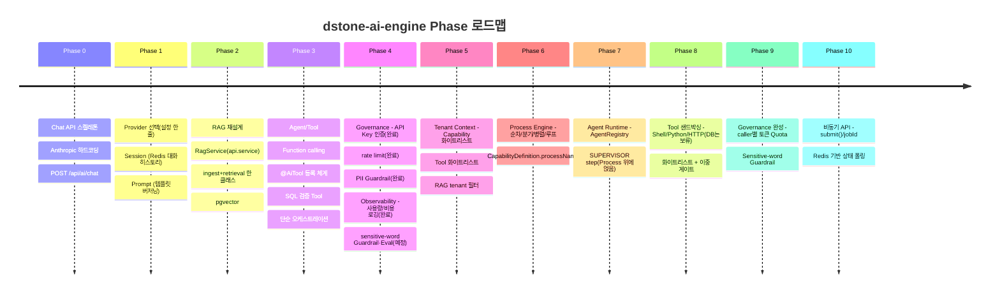

| Phase | 상태 | 핵심 산출물 |
|:---:|:---:|---|
| 0 | ✅ 완료 | `ChatController`/`ChatService`, Anthropic 하드코딩, Jasypt `ENC(...)` 키 관리 |
| 1 | ✅ 완료 | provider 선택(`ChatService`가 `spring.ai.model.chat`을 직접 읽음, 별도 gateway 패키지 없음), `session`(Redis 히스토리), `prompt`(템플릿 버저닝) |
| 2 | ✅ 완료 (실동작 검증됨, **2026-09-11 재설계**) | `api.service.RagService`(ingest+retrieval 통합), `api.controller.RagController`, `ChatService.getSpec()`의 `ragEnabled` 분기 — 6.2절 참고 |
| 3 | ✅ 완료 (`toolsEnabled`는 실동작 검증됨, `requiredTool`/`provider`/`ollamaModel`은 API 필드만 있고 미구현 — 7.6절) | `@AiTool` 등록 체계, `common.config.ConfigTool`, `ChatService.getSpec()`의 `toolsEnabled`, 샘플 `DateTimeTools`, SQL 검증 `SqlSyntaxTools` |
| 4 | ✅ 완료 (Eval 로깅만 예정, 나머지 전부 실동작 검증됨) | API Key 인증(`common.filter.ApiKeyAuthFilter`). caller별 요청 제한(`common.filter.RateLimitFilter`). PII 탐지/마스킹(`governance.guardrail`). 토큰 사용량/비용/지연시간 로깅(`governance.usage`). sensitive-word Guardrail은 9절(Phase 9)에서 완료 |
| 5 | ✅ 완료 (8.6절) | Tenant Context — `caller`(=tenant_id)를 Capability(`capability.CapabilityDefinition.allowedCallers`)/Tool(`common.config.ConfigTool.toolCallbackProvider(caller)`)/RAG(`api.service.RagService`의 tenant metadata 필터) 세 지점에서 강제. 새 `tenant` 패키지 없이 기존 `CallerContext`/`capability`/`tools` 확장으로 구현 |
| 6 | ✅ 완료 (실동작 검증됨, 15절) | Process Engine — 새 `process` 패키지(`ProcessStep`/`ProcessDefinition`/`ProcessRegistry`/`ProcessExecutor`), 순차/분기/병렬/루프 4패턴, `CapabilityDefinition.processName`으로 라우팅 |
| 7 | ✅ 완료 (실동작 검증됨, 16절) | Agent Runtime — 새 `agent` 패키지(`AgentDefinition`/`AgentRegistry`), `ProcessStepType.SUPERVISOR` 추가(별도 Agent 엔진 없이 Process 재사용) |
| 8 | ✅ 완료 (Shell/Python/HTTP 실동작 검증됨, DB Tool은 보류, 17절) | Tool Runtime 확장 — `tools/shell`, `tools/python`, `tools/http`(+공유 `common.exec.ExternalProcessRunner`). 전부 기본 비활성, 화이트리스트 필수 |
| 9 | ✅ 완료 (실동작 검증됨, 18절) | caller별 토큰 Quota(`governance.usage.UsageQuotaProperties`, Redis 예산 강제) + sensitive-word Guardrail(`governance.guardrail.SensitiveWordGuardrailAdvisor`) |
| 10 | ✅ 완료 (실동작 검증됨, 19절) | 비동기 API — `api.controller.ProcessController`(`/api/ai/process/submit`+`/status/{jobId}`), `api.service.ProcessJobService`(Redis Hash 기반 job 상태) |
| 7~10 | ⏳ 예정 (14절) | Agent Runtime(Process 재사용) → Tool 샌드박싱(Shell/Python/HTTP/DB) → Quota/Chargeback·추가 Guardrail → 비동기 API(`submit()`/`jobId`) |

> 📝 **2026-09-11 리팩터링 노트**: Phase 2(RAG)를 한 차례 구현(`rag.ingest`/`rag.embedding`/`rag.retrieval` 3개 패키지 + Agentic RAG용 `tools.rag.RetrievalTools`)했다가, 원하는 형태가 아니어서 백엔드에서 걷어내고 이번 절 전체에 설명된 구조(`api.service.RagService` 하나)로 다시 설계했다. 같은 시점에 Phase 1의 `gateway` 패키지(`GatewayProperties`, 기동 시 `spring.ai.model.chat` fail-fast 검증)도 정리되어, `ChatController`/`ChatService`가 `ConfigProperty`로 이 값을 직접 읽는 방식으로 단순화됐다. Agentic RAG(`RetrievalTools`)와 `EmbeddingProperties`(기동 시 `spring.ai.model.embedding` fail-fast 검증)는 이번 재설계 범위에서 의도적으로 제외했다 — 필요해지면 `RagService.search()`를 감싸는 `@AiTool` 클래스, 혹은 `RagService`와 동일한 lifecycle을 갖는 `@ConditionalOnProperty` 검증 빈으로 다시 추가할 수 있다. 같은 시점에 `tools/sql/PostgresExplainValidationTools`(pgvector용 `DataSource`를 재사용해 실제 PostgreSQL `EXPLAIN`으로 2차 검증하던 Tool)도 함께 삭제됐다 — 지금 `tools/sql/`에는 `SqlSyntaxTools`(JSQLParser 순수 문법 검사) 하나만 남아 있다(7.5절 참고).
>
> 📝 **2026-09-13~14 정리 노트**: ① `session.RedisChatMemoryRepository`가 `RedisChatMemorySession`으로 이름이 바뀌었다(기능 변화 없음). ② `common.config.ConfigChatClient`의 advisor 3종(`UsageLoggingAdvisor`/`PiiGuardrailAdvisor`/`MessageChatMemoryAdvisor`) 연결이 한때 빠졌다가 복원된 사고가 있었다(8절 상단 "배선 완료" 박스 참고). ③ 가장 큰 변화 — 최상위 `config` 패키지와 `governance.auth`/`governance.ratelimit` 패키지가 `common.config`/`common.context`/`common.filter`로 통합되면서, 전용 바인딩 클래스였던 `ApiKeyProperties`/`ApiKeyEntry`/`RateLimitProperties`/`RateLimitOverride`/`RateLimiter` 5개가 전부 삭제됐다. 이게 가능했던 이유는 `dstone-common`의 `ConfigProperty.getListProperty()`가 같은 시점에 `Binder` 기반으로 바로잡혀서(예전 구현은 YAML 리스트-오브-오브젝트를 제대로 바인딩하지 못했다 — [05.dstone-common.md](05.dstone-common.md) 참고) `List<Map>`이 필요한 정도의 바인딩이라면 전용 클래스 없이 `ApiKeyAuthFilter`/`RateLimitFilter` 안에서 `configProperty.getListProperty(...)` 한 줄로 끝나게 됐기 때문이다(반대로 `UsageProperties`처럼 특정 레코드 타입 리스트가 필요한 경우는 여전히 `Binder`를 직접 쓴다). `dstone.ai.governance.auth.*`/`dstone.ai.governance.ratelimit.*` 설정 키 이름 자체는 바뀌지 않았다 — 3절 상단 경고 박스 참고.

---

## 5. Phase 0~1 — Chat API, Gateway, Session, Prompt

### 5.1 아키텍처

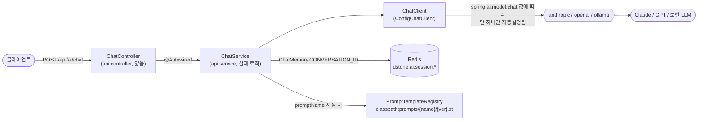

- `ChatController`는 세션 ID 결정, 입력 검증(`message` 필수) 같은 HTTP 관심사만 다루고 `@Autowired ChatService`로 곧장 위임한다 — 실제 요청 스펙 조립(system 프롬프트/RAG/Tool/사용량 로깅 advisor 부착)은 전부 `ChatService.getSpec()` 한 메서드 안에 있다.
- provider(`anthropic`/`openai`/`ollama`) 결정은 별도의 `gateway` 패키지나 검증 빈 없이, `ChatController`가 요청을 받을 때마다 `ConfigProperty.getProperty("spring.ai.model.chat")`으로 직접 읽어 `ChatService`에 넘긴다 — 값 자체는 `net.dstone.ai.common.consts.AiProvider.fromPropertyValue(...)`로 enum 변환된다.
- ⚠️ **기동 시점 fail-fast 검증은 없다.** 예전에는 `GatewayProperties`가 `@PostConstruct`에서 이 값을 검증해 오타/누락 시 기동 자체를 실패시켰지만, 이번 리팩터링에서 그 클래스를 걷어냈다 — 지금은 `spring.ai.model.chat`이 비어있거나 3개 provider의 자동설정이 동시에 켜지는 설정 실수가 있으면 **기동 시점이 아니라 첫 요청 처리 시점**에 드러난다(Spring AI 자동설정이 `ChatModel`/`ChatClient` 빈을 못 만들면 해당 요청이 실패). 배포 전 설정 검증이 중요하다면 스모크 테스트(`curl` 한 번)로 이 지점을 확인하는 걸 권장한다.

### 5.2 Provider 선택 — 설정 한 줄로 LLM 교체

```yaml
spring:
  ai:
    model:
      chat: anthropic   # anthropic | openai | ollama 중 하나로만 교체하면 끝
```

| Provider | 설정 위치 | 비고 |
|---|---|---|
| `anthropic` (현재 사용 중) | `spring.ai.anthropic.api-key` | API 키는 Jasypt `ENC(...)`로 암호화, `env.properties` 경유하지 않음 |
| `openai` | `spring.ai.openai.api-key`, `base-url` | 로컬 vLLM(OpenAI 호환 API) 연결 시 `base-url`만 vLLM 서버로 override |
| `ollama` | `spring.ai.ollama.base-url` | 사내망/로컬 Ollama, API 키 불필요 |

> ⚠️ Azure OpenAI는 Spring AI 2.x에서 chat model provider로 완전히 제거되어(vector-store 용도만 남음) 지원 목록에 없다.

### 5.3 Session — Redis 기반 대화 히스토리

Spring AI가 공식 제공하는 `ChatMemoryRepository`는 jdbc/cassandra/neo4j뿐이라(Redis 없음), `RedisChatMemorySession`을 직접 구현했다(🆕 2026-09-13 이전 이름은 `RedisChatMemoryRepository` — 기능 변화 없이 클래스/파일명만 바뀌었다).

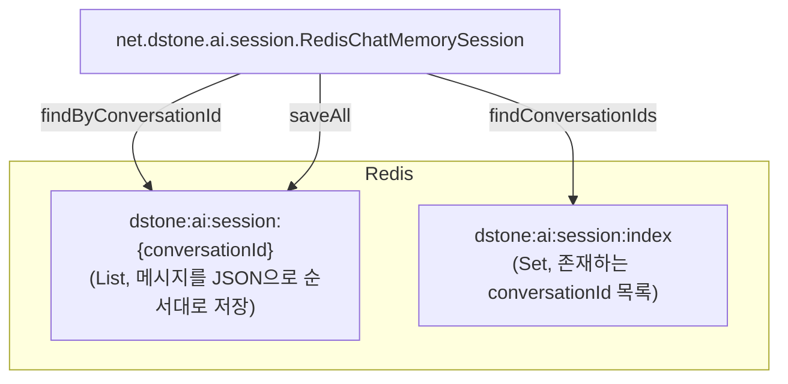

| 설정 | 기본값 | 설명 |
|---|---:|---|
| `dstone.ai.session.max-messages` | 20 | 세션당 유지할 최대 메시지 수 (초과 시 오래된 것부터 잘림) |
| `dstone.ai.session.ttl-seconds` | 86400 (1일) | Redis에 저장된 세션 히스토리 만료 시간 |

`dstone-boot`의 `dstone:session`(HTTP 세션) 네임스페이스와 겹치지 않도록 `dstone:ai:session:*`으로 분리했다.

**conversationId(=`sessionId`) 결정 순서.** `ChatController.chat()`은 다음 우선순위로 하나를 고른다: ① 서블릿 `HttpSession`에 이미 `DEFAULT_SESSION_KEY`(`net.dstone.common.biz.BaseController`) 속성이 있으면 그 값 → ② 없으면 요청 바디의 `sessionId` → ③ 그것도 없으면 `UUID.randomUUID()`로 신규 발급. ①은 HTTP 세션(쿠키)에 대화 ID를 고정해두는 자리를 미리 만들어 둔 것인데, **현재 이 리포지토리 어디에도 `DEFAULT_SESSION_KEY`를 실제로 채워 넣는 코드가 없다** — 즉 지금은 항상 ②/③ 경로로만 동작하고(기존과 동일), ①은 향후 `dstone-boot` 로그인 세션과 연동하는 등의 용도로 미리 열어둔 훅이다. 이 상태(①이 항상 비어있음)가 의도한 설계인지, 아니면 세션 고정 로직을 마저 채워 넣어야 하는지는 확인이 필요하다.

### 5.4 Prompt — 템플릿 버저닝

```
src/main/resources/prompts/
└── {템플릿명}/
    ├── v1.st
    └── v2.st   (SI 프로젝트별로 파일만 추가/교체하면 커스터마이징 끝 - 코드 변경 불필요)
```

```yaml
dstone:
  ai:
    prompt:
      default-version: v1
      versions:
        sample-system: v2   # 템플릿명별 override, 없으면 default-version 사용
```

---

## 6. Phase 2 — RAG (Retrieval-Augmented Generation)

### 6.1 RAG 파이프라인 한눈에 보기

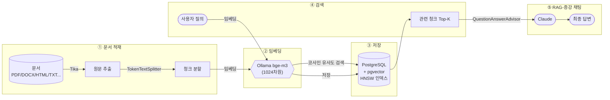

**실제로 검증된 e2e 흐름**: 문서 업로드 → pgvector 저장 확인 → 유사도 검색으로 관련 청크 반환 → `ragEnabled:true`로 채팅했을 때 Claude가 방금 넣은 문서 내용을 정확히 인용해 답변 — 전 과정이 정상 동작함을 실제로 확인했다. (이 e2e 검증은 최초 구현 당시 `rag.ingest`/`rag.retrieval` 패키지 기준으로 확인된 것이고, 2026-09-11 재설계 이후의 `RagService`도 로직은 그대로 옮겨온 것이라 동작은 동일하다.)

### 6.2 설계 원칙 — `RagService`가 항상 존재하는 이유

RAG를 처음 구현했을 때는 `rag.ingest`/`rag.embedding`/`rag.retrieval` 3개 패키지 + `RagController`까지 전부 `@ConditionalOnProperty(dstone.ai.rag.enabled=true)`로 묶어서, RAG를 껐을 때 관련 빈이 컨테이너에서 통째로 사라지게 했었다. 이번 재설계에서는 그 방식을 버리고 **최상위원칙(dstone.ai.rag.enabled)과 선택적원칙(요청의 ragEnabled)을 한 클래스, `RagService` 안으로 모았다.** 이렇게 바꾼 이유:

- `ChatController`/`ChatService`/`RagController`는 RAG on/off와 무관하게 **항상 떠 있어야 하는** 컴포넌트다. 그런데 실제 검색에 쓰이는 `VectorStore`(pgvector)는 `dstone.ai.rag.enabled=true`이고 `spring.ai.model.embedding`이 올바를 때만 Spring AI가 만들어주는, **그 자체로 조건부인 빈**이다.
- 이 둘을 그대로 `@Autowired`(생성자/필드 필수 주입)로 이으면, RAG를 끈 배포에서 `VectorStore`가 없어 `ChatService`/`RagController`까지 통째로 기동 실패한다.
- 이 간극을 `ObjectProvider<VectorStore>`+null 체크로 호출부(`ChatService`, `RagController`)마다 반복하는 대신, **`RagService` 한 곳에만 두기로 했다.**

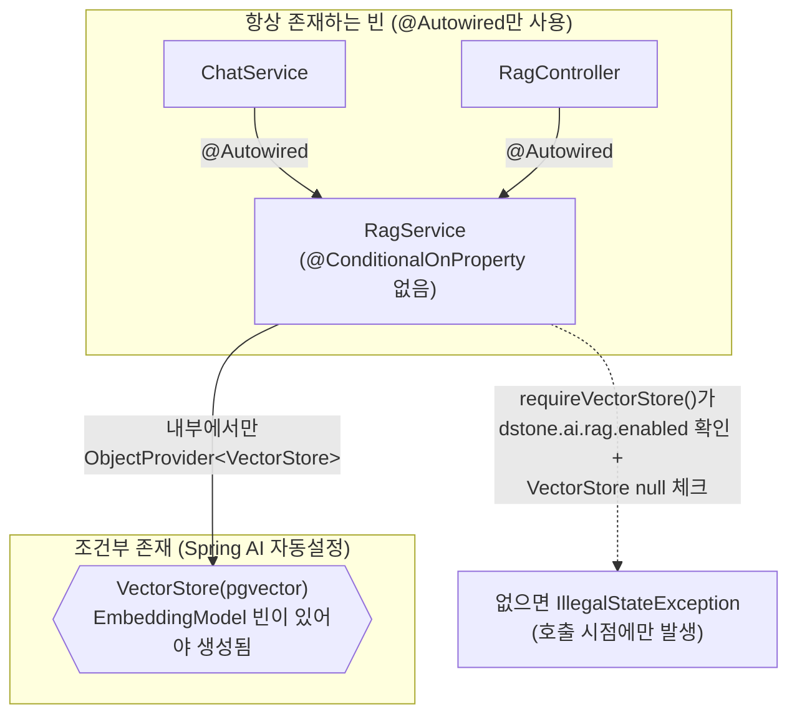

- `RagService`는 `@Service`일 뿐 어떤 `@ConditionalOnProperty`도 붙어있지 않다 — 그래서 `ChatService`/`RagController` 어느 쪽에서든 순수 `@Autowired RagService ragService;`(생성자 없이 필드 주입) 한 줄로 받으면 끝이다.
- `RagService.requireVectorStore()`(private)가 이 클래스의 유일한 게이트다: ① `dstone.ai.rag.enabled`가 `true`인지, ② `VectorStore` 빈이 실제로 존재하는지(`ObjectProvider.getIfAvailable()`) 둘 다 확인하고, 하나라도 아니면 그 자리에서 `IllegalStateException`을 던진다. `buildQuestionAnswerAdvisor()`/`search()`/`ingest()`/`deleteBySourceId()` 등 공개 메서드는 전부 이 게이트를 먼저 통과시킨다.
- 즉 "RAG를 실제로 쓸 수 있는가"는 **빈이 존재하는지(기동 시점)가 아니라, 메서드를 호출했을 때(요청 시점)** 판단된다 — 호출하지 않으면(예: `ragEnabled`를 안 보낸 일반 채팅) 이 게이트 자체가 실행되지 않으므로 RAG 인프라 유무와 완전히 무관하게 동작한다.

### 6.3 문서 적재 (ingest)

`RagService.ingest()`가 담당한다.

```mermaid
sequenceDiagram
    autonumber
    actor Client
    participant Ctrl as RagController
    participant Svc as RagService
    participant Tika as TikaDocumentReader
    participant Splitter as TokenTextSplitter
    participant VS as VectorStore(pgvector)

    Client->>Ctrl: POST /api/ai/rag/documents<br/>(file, sourceId)
    Ctrl->>Svc: ingest(resource, sourceId)
    Svc->>Svc: requireVectorStore()<br/>(dstone.ai.rag.enabled + VectorStore 존재 확인)
    Svc->>Tika: get() - 원문 추출
    Tika-->>Svc: List&lt;Document&gt;
    Svc->>Splitter: apply() - 청크 분할
    Splitter-->>Svc: List&lt;Document&gt; (청크들)
    Note over Svc: 청크마다 metadata에<br/>sourceId 태깅
    Svc->>VS: delete(filter: sourceId == ?)
    Note over Svc,VS: 같은 sourceId 재적재 시<br/>upsert처럼 동작(기존 청크 선삭제)
    Svc->>VS: add(tagged chunks)
    VS-->>Client: {"sourceId": "...", "chunkCount": N}
```

- **왜 upsert가 필요한가**: `sourceId`(호출 쪽이 부여하는 논리적 문서 식별자, 예: 파일명)로 재적재하면 오래된 청크를 먼저 지운 뒤 새로 넣는다 — 안 그러면 문서를 갱신할 때마다 오래된 청크가 검색 결과에 계속 섞여 나온다.
- **포맷 커버리지**: Apache Tika 하나로 PDF/DOCX/PPTX/HTML/TXT 등 대부분의 SI 문서 포맷을 커버한다.
- **빈 결과 안전장치**: 텍스트 추출/청킹 결과가 비어 있으면 기존 청크를 지우지 않고 그대로 종료한다(손상된 파일 재적재로 기존 정상 데이터가 날아가는 것을 방지).

### 6.4 임베딩 (embedding)

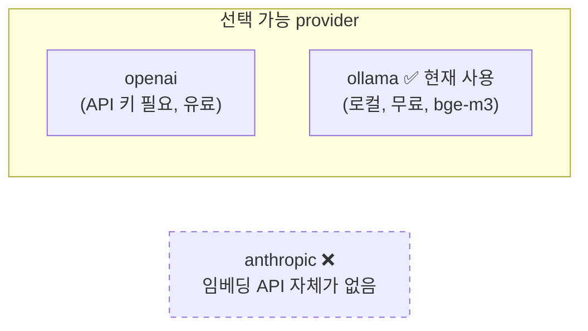

| 항목 | 값 |
|---|---|
| 활성 provider | `ollama` (`spring.ai.model.embedding: ollama`) |
| 모델 | `bge-m3` (다국어/한국어 지원, 1024차원) |
| 선택 이유 | Anthropic은 임베딩 API 미제공, 이 환경엔 OpenAI 키도 없어서 로컬 무료 모델 채택 |
| 검증 | ⚠️ 별도 fail-fast 검증 빈 없음(아래 참고) — `RagService.requireVectorStore()`가 첫 사용 시점에 `VectorStore` 존재 여부로 대신 확인 |

> ⚠️ **기동 시점 fail-fast 검증은 이번 재설계에서 의도적으로 제외했다.** 예전에는 `EmbeddingProperties`가 `GatewayProperties`(5.2절)와 같은 철학으로 `spring.ai.model.embedding` 값을 기동 시점에 검증했지만, 6.2절에서 설명한 "빈은 항상 존재하고 게이트는 호출 시점에만 있다"는 설계와 맞춰 제거했다. 즉 `dstone.ai.rag.enabled=true`인데 `spring.ai.model.embedding` 설정이 빠졌다면, 지금은 **기동은 정상적으로 되고** RAG 관련 요청(`ragEnabled:true` 채팅, 문서 업로드/검색)을 처음 호출하는 순간 `RagService.requireVectorStore()`가 `IllegalStateException`으로 알려준다.

> 📌 **채팅 provider와 임베딩 provider는 완전히 독립적으로 선택된다.** 지금은 "채팅=Anthropic Claude + 임베딩=Ollama bge-m3" 조합이지만, `spring.ai.model.chat`/`spring.ai.model.embedding` 두 값을 각각 바꾸면 어떤 조합도 가능하다.

### 6.5 검색 (retrieval) 과 RAG-증강 채팅

`RagService`가 `VectorStore.similaritySearch`를 감싸며, 독립 검색 API와 채팅 통합 양쪽에서 재사용된다.

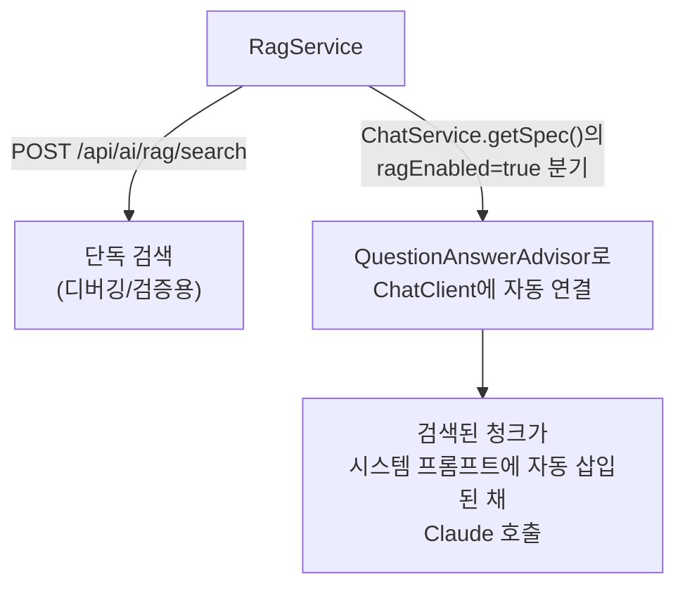

| 설정 | 기본값 | 비고 |
|---|---:|---|
| `dstone.ai.rag.retrieval.top-k` | 5 | 검색할 청크 수 |
| `dstone.ai.rag.retrieval.similarity-threshold` | **0.35** | ⚠️ 실측 기반 조정값(바로 아래 참고) |

> ⚠️ **실측으로 찾은 함정**: 처음엔 0.5로 뒀는데, `bge-m3` 기준으로는 진짜 관련 있는 문서/질의 쌍도 코사인 유사도가 0.48 정도밖에 안 나와서 **데이터가 정상 적재됐는데도 검색 결과가 통째로 비어버리는** 문제가 있었다. 임베딩 모델/도메인마다 유사도 분포가 다르므로 실제 서비스에서는 자신의 데이터로 임계값을 다시 측정/조정해야 한다.

### 6.6 on/off 스위치 두 개 — 최상위원칙과 선택적원칙

```yaml
dstone:
  ai:
    rag:
      enabled: true   # false(또는 미설정)면 RagService의 모든 메서드가 IllegalStateException — Postgres/pgvector/임베딩 설정 없이도 앱 자체는 그대로 기동
```

RAG를 실제로 쓰려면 스위치 두 개가 **AND로** 겹쳐야 한다:

1. **최상위원칙(`dstone.ai.rag.enabled=true`)** — 이 배포/환경 전체에서 RAG 기능을 열어둘지 결정한다. `RagService.requireVectorStore()`가 매 호출마다 확인한다(6.2절). `false`(또는 미설정)면 아래 2번 값과 무관하게 RAG는 절대 동작하지 않는다.
2. **선택적원칙(요청의 `ragEnabled: true`)** — 1번이 켜져 있다는 전제 하에, **이 요청 하나만** RAG-증강을 적용할지 결정한다. `ChatService.getSpec()`이 `Boolean.TRUE.equals(request.ragEnabled())`일 때만 `ragService.buildQuestionAnswerAdvisor()`를 호출한다(6.5절). 즉 같은 서버에서 어떤 요청은 RAG 없이 순수 채팅으로, 어떤 요청은 RAG-증강으로 자유롭게 섞어 받을 수 있다.

`RagController`/`RagService`는 (예전과 달리) `dstone.ai.rag.enabled` 값과 무관하게 **항상 빈으로 존재**하지만, `enabled=false`인 배포에서 `/api/ai/rag/**`를 호출하면 `RagService`가 명확한 `IllegalStateException` 메시지로 알려준다 — Postgres/pgvector/임베딩 설정 자체는 여전히 필요 없다. **RAG가 필요 없는 SI 프로젝트는 이 값만 안 켜면 Phase 0/1까지의 기능만으로 완전히 정상 동작한다** — 이게 이 엔진을 "여러 프로젝트가 공유하는 플랫폼"으로 설계한 핵심 포인트다.

---

## 7. Phase 3 — Agent/Tool (Function Calling)

Spring AI의 Tool Calling(Function Calling)을 감싸서, **SI 프로젝트가 애노테이션 하나로 자기만의 Tool을 추가**할 수 있게 하는 게 이 Phase의 전부다. RAG처럼 새 인프라가 필요하지 않다(순수 Java 코드 실행) — 그래서 on/off 플래그 없이 항상 켜져 있고, 등록된 Tool이 없으면 그냥 빈 상태로 존재한다.

### 7.1 Tool 호출 흐름

한눈에 보면 이렇다 — 등록(기동 시 1회) → LLM에게 통지(요청마다) → 실행 루프(tool_use가 나올 때마다), 3단계로 나뉜다.

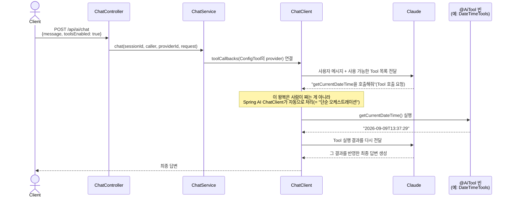

#### 1단계 — 기동 시점: Tool 등록 (Reflection 기반)


`ConfigTool`이 `@AiTool` 빈들을 찾아서, 그 안의 **`public` + `@Tool` 붙은 메소드**를 리플렉션으로 뒤진다. 각 메소드마다 `ToolDefinition`을 만드는데, 이때 메소드의 **파라미터 타입/이름(`-parameters` 컴파일 옵션 필요)과 `@ToolParam` 설명**을 보고 **JSON Schema를 자동 생성**한다.

| 메소드 | 생성되는 JSON Schema(개념) |
|---|---|
| `getCurrentDateTime()` (파라미터 없음) | 빈 스키마 |
| `validateSqlSyntax(@ToolParam(description="검증할 단일 SQL 문") String sql)` | `{"sql": {"type":"string", "description":"검증할 단일 SQL 문"}}` |

#### 2단계 — 채팅 요청 시: LLM에게 "이런 도구들이 있다"고 알려줌

`ChatService.getSpec()`이 `.toolCallbacks(configTool.toolCallbackProvider())`로 붙이면, 이 요청이 Claude API로 나갈 때 **`tools` 파라미터에 방금 만든 ToolDefinition 목록(이름/설명/스키마)이 그대로 실린다**. Claude는 이 설명"만" 보고 — 실제 코드는 전혀 모른 채로 — "이 질문엔 이 도구를 써야겠다"를 스스로 판단한다. **이 판단 자체가 별도 로직이 아니라 Claude 모델 자체의 생성 결과**다(tool-use를 학습한 LLM이 다음 토큰으로 "일반 텍스트" 대신 "도구 호출 요청" 형태를 생성하는 것 - 7.5절에서 보듯 "LLM이 스스로 판단"이 바로 이 지점이다).

#### 3단계 — 실제 실행 루프: `ToolCallingManager`

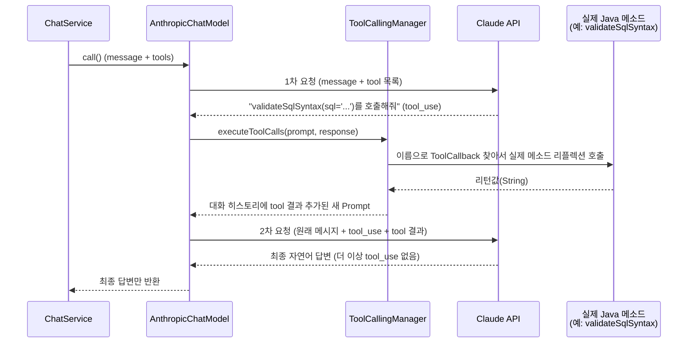

핵심은 `org.springframework.ai.model.tool.ToolCallingManager`(구현체 `DefaultToolCallingManager`)다:
- `resolveToolDefinitions()` — 요청에 실을 도구 목록 준비
- `executeToolCalls(Prompt, ChatResponse)` — Claude 응답에 tool 호출 요청이 있으면, **이름으로 매칭되는 `ToolCallback`을 찾아 실제 자바 메소드를 리플렉션으로 실행**하고, 결과를 새 메시지(`ToolResponseMessage`)로 만들어 대화 히스토리에 추가

이 왕복(1차 요청 → tool 실행 → 2차 요청 → 최종 답변)이 **Claude가 더 이상 tool을 요청하지 않을 때까지 자동으로 반복**되는 게 바로 7.3절에서 말하는 "단순 오케스트레이션"의 정체다 — `ChatModel.call()` 내부에서 다 처리되고, `ChatController` 입장에선 `.call().content()` 한 줄이 끝날 때까지 이 왕복이 몇 번 일어났는지조차 알 필요가 없다.

| 단계 | 누가 | 뭘 함 |
|---|---|---|
| 등록 | `ConfigTool` (기동 시 1회) | 리플렉션으로 `@Tool` 메소드 → JSON Schema 생성 |
| 판단 | Claude (매 요청) | 도구 설명만 보고 호출 여부/인자 스스로 결정 |
| 실행 | `ToolCallingManager` (매 tool_use마다) | 이름 매칭 → 실제 메소드 리플렉션 호출 |
| 반복 | `ChatModel` 내부 루프 | tool_use 없어질 때까지 1~3 반복 |

### 7.2 Tool 등록 체계 — `@AiTool` 하나로 등록

```java
@AiTool                       // net.dstone.ai.common.annotation.AiTool - 이 한 줄이면 자동으로 발견됨
public class DateTimeTools {

    @Tool(description = "현재 날짜와 시간을 ISO-8601 형식으로 반환한다. "
            + "사용자가 '오늘', '지금 몇 시' 등을 물어볼 때 사용한다.")
    public String getCurrentDateTime() {
        return LocalDateTime.now().format(DateTimeFormatter.ISO_LOCAL_DATE_TIME);
    }
}
```

- `common.config.ConfigTool`이 기동 시점에 이 빈을 찾아 등록하는 정확한 과정은 7.1절 1단계 참고 - dstone-boot/batch/batchadmin과 동일한 컨벤션대로 `common.config.Config`에서 다른 `Config*` 클래스들과 함께 `@Import`된다.
- `@Tool(description = ...)`이 곧 LLM에게 "이 도구가 뭘 하는지" 알려주는 설명이다 — LLM은 이 설명만 보고 언제 호출할지 스스로 판단한다(사람이 if/else로 분기하지 않음).
- 새 Tool이 필요하면 이 패턴 그대로 클래스 하나 추가하면 끝 — `prompt` 패키지(5.4절)와 동일한 "설정/컨벤션만 따르면 코드 추가 없이 동작"하는 철학이다.
- SI 프로젝트마다 실제로 필요한 Tool은 완전히 다를 것이므로(사내 시스템 API 호출, 계산기, 검색 등), 지금 포함된 `DateTimeTools`는 **패턴을 보여주는 샘플**이다(`dstone-boot`의 `sample/` 패키지와 같은 성격 - 실제 배포 시 지우거나 자기 도메인 Tool로 교체).

### 7.3 "단순 오케스트레이션"이 의미하는 것

별도의 워크플로우/그래프 엔진을 직접 만들지 않는다. 7.1절 3단계에서 본 `ToolCallingManager`의 반복 루프가 이미 Spring AI `ChatModel` 안에 내장돼 있고, `dstone-ai-engine`은 그 루프에 어떤 Tool을 쓸 수 있는지만 알려주는 역할이다. 대화 히스토리(memory)도 Phase 1의 `ChatMemory`(Redis)를 그대로 공유한다 — Tool 호출을 위한 별도 memory를 새로 만들지 않았다.

### 7.4 실동작 검증

Tool 없이 물으면 모른다고 답하고, `toolsEnabled: true`로 물으면 실제 Tool을 호출해서 정확한 값으로 답하는 것을 실제로 확인했다:

```bash
# toolsEnabled 없음 - 모델이 "실시간 정보에 접근할 수 없다"고 답함
curl -X POST http://localhost:8081/api/ai/chat -H "Content-Type: application/json" \
  -d '{"message":"지금 정확한 날짜와 시간이 몇 시야?","toolsEnabled":false}'

# toolsEnabled: true - getCurrentDateTime을 호출해서 실제 시스템 시간으로 정확히 답함
curl -X POST http://localhost:8081/api/ai/chat -H "Content-Type: application/json" \
  -d '{"message":"지금 정확한 날짜와 시간이 몇 시야?","toolsEnabled":true}'
# → "2026-09-09T13:37:29" (실제 시스템 시간과 1초 이내로 일치)
```

기동 로그에서도 등록된 Tool 목록을 바로 확인할 수 있다(아래는 Agentic RAG `RetrievalTools`가 있던 시점에 실제로 캡처했던 로그 — `searchKnowledgeBase`는 7.5절에서 설명한 재설계로 지금은 없고, 대신 `validateSqlSyntax`만 등록된다):
```
dstone-ai-engine agent: 등록된 Tool = getCurrentDateTime, searchKnowledgeBase   # (과거 캡처, 예시)
```

### 7.5 SQL 검증 Tool — Oracle→PostgreSQL 변환 자기수정 루프

`prompts/oracle-to-postgresql/v1.st`처럼 **LLM이 SQL을 생성**하는 프롬프트에서, 최종 답변을 내놓기 전에 스스로 문법을 검증하고 틀렸으면 고치는 "자기수정 루프(self-correction loop)"에 쓰라고 만든 Tool이다. `tools/sql/` 패키지에 있다.

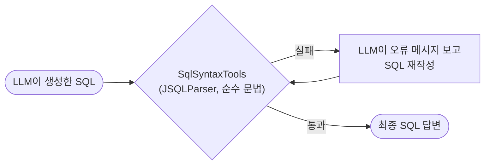

| Tool | 존재 조건 | 검증 방식 | 장단점 |
|---|:---:|---|---|
| `SqlSyntaxTools.validateSqlSyntax` | 항상 존재 | JSQLParser로 순수 문법 구조만 검사(특정 DB 서버 불필요) | 어떤 대상 스키마든 항상 쓸 수 있지만, PostgreSQL 고유 문법의 세부까지는 완벽히 검증하지 못함(대상 테이블이 실제로 존재하는지는 모름) |

- **세미콜론 다중 문장 방어**: JSQLParser로 "정확히 하나의 SELECT/INSERT/UPDATE/DELETE 문"인지 먼저 확인해서, 여러 문장을 세미콜론으로 이어붙인 입력을 거부한다.
- **왜 이것 하나뿐인가**: 원래는 이 1차 문법 검사 뒤에 pgvector용 `DataSource`를 재사용해 실제 PostgreSQL `EXPLAIN (COSTS FALSE)`로 2차 검증하는 `PostgresExplainValidationTools`(`dstone.ai.rag.enabled=true`일 때만 존재)를 이어 붙인 2단계 구성이었다. 하지만 이 서버(`dstone_ai` DB)엔 실제 업무 테이블이 없는 게 보통이라 "문법은 맞는데 이 서버 기준으로는 객체 존재를 확인 못 했다"는 애매한 부분 통과 결과가 흔했고, 실효성 대비 복잡도가 맞지 않아 2026-09-11 재설계에서 함께 삭제했다(4절 리팩터링 노트 참고). 다시 필요해지면 같은 패키지에 `@ConditionalOnProperty(dstone.ai.rag.enabled=true)` + `DataSource` 생성자 주입으로 복원할 수 있다.

### 7.6 tool_choice 강제 — `requiredTool` (⚠️ 미구현, API 계약만 존재)

`toolsEnabled: true`는 Tool을 "쓸 수 있게" 붙여줄 뿐, 실제로 호출할지 말지는 여전히 LLM의 판단(`tool_choice=auto`)에 맡긴다. 반드시 특정 Tool을 한 번 호출하고 넘어가야 하는 흐름을 위해 `ChatRequest`에는 `requiredTool`/`provider`/`ollamaModel` 필드가 이미 있지만, **`ChatService.getSpec()`은 이 세 필드를 전혀 읽지 않는다** — 즉 요청 바디에 넣어 보내도 조용히 무시된다.

```java
// api/dto/ChatRequest.java — 필드는 있다
public record ChatRequest(String message, String sessionId, String promptName, Map<String, Object> variables,
        Boolean ragEnabled, Boolean toolsEnabled, String requiredTool, String provider, String ollamaModel) {
}
```

- `ChatService.getSpec()`은 `AiProvider.fromPropertyValue(providerId)`로 provider 값 유효성만 검증할 뿐, 그 결과인 `provider` 지역 변수를 이후 다시 쓰지 않는다 — `requiredTool`/`provider`/`ollamaModel`을 실제로 반영하는 분기 자체가 아직 없다는 뜻이다.
- 마찬가지로 `provider`(요청 단위 provider override)와 `ollamaModel`도 `ChatController`/`ChatService` 어디에서도 참조되지 않는다 — `ChatController`는 매 요청마다 `ConfigProperty.getProperty("spring.ai.model.chat")` 전역값 하나만 읽어 `ChatService`에 넘긴다(5.1절).
- 이 절의 나머지 설명(`tool_choice={"type":"tool","name":...}` 강제, provider별 400 처리 등)은 **의도했던 설계**를 적어둔 것이지, 지금 동작을 적은 게 아니다 — 실제로 구현하려면 `ChatService.getSpec()`에 `requiredTool`이 채워졌을 때 `ChatClient.Builder`나 `Prompt`에 provider별 tool_choice 옵션(Anthropic이면 `AnthropicChatOptions.toolChoice(...)`)을 실어 보내는 분기를 추가해야 한다.
- `requiredTool`을 실제로 구현할 때 고려할 점(참고용): Anthropic 전용이 될 가능성이 높다 — OpenAI/Ollama도 각자 다른 방식의 강제 tool 호출 옵션을 갖고 있어 provider마다 분기가 필요하다. 값이 `ConfigTool`에 등록된 이름과 다르면 400으로 막아야 한다. 강제 호출을 지원하지 않는 모델로 바뀌면 provider API 자체가 에러를 내므로, 배포 전 해당 모델이 forced tool use를 지원하는지 확인이 필요하다.

### 7.7 Capability — 자주 쓰는 설정 조합에 이름 붙이기

`dstone-boot` 같은 응용 애플리케이션이 매번 "`promptName=oracle-to-postgresql` + `toolsEnabled=true`"를 조합해서 보내는 대신, `capability: "oracle-to-postgresql"` 이름 하나만 실어 보내면 되게 해주는 얇은 라우팅 계층이다. 실제로 어떤 프롬프트를 쓰고 어떤 옵션을 켤지는 `dstone.ai.capability.definitions` 설정에 미리 적어두고, `CapabilityRegistry`가 이름으로 찾아준다.

```yaml
dstone:
  ai:
    capability:
      definitions:
        - name: oracle-to-postgresql
          prompt-name: oracle-to-postgresql
          tools-enabled: true
          rag-enabled: false
```

- **그냥 "이름 붙은 기본값"일 뿐이다.** `ChatService.getSpec()`은 capability가 채워준 `promptName`/`toolsEnabled`/`ragEnabled`보다, 요청에 그 값들이 직접 들어오면 그쪽을 항상 우선한다 — 그래서 capability를 아예 모르는 기존 채팅 요청(`toolsEnabled`/`ragEnabled`를 직접 켜고 끄는 방식)은 이 기능이 생기기 전과 똑같이 동작한다.
- **워크플로우 엔진이 아니다.** 조건분기/반복/여러 Agent가 순서대로 일하는 구조는 없다 - 그냥 설정 한 줄에 이름을 붙인 것뿐이고, 지금 필요한 건 이 정도로 충분하다고 판단했다. 실제로 여러 단계짜리 흐름이 필요해지면 그때 다시 설계한다.
- **등록 안 된 이름을 보내면 에러가 난다** - `PromptTemplateRegistry.template()`이 없는 템플릿 이름에 대해 `IllegalArgumentException`을 던지는 것과 동일하게 처리된다.
- **첫 사용처는 `dstone-boot`의 SQL 변환 화면**(06.dstone-boot.md 10.5절)이다 - 오라클 SQL을 입력받아 `capability: "oracle-to-postgresql"`로 `POST /api/ai/chat`을 호출하고, 그 결과(변환된 SQL 또는 실패 사유)를 그대로 보여준다.

---

## 8. Phase 4 — Governance & Observability (API Key 인증, Rate Limit, PII Guardrail, 사용량 로깅)

Phase 4는 개념적으로 `governance`(Guardrail/PII 필터/rate limit/비용 트래킹/인증)와 `observability`(토큰/비용/트레이싱/Eval) 두 영역을 다룬다 — 다만 3절 상단 경고 박스에서 짚었듯, 이건 `application.yml` 설정 키(`dstone.ai.governance.*`/`dstone.ai.observability.*`) 이름일 뿐 실제 자바 패키지와 1:1로 대응하지는 않는다(API Key 인증/rate limit은 `common.filter`/`common.context`에, 사용량 로깅은 `governance.usage`에 있다). `governance.auth`(API Key 인증, 8.2절)부터 구현했다 — rate limit/비용 트래킹은 "누가 호출했는지"가 먼저 정해져야 의미가 있기 때문이다. 그 첫 소비자로 `governance.ratelimit`(caller별 요청 제한, 8.3절)을 구현했고, 이어서 `governance.guardrail`(PII 탐지/마스킹, 8.4절)과 `observability.usage`(토큰 사용량/비용/지연시간 로깅, 8.5절)까지 구현했다 — "비용 트래킹"은 별도 예산 강제 기능을 따로 두지 않고 `observability.usage`가 caller별 비용을 로그로 남기는 것으로 갈음했다(아래 8.5절 참고). 남은 것은 Guardrail의 다른 종류(sensitive-word 차단 등)와 Eval 결과 로깅뿐이다.

#### 🧭 Phase 4 한눈에 보기 — 요청 하나가 통과하는 4개의 관문

아래 4가지 기능은 서로 다른 레이어(Servlet Filter 2개 + ChatClient Advisor 2개)에 있어서, 코드만 보면 전체 그림을 그리기가 쉽지 않다. `POST /api/ai/chat` 요청 하나가 실제로는 이 순서로 통과한다:

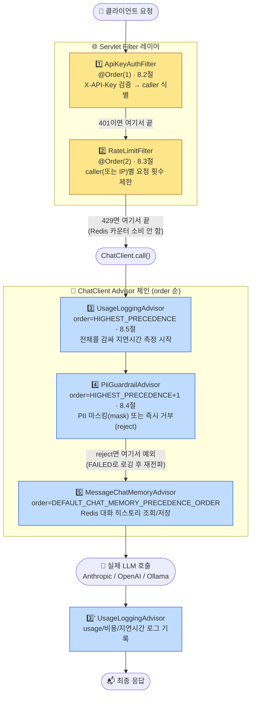

| # | 이름 | 레이어 | 기본값 | 실패 시 응답 |
|:---:|---|---|:---:|---|
| 1️⃣ | `ApiKeyAuthFilter` | Servlet Filter | `enabled: false` | `401 unauthorized` |
| 2️⃣ | `RateLimitFilter` | Servlet Filter | `enabled: false` | `429 too_many_requests` + `Retry-After` |
| 3️⃣ | `UsageLoggingAdvisor` | ChatClient Advisor | `enabled: true` | 없음(로깅만, 응답에 영향 없음) |
| 4️⃣ | `PiiGuardrailAdvisor` | ChatClient Advisor | `enabled: false`, `mode: mask` | (mask는 응답 정상, reject는) `400 Bad Request` |

> 💡 **왜 순서가 이렇게 정해졌나** — ① 인증(caller 식별)이 먼저여야 ② rate limit이 caller 단위로 카운트할 수 있고, ③ usage 로깅은 지연시간을 온전히 재려면 가장 바깥에서 감싸야 하고, ④ PII 마스킹은 대화 히스토리에 저장되기 *전에* 끝나야 한다. 순서 하나하나가 우연이 아니라 앞뒤 기능이 서로를 필요로 하기 때문에 이렇게 정해졌다 — 자세한 이유는 각 절(8.2~8.5) 본문에 있다.

> ✅ **배선 완료(2026-09-13)**: 2026-09-11 RAG/gateway 재설계 과정에서 `config/ConfigChatClient.java`(2026-09-14부터는 `common/config/ConfigChatClient.java`로 위치가 바뀌었다 - 3절 참고)가 `builder.build()`만 호출하도록 축소되면서 이 세 Advisor(③④와 `MessageChatMemoryAdvisor`)가 실제 `ChatClient` 요청 경로에 전혀 연결되지 않는 회귀가 있었다(Spring AI 2.0.1의 `ChatClientAutoConfiguration`은 컨텍스트의 `CallAdvisor`/`Advisor` 빈을 자동으로 모아 붙여주지 않는다). `ConfigChatClient`에 `.defaultAdvisors(usageLoggingAdvisor, piiGuardrailAdvisor, MessageChatMemoryAdvisor.builder(chatMemory).build())` 등록을 복원해 다시 정상 연결했다. 이때 세션 기억(`ChatMemory`)이 쓰는 `ChatMemoryRepository`도 `spring.data.redis.enabled=false`일 때 기동이 실패하지 않도록 `@ConditionalOnMissingBean`으로 Spring AI 기본 제공 `InMemoryChatMemoryRepository` 폴백을 추가했다(Redis가 꺼져 있으면 세션이 프로세스 메모리에만 남고 재시작 시 사라진다는 차이만 있을 뿐, 기능 자체는 동일하게 동작). 두 개의 Servlet `Filter`(`ApiKeyAuthFilter`/`RateLimitFilter`)는 이 문제와 무관했다(Spring Boot가 필터를 별도 메커니즘으로 자동 등록해 영향 없음).

### 8.1 왜 API Key인가

모노레포 어디에도 OAuth2 Authorization Server(IdP)가 없다 — `dstone-boot`의 OAuth2는 소셜 로그인(Google/Naver/Kakao)의 **client**일 뿐, `dstone-ai-engine`을 호출하는 SI 프로젝트들에게 토큰을 발급해줄 **서버**가 아니다. client-credentials 플로우를 타려면 Spring Authorization Server 같은 IdP를 이 Phase에서 새로 구축해야 하는데, 이 엔진을 호출하는 대상이 정해진 SI 프로젝트들(서비스-투-서비스)이라는 점을 감안하면 과한 투자다. 그래서 SI 프로젝트별로 키를 하나씩 발급하는 API Key 방식을 골랐다.

이 모듈은 Phase 0부터 `SecurityAutoConfiguration`을 통째로 제외해왔다(conf/application.yml, CLAUDE.md 참고). Spring Security를 다시 끌어와 인가 규칙을 구성하는 대신, 헤더 하나만 검증하는 `OncePerRequestFilter`로 최소 구현했다 — 세션/쿠키 없이 매 요청마다 조회 한 번으로 끝나 이 엔진의 무상태(stateless) REST 호출 패턴에 그대로 맞는다.

### 8.2 설정과 동작

```mermaid
sequenceDiagram
    participant Client
    participant Filter as ApiKeyAuthFilter<br/>(common.filter)
    participant Prop as ConfigProperty<br/>(dstone-common)
    participant Ctx as CallerContext<br/>(common.context)
    participant Ctrl as ChatController/RagController

    Client->>Filter: POST /api/ai/chat<br/>(X-API-Key 헤더)
    Filter->>Prop: getProperty(governance.auth.enabled)?
    alt enabled=false(기본값)
        Filter->>Ctrl: 그대로 통과(이전 Phase와 동일)
    else enabled=true
        Filter->>Prop: getListProperty(governance.auth.keys)
        Prop-->>Filter: List&lt;Map&gt; (key, caller)
        Filter->>Filter: apiKey와 일치하는 key 탐색
        alt 키 없음/불일치
            Filter-->>Client: 401 {"error":"unauthorized",...}
        else 일치
            Filter->>Ctx: set(request, caller)
            Filter->>Ctrl: 통과 (컨트롤러는 인증을 모른다)
        end
    end
```

- `dstone.ai.governance.auth.enabled`(기본 `false`)를 켜야만 실제로 막는다 — `dstone.ai.rag.enabled`와 동일한 옵트인 철학이라, 이 기능을 안 쓰는 기존 배포는 이 변경만으로 깨지지 않는다.
- `dstone.ai.governance.auth.keys`는 YAML 시퀀스(`key`/`caller` 쌍)다. `key`는 DB 패스워드와 동일한 컨벤션으로 `ENC(...)` 암호화를 권장한다. 이 값은 리스트-오브-오브젝트라 `PromptProperties`처럼 `ConfigProperty.getProperty(String)`(단순 스칼라 조회)로는 못 읽는다 — 예전에는 이걸 위해 `ApiKeyProperties`라는 전용 클래스가 `Binder`를 직접 호출했지만, 2026-09-14부터는 `ConfigProperty.getListProperty(String)` 자체가 `Binder` 기반으로 고쳐지면서 `ApiKeyAuthFilter`가 그 메서드를 바로 호출해 `List<Map>`을 받는 것만으로 충분해졌다(전용 클래스는 삭제 — 05.dstone-common.md 참고). `ENC(...)` 복호화는 PropertySource 레벨에서 일어나므로(`net.dstone.common.config.ConfigProperty`) 어떤 방식으로 읽어도 동일하게 적용된다.
- `/actuator/**`는 인증 없이 통과한다 — 이 모듈은 `management.server.port`를 따로 안 쓰고 앱과 같은 포트를 공유하므로(conf/application.yml), 필터가 걸리면 k8s liveness/readiness probe가 막혀버린다.
- 인증을 통과한 요청의 caller는 `CallerContext`(request attribute)에 담긴다 — 아직 소비하는 곳은 없지만, 뒤에 만들 rate limit/비용 트래킹이 헤더를 다시 파싱하지 않고 여기서 재사용하도록 만든 연결 지점이다.
- 7.6절에서 설명한 `requiredTool`(tool_choice 강제, 현재 미구현)과는 무관한 별도 계층이다 — API Key 인증은 "누가 호출했는지"를 다루고, `requiredTool`은 (구현된다면) "무엇을 호출해야 하는지"를 다루는 개념이다.

```bash
# enabled=true, keys에 caller=sample-si-project로 등록된 키라고 가정
curl -X POST http://localhost:8081/api/ai/chat \
  -H "Content-Type: application/json" \
  -H "X-API-Key: <발급받은 키>" \
  -d '{"message": "안녕"}'

# 헤더를 빼먹거나 등록 안 된 키를 보내면
curl -X POST http://localhost:8081/api/ai/chat -H "Content-Type: application/json" -d '{"message": "안녕"}'
# → 401 {"error":"unauthorized","message":"API Key 헤더[X-API-Key]가 없습니다."}
```

✅ 실동작 검증됨(2026-09-10, WSL 환경) — `conf/application.yml`에 `enabled: true`와 테스트용 키 1개(`caller=local-verify`)를 임시로 넣고 `-Dspring.profiles.active=wsl`로 기동한 뒤 아래 4가지를 curl로 직접 확인했다(검증 후 설정은 원상복구):
> - 헤더 없음 → `401 {"error":"unauthorized","message":"API Key 헤더[X-API-Key]가 없습니다."}`
> - 잘못된 키 → `401 {"error":"unauthorized","message":"유효하지 않은 API Key 입니다."}`
> - `/actuator/health` → 키 없이 `200`(인증 우회 확인)
> - 등록된 키 → `200`과 함께 실제 Anthropic 응답(`{"message":"OK","provider":"anthropic",...}`) 정상 수신

### 8.3 Rate Limit — caller별 요청 제한

`governance.auth`가 "누가 호출했는지"를 식별해주는 지점이라면, `governance.ratelimit`은 그 식별 결과를 소비하는 첫 기능이다 — caller(또는 auth가 꺼져 있으면 클라이언트 IP)별로 일정 시간(window) 동안 허용할 요청 수를 제한한다.

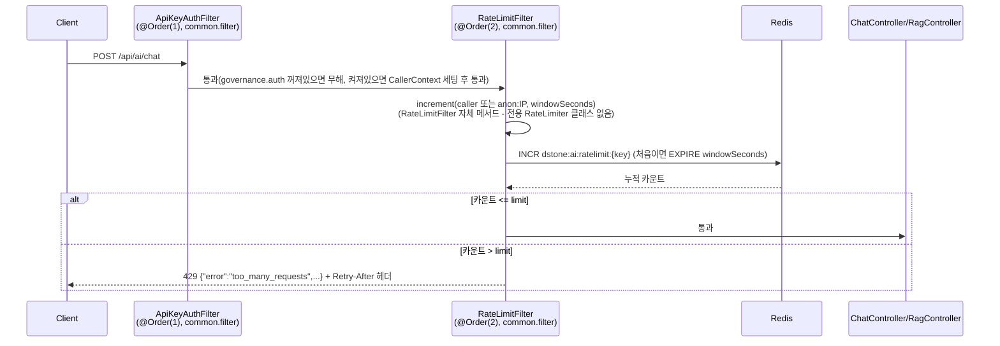

- **필터 순서가 중요하다**: `RateLimitFilter`(`@Order(2)`)는 `ApiKeyAuthFilter`(`@Order(1)`)가 먼저 실행돼 `CallerContext`를 채워둔 뒤에 돌아야 caller 단위로 키를 잡을 수 있다. `governance.auth.enabled=false`(기본값)면 `CallerContext`가 항상 비어있으므로 이때는 `anon:{클라이언트IP}`를 키로 쓴다(프록시 뒤에서 `X-Forwarded-For` 처리는 아직 안 함).
- **카운터 방식**: Redis `INCR` 기반 고정 윈도우(fixed window) — 키가 처음 만들어질 때(`count==1`)만 `EXPIRE windowSeconds`를 걸고, 그 뒤 요청은 TTL을 갱신하지 않는다. 정확한 sliding window/token bucket이 아니라서 윈도우 경계에서 순간적으로 `limit`의 최대 2배까지 허용될 수 있다는 알려진 한계가 있다 — MVP 단계에서는 구현 단순성을 택했고, 더 정교한 제어가 필요해지면 Redis Lua 스크립트 기반으로 교체할 수 있다. `increment(String, long)`는 이제 `RateLimitFilter` 자신의 메서드다(전용 `RateLimiter` 클래스는 2026-09-14에 삭제됨).
- **enabled=false(기본값)**면 이전 Phase와 동일하게 제한 없이 전부 통과한다(`dstone.ai.rag.enabled`/`dstone.ai.governance.auth.enabled`와 동일한 옵트인 철학).
- ⚠️ **enabled=true인데 Redis가 꺼져 있으면**(`spring.data.redis.enabled=false`) **기동이 아니라 첫 요청 처리 시점**에 `RateLimitFilter.doFilterInternal()`이 명확한 메시지로 `IllegalStateException`을 던진다. 예전에는 전용 `RateLimitProperties`가 `@PostConstruct`(기동 시점)에 이 조합을 검증했지만, 그 클래스가 삭제되면서 나머지 설정값(`window-seconds`/`default-limit`/`overrides`) 검증과 함께 요청 시점 검증으로 바뀌었다 — 6.1절(RAG)에서 이미 나온 "기동 시점 fail-fast 제거" 패턴과 같은 방향이다. 배포 전에 스모크 테스트로 확인하는 걸 권장한다.
- `dstone.ai.governance.ratelimit.overrides`도 `governance.auth.keys`와 동일한 이유(리스트-오브-오브젝트)로 스칼라 조회로는 못 읽는다 — `RateLimitFilter`가 매 요청마다 `ConfigProperty.getListProperty(...)`로 caller별 한도를 직접 읽어온다(전용 `RateLimitProperties`/`RateLimitOverride` 클래스는 삭제됨). 지정 안 된 caller는 `default-limit`을 쓴다.
- 401로 거부된 요청(`ApiKeyAuthFilter`에서 막힘)은 `RateLimitFilter`까지 도달하지 않으므로 카운터를 소비하지 않는다 — 잘못된 키로 두들겨도 정상 caller의 한도에 영향을 주지 않는다.
- `/actuator/**`는 `ApiKeyAuthFilter`와 동일하게 인증·제한 모두 우회한다(k8s probe 보호).

```bash
# enabled=true, window-seconds=10, default-limit=3 이라고 가정 (governance.auth는 꺼둔 상태 예시)
for i in 1 2 3 4; do
  curl -s -o /dev/null -w "%{http_code}\n" -X POST http://localhost:8081/api/ai/chat \
    -H "Content-Type: application/json" -d '{"message": "안녕"}'
done
# → 200, 200, 200, 429

# 한도 초과 시 응답
# HTTP/1.1 429
# Retry-After: 10
# {"error":"too_many_requests","message":"요청 한도(3회/10초)를 초과했습니다."}
```

✅ 실동작 검증됨(2026-09-10, WSL 환경) — `conf/application.yml`에 `ratelimit.enabled: true`(window-seconds=10, default-limit=3)를 임시로 넣고 기동해 확인했다(검증 후 설정은 원상복구):
> - `governance.auth` 없이 단독 사용: 같은 IP로 4번째 요청부터 `429`, `Retry-After: 10` 헤더 확인, 10초 대기 후 재요청 시 `200`으로 정상 복구
> - `governance.auth`와 함께 사용(`caller-a`는 `default-limit=3`, `caller-b`는 `overrides`로 `limit=1`): 두 caller의 카운터가 `dstone:ai:ratelimit:caller-a`/`dstone:ai:ratelimit:caller-b`로 독립적으로 관리되고, 각자 설정된 한도에서 정확히 `429`로 전환됨을 확인
> - 인증 실패(401) 요청은 Redis 카운터를 전혀 소비하지 않음을 확인(`ApiKeyAuthFilter`가 먼저 막아 `RateLimitFilter`에 도달하지 않음)

### 8.4 Guardrail — PII(개인식별정보) 탐지/마스킹

`governance.auth`/`governance.ratelimit`이 Servlet `Filter`였던 것과 달리, `governance.guardrail`은 `ChatClient`의 `CallAdvisor`로 구현했다 — PII는 "요청을 통과시킬지 말지"가 아니라 "LLM에 보낼 프롬프트 내용 자체"를 다뤄야 해서, HTTP 레이어보다 Spring AI의 Advisor 체인이 자연스러운 지점이다.

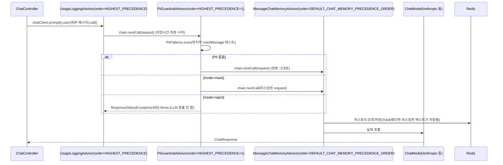

- **왜 ChatMemory보다 먼저(order가 더 작음) 실행돼야 하는가**: mask 모드에서 마스킹된 텍스트가 Redis 대화 히스토리에도 반영되게 하려면, `MessageChatMemoryAdvisor`(order=`Advisor.DEFAULT_CHAT_MEMORY_PRECEDENCE_ORDER`)가 프롬프트를 보기 전에 이미 마스킹이 끝나 있어야 한다. `PiiGuardrailAdvisor.getOrder()`를 `Ordered.HIGHEST_PRECEDENCE + 1`로 잡아 이를 보장한다.
- **패턴은 정규식 기반, 설정 불가(고정)** — 주민등록번호(`\d{6}-\d{7}`), 전화번호(`01[016789]-?\d{3,4}-?\d{4}`), 이메일, 카드번호(4자리×4). SI 프로젝트별 커스텀 패턴이 필요해지면 `PiiPatterns`를 설정 기반으로 확장해야 한다. 오탐(false positive)/누락(false negative) 둘 다 있을 수 있는 MVP 수준이다 — `PiiPatterns` 클래스 주석 참고.
- **mode=mask(기본값)**: 매칭된 부분만 `[REDACTED_주민등록번호]` 같은 placeholder로 치환해서 LLM에 보낸다 — 요청 자체는 정상 처리된다.
- **mode=reject**: PII가 하나라도 매칭되면 LLM을 호출하지 않고 `400`을 즉시 반환한다(지연시간이 거의 0에 가깝다 — 네트워크 호출이 아예 없기 때문).
- `dstone.ai.governance.guardrail.pii.enabled`(기본 `false`)를 켜야만 실제로 검사한다 — 다른 governance 기능들과 동일한 옵트인 철학.

```bash
# mode=mask 예시 - 응답은 정상이지만 LLM에는 마스킹된 텍스트만 전달된다
curl -X POST http://localhost:8081/api/ai/chat -H "Content-Type: application/json" \
  -d '{"message": "제 이메일은 test@example.com 입니다"}'

# mode=reject 예시
curl -i -X POST http://localhost:8081/api/ai/chat -H "Content-Type: application/json" \
  -d '{"message": "제 이메일은 test@example.com 입니다"}'
# → 400 (PiiGuardrailAdvisor가 ResponseStatusException을 던짐)
```

✅ 실동작 검증됨(2026-09-10, WSL 환경) — `conf/application.yml`에 `guardrail.pii.enabled: true`를 임시로 넣고 기동해 확인했다(검증 후 설정은 원상복구):
> - mode=mask: 주민등록번호/전화번호/이메일/카드번호가 섞인 메시지를 보낸 뒤 Redis 대화 히스토리(`dstone:ai:session:{id}`)를 직접 조회해, 저장된 텍스트가 원본이 아니라 `[REDACTED_주민등록번호]` 등으로 치환된 상태임을 확인 — LLM에도 마스킹된 텍스트만 전달됐다는 뜻이다(Claude 자신이 PII를 반복 거부하는 것과는 별개로, 애초에 원본을 받지 않았다는 게 이 확인의 핵심)
> - mode=reject: PII가 포함된 메시지가 `400`으로 즉시 거부되고(지연시간 5ms 수준, 실제 LLM 미호출), PII 없는 일반 메시지는 그대로 `200` 통과
> - 로그에 `PII 탐지(MASK)`/`PII 탐지(REJECT)` 라인과 탐지된 종류가 정확히 남는 것을 확인

### 8.5 Observability — 사용량/비용/지연시간 로깅

`observability.usage`는 `ChatClient`의 `CallAdvisor` 체인에서 **가장 바깥쪽**(`Ordered.HIGHEST_PRECEDENCE`)에 자리한다 — PII 마스킹, ChatMemory 조회/저장, 실제 LLM 호출까지 전체를 감싸야 "이 요청 전체"의 지연시간을 정확히 잴 수 있고, `guardrail`이 `REJECT`로 예외를 던지는 경우도 실패 케이스로 놓치지 않고 로깅할 수 있기 때문이다(8.4절 시퀀스 다이어그램의 `Usage` 참고).

- **로깅 항목**: `sessionId`, `caller`(governance.auth가 꺼져 있으면 `-`), `status`(OK/FAILED), `responseId`(LLM provider가 응답한 메시지 ID — 트레이싱용 상관관계 키), `model`, `promptTokens`/`completionTokens`/`totalTokens`, `estimatedCostUsd`, `latencyMs`. 별도 DB 테이블이나 대시보드 없이 로그 한 줄로 MVP 수준의 관측성을 확보한다.
- **비용 추정**: `dstone.ai.observability.usage.pricing`에 `model`별 1K 토큰당 단가(USD)를 등록하면 계산되고, 등록 안 된 model은 에러가 아니라 `estimatedCostUsd=unknown`으로 로깅된다 — 가격표는 provider가 수시로 바꾸는 값이라 이 모듈이 강제하지 않는다. `model` 값은 실제로 응답한 문자열(예: `claude-haiku-4-5-20251001`)과 정확히 일치해야 매칭된다.
- **"비용 트래킹"(governance 쪽 남은 항목)을 여기서 갈음한 이유**: caller별 비용을 집계/제한하는 별도 기능(예산 초과 시 차단)을 `governance`에 추가로 만들 수도 있었지만, 그러려면 Redis에 caller별 누적 비용을 저장하고 기간별로 리셋하는 등 `governance.ratelimit`과 유사한 인프라가 또 필요해진다. 지금 단계에서는 "caller별 비용이 로그로 보이는 것"만으로 충분하다고 판단해 `observability.usage`로 통합했다 — 실제로 예산 강제(budget enforcement)가 필요해지면 그때 `governance`에 별도 기능으로 추가한다.
- `dstone.ai.observability.usage.enabled`(기본 `true`) — 순수 로깅이라 외부 인프라 의존이나 부작용이 없어서, 다른 Phase 4 기능(옵트인, 기본 `false`)과 달리 기본으로 켜져 있다.
- 실패(예: guardrail의 REJECT, LLM 호출 자체의 예외)도 `status=FAILED`로 별도 로깅하고 원래 예외를 그대로 다시 던진다(로깅 때문에 에러 응답이 바뀌지 않는다).

```
[USAGE] sessionId=eae3d902-... caller=- status=OK responseId=msg_011Cetw4... model=claude-haiku-4-5-20251001 promptTokens=9 completionTokens=4 totalTokens=13 estimatedCostUsd=0.000087 latencyMs=2354
[USAGE] sessionId=ed7bdda7-... caller=- status=FAILED latencyMs=5 error=400 BAD_REQUEST "입력에 민감정보(PII)가 포함되어 있어 요청을 거부했습니다: [이메일]"
```

✅ 실동작 검증됨(2026-09-10, WSL 환경) — 위 두 로그 라인이 실제 기동 중 발생한 요청에서 그대로 캡처된 것이다:
> - 정상 호출: `pricing`에 `claude-haiku-4-5-20251001`(input 0.003/output 0.015 per 1K, 예시 단가)을 등록한 뒤 `promptTokens=9, completionTokens=4`인 응답에서 `estimatedCostUsd=0.000087`로 정확히 계산됨((9×0.003+4×0.015)/1000)을 확인
> - `pricing` 미등록 상태에서는 `estimatedCostUsd=unknown`으로 로깅되고 기동/호출이 실패하지 않음을 확인
> - guardrail이 REJECT로 예외를 던진 요청이 `status=FAILED`로, 지연시간 5ms 수준(LLM 미호출)으로 정확히 로깅됨을 확인

### 8.6 Tenant Context (Phase 5) — caller(=tenant_id) 격리

`dstone-boot` 같은 여러 SI 프로젝트가 이 엔진 하나를 공유하게 되면, 한 앱 전용으로 만든 capability/Tool을 다른 앱이 잘못(또는 악의적으로) 호출하거나, 한 앱이 올린 RAG 문서를 다른 앱이 검색해버리는 문제가 생길 수 있다. 이걸 막는 "테넌트 식별자"가 새로 필요한 게 아니라 — `ApiKeyAuthFilter`가 API Key로 이미 식별해 `CallerContext`에 담아두는 `caller` 값이 그 역할을 그대로 한다(8.2절). Phase 5는 새 `tenant` 패키지를 만드는 대신, 이 `caller` 값을 격리가 필요한 지점 3곳에서 강제하는 코드를 기존 패키지(`capability`/`common.config`/`api.service`)에 추가했다.

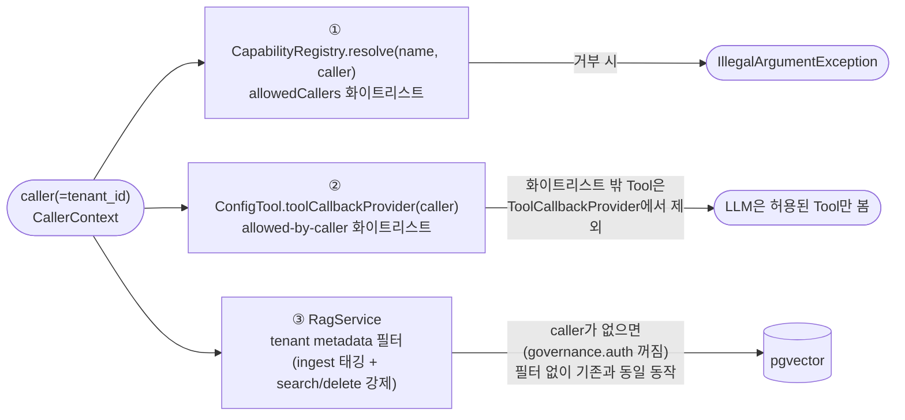

1. **Capability 화이트리스트** — `CapabilityDefinition.allowedCallers`(비어있으면 전체 허용)를 `dstone.ai.capability.definitions`에 caller 목록으로 지정하면, 목록에 없는 caller가 그 capability 이름으로 요청할 때 `CapabilityRegistry.resolve(name, caller)`가 그 자리에서 거부한다(등록 안 된 capability 이름과 동일하게 처리됨 — 7.7절).
2. **Tool 화이트리스트** — `dstone.ai.governance.tool.allowed-by-caller`(caller/tools 쌍의 List, `governance.auth.keys`와 동일한 컨벤션)에 caller가 등록돼 있으면, `ConfigTool.toolCallbackProvider(caller)`가 그 caller에게 허용된 이름의 Tool만 골라낸 `ToolCallbackProvider`를 돌려준다. 설정에 없는 caller는 이 기능이 생기기 전과 동일하게 등록된 Tool 전체를 그대로 쓴다(하위 호환).
3. **RAG tenant 격리** — `RagService.ingest()`가 청크마다 `sourceId`와 나란히 `tenant`(=caller) metadata를 태깅하고, `search()`/`getRagSpecAdvisor()`/`deleteBySourceId()`가 항상 `tenant == caller` 필터를 강제한다(caller가 있을 때만 — 없으면 필터 없이 기존과 동일). 다른 tenant가 업로드한 문서는 검색에도, RAG-증강 채팅에도, 심지어 같은 이름의 `sourceId`로 삭제를 시도해도 걸리지 않는다.

> ⚠️ **논리 격리(메타데이터 필터)이지 물리 격리(스키마/컬렉션 분리)가 아니다.** pgvector는 지금도 단일 `DataSource`/단일 테이블을 모든 tenant가 공유하고, `tenant` 컬럼 값으로만 구분한다. 실제 컴플라이언스 요건상 물리적으로 분리된 스키마/DB가 필요해지면 `RagService`에 tenant별 `DataSource`/스키마 선택 로직을 추가하는 방향으로 확장할 수 있다 — 지금은 그 요건이 확인된 바 없어 범위 밖으로 뒀다.
>
> `caller`가 없는 경우(즉 `dstone.ai.governance.auth.enabled=false`인 단일-소비자 배포)는 세 지점 모두 격리 로직이 개입하지 않고 Phase 4 이전과 완전히 동일하게 동작한다 — 이 기능을 안 쓰는 배포는 이 변경으로 전혀 영향받지 않는다.

✅ **Capability/Tool 화이트리스트 실동작 검증됨(2026-09-14, WSL 환경)** — `governance.auth.enabled: true`로 켜고 caller 3개(si-a/si-b/si-c)를 임시로 등록한 뒤 실제 Anthropic 호출로 확인했다(검증 후 설정은 원상복구):

```bash
# capability 화이트리스트: si-a/si-c만 허용
dstone.ai.capability.definitions:
  - name: oracle-to-postgresql
    prompt-name: oracle-to-postgresql
    tools-enabled: true
    allowed-callers: [si-a, si-c]

curl -X POST http://localhost:8081/api/ai/chat -H "X-API-Key: <si-b 키>" \
  -H "Content-Type: application/json" -d '{"message":"SELECT 1 FROM DUAL", "capability":"oracle-to-postgresql"}'
# → 500(핸들러 미등록이라 상세 메시지는 응답에 안 실림) - 서버 로그: IllegalArgumentException:
#   capability[oracle-to-postgresql]는 caller[si-b]에게 허용되지 않았습니다. (si-a/si-c는 정상 응답)
```

> - **Tool 화이트리스트**: `dstone.ai.governance.tool.allowed-by-caller`에 `caller: si-c, tools: []`을 등록한 뒤 si-c로 `toolsEnabled:true` 채팅을 호출 — 서버 로그에 `validateSqlSyntax INPUT(...)`이 단 한 번도 찍히지 않아 Tool 자체가 안 붙었음을 확인했고, 같은 요청을 화이트리스트가 없는 si-a로 보내자 정상적으로 Tool이 호출됨을 확인했다(같은 SQL, 같은 capability, caller만 다름).
> - ⚠️ **검증 중 실제로 발견하고 고친 버그 2건**(둘 다 Phase 5 자체 로직이 아니라 그 아래 인프라 버그였다): ① `dstone-common`의 `ConfigProperty.getListProperty()`가 `Bindable.listOf(Object.class)`를 써서 `governance.auth.keys`처럼 값이 실제로 채워진 리스트-오브-맵을 로딩하는 순간 기동 자체가 `UnboundConfigurationPropertiesException`으로 실패했다 — `Map.class`로 바꿔 해결(자세한 내용은 [05.dstone-common.md](05.dstone-common.md) 참고). ② `capability.CapabilityRegistry.load()`가 모든 capability에 `promptName` 필수를 강제하고 있어서, Phase 6의 `processName`만 있는 capability(예: Process 전용)를 등록하면 기동이 실패했다 — `promptName`/`processName` 중 하나만 있으면 되도록 완화. 둘 다 컴파일은 정상이었고 값이 실제로 채워진 설정으로 기동해봐야만 드러나는 종류였다.

⚠️ **RAG tenant 격리 — SQL 생성 로직은 검증됨, end-to-end 히트 검증은 별개 버그로 막힘.** si-a로 문서를 올린 뒤 si-a/si-b로 각각 검색했을 때 실제 실행된 SQL의 `WHERE` 절이 각각 `metadata::jsonb @@ '$."tenant" == "si-a"'`/`'$."tenant" == "si-b"'`로 caller별로 정확히 다르게 파라미터화되는 것은 로그로 직접 확인했다 — 즉 `buildFilter()`가 caller를 SQL에 올바르게 반영하는 것 자체는 맞다. 하지만 실제로 결과가 있는 채로 "si-a는 히트, si-b는 빈 배열"까지 눈으로 확인하지는 못했다 — **새로 적재한 문서가 tenant 필터 유무·caller와 무관하게 어떤 검색으로도 전혀 나오지 않는(사전에 있던 문서만 검색됨) 별개의 사전 존재 버그**를 이번에 발견했기 때문이다(13절 문제 해결 표에 추가). 이 버그는 Phase 2(RAG)에 속하고 Phase 5(tenant)와는 독립적이라 이번 범위에서 고치지 않았다 — Phase 5의 필터 자체는 SQL 레벨에서 옳다는 것까지만 확정할 수 있다.

---

## 9. API 레퍼런스

> 💡 아래 요청들을 curl 없이 바로 눌러보고 싶다면 [Postman 컬렉션](data/dstone-ai-engine-postman-collection.json)을 import한다 — 일반 채팅/RAG-증강/Tool 사용 채팅과 RAG 문서 업로드/삭제/검색까지 전부 준비돼 있다.
>
> 🔒 `dstone.ai.governance.auth.enabled=true`(8.2절)면 아래 `/api/ai/**` 요청 전부(문서 업로드/삭제/검색 포함)에 `X-API-Key`(기본 헤더명) 헤더가 필요하고, `dstone.ai.governance.ratelimit.enabled=true`(8.3절)면 같은 요청들에 caller(또는 IP)별 호출 횟수 제한이 걸린다 — 아래 curl 예시들은 둘 다 꺼진(기본값) 상태 기준이다. `dstone.ai.governance.guardrail.pii.enabled=true`(8.4절)면 `POST /api/ai/chat`의 메시지에서 PII가 마스킹되거나(mode=mask) 거부(mode=reject)될 수 있다. `dstone.ai.observability.usage.enabled`(8.5절, 기본 `true`)는 응답 내용에는 영향이 없고 서버 로그에만 남는다. `X-API-Key`로 식별된 caller는 곧 tenant_id이기도 해서(8.6절), capability 화이트리스트/Tool 화이트리스트/RAG 검색 범위가 caller별로 달라질 수 있다 — 아래 문서 적재/검색 API도 caller(=tenant) 경계 밖의 문서는 다루지 못한다.

### `POST /api/ai/chat` — 채팅 (일반 / RAG-증강 / Tool 사용)

<details>
<summary>요청/응답 예시 펼쳐보기</summary>

```bash
# 일반 채팅 (Phase 0/1)
curl -X POST http://localhost:8081/api/ai/chat \
  -H "Content-Type: application/json" \
  -d '{
        "message": "안녕, 짧게 인사만 해줘.",
        "sessionId": null,
        "promptName": null,
        "variables": null,
        "ragEnabled": false,
        "toolsEnabled": false
      }'
# → {"message":"안녕하세요! 😊","provider":"anthropic","sessionId":"3fde76a9-..."}
```

```bash
# RAG-증강 채팅 (Phase 2, dstone.ai.rag.enabled=true 필요)
curl -X POST http://localhost:8081/api/ai/chat \
  -H "Content-Type: application/json" \
  -d '{"message": "우리 RAG 파이프라인에서 임베딩 모델로 뭘 쓰는지 알려줘.", "ragEnabled": true}'
# → Claude가 pgvector에 저장된 관련 문서 조각을 인용해서 답변
```

```bash
# Tool 사용 채팅 (Phase 3)
curl -X POST http://localhost:8081/api/ai/chat \
  -H "Content-Type: application/json" \
  -d '{"message": "지금 정확한 날짜와 시간이 몇 시야?", "toolsEnabled": true}'
# → getCurrentDateTime Tool을 호출해서 실제 시스템 시간으로 답변
```
</details>

| 필드 | 타입 | 설명 |
|---|---|---|
| `message` | String | 사용자 메시지 (필수, 비어있으면 `400 Bad Request`) |
| `sessionId` | String | 비워두면 서버가 새로 발급 (응답의 `sessionId`로 이어서 사용) |
| `promptName` | String | 지정 시 `PromptTemplateRegistry`가 렌더링해 시스템 프롬프트로 사용 |
| `variables` | Map | `promptName` 템플릿 렌더링용 변수 |
| `ragEnabled` | Boolean | `true`면 `QuestionAnswerAdvisor`로 검색 결과 자동 삽입 (RAG 꺼져 있으면 `IllegalStateException`) |
| `toolsEnabled` | Boolean | `true`면 `ConfigTool`에 등록된 모든 Tool을 ChatClient에 연결(Phase 3) — RAG와 달리 항상 사용 가능. 실제 호출 여부는 LLM 판단(`tool_choice=auto`) |
| `requiredTool` | String | ⚠️ **미구현(7.6절)** — 필드는 받지만 `ChatService`가 읽지 않아 값을 보내도 무시된다 |
| `provider` | String | ⚠️ **미구현(7.6절)** — 필드는 받지만 항상 `spring.ai.model.chat` 전역 설정으로만 라우팅된다 |
| `ollamaModel` | String | ⚠️ **미구현(7.6절)** — 필드는 받지만 어디서도 참조되지 않는다 |
| `capability` | String | 지정 시 `CapabilityRegistry`에 등록된 이름으로 `promptName`/`toolsEnabled`/`ragEnabled` 기본값을 채운다(7.7절). 위 세 필드를 요청에 직접 넣으면 그 값이 항상 우선한다. 등록 안 된 이름이거나, `allowedCallers` 화이트리스트에 caller가 없으면 에러(8.6절) |

### `POST /api/ai/rag/documents` — 문서 적재 (Phase 2, RAG 활성 시)

```bash
curl -X POST http://localhost:8081/api/ai/rag/documents \
  -F "file=@spec.pdf" -F "sourceId=spec-v1"
# → {"sourceId":"spec-v1","chunkCount":12}
```

### `DELETE /api/ai/rag/documents/{sourceId}` — 문서 삭제

```bash
curl -X DELETE http://localhost:8081/api/ai/rag/documents/spec-v1
```

### `POST /api/ai/rag/search` — 단독 유사도 검색 (디버깅/검증용)

```bash
curl -X POST http://localhost:8081/api/ai/rag/search \
  -H "Content-Type: application/json" \
  -d '{"query": "환불 정책이 어떻게 되나요?", "topK": 3, "similarityThreshold": null, "sourceId": null}'
```

| 필드 | 타입 | 설명 |
|---|---|---|
| `query` | String | 검색 질의 (필수) |
| `topK` | Integer | 비우면 `dstone.ai.rag.retrieval.top-k` 기본값 |
| `similarityThreshold` | Double | 비우면 `dstone.ai.rag.retrieval.similarity-threshold` 기본값 |
| `sourceId` | String | 지정 시 그 문서로 적재된 청크로만 검색 범위 제한 |

응답: `[{"text": "...", "metadata": {...}, "score": 0.48}, ...]`

### `POST /api/ai/process/submit` + `GET /api/ai/process/status/{jobId}` — 비동기 실행 (Phase 10, 19절)

요청 계약은 `POST /api/ai/chat`과 완전히 동일한 `ChatRequest`다 — capability가 단일 호출인지 Process 기반인지는 신경 쓰지 않아도 된다.

```bash
curl -X POST http://localhost:8081/api/ai/process/submit -H "X-API-Key: <caller 키>" \
  -H "Content-Type: application/json" -d '{"message": "...", "capability": "oracle-to-postgresql-team"}'
# → {"jobId": "2960cc03-..."}

curl http://localhost:8081/api/ai/process/status/2960cc03-... -H "X-API-Key: <caller 키>"
# → {"jobId": "...", "status": "DONE", "result": "...", "error": null}
# status는 RUNNING/DONE/FAILED 중 하나 - DONE이면 result, FAILED면 error가 채워진다
```

존재하지 않거나 만료된(1시간 TTL) jobId를 조회하면 `IllegalArgumentException`(다른 미처리 예외와 동일하게 500)으로 알려준다.

---

## 10. 설정 레퍼런스 (`conf/application.yml`)

<details>
<summary>전체 설정 트리 펼쳐보기 (실제 값은 예시로 마스킹)</summary>

```yaml
spring:
  http:
    clients:
      read-timeout: 5m                              # spring.ai.model.chat=ollama일 때 필수급 - 13절 troubleshooting 참고
  data:
    redis:
      enabled: true
      host: ${REDIS_HOST}
      port: ${REDIS_PORT}
  datasource:                                    # RAG(Phase 2) 전용, pgvector가 사용
    driver-class-name: net.sf.log4jdbc.sql.jdbcapi.DriverSpy
    url: jdbc:log4jdbc:postgresql://${DB_HOST}:${DB_PORT}/dstone_ai
    username: dstone_ai
    password: ENC(...)
  servlet:
    multipart:
      max-file-size: 20MB                        # 문서 업로드 대비 상향
      max-request-size: 20MB
  ai:
    model:
      chat: anthropic                            # anthropic | openai | ollama
      embedding: ollama                          # openai | ollama (RAG용, anthropic 불가)
    anthropic:
      api-key: ENC(...)
    ollama:
      base-url: http://localhost:11434
      embedding:
        model: bge-m3
    vectorstore:
      pgvector:
        initialize-schema: true
        dimensions: 1024                         # 임베딩 모델 출력 차원과 반드시 일치

dstone:
  ai:
    session:
      max-messages: 20
      ttl-seconds: 86400
    prompt:
      default-version: v1
    capability:                                   # 7.7절 - "자주 쓰는 설정 조합에 이름 붙이기"
      definitions:
        - name: oracle-to-postgresql
          prompt-name: oracle-to-postgresql
          tools-enabled: true
          rag-enabled: false
          allowed-callers: [sample-si-project]     # 8.6절 - 비우면(생략) 전체 caller 허용
        - name: oracle-to-postgresql-team           # Phase 6/7 - processName이 있으면 promptName/toolsEnabled/ragEnabled는 안 쓰임
          process-name: oracle-to-postgresql-team
    agent:                                          # 🆕 Phase 7 - Process의 AGENT/SUPERVISOR step이 ref로 찾는 대상(16절)
      definitions:
        - name: oracle-sql-converter
          prompt-name: oracle-sql-converter
          tools-enabled: false
          rag-enabled: false
    process:                                        # 🆕 Phase 6 - 순차/분기/병렬/루프 4패턴(15절), 전체 예시는 16.2절 참고
      definitions:
        - name: oracle-to-postgresql-team
          max-iterations: 6
          steps:
            - id: convert
              type: AGENT
              ref: oracle-sql-converter              # Phase 7부터는 promptName이 아니라 agent.definitions의 이름
            - id: validate
              type: TOOL
              ref: validateSqlSyntax
              input-template: '{"sql": "{previous}"}'
              on-success: review
              on-failure: convert                    # 검증 실패 시 되돌아감(루프)
            - id: review
              type: AGENT
              ref: oracle-sql-reviewer
    tool:                                            # 🆕 Phase 8 - Shell/Python/HTTP Tool 런타임(governance.tool의 caller
                                                       # 화이트리스트와는 다른 설정이다 - 아래 참고), 전부 기본 false(17절)
      shell:
        enabled: false
        timeout-seconds: 10                          # 생략 시 기본값
        max-output-chars: 4000                       # 생략 시 기본값
        allowed-commands:
          - name: sample-script                      # LLM에게 노출되는 이름(실제 파일명과 다를 수 있음)
            path: /opt/dstone/scripts/sample-script.sh
      python:
        enabled: false
        allowed-scripts:
          - name: sample-script
            path: /opt/dstone/scripts/sample-script.py
        # python-bin: python3                        # 생략 시 기본값
      http:
        enabled: false
        allowed-hosts: [api.internal.example.com]     # 호스트 정확히 일치만 허용(SSRF 방지)
    rag:
      enabled: true                              # false면 RagService/RagController가 호출될 때 IllegalStateException(빈 자체는 항상 존재, 6.2절)
      ingest:
        chunk-size: 800
      retrieval:
        top-k: 5
        similarity-threshold: 0.35
    governance:
      auth:
        enabled: false                           # true면 X-API-Key 헤더 필수(8.2절)
        header-name: X-API-Key                   # 생략 시 기본값
        keys:
          - key: ENC(...)
            caller: sample-si-project
      ratelimit:
        enabled: false                           # true면 caller(또는 IP)별 요청 제한(8.3절)
        window-seconds: 60                       # 생략 시 기본값
        default-limit: 60                        # 생략 시 기본값, window당 허용 요청 수
        overrides:
          - caller: sample-si-project
            limit: 200
      guardrail:
        pii:
          enabled: false                         # true면 PII 탐지(8.4절)
          mode: mask                              # mask | reject, 생략 시 기본값(mask)
        sensitiveword:                            # 🆕 Phase 9 - 사내 용어/사업 코드명 등 정규식으로 표현하기 애매한 값(18.2절)
          enabled: false
          mode: mask                              # mask | reject
          words: [프로젝트코드네임]                  # 대소문자 무시 부분일치
      tool:                                       # caller별 Tool 화이트리스트(위 최상위 tool:과는 다른 설정 - 8.6절)
        allowed-by-caller:                        # 8.6절 - 설정에 없는 caller는 등록된 Tool 전체 허용(하위호환)
          - caller: sample-si-project
            tools: [validateSqlSyntax]
      usage:
        quota:                                    # 🆕 Phase 9 - caller별 토큰 예산 강제, Redis 고정 윈도우(18.1절)
          enabled: false
          window-seconds: 86400                   # 생략 시 기본값(1일)
          default-token-limit: 1000000             # enabled=true면 필수
          overrides:
            - caller: sample-si-project
              limit: 5000000
    observability:
      usage:
        enabled: true                            # 기본값 true(순수 로깅, 옵트인 아님) - 8.5절
        pricing:
          - model: claude-sonnet-4-5-20250929     # ChatResponseMetadata.getModel() 응답값과 정확히 일치해야 함
            input-price-per-1k: 0.003
            output-price-per-1k: 0.015
```
</details>

---

## 11. 필요 인프라

| 인프라 | 용도 | 필수 여부 |
|---|---|:---:|
| Anthropic API (또는 다른 LLM provider) | Chat 모델 추론 | ✅ 항상 |
| Redis | 대화 세션 히스토리 | ✅ 항상 (Phase 1부터) |
| PostgreSQL + pgvector | RAG 벡터 저장소 | `dstone.ai.rag.enabled=true`일 때만 |
| Ollama (또는 OpenAI) | RAG 임베딩 모델 추론 | `dstone.ai.rag.enabled=true`일 때만 |

설치 방법은 각각 [software/06.redis.md](software/06.redis.md), [software/05.postgresql.md](software/05.postgresql.md), [software/14.ollama.md](software/14.ollama.md) 참고. 부가 관리 도구로 [Ollama Web UI Lite](software/15.ollama-webui-lite.md)도 함께 운용 중이다.

---

## 12. 빌드 및 실행

```bash
# dstone-common을 먼저 설치해야 함(다른 모듈과 동일)
cd dstone-common && mvn clean install

# 빌드
cd dstone-ai-engine && mvn clean package

# 로컬(WSL) 실행 - env-wsl.properties 프로파일
java -Dspring.profiles.active=wsl -jar target/dstone-ai-engine.jar
```

> ⚠️ **더 이상 기동 로그로 provider/RAG 설정을 확인할 수 없다.** 예전에는 `GatewayProperties`/`EmbeddingProperties`가 기동 시점에 `dstone-ai-engine gateway: 활성 LLM provider = ANTHROPIC` / `dstone-ai-engine rag: 활성 임베딩 provider = OLLAMA` 같은 확인 로그를 남겼지만, 두 클래스 모두 이번 재설계에서 제거됐다(5.2절/6.4절 참고). 대신 기동 후 아래처럼 실제 요청을 한 번 날려보는 스모크 테스트로 설정이 맞는지 확인하는 걸 권장한다:
>
> ```bash
> # provider(spring.ai.model.chat) 확인 - 응답의 "provider" 필드로 확인
> curl -s -X POST http://localhost:8081/api/ai/chat -H "Content-Type: application/json" \
>   -d '{"message":"ping"}'
>
> # RAG(dstone.ai.rag.enabled) 확인 - 꺼져 있으면 아래 메시지가 그대로 응답에 담겨온다
> curl -s -X POST http://localhost:8081/api/ai/chat -H "Content-Type: application/json" \
>   -d '{"message":"ping","ragEnabled":true}'
> ```

> 컨테이너 빌드/kind 배포 절차는 `dstone-boot`과 동일한 패턴을 따른다 — [03.build.md 6절](03.build.md#6-dstone-boot--dstone-ai-engine--컨테이너-빌드--kind-배포) 참고.

---

## 13. 문제 해결 (실제로 겪은 에러 모음)

Phase 2를 실제로 붙이고 e2e 테스트하는 과정에서 겪은 진짜 에러들이다 — 같은 삽질을 반복하지 않도록 원인/조치를 남긴다.

| 증상 | 원인 | 조치 |
|---|---|---|
| 문서 적재 시 `NoClassDefFoundError: ChecksumInputStream`(과거) | 당시 `dstone-common`이 직접 고정했던 `commons-io 2.15.1`이 Maven "nearest wins"로 이겨서, `spring-ai-tika-document-reader`(→ commons-compress 1.28.0)가 필요로 하는 `commons-io 2.16.0+`의 클래스가 없었음 | `dstone-ai-engine/pom.xml`의 `dependencyManagement`에서 이 모듈만 `commons-io 2.20.0`으로 상향해 해결(⚠️ `dstone-common` 자체도 이후 `2.20.0`으로 올라가서 - [05.dstone-common.md 2절](05.dstone-common.md#2-기술-스택) - 지금은 이 override가 없어도 재현되지 않지만, 굳이 지울 필요는 없다) |
| 검색 결과가 데이터 있는데도 항상 `[]` | `similarity-threshold` 기본값 0.5가 `bge-m3` 실측 유사도(0.48 등)보다 높음 | 기본값을 0.35로 하향(6.4절 참고) — 임베딩 모델/도메인별 재조정 필요 |
| `ERROR: extension "vector" is not available` | `postgresql`/`postgresql-18` 패키지만으로는 pgvector 확장이 없음 | `sudo apt-get install -y postgresql-18-pgvector` 후 `CREATE EXTENSION` 재시도 — 상세: [software/05.postgresql.md 7절](software/05.postgresql.md#7-문제-해결-phase-2-설치-중-실제로-겪은-에러) |
| Ollama Web UI Lite에서 채팅 시 `Uh-oh! There was an issue connecting to Ollama.` | ① Ollama가 IPv4 루프백에만 바인딩되어 브라우저의 IPv6(`::1`) 시도가 거부됨, ② 채팅 가능한 모델이 없이 임베딩 전용 `bge-m3`만 설치돼 있었음(둘 다 웹UI 자체 버그로 동일한 문구로만 표시됨) | ① `OLLAMA_HOST=[::]:11434`(dual-stack)로 바인딩 확장 ② 채팅용 모델(`llama3.2`) 별도 pull — 상세: [software/14.ollama.md 7절](software/14.ollama.md#7-문제-해결-ollama-web-ui-lite-연동-중-실제로-겪은-에러), [software/15.ollama-webui-lite.md 8절](software/15.ollama-webui-lite.md#8-문제-해결-실제로-겪은-에러) |
| `spring.ai.model.chat=ollama` 상태에서 `capability=oracle-to-postgresql`처럼 긴 프롬프트+Tool 호출 요청 시 `ResourceAccessException: ... Read timed out`(`OllamaChatModel`/`OllamaApi.chat` 스택) | `OllamaApiAutoConfiguration`이 앱 전역 `RestClient.Builder`를 그대로 쓰는데, 로컬 CPU 추론이 간단한 인사말보다 훨씬 오래 걸리는 요청(긴 시스템 프롬프트 + Tool 왕복)에는 Spring Boot 4.1의 기본 HTTP read-timeout이 너무 짧음 | `spring.http.clients.read-timeout`(전역, 10절 참고)을 5분 등으로 상향 — `anthropic`/`openai`는 이 경로를 안 써서 영향 없음 |
| `capability=oracle-to-postgresql` 변환 결과가 정상 SQL이 아니라 `{"name":"validateSqlSyntax","parameters":{...}}` 같은 텍스트로 그대로 나옴(따옴표 이스케이프까지 깨진 채) | `llama3.2`가 `validateSqlSyntax` Tool을 Ollama API의 구조화된 `message.tool_calls` 필드가 아니라 일반 답변 텍스트(`message.content`) 안에 흉내만 내서 적어버림 - `ToolCallingManager`는 `tool_calls` 필드만 보므로 이걸 Tool 호출로 인식하지 못하고, 그 텍스트를 그대로 최종 답변으로 반환함(자기수정 루프 자체가 한 번도 안 돎). 작은 모델일수록 자주 발생 | `spring.ai.ollama.chat.options.model`을 Tool 호출에 더 강한 모델로 교체(`qwen2.5-coder:7b` - Ollama 라이브러리에 전 사이즈 "tools" capability 명시, Qwen 쪽에서 Tool 호출 안정성을 별도로 고친 기록도 있음). 완전히 100% 보장되는 건 아니라서, 운영 대상이면 `anthropic`이 제일 안전함 |
| `ConfigProperty.getListProperty()`로 읽는 설정(`governance.auth.keys` 등)에 값을 실제로 채우면 기동이 `UnboundConfigurationPropertiesException`으로 실패(Phase 5 실동작 검증 중 발견) | `dstone-common`의 `getListProperty()`가 리스트 원소 타입을 `Bindable.listOf(Object.class)`로 바인딩하고 있었음 - `Object`는 `caller`/`key` 같은 프로퍼티를 가진 JavaBean이 아니라서 Binder가 바인딩할 수 없었음 | 원소 타입을 `Bindable.listOf(Map.class)`로 수정 - 상세: [05.dstone-common.md](05.dstone-common.md) |
| 위 항목의 리스트-오브-맵 안에 **또 다른 리스트**가 중첩되면(예: `allowed-by-caller[].tools: []`) 그 필드만 조용히 빈 리스트가 아니라 빈 문자열(`""`)로 바인딩됨(Phase 5 Tool 화이트리스트 검증 중 발견 - 예외는 안 남) | `Map.class`(원시 타입, 제네릭 정보 없음)로 바인딩된 맵 안의 값은 타입이 `Object`라, 그 값이 빈 YAML 시퀀스(`[]`)면 Binder가 리스트로 인식할 근거가 없어 빈 문자열로 떨어짐(값이 있는 리스트는 정상적으로 `List`로 바인딩됨 - 오직 **빈** 리스트일 때만 이 문제가 생김) | 호출부(`common.config.ConfigTool.parseTools()`)에서 값이 `List`면 그대로, `String`이면 콤마 분리(빈 문자열은 빈 리스트로) 처리하도록 방어적으로 파싱 |
| RAG로 새로 적재한 문서(`/api/ai/rag/documents`)가 어떤 검색으로도(필터 유무·`similarityThreshold` 무관) 전혀 나오지 않음 - 적재 자체는 `{"sourceId":"...","chunkCount":1}`로 성공 응답하고 INSERT도 msec 단위로 정상 실행됨(Phase 5 RAG tenant 격리 검증 중 발견) | **원인 미확인 - 아직 못 고침.** 기존에 적재돼 있던 문서(`ora-to-pg-0001`, 15개 청크)는 모든 검색에서 정상적으로 나오는데, 이 세션에서 새로 적재한 문서(2건, 각 1청크)는 필터를 하나도 안 건 전체 검색(`topK=100`)에도 전혀 나타나지 않았다 - 즉 tenant/sourceId 필터 문제가 아니라 더 아래 단계(HNSW 인덱스 갱신, 커넥션/트랜잭션 가시성, 또는 pgvector 자체)의 문제로 의심된다 | ⏳ **별도 조사 필요.** 이번 범위(Phase 5/6)에서는 원인 규명을 보류했다 - RAG tenant 필터가 만드는 SQL 자체는 caller별로 정확히 다르게 파라미터화되는 것을 로그로 확인했으므로(8.6절), 격리 "로직"은 옳다는 것까지만 확정하고 넘어간다. 재현 조건: 이 WSL 환경에서 아무 문서나 새로 `/api/ai/rag/documents`로 적재한 뒤, 필터 없이 `/api/ai/rag/search`로 바로 검색해도 재현됨 |

---

## 14. Phase 로드맵 상태 (0~10 전체 완료)

`dstone-boot`를 여러 SI 프로젝트가 공유하는 AI Execution Platform으로 키우기 위해 세웠던 8-Phase 확장 계획(Tenant Context → Process → Agent → Tool 샌드박싱 → Governance 완성 → 비동기 API)이 Phase 10까지 전부 구현되고 실동작 검증됐다. 각 Phase의 설계 배경/설정 예시/curl 검증은 8.6절(Phase 5)과 15~19절(Phase 6~10)에 8.6절과 동일한 형식으로 정리돼 있다 — 이 절은 그 전체를 한 표로 요약한 인덱스다.

| Phase | 설정 키 영역 | 실제 패키지 | 상세 |
|---|---|---|---|
| 5 | `capability`/`governance.tool`/RAG metadata | `capability`/`common.config`/`api.service` | Tenant Context — 8.6절 |
| 6 | `dstone.ai.process` | `process`(신규) | Process Engine — 15절 |
| 7 | `dstone.ai.agent` | `agent`(신규) | Agent Runtime — 16절 |
| 8 | `dstone.ai.tool.{shell,python,http}` | `tools/shell`, `tools/python`, `tools/http`(신규), `common.exec`(신규) | Tool 샌드박싱 — 17절 |
| 9 | `dstone.ai.governance.usage.quota`, `dstone.ai.governance.guardrail.sensitiveword` | `governance.usage`, `governance.guardrail` | Quota/Sensitive-word — 18절 |
| 10 | (신규 `/api/ai/process/*`) | `api.controller`(신규 `ProcessController`), `api.service`(신규 `ProcessJobService`) | 비동기 API — 19절 |

남은 것 — Phase 4의 Eval(품질 평가) 결과 로깅은 여전히 예정 상태다(평가 데이터셋/채점 로직처럼 이 모듈에 없는 전제가 먼저 필요). Phase 8의 Database Tool(임의 SQL 조회)은 의도적으로 만들지 않았다 — 이 서버(`dstone_ai` DB)엔 조회할 실제 업무 테이블이 없어서 화이트리스트를 채울 대상 자체가 없고, 과거 `PostgresExplainValidationTools`를 같은 이유로 삭제한 전례(7.5절)를 그대로 따랐다. 실제 SI 프로젝트가 구체적인 대상 스키마를 가져오면 그때 추가한다.

Phase 3(`tools` 패키지)는 "단순 오케스트레이션"(Spring AI ChatClient의 내장 tool-calling 루프)까지 완료된 상태다. 여러 Tool/프롬프트를 사람이 미리 정한 순서로 묶어 실행하는 멀티스텝 워크플로우는 Phase 6 Process Engine(15절)이, 여러 역할의 Agent를 조합하는 것은 Phase 7 Agent Runtime(16절)이 담당한다.

대량/오프라인 AI 작업(재임베딩, 주기적 Eval, 세션 정리)은 엔진 자체에 스케줄러를 두지 않고 기존 `dstone-batch`(`@AutoRegJob`) 패턴에 위임할 계획이다.

> 전체 모듈 빌드 명령, 배포 방식, CI/CD 파이프라인 종합 정리는 [03.build.md](03.build.md) 참고. 클라우드 아키텍처 시뮬레이션 관점의 배포 설계는 [04.cloud-architecture.md](04.cloud-architecture.md) 참고.

---

## 15. Phase 6 — Process Engine

Phase 3(§7)의 "단순 오케스트레이션"은 *하나의* `ChatClient.call()` 안에서 LLM이 스스로 Tool을 반복 호출하는 루프였다. 반면 Oracle→PostgreSQL 같은 작업은 서로 다른 역할(Analyzer/Converter/Validator/Reviewer)의 *별도* 프롬프트 호출을 정해진 순서로, 때로는 검증 실패 시 되돌아가며 이어붙여야 한다 — 이게 Phase 6가 다루는 범위다.

### 15.1 설계 — 새 실행 엔진을 만들지 않는다

`process` 패키지는 "지금 step의 id → 다음에 실행할 step의 id"를 따라가는 단순한 상태 기계 하나(`ProcessExecutor`)뿐이다. 실제 작업은 전부 기존 컴포넌트에 위임한다 — 이 리포지토리가 RAG on/off를 게이트 하나로 통일했던 것과 같은 "새 인프라를 만들지 않는다" 판단이다.

> ⚠️ **`ChatService`↔`ProcessExecutor` 순환 참조**: `ChatService.chat()`이 `processName`이 있으면 `ProcessExecutor`로 위임하고, `ProcessExecutor`의 AGENT step은 다시 `ChatService.runAgentStep()`을 호출한다 - 진짜 상호 의존이다. Spring Boot는 기본적으로(`spring.main.allow-circular-references=false`) 이런 순환을 기동 시점에 `BeanCurrentlyInCreationException`으로 막는데(실제로 처음 기동해봤을 때 이 예외로 실패하는 걸 확인했다), 그 플래그를 전역으로 켜는 대신 `ProcessExecutor.chatService` 필드 하나에만 `@Lazy`를 붙여 프록시로 늦게 묶는 방식으로 풀었다.

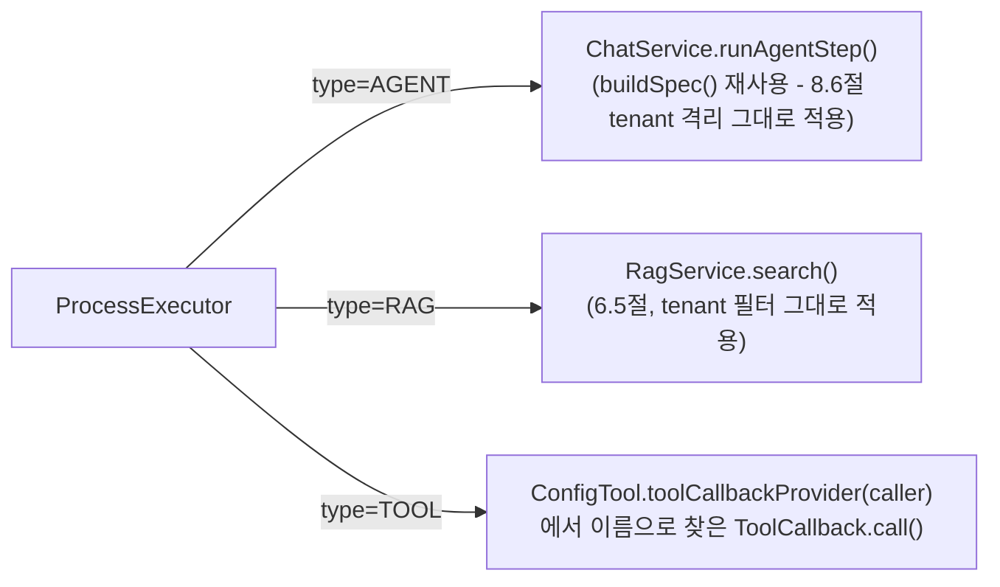

- **AGENT step** — `ChatService.runAgentStep(sessionId, caller, promptName, variables, toolsEnabled, ragEnabled, previousResult)`을 호출한다. 기존 `getSpec()`(ChatRequest+capability 기반)을 `buildSpec(sessionId, caller, promptName, variables, toolsEnabled, ragEnabled)`이라는 더 원시적인 메서드로 리팩터링해서, `ChatController`를 거치지 않고도 같은 조립 로직(system 프롬프트/RAG/Tool/caller advisor)을 재사용한다 — 8.6절의 tenant 격리(Tool 화이트리스트, RAG tenant 필터)가 Process의 AGENT step에도 그대로 적용된다는 뜻이다.
- **RAG step** — LLM을 부르지 않고 `RagService.search()`만 호출해서 찾은 청크 텍스트를 다음 step 입력으로 넘긴다(문서 5절 다이어그램의 "Analyze → RAG → Convert" 흐름).
- **TOOL step** — `ConfigTool.toolCallbackProvider(caller)`에서 이름이 일치하는 `ToolCallback`을 찾아 **LLM 없이 직접** `call(jsonInput)`한다. Oracle→PostgreSQL의 `validateSqlSyntax`처럼 결정적으로 pass/fail을 가르는 검증에 쓴다 — LLM에게 "검증해봐"라고 시키는 대신 Process가 직접 검증하고, 그 결과로 다음 step을 분기한다.
- **성공/실패 판정** — TOOL step만 판정 대상이고, `Tool`의 원본 응답 텍스트가 `"실패"`로 시작하는지로 정한다. 새 규약이 아니라 `tools.sql.SqlSyntaxTools`가 이미 쓰고 있던 `"통과: .../실패: ..."` 컨벤션을 그대로 재사용한 것이다. AGENT/RAG step은 항상 성공으로 취급된다.
- **판정과 "다음 step에 무엇을 넘길지"는 분리돼 있다** — TOOL step이 성공하면 Tool의 응답 문구("통과했습니다" 같은)가 아니라 검증받은 원본 값을 그대로 다음 step에 넘기고, 실패하면 원본 값 뒤에 Tool이 알려준 이유를 덧붙여 넘긴다(`ProcessExecutor.StepResult` 내부 레코드 참고). 처음엔 "합쳐진 텍스트 자체의 접두사"로 성공/실패까지 같이 판정했는데, 검증 실패 시 되돌아간 step(예: SQL 변환)이 "무엇을 왜 고쳐야 하는지" 알려면 실패 메시지와 원래 값을 같이 넘겨야 했고, 그러면 그 합쳐진 텍스트가 더 이상 `"실패"`로 시작하지 않아 판정이 깨지는 문제를 실제 검증 중 발견해서 지금 구조로 고쳤다.
- ⚠️ **Spring AI의 `ToolCallback.call()`은 순수 텍스트를 돌려주지 않는다** — `DefaultToolCallResultConverter`가 `String` 리턴 타입도 예외 없이 JSON으로 감싸서 돌려준다(예: `"실패: ..."`가 아니라 `"\"실패: ...\""`). LLM이 이 결과를 읽는 Phase 3 경로에서는 따옴표가 있어도 문제없어 지금까지 드러나지 않았지만, Process가 이 텍스트에 대고 직접 접두사를 검사해야 해서 `ProcessExecutor`가 Jackson으로 먼저 JSON을 벗겨낸다(`unwrapToolResult()`) — 이 역시 실제로 Tool을 여러 번 왕복시켜보다가 발견한 문제다.

### 15.2 4가지 패턴

| 패턴 | 표현 방법 |
|---|---|
| 순차 | 아무것도 지정하지 않으면 `steps` 목록 순서대로 진행(성공 시) |
| 분기 | `onSuccess`/`onFailure`에 목록상 다음이 아닌 다른 step의 id를 지정 |
| 병렬 | 인접한 여러 step에 같은 `parallelGroup` 값을 지정 — `CompletableFuture.allOf`로 동시 실행, 그룹 전체가 성공해야 성공 |
| 루프 | `onFailure`에 앞쪽 step의 id를 지정(예: 검증 실패 시 변환 step으로 복귀) — `maxIterations`(기본 5)가 전체 step 실행 횟수 상한으로 무한루프를 막는다 |

### 15.3 예시 — Oracle→PostgreSQL을 멀티스텝으로

```yaml
dstone:
  ai:
    process:
      definitions:
        - name: oracle-to-postgresql-team
          max-iterations: 6
          steps:
            - id: analyze
              type: AGENT
              ref: oracle-sql-analyzer        # prompts/oracle-sql-analyzer/v1.st
              tools-enabled: false
              rag-enabled: false
            - id: convert
              type: AGENT
              ref: oracle-sql-converter       # prompts/oracle-sql-converter/v1.st
              tools-enabled: false
              rag-enabled: false               # 변환 규칙 문서를 RAG로 참고하고 싶으면 true - 단, 지금은
                                                # 새로 적재한 문서가 검색에 전혀 안 잡히는 별개 RAG 버그가
                                                # 있어(8.6절 말미 참고) 이 조합은 실제로 검증하지 않았다
            - id: validate
              type: TOOL
              ref: validateSqlSyntax
              input-template: '{"sql": "{previous}"}'
              on-success: review
              on-failure: convert              # 검증 실패 시 변환 step으로 되돌아감(루프)
            - id: review
              type: AGENT
              ref: oracle-sql-reviewer         # prompts/oracle-sql-reviewer/v1.st
              tools-enabled: false
              rag-enabled: false

    capability:
      definitions:
        - name: oracle-to-postgresql
          prompt-name: oracle-to-postgresql   # processName이 있으면 promptName/toolsEnabled/ragEnabled는 쓰이지 않는다
          process-name: oracle-to-postgresql-team
          allowed-callers: [sample-si-project]
```

`POST /api/ai/chat`의 요청 계약은 그대로다 — `capability: "oracle-to-postgresql"`만 보내면 `ChatService.chat()`이 `processName`이 있는 걸 보고 자동으로 `ProcessExecutor.run()`으로 라우팅한다. 응답은 `review` step(마지막으로 실행된 step)의 결과 텍스트다.

✅ **실동작 검증됨(2026-09-14, WSL 환경, 실제 Anthropic 호출)** — 위 설정 그대로(다만 `rag-enabled: false`) `capability: "oracle-to-postgresql-team"`으로 아래 오라클 SQL을 보냈다:

```bash
curl -X POST http://localhost:8081/api/ai/chat -H "X-API-Key: <si-a 키>" -H "Content-Type: application/json" \
  -d '{"message":"SELECT e.ename, NVL(e.comm,0) comm, d.dname FROM emp e, dept d WHERE e.deptno = d.deptno(+) AND ROWNUM <= 10", "capability":"oracle-to-postgresql-team"}'
```

응답(마지막 `review` step의 결과):

```json
{"message":"[변환된 SQL]\nSELECT e.ename, COALESCE(e.comm,0) comm, d.dname FROM emp e LEFT OUTER JOIN dept d ON e.deptno = d.deptno LIMIT 10\n\n[검토 의견]\n추가 확인 필요 없음", "provider":"anthropic", ...}
```

> - `NVL(e.comm,0)` → `COALESCE(e.comm,0)`, 오라클 `(+)` → `LEFT OUTER JOIN`, `ROWNUM <= 10` → `LIMIT 10` 모두 정확히 변환됨을 확인 — `oracle-sql-converter` 프롬프트(변환 규칙 21개)가 제대로 적용됐다는 뜻이다.
> - 서버 로그로 `analyze`(Claude 호출 1회) → `convert`(Claude 호출 1회) → `validate`(TOOL, `validateSqlSyntax` 1회, LLM 비용 없음, **첫 시도에 통과** — 루프 안 돎) → `review`(Claude 호출 1회) 순서를 정확히 확인했다 — 이번 실행에서는 총 3회의 실제 Anthropic 호출로 끝났다.
> - **루프(검증 실패 → convert로 복귀)와 `max-iterations` 초과 시 `IllegalStateException`은 LLM 비용이 안 드는 별도의 순수 TOOL-step 전용 테스트 Process**(`loop-test`: 항상 깨진 SQL만 검증하고 자기 자신으로 무한 루프 → `max-iterations`(3) 초과 시 정확히 예외 발생, `branch-test`: 실패 시 다른 step으로 분기 후 그 step에서 통과)로 확인했다 — 실제 SQL 변환 자기수정 루프는 이 메커니즘을 그대로 타므로 별도 재확인은 불필요하다고 판단했다.

> ⚠️ **스트리밍 미지원.** `capability.processName`이 있는 채로 `POST /api/ai/chat/stream`을 호출하면 `ChatService.chatStream()`이 즉시 `IllegalStateException`을 던진다 — 여러 step에 걸친 결과를 토큰 단위로 흘려보내는 것은 Phase 10(비동기 API, `submit()`/`jobId`)에서 다룰 범위다(실동작 검증 대상 아님, 코드 리뷰로만 확인).

---

## 16. Phase 7 — Agent Runtime

### 16.1 설계 — 별도 Agent 엔진을 만들지 않는다

Multi-Agent Team(예: SQL Migration Team의 Analyzer/Converter/Reviewer)을 위해 새 실행 엔진을 만들지 않고, Process Engine(15절) 위에 두 가지만 얹었다:

1. **`agent` 패키지** — `AgentDefinition`(name/promptName/toolsEnabled/ragEnabled)과 `AgentRegistry`. `capability.CapabilityDefinition`과 완전히 같은 모양이지만, HTTP 요청이 직접 가리키는 대상이 아니라 `ProcessStep`이 가리키는 대상이라는 점만 다르다 — 그래서 caller 화이트리스트가 없다(Process 자체가 이미 capability 단계에서 caller 검증을 통과했으므로 한 번 더 검사할 필요가 없다).
2. **`ProcessStepType.SUPERVISOR`** — AGENT와 똑같이 Agent를 호출하지만, 그 응답을 TOOL처럼 `"실패"` 접두사로 판정한다. "여러 step의 결과를 감독/재검토"하는 역할이라, 프롬프트 자체가 `"통과: .../실패: 이유"` 형식으로 답하도록 작성돼 있어야 한다(SqlSyntaxTools가 이미 쓰는 컨벤션 재사용 — 강제 장치는 없고 프롬프트 설계 컨벤션이다).

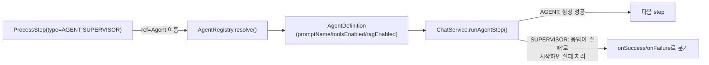

**Phase 6과의 차이(리팩터링)**: Phase 6에서는 `ProcessStep` 자체가 `toolsEnabled`/`ragEnabled` 필드를 갖고 있었다. Phase 7에서 그 두 필드를 `ProcessStep`에서 빼서 `AgentDefinition`으로 옮겼다 — 여러 Process가 같은 Agent(예: `oracle-sql-converter`)를 재사용할 수 있게 하기 위해서다(`capability`가 여러 요청에서 재사용되는 것과 같은 이유). `ProcessStep.ref`의 의미가 AGENT/SUPERVISOR에서는 "Agent 이름"으로 바뀌었다 — Phase 6 문서의 예시(15.3절)도 이 구조로 이미 갱신했다.

### 16.2 실동작 검증

✅ **실동작 검증됨(2026-09-14, WSL 환경)**:

```yaml
dstone:
  ai:
    agent:
      definitions:
        - name: oracle-sql-analyzer
          prompt-name: oracle-sql-analyzer
        - name: oracle-sql-converter
          prompt-name: oracle-sql-converter
        - name: oracle-sql-reviewer
          prompt-name: oracle-sql-reviewer
    process:
      definitions:
        - name: oracle-to-postgresql-team
          max-iterations: 6
          steps:
              - id: analyze
                type: AGENT
                ref: oracle-sql-analyzer   # Agent 이름(Phase 6과 달리 promptName이 아니다)
              - id: convert
                type: AGENT
                ref: oracle-sql-converter
              - id: validate
                type: TOOL
                ref: validateSqlSyntax
                input-template: '{"sql": "{previous}"}'
                on-success: review
                on-failure: convert
              - id: review
                type: AGENT
                ref: oracle-sql-reviewer
```

- 15절에서 검증했던 Oracle→PostgreSQL Migration Team을 이 Agent Registry 기반 구조로 다시 실행해서, 리팩터링 후에도 `NVL`→`COALESCE`, `(+)`→`OUTER JOIN`, `ROWNUM`→`LIMIT` 변환이 그대로 동작하고 검증(TOOL)도 정상 통과함을 재확인했다(회귀 없음).
- SUPERVISOR step은 별도의 최소 테스트 Process(`draft` AGENT step → `judge` SUPERVISOR step, `judge`는 "입력이 5자 이상이면 통과, 아니면 실패"라고 답하도록 지시)로 확인했다. 실제로 확인된 것: ① `AgentRegistry.resolve()`가 SUPERVISOR step에서도 정상 동작, ② `ChatService.runAgentStep()`이 호출되어 실제 Claude 응답을 받음, ③ 그 응답이 `"실패"`로 시작해서 `StepResult(false, ...)`로 정확히 판정됨, ④ `onFailure`가 지정 안 된 상태라 정확한 예외 메시지로 중단됨.
- ⚠️ **흥미로운 관찰(버그 아님)**: 이 테스트에서 draft(초안) 응답은 실제로 5자를 훨씬 넘는 여러 문장이었는데도, judge(Haiku 모델)가 `"실패: 너무 짧습니다"`라고 잘못 판정했다 — LLM에게 정확한 글자 수 세기를 시키는 건 신뢰도가 낮다는 걸 보여주는 사례다(토큰화 방식 때문에 LLM은 문자 단위 카운팅에 약하다는 게 잘 알려진 한계). 오히려 이 "잘못된 실패 판정"이 ③④(판정 로직과 예외 처리)를 실제로 검증해준 셈이다. **교훈**: SUPERVISOR 프롬프트는 정밀한 계산/카운팅이 아니라, `SqlSyntaxTools`처럼 결정적 도구가 이미 검증한 결과를 자연어로 요약·재검토하는 등 LLM이 잘하는 질적 판단에 써야 한다.

---

## 17. Phase 8 — Tool Runtime 확장 (Shell/Python/HTTP) + 샌드박싱

### 17.1 설계 — 화이트리스트가 유일한 방어선

`tools/shell/ShellExecTool`, `tools/python/PythonExecTool`, `tools/http/HttpCallTool` 세 개를 추가했다. 셋 다 이 리포지토리의 위험 기능 컨벤션을 그대로 따른다: **기본 비활성**(`dstone.ai.tool.{shell,python,http}.enabled=false`), 화이트리스트가 비어있으면 켜져도 호출할 게 없음.

- **Shell/Python** — LLM은 화이트리스트에 등록된 스크립트의 **이름**과 **인자**만 줄 수 있다. 실제 실행 파일 경로는 항상 설정에 미리 등록된 값이라, 임의의 셸 명령 문자열/Python 코드 문자열을 통째로 실행시키는 경로 자체가 없다. 둘 다 `common.exec.ExternalProcessRunner`(신규, 공유 유틸)로 실행한다 — `ProcessBuilder`는 셸을 거치지 않으므로(`/bin/sh -c`로 감싸지 않음) 인자에 `;`/`&&`/`|` 같은 셸 메타문자가 있어도 그 프로세스의 단순 인자로만 전달되고 명령 주입으로 이어지지 않는다.
- **HTTP** — 실행 파일이 아니라 **호스트** 화이트리스트가 방어선이다(SSRF 방지). GET만 지원한다(상태를 바꾸는 POST 등은 범위 밖). `allowed-hosts`는 단순 문자열 목록이라 `ConfigProperty.getListProperty()`(List&lt;Map&gt; 전용, 05.dstone-common.md 참고) 대신 Binder로 `List<String>`을 직접 바인딩한다.
- 셋 다 타임아웃 + 출력/응답 크기 상한을 갖는다. 실행 결과는 `LogUtil.sysout("dstone-ai-engine tool-audit: ...")`로 전량 로깅한다(명령/스크립트 이름·경로·인자·결과).
- **Phase 5 Tool 화이트리스트와 이중 게이트**: 이 세 Tool이 켜져 있어도, caller별 Tool 화이트리스트(`dstone.ai.governance.tool.allowed-by-caller`, 8.6절)에서 제외된 caller는 애초에 호출할 수 없다.
- **Database Tool은 만들지 않았다** — 14절 참고. 화이트리스트를 채울 실제 업무 테이블이 이 환경엔 없다.

### 17.2 실동작 검증

✅ **실동작 검증됨(2026-09-14, WSL 환경)** — LLM 판단에 맡기지 않고, Process의 TOOL step으로 직접 호출해 결정적으로 검증했다(LLM 비용 없음):

```yaml
dstone:
  ai:
    tool:
      shell:
        enabled: true
        timeout-seconds: 5
        allowed-commands:
            - name: echo-test
              path: /path/to/echo-test.sh
      python:
        enabled: true
        allowed-scripts:
            - name: echo-test
              path: /path/to/echo-test.py
      http:
        enabled: true
        allowed-hosts: [localhost]
```

```
dstone-ai-engine tool-audit: shell scriptName=echo-test path=.../echo-test.sh args=[hi-from-process] -> 통과: shell-hello: hi-from-process
dstone-ai-engine tool-audit: python scriptName=echo-test path=.../echo-test.py args=[hi-from-process] -> 통과: python-hello: hi-from-process
dstone-ai-engine tool-audit: http url=http://localhost:11434/api/tags -> HTTP 200
```

- 화이트리스트에 없는 스크립트 이름(`evil-script`)으로 호출을 시도하자 `"실패: 화이트리스트에 없는 스크립트입니다: evil-script"`로 즉시 거부되고, `onFailure`가 없어 명확한 예외로 중단되는 것까지 확인했다 — **셸/파이썬 프로세스가 실제로 뜨지 않았다**(감사 로그 자체가 안 남음).
- ⚠️ **주의(설계상 특성, 버그 아님)**: TOOL step이 성공하면 Tool의 응답 문구가 아니라 원본 입력값을 다음 step에 그대로 넘기는 게 Process Engine의 기존 규칙이다(15.1절 — 검증 도구의 "통과했다"는 메시지 자체는 새 정보가 아니라는 전제). Shell/Python/HTTP처럼 **결과 자체가 유용한 정보인 Tool**을 Process 안에서 쓸 때는 이 규칙 때문에 그 출력이 다음 step으로 전달되지 않는다 — 위 curl 테스트에서 최종 응답이 입력 그대로("trigger")였던 이유다. 지금은 감사 로그로만 결과를 확인할 수 있고, Process 응답에 Tool 출력 자체를 담아야 하는 요구가 실제로 생기면 TOOL step에 "성공 시에도 출력을 전달" 옵션을 추가하는 식으로 확장하면 된다.

---

## 18. Phase 9 — Governance 완성 (Quota, Sensitive-word Guardrail)

### 18.1 caller별 토큰 Quota — 예산 강제

`observability.usage`(8.5절)가 지금까지 "얼마 썼는지 로그로 남기는" 관측에 그쳤다면, Quota는 실제로 호출을 막는 예산 강제다. `governance.usage.UsageQuotaProperties` + `UsageLoggingAdvisor`가 함께 담당한다 — 별도 클래스로 안 뺀 이유는 `UsageLoggingAdvisor`가 이미 매 호출의 토큰 수를 아는 유일한 지점이기 때문이다.

- `common.filter.RateLimitFilter`와 똑같은 Redis 고정 윈도우 카운터 방식이다 — 다만 "요청 개수"가 아니라 "토큰 수"를 누적한다. `checkQuota()`가 LLM을 부르기 **전에** 이번 윈도우 누적이 한도를 넘었는지 먼저 확인해서 넘었으면 `429`로 즉시 거부하고, `recordQuotaUsage()`가 응답을 받은 **후에** 실제로 쓴 토큰만큼 누적시킨다. `dstone.ai.observability.usage.enabled`(로깅 자체)와는 독립적으로 동작한다.
- 설정은 `dstone.ai.governance.usage.quota.*` — `RateLimitFilter.overrides`와 동일한 List&lt;Map&gt; 컨벤션(`overrides: [{caller, limit}]`).

✅ **실동작 검증됨(2026-09-14, WSL 환경, 실제 Anthropic 호출)**:

```yaml
dstone:
  ai:
    governance:
      usage:
        quota:
          enabled: true
          window-seconds: 120
          default-token-limit: 100000
          overrides:
              - caller: si-d
                limit: 50   # 실제 호출 1회(11266토큰)가 이미 이 한도를 훨씬 넘도록 일부러 낮게 설정
```

> - si-d의 첫 호출은 정상 처리(200)됐고, 그 순간 실제 사용 토큰(11266)이 한도(50)를 이미 넘겼다.
> - si-d의 두 번째 호출은 `429 Too Many Requests`로 LLM 호출 자체 없이 즉시 거부됐다(로그로 "caller[si-d]의 사용량 쿼터(50 토큰/120초)를 초과했습니다" 확인).
> - `default-token-limit=100000`인 si-a는 같은 시점에 정상 호출됨을 확인 — caller별로 독립된 카운터라는 뜻이다.

### 18.2 Sensitive-word Guardrail

`governance.guardrail.PiiGuardrailAdvisor`(8.4절)와 완전히 같은 구조의 `SensitiveWordGuardrailAdvisor`를 추가했다. 차이는 정규식이 아니라 설정(`dstone.ai.governance.guardrail.sensitiveword.words`)에서 받은 문자열 목록을 대소문자 구분 없이 부분 일치로 찾는다는 점뿐이다(사내 용어/사업 코드명처럼 정규식으로 표현하기 애매한 값이 대상이라). order는 `PiiGuardrailAdvisor` 바로 다음(`HIGHEST_PRECEDENCE+2`)이라 두 Guardrail 다 `MessageChatMemoryAdvisor`보다 앞서 실행된다.

✅ **실동작 검증됨(2026-09-14, WSL 환경, 실제 Anthropic 호출)** — `words: [프로젝트엑스코드네임]`, `mode: mask`로 설정한 뒤 그 단어가 포함된 메시지를 보내자 `"dstone-ai-engine governance: sensitive-word 탐지(MASK) - 단어=[프로젝트엑스코드네임]"` 로그를 확인했고, Redis 세션 히스토리(`dstone:ai:session:*`)를 직접 조회해서 실제로 `[REDACTED_SENSITIVE]`로 마스킹된 텍스트가 저장됨을 확인했다(PII와 동일하게 ChatMemory 저장 전에 마스킹이 끝남). `mode: reject`는 `PiiGuardrailAdvisor`와 완전히 동일한 코드 구조라 별도 실행 검증은 생략했다.

---

## 19. Phase 10 — 비동기 API (submit/jobId)

### 19.1 설계

기존 `POST /api/ai/chat`(+`/stream`)은 그대로 동기 계약을 유지한다. 여러 step에 걸쳐 오래 걸릴 수 있는 호출(특히 Process 기반 capability)을 위해 `api.controller.ProcessController` + `api.service.ProcessJobService`가 `submit()`→`jobId`→`getStatus(jobId)` 폴링 흐름을 추가로 제공한다.

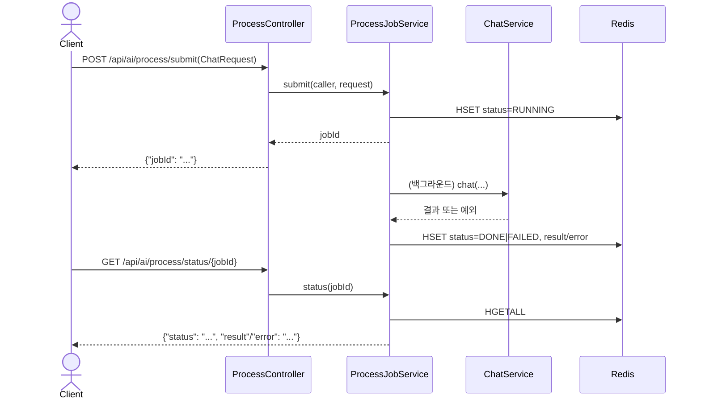

- **요청 계약은 `ChatController`와 동일**(`ChatRequest`) — capability가 단일 호출인지 Process 기반인지 `ProcessController`/`ProcessJobService` 둘 다 신경 쓰지 않는다. `ChatService.chat()`이 이미 그 라우팅을 알아서 하는 걸 그대로 재사용해서 비동기로 감싸기만 했다.
- **Job 상태는 Redis Hash**(`dstone:ai:process:job:{jobId}`)에 `status`/`result`/`error` 세 필드로 저장한다. 1시간 TTL로 자동 소멸한다(폴링이 끝난 결과를 계속 남겨둘 이유가 없음). `RedisUtil`이 만들어주는 `RedisTemplate`의 hash value serializer가 `GenericJackson2JsonRedisSerializer`라(plain `opsForValue()`의 `StringRedisSerializer`와 다름) 구조화된 값도 문제없이 오간다.
- ⚠️ **MVP 수준 구현** — `CompletableFuture.runAsync()`가 기본 `ForkJoinPool.commonPool()`을 그대로 쓴다. 전용 스레드풀/큐잉/동시 실행 수 제한은 없다 — `RateLimitFilter`의 고정 윈도우 카운터가 "구현 단순성을 택했다"고 밝힌 것과 같은 방향의 판단이다. 동시 `submit()`이 많아지면 그때 전용 `Executor`로 교체한다.

### 19.2 실동작 검증

✅ **실동작 검증됨(2026-09-14, WSL 환경)** — LLM 비용이 안 드는 기존 테스트 Process 2개로 성공/실패 양쪽 경로를 확인했다:

```bash
# 성공 케이스 (branch-test)
curl -X POST http://localhost:8081/api/ai/process/submit -H "X-API-Key: <si-a 키>" \
  -H "Content-Type: application/json" -d '{"message":"trigger", "capability":"branch-test"}'
# → {"jobId":"2960cc03-..."}
curl http://localhost:8081/api/ai/process/status/2960cc03-... -H "X-API-Key: <si-a 키>"
# → {"jobId":"...","status":"DONE","result":"trigger\n\n[검증 결과] 실패: 문법 오류 ...","error":null}

# 실패 케이스 (loop-test, max-iterations 초과)
curl -X POST http://localhost:8081/api/ai/process/submit ... -d '{"message":"trigger", "capability":"loop-test"}'
# → {"jobId":"50fd9de3-..."}
curl http://localhost:8081/api/ai/process/status/50fd9de3-... -H "X-API-Key: <si-a 키>"
# → {"jobId":"...","status":"FAILED","result":null,"error":"process[loop-test]가 최대 실행 횟수(3)를 초과했습니다..."}
```

- `DONE`/`FAILED` 둘 다 status/result/error 필드가 정확히 채워짐을 확인했다.
- 존재하지 않는 jobId로 조회하면 `IllegalArgumentException`(다른 미처리 예외들과 동일하게 500)으로 명확히 알려준다 — 전용 예외 핸들러가 이 모듈 어디에도 없다는 기존 컨벤션(8.6절 si-b 거부 예시와 동일)을 그대로 따른 것이다.
