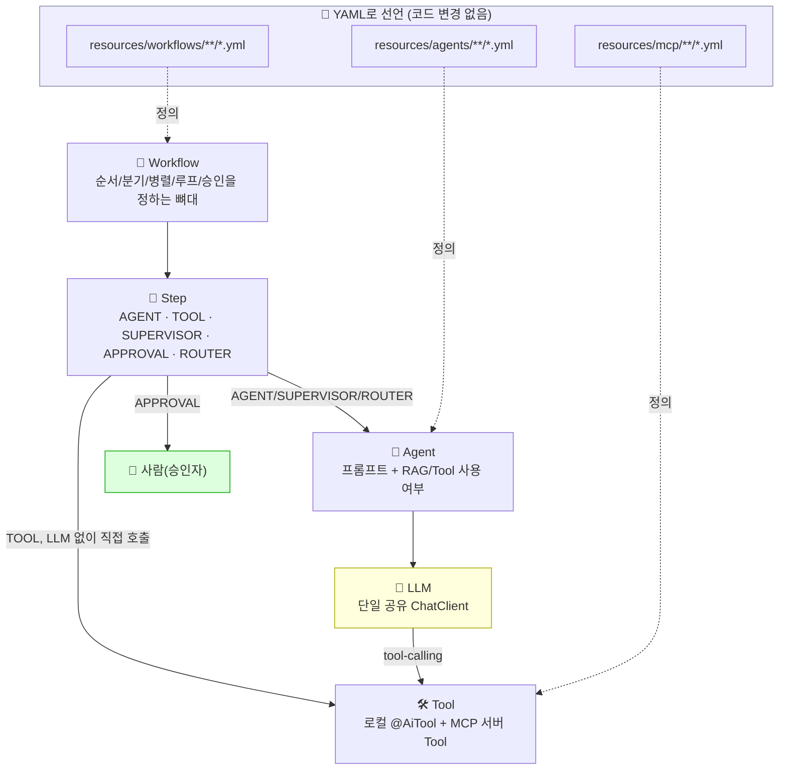
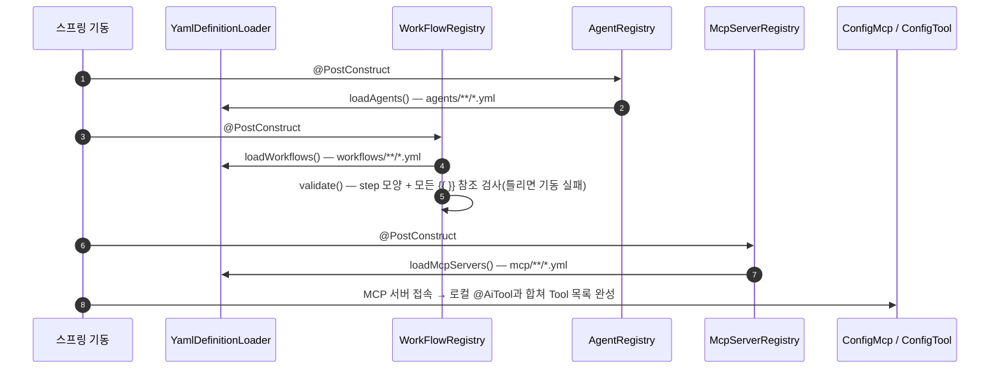
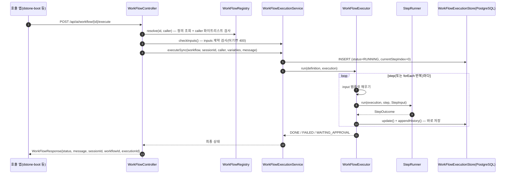
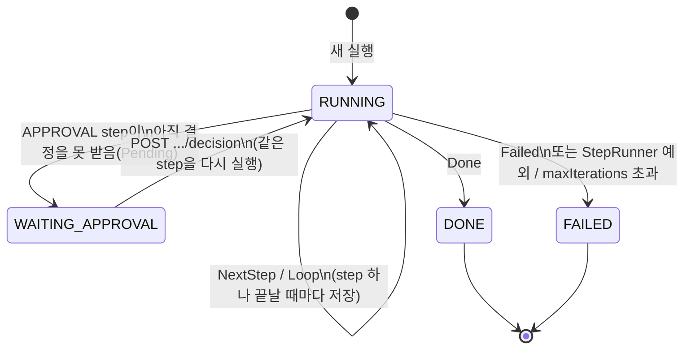
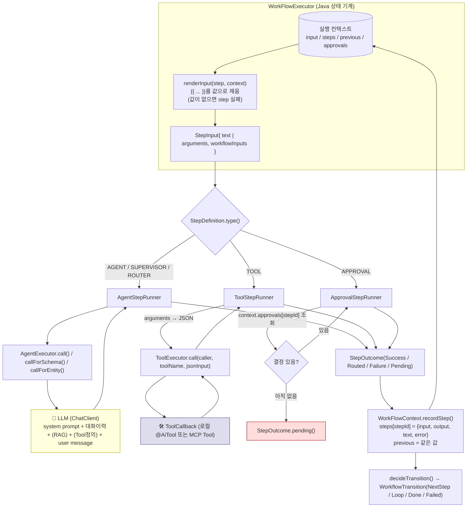
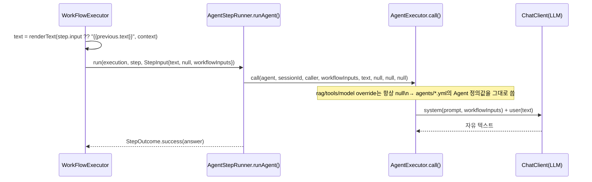
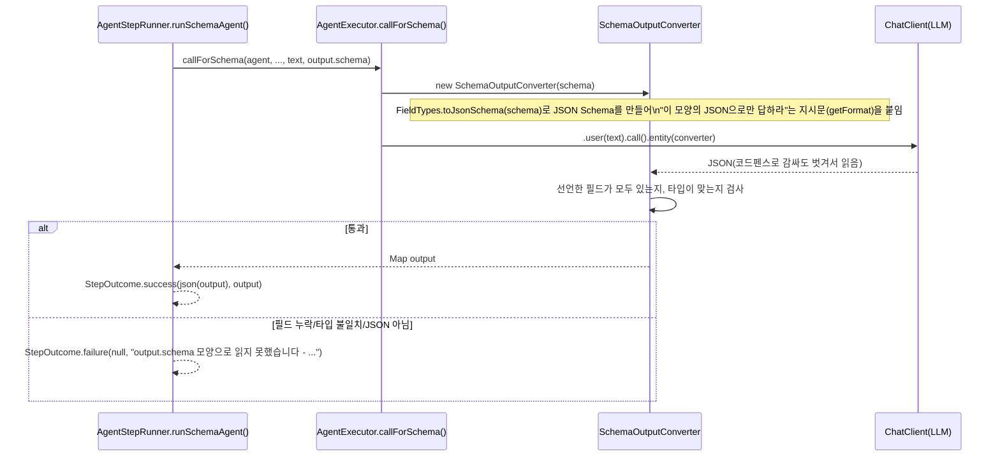
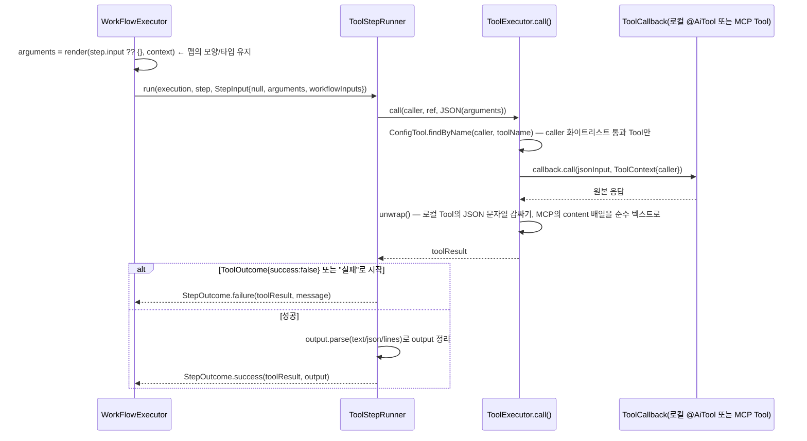
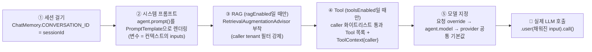

# dstone-ai-engine 🤖

> Spring AI 기반의 **Workflow → Step → Agent → Tool** 4계층 AI 서빙 엔진. 무엇을 할지는 전부 YAML로 선언한다.
> 이 문서는 현재 코드 기준의 구조, 실행 원리, **YAML 작성 레퍼런스와 템플릿 샘플**을 다룬다.
>
> - 새 Workflow/Agent를 만들려면 → [7. YAML 레퍼런스](#7-yaml-레퍼런스)와 [8. YAML 템플릿 샘플](#8-yaml-템플릿-샘플)
> - step 사이에 데이터가 어떻게 오가는지 알고 싶으면 → [6. Step 사이의 데이터 흐름](#6-step-사이의-데이터-흐름)

## 목차

1. [개요](#1-개요)
2. [설계 원칙](#2-설계-원칙)
3. [패키지 구조](#3-패키지-구조)
4. [기동: YAML 로딩과 검증](#4-기동-yaml-로딩과-검증)
5. [Workflow 실행 모델](#5-workflow-실행-모델)
6. [Step 사이의 데이터 흐름](#6-step-사이의-데이터-흐름)
7. [YAML 레퍼런스](#7-yaml-레퍼런스)
8. [YAML 템플릿 샘플](#8-yaml-템플릿-샘플)
9. [Agent와 Tool](#9-agent와-tool)
10. [Session / Embedding·RAG / Security / MCP](#10-session--embeddingrag--security--mcp)
11. [Governance 확장 지점](#11-governance-확장-지점)
12. [API 레퍼런스](#12-api-레퍼런스)
13. [설정 레퍼런스](#13-설정-레퍼런스-confapplicationyml)
14. [빌드 및 실행](#14-빌드-및-실행)

---

## 1. 개요

`dstone-ai-engine`은 Spring AI 기반의 provider-agnostic AI 서빙 엔진이다. 여러 SI 프로젝트에서 재사용하는 것을
목표로 한다. 핵심 아이디어는 "AI 에이전트 프로그램의 Workflow는 누가 제어하는가?"라는 질문에 대한 답이다.

```text
Workflow의 뼈대(순서/분기/병렬/루프/재시도 한도/승인 대기)는 Java(WorkFlowExecutor)가 잡고,
Step 안의 똑똑한 판단(분석, 변환 전략, 오류 원인 파악, Tool 선택)은 LLM에게 맡긴다.
```

Workflow/Agent/MCP 서버가 무엇을 할지는 자바 코드가 아니라 **YAML 파일**로 선언한다.
`resources/workflows/**/*.yml`, `resources/agents/**/*.yml`, `resources/mcp/**/*.yml`에 파일을 추가하거나 고치기만
하면 새 업무를 등록할 수 있다. `application.yml`이나 Java 코드는 건드리지 않는다.



Workflow 실행 한 건은 **PostgreSQL에 저장되는 실행 객체**(`WorkFlowExecution`)다. 그래서 APPROVAL step에서 멈췄다가
사람의 승인/반려로 다시 이어갈 수 있고, step마다 언제 무엇을 처리했는지 DB와 로그 양쪽에서 추적할 수 있다.

## 2. 설계 원칙

- **엔진 전체가 LLM provider 하나를 함께 쓴다.** Agent마다 다른 provider를 쓰는 기능은 없고,
  `spring.ai.model.chat` 하나로 전체가 움직인다. 그 provider 안에서 **모델**만 Agent별로 바꿀 수 있다
  (`agents/*.yml`의 `model`, 비우면 공통 기본값).
- **모든 step은 인터페이스 하나로 똑같이 실행된다.** 5가지 StepType(AGENT/TOOL/SUPERVISOR/APPROVAL/ROUTER)이 전부
  `runtime.step.StepRunner.run(execution, definition, input)` 하나를 거친다. 그래서 `common.config.ConfigCallLog`의
  AOP 로깅도 이 메서드 하나만 감시하면 모든 step의 IN/OUT이 같은 모양으로 남는다.
- **Workflow의 조립과 step 사이의 데이터 흐름은 100% YAML로 한다.** step은 `input`에 무엇을 받을지(`{{ ... }}` 참조)를,
  `output`에 결과를 어떤 모양으로 낼지를 선언한다(실행 후 `steps.<id>.output`으로 같은 이름으로 꺼낸다). 모든 데이터는 실행 컨텍스트 트리 하나를 거쳐 오간다.
  템플릿은 "값 참조"와 "대체값(`??`)"만 허용한다. 값을 가공하는 로직은 Tool로 만든다.
  Java는 새 부품(Tool, StepType)을 만들 때만 건드린다.
- **잘못 조립된 YAML은 기동할 때 드러난다.** `YamlDefinitionLoader`는 모르는 키를 만나면 파일 경로와 함께 실패하고,
  `WorkFlowRegistry`는 모든 `{{ }}` 참조와 step 모양을 검사해서 하나라도 틀리면 엔진 기동을 멈춘다([4절](#4-기동-yaml-로딩과-검증)).
- **실행 상태는 step(또는 forEach 반복)마다 바로 저장한다.** APPROVAL 대기든 서버 재기동이든,
  마지막으로 끝낸 지점부터 이어갈 수 있다.
- **시스템 오류(ERROR)와 비즈니스 실패(FAILURE)를 나눈다.** StepRunner가 던진 예외(외부 연결 실패 등)는
  `onFailure`를 거치지 않고 실행 전체를 바로 FAILED로 끝낸다. "DB가 죽은 것"을 "SQL이 틀린 것"처럼
  재작성 루프로 보내면 헛된 재시도가 반복되기 때문이다. 반면 input 템플릿이 가리키는 값을 못 찾은 것은
  YAML 조립상의 비즈니스 실패라서 그 step의 실패로 처리되고 `onFailure`를 따른다.
- **RAG는 별도 실행 단위가 아니라 Agent의 능력이다.** "검색 결과를 프롬프트에 어떻게 넣을지"는 LLM 호출과
  떼어낼 수 없어서, 독립된 StepType으로 두지 않는다([10절](#10-session--embeddingrag--security--mcp)).
- **람다식을 지양한다.** 컬렉션 처리는 `for`문, 함수형 인터페이스가 필요한 자리는 익명 클래스로 쓴다.
  `switch (x) { case A -> ... }` 형태의 enhanced switch는 그대로 쓴다.
- **dstone-common을 최대한 재사용한다.** Redis는 `RedisUtil`, 설정 읽기/`ENC(...)` 복호화는 `ConfigProperty`,
  로깅은 `LogUtil.sysout()`, 컨트롤러/서비스 베이스는 `BaseController`/`BaseService`/`BaseObject`를 쓴다.
- **governance(PII/민감어 가드레일, 사용량 로깅·쿼터)는 범위 밖이지만 확장 지점은 남겨 둔다**([11절](#11-governance-확장-지점)).

## 3. 패키지 구조

```text
net.dstone.ai
├── DstoneAiEngineApplication.java
│
├── common/
│   ├── annotation/AiTool.java             Tool 등록 마커 애노테이션(@Component 포함)
│   ├── exec/ExternalProcessRunner.java    shell/python Tool이 함께 쓰는 프로세스 실행기
│   │
│   ├── consts/                            enum과 상수(로직 없음)
│   │   ├── Constants.java                 설정 키 이름, 예약어, 실행 컨텍스트 트리 이름(Constants.WorkFlow.Context)
│   │   ├── StepType                       AGENT/TOOL/SUPERVISOR/APPROVAL/ROUTER
│   │   │                                   kind() = AGENT_CALL(LLM 호출) / DETERMINISTIC(LLM 미호출)
│   │   ├── ToolParse                      TEXT/JSON/LINES - TOOL step의 output.parse
│   │   └── McpTransport                   STDIO/SSE
│   │
│   ├── definition/                        YAML이 그대로 바인딩되는 record
│   │   ├── WorkFlowDefinition             workflow: 아래 전체(inputs/output/steps 포함)
│   │   ├── StepDefinition                 step 하나(input/output/forEach/routes 등)
│   │   ├── StepOutputDefinition           step의 output(schema | parse + pattern)
│   │   ├── FieldDefinition                값 하나의 타입(type, description) - inputs와 output.schema가 씀
│   │   ├── AgentDefinition                agent: 아래 전체(시스템 프롬프트 원문 포함)
│   │   └── McpServerDefinition            mcpServer: 아래 전체
│   │
│   ├── template/Template.java             {{ ... }} 렌더링, ?? 대체값, 참조 목록 추출(기동 시 검증용)
│   ├── schema/FieldTypes.java             타입 이름 검사, JSON Schema 변환, 값 타입 검사
│   ├── loader/YamlDefinitionLoader.java   workflows/agents/mcp 아래 **/*.yml 파싱 + ${VAR} 치환
│   ├── registry/                          WorkFlowRegistry(기동 시 모양/참조 검증), AgentRegistry, McpServerRegistry
│   ├── config/                            Config, ConfigChatClient, ConfigRedis, ConfigTool, ConfigMcp, ConfigCallLog
│   ├── rag/RagRetrievalChain.java         검색 체인(RAG) - 문서 적재(EmbedService)와 분리
│   ├── session/RedisChatMemoryRepository  Spring AI ChatMemoryRepository의 Redis 구현체
│   └── security/                          ApiKeyAuthFilter, RateLimitFilter, CallerContext
│
├── runtime/
│   ├── agent/
│   │   ├── AgentExecutor                  Agent를 실제로 호출(ChatClient 요청 조립)하는 유일한 지점
│   │   │                                   call()/callForSchema()/callForEntity()/callForVerdict()/stream()
│   │   ├── SchemaOutputConverter          output.schema → JSON Schema 지시문 + 응답 파싱/검증
│   │   ├── Verdict                        SUPERVISOR가 LLM에게 받는 응답 모양(pass, reason)
│   │   └── RouteDecision                  ROUTER가 LLM에게 받는 응답 모양(route, reason)
│   │
│   ├── tool/
│   │   ├── ToolExecutor                   TOOL step이 Tool을 LLM 없이 부르는 유일한 지점
│   │   └── ToolOutcome                    Tool이 돌려줄 수 있는 성공/실패 응답 모양(success, message)
│   │
│   ├── step/
│   │   ├── StepRunner                     공통 인터페이스
│   │   ├── StepInput                      run()의 입력(text | arguments, workflowInputs) - 템플릿은 이미 채워진 상태
│   │   ├── StepOutcome                    run()의 출력 - Success/Routed/Failure/Pending
│   │   └── AgentStepRunner(AGENT/SUPERVISOR/ROUTER), ToolStepRunner, ApprovalStepRunner
│   │
│   └── workflow/
│       ├── WorkFlowExecutor               상태 기계(순차/분기/forEach 병렬/루프/승인 대기).
│       │                                   step input 템플릿 렌더링과 결과 기록도 여기서 한다
│       ├── WorkflowTransition             step 하나가 끝난 뒤의 전이(NextStep/Loop/Done/Failed)
│       └── execution/                     WorkFlowExecution, WorkFlowContext(컨텍스트 트리 도구),
│                                           WorkFlowExecutionStatus, StepHistoryEntry, WorkFlowExecutionStore(JdbcTemplate)
│
├── tools/                                 @AiTool 구현체
│   ├── ExternalProcessTool                Shell/Python 공통 골격(추상 클래스)
│   └── sample/DateTimeTool, sql/SqlSyntaxTool, rag/RagSearchTool, shell/ShellExecTool,
│       python/PythonExecTool, http/HttpCallTool, jenkins/JenkinsTriggerBuildTool
│
└── api/
    ├── controller/                        ChatController, WorkFlowController, WorkFlowExecutionController,
    │                                       EmbedController, RagController
    ├── service/                           WorkFlowExecutionService(동기/비동기/승인 재개의 단일 진입점),
    │                                       EmbedService(문서 임베딩 적재/삭제)
    └── dto/                               요청/응답 record
```

## 4. 기동: YAML 로딩과 검증



**파일 찾기와 바인딩.** `YamlDefinitionLoader`는 `classpath:workflows/**/*.yml`, `agents/**/*.yml`, `mcp/**/*.yml`을
찾아 SnakeYAML로 읽고, Jackson `ObjectMapper.convertValue()`로 definition record에 바인딩한다. `**`는 하위 디렉토리를
몇 단계든 포함하므로 `workflows/billing/*.yml`처럼 프로젝트/도메인별 폴더로 나눠도 된다. Workflow/Agent/MCP 서버를
구분하는 것은 파일 경로가 아니라 YAML 안의 `id`다. 각 Registry가 `id` 중복을 검사한다. 읽은 정의는 메모리에 캐싱되고,
바꾼 YAML을 반영하려면 재기동해야 한다(핫 리로드 없음).

**`${VAR_NAME}` 치환.** 이 YAML들은 Spring이 읽는 게 아니라서 `${...}`가 자동으로 채워지지 않는다. 그래서 로더가
바인딩 직전에 모든 문자열 값 안의 `${VAR_NAME}`을 System 프로퍼티(`conf/env{-profile}.properties`가 기동 시 넣어 둔 값,
`DstoneAiEngineApplication.setSysProperties()` 참고)로 바꾼다. 없으면 OS 환경변수를 찾고, 그래도 없으면 `${VAR_NAME}`을
그대로 남긴다(조용히 지우면 설정 누락을 알아채기 어렵기 때문). 환경(Windows/WSL/k8s)마다 다른 절대경로를 YAML 하나로
표현할 때 쓴다. **`${...}`는 기동 시점의 환경값이고, `{{ ... }}`는 실행 중의 데이터 참조다. 서로 다른 기능이다.**

**잘못된 YAML은 기동을 멈춘다.**

1. `YamlDefinitionLoader` — YAML 문법 오류, record에 없는 키(오타나 옛 키), 값 모양이 다른 경우 파일 경로를 담은 예외를 던진다.
2. `WorkFlowRegistry` — Workflow마다 아래를 검사하고, 하나라도 어기면 `workflow[id]의 step[id]: 이유` 메시지로 기동을 멈춘다.
   - 기본 구조: `id`/`steps`가 있는가, Workflow id와 step id가 중복되지 않는가, 모든 step에 `id`/`type`이 있는가
   - step 모양: StepType별로 쓸 수 있는 항목만 썼는가([7.3절 표](#73-step-항목))
   - 타입 이름: `inputs`와 `output.schema`의 타입이 올바른가, `output.pattern`이 올바른 정규식인가
   - 참조: step `input`, `forEach`, Workflow `output` 안의 모든 `{{ }}` 경로가 올바른가([7.5절](#75-템플릿-참조-문법))
3. `AgentRegistry` — 모든 Agent에 `id`와 `prompt`가 있는가, `id`가 중복되지 않는가.

## 5. Workflow 실행 모델



`WorkFlowExecutor`는 `execution.currentStepIndex()`부터 이어서 step 목록을 따라가는 상태 기계다. 새 실행이면 0번부터,
APPROVAL에서 재개하는 실행이면 멈췄던 그 step부터 다시 실행한다.



**다음 step 정하기(`WorkflowTransition`).** step 하나가 끝나면 아래 순서로 다음 행동을 정한다.

| 상황 | 결과 |
|---|---|
| ROUTER가 성공 | LLM이 고른 route를 `routes`에서 찾아 그 step으로. `routes`에 없는 이름이면 FAILED |
| 성공 + `onSuccess` 없음 | 목록상 다음 step으로. 마지막 step이면 Workflow 성공(Done) |
| 실패 + `onFailure` 없음 | Workflow 실패(Failed) |
| `SUCCESS` / `FAIL` 예약어 | 그 자리에서 Workflow 성공 / 실패 |
| 다른 step id | 그 step으로 이동. 목록상 앞쪽이면 `Loop`, 뒤쪽이면 `NextStep`(동작은 같고 로그 구분용) |
| 없는 step id | FAILED |

전체 step 실행 횟수가 `maxIterations`(비우면 `Constants.WorkFlow.DEFAULT_MAX_ITERATIONS` = **10**)를 넘으면 무한 루프로 보고 FAILED로 끝낸다.

**성공/실패 판정.**

| StepType | 성공 | 실패 |
|---|---|---|
| AGENT(`output.schema` 없음) | 항상 | - |
| AGENT(`output.schema` 있음) | LLM이 schema 모양의 JSON으로 답함 | 필드가 빠졌거나 타입이 다름, JSON이 아님 |
| TOOL | `ToolOutcome.success=true`, 또는 평범한 문자열이 `"실패"`로 시작하지 않음 | 위의 반대. `parse: json`인데 응답이 JSON이 아니어도 실패 |
| SUPERVISOR | `Verdict.pass`가 명시적으로 `true` | 그 밖의 모든 경우(응답 모양이 깨져도 실패) |
| ROUTER | route를 하나 고름 | route가 비었거나 응답 모양이 깨짐 |
| APPROVAL | 사람이 승인 | 사람이 반려 |
| 공통 | - | input 템플릿이 가리키는 값을 찾지 못함 |

실패 사유는 그 step의 `error`에 남는다. `onFailure`로 이동한 step은 `{{steps.<id>.error}}`로 읽을 수 있다.

**다지 분기(ROUTER).** `onSuccess`/`onFailure`는 두 갈래뿐이라, 세 갈래 이상 분기(예: 문의 유형별 라우팅)는 ROUTER로 한다.
LLM이 `RouteDecision(route, reason)`으로 `routes`의 이름표 중 하나를 고르고, 엔진이 그 이름표에 연결된 step으로 이동한다.
Agent의 `prompt`가 "route로 쓸 수 있는 이름"을 직접 안내해야 한다.

**병렬 실행(`forEach`).** 병렬 실행은 `forEach` 한 가지뿐이다. `forEach`에 리스트를 가리키는 경로를 적으면, 그 항목 수만큼
같은 step을 `CompletableFuture`로 동시에 실행한다. 리스트는 요청 값(`inputs.sqlList`)이든 앞 step 결과(`steps.list.output.lines`)든
상관없고, 항목 개수를 YAML에 미리 적을 필요가 없다. 각 반복은 자기 항목을 `{{item}}`(`itemVariable`로 이름 변경 가능)으로 받는다.

- 반복별 결과는 `steps.<id>.items[i]`에 `{input, output, text, error}`로 순서대로 쌓인다.
- `steps.<id>.text`는 반복별 text를 줄바꿈으로 이은 값이고, `error`는 실패한 반복들의 사유를 이은 값이다.
- 반복이 하나라도 실패하면 step 전체가 실패다. 항목이 0개면 빈 결과로 성공이다.
- `forEach` 경로의 값이 없거나 리스트가 아니면 step 실패다.
- 실행 이력은 반복 수만큼 `<id>[0]`, `<id>[1]`… 로 남는다.
- 서로 다른 step을 동시에 실행하는 것은 표현할 수 없다. 그런 경우는 순차 실행으로 푼다.
- APPROVAL과 ROUTER는 `forEach`를 쓸 수 없다(승인 결정은 step id 하나로만 구분되고, ROUTER는 어느 반복의 선택을 따를지 정할 수 없다).

**APPROVAL과 재개.** `ApprovalStepRunner`도 다른 러너처럼 `run()` 한 번으로 호출된다. 컨텍스트의 `approvals.<stepId>`에
결정이 없으면 `Pending`을 돌려주고, 엔진은 실행을 `WAITING_APPROVAL`로 멈춘다. `POST .../decision`이 호출되면 결정을
`approvals`에 기록하고 **같은 step을 다시 실행**한다. 이번엔 결정이 있으니 승인이면 성공, 반려면 실패로 흘러간다.
즉 "재개"는 특별한 코드 경로가 아니라 같은 step의 재실행이다.

> ⚠️ 한 번 기록된 결정은 실행이 끝날 때까지 지워지지 않는다. 그래서 "반려되면 앞 단계로 되돌아가 다시 시도"하는 루프는
> 쓰면 안 된다. 되돌아와도 같은 step id가 예전 반려 결정을 다시 읽어서 즉시 또 반려된다. 승인 step의 `onFailure`는 `FAIL`로
> 끝내고, 고쳐서 다시 하고 싶으면 새 실행을 시작한다(`workflows/testApp/testApp-sdlc.yml` 참고).

**저장(`runtime.workflow.execution`).** 실행 한 건은 `AI_WORKFLOW_EXECUTION` 한 행이고, 컨텍스트 트리는 `CONTEXT_JSON`(JSONB)
컬럼에 저장된다. step 실행 이력(`StepHistoryEntry`)은 `AI_WORKFLOW_EXECUTION_STEP_HISTORY`에 step마다 한 행씩 쌓인다
(같은 step을 다시 실행하면 또 쌓인다). 동기(`/execute`), 비동기(`/submit`), 승인 재개(`/decision`) 세 경로 모두
`WorkFlowExecutionService`를 거쳐 `WorkFlowExecutor.run()`으로 들어간다.

**로깅.** `common.config.ConfigCallLog`가 AOP(`@Around`)로 네 지점을 감시한다: `WorkFlowExecutor.run(..)`(Workflow 한 건),
`StepRunner+.run(..)`(step 하나), `AgentExecutor.*(..)`(LLM 호출 한 건), `ToolExecutor.*(..)`(Tool 호출 한 건).
호출의 시작과 끝마다 구분선으로 둘러싼 블록을 남긴다.

```text
|--------------------------------------------------------------------------------------------------------------------------------------|
[StepRunner - step(id=extract, type=AGENT, ref=sample-structured-extract-agent)] Start !!!
<input>
WorkFlowExecution[...], StepDefinition[id=extract, type=AGENT, ...], StepInput[text=..., arguments=null, workflowInputs={message=...}]
|--------------------------------------------------------------------------------------------------------------------------------------|

|--------------------------------------------------------------------------------------------------------------------------------------|
[StepRunner - step(id=extract, type=AGENT, ref=sample-structured-extract-agent)] End !!!
<output>
Success[text={"sql":"..."}, output={sql=...}]
|--------------------------------------------------------------------------------------------------------------------------------------|
```

네 지점이 같은 로거(`net.dstone.ai`)로 모여 `LOGS/dstone-ai-engine/execution/execution.log` 한 파일에 순서대로 쌓인다(`log4j2.xml`).
같은 executionId로 검색하면 "Workflow → Step → Agent/Tool" 흐름 전체를 로그 파일 하나에서 재구성할 수 있다.
"다음에 어느 step으로 갈지"는 step이 끝난 뒤에 정해지므로 로그에는 없지만, step이 찍힌 순서가 곧 진행 흐름이다.

## 6. Step 사이의 데이터 흐름

**한 줄 요약**: step 사이의 데이터는 전부 **실행 컨텍스트 트리 하나**를 거쳐 오간다. 각 step은 YAML의 `input`에
"무엇을 받을지"를 `{{ ... }}` 참조로, `output`에 "결과를 어떤 모양으로 낼지"를 선언한다(실행 후 같은 이름 `steps.<id>.output`으로 꺼낸다). 템플릿은 step 종류와 상관없이
**엔진(`WorkFlowExecutor`)이 한 곳에서** 채운다.

### 6.1 계층별 I/O 한눈에 보기

```text
사용자 → Workflow     : {message, variables}          →  {status, message(= Workflow output), executionId}
Workflow → Step       : input 템플릿을 채운 값          →  StepOutcome{text, output, route | failureReason}
Step(AGENT류) → Agent : system = agents/*.yml의 prompt, user = 채워진 input(문자열), 응답 모양 = output.schema
Agent → LLM → Tool    : Spring AI tool-calling(@Tool의 JSON 스키마) — 엔진이 규정하지 않는 구간
Step(TOOL) → Tool     : 채워진 input(맵 → JSON 인자)  →  output.parse로 output 정리
```

엔진이 규약을 갖는 곳은 **Workflow ↔ Step 경계 하나**다. `Agent → LLM → Tool` 구간은 LLM이 판단하는 영역이라 Spring AI에 맡긴다.



### 6.2 실행 컨텍스트 — 모든 상태를 담는 트리 하나

`runtime.workflow.execution.WorkFlowContext`가 만들고 고치는 평범한 `Map`이다. 그대로 JSON으로 `CONTEXT_JSON`에 저장되고,
실행 상세 API(`GET /api/ai/workflow/executions/{id}`)의 `context`로 그대로 보인다. 트리의 이름들은 `Constants.WorkFlow.Context`에 모여 있다.

**트리의 이름은 YAML에 적는 이름과 같다.** 선언한 이름 그대로 꺼내 쓰면 된다.

| YAML에 적는 곳 | 실행 컨텍스트(템플릿에서 꺼내는 경로) |
|---|---|
| `workflow.inputs.sqlList` (타입 선언) | `inputs.sqlList` (요청에 실제로 온 값) |
| step의 `input` (템플릿) | `steps.<id>.input` (채운 뒤 실제로 받은 값) |
| step의 `output` (`schema`/`parse`로 모양 선언) | `steps.<id>.output` (그 모양의 결과 값) |
| step의 `forEach` + `itemVariable` | `item`(또는 `itemVariable` 이름) — 반복 중에만 |

예전 이름(`{{input.x}}`, `steps.<id>.data.x`)을 쓰면 기동이 실패하고 오류 메시지가 새 이름을 알려 준다.

```yaml
inputs:                    # 실행 요청이 넣은 값. 시작할 때 한 번 채워지고 바뀌지 않는다
  message: "사용자 메시지"   # 요청의 message
  sqlList: [...]           # 요청의 variables 각 값
steps:                     # step이 끝날 때마다 자기 id 아래에 결과를 남긴다(루프로 다시 돌면 덮어씀)
  analyze:
    input:  "채워진 입력"    # 이 step이 실제로 받은 값(TOOL이면 인자 맵)
    output: { tables: [...] }  # YAML step의 output에 선언한 모양의 결과
    text:   "결과 텍스트"
    error:  null           # 실패했을 때의 사유
  validate-each:           # forEach step
    text:  "반복별 text를 줄바꿈으로 이은 값"
    error: "실패한 반복들의 사유"
    items: [ { input, output, text, error }, ... ]   # 반복 순서대로
previous:                  # 바로 직전에 "실제로 실행된" step의 결과(첫 step에서는 { text: message })
approvals:                 # APPROVAL 결정 수신함(엔진 내부용. 템플릿에서는 steps.<id>.output으로 읽는다)
  design-review: { approved, approver, comment }
```

`previous`는 "목록상 바로 앞 step"이 아니라 **실제로 바로 직전에 실행된 step**이다. `onFailure` 루프로 되돌아왔을 때도 올바른 값을 가리킨다.

### 6.3 StepType별 IN/OUT

모든 StepType은 `StepRunner.run(WorkFlowExecution, StepDefinition, StepInput) : StepOutcome` 하나를 거친다.

- **`StepInput(text, arguments, workflowInputs)`** — 엔진이 채워서 넘긴다. AGENT류/APPROVAL은 `text`, TOOL은 `arguments`를 쓰고,
  `workflowInputs`(컨텍스트의 `inputs`)은 Agent system prompt의 `{변수}`를 채우는 데 쓴다.
- **`StepOutcome`** — `Success(text, output)` / `Routed(text, output, route)` / `Failure(text, failureReason)` / `Pending()`.
  엔진은 이것을 컨텍스트에 `{input, output, text, error}`로 남긴다(`error` = `failureReason`).

| StepType | `input` 모양(생략 시) | YAML `output` | `text` | `steps.<id>.output` |
|---|---|---|---|---|
| AGENT | 문자열 (`{{previous.text}}`) | 없음 | LLM 답변 원문 | `{}` |
| AGENT | 문자열 (`{{previous.text}}`) | `schema` | output의 JSON 글자 | schema대로 읽은 값 |
| SUPERVISOR | 문자열 (`{{previous.text}}`) | 쓸 수 없음 | 받은 input 그대로 | `{pass, reason}` |
| ROUTER | 문자열 (`{{previous.text}}`) | 쓸 수 없음 | 받은 input 그대로 | `{route, reason}` |
| TOOL | 맵 (`{}`) | `parse: text`(기본) | Tool 응답 원문 | `{}` |
| TOOL | 맵 (`{}`) | `parse: json` | Tool 응답 원문 | 응답 JSON 객체(배열이면 `{items: [...]}`) |
| TOOL | 맵 (`{}`) | `parse: lines`(+`pattern`) | Tool 응답 원문 | `{lines: [...]}` |
| APPROVAL | 쓸 수 없음 (`{{previous.text}}`) | 쓸 수 없음 | 받은 input 그대로 | `{approved, approver, comment}` |

- **실패 사유는 텍스트에 덧붙이지 않는다.** SUPERVISOR/APPROVAL/TOOL 모두 사유를 `error`(승인 코멘트는 `output.comment`)에만 남긴다.
  필요한 step이 `{{steps.judge.error}}`, `{{steps.review.output.comment}}`처럼 명시적으로 읽는다.
- **SUPERVISOR/ROUTER/APPROVAL은 관문이다.** 받은 input을 결과 텍스트로 그대로 넘기므로, 뒤 step이 input을 생략해도
  (`{{previous.text}}`) 관문 앞 step의 결과를 받는다.
- **TOOL의 결과 텍스트는 항상 Tool 응답 원문이다.** "검증을 통과한 값"이 필요하면 그 값을 만든 step(`{{steps.convert.output.sql}}`)이나
  검증 step이 받은 입력(`{{steps.validate.input.sql}}`)을 이름으로 읽는다.

#### AGENT (output.schema 없음)



#### AGENT + output.schema — 다음 step이 쓸 값을 정확히 뽑을 때



provider 고유의 structured output 옵션은 쓰지 않고 "지시문 + 결과 검사" 방식으로만 동작한다. 어느 provider로 바꿔도
같은 YAML이 그대로 동작하게 하려는 것이다.

#### SUPERVISOR / ROUTER

둘 다 `AgentExecutor.callForEntity(..., Verdict.class | RouteDecision.class)`로 Spring AI의 자바 클래스 기반 구조화 응답을 받는다.
SUPERVISOR는 `verdict.pass()`가 명시적으로 `true`일 때만 성공이다. ROUTER가 고른 `route`가 `routes`에 있는지는
`WorkFlowExecutor.decideRouterTransition()`이 한 단계 뒤에서 확인한다(없으면 Workflow FAILED). Agent의 `prompt`가
"무엇을 판정 기준으로 삼을지", "route로 쓸 수 있는 이름이 무엇인지"를 직접 안내해야 한다.

#### TOOL



#### APPROVAL

처음 도달하면 `context.approvals[stepId]`가 없어서 `Pending` → 실행이 `WAITING_APPROVAL`로 멈춘다.
`POST .../decision`이 결정을 기록하고 같은 step을 다시 실행하면, 승인은 `Success(받은 input, {approved, approver, comment})`,
반려는 `Failure(받은 input, comment)`가 된다.

### 6.4 `AgentExecutor` — LLM에게 실제로 무엇이 나가는가

AGENT/SUPERVISOR/ROUTER와 채팅 API가 공통으로 거치는 `AgentExecutor.buildSpec()`이 요청을 조립한다.



| LLM에 실제로 들어가는 것 | 어디서 오는가 |
|---|---|
| 시스템 프롬프트 | `AgentDefinition.prompt` — `{변수}`는 컨텍스트의 `inputs`(요청의 message/variables)으로 채움 |
| 사용자 메시지 | step의 `input` 템플릿을 채운 값(생략하면 `{{previous.text}}`) |
| 응답 모양 지시 | `output.schema`가 있으면 `SchemaOutputConverter.getFormat()`, SUPERVISOR/ROUTER는 Spring AI가 `Verdict`/`RouteDecision`에서 만든 스키마 |
| 대화 히스토리 | `sessionId`로 `ChatMemory`(Redis)가 자동으로 붙임. 한 실행 안의 모든 AGENT류 step이 `execution.sessionId()` 하나를 공유 |
| RAG 컨텍스트 | `ragEnabled: true`일 때만([10절](#10-session--embeddingrag--security--mcp)) |
| Tool 정의 목록 | `toolsEnabled: true`일 때만. 어떤 Tool을 부를지는 Spring AI tool-calling 루프가 LLM과 주고받으며 정함 |
| 모델 | `agents/*.yml`의 `model`(비우면 `spring.ai.{provider}.chat.options.model`) |

> 💡 system prompt의 `{변수}`(ST4 문법)와 step input의 `{{ ... }}`는 다른 것이다. "Agent YAML = 역할",
> "step input = 이번에 할 일과 데이터"로 역할을 나눈다. step의 결과 데이터를 Agent에 넘기려면 step `input`에 적는다.

### 6.5 `ToolExecutor` — Tool에게 실제로 무엇이 나가는가

```text
ToolExecutor.call(caller, toolName, jsonInput)
    1. ConfigTool.findByName(caller, toolName)  — caller 화이트리스트를 통과한 Tool만 이름으로 찾음
    2. ToolContext(Map.of("net.dstone.ai.security.caller", caller == null ? "" : caller))
       (caller가 null이어도 엔트리 1개는 꼭 채운다 — 비어 있으면 Spring AI가 예외를 던지기 때문)
    3. callback.call(jsonInput, toolContext)  — 실제 @Tool 메서드 호출(또는 MCP 서버 왕복, 서버별로 한 번에 하나씩)
    4. unwrap(rawResult)  — JSON 문자열 감싸기/MCP content 배열을 사람이 읽는 텍스트로
```

| Tool 반환 타입 | 성공/실패 판정 | output을 만들려면 |
|---|---|---|
| `runtime.tool.ToolOutcome(success, message)` (권장) | `success` 필드 | (판정용이라 output 불필요) |
| 원하는 모양의 record / Map | 항상 성공(ToolOutcome 모양이 아니면) | YAML에 `output.parse: json` |
| 평범한 `String` | `"실패"`로 시작하는지(`Constants.Outcome.FAIL_PREFIX`) | 줄 단위면 `output.parse: lines` |

### 6.6 실전 예시로 끝까지 따라가 보기 — `testApp-sdlc`

`workflows/testApp/testApp-sdlc.yml`은 "승인형 AI SDLC"(요청 접수 → AI 분석 → 검수 → AI 명세 → 승인 → AI 코드 생성 →
개발자 제출 → 최종 승인 → Jenkins 기동)를 8개 step으로 표현한 가장 현실적인 예시다.


| step id | type | input(무엇을 받는가) | 실제로 부르는 대상 | 결과 |
|---|---|---|---|---|
| `analyze` | AGENT | `{{inputs.message}}` | `testApp-analysis-agent` | text = 분석/설계서 |
| `design-review` | APPROVAL | (직전 text 통과) | 사람(business-reviewer) | output = {approved, approver, comment} |
| `write-spec` | AGENT | `[승인된 분석/설계서] {{steps.analyze.text}}` + `[검수 의견] {{steps.design-review.output.comment}}` | `testApp-spec-writer-agent` | text = 개발명세서 |
| `spec-review` | APPROVAL | (직전 text 통과) | 사람(PL) | output = {…, comment} |
| `generate-code` | AGENT | `[승인된 개발명세서] {{steps.write-spec.text}}` + `[PL 검토 의견] {{steps.spec-review.output.comment}}` | `testApp-codegen-agent` | text = 소스 초안 |
| `dev-submit` / `code-review` | APPROVAL | (직전 text 통과) | 사람(developer / PL) | output = {…} |
| `trigger-jenkins` | TOOL | `{jobName: testApp}` | `triggerBuild`(`JenkinsTriggerBuildTool`) | `ToolOutcome.pass(...)` → SUCCESS |

- **문서 본문과 승인 코멘트가 섞이지 않는다.** 승인 코멘트는 `output.comment`에 따로 있고, 다음 AGENT가 input의 `[검수 의견]` 칸으로 따로 받는다.
- **AGENT step은 `output.schema`를 쓰지 않는다.** 결과물이 마크다운/코드가 많은 긴 문서라 JSON 문자열에 담으면 이스케이프가
  깨지기 쉽고, 다음 step은 문서를 통째로(`{{steps.analyze.text}}`) 받기만 하면 되기 때문이다.
  "다음 step이 특정 값 하나를 정확히 집어야 할 때"만 schema를 쓴다.

## 7. YAML 레퍼런스

> 항목별 자세한 동작(검사 시점, 경우별 결과, 주의사항)은 리소스 폴더의 가이드에 있다:
> `src/main/resources/workflows/workflow-yml-guide.md`(Workflow/step 항목), `src/main/resources/agents/agent-yml-guide.md`(Agent 항목).

### 7.1 파일 규칙

| 종류 | 위치 | 최상위 키 | 파일 하나에 |
|---|---|---|---|
| Workflow | `src/main/resources/workflows/**/*.yml` | `workflow:` | Workflow 1개 |
| Agent | `src/main/resources/agents/**/*.yml` | `agent:` | Agent 1개 |
| MCP 서버 | `src/main/resources/mcp/**/*.yml` | `mcpServer:` | MCP 서버 1개 |

- 폴더는 자유롭게 나눠도 된다(`workflows/billing/*.yml` 등). 구분 기준은 파일 경로가 아니라 `id`다.
- 파일 이름은 `id`와 맞추는 것을 권장한다(강제는 아님).
- 모르는 키를 쓰면 기동이 실패한다. 오타에 주의한다.
- 문자열 안의 `${VAR_NAME}`은 기동 시 `conf/env{-profile}.properties` 값으로 바뀐다([4절](#4-기동-yaml-로딩과-검증)).
- 파일 맨 위에 "이 파일이 무엇을 하는지, 어떻게 호출해 보면 되는지"를 주석으로 적어 두는 것이 이 프로젝트의 관례다.

### 7.2 Workflow 항목

`workflow:` 아래에 적는다(`common.definition.WorkFlowDefinition`).

| 항목 | 필수 | 타입 | 설명 |
|---|---|---|---|
| `id` | ✅ | 문자열 | Workflow를 가리키는 이름. API 경로(`/api/ai/workflow/{id}/...`)에 쓰인다. 중복 불가 |
| `description` | | 문자열 | 사람이 읽는 설명. `GET /api/ai/workflow` 목록과 dstone-boot 화면 안내문에 쓰인다 |
| `maxIterations` | | 정수 | 전체 step 실행 횟수 상한(루프 방지). 비우면 **10** |
| `allowedCallers` | | 문자열 리스트 | 실행을 허락할 caller 목록. 비우면 누구나. ⚠️ 인증이 꺼져 있으면 caller가 항상 null이라, 채우는 순간 아무도 실행 못 한다 |
| `inputs` | | 맵(이름 → 타입) | 입력 계약. 요청의 `variables`에 이 값들이 없거나 타입이 다르면 실행 전에 **400**. `message`는 항상 들어오므로 선언하지 않는다. 선언하면 `{{inputs.이름}}` 참조도 이 목록으로 기동 시 검사한다 |
| `output` | | 템플릿 문자열 | 성공으로 끝났을 때 돌려줄 최종 결과. 비우면 마지막으로 실행된 step의 `text` |
| `steps` | ✅ | step 리스트 | 실행할 step 목록. 목록 순서가 기본 실행 순서다 |

### 7.3 Step 항목

`steps:` 리스트의 항목 하나(`common.definition.StepDefinition`).

| 항목 | 설명 |
|---|---|
| `id` | step 이름(필수). `onSuccess`/`onFailure`/`routes`와 `{{steps.<id>...}}` 참조가 이 이름을 쓴다. Workflow 안에서 중복 불가 |
| `type` | `AGENT` / `TOOL` / `SUPERVISOR` / `ROUTER` / `APPROVAL` (필수) |
| `ref` | AGENT/SUPERVISOR/ROUTER는 **Agent id**, TOOL은 **Tool 이름**(`@Tool` 메서드 이름 또는 MCP Tool 이름). APPROVAL은 쓰지 않는다 |
| `input` | 이 step에 넣을 값의 템플릿. AGENT류는 문자열(LLM 사용자 메시지), TOOL은 맵(Tool 인자) |
| `output.schema` | AGENT 전용. LLM이 이 모양의 JSON으로 답하게 강제하고, 그 JSON이 `steps.<id>.output`이 된다. 선언한 필드는 모두 필수 |
| `output.parse` | TOOL 전용. `text`(기본, output 없음) / `json`(응답 JSON이 output) / `lines`(`{lines: [...]}`). 대소문자 무관 |
| `output.pattern` | TOOL + `parse: lines` 전용. 이 정규식에 맞는 줄만 남긴다. 괄호 그룹이 있으면 첫 번째 그룹만 값으로 쓴다 |
| `onSuccess` | 성공 시 다음 step id 또는 `SUCCESS`/`FAIL`. 비우면 목록상 다음 step(마지막이면 성공 종료) |
| `onFailure` | 실패 시 다음 step id 또는 `SUCCESS`/`FAIL`. 비우면 Workflow 실패. 앞쪽 step id를 적으면 재시도 루프 |
| `routes` | ROUTER 전용(필수, 1개 이상). `route 이름: 다음 step id`(또는 `SUCCESS`/`FAIL`) |
| `forEach` | 리스트를 가리키는 경로(`{{ }}` 없이 적음, 예: `inputs.sqlList`). 항목 수만큼 이 step을 동시에 실행한다 |
| `itemVariable` | `forEach` 반복에서 항목을 받는 이름. 비우면 `item`(→ `{{item}}`) |
| `approverRole` | APPROVAL 전용 기록용 값(누가 승인해야 하는지). 서버가 실제 권한을 검사하지는 않는다 |

**StepType별로 쓸 수 있는 항목** (✅ 사용, ⭕ 선택, ❌ 쓰면 기동 실패, — 무시됨)

| 항목 | AGENT | SUPERVISOR | ROUTER | TOOL | APPROVAL |
|---|---|---|---|---|---|
| `ref` | ✅ Agent id | ✅ Agent id | ✅ Agent id | ✅ Tool 이름 | — |
| `input` | ⭕ 문자열 | ⭕ 문자열 | ⭕ 문자열 | ⭕ 맵 | ❌ |
| `output.schema` | ⭕ | ❌ | ❌ | ❌ | ❌ |
| `output.parse` / `pattern` | ❌ | ❌ | ❌ | ⭕ | ❌ |
| `onSuccess` | ⭕ | ⭕ | — | ⭕ | ⭕ |
| `onFailure` | ⭕ | ⭕ | ⭕ (route를 고르지 못했을 때) | ⭕ | ⭕ |
| `routes` | — | — | ✅ | — | — |
| `forEach` / `itemVariable` | ⭕ | ⭕ | ❌ | ⭕ | ❌ |
| `approverRole` | — | — | — | — | ⭕ |

**각 step이 내놓는 `output` 키** — `{{steps.<id>.output.<키>}}`로 참조할 수 있는 키. 여기 없는 키를 참조하면 기동이 실패한다.

| step | `output` 키 |
|---|---|
| AGENT + `output.schema` | schema에 선언한 필드들 |
| AGENT(schema 없음) | 없음 |
| TOOL + `parse: json` | 알 수 없음(Tool 응답에 따라 다름 → 실행 중에 검사) |
| TOOL + `parse: lines` | `lines` |
| TOOL(parse 없음/`text`) | 없음 |
| SUPERVISOR | `pass`, `reason` |
| ROUTER | `route`, `reason` |
| APPROVAL | `approved`, `approver`, `comment` |
| `forEach` step | 없음. 반복별 결과는 `steps.<id>.items.<번호>.output.<키>` |

### 7.4 값 타입 (`inputs`, `output.schema`)

`common.definition.FieldDefinition`. 두 가지 방법으로 적는다.

```yaml
sql: string                     # 축약형: 타입만
sql:                            # 확장형: 설명까지(output.schema에서는 LLM에게 그대로 전달된다)
  type: string
  description: 변환된 PostgreSQL SQL
```

| 타입 | 맞는 값 |
|---|---|
| `string` | 문자열 |
| `number` | 숫자(정수/실수) |
| `integer` | 정수 |
| `boolean` | `true` / `false` |
| `object` | JSON 객체(맵) |
| `list<타입>` | 해당 타입의 리스트. 예: `list<string>`, `list<object>` |

### 7.5 템플릿 참조 문법

`common.template.Template`이 처리한다. **값 참조와 대체값(`??`) 두 가지만** 지원한다. 계산식이나 조건식이 필요하면 Tool로
만들어 TOOL step으로 처리한다(YAML이 프로그래밍 언어가 되지 않게 하기 위해서다).

| 문법 | 의미 |
|---|---|
| `{{inputs.message}}` | 실행 요청의 message |
| `{{inputs.<이름>}}` | 실행 요청의 `variables.<이름>` |
| `{{steps.<id>.text}}` | 그 step의 결과 텍스트 |
| `{{steps.<id>.output.<키>}}` | 그 step의 구조화된 결과([7.3절 output 키 표](#73-step-항목)) |
| `{{steps.<id>.input}}` / `.input.<인자>` | 그 step이 실제로 받은 입력(TOOL이면 인자 맵) |
| `{{steps.<id>.error}}` | 그 step의 실패 사유 |
| `{{steps.<id>.items.0.text}}` | forEach step의 0번째 반복 결과(숫자로 리스트 항목 선택) |
| `{{previous.text}}` / `{{previous.output.<키>}}` | 바로 직전에 실행된 step의 결과 |
| `{{item}}` (또는 `itemVariable` 이름) | forEach 반복 중 이번 항목(forEach step의 `input` 안에서만) |
| `{{a.b ?? c.d ?? e}}` | 왼쪽부터 차례로 찾아 처음으로 값이 있는 것을 씀 |

- **채우는 규칙**: 다른 글자와 섞여 있으면 값을 글자로 끼운다(맵/리스트는 JSON 글자). 값 전체가 `{{ ... }}` 하나뿐이면
  **원래 타입을 유지**한다(TOOL 인자에 리스트나 숫자를 그대로 넘길 때).
- **값이 없으면 실패한다**: 경로가 없거나 값이 null이면 빈 글자로 넘어가지 않고 그 step이 실패한다(onFailure를 따름).
  대체값이 필요하면 `??`를 쓴다.
- **기동 시 검사**: 시작 이름(`inputs`/`steps`/`previous`/`item`), step id, 필드 이름(`input`/`output`/`text`/`error`/`items`),
  `steps.<id>.output.<키>`, `inputs.<이름>`(inputs 선언 시)을 미리 검사한다. `previous.output.*`처럼 실행 순서에 따라 달라지는
  값만 실행 중에 검사한다.
- **쓰는 곳은 세 군데**: step `input`, step `forEach`(`{{ }}` 없이 경로만), Workflow `output`.

### 7.6 Agent 항목

`agent:` 아래에 적는다(`common.definition.AgentDefinition`).

| 항목 | 필수 | 타입 | 설명 |
|---|---|---|---|
| `id` | ✅ | 문자열 | Agent 이름. step의 `ref`와 채팅 API의 `agent`가 이 값을 쓴다. 중복 불가 |
| `prompt` | ✅ | 문자열(여러 줄) | 시스템 프롬프트 원문. `{변수}`는 호출 시 채워진다(Workflow에서는 컨텍스트의 `inputs`, 채팅에서는 요청의 `variables`) |
| `description` | | 문자열 | 사람이 읽는 설명. `GET /api/ai/chat` 목록에 쓰인다 |
| `model` | | 문자열 | 이 Agent만 쓸 모델 이름(같은 provider 안에서). 비우면 공통 기본값. 다른 provider의 모델 이름이면 기동이 아니라 첫 호출 때 실패한다 |
| `toolsEnabled` | | boolean | LLM이 Tool을 스스로 골라 부를 수 있는지. 기본 `false` |
| `ragEnabled` | | boolean | 적재된 문서를 검색해서 답변에 참고하는지. 기본 `false` |
| `ragTopK` | | 정수 | RAG 검색 결과 최대 개수. 비우면 `dstone.ai.rag.retrieval.top-k` |
| `ragSimilarityThreshold` | | 실수 | RAG 최소 유사도. 비우면 `dstone.ai.rag.retrieval.similarity-threshold` |
| `ragAllowEmptyContext` | | boolean | 검색 결과가 없을 때도 답을 시도할지. 비우면 `true`. `false`면 "모른다"고 답하도록 강제 |
| `allowedCallers` | | 문자열 리스트 | 호출을 허락할 caller 목록. 비우면 누구나(⚠️ Workflow와 같은 주의사항) |

**StepType별 prompt 작성 요령**

| 용도 | prompt에 꼭 넣을 것 |
|---|---|
| AGENT(schema 없음) | 역할과 규칙, 결과물의 형식 |
| AGENT + `output.schema` | 역할과 규칙. JSON 형식 지시는 엔진이 자동으로 붙이므로 적지 않아도 된다 |
| SUPERVISOR | 무엇을 기준으로 pass/fail을 판정할지, reason에 무엇을 적을지 |
| ROUTER | route로 쓸 수 있는 이름 목록과 각각의 기준(Workflow의 `routes` 키와 정확히 같게) |

### 7.7 MCP 서버 항목

`mcpServer:` 아래에 적는다(`common.definition.McpServerDefinition`).

| 항목 | 필수 | 설명 |
|---|---|---|
| `id` | ✅ | 서버 이름(로그 구분용) |
| `transport` | ✅ | `STDIO`(로컬 프로세스를 띄워 표준 입출력으로 대화) / `SSE`(원격 HTTP 서버에 접속) |
| `command` | STDIO | 서버를 실행할 명령어(예: `npx`) |
| `args` | STDIO | `command`에 넘길 인자 리스트 |
| `url` | SSE | 접속할 서버 URL |
| `allowedTools` | | 이 서버의 Tool 중 실제로 가져올 이름 목록. 비우면 전부 |

접속에 실패한 서버는 로그만 남기고 건너뛴다(엔진 기동은 계속된다). caller별 접근 제어는 서버 단위가 아니라 다른 Tool과
똑같이 `dstone.ai.tool.allowed-by-caller`(Tool 이름 기준)로 한다.

### 7.8 제공되는 샘플

`src/main/resources/{agents,workflows,mcp}/` 아래에 두 묶음이 있다. 각 파일 맨 위 주석에 dstone-boot "Workflow 테스트"
화면에서 어떤 workflowId/message/variables로 호출하면 되는지 적혀 있다. 같은 값이 그 화면의 `WORKFLOW_SAMPLES`
(dstone-boot `ai/assets/js/workflow.js`)에도 들어 있어서 workflowId를 고르면 자동으로 채워진다 - Workflow를 추가/변경하면 둘 다 맞춰 둔다.

**Workflow**

| 기능 | Workflow |
|---|---|
| AGENT step 기본(변수/Tool 없이) | `sample/sample-agent-basic-echo.yml` |
| AGENT의 자율 tool-calling | `sample/sample-agent-tool-calling.yml` |
| AGENT의 RAG(ragEnabled) 증강 | `sample/sample-agent-rag-augmented.yml` |
| Agent별 model override | `sample/sample-agent-model-override.yml` |
| TOOL step 연쇄(LLM 없이) | `sample/sample-tool-chain-basic.yml` |
| MCP Tool + `output.parse: lines` + 앞 step output으로 `forEach` | `sample/sample-mcp-filesystem-list.yml` |
| TOOL로 RAG 검색만 직접 호출 | `sample/sample-tool-rag-search.yml` |
| 위험 Tool(http/shell/python) 기본 거부 확인 | `sample/sample-tool-gated-external.yml` |
| AGENT `output.schema` → `{{steps.<id>.output.<키>}}`, Workflow `output` | `sample/sample-structured-output-chain.yml` |
| SUPERVISOR(pass/reason) 판정 | `sample/sample-supervisor-verdict-gate.yml` |
| ROUTER 다지 분기(routes) | `sample/sample-router-multiway.yml` |
| onFailure 재시도 루프 + `previous`/`??`/`steps.<id>.error` | `sample/sample-loop-retry-until-valid.yml` |
| `forEach` 병렬 실행 + Workflow `inputs` 계약 | `sample/sample-foreach-parallel.yml` |
| APPROVAL 일시중단/재개(HITL) | `sample/sample-approval-pause-resume.yml` |
| 실전 8단계 승인형 SDLC(AGENT+APPROVAL+TOOL 종합) | `testApp/testApp-sdlc.yml` |

**Agent**

| Agent | 용도 |
|---|---|
| `sample-basic-echo-agent` | 가장 단순한 AGENT(변수/Tool 없음) |
| `sample-general-chat` | 일반 대화(`{role}` 변수). dstone-boot 채팅 화면 기본값 |
| `sample-tool-demo-agent` | 로컬 Tool 자율 호출(`toolsEnabled: true`) |
| `sample-mcp-filesystem-agent` | MCP filesystem Tool 자율 호출 |
| `sample-rag-demo-agent` | RAG 증강(`ragEnabled: true`, `ragTopK`/`ragSimilarityThreshold`) |
| `sample-model-override-agent` | Agent별 `model` 지정 |
| `sample-structured-extract-agent` | `output.schema` AGENT용(문장에서 SQL 추출) |
| `sample-fix-agent` | 재시도 루프용(검증 실패한 SQL 수정) |
| `sample-verdict-judge-agent` | SUPERVISOR용(pass/reason 판정) |
| `sample-router-classifier-agent` | ROUTER용(billing/technical/other 분류) |
| `testApp-analysis-agent` / `testApp-spec-writer-agent` / `testApp-codegen-agent` | `testApp-sdlc`의 분석/명세/코드 생성 |

**MCP 서버**: `mcp/sample/sample-filesystem-mcp.yml` — 공식 filesystem 레퍼런스 서버를 STDIO로 띄워
`${APP_HOME}/${APP_NAME}/mcp/server-filesystem` 하나만 노출한다(`list_directory`/`read_text_file`/`write_file`/`edit_file`/`move_file`만 허용).

## 8. YAML 템플릿 샘플

복사해서 쓰는 뼈대다. `<...>` 자리를 채우고, 쓰지 않는 선택 항목은 지운다.

### 8.1 Workflow 뼈대

```yaml
# <이 Workflow가 무엇을 하는지 한두 줄>
#
# dstone-boot의 "Workflow 테스트" 화면에서는 이렇게 호출해보면 됩니다:
#   workflowId: <workflow-id>
#   message   : <예시 메시지>
#   variables : <예시 JSON 또는 (비워도 됩니다)>
workflow:
  id: <workflow-id>
  description: <사람이 읽는 설명>
  maxIterations: 10                 # 선택. 루프가 있으면 (step 수 × 재시도 횟수)보다 넉넉하게
  # allowedCallers: [<caller>]      # 선택. 인증을 켠 환경에서만 채운다
  # inputs:                         # 선택. 요청 variables의 계약
  #   <이름>: string
  # output: "{{steps.<step-id>.text}}"   # 선택. 비우면 마지막 step의 text
  steps:
    - id: <step-id>
      type: AGENT
      ref: <agent-id>
      input: "{{inputs.message}}"
      onSuccess: SUCCESS
      onFailure: FAIL
```

### 8.2 step 타입별 스니펫

**AGENT — 자유 텍스트**

```yaml
    - id: summarize
      type: AGENT
      ref: <agent-id>
      input: |
        [요약할 원문]
        {{inputs.message}}
      # input을 생략하면 {{previous.text}}(직전 step의 결과 텍스트)를 받는다
```

**AGENT + output.schema — 다음 step이 값을 콕 집어 쓸 때**

```yaml
    - id: extract
      type: AGENT
      ref: <agent-id>
      input: "{{inputs.message}}"
      output:
        schema:
          sql:
            type: string
            description: 입력 문장에서 뽑아낸 SQL 문 하나
          tables: list<string>
      onSuccess: validate
      onFailure: FAIL
      # → 다음 step에서 {{steps.extract.output.sql}}, {{steps.extract.output.tables}}
```

**TOOL — 기본(결과 텍스트만)**

```yaml
    - id: validate
      type: TOOL
      ref: validateSqlSyntax            # @Tool 메서드 이름 또는 MCP Tool 이름
      input:
        sql: "{{steps.extract.output.sql}}"
      onSuccess: SUCCESS
      onFailure: FAIL
      # 인자가 필요 없는 Tool이면 input을 통째로 생략한다(빈 인자 {}로 호출)
```

**TOOL + parse: json — Tool이 구조화된 JSON을 돌려줄 때**

```yaml
    - id: lookup
      type: TOOL
      ref: <tool-name>
      input:
        ids: "{{inputs.idList}}"         # 값 전체가 {{ }} 하나면 리스트 타입 그대로 넘어간다
      output:
        parse: json                     # 응답 JSON 객체 → output (배열이면 output.items)
      # → {{steps.lookup.output.<키>}} (키는 Tool 응답에 따라 다르므로 실행 중에 검사된다)
```

**TOOL + parse: lines — 줄 단위 응답에서 값 목록을 뽑을 때**

```yaml
    - id: list
      type: TOOL
      ref: list_directory
      input:
        path: "{{inputs.message}}"
      output:
        parse: lines
        pattern: '^\[FILE\] (.+)$'      # 맞는 줄만 남기고, 괄호 그룹 1을 값으로
      # → output.lines = ["notes.txt", "todo.txt"]
```

**SUPERVISOR — 앞 step의 결과를 LLM이 판정**

```yaml
    - id: judge
      type: SUPERVISOR
      ref: <판정용 agent-id>            # prompt에 판정 기준을 적어 둔다
      # input 생략 → 직전 step의 결과 텍스트를 판정
      onSuccess: SUCCESS                # pass=true
      onFailure: FAIL                   # pass=false → 사유는 {{steps.judge.error}}
```

**ROUTER — 세 갈래 이상 분기**

```yaml
    - id: classify
      type: ROUTER
      ref: <분류용 agent-id>            # prompt에 route 이름 목록을 routes 키와 똑같이 적어 둔다
      input: "{{inputs.message}}"
      routes:
        billing: billing-step
        technical: technical-step
        other: SUCCESS                  # 예약어도 쓸 수 있다
      # → 고른 경로와 이유는 {{steps.classify.output.route}}, {{steps.classify.output.reason}}
```

**APPROVAL — 사람의 승인 대기**

```yaml
    - id: review
      type: APPROVAL
      approverRole: "PL"                # 기록용. 서버가 권한을 검사하지는 않는다
      onSuccess: next-step              # 승인 → 코멘트는 {{steps.review.output.comment}}
      onFailure: FAIL                   # 반려 → 앞 step으로 되돌리는 루프는 쓰지 않는다(5절 경고 참고)
```

**forEach — 리스트 항목마다 동시에 실행**

```yaml
    - id: validate-each
      type: TOOL
      ref: validateSqlSyntax
      forEach: inputs.sqlList            # {{ }} 없이 경로만. steps.<id>.output.lines 같은 앞 step 결과도 된다
      itemVariable: sql                 # 선택. 비우면 {{item}}
      input:
        sql: "{{sql}}"
      onSuccess: SUCCESS
      onFailure: FAIL
      # → steps.validate-each.items[i] = {input, output, text, error}, 하나라도 실패하면 step 실패
```

**재시도 루프 — 실패하면 고쳐서 다시 검증**

```yaml
workflow:
  id: <workflow-id>
  maxIterations: 6                      # 검증↔수정 최대 3회전
  output: "{{steps.validate.input.sql}}"
  steps:
    - id: validate
      type: TOOL
      ref: validateSqlSyntax
      input:
        sql: "{{previous.output.sql ?? inputs.message}}"   # 처음엔 사용자 메시지, 수정 뒤엔 fix의 결과
      onSuccess: SUCCESS
      onFailure: fix

    - id: fix
      type: AGENT
      ref: <수정용 agent-id>
      input: |
        [검증에 실패한 SQL]
        {{steps.validate.input.sql}}

        [실패 사유]
        {{steps.validate.error}}
      output:
        schema:
          sql: string
      onSuccess: validate               # 앞쪽 step으로 → Loop
```

### 8.3 Agent 뼈대

```yaml
# <이 Agent가 무엇을 하는지 한두 줄>
agent:
  id: <agent-id>
  description: <사람이 읽는 설명>
  prompt: |
    당신은 <역할>입니다.
    <지켜야 할 규칙>
    답변은 항상 한국어로 합니다.
  toolsEnabled: false
  ragEnabled: false
  # model: <모델 이름>                  # 선택. 비우면 공통 기본 모델
  # allowedCallers: [<caller>]          # 선택. 인증을 켠 환경에서만 채운다
```

**Tool을 스스로 쓰는 Agent**

```yaml
agent:
  id: <agent-id>
  prompt: |
    당신은 <역할>입니다. 필요하면 제공된 Tool을 호출해서 사실을 확인한 뒤 답하십시오.
  toolsEnabled: true                    # caller 화이트리스트를 통과한 Tool 전부가 후보가 된다
  ragEnabled: false
```

**RAG를 쓰는 Agent**

```yaml
agent:
  id: <agent-id>
  prompt: |
    당신은 적재된 문서를 참고해서 답하는 어시스턴트입니다.
    [참고자료]가 주어지면 그 내용을 근거로 답하고, 없으면 일반 지식으로 답한다는 점을 밝히십시오.
  toolsEnabled: false
  ragEnabled: true
  ragTopK: 3                            # 선택
  ragSimilarityThreshold: 0.3           # 선택
  ragAllowEmptyContext: true            # 선택. 기본 true
```

**SUPERVISOR용 Agent**

```yaml
agent:
  id: <agent-id>
  prompt: |
    당신은 주어진 텍스트가 <기준>을 만족하는지 판정하는 검토자입니다.
    만족하면 pass=true, 아니면 pass=false로 답하고,
    reason에는 그렇게 판정한 이유를 한국어로 한 줄 적으십시오.
  toolsEnabled: false
  ragEnabled: false
```

**ROUTER용 Agent**

```yaml
agent:
  id: <agent-id>
  prompt: |
    당신은 요청을 아래 갈래 중 정확히 하나로 분류하는 라우터입니다.
    - billing: <기준>
    - technical: <기준>
    - other: 위에 해당하지 않는 모든 요청
    route에는 반드시 billing/technical/other 중 하나만 그대로 적으십시오.
    reason에는 왜 그렇게 분류했는지 한국어로 한 줄 적으십시오.
  toolsEnabled: false
  ragEnabled: false
```

### 8.4 MCP 서버 뼈대

**STDIO(로컬 프로세스)**

```yaml
mcpServer:
  id: <server-id>
  transport: STDIO
  command: npx
  args: ["-y", "<npm 패키지>", "${APP_HOME}/${APP_NAME}/<노출할 경로>"]
  allowedTools: ["<tool1>", "<tool2>"]   # 비우면 전부
```

Windows에서는 `npx`가 실제로는 `npx.cmd`(배치 스크립트)라 `ProcessBuilder`가 바로 실행하지 못한다. 그래서 Windows용
`conf/env.properties`에 `MCP_STDIO_COMMAND_PREFIX=cmd.exe /c`를 넣어 두면 `ConfigMcp`가 커맨드 앞에 붙여서 실행한다.
YAML은 환경마다 고칠 필요가 없다.

**SSE(원격 서버)**

```yaml
mcpServer:
  id: <server-id>
  transport: SSE
  url: http://<host>:<port>
  allowedTools: []                      # 비우면 전부
```

## 9. Agent와 Tool

**Agent**(`common.definition.AgentDefinition`)는 "LLM에게 일을 시키는 단위"다. `runtime.agent.AgentExecutor`가 이 정의를 읽어
`ChatClient` 요청 하나를 조립하는 유일한 지점이고, `ChatController`(채팅 한 턴)와 `AgentStepRunner`(Workflow의 AGENT/SUPERVISOR/ROUTER
step)가 똑같이 이 클래스를 거친다. `prompt`의 `{변수}`는 Spring AI의 `PromptTemplate`으로 그 자리에서 채운다.
프롬프트의 변경 이력은 `agents/*.yml`의 git 이력이 그대로 말해준다.

**Tool**은 두 출처를 하나로 합쳐서 쓴다.

1. **로컬 `@AiTool`** — `common.annotation.AiTool`(`@Component` 포함)이 붙은 클래스의 `@Tool` 메서드. `common.config.ConfigTool`이 기동 시 모은다.

   | Tool 클래스 | Tool 이름(`ref`) | 무엇을 하는가 | 켜짐 조건 |
   |---|---|---|---|
   | `tools.sample.DateTimeTool` | `getCurrentDateTime` | 현재 날짜/시간(데모용) | 항상 |
   | `tools.sql.SqlSyntaxTool` | `validateSqlSyntax` | SQL 문법 검증(JSQLParser) | 항상 |
   | `tools.rag.RagSearchTool` | `searchDocuments` | LLM 없이 벡터스토어 검색만 | 항상(RAG가 꺼져 있으면 실패 응답) |
   | `tools.shell.ShellExecTool` | `runShellScript` | 화이트리스트된 스크립트만 실행 | `allowed-commands`가 비면 사실상 꺼짐 |
   | `tools.python.PythonExecTool` | `runPythonScript` | 화이트리스트된 스크립트만 실행 | `allowed-scripts`가 비면 사실상 꺼짐 |
   | `tools.http.HttpCallTool` | `httpGet` | 허용된 호스트에만 GET | `allowed-hosts`가 비면 사실상 꺼짐 |
   | `tools.jenkins.JenkinsTriggerBuildTool` | `triggerBuild` | 화이트리스트된 Jenkins Job을 REST API로 기동(큐 등록까지만, CSRF 크럼+쿠키 처리) | `allowed-jobs`가 비면 사실상 꺼짐 |

   위험한 Tool(Shell/Python/Http/Jenkins)은 별도 on/off 플래그 없이 **화이트리스트 자체가 스위치**다. LLM이 준 명령어나 URL을
   그대로 실행하지 않고, 화이트리스트에 있는 스크립트/호스트/Job만 쓴다.

2. **MCP 서버 Tool** — `common.config.ConfigMcp`가 `resources/mcp/**/*.yml`의 서버마다 접속해서 가져온다([10절](#10-session--embeddingrag--security--mcp)).

`ConfigTool`이 이 둘을 하나의 `ToolCallbackProvider`로 합치므로, 합친 뒤에는 출처와 상관없이 AGENT의 tool-calling이나
TOOL step의 `ref`에서 이름으로 똑같이 쓴다. caller별 Tool 화이트리스트(`dstone.ai.tool.allowed-by-caller`)도 이름 기준으로 똑같이 적용된다.

**새 로컬 Tool 만들기**

```java
@AiTool
public class MyTool {

	@Tool(description = "LLM이 읽는 설명 - 언제 이 Tool을 써야 하는지 적는다")
	public ToolOutcome doSomething(@ToolParam(description = "인자 설명") String arg) {
		// 성공/실패가 분명한 Tool은 ToolOutcome을 돌려준다(권장)
		return ToolOutcome.pass("처리 결과");
	}
}
```

- 구조화된 output을 내고 싶으면 `ToolOutcome` 대신 원하는 record/Map을 돌려주고, YAML에서 `output.parse: json`을 적는다.
- `String`을 돌려주면 `"실패"`로 시작할 때만 실패로 본다. 접두사를 빠뜨리면 조용히 성공으로 처리되므로 `ToolOutcome`을 권장한다.

## 10. Session / Embedding·RAG / Security / MCP

- **Session** — `common.session.RedisChatMemoryRepository`가 Spring AI의 `ChatMemoryRepository`를 Redis
  (`dstone:ai:session:{conversationId}` List)로 구현한다. `dstone.ai.session.max-messages`(기본 20)만큼 최근 대화만 유지하는
  슬라이딩 윈도우는 `common.config.ConfigChatClient`가 조립한다(`MessageWindowChatMemory`). Redis가 없으면
  (`spring.data.redis.enabled=false`) `InMemoryChatMemoryRepository`로 대체되고, 재시작하면 대화가 사라진다.
  Workflow 실행 안에서는 `WorkFlowExecution.sessionId()` 하나를 모든 AGENT류 step이 공유해서 대화 히스토리가 step을 넘나들며 이어진다.

- **Embedding(적재)과 RAG(검색·증강)는 분리돼 있다.** 문서를 임베딩해서 벡터스토어에 넣고 빼는 일은 `api.service.EmbedService`
  (`/api/ai/embed/documents`)가, 그 재료로 검색·증강하는 일은 `common.rag.RagRetrievalChain`이 맡는다. 검색 체인은 Spring AI RAG 모듈의
  부품을 그대로 쓴다.

  ```text
  VectorStoreDocumentRetriever(topK/threshold/tenant 필터로 검색)
      → ContextualQueryAugmenter(검색 결과를 프롬프트에 끼워넣기)
      → RetrievalAugmentationAdvisor 하나로 묶어서 ChatClient에 부착
  ```

  `ContextualQueryAugmenter`는 `allowEmptyContext(true 기본)` + 커스텀 프롬프트 템플릿으로 구성한다. Spring AI 기본 동작
  (검색 결과가 없으면 "모른다고 답하라"로 질의를 바꿔치기)을 쓰지 않는 이유는, 이 프로젝트의 Agent는 자신의 `prompt`에 업무
  규칙을 이미 갖고 있고 RAG는 그 위에 참고 자료를 얹는 보조 수단이기 때문이다. 쓰이는 곳은 두 군데다.
  ① Agent의 `ragEnabled: true`(`AgentExecutor`가 `RagRetrievalChain.buildAdvisor(...)`를 붙임)
  ② `tools.rag.RagSearchTool`(LLM 없이 검색 결과만 필요한 TOOL step, `RagRetrievalChain.search()`를 직접 호출).
  caller가 있으면 청크마다 `tenant` metadata를 붙이고 검색/삭제 때 같은 caller로 필터를 강제해서 다른 caller의 문서가 섞이지 않는다
  (인증이 꺼져 있으면 caller가 항상 null이라 격리도 없다). `dstone.ai.rag.enabled=true`이고 VectorStore 빈이 있을 때만 동작한다.
  임베딩 provider는 `openai` 또는 `ollama`만 된다(Anthropic은 임베딩 API가 없다). 이 환경은 로컬 Ollama `bge-m3`(1024차원)를 쓴다.

- **Security** — `common.security.ApiKeyAuthFilter`(`X-API-Key` 헤더 검증, `@Order(1)`)와 `common.security.RateLimitFilter`
  (caller/IP별 Redis 고정 윈도우 카운터, `@Order(2)`)가 `dstone.ai.security.auth` / `dstone.ai.security.ratelimit`로 켜진다(기본 둘 다 꺼짐).
  Spring Security는 쓰지 않는다. `CallerContext`가 인증된 caller를 request attribute와 ChatClient Advisor context 양쪽에 전달한다.
  인증이 꺼진 상태(기본)에서는 caller가 항상 `null`이므로, `allowedCallers`를 채운 Workflow/Agent는 호출할 수 없게 된다.

- **MCP 클라이언트** — `common.config.ConfigMcp`가 `resources/mcp/**/*.yml`의 서버마다 기동 시 한 번 접속한다. MCP Java SDK
  (`McpClient`, `StdioClientTransport`/`HttpClientSseClientTransport`)를 직접 쓰고, Spring Boot의 MCP 자동설정(`spring.ai.mcp.client.*`)은
  쓰지 않는다. MCP 서버 목록도 "YAML 파일 하나 = 정의 하나" 원칙을 따르게 하려는 것이다. 접속에 성공하면
  `SyncMcpToolCallbackProvider`로 Tool을 꺼내 `allowedTools`로 한 번 더 거른 뒤 `ConfigTool`에 합친다. 이 엔진의 기능을
  MCP 서버로 노출하는 쪽(MCP 서버 역할)은 범위 밖이다.
  - **서버별로 한 번에 하나씩 호출한다.** MCP 클라이언트 하나는 연결(STDIO면 표준 입출력 한 쌍) 하나를 쓰므로, 동시에 요청하면
    `Failed to enqueue message`로 실패한다. 그래서 `ConfigMcp`가 같은 서버의 Tool들을 공용 잠금을 나눠 갖는
    `SerializedToolCallback`으로 감싼다. forEach나 LLM의 병렬 tool-calling이 같은 서버를 동시에 불러도 차례대로 처리되고,
    서로 다른 서버끼리는 동시에 호출될 수 있다.
  - **MCP 응답은 사람이 읽는 텍스트로 풀어서 쓴다.** MCP Tool의 원본 응답은 `[{"type":"text","text":"..."}]` 같은 content 배열이라
    `ToolExecutor.unwrap()`이 순수 텍스트로 바꾼다. 그래서 TOOL step의 `text`와 `output.parse`는 항상 사람이 읽는 텍스트를 기준으로 동작한다.
  - **Windows에서는 STDIO 커맨드 앞에 `cmd.exe /c`가 필요하다.** [8.4절](#84-mcp-서버-뼈대) 참고.

## 11. Governance 확장 지점

PII/민감어 가드레일, 사용량 로깅·쿼터는 범위 밖이지만, 나중에 큰 수정 없이 붙일 수 있도록 두 지점을 마련해 뒀다.

1. **`common.config.ConfigChatClient`가 `List<Advisor>`를 스프링에게서 자동으로 모아 받는다.** governance 모듈이
   `@Bean Advisor piiGuardrailAdvisor() { ... }`를 추가하기만 하면 최종 `ChatClient`에 등록된다(코드 수정 불필요).
2. **`runtime.tool.ToolExecutor.call(...)`이 모든 TOOL step 호출의 단일 통과 지점이다.** Tool 호출을 감사/제한하려면 이 메서드 하나만 감싸면 된다.

## 12. API 레퍼런스

### `GET /api/ai/chat` — 쓸 수 있는 Agent 목록

```bash
curl http://localhost:8081/api/ai/chat
# → [{"id":"sample-general-chat","description":"..."}, ...]
```

caller가 쓸 수 있는(`allowedCallers` 통과) Agent만 나온다. dstone-boot 채팅 화면이 agent 드롭다운을 이 목록으로 채운다.

### `POST /api/ai/chat` / `POST /api/ai/chat/stream` — Agent 1회 호출

```bash
curl -X POST http://localhost:8081/api/ai/chat \
  -H "Content-Type: application/json" \
  -d '{"agent":"sample-general-chat","message":"오늘 기분이 어때?","variables":{"role":"친절한 상담원"}}'
# → {"message":"...","provider":"anthropic","sessionId":"...","agent":"sample-general-chat","model":"claude-sonnet-4-5-..."}
```

| 필드 | 설명 |
|---|---|
| `agent` / `message` | 필수 |
| `sessionId` | 같은 값을 보내면 대화가 이어진다. 비우면 새로 만든다 |
| `variables` | Agent prompt의 `{변수}`를 채울 값 |
| `ragEnabled` / `toolsEnabled` / `model` | 이번 호출만 Agent 정의값을 덮어쓴다 |

`/stream`은 요청 형식이 같고 응답만 `text/event-stream`으로 토큰 단위로 흘려보낸다.

### `GET /api/ai/workflow` — 실행할 수 있는 Workflow 목록

```bash
curl http://localhost:8081/api/ai/workflow
# → [{"id":"sample-agent-basic-echo","description":"..."}, {"id":"testApp-sdlc","description":"..."}, ...]
```

caller가 실행할 수 있는 Workflow만 나온다. dstone-boot "Workflow 테스트" 화면(`/ai/workflow/workflow`)이 드롭다운으로 쓴다.

### `POST /api/ai/workflow/{workflowId}/execute` — 동기 실행

```bash
curl -X POST http://localhost:8081/api/ai/workflow/sample-foreach-parallel/execute \
  -H "Content-Type: application/json" \
  -d '{"message":"검증","variables":{"sqlList":["SELECT 1 FROM dual","SELEC 1 FROM dual"]}}'
# → {"status":"DONE","message":"...","sessionId":"...","workflowId":"sample-foreach-parallel","executionId":"..."}
```

- `message`는 필수이고 `inputs.message`가 된다. `variables`의 각 값은 `inputs.<이름>`이 된다.
- Workflow가 `inputs`를 선언했는데 요청이 지키지 않으면(값이 없거나 타입이 다름) 실행하지 않고 **400**으로 거절한다.
- 응답 `message`는 Workflow `output`을 채운 값(없으면 마지막 step의 text)이다.
- `status`는 `DONE` 또는 `WAITING_APPROVAL`만 온다. 실패는 컨트롤러가 예외로 바꿔 던진다.
  `WAITING_APPROVAL`이면 `message`는 비어 있고, `executionId`로 아래 조회/승인 API를 쓴다.

### `POST /api/ai/workflow/{workflowId}/submit` + `GET /api/ai/workflow/status/{executionId}` — 비동기

```bash
curl -X POST http://localhost:8081/api/ai/workflow/testApp-sdlc/submit \
  -H "Content-Type: application/json" \
  -d '{"message":"회원 목록 화면에 가입일자 검색 조건을 추가해줘"}'
# → {"executionId":"..."}
curl http://localhost:8081/api/ai/workflow/status/{executionId}
# → {"executionId":"...","status":"WAITING_APPROVAL","result":null,"error":null}
```

`status`는 `RUNNING`/`WAITING_APPROVAL`/`DONE`/`FAILED`/`CANCELLED` 중 하나다(`CANCELLED`는 값만 있고 취소 API는 아직 없다).
step별 이력까지 보려면 아래 `/executions/{executionId}`를 쓴다. 비동기 실행은 `CompletableFuture.runAsync()`로 기본
`ForkJoinPool.commonPool()`을 쓴다(전용 스레드풀/동시 실행 제한은 없다).

### `GET /api/ai/workflow/executions` / `GET .../{executionId}` / `POST .../{executionId}/decision` — 실행 조회/승인

```bash
# 승인 대기 중인 실행만 보기(status/workflowId/caller/page/size, 기본 page=0&size=20)
curl "http://localhost:8081/api/ai/workflow/executions?status=WAITING_APPROVAL"
# → [{"executionId":"...","workflowId":"testApp-sdlc","caller":null,"status":"WAITING_APPROVAL","currentStepIndex":1,"createdAt":"...","updatedAt":"..."}]

# 상세(실행 컨텍스트 + step별 이력)
curl http://localhost:8081/api/ai/workflow/executions/{executionId}
# → {"executionId":"...", ..., "context":{"input":{...},"steps":{...},"previous":{...},"approvals":{...}},
#    "history":[{"stepId":"analyze","stepType":"AGENT","kind":"AGENT_CALL","ref":"testApp-analysis-agent","success":true,"durationMs":8123,"outputSummary":"...","failureReason":null,"executedAt":"..."}]}

# 승인/반려 - 같은 step부터 재개해서, 다음 멈춤(또는 종료)까지의 상세를 동기로 돌려준다
curl -X POST http://localhost:8081/api/ai/workflow/executions/{executionId}/decision \
  -H "Content-Type: application/json" \
  -d '{"approved":true,"approver":"business-reviewer","comment":"확인했습니다"}'
```

dstone-boot에서는 운영자용 "WorkFlow 실행 관리" 화면(`/ai/admin/workflow/*`)이 이 세 API를 쓴다.

### `POST /api/ai/embed/documents` / `DELETE .../{sourceId}` / `GET /api/ai/embed/documents` — 문서 적재/삭제/목록

```bash
curl -X POST http://localhost:8081/api/ai/embed/documents -F "file=@spec.pdf" -F "sourceId=spec-v1"
# → {"sourceId":"spec-v1","chunkCount":42}
curl -X DELETE http://localhost:8081/api/ai/embed/documents/spec-v1
curl http://localhost:8081/api/ai/embed/documents
# → [{"sourceId":"spec-v1","tenant":null,"chunkCount":42}, ...]
```

`dstone.ai.rag.enabled=true`가 필요하다. 검색은 이 컨트롤러에 없다. Agent의 `ragEnabled`나 `searchDocuments` Tool,
또는 아래 검색 미리보기 API를 쓴다.

### `POST /api/ai/rag/search` — 검색 미리보기(운영/디버깅용)

```bash
curl -X POST http://localhost:8081/api/ai/rag/search \
  -H "Content-Type: application/json" \
  -d '{"query":"NVL 함수를 PostgreSQL로 바꾸는 방법","topK":3}'
# → [{"text":"...","metadata":{"sourceId":"...","tenant":null},"score":0.62}, ...]
```

`RagRetrievalChain.search()`를 그대로 호출한다. "이 문서를 넣었을 때 검색이 되는가"를 LLM 없이 빠르게 확인할 때 쓴다.

## 13. 설정 레퍼런스 (`conf/application.yml`)

| 키 | 설명 | 기본값 |
|---|---|---|
| `spring.ai.model.chat` | 엔진 전체가 함께 쓰는 provider | `anthropic` \| `openai` \| `ollama` 중 지정 |
| `spring.ai.{provider}.chat.options.model` / `.max-tokens` | 공통 기본 모델 / 최대 토큰(`output.schema`처럼 JSON이 긴 응답이 잘리지 않게 넉넉히) | - |
| `spring.ai.anthropic.api-key` | `ENC(...)` 형식(DB 비밀번호와 같은 규칙) | - |
| `spring.ai.model.embedding` | RAG 임베딩 provider(anthropic 불가) | `openai` \| `ollama` |
| `spring.datasource.*` | 실행 이력 테이블과 pgvector가 함께 쓰는 DataSource | - |
| `spring.ai.vectorstore.pgvector.dimensions` | 임베딩 모델의 실제 출력 차원과 반드시 같게(모델을 바꾸면 테이블도 재생성) | `1024`(bge-m3) |
| `dstone.ai.session.max-messages` / `.ttl-seconds` | 세션당 유지 메시지 수 / Redis TTL | `20` / `86400` |
| `dstone.ai.tool.allowed-by-caller` | caller별 Tool 화이트리스트(로컬+MCP 공통) | 없음(전체 허용) |
| `dstone.ai.tool.shell.allowed-commands` / `.python.allowed-scripts` / `.http.allowed-hosts` / `.jenkins.allowed-jobs` | 위험 Tool 화이트리스트(비면 사실상 꺼짐) | 없음(전체 거부) |
| `dstone.ai.tool.jenkins.base-url` / `.user` / `.api-token` | Jenkins REST API 접속 정보(`api-token`은 `ENC(...)`) | - |
| `dstone.ai.rag.enabled` | RAG 기능 on/off | `false` |
| `dstone.ai.rag.ingest.chunk-size` | 청크당 최대 토큰 수 | `800` |
| `dstone.ai.rag.retrieval.top-k` / `.similarity-threshold` | 검색 결과 수 / 유사도 임계값(Agent별 `ragTopK`/`ragSimilarityThreshold`로 덮어씀) | `5` / `0.35` |
| `dstone.ai.security.auth.enabled` / `.keys` | API Key 인증 on/off, `{key, caller}` 목록 | `false` |
| `dstone.ai.security.ratelimit.enabled` / `.window-seconds` / `.default-limit` / `.overrides` | Rate Limit | `false` / `60` / `60` |

- 프롬프트, Workflow/Agent/MCP 서버 정의는 이 파일에 없다. 전부 `resources/{workflows,agents,mcp}/**/*.yml`에 있다.
- `maxIterations` 기본값 10은 자바 상수(`Constants.WorkFlow.DEFAULT_MAX_ITERATIONS`)라 바꾸려면 코드를 고쳐야 한다.
- DB 스키마는 코드가 자동으로 만들지 않는다. 배포 전에 `src/main/resources/schema/`의 스크립트를 순서대로 한 번 실행한다.
  `01-init-postgresql-dstone-ai.sql`(DB/확장 생성), `02-create-table-postgresql-dstone-ai.sql`(`vector_store`,
  `AI_WORKFLOW_EXECUTION`, `AI_WORKFLOW_EXECUTION_STEP_HISTORY`).

## 14. 빌드 및 실행

```bash
# dstone-common을 먼저 설치해야 한다(다른 모듈과 같음)
cd dstone-common && mvn clean install

cd dstone-ai-engine
mvn clean package

# 로컬(WSL) 실행 - env-wsl.properties 프로파일
java -Dspring.profiles.active=wsl -jar target/dstone-ai-engine.jar
```

k8s 환경에서는 `dstone-boot`와 같은 방식으로 Pod로 뜬다(`Dockerfile`, `k8s/`, `Jenkinsfile`, 자세한 내용은 `docs/04.cloud-architecture.md`).

필요 인프라:

| 인프라 | 용도 | 필요한 때 |
|---|---|---|
| PostgreSQL | 실행 상태/이력 저장 | 항상 |
| pgvector | RAG 벡터스토어 | `dstone.ai.rag.enabled=true`일 때 |
| Redis | 대화 세션, Rate Limit | 권장(없으면 메모리 세션으로 대체) |
| Chat API(Anthropic 등) | LLM 호출 | 항상 |
| Ollama 또는 OpenAI | RAG 임베딩 | RAG를 쓸 때 |
| Jenkins | `triggerBuild` Tool | 그 Tool을 쓸 때 |
| MCP 서버 런타임(Node.js 등) | STDIO MCP 서버 실행 | MCP 서버를 등록했을 때 |

로컬 설치 절차는 `docs/software/*.md`를 참고한다.
