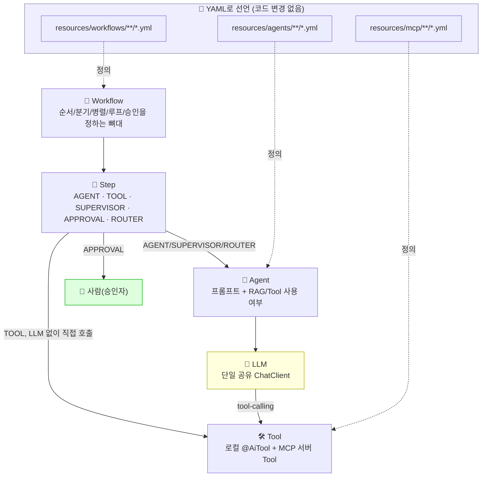
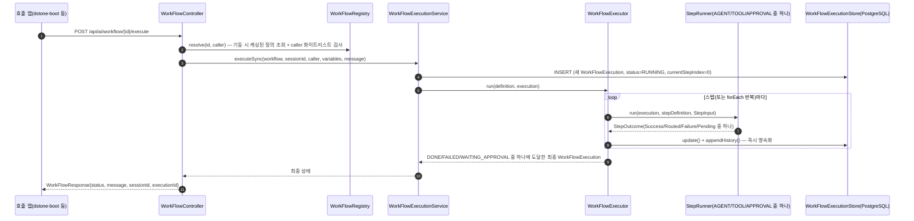
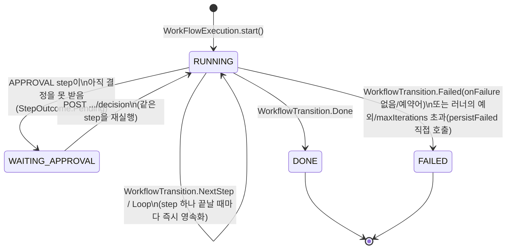
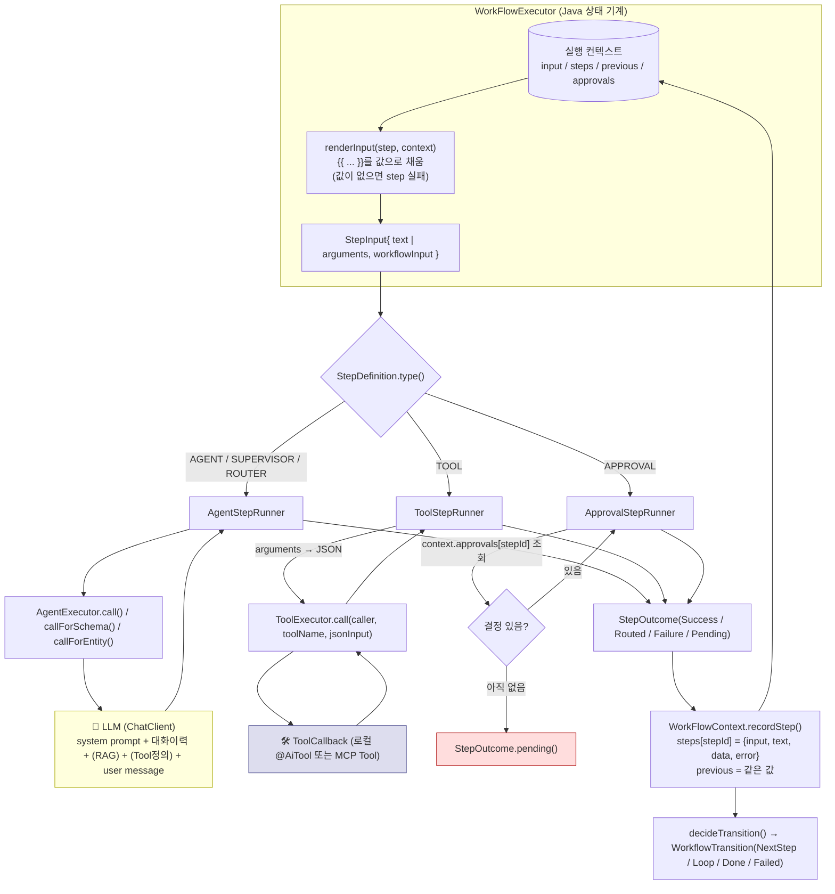
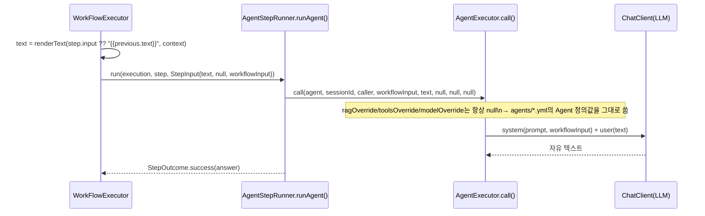
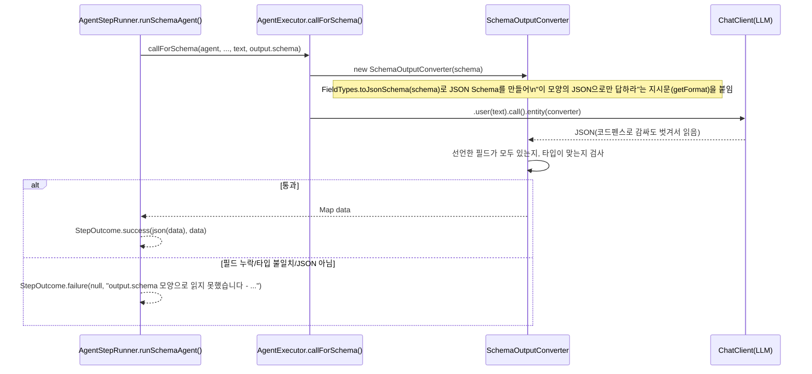
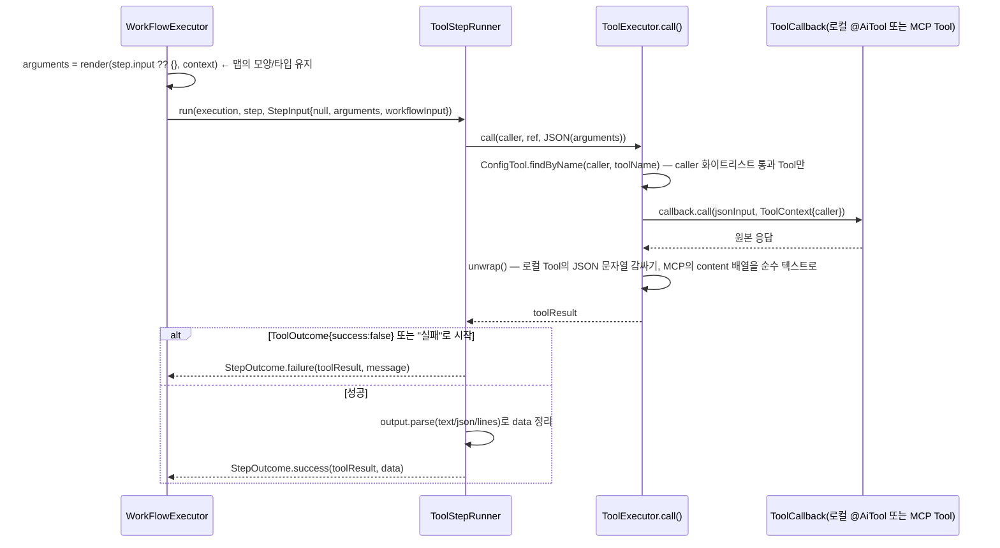
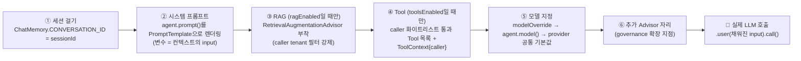
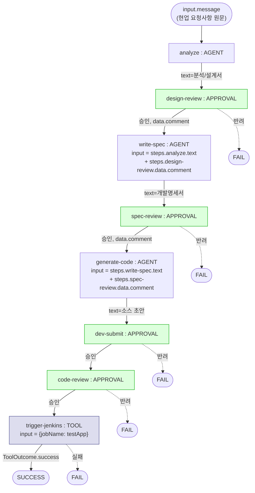

# dstone-ai-engine 🤖

> 2026-09-15 전면 재설계(Phase 0~10의 capability/process 기반 구현을 전부 삭제하고 **Workflow → Step →
> Agent → Tool** 4계층 + YAML 선언적 정의로 새로 지음) 이후, 2026-09-18에 두 번째 구조 개편(**휴먼
> 승인(HITL)**, **PostgreSQL 기반 영속화된 실행 상태**, **MCP 클라이언트**, **Embedding/RAG 책임
> 분리**), 2026-09-20에 세 번째 개편(**구조화 계약**, **ROUTER 다지 분기**, **동적 팬아웃**),
> 2026-09-24에 네 번째 개편(**step 간 I/O 규약 - 실행 컨텍스트 + `{{ }}` 템플릿 + 기동 시점 참조 검증**)을
> 거쳤다. 이 문서는 2026-09-24 시점의 최신 구조를 다룬다 - 그 이전 세대의 역사는 git log와 [14절](#14-이전-구조에서-달라진-점)에서
> 찾을 수 있다. **특히 6절은 "Workflow → Step → Agent/Approval/Tool → LLM 사이에 정확히 어떤
> 데이터가 어떤 모양으로 오가는가"만 집중적으로 다루는 절이다 - 이 엔진을 처음 만지거나 새 Workflow를
> 설계할 때는 6절부터 읽는 것을 권한다.**

## 목차

1. [개요](#1-개요)
2. [설계 원칙](#2-설계-원칙)
3. [패키지 구조](#3-패키지-구조)
4. [정의(Definition) → 실행(Runtime) 흐름](#4-정의definition--실행runtime-흐름)
5. [Workflow 실행 모델](#5-workflow-실행-모델)
6. [Step IN/OUT 완전 참조 — Workflow → Step → Agent/Approval/Tool → LLM](#6-step-inout-완전-참조--workflow--step--agentapprovaltool--llm)
7. [Agent와 Tool](#7-agent와-tool)
8. [Session / Embedding·RAG / Security / MCP](#8-session--embeddingrag--security--mcp)
9. [Governance 확장 지점](#9-governance-확장-지점)
10. [YAML 정의 작성법](#10-yaml-정의-작성법)
11. [API 레퍼런스](#11-api-레퍼런스)
12. [설정 레퍼런스](#12-설정-레퍼런스-confapplicationyml)
13. [빌드 및 실행](#13-빌드-및-실행)
14. [검증 상태](#14-검증-상태)
15. [이전 구조에서 달라진 점](#15-이전-구조에서-달라진-점)

---

## 1. 개요

`dstone-ai-engine`은 Spring AI 기반의 provider-agnostic AI 서빙 엔진이다. 핵심 아이디어는
"AI 에이전트 프로그램의 Workflow는 누가 제어하는가?"라는 질문에 대한 답이다:

```text
Workflow의 뼈대(순서/분기/병렬/루프/재시도 한도/승인 대기)는 Java(WorkFlowExecutor)가 잡고,
Step 내부의 지능적인 판단(SQL 분석, 변환 전략, 오류 원인 파악, Tool 선택)은 LLM에게 맡긴다.
```

Workflow/Agent/MCP 서버가 무엇을 할지는 자바 코드가 아니라 **YAML 파일**로 선언한다 -
`resources/workflows/**/*.yml`, `resources/agents/**/*.yml`, `resources/mcp/**/*.yml`을
추가/수정하는 것만으로 새 업무를 등록할 수 있고, `application.yml`이나 Java 코드를 건드릴 필요가
없다.



Workflow 실행 하나하나는 이제 이름 없는 함수 호출이 아니라 **PostgreSQL에 영속화된 실행
객체**(`WorkFlowExecution`)다 - 그래서 APPROVAL 스텝에서 멈췄다가 외부 신호(승인/반려)로 재개할
수 있고, 스텝 하나하나가 언제 무엇을 어떻게 처리했는지 DB와 로그 양쪽에서 감사할 수 있다.

## 2. 설계 원칙

- **엔진 전체가 단일 LLM Provider를 공유한다.** Agent별로 다른 provider를 쓰는 기능은 없다 -
  `spring.ai.model.chat` 하나로 전체가 움직인다. 그 provider 안에서 **모델**만 Agent별로
  override할 수 있다(`agents/*.yml`의 `model` 필드, 비우면 공통 기본값).
- **모든 Step은 하나의 인터페이스로 균일하게 실행된다.** `runtime.step.StepRunner.run(execution,
  definition, input)` 시그니처 하나를 StepType 5가지(AGENT/TOOL/SUPERVISOR/APPROVAL/ROUTER)가 전부
  거쳐간다 - `WorkFlowExecutor`가 StepType별로 다르게 호출하지 않고, `common.config.ConfigCallLog`의
  AOP 로깅도 이 메서드 하나만 겨냥해서 모든 스텝의 IN/OUT을 균일하게 남긴다(자세한 로그 형태는
  [5절](#5-workflow-실행-모델) 말미 참고, 데이터 모양 자체는 [6절](#6-step-inout-완전-참조--workflow--step--agentapprovaltool--llm)에서 깊게 다룬다).
- **Workflow의 조립과 step 사이의 데이터 흐름은 100% YAML로 한다.** 각 step은 `input`에 무엇을 받을지
  (`{{ ... }}` 참조), `output`에 data를 어떤 모양으로 낼지를 선언하고, 모든 데이터는 실행 컨텍스트 트리
  하나를 거쳐 오간다. 템플릿 표현식은 "값 참조"와 "대체값(`??`)"만 허용한다 - 가공 로직은 Tool(부품)로 뺀다.
  Java는 새 부품(Tool, StepType)을 만들 때만 건드린다([6절](#6-step-inout-완전-참조--workflow--step--agentapprovaltool--llm)).
- **잘못 조립된 YAML은 기동 시점에 드러난다.** `WorkFlowRegistry`가 모든 `{{ }}` 참조(없는 step, schema에
  없는 키, 선언되지 않은 입력 등)와 step 모양을 검사해서 하나라도 틀리면 엔진 기동을 멈추고,
  `YamlDefinitionLoader`는 모르는 YAML 키를 만나면 파일 경로와 함께 실패한다([4절](#4-정의definition--실행runtime-흐름)).
- **실행 상태는 스텝(또는 forEach 반복)마다 즉시 영속화된다.** 그래서 APPROVAL 대기, 서버 재기동
  어느 쪽이든 마지막으로 끝낸 지점부터 재개할 수 있다([5절](#5-workflow-실행-모델)).
- **ERROR(시스템 예외)와 FAILURE(비즈니스 실패)를 분리한다.** TOOL의 `"실패:"` 접두어 판정을
  예외 상황까지 확장하면 "DB가 죽어서 응답을 못 받은 것"과 "SQL 문법이 틀린 것"이 같은
  `onFailure` 분기(재작성 루프 등)로 흘러가 오탐/무한 재시도로 이어질 수 있어, 러너가 던진
  예외는 `onFailure`를 거치지 않고 즉시 실행을 FAILED로 종료시킨다(forEach 반복 중 하나가 던져도 같다).
  반면 input 템플릿이 가리키는 값을 못 찾은 것은 YAML 조립상의 비즈니스 실패라 step 실패로 처리되어
  `onFailure`를 따른다.
- **RAG는 별도 실행 단위가 아니라 Agent의 능력이다.** "검색 결과를 프롬프트에 어떻게 꽂을지"는
  LLM 호출과 분리될 수 없는 문제라, 독립된 StepType으로 두지 않는다([8절](#8-session--embeddingrag--security--mcp)).
- **람다식을 지양한다.** 컬렉션 처리는 `for`문, 함수형 인터페이스가 필요한 자리는 익명 클래스로
  구현한다. `switch (status) { case X -> ... }` 형태의 enhanced switch는 예외로 그대로 쓴다.
- **dstone-common을 최대한 재사용한다.** Redis는 `RedisUtil`, 설정 읽기/ENC 복호화는
  `ConfigProperty`, 로깅은 `LogUtil.sysout()`, 컨트롤러/서비스 베이스는
  `BaseController`/`BaseService`/`BaseObject`를 그대로 쓴다.
- **governance(PII/민감어 가드레일, 사용량 로깅·쿼터)는 범위 밖이지만 확장 지점은 유지한다**
  ([9절](#9-governance-확장-지점)).

## 3. 패키지 구조

> **2026-09-23 정리**: 예전에는 `common.definition`에 YAML 바인딩 record와 enum(`StepType`,
> `McpTransport`)이 섞여 있었고, `runtime.status`라는 패키지 하나에 성격이 전혀 다른 타입 10개
> (상태 enum, IN/OUT record, LLM 구조화 응답 스키마)가 뭉쳐 있었다. 이번에 `common.definition`은
> "YAML이 그대로 바인딩되는 record"만 남기고, enum은 `common.consts`로, `runtime.status`의 타입들은
> 각자의 실제 주인 패키지로 재배치했다 - `runtime.status` 패키지 자체는 폐지됐다. 자세한 배경은
> [15절 맨 위 항목](#2026-09-23-타입패키지-정리)과 `docs/temp/dstone-ai-engine-refactory-20260923.md` 참고.

```text
net.dstone.ai
├── DstoneAiEngineApplication.java
│
├── common/
│   ├── annotation/AiTool.java             Tool 등록 마커 애노테이션
│   ├── exec/ExternalProcessRunner.java    shell/python Tool이 공유하는 프로세스 실행기
│   │
│   ├── consts/                            enum과 상수(로직 없음, YAML 바인딩 대상 아님)
│   │   ├── Constants.java                 설정 키 이름·예약어 등 문자열/숫자 상수
│   │   ├── StepType(AGENT/TOOL/SUPERVISOR/APPROVAL/ROUTER) - kind()로 AGENT_CALL(LLM 호출:
│   │   │   AGENT/SUPERVISOR/ROUTER) / DETERMINISTIC(LLM 미호출: TOOL/APPROVAL) 분류도 제공
│   │   ├── ToolParse(TEXT/JSON/LINES)     TOOL step output.parse - Tool 응답을 data로 정리하는 방법
│   │   └── McpTransport(STDIO/SSE)
│   │
│   ├── definition/                        YAML → 바인딩되는 순수 record만(enum은 consts로 이동)
│   │   ├── WorkFlowDefinition(inputs/output 포함), StepDefinition(input/output/forEach)
│   │   ├── StepOutputDefinition(schema | parse+pattern), FieldDefinition(type, description)
│   │   ├── AgentDefinition(prompt 필드에 시스템 프롬프트 원문 직접 보유)
│   │   └── McpServerDefinition
│   │
│   ├── template/Template.java             {{ ... }} 참조/?? 대체값 렌더링 + 참조 목록 추출(기동 시 검증용)
│   ├── schema/FieldTypes.java             FieldDefinition 타입 이름 검사, JSON Schema 변환, 값 타입 검사
│   │
│   ├── loader/YamlDefinitionLoader.java   classpath:workflows/**/*.yml, agents/**/*.yml, mcp/**/*.yml 파싱
│   ├── registry/                          WorkFlowRegistry(기동 시 참조/모양 검증), AgentRegistry, McpServerRegistry
│   │
│   ├── config/                            Config, ConfigChatClient, ConfigRedis, ConfigTool, ConfigMcp, ConfigCallLog
│   ├── rag/RagRetrievalChain.java         검색 체인(RAG) - 적재(Embedding)와는 분리된 클래스([8절](#8-session--embeddingrag--security--mcp))
│   ├── session/RedisChatMemorySession.java  Spring AI ChatMemoryRepository의 Redis 구현체
│   └── security/                          ApiKeyAuthFilter, RateLimitFilter, CallerContext
│
├── runtime/
│   ├── agent/AgentExecutor.java           Agent 하나를 실제로 호출(ChatClient 요청 조립)하는 유일한 지점. call()(자유 텍스트)/
│   │                                       callForSchema()(output.schema AGENT)/callForEntity(Class)(Verdict/RouteDecision)/stream()
│   │   ├── SchemaOutputConverter          output.schema → JSON Schema 지시문 + 응답 파싱/검증
│   │   ├── Verdict                        SUPERVISOR가 받는 LLM 구조화 응답 스키마(pass/reason)
│   │   └── RouteDecision                  ROUTER가 받는 LLM 구조화 응답 스키마(route/reason)
│   │
│   ├── tool/ToolExecutor.java             TOOL step이 Tool을 LLM 없이 직접 호출하는 유일한 지점
│   │   └── ToolOutcome                    Tool이 돌려줄 수 있는 구조화 응답 스키마(success/message)
│   │
│   ├── step/                              StepRunner(공통 인터페이스)의 IN/OUT과 구현체가 함께 있는 패키지
│   │   ├── StepInput                      StepRunner.run()의 입력(text | arguments, workflowInput) - 템플릿은 이미 채워진 상태
│   │   ├── StepOutcome                    StepRunner.run()의 출력 - sealed interface(Success/Routed/Failure/Pending)
│   │   ├── StepRunner                     공통 인터페이스
│   │   └── AgentStepRunner(AGENT/SUPERVISOR/ROUTER), ToolStepRunner, ApprovalStepRunner
│   │
│   └── workflow/
│       ├── WorkFlowExecutor.java          순차/분기(2지선다·ROUTER 다지선다)/병렬(forEach)/루프/승인대기 상태 기계,
│       │                                   step input 템플릿 렌더링과 결과의 컨텍스트 기록도 여기서 한다
│       ├── WorkflowTransition             WorkFlowExecutor가 스텝 하나를 끝낸 뒤의 전이 결정 - sealed interface
│       │                                   (NextStep/Loop/Done/Failed), 옛 StepFlow+StepStatus를 대체(6가지 중
│       │                                   실사용되지 않던 ERROR/WAITING_APPROVAL 값은 정리하며 제거)
│       └── execution/                     WorkFlowExecution, WorkFlowContext(실행 컨텍스트 트리 도구), WorkFlowExecutionStatus,
│                                           StepHistoryEntry, WorkFlowExecutionStore(JdbcTemplate)
│
├── tools/                                 @AiTool 구현체
│   ├── ExternalProcessTool                Shell/Python 공통 골격(추상 클래스)
│   └── sample/DateTimeTool, sql/SqlSyntaxTool, rag/RagSearchTool, shell/ShellExecTool,
│       python/PythonExecTool, http/HttpCallTool, jenkins/JenkinsTriggerBuildTool
│
└── api/
    ├── dto/                               ChatRequest·Response, WorkFlow*(Request/Response/Submit/Status/ExecutionSummary/ExecutionDetail/Decision), Ingest*, RagSearchRequest, RetrievedChunk
    ├── controller/                        ChatController, WorkFlowController, WorkFlowExecutionController, EmbedController, RagController
    └── service/                           WorkFlowExecutionService(동기/비동기/승인재개 단일 진입점), EmbedService(문서 임베딩 적재/삭제)
```

## 4. 정의(Definition) → 실행(Runtime) 흐름



`common.loader.YamlDefinitionLoader`는 `PathMatchingResourcePatternResolver`로
`classpath*:workflows/**/*.yml` / `agents/**/*.yml` / `mcp/**/*.yml`을 찾고, SnakeYAML로 파싱한 뒤
Jackson `ObjectMapper.convertValue()`로 definition record에 바인딩한다. 패턴의 `**`가 하위 디렉토리를
몇 단계든 재귀적으로 포함하므로, `resources/agents/*.yml`처럼 디렉토리 바로 아래에 파일을 두든
`resources/agents/testApp/*.yml`처럼 프로젝트/도메인별 서브 디렉토리로 나눠서 관리하든 상관없다 -
실제로 이 엔진 안에도 데모용 `agents/sample/`·`workflows/sample/`와, 실제 SI 프로젝트(testApp)를
겨냥한 `agents/testApp/`·`workflows/testApp/`가 함께 들어 있다([10절](#10-yaml-정의-작성법) 표 참고).
Workflow/Agent/MCP 서버를 구분하는 키는 파일 경로가 아니라 YAML 안의 `id`/`name` 필드이므로(각
Registry가 그 값으로 중복을 검사한다), 서브 디렉토리 구성은 순전히 파일 정리 목적일 뿐 동작에는
영향이 없다. `WorkFlowRegistry`/`AgentRegistry`/`McpServerRegistry`는 `@PostConstruct`에서 이
로더를 한 번 호출해 캐싱해두고, 이후 조회는 전부 메모리에서 이뤄진다(재적재는 재기동이 필요하다 -
핫 리로드는 범위 밖).

**2026-09-23부터 `${VAR_NAME}` 플레이스홀더도 지원한다.** 이 YAML들은 `application.yml`과 달리
Spring이 읽는 게 아니라서 원래는 `${...}` 값이 자동으로 채워지지 않는다. 그런데 실행 환경(로컬
Windows/WSL/k8s)마다 달라져야 하는 절대경로 같은 게 YAML 문자열 안에 있으면 곤란하므로,
SnakeYAML이 만든 Map을 그대로 record에 바인딩하기 직전에 `YamlDefinitionLoader`가 모든 문자열
값(중첩된 Map/List 포함) 안의 `${VAR_NAME}` 토큰을 System 프로퍼티로 치환한다 - 이 System
프로퍼티는 `conf/env{-profile}.properties`가 기동 시 그대로 심어 둔 값들이다
(`DstoneAiEngineApplication.setSysProperties()`, `application.yml`의 `${APP_HOME}` 등과 원리가
같다). 찾지 못하면 OS 환경변수도 한 번 더 찾아보고, 그래도 없으면 `${VAR_NAME}` 문자열을 그대로
남겨둔다(조용히 지워버리면 설정을 빠뜨렸을 때 원인 찾기가 어려워지기 때문). `resources/mcp/sample/
sample-filesystem-mcp.yml`의 노출 경로(`${APP_HOME}/${APP_NAME}/mcp/server-filesystem`)가
실제 사용 예다 - 자세한 내용은 [8절](#8-session--embeddingrag--security--mcp)에서 다룬다.
`${...}`(기동 시 환경값)와 `{{ ... }}`(실행 중 데이터 참조, [6.3절](#6-step-inout-완전-참조--workflow--step--agentapprovaltool--llm)) 은 모양도
시점도 다른 별개의 기능이다.

**잘못된 YAML은 기동을 멈춘다.** `YamlDefinitionLoader`는 파일 하나를 읽다 실패하면(YAML 문법 오류,
record에 없는 키 - 예: 폐지된 `inputTemplate` - , 값 모양이 다름) 파일 경로를 담은 예외를 던진다.
이어서 `WorkFlowRegistry`가 Workflow마다 step 모양(AGENT류 input은 문자열/TOOL input은 맵, schema는
AGENT만, parse/pattern은 TOOL만 등)과 모든 `{{ }}` 참조(시작 이름, step id, 필드 이름, `steps.X.data.키`가
실제로 X가 내놓는 키인지, `input.이름`이 `inputs`에 선언됐는지)를 검사하고, 하나라도 틀리면
`workflow[id]의 step[id]: {{...}}의 경로 '...' - 이유` 형태의 메시지로 기동을 멈춘다.

## 5. Workflow 실행 모델

`WorkFlowDefinition.steps`는 `StepDefinition` 목록이다. 각 step은 `id`/`type`/`ref`와
`onSuccess`/`onFailure`(다음 step id, 또는 예약어 `SUCCESS`/`FAIL`)를 갖는다. `WorkFlowExecutor`는
`execution.currentStepIndex()`부터 이어서 이 정의를 따라가는 상태 기계다 - 새 실행이면 0부터,
APPROVAL에서 재개하는 실행이면 멈췄던 그 스텝부터 다시 실행된다.



**Step 종료 경우의 수(`runtime.workflow.WorkflowTransition`, sealed interface)**: `NextStep`(다음
스텝으로) / `Loop`(이전 스텝으로 되돌아감, `maxIterations`가 무한루프를 막음) / `Done`(Workflow 정상
종료) / `Failed`(Workflow 실패 종료), 이 4가지뿐이다. 러너 예외와 승인 대기는 이 타입을 거치지
않는다 - 예외는 `WorkFlowExecutor.run()`이 곧장 `persistFailed()`로, 승인 대기는 `StepOutcome.Pending`을
본 즉시 `WorkFlowExecutor`가 직접 처리한다. `maxIterations`를
비워두면 `Constants.WorkFlow.DEFAULT_MAX_ITERATIONS`(현재 **10**)이 대신 쓰인다.

**성공/실패 판정 관례**: AGENT step은 `output.schema`가 없으면 항상 성공이고, 있으면 LLM이 그 모양을
지키지 않았을 때만 실패한다(fail-closed). TOOL step은 `ToolOutcome(success, message)`(구조화 값, 권장)를
우선으로 보고, Tool이 그 타입을 반환하지 않으면 응답 텍스트가 `"실패"`로 시작하는지로 판정한다
(`output.parse: json`인데 응답이 JSON이 아니어도 실패). SUPERVISOR step은 구조화 출력
(`runtime.agent.Verdict(pass, reason)`)으로 `verdict.pass()`가 명시적으로 `true`일 때만 성공(그 외
전부 fail-closed). APPROVAL step은 사람의 결정(`approved`)으로 성공/실패가 갈린다. 모든 step 공통으로,
input 템플릿이 가리키는 값을 찾지 못하면 실패다. **각 판정 방식이 실제로 어떤 데이터를 주고받는지는
[6절](#6-step-inout-완전-참조--workflow--step--agentapprovaltool--llm)에서 타입별로 표와 예시로 정리한다.**

**다지 분기(`StepType.ROUTER`)**: `onSuccess`/`onFailure` 2지선다로는 업무 로직상 3갈래 이상 분기
(예: 문의 유형별 라우팅)를 표현하려면 SUPERVISOR를 여러 겹 쌓아야 한다. ROUTER는 구조화 출력
(`runtime.agent.RouteDecision(route, reason)`)으로 LLM이 `StepDefinition.routes`(route 이름 →
다음 step id, `SUCCESS`/`FAIL` 예약어도 값으로 쓸 수 있음)에 정의된 이름표 중 하나를 고르게 하고,
`WorkFlowExecutor`가 그 route로 바로 다음 step을 찾는다(`onSuccess`/`onFailure`는 아예 안 봄). LLM이
고른 route가 `routes`에 없으면(오타/환각) Workflow가 FAILED로 끝난다. `forEach`와는 함께
쓸 수 없다(`WorkFlowRegistry`가 기동 시 검증) - 반복 중 "누구의 route를 따라야 하는지"가 모호해지기
때문이다.

**병렬 실행은 `StepDefinition.forEach` 한 가지로만 표현한다.** "서로 다른 step을 YAML 작성 시점에
정해둔 개수만큼 묶는" 정적 그룹 개념은 없다 - 개념이 두 개면 YAML을 읽을 때마다 "이건 어느 쪽이지"를
판단해야 하므로, forEach 하나로 통일했다. `forEach`에는 리스트를 가리키는 참조 경로를 적는다 -
요청 값(`input.sqlList`)이든 앞 step의 결과(`steps.list.data.lines`)든 상관없고, 항목 개수를 YAML 작성
시점에 몰라도 된다. 그 항목 수만큼 같은 step 하나를 `CompletableFuture`로 동시에 실행하며, 각 반복은
컨텍스트 복사본에 자기 항목을 `itemVariable`(기본값 `item`)이라는 이름으로 받아 `{{item}}`으로 쓴다.
반복별 결과는 `steps.<stepId>.items[i]`에 `{input, text, data, error}`로 순서대로 남고, `steps.<stepId>.text`는
반복별 text를 줄바꿈으로 이은 값이다(`StepHistoryEntry`도 반복 수만큼, id는 `<stepId>[<순번>]`). 반복이
하나라도 실패하면 step 전체가 실패다. `forEach` 경로의 값이 없거나 리스트가 아니면 step 실패로 처리된다.
"서로 다른 tool/agent를 동시에 호출"하는 것처럼 반복마다 대상 자체가 달라지는 조합은 이 방식으로
표현할 수 없다 - 그런 경우는 순차 실행으로 풀어야 한다. `APPROVAL`/`ROUTER`와는 함께 쓸 수 없다
(`WorkFlowRegistry`가 기동 시 검증) - APPROVAL은 승인/반려 결정이 stepId 하나로만 식별되어 반복별로
구분할 방법이 없고, ROUTER는 반복 중 어느 route를 따라야 하는지가 모호해지기 때문이다.

**APPROVAL 스텝과 재개**: `ApprovalStepRunner`도 다른 러너와 완전히 동일하게 `StepRunner.run()`
한 번으로 호출된다 - `WorkFlowExecutor`가 APPROVAL을 미리 갈라내는 특수 분기는 없다.
컨텍스트의 `approvals.{stepId}`에 결정이 없으면 `PENDING`을 반환해 `WorkFlowExecutor`가 실행을
`WAITING_APPROVAL`로 멈추고, `POST /api/ai/workflow/executions/{executionId}/decision`이 호출되면
그 결정을 `approvals`에 기록한 뒤 **같은 스텝을 다시 실행**한다 - 이번엔 결정이 있으니
`SUCCESS`(승인)/`FAILURE`(반려)를 반환해 정상적으로 `onSuccess`/`onFailure`로 흘러간다. 즉 "재개"는
엔진 입장에서 특별한 코드 경로가 아니라 그냥 같은 스텝의 재실행이다. 한 번 기록된 결정은 그 실행이
끝날 때까지 지워지지 않으므로, "반려되면 앞 단계로 되돌아가 다시 시도"하는 루프 구성은 안전하지
않다(되돌아가도 같은 step id가 예전 반려 결정을 그대로 다시 읽어 즉시 또 반려된다) - 승인 게이트의
`onFailure`는 항상 `FAIL`로 끝내고, 고쳐서 다시 시도하고 싶으면 새 실행을 시작하는 편이 안전하다
(`workflows/testApp/testApp-sdlc.yml` 참고). `forEach`와는 함께 쓸 수 없다 - 승인/반려
결정이 stepId 하나로만 식별되는데 반복마다 서로 다른 결정을 구분할 방법이 없으며,
`WorkFlowRegistry`가 기동 시 그런 조합을 걸러낸다.

**영속화(`runtime.workflow.execution`)**: 실행 하나(`WorkFlowExecution`)는 PostgreSQL
`AI_WORKFLOW_EXECUTION` 테이블 한 행이고, 스텝 실행 기록(`StepHistoryEntry`)은
`AI_WORKFLOW_EXECUTION_STEP_HISTORY`에 스텝마다 한 행씩 쌓인다(같은 스텝을 재실행하면 또 쌓인다).
`WorkFlowExecutionService`가 동기(`/execute`)/비동기(`/submit`)/승인 재개(`/decision`) 세 진입
경로 전부의 단일 진입점이다 - 셋 다 "실행 상태를 만들거나 불러와서 `WorkFlowExecutor`에 넘긴다"는
같은 흐름을 탄다.

**로깅**: `common.config.ConfigCallLog`가 AOP(`@Around`)로 `WorkFlowExecutor.run(..)` /
`StepRunner+.run(..)`(AGENT/TOOL/SUPERVISOR/APPROVAL/ROUTER 전부 이 한 메서드로 모임) /
`AgentExecutor.*(..)` / `tools.*` 패키지의 모든 public 메서드, 이 네 지점을 감시한다. 호출이
시작될 때와 끝날 때 각각 구분선(`|----...----|`)으로 둘러싸인 블록을 로그로 남기는데, 형태는
다음과 같다(logfmt 한 줄이 아니라 사람이 눈으로 읽기 좋은 여러 줄짜리 블록이다):

```text
|--------------------------------------------------------------------------------------------------------------------------------------|
[StepRunner - step(id=extract, type=AGENT, ref=sample-structured-extract-agent)] Start !!!
<input>
[WorkFlowExecution(executionId=..., ...), StepDefinition(id=extract, type=AGENT, ...), StepInput[text=..., arguments=null, workflowInput={message=...}]]
|--------------------------------------------------------------------------------------------------------------------------------------|

|--------------------------------------------------------------------------------------------------------------------------------------|
[StepRunner - step(id=extract, type=AGENT, ref=sample-structured-extract-agent)] End !!!
<output>
Success[text={"sql":"..."}, data={sql=...}]
|--------------------------------------------------------------------------------------------------------------------------------------|
```

인자와 반환값의 `toString()`을 그대로 찍기 때문에, 이 절의 Start/End 블록만 눈으로 따라가도 그
스텝에 무엇이 들어가서 무엇이 나왔는지 정확히 확인할 수 있다. `WorkFlowExecutor.run(..)`은 Workflow
실행 1건 전체의 시작/끝을, `AgentExecutor.*(..)`는 LLM 호출 1건의 시작/끝을, `tools.*`는 Tool 호출
1건의 시작/끝을 같은 방식으로 남긴다 - 네 지점이 같은 로거(`net.dstone.ai`)로 모여
`LOGS/dstone-ai-engine/execution/execution.log` 한 파일에 순서대로 쌓이므로(`log4j2.xml`), 같은
시간대나 같은 executionId 문자열로 grep하면 "Workflow → Step → Agent/Tool" 호출 흐름 전체를 로그
파일 하나에서 그대로 재구성할 수 있다. 다만 "다음에 어느 스텝으로 갈지"(성공하면 다음 스텝으로,
실패하면 되돌아가는 등)는 이 로그에 없다 - 그 판단은 스텝이 다 끝난 뒤에 `WorkFlowExecutor`가
내리기 때문에, 로그가 찍히는 시점에는 아직 알 수 없다. 대신 같은 executionId로 로그를 검색해 보면
스텝이 실행된 순서 자체가 곧 Workflow가 진행된 흐름이므로, 그것만으로도 충분히 흐름을 파악할 수
있다.

## 6. Step IN/OUT 완전 참조 — Workflow → Step → Agent/Approval/Tool → LLM

이 절은 데이터 하나가 "Workflow 호출" → "Step" → "Agent 또는 Tool 또는 사람" → (필요하면) "LLM"을
거쳐 다시 "다음 Step"으로 흘러가는 전 과정을, 실제 코드에 있는 그대로(레코드 필드 이름까지) 따라간다.
설계 배경은 `docs/temp/dstone-ai-engine-refactory-20260924-1.md`에 있다.

**한 줄 요약**: step 사이의 데이터는 전부 **실행 컨텍스트 트리 하나**를 거쳐 오가고, 각 step은
YAML의 `input`에 "무엇을 받을지"를 `{{ ... }}` 참조로, `output`에 "data를 어떤 모양으로 낼지"를
선언한다. 템플릿은 step 종류와 상관없이 **엔진(`WorkFlowExecutor`)이 한 곳에서** 채운다.

### 6.1 계층별 I/O 한눈에 보기

```text
사용자 → Workflow    : {message, variables}          →  {status, message(= Workflow output), executionId}
Workflow → Step      : input 템플릿을 채운 값          →  StepOutcome{text, data, route | failureReason}
Step(AGENT류) → Agent : system = agents/*.yml의 prompt, user = 채워진 input(문자열), 응답 모양 = output.schema
Agent → LLM → Tool   : Spring AI tool-calling(@Tool의 JSON 스키마) — 엔진이 규정하지 않는 구간
Step(TOOL) → Tool    : 채워진 input(맵 → JSON 인자)  →  output.parse로 data 정리
```

엔진이 규약을 갖는 곳은 **Workflow ↔ Step 경계 하나**다. `Agent → LLM → Tool` 구간은 LLM이 판단하는
영역이라 Spring AI에 맡긴다.



### 6.2 실행 컨텍스트 — 모든 상태를 담는 트리 하나

`runtime.workflow.execution.WorkFlowContext`가 만들고 고치는 평범한 `Map`이다. 그대로 JSON으로
`AI_WORKFLOW_EXECUTION.CONTEXT_JSON`(JSONB)에 저장되고, 실행 상세 API(`GET /api/ai/workflow/executions/{id}`)의
`context` 필드로 그대로 보인다.

```yaml
input:                     # 실행 요청이 넣은 값. Workflow를 시작할 때 한 번 채워지고 바뀌지 않는다
  message: "사용자 메시지"   # WorkFlowRequest.message
  sqlList: [...]           # WorkFlowRequest.variables의 각 값
steps:                     # step이 끝날 때마다 자기 id 아래에 결과를 남긴다(루프로 다시 돌면 덮어씀)
  analyze:
    input: "채워진 입력"     # 이 step이 실제로 받은 값(TOOL이면 인자 맵)
    text:  "결과 텍스트"
    data:  { tables: [...] }
    error: null            # 실패했을 때의 사유
  validate-each:           # forEach step
    text:  "반복별 text를 줄바꿈으로 이은 값"
    error: "실패한 반복들의 사유"
    items: [ { input, text, data, error }, ... ]   # 반복 순서대로
previous:                  # 바로 직전에 "실제로 실행된" step의 결과(첫 step에서는 { text: message })
approvals:                 # APPROVAL 결정 수신함(엔진 내부용, 템플릿에서는 steps.id.data로 읽는다)
  design-review: { approved, approver, comment }
```

- `previous`는 "목록상 바로 앞 step"이 아니라 **실제로 바로 직전에 실행된 step**이다. onFailure
  루프로 되돌아왔을 때도 올바른 값을 가리킨다.
- 컨텍스트 트리의 이름들은 `Constants.WorkFlow.Context`에 모여 있다.

### 6.3 템플릿 문법 — `{{ ... }}`

`common.template.Template`이 담당한다. **값 참조와 대체값(`??`) 두 가지만** 지원한다 - 계산식이나
조건식이 필요하면 Tool로 만들어 TOOL step으로 처리한다(YAML이 프로그래밍 언어가 되지 않게 하기 위해).

| 문법 | 의미 |
|---|---|
| `{{input.message}}` | 실행 요청의 값 |
| `{{steps.analyze.text}}` / `.data.키` / `.input.인자` / `.error` / `.items.0.text` | 특정 step의 결과 |
| `{{previous.text}}` / `{{previous.data.키}}` | 직전에 실행된 step의 결과 |
| `{{item}}`(또는 `itemVariable`로 정한 이름) | forEach 반복 중 이번 항목(forEach step의 input 안에서만) |
| `{{a.b ?? c.d ?? e}}` | 왼쪽부터 차례로 찾아 처음으로 값이 있는 것을 씀 |

- **채우는 규칙**: 문자열 안에 섞여 있으면 값을 글자로 끼운다(맵/리스트는 JSON 글자). 값 전체가
  `{{ ... }}` 하나뿐이면 **원래 타입을 유지**한다(TOOL 인자에 리스트나 숫자를 그대로 넘길 때).
- **값이 없으면 실패한다(fail-closed)**: 가리킨 경로가 없거나 값이 null이면 빈 글자로 넘어가지 않고
  그 step이 실패한다(error에 "어떤 표현식이 어떤 경로를 찾았는지"가 남고, onFailure를 따른다).
  대체값이 필요하면 `??`를 쓴다.
- **`${...}`와는 다른 것이다**: `${APP_HOME}` 같은 값은 **기동 시** `YamlDefinitionLoader`가 환경값으로
  바꾼다([4절](#4-정의definition--실행runtime-흐름)). `{{ ... }}`는 **실행 중** 데이터를 가리킨다.
- **Agent의 system prompt와 섞이지 않는다**: `agents/*.yml`의 `prompt`는 지금처럼 ST4 `{변수}`
  문법이고, 그 변수로는 컨텍스트의 `input` 맵(평평한 키)만 넘어간다. step의 데이터는 step의 `input`
  템플릿으로 채워져 **사용자 메시지**로 들어간다 - "Agent YAML = 역할", "step input = 이번에 할 일과
  데이터"로 역할이 나뉜다.

### 6.4 StepType별 IN/OUT

모든 StepType은 `StepRunner.run(WorkFlowExecution, StepDefinition, StepInput) : StepOutcome` 하나를
거친다.

**`StepInput(text, arguments, workflowInput)`** — 엔진이 채워서 넘긴다. AGENT류/APPROVAL은 `text`,
TOOL은 `arguments`를 쓰고, `workflowInput`(컨텍스트의 `input`)은 Agent system prompt의 `{변수}`를
채우는 데 쓴다.

**`StepOutcome`**(sealed interface) — `Success(text, data)` / `Routed(text, data, route)` /
`Failure(text, failureReason)` / `Pending()`. 엔진은 이것을 컨텍스트에 `{input, text, data, error}`로
남긴다(`error` = `failureReason`).

| StepType | `input` 모양(생략 시) | `output` | `text` | `data` | 실패하는 경우 |
|---|---|---|---|---|---|
| AGENT | 문자열 (`{{previous.text}}`) | 없음 | LLM 답변 원문 | `{}` | 없음(항상 성공) |
| AGENT | 문자열 (`{{previous.text}}`) | `schema` | data의 JSON 글자 | schema대로 읽은 값 | LLM이 schema를 지키지 않음 |
| SUPERVISOR | 문자열 (`{{previous.text}}`) | 쓸 수 없음 | 받은 input 그대로 | `{pass, reason}` | pass=false, 응답 모양이 깨짐 |
| ROUTER | 문자열 (`{{previous.text}}`) | 쓸 수 없음 | 받은 input 그대로 | `{route, reason}` | route를 못 고름, 응답 모양이 깨짐 |
| TOOL | 맵 (`{}`) | `parse: text`(기본) | Tool 응답 원문 | `{}` | Tool이 실패로 답함 |
| TOOL | 맵 (`{}`) | `parse: json` | Tool 응답 원문 | 응답 JSON 객체(배열이면 `{items}`) | 위 + 응답이 JSON이 아님 |
| TOOL | 맵 (`{}`) | `parse: lines`(+`pattern`) | Tool 응답 원문 | `{lines: [...]}` | Tool이 실패로 답함 |
| APPROVAL | 쓸 수 없음 (`{{previous.text}}`) | 쓸 수 없음 | 받은 input 그대로 | `{approved, approver, comment}` | 반려(사유 = comment) |

- **공통**: input 템플릿이 가리키는 값을 찾지 못하면 StepRunner를 부르지 않고 실패한다(비즈니스 실패,
  onFailure를 따름). 반면 StepRunner가 던진 **예외**(외부 연결 실패 등 시스템 오류)는 onFailure를
  거치지 않고 실행 전체를 즉시 FAILED로 끝낸다([2절](#2-설계-원칙) "ERROR와 FAILURE 분리").
- **실패 사유는 텍스트에 덧붙이지 않는다.** SUPERVISOR/APPROVAL/TOOL 모두 사유를 `error`(승인은
  `data.comment`)에만 남긴다. 필요한 step이 `{{steps.judge.error}}`, `{{steps.review.data.comment}}`처럼
  명시적으로 읽는다.
- **SUPERVISOR/ROUTER/APPROVAL은 관문이다.** 받은 input을 결과 텍스트로 그대로 넘기므로, 이 뒤의
  step이 input을 생략해도(`{{previous.text}}`) 관문 앞 step의 결과를 받는다.

#### ① AGENT (output.schema 없음)



#### ② AGENT + `output.schema` — 다음 step이 쓸 데이터를 만들 때



provider 고유의 structured output 옵션은 쓰지 않고 "지시문 + 결과 검사" 방식으로만 동작한다 - 어느
provider로 바꿔도 같은 YAML이 그대로 동작하게 하기 위해서다.

#### ③ SUPERVISOR / ④ ROUTER

둘 다 `AgentExecutor.callForEntity(..., Verdict.class | RouteDecision.class)`로 Spring AI의 자바 클래스
기반 구조화 응답을 받는다. SUPERVISOR는 `verdict.pass()`가 명시적으로 `true`일 때만 성공이고(그 외
전부 fail-closed), ROUTER는 고른 `route`가 `StepDefinition.routes`에 있는지를 **한 단계 뒤에서**
`WorkFlowExecutor.decideRouterTransition()`이 확인한다(없으면 Workflow FAILED). Agent의 `prompt`가
"무엇을 판정 기준으로 삼을지", "route로 쓸 수 있는 이름이 무엇인지"를 직접 안내해야 한다.

#### ⑤ TOOL



- **결과 텍스트는 항상 Tool 응답 원문이다.** "검증받은 값"이 필요하면 다음 step이 그 값을 만든 쪽
  (`{{steps.convert.data.sql}}`)이나 검증 step이 받은 입력(`{{steps.validate.input.sql}}`)을 이름으로 읽는다.
- **구조화 데이터를 내고 싶은 로컬 Tool**은 원하는 모양의 record/Map을 반환하고, YAML에서
  `output.parse: json`을 적는다(Spring AI가 반환값을 JSON으로 바꿔 준다).
- **MCP Tool 호출은 서버별로 한 번에 하나씩 보낸다.** MCP 클라이언트 하나는 연결(STDIO면 표준 입출력
  한 쌍) 하나를 쓰므로, 동시에 요청을 보내면 `Failed to enqueue message`로 실패한다. `ConfigMcp`가
  같은 서버의 Tool들을 공용 잠금으로 감싸서(`SerializedToolCallback`) forEach나 LLM의 병렬 tool-calling이
  같은 서버를 동시에 불러도 차례대로 처리된다.

#### ⑥ APPROVAL

처음 도달하면 `context.approvals[stepId]`가 없어서 `Pending` → 실행이 `WAITING_APPROVAL`로 멈춘다.
`POST .../decision`이 결정을 `approvals[stepId]`에 기록하고 **같은 step을 다시 실행**하면, 승인은
`Success(받은 input, {approved, approver, comment})`, 반려는 `Failure(받은 input, comment)`가 된다.
"재개"는 별도 코드 경로가 아니라 같은 step의 재실행이다.

### 6.5 `AgentExecutor` 내부 — LLM에게 실제로 무엇이 나가는가

AGENT/SUPERVISOR/ROUTER가 공통으로 거치는 `AgentExecutor.buildSpec()`이 요청을 조립한다:



| LLM에 실제로 들어가는 것 | 어디서 오는가 |
|---|---|
| 시스템 프롬프트 | `AgentDefinition.prompt` — `{변수}`는 컨텍스트의 `input`(요청의 message/variables) 값으로 치환 |
| 사용자 메시지 | step의 `input` 템플릿을 채운 값(생략하면 `{{previous.text}}`) |
| 응답 모양 지시 | `output.schema`가 있으면 `SchemaOutputConverter.getFormat()`, SUPERVISOR/ROUTER는 Spring AI가 `Verdict`/`RouteDecision`에서 만든 스키마 |
| 대화 히스토리 | `sessionId`로 `ChatMemory`(Redis)가 자동으로 이어붙임. 한 실행 안의 모든 AGENT류 step이 `execution.sessionId()` 하나를 공유 |
| RAG 컨텍스트 | `ragEnabled: true`일 때만([8절](#8-session--embeddingrag--security--mcp)) |
| Tool 정의 목록 | `toolsEnabled: true`일 때만 — 어떤 Tool을 부를지는 Spring AI tool-calling 루프가 LLM과 왕복하며 판단 |
| 모델 | `agents/*.yml`의 `model`(비우면 `spring.ai.{provider}.chat.options.model`) |

### 6.6 `ToolExecutor` 내부 — Tool에게 실제로 무엇이 나가는가

```text
ToolExecutor.call(caller, toolName, jsonInput)
    1. ConfigTool.findByName(caller, toolName)  — caller 화이트리스트를 통과한 Tool만 이름으로 조회
    2. ToolContext(Map.of("net.dstone.ai.security.caller", caller == null ? "" : caller))
       (caller가 null이어도 반드시 엔트리 1개는 채운다 — 비어 있으면 Spring AI가
        "ToolContext is required by the method" 예외를 던지기 때문)
    3. callback.call(jsonInput, toolContext)  ← 실제 @Tool 메서드 호출(또는 MCP 서버 왕복, 서버별 직렬화)
    4. unwrap(rawResult)  — JSON 문자열 감싸기/MCP content 배열을 순수 텍스트로
```

| Tool 반환 타입 | 성공/실패 판정 | data를 만들려면 |
|---|---|---|
| `runtime.tool.ToolOutcome(Boolean success, String message)` (권장) | `success` 필드 | (판정용이라 data 불필요) |
| 임의의 record / Map | 항상 성공(ToolOutcome 모양이 아니면) | YAML에 `output.parse: json` |
| 평범한 `String` | `"실패"`로 시작하는지(`Constants.Outcome.FAIL_PREFIX`) | 줄 단위면 `output.parse: lines` |

### 6.7 실전 예시로 끝까지 따라가 보기 — `testApp-sdlc`

`workflows/testApp/testApp-sdlc.yml`은 "승인형 AI SDLC"(요청 접수 → AI 분석 → 검수 → AI 명세 →
승인 → AI 코드 생성 → 개발자 제출 → 최종 승인 → Jenkins 기동)를 8개 step으로 표현한 가장 현실적인 예시다.



| step id | type | input(무엇을 받는가) | 실제로 부르는 대상 | 결과 |
|---|---|---|---|---|
| `analyze` | AGENT | `{{input.message}}` | `testApp-analysis-agent` | text = 분석/설계서 |
| `design-review` | APPROVAL | (직전 text 통과) | 사람(business-reviewer) | data = {approved, approver, comment} |
| `write-spec` | AGENT | `[승인된 분석/설계서] {{steps.analyze.text}}` + `[검수 의견] {{steps.design-review.data.comment}}` | `testApp-spec-writer-agent` | text = 개발명세서 |
| `spec-review` | APPROVAL | (직전 text 통과) | 사람(PL) | data = {…, comment} |
| `generate-code` | AGENT | `[승인된 개발명세서] {{steps.write-spec.text}}` + `[PL 검토 의견] {{steps.spec-review.data.comment}}` | `testApp-codegen-agent` | text = 소스 초안 |
| `dev-submit` / `code-review` | APPROVAL | (직전 text 통과) | 사람(developer / PL) | data = {…} |
| `trigger-jenkins` | TOOL | `{jobName: testApp}` | `JenkinsTriggerBuildTool.triggerBuild` | `ToolOutcome.pass(...)` → SUCCESS |

눈여겨볼 점:
- **문서 본문과 승인 코멘트가 섞이지 않는다.** 승인 코멘트는 `data.comment`에 따로 있고, 다음 AGENT가
  input에서 `[검수 의견]` 칸으로 따로 받는다. Agent prompt에 "텍스트 끝에 붙은 승인 표시는 무시하라"
  같은 방어 문구가 필요 없다.
- **AGENT step은 `output.schema`를 쓰지 않는다.** 결과물이 마크다운/코드가 많은 긴 문서라 JSON 문자열에
  담게 하면 이스케이프가 깨지기 쉽고, 다음 step은 문서를 통째로(`{{steps.analyze.text}}`) 받기만 하면
  되기 때문이다. "다음 step이 특정 값 하나를 정확히 집어야 하는가"일 때만 schema를 쓴다.

## 7. Agent와 Tool

**Agent**(`common.definition.AgentDefinition`)는 "LLM에게 일을 시키는 단위"다 - `prompt`(시스템
프롬프트 원문, `agents/*.yml`에 직접 인라인), `toolsEnabled`/`ragEnabled`, `model`(override),
`allowedCallers`를 갖는다. `runtime.agent.AgentExecutor`가 이 정의를 읽어 `ChatClient` 요청 하나를
조립하는 유일한 지점이다 - `ChatController`(단일 대화 턴)와 `runtime.step.AgentStepRunner`
(Workflow의 AGENT/SUPERVISOR/ROUTER step)가 똑같이 이 클래스를 거친다(호출 계약 전체는
[6.4절](#65-agentexecutor-내부--llm에게-실제로-무엇이-나가는가) 참고). `prompt`에 `{caller}`/`{today}`
같은 토큰이 있으면 Spring AI의 `PromptTemplate`을 그 자리에서 직접 써서 렌더링한다 - 별도
레지스트리/버전 관리 클래스 없이도 템플릿 치환 기능은 유지된다(`resources/prompts/{name}/{ver}.st` +
`common.prompt.*`는 폐지 - 프롬프트가 바뀌었는지는 이제 `agents/*.yml`의 git 이력이 그대로 말해준다).

**Tool**은 두 출처를 하나로 합쳐서 쓴다:

1. **로컬 `@AiTool`** - `common.config.ConfigTool`이 기동 시 스캔한다. 기본 제공:

   | Tool 클래스 | 메서드 | 무엇을 하는가 | 항상 켜져 있는가 |
   |---|---|---|---|
   | `tools.sample.DateTimeTool` | `getCurrentDateTime` | 현재 날짜/시간(샘플, 데모용) | ✅ |
   | `tools.sql.SqlSyntaxTool` | `validateSqlSyntax` | SQL 문법 검증(JSQLParser) | ✅ |
   | `tools.rag.RagSearchTool` | `searchDocuments` | LLM 없이 벡터스토어 검색만 실행 | ✅([8절](#8-session--embeddingrag--security--mcp)) |
   | `tools.shell.ShellExecTool` / `tools.python.PythonExecTool` | - | 화이트리스트된 스크립트만 실행(`tools.ExternalProcessTool` 공통 골격 상속) | 화이트리스트가 비면 사실상 꺼짐 |
   | `tools.http.HttpCallTool` | - | 허용된 호스트에만 GET | 화이트리스트가 비면 사실상 꺼짐 |
   | `tools.jenkins.JenkinsTriggerBuildTool` | `triggerBuild` | 화이트리스트된 Jenkins Job만 REST API로 원격 기동(빌드 큐 등록까지만, 완료를 기다리지 않음). CSRF 크럼+쿠키를 직접 처리 | `allowed-jobs`가 비면 사실상 꺼짐 |

   Shell/Python/Http/Jenkins 넷 다 별도 on/off 플래그가 없다 - `allowed-commands`/`allowed-scripts`/
   `allowed-hosts`/`allowed-jobs`가 비어 있으면(기본값) 화이트리스트를 안 채우는 것 자체가 곧
   비활성이다.
2. **MCP 서버 Tool** - `common.config.ConfigMcp`가 `resources/mcp/*.yml`에 정의된 서버마다 접속해서
   가져온다([8절](#8-session--embeddingrag--security--mcp)). 샘플로 `resources/mcp/sample/sample-filesystem-mcp.yml`
   (공식 filesystem 레퍼런스 서버)이 등록되어 있다.

`ConfigTool.discover()`가 이 둘을 하나의 `ToolCallbackProvider`로 합치므로, 합쳐진 뒤에는 로컬
Tool인지 MCP Tool인지 구분 없이 AGENT step의 tool-calling이나 TOOL step의 `ToolExecutor.
findByName()`에서 이름으로 똑같이 쓸 수 있다. caller별 Tool 화이트리스트
(`dstone.ai.tool.allowed-by-caller`)도 출처와 무관하게 이름 기준으로 동일하게 적용된다.

## 8. Session / Embedding·RAG / Security / MCP

- **Session** — `common.session.RedisChatMemorySession`이 Spring AI의 `ChatMemoryRepository`를
  Redis(`dstone:ai:session:{conversationId}` List)로 구현한다. `dstone.ai.session.max-messages`
  (기본 20)만큼만 최근 대화를 유지하는 슬라이딩 윈도우는 `common.config.ConfigChatClient`가
  조립한다(`MessageWindowChatMemory`). Redis 세션 저장소가 없으면(`spring.data.redis.enabled=false`)
  `InMemoryChatMemoryRepository`로 자동 대체된다 - 서버 재시작 시 대화가 사라지고 인스턴스 간
  공유가 안 된다는 제약이 생긴다. Workflow 실행 안에서는 `WorkFlowExecution.sessionId()` 하나를
  모든 AGENT/SUPERVISOR/ROUTER 스텝이 공유해서 대화 히스토리가 스텝을 넘나들며 이어진다.

- **Embedding(적재)과 RAG(검색·증강)는 이름과 위치로 분리돼 있다.** 문서를 임베딩으로 만들어
  벡터스토어에 넣고 빼는 일(`api.service.EmbedService`, `api.controller.EmbedController` -
  `POST/DELETE /api/ai/embed/documents`, `GET /api/ai/embed/documents`로 적재 현황 목록 조회)은
  "RAG가 동작하기 위한 재료를 준비하는" 별개의 데이터 파이프라인이고, `common.rag.RagRetrievalChain`이
  그 재료를 읽어서 실제로 검색-증강을 한다. 검색 체인은 Spring AI의 RAG 모듈(`spring-ai-rag`)이
  제공하는 조립 부품을 그대로 쓴다:

  ```text
  VectorStoreDocumentRetriever(topK/threshold/tenant 필터로 검색)
      → ContextualQueryAugmenter(검색 결과를 프롬프트에 끼워넣기)
      → RetrievalAugmentationAdvisor 하나로 묶어서 ChatClient에 부착
  ```

  `ContextualQueryAugmenter`는 `allowEmptyContext(true 기본)` + 커스텀 프롬프트 템플릿으로 구성한다
  - Spring AI 기본 동작(검색 결과가 없으면 "모른다고 답하라"고 질의를 바꿔치기)을 쓰지 않는다. 이
  프로젝트의 `ragEnabled` Agent는 이미 자신의 `prompt`에 업무 규칙을 전부 갖고 있고, RAG는 그 위에
  참고 자료를 얹어주는 보조 수단이기 때문이다. `topK`/`similarityThreshold`/`allowEmptyContext`는
  `AgentDefinition`의 `ragTopK`/`ragSimilarityThreshold`/`ragAllowEmptyContext`로 Agent별로
  override할 수 있고, 비우면 전역 기본값(`dstone.ai.rag.retrieval.top-k`/`.similarity-threshold`,
  기본 5/0.35)을 쓴다. 쓰이는 곳은 둘: ① AGENT 스텝의 `ragEnabled: true`(`AgentExecutor`가
  `RagRetrievalChain.buildAdvisor(caller, topK, threshold, allowEmptyContext)`를 ChatClient에
  부착) ② `tools.rag.RagSearchTool`(LLM 없이 검색 결과만 필요한 TOOL 스텝,
  `RagRetrievalChain.search()`를 직접 호출). caller(=tenant_id)가 있으면 청크마다 `tenant`
  metadata를 태깅해서 다른 caller의 문서가 섞이지 않게 격리한다 - caller는 두 경로 모두 Spring AI의
  `ToolContext`에 실려서 전달되며, caller가 `null`이어도 `ToolContext` 자체는 반드시 엔트리 1개를
  채운 상태로 전달해야 한다(비어 있으면 Spring AI가 예외를 던짐, [6.5절](#66-toolexecutor-내부--tool에게-실제로-무엇이-나가는가) 참고). `dstone.ai.rag.enabled=true`이고
  VectorStore 빈이 실제로 있을 때만 동작한다. 검색만 빠르게 확인해보고 싶으면
  `POST /api/ai/rag/search`(`RagController`)를 쓰면 된다 - 적재/삭제와 달리 이건 순수 조회 전용
  API다.

- **Security** — `common.security.ApiKeyAuthFilter`(`X-API-Key` 헤더 검증, `@Order(1)`)와
  `common.security.RateLimitFilter`(caller/IP별 Redis 고정 윈도우 카운터, `@Order(2)`)가
  `dstone.ai.security.auth`/`dstone.ai.security.ratelimit`로 옵트인된다(기본 둘 다 꺼짐).
  `CallerContext`가 인증된 caller를 request attribute + ChatClient Advisor context 양쪽에
  전달한다. 인증이 꺼진 상태(현재 이 엔진의 기본 상태)에서는 caller가 항상 `null`이므로,
  `allowedCallers`를 채운 Workflow/Agent는 영원히 호출할 수 없게 된다는 점을 YAML 작성 시 주의해야
  한다([10절](#10-yaml-정의-작성법)).

- **MCP 클라이언트** — `common.config.ConfigMcp`가 `resources/mcp/*.yml`(`McpServerDefinition`,
  `common.registry.McpServerRegistry`가 기동 시 적재)에 정의된 MCP 서버마다 기동 시 한 번 접속을
  시도한다. STDIO(로컬 프로세스, `command`/`args`)와 SSE(원격 HTTP, `url`) 두 트랜스포트를 지원하며,
  실제 클라이언트/트랜스포트 구성은 MCP Java SDK(`io.modelcontextprotocol.client.McpClient`,
  `StdioClientTransport`/`HttpClientSseClientTransport`)를 직접 쓴다 - Spring Boot의 MCP 클라이언트
  자동설정(`spring.ai.mcp.client.*` 프로퍼티 기반)은 쓰지 않는다, MCP 서버 목록도 Workflow/Agent와
  똑같이 "YAML 파일 하나 = 정의 하나"로 관리하고 `application.yml`을 건드리지 않아야 한다는 이번
  재설계의 원칙을 MCP에도 그대로 적용하기 위해서다. 접속에 성공하면
  `org.springframework.ai.mcp.SyncMcpToolCallbackProvider`로 그 서버의 Tool을 꺼내 `allowedTools`
  화이트리스트(비우면 전체 허용)로 한 번 더 거른 뒤 `ConfigTool`에 합류시킨다. 서버 하나가 접속
  실패해도(오타난 커맨드, 응답 없는 URL 등) 앱 기동 자체를 막지 않는다 - 서버별로 try-catch해서
  실패한 서버만 로그를 남기고 건너뛴다. caller별 접근 제어는 MCP 서버 단위가 아니라 다른 Tool과
  완전히 동일하게 `dstone.ai.tool.allowed-by-caller`(Tool 이름 화이트리스트)로 한다. **MCP 서버로 이
  엔진 자신의 Workflow/Agent/Tool을 노출하는 것(MCP 서버 쪽)은 이번 범위가 아니다** - 클라이언트(외부
  MCP 서버의 Tool을 가져다 쓰는 것)만 다룬다. 2026-09-23부터 `resources/mcp/sample/
  sample-filesystem-mcp.yml`이 첫 샘플로 등록되어 있다 - 자체 코드를 새로 만드는 대신 공식
  레퍼런스 서버(`npx @modelcontextprotocol/server-filesystem`)를 STDIO로 그대로 접속해서, 이
  엔진 디렉토리 아래 `mcp/server-filesystem/` 하나만 노출한다(`allowedTools`로
  `list_directory`/`read_text_file`/`write_file`/`edit_file`/`move_file` 다섯 개만 허용). 실제로
  접속에 성공하면 로그에 `dstone-ai-engine mcp: [sample-filesystem] 접속 성공 - Tool N개 중 5개
  등록`이 남고, `ConfigTool`이 최종적으로 모은 Tool 목록에도 이 다섯 Tool이 로컬 Tool들과 나란히
  섞여서 나온다(라이브 확인 완료, [14절](#14-검증-상태) 참고). 테스트는 두 경로로 해볼 수 있다 -
  `agents/sample/sample-mcp-filesystem-agent.yml`(LLM이 Tool을 스스로 골라 호출, `POST
  /api/ai/chat`)과 `workflows/sample/sample-mcp-filesystem-list.yml`(TOOL step이
  `list_directory`→`read_text_file`을 LLM 없이 직접 호출, `POST /api/ai/workflow/
  sample-mcp-filesystem-list/execute`). TOOL step 쪽은 `list` step이 `output.parse: lines` +
  `pattern`으로 목록 응답에서 파일명 리스트(`data.lines`)를 뽑고, `read-notes` step이
  `forEach: steps.list.data.lines`로 파일마다 `read_text_file`을 호출한다 - 디렉토리에 파일이 몇 개든
  YAML을 고칠 필요가 없다([6.4절 ⑤ TOOL](#6-step-inout-완전-참조--workflow--step--agentapprovaltool--llm) 참고).

  **MCP Tool 호출은 서버별로 한 번에 하나씩 보낸다.** MCP 클라이언트 하나는 서버와의 연결(STDIO면
  프로세스의 표준 입출력 한 쌍) 하나를 쓰므로, 여러 스레드가 동시에 요청을 보내면 일부가
  `Failed to enqueue message`로 실패한다. 그래서 `ConfigMcp`가 같은 서버에서 온 Tool들을 공용 잠금을
  나눠 갖는 `SerializedToolCallback`으로 감싸 등록한다 - forEach나 LLM의 병렬 tool-calling이 같은
  서버를 동시에 불러도 차례대로 처리되고, 서로 다른 MCP 서버끼리는 동시에 호출될 수 있다.

  **MCP Tool의 원본 응답은 로컬 Tool과 JSON 모양이 다르다.** `SyncMcpToolCallback`(spring-ai-mcp
  2.0.1)은 로컬 `@AiTool`처럼 "String 하나를 JSON 문자열 리터럴로 감싸는" 규칙을 따르지 않고,
  MCP `CallToolResult.content()`(텍스트/이미지 블록 목록)를 그대로 JSON 배열로 직렬화해서 돌려준다
  (예: `[{"type":"text","text":"..."}]`) - `CallToolResult`가 원래 가진 `structuredContent`
  필드(도구가 출력 스키마를 선언했을 때만 채워지는 진짜 구조화된 JSON)는 이 버전에서는 아예
  쓰이지 않는다. `runtime.tool.ToolExecutor.unwrap()`이 2026-09-23부터 이 두 모양(로컬의 JSON
  문자열 감싸기, MCP의 content 배열) 둘 다 풀어서 사람이 읽는 순수 텍스트로 맞춰 준다 - 그래서 TOOL
  step의 `text`와 `output.parse`는 항상 사람이 읽는 텍스트를 기준으로 동작한다.

  **STDIO 서버는 실행 환경(OS)에 따라 커맨드를 다르게 띄워야 할 때가 있다.** `npx`처럼 실제로는
  `.cmd`/`.bat`(배치 스크립트)인 커맨드는, Windows에서 `ProcessBuilder`가 `cmd.exe` 없이 곧바로
  실행시키면 항상 `CreateProcess error=2`("지정된 파일을 찾을 수 없습니다")로 실패한다 - `.cmd`/
  `.bat`은 그 자체로 독립 실행 파일이 아니라 명령 해석기가 읽어줘야 하는 스크립트이기 때문이다
  (Linux/WSL/k8s의 `npx`는 셔뱅 라인이 있는 진짜 실행 스크립트라 문제가 없다). 그래서
  `ConfigMcp.buildStdioParams()`가 `Constants.Mcp.STDIO_COMMAND_PREFIX_PROPERTY`
  (`MCP_STDIO_COMMAND_PREFIX`) System 프로퍼티를 확인해서, 값이 있으면 공백으로 쪼갠 토큰들을
  커맨드/인자 맨 앞에 그대로 붙여 실행한다. Windows용 `conf/env.properties`에는 이 값을
  `cmd.exe /c`로 채워 두었다(WSL/k8s용 env 파일에는 없음 - 필요 없으므로). YAML의 `command: npx`
  자체는 환경마다 고칠 필요가 없다 - 실제 실행되는 모양만 `MCP_STDIO_COMMAND_PREFIX`가 있는지에
  따라 `npx ...`(Linux 계열) 또는 `cmd.exe /c npx ...`(Windows)로 달라진다.

## 9. Governance 확장 지점

PII/민감어 가드레일, 사용량 로깅·쿼터는 범위 밖이지만, 나중에 큰 리팩토링 없이 다시 붙일 수 있도록
두 지점을 마련해뒀다:

1. **`common.config.ConfigChatClient`가 `List<Advisor>`를 스프링에게 자동으로 모아 받는다.**
   `defaultAdvisors(ChatMemory, List<Advisor>)` 빈이 이 리스트에 `SimpleLoggerAdvisor`와
   `MessageChatMemoryAdvisor`를 더해 최종 `ChatClient`에 등록한다 - governance 모듈이 `@Bean
   Advisor piiGuardrailAdvisor() { ... }`를 하나 추가하기만 하면 스프링이 자동으로 이 리스트에
   모아준다(코드 수정 불필요).
2. **`runtime.tool.ToolExecutor.call(...)`가 모든 TOOL step 호출의 단일 통과 지점이다.** 나중에
   Tool 호출을 감사/제한하고 싶어지면 이 메서드 하나만 감싸면 된다.

## 10. YAML 정의 작성법

`resources/agents/**/*.yml` - 파일 하나에 Agent 하나(`agent:` 최상위 키, `workflows/*.yml`/`mcp/*.yml`과
동일한 패턴). 파일명이 곧 agent id이고, 프롬프트는 파일 안에 직접 적는다. 파일이 많아지면
`resources/agents/testApp/*.yml`처럼 서브 디렉토리로 나눠서 관리해도 된다(로더가 `**/*.yml`로
재귀 탐색한다 - [4절](#4-정의definition--실행runtime-흐름) 참고).

```yaml
agent:
  id: sample-basic-echo-agent   # 파일명(sample-basic-echo-agent.yml)과 맞춘다
  description: 아무 가공 없이 응답하는 가장 단순한 Agent   # 순수 문서화용
  prompt: |
    당신은 친절한 상담원입니다 ...(시스템 프롬프트 원문을 그대로 여기에 적는다)
  toolsEnabled: false
  ragEnabled: false
  # model: claude-opus-4-...   # 비우면 spring.ai.{provider}.chat.options.model(공통 기본값) 사용
  # ragTopK: 3                 # ragEnabled일 때만 의미 있음, 비우면 전역 기본값(dstone.ai.rag.retrieval.top-k)
  # ragSimilarityThreshold: 0.5
  # allowedCallers: [sample-si-project]   # 비우면 누구나 호출 가능(주의: security.auth가 꺼져 있으면
                                           # caller가 항상 null이라, 채워두는 순간 아무도 호출 못 하게 됨)
```

`resources/workflows/**/*.yml` - 파일 하나에 Workflow 하나(`workflow:` 최상위 키). agents와 마찬가지로
서브 디렉토리로 나눠서 관리해도 된다:

```yaml
workflow:
  id: sample-approval-pause-resume
  maxIterations: 5
  steps:
    - id: approve-step
      type: APPROVAL              # AGENT | TOOL | SUPERVISOR | APPROVAL | ROUTER
      approverRole: "team-lead"   # 문서/감사용 메타데이터 - 서버가 실제 권한을 강제하진 않는다
      onSuccess: SUCCESS          # 승인되면 종료
      onFailure: FAIL             # 반려되면 종료
```

### step의 `input` / `output` — 데이터를 주고받는 방법

step은 `input`에 **무엇을 받을지**를, `output`에 **data를 어떤 모양으로 낼지**를 적는다. `input` 안의
`{{ ... }}`는 실행 직전에 엔진이 채운다(문법 전체는 [6.3절](#6-step-inout-완전-참조--workflow--step--agentapprovaltool--llm)).

| 적는 곳 | AGENT / SUPERVISOR / ROUTER | TOOL | APPROVAL |
|---|---|---|---|
| `input` | 문자열(LLM에게 보낼 사용자 메시지). 생략하면 `{{previous.text}}` | 맵(Tool 인자). 생략하면 `{}` | 쓸 수 없음 |
| `output` | AGENT만 `schema` | `parse`(+`pattern`) | 쓸 수 없음 |

AGENT에 `output.schema`를 선언하면 LLM이 그 모양의 JSON으로만 답하도록 강제되고(어기면 실패), 그 JSON이
`data`가 된다. 다음 step은 `{{steps.<id>.data.<필드>}}`로 콕 집어 쓴다:

```yaml
    - id: extract
      type: AGENT
      ref: sample-structured-extract-agent
      output:
        schema:
          sql:                          # 확장형: 설명이 LLM에게 그대로 전달된다
            type: string
            description: 입력 문장에서 그대로 뽑아낸 SQL 문 하나
          tables: list<string>          # 축약형: 타입만
      onSuccess: validate
      onFailure: FAIL

    - id: validate
      type: TOOL
      ref: validateSqlSyntax
      input:
        sql: "{{steps.extract.data.sql}}"   # 참조가 틀리면(없는 step/schema에 없는 필드) 기동 시 실패
      onSuccess: SUCCESS
      onFailure: FAIL
```

스키마 타입은 `string`/`number`/`integer`/`boolean`/`object`/`list<타입>`이고, 선언한 필드는 모두 필수다.

TOOL의 결과 텍스트(`text`)는 항상 **Tool 응답 원문**이다. `output.parse`로 그 응답을 data로 정리할 수 있다:

```yaml
    - id: list
      type: TOOL
      ref: list_directory                 # MCP filesystem 서버의 Tool
      input:
        path: "{{input.message}}"
      output:
        parse: lines                      # text | json | lines
        pattern: '^\[FILE\] (.+)$'        # lines 전용: 맞는 줄만 남기고, 괄호 그룹 1을 값으로
      # → data.lines = ["notes.txt", "todo.txt"]
```

- `parse: json` - 응답 JSON 객체가 그대로 data(배열이면 `{items: [...]}`). 구조화 데이터를 내고 싶은
  로컬 `@AiTool`은 원하는 record/Map을 반환하고 이것을 쓴다. JSON이 아니면 step 실패.
- 실패 사유는 결과 텍스트에 덧붙지 않고 `steps.<id>.error`에 남는다. onFailure로 이동한 step이
  `{{steps.validate.error}}`(왜 실패했는지)와 `{{steps.validate.input.sql}}`(무엇이 실패했는지)을 읽는다.

직전에 누가 실행됐는지에 따라 값이 달라지는 루프에서는 `previous`와 `??`를 쓴다:

```yaml
    - id: validate
      type: TOOL
      ref: validateSqlSyntax
      input:
        sql: "{{previous.data.sql ?? input.message}}"   # 처음엔 사용자 메시지, fix를 거친 뒤엔 fix가 고친 SQL
      onSuccess: SUCCESS
      onFailure: fix

    - id: fix
      type: AGENT
      ref: sample-fix-agent
      input: |
        [검증에 실패한 SQL]
        {{steps.validate.input.sql}}

        [실패 사유]
        {{steps.validate.error}}
      output:
        schema: { sql: string }
      onSuccess: validate
```

### Workflow의 `inputs` / `output`

```yaml
workflow:
  id: sample-foreach-parallel
  inputs:                               # 입력 계약: 빠졌거나 타입이 다르면 실행 전에 400으로 거절
    sqlList: list<string>               # message는 항상 input.message로 들어가므로 선언하지 않아도 됨
  output: "{{steps.validate-each.text}}"  # 최종 결과. 생략하면 마지막 step의 text
  steps: [...]
```

`inputs`를 선언하면 `{{input.이름}}` 참조도 기동 시 그 목록으로 검사한다(`message`는 항상 허용).

### 분기와 반복

`type: ROUTER`는 `onSuccess`/`onFailure` 대신 `routes`(LLM이 고른 route 이름 → 다음 step id, 또는
`SUCCESS`/`FAIL` 예약어)를 쓴다 - 3갈래 이상 분기가 필요할 때 SUPERVISOR를 여러 겹 쌓지 않아도 된다:

```yaml
    - id: classify
      type: ROUTER
      ref: sample-router-classifier-agent   # prompt에서 route로 어떤 이름표를 쓸지 안내해야 한다
      routes:
        billing: billing-step
        technical: technical-step
        other: other-step
```

`forEach`는 리스트를 가리키는 참조 경로(요청 값이든 앞 step의 data든)를 받아, 그 항목 수만큼 같은 step을
동시에 실행한다 - 병렬 실행은 이 방식 하나뿐이고, YAML에 개수를 미리 적어둘 필요가 없다:

```yaml
    - id: read-notes
      type: TOOL
      ref: read_text_file
      forEach: steps.list.data.lines      # 앞 step이 찾아낸 파일명 리스트
      itemVariable: fileName              # 각 반복에서 {{fileName}}으로 참조(비우면 {{item}})
      input:
        path: "{{input.message}}/{{fileName}}"
      onSuccess: SUCCESS
      onFailure: FAIL
      # → steps.read-notes.items[i] = {input, text, data, error}
```

`resources/mcp/**/*.yml` - 파일 하나에 MCP 서버 하나(`mcpServer:` 최상위 키). 2026-09-23부터
`resources/mcp/sample/sample-filesystem-mcp.yml`로 실제로 라이브 확인된 예시가 하나 있다(공식
레퍼런스 서버를 그대로 씀, [8절](#8-session--embeddingrag--security--mcp) 참고):

```yaml
mcpServer:
  id: sample-filesystem
  transport: STDIO            # STDIO | SSE
  command: npx
  args: ["-y", "@modelcontextprotocol/server-filesystem", "${APP_HOME}/${APP_NAME}/mcp/server-filesystem"]
  allowedTools: ["list_directory", "read_text_file", "write_file", "edit_file", "move_file"]   # 비우면 전체 허용
```

`${APP_HOME}`/`${APP_NAME}`처럼 `${...}`로 적어두면 환경(Windows 로컬/WSL/k8s)마다 다른
`conf/env{-profile}.properties` 값으로 자동 치환된다([4절](#4-정의definition--실행runtime-흐름)의
`${VAR_NAME}` 플레이스홀더 참고) - 그래서 이 파일 하나로 모든 환경에서 올바른 절대경로가 만들어진다.

레퍼런스 구현은 `dstone-ai-engine/src/main/resources/{agents,workflows,mcp}/`를 참고하면 된다.
2026-09-23 현재 세 그룹으로 나뉘어 있다:

- **`agents/sample/`, `workflows/sample/`, `mcp/sample/`** - 엔진 기능 하나하나를 최소 구성으로
  확인해보기 위한 10개 Agent + 14개 Workflow + MCP 서버 1개 데모 세트(파일명이 전부 `sample-`
  접두어).
- **`agents/testApp/`, `workflows/testApp/`** - 실제 SI 프로젝트(testApp)를 겨냥한, HITL 승인
  게이트가 포함된 8단계 "승인형 AI SDLC" Workflow 1개 + 전용 Agent 3개(`testApp-` 접두어) - 실전
  예시는 [6.7절](#67-실전-예시로-끝까지-따라가-보기--testApp-sdlc)에서 전체 흐름을 다룬다.

각 파일 상단 주석에 dstone-boot "Workflow 테스트" 화면에서 어떤 workflowId/message/variables로
호출해보면 되는지 적어뒀다. 기능별로 다음 데모 Workflow를 보면 된다:

| 기능 | Workflow |
|---|---|
| AGENT step 기본(변수/Tool 없이) | `sample/sample-agent-basic-echo.yml` |
| AGENT의 자율 tool-calling | `sample/sample-agent-tool-calling.yml` |
| AGENT의 RAG(ragEnabled) 증강 | `sample/sample-agent-rag-augmented.yml` |
| per-Agent model override | `sample/sample-agent-model-override.yml` |
| TOOL step 연쇄(LLM 없이) | `sample/sample-tool-chain-basic.yml` |
| MCP Tool + `output.parse: lines` + 앞 step data로 `forEach` | `sample/sample-mcp-filesystem-list.yml` |
| TOOL로 RAG 검색만 직접 호출 | `sample/sample-tool-rag-search.yml` |
| 위험 Tool(http/shell/python) deny-by-default | `sample/sample-tool-gated-external.yml` |
| AGENT `output.schema` → `{{steps.id.data.키}}` 참조, Workflow `output` | `sample/sample-structured-output-chain.yml` |
| SUPERVISOR(Verdict pass/reason) 판정 | `sample/sample-supervisor-verdict-gate.yml` |
| ROUTER 다지 분기(routes) | `sample/sample-router-multiway.yml` |
| onFailure 루프 + maxIterations, `previous`/`??`, `steps.id.error` | `sample/sample-loop-retry-until-valid.yml` |
| `forEach` 병렬 실행 + Workflow `inputs` 계약 | `sample/sample-foreach-parallel.yml` |
| APPROVAL 일시중단/재개(HITL) | `sample/sample-approval-pause-resume.yml` |
| 실전 8단계 승인형 SDLC(AGENT+APPROVAL+TOOL 종합) | `testApp/testApp-sdlc.yml` |

(2026-09-21에 `oracle-to-postgresql.yml`/`parallel-test.yml`/`sample-approval-flow.yml` 3개짜리
초기 예시 세트가 위 `sample-*` 13개로 전면 교체됐고, 2026-09-22에 `testApp-sdlc.yml`이
추가됐다 - `oracle-to-postgresql.yml`의 analyze→convert→validate(실패 시 fix 루프)→report(SUPERVISOR)
구조는 `sample-loop-retry-until-valid.yml` + `sample-supervisor-verdict-gate.yml`로 이어진다.
[14절](#14-검증-상태) 참고.)

## 11. API 레퍼런스

### `POST /api/ai/chat` / `POST /api/ai/chat/stream` — Agent 1회 호출

```bash
curl -X POST http://localhost:8081/api/ai/chat \
  -H "Content-Type: application/json" \
  -d '{"agent":"sample-general-chat","message":"오늘 기분이 어때?","variables":{"role":"친절한 상담원"}}'
# → {"message":"...","provider":"anthropic","sessionId":"...","agent":"sample-general-chat","model":"claude-sonnet-4-5-..."}
```

`agent`/`message` 필수, `ragEnabled`/`toolsEnabled`/`model`은 요청별 override(Agent 정의값을 이번
호출 한 번만 덮어씀, [6.4절](#65-agentexecutor-내부--llm에게-실제로-무엇이-나가는가) 참고).
`/stream`은 요청 형식이 완전히 같고 응답만 `text/event-stream`으로 토큰 단위 흘려보낸다.

### `GET /api/ai/workflow` — 등록된 Workflow 목록(id + description)

```bash
curl http://localhost:8081/api/ai/workflow
# → [{"id":"sample-agent-basic-echo","description":"..."}, {"id":"testApp-sdlc","description":"..."}, ...]
```

caller가 실행할 수 있는(`allowedCallers` 통과) Workflow만 나온다(`common.registry.WorkFlowRegistry.list()`
참고). dstone-boot "Workflow 테스트" 화면(`/ai/workflow/workflow`)이 workflowId 입력칸을 이 목록으로
채운 드롭다운으로 쓴다.

### `POST /api/ai/workflow/{workflowId}/execute` — Workflow 동기 실행

```bash
curl -X POST http://localhost:8081/api/ai/workflow/sample-agent-basic-echo/execute \
  -H "Content-Type: application/json" \
  -d '{"message":"오늘 기분이 어때?","variables":{}}'
# → {"status":"DONE","message":"...","sessionId":"...","workflowId":"sample-agent-basic-echo","executionId":"..."}
```

`message`는 요청의 `input.message`가 되고, `variables`의 각 값은 `input.<이름>`이 된다. Workflow가
`inputs`를 선언했는데 요청이 그 계약을 지키지 않으면(값이 없거나 타입이 다름) 실행을 시작하지 않고
**400**으로 거절한다. 응답의 `message`는 Workflow의 `output` 템플릿을 채운 값(없으면 마지막 step의 text)이다.

`status`는 `DONE` 또는 `WAITING_APPROVAL`만 온다 - `FAILED`/`ERROR`는 컨트롤러가 예외로 바꿔서
던지므로(기존 호출자의 "실패하면 예외" 기대를 그대로 유지) 이 응답까지 내려오지 않는다.
`WAITING_APPROVAL`이면 `message`는 비고, `executionId`로 아래 조회/승인 API를 쓴다.

### `POST /api/ai/workflow/{workflowId}/submit` + `GET /api/ai/workflow/status/{executionId}` — 비동기(경량)

```bash
curl -X POST http://localhost:8081/api/ai/workflow/testApp-sdlc/submit \
  -d '{"message":"회원 목록 화면에 가입일자 검색 조건을 추가해줘"}'
# → {"executionId":"..."}
curl http://localhost:8081/api/ai/workflow/status/{executionId}
# → {"executionId":"...","status":"WAITING_APPROVAL","result":null,"error":null}
```

`status`는 `RUNNING`/`WAITING_APPROVAL`/`DONE`/`FAILED`/`CANCELLED` 중 하나다(`CANCELLED`는
상태값만 정의돼 있고 아직 취소를 트리거하는 API는 없다). 이 엔드포인트는
`executionId`/`status`/`result`/`error` 네 값만 필요한 가벼운 조회용이다 - 스텝별 이력까지 보려면
아래 `/executions/{executionId}`를 쓴다. `submitAsync()`는 지금은 `CompletableFuture.runAsync()`로
기본 `ForkJoinPool.commonPool()`을 그대로 쓴다 - 전용 스레드풀/큐잉/동시 실행 개수 제한은 실제
운영에서 동시 submit이 많아지면 도입할 계획이다.

### `GET /api/ai/workflow/executions` / `GET .../{executionId}` / `POST .../{executionId}/decision` — 실행 조회/승인(상세)

```bash
# 승인 대기 중인 실행만 보기
curl "http://localhost:8081/api/ai/workflow/executions?status=WAITING_APPROVAL"
# → [{"executionId":"...","workflowId":"testApp-sdlc","caller":null,"status":"WAITING_APPROVAL","currentStepIndex":1,"createdAt":"...","updatedAt":"..."}]

# 상세(실행 컨텍스트 + 스텝별 이력 포함)
curl http://localhost:8081/api/ai/workflow/executions/{executionId}
# → {"executionId":"...", ..., "context":{"input":{...},"steps":{...},"previous":{...},"approvals":{...}}, "history":[{"stepId":"design-review","stepType":"APPROVAL","ref":null,"success":false,"durationMs":3,"outputSummary":null,"failureReason":null,"executedAt":"..."}]}

# 승인/반려 - 같은 스텝부터 재개된 최종 상태까지 동기로 응답한다
curl -X POST http://localhost:8081/api/ai/workflow/executions/{executionId}/decision \
  -H "Content-Type: application/json" \
  -d '{"approved":true,"approver":"business-reviewer","comment":"확인했습니다"}'
```

목록은 `status`/`workflowId`/`caller`/`page`/`size` 쿼리 파라미터로 좁힐 수 있다(기본
`page=0&size=20`). dstone-boot에서는 이 세 API를 운영자용 "WorkFlow 실행 관리" 관리자 화면
(`/ai/admin/workflow/*`)이 호출한다.

### `POST /api/ai/embed/documents` / `DELETE .../{sourceId}` / `GET /api/ai/embed/documents` — 문서 임베딩 적재/삭제/목록

```bash
curl -X POST http://localhost:8081/api/ai/embed/documents \
  -F "file=@spec.pdf" -F "sourceId=spec-v1"
# → {"sourceId":"spec-v1","chunkCount":42}
curl -X DELETE http://localhost:8081/api/ai/embed/documents/spec-v1
curl http://localhost:8081/api/ai/embed/documents
# → [{"sourceId":"spec-v1","tenant":null,"chunkCount":42}, ...]
```

`dstone.ai.rag.enabled=true` 필요. **검색은 이 컨트롤러에 없다** - Advisor(`ragEnabled`)나
`RagSearchTool`(TOOL 스텝)로 LLM 흐름 안에서 검색하거나, 아래 `POST /api/ai/rag/search`로 검색
결과만 빠르게 미리보기 할 수 있다.

### `POST /api/ai/rag/search` — 검색 미리보기(운영/디버깅용)

```bash
curl -X POST http://localhost:8081/api/ai/rag/search \
  -H "Content-Type: application/json" \
  -d '{"query":"NVL 함수를 PostgreSQL로 바꾸는 방법","topK":3}'
# → [{"text":"...","metadata":{"sourceId":"...","tenant":null},"score":0.62}, ...]
```

`common.rag.RagRetrievalChain.search()`를 그대로 호출한다 - "이 문서를 넣었을 때 정말 검색이 되는가"
를 LLM 호출 없이 빠르게 확인할 때 쓴다.

## 12. 설정 레퍼런스 (`conf/application.yml`)

| 키 | 설명 | 기본값 |
|---|---|---|
| `spring.ai.model.chat` | 엔진 전체가 공유하는 단일 provider | `anthropic` \| `openai` \| `ollama` (필수 지정) |
| `spring.ai.model.embedding` | RAG 임베딩 provider(anthropic 불가) | `openai` \| `ollama` |
| `spring.datasource.*` | `AI_WORKFLOW_EXECUTION*`(영속화)과 pgvector가 공유하는 단일 DataSource | - |
| `spring.ai.vectorstore.pgvector.dimensions` | 임베딩 모델의 실제 출력 차원과 반드시 일치(모델 바꾸면 테이블도 재생성) | `1024`(bge-m3 기준) |
| `dstone.ai.session.max-messages` / `.ttl-seconds` | 세션당 유지 메시지 수 / Redis TTL | `20` / `86400` |
| `dstone.ai.tool.allowed-by-caller` | caller별 Tool 화이트리스트(로컬+MCP 공통) | 없음(전체 허용) |
| `dstone.ai.tool.shell.allowed-commands` / `.python.allowed-scripts` / `.http.allowed-hosts` / `.jenkins.allowed-jobs` | 위험 Tool 화이트리스트(비어있으면 사실상 비활성) | 없음(전체 거부) |
| `dstone.ai.tool.jenkins.base-url` / `.user` / `.api-token` | Jenkins REST API 접속 정보(`api-token`은 `ENC(...)`) | - |
| `dstone.ai.rag.enabled` | RAG 기능 on/off | `false` |
| `dstone.ai.rag.ingest.chunk-size` | 청크당 최대 토큰 수(EmbedService) | `800` |
| `dstone.ai.rag.retrieval.top-k` / `.similarity-threshold` | 검색 결과 수 / 유사도 임계값(RagRetrievalChain 전역 기본값, Agent별 `ragTopK`/`ragSimilarityThreshold`로 override 가능) | `5` / `0.35` |
| `dstone.ai.security.auth.enabled` / `.keys` | API Key 인증 on/off, `{key, caller}` 목록 | `false` |
| `dstone.ai.security.ratelimit.enabled` / `.window-seconds` / `.default-limit` / `.overrides` | Rate Limit | `false` |

프롬프트는 이 파일에 없다 - `resources/agents/**/*.yml`의 `prompt` 필드에 직접 인라인돼 있다.
Workflow/Agent/MCP 서버 정의도 이 파일에 없다 - `resources/{workflows,agents,mcp}/**/*.yml` 참고
([10절](#10-yaml-정의-작성법)). **MCP 서버 접속 정보(`spring.ai.mcp.client.*`)도 여기 없다** -
Spring Boot의 MCP 자동설정 프로퍼티를 쓰지 않고 `resources/mcp/**/*.yml`만 쓰기 때문이다
([8절](#8-session--embeddingrag--security--mcp)). `WorkFlowDefinition.maxIterations`를 Workflow
YAML에서 비워두면 `Constants.WorkFlow.DEFAULT_MAX_ITERATIONS`(코드 상수, 현재 **10**)이 쓰인다 -
이 값은 `application.yml`이 아니라 자바 상수이므로 바꾸려면 코드 수정이 필요하다.

`schema/01-create-table-postgresql-ai-workflow-execution.sql`은 다른 dstone 모듈과 동일하게 코드가
자동 생성하지 않는다 - 배포 전 DBA/운영자가 수동으로 한 번 실행해야 한다(`spring.ai.vectorstore.
pgvector.initialize-schema: true`는 벡터스토어 테이블만 자동 생성하고, 실행 이력 테이블은 별개다).

## 13. 빌드 및 실행

```bash
# dstone-common을 먼저 설치해야 함(다른 모듈과 동일)
cd dstone-common && mvn clean install

cd dstone-ai-engine
mvn clean package

# 로컬(WSL) 실행 - env-wsl.properties 프로파일
java -Dspring.profiles.active=wsl -jar target/dstone-ai-engine.jar
```

필요 인프라: Redis(세션/RateLimit), PostgreSQL+pgvector(`AI_WORKFLOW_EXECUTION*` 영속화는 항상
필요, RAG는 `dstone.ai.rag.enabled=true`일 때만), Ollama 또는 OpenAI(RAG 임베딩), 선택한
provider의 Chat API(anthropic/openai/ollama 중 하나는 반드시 지정), (선택) Jenkins 서버
(`tools.jenkins.JenkinsTriggerBuildTool`을 쓸 때만), (선택) 외부 MCP 서버(STDIO면 Node.js/Python
등 그 서버가 요구하는 런타임). 로컬 설치 절차는 `docs/software/*.md` 참고.

## 14. 검증 상태

> **2026-09-21~22 안내**: 아래 기록에 나오는 `oracle-to-postgresql`/`parallel-test`/
> `sample-approval-flow` 예시 파일은 `resources/agents/`, `resources/workflows/`가 엔진 기능
> 전체를 다루는 `sample-*` 세트로 전면 교체되면서(2026-09-21) 더 이상 존재하지 않고,
> 2026-09-22에는 실전 예시 `testApp-sdlc`가 추가됐다([10절](#10-yaml-정의-작성법)의 대응표 참고 -
> 예를 들어 `oracle-to-postgresql`의 validate↔fix 루프는 `sample-loop-retry-until-valid`로
> 이어진다). 아래 기록 자체는 당시 실제로 검증된 사실이라 그대로 남겨둔다 - 검증했던 동작(HITL
> 승인/반려, 구조화 Verdict 판정, `forEachVariable` 병렬 실행, RAG ingest→search 왕복)은 새 예시
> (`sample-approval-pause-resume`, `sample-supervisor-verdict-gate`, `sample-foreach-parallel`)에서도
> 동일하게 성립한다.

**빌드/패키징**: `mvn clean package`가 dstone-ai-engine/dstone-boot 양쪽에서 성공하고(jar/war
생성 확인), `spring-ai-rag`/`spring-ai-starter-mcp-client` 신규 의존성도 정상 해석됨을 확인했다.

**2026-09-18, 실제 인프라(로컬 Redis/PostgreSQL+pgvector/Ollama `bge-m3`/실제 Anthropic API)에
대고 라이브로 검증 완료**:

- `POST /api/ai/chat`(`general-chat`) - 실제 Anthropic 호출과 프롬프트 템플릿 변수(`{role}`)
  렌더링 정상 확인
- HITL 전체 사이클 확인: `/execute` → `WAITING_APPROVAL` 응답, `GET /executions?status=WAITING_
  APPROVAL` 목록 조회, `GET /executions/{id}` 상세(대기 중엔 이력 0건), `POST /executions/{id}/
  decision`(승인) → `DONE` 전이 및 이력 1건 기록, `variables.approvals`에 결정 내용 반영 - 전부
  설계대로 동작. `execution.log`의 로그도 PENDING→(재개 후)SUCCESS 순서로 정확히 남는 것 확인
- 4단계 analyze→convert→validate→report(SUPERVISOR) 동기 실행 - Oracle `NVL`/`ROWNUM`을
  PostgreSQL `COALESCE`/`LIMIT`로 정확히 변환, 4스텝 전부 이력에 정상 기록. `convert` 스텝이
  `ragEnabled: true`라 이 실행이 `RagRetrievalChain`/`RetrievalAugmentationAdvisor`/
  `allowEmptyContext(true)` 경로도 함께 검증함 - 벡터스토어에 문서가 0건이어도 답변을 거부하지
  않고 정상 응답함을 확인
- `forEachVariable`(2 항목) - 두 반복이 동일 타임스탬프로 동시 시작(`CompletableFuture` 병렬
  디스패치 확인), 각각 별도 `StepHistoryEntry`로 기록됨
- RAG ingest→search 왕복 - `POST /api/ai/embed/documents`로 문서 적재(`chunkCount:1`) 후,
  `RagSearchTool`(`searchDocuments`)을 통한 Tool-calling으로 적재된 사실을 정확히 검색/응답하는
  것까지 end-to-end 확인 (Ollama 임베딩 → pgvector 저장/검색 → LLM 응답 전 구간)

**2026-09-20, RAG 구조 점검 후 보완 - WSL에 직접 서버를 기동해(kind 미사용, 로컬 Ollama `bge-m3`/
Redis/PostgreSQL+pgvector 그대로 사용) 라이브로 검증 완료**(`AgentDefinition`의
`ragTopK`/`ragSimilarityThreshold`/`ragAllowEmptyContext`와 `RagRetrievalChain.buildAdvisor()`
오버로드는 이보다 앞서 같은 날 먼저 추가됐고 이미 컴파일 검증됨):

- `RagSearchTool`(TOOL 경로)의 tenant 격리 공백 해소 - `AgentExecutor`(Agent의 tool-calling 경로)와
  `ToolExecutor`(Workflow TOOL step 경로) 둘 다 Spring AI `ToolContext`에 caller를 실어 보내도록
  수정, `RagSearchTool.searchDocuments()`가 이를 받아 `search()`에 caller로 전달. **라이브 검증 중 버그
  1건을 발견해 수정** - `caller == null`일 때 `toolContext()`를 생략하거나 빈 `Map.of()`로 호출하면
  Spring AI `MethodToolCallback.validateToolContextSupport()`가 "ToolContext가 필요한 메서드인데
  컨텍스트가 없다"며 예외를 던진다(엔트리 0개인 Map도 "없음"으로 침). caller가 없어도
  `Map.of(KEY, "")`처럼 엔트리를 채워 넣도록 고쳐서 해결 - [6.5절](#66-toolexecutor-내부--tool에게-실제로-무엇이-나가는가)에서
  최종 형태를 다룬다
- 운영 편의 API 신설: `POST /api/ai/rag/search`(`RagController`, 검색 미리보기), `GET /api/ai/embed/
  documents`(`EmbedController`+`EmbedService.listSources()`, 적재된 sourceId/tenant/청크개수 목록) -
  둘 다 라이브 호출로 정상 응답 확인
- `sql-conversion-agent`를 `ragEnabled: true`로 전환(`ragTopK: 3`, `ragSimilarityThreshold: 0.5`로
  분석 단계보다 좁게 튜닝) - NVL/NVL2/`(+)`아우터조인/ROWNUM이 섞인 새 쿼리로 재실행해 analyze/
  convert 두 스텝 모두 실제 벡터 검색이 발생하고 4스텝 전부 `SUCCESS`로 `DONE`까지 확인
- 실제 Oracle→PostgreSQL 변환 사례 24건을 `docs/data/oracle-to-postgresql-rag-seed.jsonl`로 작성해
  `sourceId=oracle-to-postgresql-kb-v1`로 적재 완료(`chunkCount:24`)
- `general-chat`(ragEnabled=false, toolsEnabled=true)에게 "검색 도구로 NVL 변환법을 찾아 요약"을
  요청해 `searchDocuments` Tool-calling 경로(AGENT 쪽 ToolContext 배선)까지 별도로 확인 - 정확한 답변
  확인

**2026-09-23, MCP 클라이언트 실제 서버 접속 라이브 검증 완료**(로컬 Redis/PostgreSQL+pgvector/Ollama
`hf.co/Qwen/Qwen2.5-1.5B-Instruct-GGUF`, `mvn clean package` → `bin/startApp.sh`(`DSTONE_PROFILE=wsl`)로
실제 기동):

- `resources/mcp/sample/sample-filesystem-mcp.yml`(공식 `@modelcontextprotocol/server-filesystem`
  레퍼런스 서버, STDIO/npx) 기동 시 접속 확인 - 로그에 `dstone-ai-engine mcp: [sample-filesystem]
  접속 성공 - Tool 14개 중 2개 등록`, 이어서 `ConfigTool`이 최종적으로 모은 Tool 목록에도
  `list_directory`/`read_text_file`이 로컬 Tool들과 나란히 등록됨을 확인
- `POST /api/ai/workflow/sample-mcp-filesystem-list/execute`(TOOL step이 MCP Tool을 LLM 없이 직접
  호출) - 정상 경로(`message`에 허용된 디렉토리)는 두 step 모두 성공해 `DONE`, 허용되지 않은 경로
  (`message: /etc`)는 MCP 서버가 `isError:true`로 거부한 응답이 예외로 전파되어 `WorkFlowExecution`이
  `FAILED`로 정상 저장됨(`ERROR_MESSAGE`에 "Access denied - path outside allowed directories..."가
  그대로 남음) - `/execute`는 원래 FAILED면 예외를 던지는 설계이므로(`WorkFlowController.execute()`)
  HTTP 500으로 응답하는 것도 기존 동작 그대로 확인됨
- `POST /api/ai/chat`(`sample-mcp-filesystem-agent`, `toolsEnabled: true`) - 로컬 Ollama 모델이
  `list_directory`로 `notes.txt`를 찾아내고 `read_text_file`로 그 내용을 읽어와 한국어로 정확히
  요약해 답하는 것까지 end-to-end 확인 - 로컬 @AiTool과 MCP Tool이 AGENT의 tool-calling 경로에서도
  구분 없이 동일하게 동작함을 실측으로 확인

**2026-09-23, Windows 로컬 실행 오류 보고 후 `${VAR_NAME}` 플레이스홀더 + `MCP_STDIO_COMMAND_PREFIX`
추가, 실제 Windows에서 라이브 검증 완료**: Windows에서 이 샘플을 그대로 기동했더니
`StdioClientTransport`가 `Cannot run program "npx": CreateProcess error=2, 지정된 파일을 찾을 수
없습니다`로 실패한다는 실제 보고를 받았다(`npx`가 Windows에서는 `.cmd` 배치 스크립트라
`ProcessBuilder`가 `cmd.exe` 없이 못 띄우기 때문). 이를 계기로 `YamlDefinitionLoader`에
`${VAR_NAME}` 치환(§4)과 `ConfigMcp`에 `MCP_STDIO_COMMAND_PREFIX` 프리픽스(§8)를 추가하고,
`sample-filesystem-mcp.yml`/관련 Agent·Workflow의 하드코딩된 절대경로를 `${APP_HOME}`으로
바꿨다. WSL에서 재기동해 `${APP_HOME}` 치환과 기존 동작(접속 성공, TOOL step `DONE`)이 그대로
유지되는 것까지 재검증했고, **이어서 실제 Windows 머신(`conf/env.properties`에
`MCP_STDIO_COMMAND_PREFIX=cmd.exe /c` 적용)에서 `sample-mcp-filesystem-list` Workflow를 돌려본
실행 로그를 받아 `cmd.exe /c npx ...` 우회가 실제로 성공함을 확인했다** - MCP 서버 접속, `list_
directory`/`read_text_file` 호출 모두 Windows에서 정상 동작.

**2026-09-23, TOOL step `structuredOutput` 확장 + MCP `content` 배열 unwrap 라이브 검증 완료**
(WSL, 위와 같은 인프라로 재기동): Windows에서 받은 실행 로그를 보니 `list`/`read-notes` 두 TOOL
step 모두 `Success[primaryText=<원본 입력 경로>, data={}]`로, Tool이 실제로 돌려준 파일 목록/내용이
아니라 검증받은 원본 입력이 그대로 다음 step에 전달되고 있었다(TOOL step의 기존 설계 - 검증형
Tool을 염두에 둔 동작) - 게다가 `read_text_file`의 원본 응답이 `[{"text":"..."}]`처럼 MCP의
`content` 배열 그대로 찍혀 있어, `ToolExecutor.unwrap()`이 이 모양을 못 풀어낸다는 것도 함께
드러났다. 두 문제를 설계 문서(`docs/temp/dstone-ai-engine-refactory-20260923-1.md`)로 정리한 뒤
- `StepDefinition.structuredOutput`을 TOOL에도 적용(§2.2, §6.3 ⑤ 참고, 새 필드 대신 AGENT와
  같은 필드를 재사용하기로 결정)하고 `read-notes` step에 `structuredOutput: true`를 추가
- `ToolExecutor.unwrap()`에 MCP `content` 배열 파싱 추가
- 로컬 Tool이 구조화 데이터를 내고 싶을 때 쓰는 `runtime.tool.ToolPayload(primaryText, data)`
  신설(`tools` 패키지가 `runtime.step`을 의존하지 않도록, `runtime.step.StepOutcome.Success`를
  직접 재사용하지 않고 별도 타입으로 둠)

WSL에서 재기동해 `POST /api/ai/workflow/sample-mcp-filesystem-list/execute`를 호출한 결과, 최종
`message`(resultText)에 `notes.txt`의 실제 내용이 그대로 담겨 오는 것을 확인했다(예전에는 입력
경로가 그대로 에코됐다). 동시에 `sample-tool-chain-basic`을 재실행해서 `structuredOutput`을 쓰지
않는 기존 TOOL step의 동작(원본 입력 에코)이 전혀 바뀌지 않았음도 확인했다 - 하위 호환 검증 완료.
디렉토리 전체를 읽어 이어붙이는 예시(설계 문서의 예시 B)는 이번에는 구현하지 않기로 결정했다(필요할
때 Java 재배포 없이 YAML만 추가하면 된다).

**2026-09-24, step 간 I/O 규약 재설계 라이브 검증 완료**(WSL, `mvn package` → `bin/startApp.sh`,
로컬 Redis/PostgreSQL+pgvector/Ollama, 실제 Anthropic API. 설계는 `docs/temp/dstone-ai-engine-refactory-20260924-1.md`):

- 기동: 이관한 Workflow 15개가 새 참조 검증을 모두 통과해 등록됨
- **기동 시점 음성 검증**(로더+Registry만 띄운 하네스): 없는 step 참조(`{{steps.nope.text}}`), schema에
  없는 키(`{{steps.extract.data.query}}`), 폐지된 필드(`inputTemplate`), TOOL `input`을 문자열로 작성,
  `inputs`에 없는 입력(`{{input.sqls}}`), forEach가 아닌 step의 `{{item}}` - 6건 모두 기동이 실패하고
  메시지가 원인(파일/step/경로/이유)을 정확히 가리킴. 올바른 `??` 참조는 통과
- `sample-structured-output-chain`: `extract`가 `output.schema`대로 `{"sql": ...}`을 내고 `validate`가
  `{{steps.extract.data.sql}}`을 받아 통과, Workflow `output`으로 추출된 SQL이 최종 결과로 돌아옴
- `sample-loop-retry-until-valid`: `validate`(실패) → `fix`(input에 실패한 SQL + `steps.validate.error`,
  schema로 고친 SQL) → `validate`(`previous.data.sql`로 받아 성공) - 이력 3건, 최종 결과 `SELECT * FROM member WHERE id = 1`
- `sample-mcp-filesystem-list`: `list`가 `parse: lines` + `pattern`으로 `data.lines = [notes.txt, todo.txt]`,
  `read-notes`가 `forEach`로 두 파일을 모두 읽음. **처음에는 두 반복 중 하나가 MCP STDIO 클라이언트의
  동시 요청 한계로 `Failed to enqueue message` 실패** → `ConfigMcp`에 서버별 직렬화(`SerializedToolCallback`)를
  넣어 해결, 재검증 통과. 허용 밖 경로(`/etc`)는 MCP 예외가 시스템 오류로 올라와 onFailure 없이 즉시 FAILED
- `sample-foreach-parallel`: 2건 모두 통과 시 DONE, 오타 1건 섞으면 `validate-each[1]` 사유로 FAILED,
  `sqlList` 누락/리스트 아님/`list<string>`이 아닌 값은 실행 전에 400
- `sample-supervisor-verdict-gate`(통과/불통과), `sample-router-multiway`(billing 분기, `data.route/reason`),
  `sample-agent-basic-echo`, `sample-agent-tool-calling`, `sample-tool-chain-basic`, `sample-tool-gated-external`,
  `sample-tool-rag-search` 모두 정상
- `sample-approval-pause-resume`: 승인 → DONE(`data = {approved, approver, comment}`), 반려 → FAILED(사유 = comment)
- **`testApp-sdlc` 실제 인프라 실행**: analyze → design-review(승인, 코멘트) → write-spec → spec-review(승인,
  코멘트) → generate-code → dev-submit(반려로 중단, Jenkins 기동 전). `write-spec`/`generate-code`의 input에
  앞 단계 문서와 승인 코멘트가 `[검수 의견]`/`[PL 검토 의견]` 칸으로 따로 들어간 것을 context에서 확인
- dstone-boot 컴파일 확인(관리자 실행 상세 VO/화면의 `variables` → `context`). 로컬 DB는
  `ALTER TABLE AI_WORKFLOW_EXECUTION RENAME COLUMN VARIABLES_JSON TO CONTEXT_JSON`으로 이관

**아직 라이브 검증하지 못한 부분**:

- `RagSearchTool`의 tenant 격리 자체(다른 tenant 문서가 실제로 걸러지는지) - `dstone.ai.security.auth.
  enabled=false`(현재 기본값)라 caller가 항상 null이라서 격리 동작을 재현할 방법이 없었다. 코드 경로는
  기존에 이미 검증된 AGENT `ragEnabled` 경로와 동일한 필터 로직을 타므로 동작은 할 것으로 보이나 실측은
  아니다 - `security.auth`를 켜고 caller별 API 키를 발급해봐야 확인 가능
- MCP의 SSE(원격 HTTP) 트랜스포트 - STDIO만 라이브 검증됐고, SSE는 `buildTransport()`의 코드 경로만
  존재할 뿐 실제로 접속해본 적은 없다
- TOOL `output.parse: json` - 샘플 Tool 중 구조화 JSON을 반환하는 것이 없어 라이브로 돌려보지 못했다
  (코드 경로만 존재). 로컬 `@AiTool`이 record/Map을 반환하는 샘플로 확인이 필요하다
- `testApp-sdlc`의 code-review 승인 → Jenkins 빌드 기동 구간 - 실제 빌드가 일어나므로 이번에도
  dev-submit에서 멈췄다
- `sample-agent-model-override`, `sample-agent-rag-augmented` - 이번 개편에서 코드 경로가 바뀌지 않은
  기본 AGENT step이라 재실행하지 않았다
- dstone-boot의 관리자 화면(`/ai/admin/workflow/*`, `/ai/admin/document/*`)이 실제 엔진과
  end-to-end로 맞물리는지 - WAR 컴파일까지만 확인, 실제 기동/화면 동작은 미검증

## 15. 이전 구조에서 달라진 점

### 2026-09-24 step 간 I/O 규약 재설계

설계 전문은 `docs/temp/dstone-ai-engine-refactory-20260924-1.md` 참고. "Workflow 조립과 step 사이의
데이터 흐름은 100% YAML로"라는 목표에 맞춰, 각 step이 무엇을 받고 무엇을 내놓는지를 Runner 구현(Java)이
아니라 step 정의(YAML)에 선언하도록 바꿨다.

| 이전 | 지금 |
|---|---|
| 데이터 통로가 셋(`{previous}` 암묵 파이프 / `variables.{이름}` / `data` → `{stepId.키}`)이고 step 타입마다 규칙이 다름 | 실행 컨텍스트 트리 하나(`input` / `steps.<id>.{input,text,data,error,items}` / `previous`)와 `{{ ... }}` 템플릿 하나로 통일([6절](#6-step-inout-완전-참조--workflow--step--agentapprovaltool--llm)) |
| `inputTemplate`은 TOOL 전용 JSON 문자열, AGENT류는 입력을 고를 수 없음(항상 직전 텍스트) | 모든 타입 공통 `input`(AGENT류는 문자열, TOOL은 맵). 엔진이 Runner 호출 전에 한 곳에서 렌더링 |
| Agent 쪽은 `{stepId.키}`를 못 읽음(ST4의 `.` 문제로 `promptSafeVariables()`가 걸러냄) | step 데이터는 step `input`으로 사용자 메시지에 들어가고, system prompt 변수로는 `input` 맵만 넘김 → `promptSafeVariables()` 삭제 |
| `structuredOutput`이 AGENT(형식 어기면 실패)와 TOOL(형식 어겨도 통과, `false`면 원본 입력 에코)에서 반대로 동작 | 삭제. AGENT는 `output.schema`(YAML에 필드 선언, `SchemaOutputConverter`), TOOL은 `output.parse`(`text`/`json`/`lines`+`pattern`). TOOL의 `text`는 항상 Tool 응답 원문 |
| 소비자 쪽 정리(`ToolStepRunner.stripLlmArtifacts()`) - 생산자 포맷이 바뀌면 소비자가 깨짐 | 삭제. 결과 정리는 생산자 책임(schema/parse) |
| `runtime.tool.ToolPayload` | 삭제. 구조화 값을 내고 싶은 Tool은 record/Map을 반환하고 YAML에서 `parse: json` |
| SUPERVISOR/APPROVAL/TOOL 실패 사유를 텍스트 뒤에 `[검토 결과]`/`[승인]`/`[반려]`/`[검증 결과]`로 덧붙임 | 사유는 `error`, 승인 정보는 `data`에만. testApp Agent prompt의 "대괄호 표시는 무시하라" 문구 삭제 |
| `forEachVariable`(요청 variables의 최상위 이름만) + 결과는 `{stepId.i.키}`/`{stepId.results}` | `forEach`(참조 경로 - 앞 step의 data도 가능) + 결과는 `steps.<id>.items[i]` |
| Workflow 입력/최종 결과 계약 없음 | `workflow.inputs`(실행 전 검사, 위반 시 400), `workflow.output`(최종 결과 템플릿) |
| 잘못된 참조는 실행 중에야 드러남, `YamlDefinitionLoader`는 파일 오류를 삼킴 | `WorkFlowRegistry`가 모든 참조/모양을 기동 시 검사, 로더는 파일 경로와 함께 기동을 멈춤 |
| `WorkFlowExecution.variables` / DB `VARIABLES_JSON` / API `variables` | `context` / `CONTEXT_JSON` / `context`(dstone-boot 관리자 VO·화면 포함). 기존 DB는 `ALTER TABLE AI_WORKFLOW_EXECUTION RENAME COLUMN VARIABLES_JSON TO CONTEXT_JSON` 필요 |
| MCP Tool을 동시에 부르면 STDIO 클라이언트가 `Failed to enqueue message`로 일부 실패 | `ConfigMcp`가 서버별 공용 잠금(`SerializedToolCallback`)으로 호출을 직렬화 |
| forEach 반복 하나가 시스템 예외를 던지면 반복 실패로 삼켜져 onFailure로 흐름 | 단일 step과 같게, 이력을 남긴 뒤 실행 전체를 FAILED로 종료([2절](#2-설계-원칙) ERROR/FAILURE 분리) |

### 2026-09-23 타입/패키지 정리

계획 전문은 `docs/temp/dstone-ai-engine-refactory-20260923.md` 참고. 동작 변화는 없고(순수
리팩토링), 타입 위치와 모양만 정리했다.

| 이전 | 지금 |
|---|---|
| enum(`StepType`, `McpTransport`)이 YAML 바인딩 record와 함께 `common.definition`에 섞여 있음 | enum은 `common.consts`로 이동(`Constants`와 함께). `common.definition`에는 YAML 바인딩 record(`WorkFlowDefinition`/`StepDefinition`/`AgentDefinition`/`McpServerDefinition`)만 남음 |
| `runtime.status` 패키지 하나에 상태 enum/IN·OUT record/LLM 구조화 응답 스키마 10개 타입이 뒤섞여 있음(`StepInput`/`StepOutput`/`StepResult`/`StepPayload`/`StepFlow`/`StepStatus`/`Verdict`/`RouteDecision`/`ToolOutput`/`WorkFlowExecutionStatus`) | 패키지 폐지, 각자 실제 주인 옆으로 재배치: `StepInput`/`StepOutcome`→`runtime.step`, `Verdict`/`RouteDecision`→`runtime.agent`, `ToolOutcome`→`runtime.tool`, `WorkFlowExecutionStatus`→`runtime.workflow.execution` |
| `StepType`이 AGENT/SUPERVISOR/ROUTER(LLM 호출)와 TOOL/APPROVAL(LLM 미호출)을 구분할 방법이 주석뿐 | `StepType.kind()`가 `Kind.AGENT_CALL`/`Kind.DETERMINISTIC`을 돌려줌 - `StepHistoryEntry.kind()`에도 반영되어 실행 이력 API 응답에서 "이 스텝이 LLM을 호출했는지"를 바로 알 수 있음(DB 컬럼으로 저장하지 않고 `stepType.kind()`로 그때그때 계산) |
| `StepOutput` record 하나가 `result`(`StepResult` enum) + 5개 필드를 전부 담아, StepType마다 안 쓰는 필드가 `null`로 남음. `StepPayload`는 `StepOutput`의 성공 케이스와 필드가 100% 같은 중복 타입 | `runtime.step.StepOutcome`(sealed interface, `Success`/`Routed`/`Failure`/`Pending`)로 대체 - 각 경우가 필요한 필드만 가짐. `Success`를 structuredOutput AGENT의 LLM 응답 스키마로도 재사용해 `StepPayload` 폐지 |
| `StepFlow` record + `StepStatus`(6가지: `NEXT_STEP`/`LOOP`/`SUCCESS`/`FAIL`/`ERROR`/`WAITING_APPROVAL`) - 이중 `ERROR`/`WAITING_APPROVAL`은 실제로 한 번도 만들어지지 않는 죽은 값이었음(예외와 승인 대기는 이 타입을 거치지 않고 별도 경로로 직접 처리됨) | `runtime.workflow.WorkflowTransition`(sealed interface, `NextStep`/`Loop`/`Done`/`Failed` 4가지만)로 대체 - 죽은 두 값 정리 |
| `ToolOutput` | `runtime.tool.ToolOutcome`으로 개명(`StepOutcome`과 이름 짝을 맞춤) - `SqlSyntaxTool`/`JenkinsTriggerBuildTool` 포함 |
| `runtime.workflow.WorkFlowContext` - 아무 데서도 참조되지 않는 죽은 클래스 | 삭제 |

### 2026-09-23 TOOL step `structuredOutput` 확장 + MCP `content` 배열 unwrap

계획 전문은 `docs/temp/dstone-ai-engine-refactory-20260923-1.md` 참고. MCP 샘플을 테스트하다가
"TOOL step이 성공해도 Tool의 실제 응답이 아니라 검증받은 원본 입력이 다음 step에 전달된다"는
설계 공백을 발견하고, "Java는 조립 부품만 한 번 만들고 그 이후는 전부 YAML로 조립한다"는 이
엔진의 핵심 원칙에 맞춰 정리했다. MCP 전용 수정이 아니다 - `ToolStepRunner`의 이 분기는 모든
TOOL step이 Tool의 출처(로컬 `@AiTool`/MCP)와 무관하게 공유하는 단 하나의 코드 경로다.

| 이전 | 지금 |
|---|---|
| `StepDefinition.structuredOutput`이 AGENT 전용 - TOOL은 이 필드를 아예 읽지 않고, 성공하면 항상 검증받은 원본 입력을 그대로 다음 step에 넘김 | TOOL에도 같은 필드 재사용(새 필드 추가 안 함) - `true`면 Tool이 실제로 돌려준 응답을 넘김. AGENT의 `structuredOutput:true`(형식 안 지키면 실패, fail-closed)와 반대로, TOOL은 형식을 안 지켜도 실패로 보지 않고 응답 텍스트를 그대로 씀(graceful fallback) - 대부분의 Tool(MCP Tool 전부 포함)이 애초에 이 형식을 모르기 때문 |
| 로컬 Tool이 구조화 데이터를 내고 싶어도 방법이 없음 | `runtime.tool.ToolPayload(primaryText, data)` 신설 - `tools` 패키지가 `runtime.step`을 의존하지 않도록 `StepOutcome.Success`를 재사용하지 않고 별도 타입으로 둠. `ToolStepRunner`가 이 모양으로 파싱되면 `data`까지 살려서 넘김 |
| `runtime.tool.ToolExecutor.unwrap()`이 로컬 Tool의 "JSON 문자열 하나로 감싸기" 규칙만 알고, MCP Tool의 `content` 배열(`[{"type":"text","text":"..."}]`) 응답은 못 풀어내고 원본 그대로 흘려보냄 | MCP `content` 배열도 감지해서 각 항목의 `text`를 이어붙인 순수 텍스트로 풀어줌(`structuredContent`는 spring-ai-mcp 2.0.1이 아예 노출하지 않아 활용 불가 - 디컴파일로 확인) |

`resources/workflows/sample/sample-mcp-filesystem-list.yml`의 `read-notes` step에
`structuredOutput: true`를 추가해 실제로 파일 내용이 돌아오는지 라이브 검증했다([14절](#14-검증-상태)
참고). "디렉토리 전체를 읽어 이어붙이기"(AGENT의 구조화 목록 파싱 + `forEachVariable` + TOOL의
`structuredOutput` 조합)는 이번에는 만들지 않기로 결정했다 - Java를 더 건드리지 않고 YAML만
추가하면 언제든 가능하다(계획 문서 예시 B 참고).

### 2026-09-20 → 2026-09-22 (문서-코드 정합화, testApp-sdlc 추가)

| 이전 | 지금 |
|---|---|
| 데모 YAML 파일명이 접두어 없이 `agent-basic-echo.yml`처럼 평평하게 존재 | `agents/sample/`, `workflows/sample/`로 옮기고 파일명에 `sample-` 접두어를 붙여, 실전 프로젝트용 YAML(`agents/testApp/`, `workflows/testApp/`)과 한눈에 구분되게 정리 |
| 실전 업무를 겨냥한 예시 Workflow 없음 | `testApp-sdlc.yml`(AGENT 3 + APPROVAL 4 + TOOL 1, 8단계 승인형 AI SDLC) + 전용 Agent 3개 추가 - 반려 시 "루프백"이 아니라 "종료 후 새 실행"이 안전한 이유(승인 결정이 지워지지 않음)를 YAML 주석에 실전 근거로 남김 |
| `tools.jenkins.JenkinsTriggerBuildTool` 없음 | Jenkins Job을 화이트리스트(`allowed-jobs`) 기반으로 REST 기동하는 Tool 추가(CSRF 크럼+쿠키 처리 포함) |
| 문서의 "Step IN/OUT 로깅" 설명이 `WF_STEP phase=START/END ... result=... durationMs=...` 한 줄짜리 logfmt로 서술됨 | 실제 `ConfigCallLog`는 `WorkFlowExecutor.run`/`StepRunner+.run`/`AgentExecutor.*`/`tools.*` 네 지점을 감시하는 여러 줄짜리 Start/End 블록 로그(`toString()` 그대로 출력)다 - [5절](#5-workflow-실행-모델) 말미에서 실제 형태로 교체 |
| Workflow → Step → Agent/Approval/Tool → LLM의 IN/OUT을 다루는 전용 절 없음(여러 절에 흩어져 서술) | [6절](#6-step-inout-완전-참조--workflow--step--agentapprovaltool--llm) 신설 - `StepInput`/`StepOutcome`부터 StepType별 시퀀스 다이어그램, `AgentExecutor`가 LLM에 실제로 보내는 7단계 조립 과정, `{previous}`/`{변수명}`/`{stepId.키}` 세 토큰의 유효 범위까지 한 절에서 집중적으로 다룸 |

### 2026-09-18 → 2026-09-20 (구조화 계약 + 다지 분기/동적 팬아웃)

| 이전 | 지금 |
|---|---|
| AGENT step은 항상 자유 텍스트, `StepOutcome.data()`를 채우는 러너가 없어 사실상 미사용 | `StepDefinition.structuredOutput: true`로 `runtime.step.StepOutcome.Success(primaryText, data)` 구조화 응답 지원 |
| TOOL step 성공/실패 = 응답 텍스트가 `"실패"`로 시작하는지(매직 스트링, `Constants.Outcome.FAIL_PREFIX`) | `runtime.tool.ToolOutcome(success, message)`(구조화 값) 우선, 옛 접두사 컨벤션은 하위호환으로 유지 |
| `StepOutcome.data()`를 `variables.putAll()`로 무조건 병합(같은 키를 반환하는 형제 step이 있으면 조용히 덮어씀) | `WorkFlowExecutor.namespaced()`가 그 값을 낸 step의 `id`를 접두사로 붙여 `{stepId.키}`로 병합 |
| 분기는 `onSuccess`/`onFailure` 2지선다뿐(3갈래 이상은 SUPERVISOR를 여러 겹 쌓아야 함) | `StepType.ROUTER` + `runtime.agent.RouteDecision(route, reason)` + `StepDefinition.routes`로 임의 개수 분기를 한 step으로 표현 |
| `parallelGroup`(정적 병렬)과 `forEachVariable`(동적 팬아웃) 두 개념이 공존 | `parallelGroup` 완전히 제거하고 `forEachVariable` 하나로 통일 - 대신 APPROVAL/ROUTER는 forEachVariable과 함께 쓸 수 없음 |
| `AgentExecutor.callForVerdict`가 `Verdict` 전용으로 구조화 응답 경로를 하드코딩 | `AgentExecutor.callForEntity(..., Class<T>)`로 일반화, `callForVerdict`/ROUTER/structuredOutput AGENT가 모두 이 메소드 하나를 공유 |
| (신규 버그, 구현 중 발견) `variables`에 dot 섞인 키가 하나라도 있으면 그 키를 전혀 안 쓰는 Agent의 prompt 렌더링까지 `IllegalArgumentException`으로 깨짐 | `AgentExecutor.promptSafeVariables()`가 prompt 렌더링 직전에 dot 섞인 키만 걸러냄 |

### 2026-09-15 → 2026-09-18 (이번 개편)

| 이전 | 지금 |
|---|---|
| `StepType.RAG`(검색만 하는 독립 스텝) | 폐지. RAG는 AGENT의 `ragEnabled`(Advisor) 또는 `tools.rag.RagSearchTool`(TOOL 스텝)로만 존재 |
| HITL(휴먼 승인) 없음, `WorkflowExecutor.run()`이 한 번에 끝까지 동기 실행 | `StepType.APPROVAL` 추가, 스텝마다 `WorkFlowExecutionStore`(PostgreSQL)에 영속화되어 승인 대기 중단/재개 가능 |
| 비동기 job 상태 = Redis Hash(`AsyncJobService`, 1시간 TTL) | 동기/비동기/승인 재개 전부 `WorkFlowExecutionService` + PostgreSQL `AI_WORKFLOW_EXECUTION*`로 통합 |
| `StepOutcome(success, text)`(2026-09-15 당시 이름, 지금의 `runtime.step.StepOutcome`과는 다른 옛 타입) | `StepInput`/`StepOutput`/`StepResult`(SUCCESS/FAILURE/PENDING) - 모든 러너가 `StepRunner` 인터페이스 하나로 통일. 이 트리오는 2026-09-23에 다시 `runtime.step.StepOutcome`(sealed interface)로 합쳐졌다([15절 맨 위](#이전-구조에서-달라진-점) 최신 항목 참고) |
| `rag.RagService`(적재+검색이 한 클래스) | `api.service.EmbedService`(적재, `/api/ai/embed`) + `common.rag.RagRetrievalChain`(검색)로 분리 |
| RAG 검색 = `QuestionAnswerAdvisor` | `RetrievalAugmentationAdvisor` + `VectorStoreDocumentRetriever` + `ContextualQueryAugmenter`(spring-ai-rag) |
| 프롬프트 = `resources/prompts/{name}/{version}.st` + `common.prompt.*` | `AgentDefinition.prompt`에 원문 인라인, `agents/*.yml` 파일 하나로 완결 |
| MCP 연동 없음 | `common.config.ConfigMcp` + `resources/mcp/*.yml` - 외부 MCP 서버 Tool을 로컬 `@AiTool`과 동일하게 흡수(클라이언트만, 서버 노출은 범위 밖) |
| Tool 클래스명 일부 복수형(`DateTimeTools`, `SqlSyntaxTools`) | 전부 단수형(`DateTimeTool`, `SqlSyntaxTool`)으로 통일, Shell/Python은 `ExternalProcessTool` 공통 골격 상속 |
| `Workflow*` 클래스명 표기가 일부(`WorkflowRegistry` 등) 안 맞음 | `WorkFlow*`로 전체 통일(패키지/YAML 키/URL 경로는 관례대로 소문자 유지) |
| Step IN/OUT을 범용 `ConfigCallLog` runtime advice가 뭉뚱그려 기록 | `StepRunner.run(..)` 전용 advice가 스텝마다 Start/End 블록으로 남김 |
| dstone-boot의 AI 화면이 "테스트" 하나로 뭉쳐 있음 | "테스트"(Chat/SQL변환/Workflow submit·status)와 "관리자"(문서 임베딩 관리, WorkFlow 실행 조회·승인)로 분리, `/ai/admin/**` |

### 2026-09-14 이전 → 2026-09-15 (최초 재설계)

| 옛 구조(Phase 0~10) | 2026-09-15 재설계 |
|---|---|
| `capability`(이름→promptName/toolsEnabled/ragEnabled 또는 processName) | 삭제. `/api/ai/chat`은 Agent를, `/api/ai/workflow/{id}`는 Workflow를 직접 가리킴 |
| `process`(`ProcessDefinition`/`ProcessStep`, `application.yml`의 `dstone.ai.process.definitions`) | `runtime`(`WorkFlowDefinition`/`StepDefinition`), 정의는 `resources/workflows/*.yml` |
| `agent`(`AgentDefinition`/`AgentRegistry`, `application.yml`의 `dstone.ai.agent.definitions`) | `common.definition`/`common.registry`, 정의는 `resources/agents/*.yml` |
| `ChatService`(단일 호출 + process 라우팅을 함께 처리) | `runtime.agent.AgentExecutor`(Agent 호출 전담) + `runtime.WorkflowExecutor`(Workflow 전담)로 분리 |
| `ProcessExecutor`의 `previousResult` 문자열 하나만 다음 step에 전달 | `WorkflowContext`(이름 붙은 여러 값을 step들이 자유롭게 읽고 씀) |
| `governance` 패키지(PII/민감어 가드레일, 사용량 로깅·쿼터) | 삭제, `List<Advisor>` 주입 지점으로 재추가 가능하게만 설계([9절](#9-governance-확장-지점)) |
| `governance.auth`/`governance.ratelimit`/`governance.tool` 설정 접두사 | `security.auth`/`security.ratelimit`/`tool` |
