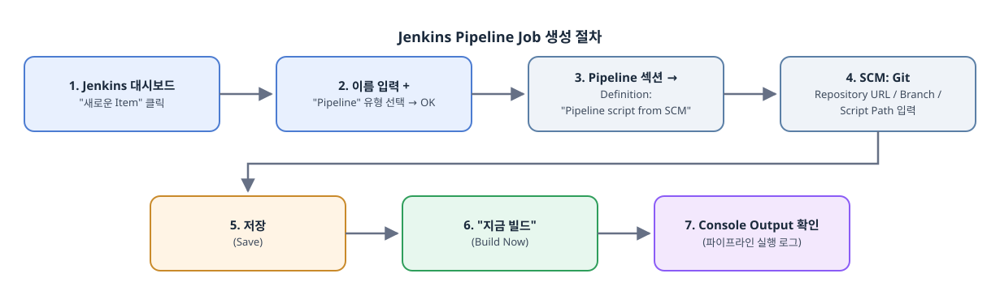
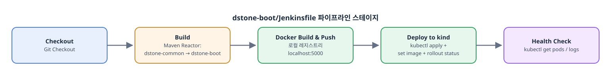
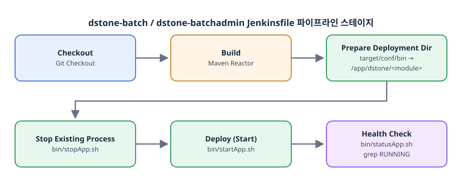

# dstone 클라우드 아키텍처 시뮬레이션 (WSL)

## 목차

- [1. 아키텍처 매핑](#1-아키텍처-매핑)
- [2. dstone-boot ↔ kind 네트워킹](#2-dstone-boot--kind-네트워킹)
- [3. 로컬 사설 레지스트리 (kind-registry)](#3-로컬-사설-레지스트리-kind-registry)
  - [3.1 정체와 역할](#31-정체와-역할)
  - [3.2 구성 요소와 동작 원리](#32-구성-요소와-동작-원리)
  - [3.3 실사용 흐름](#33-실사용-흐름)
  - [3.4 조회 방법 (UI 없음 — API만)](#34-조회-방법-ui-없음--api만)
  - [3.5 실제 클라우드 레지스트리(ECR/GCR/ACR)와의 비교](#35-실제-클라우드-레지스트리ecrgcracr와의-비교)
- [4. dstone-batch / dstone-batchadmin — VM 스타일](#4-dstone-batch--dstone-batchadmin--vm-스타일)
- [5. CI/CD 파이프라인](#5-cicd-파이프라인)
  - [5.1 사전 준비 확인](#51-사전-준비-확인)
  - [5.2 Git 저장소 연결 방법 (SCM 설정값)](#52-git-저장소-연결-방법-scm-설정값)
  - [5.3 dstone-boot 배포 Job 만들기](#53-dstone-boot-배포-job-만들기)
  - [5.4 dstone-batch / dstone-batchadmin 배포 Job 만들기](#54-dstone-batch--dstone-batchadmin-배포-job-만들기)
  - [5.5 빌드 실행/결과 확인 공통 사항](#55-빌드-실행결과-확인-공통-사항)
  - [5.6 자주 발생하는 실패와 대처](#56-자주-발생하는-실패와-대처)
  - [5.7 자동 트리거 구성 (후속 과제)](#57-자동-트리거-구성-후속-과제)
- [6. kubectl 운영 명령 (dstone-boot)](#6-kubectl-운영-명령-dstone-boot)
  - [6.1 사전 준비](#61-사전-준비)
  - [6.2 빠른 참조표](#62-빠른-참조표)
  - [6.3 최초 배포 / 전체 재적용](#63-최초-배포--전체-재적용)
  - [6.4 새 이미지 빌드 후 배포 (Jenkins 파이프라인이 자동 수행하는 것과 동일한 수동 절차)](#64-새-이미지-빌드-후-배포-jenkins-파이프라인이-자동-수행하는-것과-동일한-수동-절차)
  - [6.5 상태 조회](#65-상태-조회)
  - [6.6 로그 조회](#66-로그-조회)
  - [6.7 애플리케이션 접속 (호스트 → Pod)](#67-애플리케이션-접속-호스트--pod)
  - [6.8 헬스체크 직접 확인 (Pod 내부에서)](#68-헬스체크-직접-확인-pod-내부에서)
  - [6.9 Pod 안에 직접 접속 (디버깅용 셸)](#69-pod-안에-직접-접속-디버깅용-셸)
  - [6.10 재시작 (이미지/설정 변경 없이 프로세스만 새로 기동)](#610-재시작-이미지설정-변경-없이-프로세스만-새로-기동)
  - [6.11 중지 / 시작 (재개)](#611-중지--시작-재개)
  - [6.12 롤백 (배포 실패 시 이전 버전으로 복구)](#612-롤백-배포-실패-시-이전-버전으로-복구)
  - [6.13 ConfigMap(`dstone-boot-conf`) 변경 반영](#613-configmapdstone-boot-conf-변경-반영)
  - [6.14 리소스 완전 삭제](#614-리소스-완전-삭제)
  - [6.15 클러스터 자체 시작/중지 (인프라 레벨)](#615-클러스터-자체-시작중지-인프라-레벨)
- [7. 알려진 한계 / 후속 과제](#7-알려진-한계--후속-과제)

dstone 프레임워크를 실제 클라우드 배포와 최대한 유사한 구조로 WSL 환경에서 운용하기 위한 설계 기록이다. 소프트웨어 설치 자체는 `docs/environment.md`/`docs/software/*.md`를 참고하고, 이 문서는 "무엇을 무엇에 대응시켰고 왜 그렇게 했는지"를 정리한다.

## 1. 아키텍처 매핑

| dstone 구성요소 | 클라우드 대응 개념 | WSL 구현 |
|---|---|---|
| MySQL / Redis / RabbitMQ / Kafka | RDS / ElastiCache / Amazon MQ / MSK (매니지드 서비스) | 기존 WSL 설치 그대로, k8s 클러스터 **바깥**에서 네트워크로 접근 |
| dstone-boot | EKS/GKE 위 Deployment (stateless 웹 티어) | 컨테이너화(`dstone-boot/Dockerfile`) 후 로컬 `kind` 클러스터에 Pod로 배포(`dstone-boot/k8s/`) |
| dstone-batch | EC2 (배치 워커 VM) | systemd **미사용**. `dstone-batch/bin/*.sh`로 기동/중지하는 순수 프로세스, 포트 6081 |
| dstone-batchadmin | EC2 (배치 관제/스케줄러 VM) | 동일하게 `dstone-batchadmin/bin/*.sh`, 포트 5081 |
| Jenkins | 자체 관리형 CI 서버(VM 상주) | WSL 호스트에 Controller 상주 유지. 에이전트도 로컬 실행(향후 Kubernetes Plugin으로 에이전트만 kind Pod화하는 것을 다음 단계로 고려) |

MySQL/Redis/RabbitMQ/Kafka를 k8s 클러스터 밖에 두는 이유: 실제 클라우드에서도 RDS/ElastiCache 등은 EKS 클러스터 내부가 아니라 VPC의 별도 관리형 엔드포인트로 존재한다. 이 구조를 그대로 흉내내, "클러스터 안에서 뭘 만들지"와 "클러스터 밖 관리형 서비스에 어떻게 접근할지"를 구분해서 학습할 수 있게 했다.

## 2. dstone-boot ↔ kind 네트워킹

kind 클러스터의 Pod는 `kind` 도커 브리지 네트워크(예: `172.18.0.0/16`) 안에 있고, 호스트의 MySQL/Redis는 원래 `127.0.0.1`에만 바인딩되어 있어 Pod에서 접근할 수 없었다. 이를 해결하기 위해:

1. `docker network inspect kind`로 브리지 게이트웨이 IP(예: `172.18.0.1`, 호스트 인터페이스 `br-xxxx`)를 확인.
2. **(2026-09-07 변경)** 처음에는 MySQL(`bind-address`)/Redis(`bind`)를 `127.0.0.1`에 이 게이트웨이 IP만 추가하는 방식(`127.0.0.1,172.18.0.1`)으로 열어, kind 네트워크에서만 추가로 노출되고 그 외 인터페이스로는 열리지 않게 했었다. 그런데 `172.18.0.1`은 dockerd가 뜨고 `kind` 브리지가 attach된 뒤에만 존재하는 주소라서, mysql/redis를 Docker/kind보다 먼저 켜면 그 IP에 바인딩할 수 없어 `bind: Cannot assign requested address`로 기동 자체가 실패하는 순서 제약이 생겼다(상세 진단은 [environment.md 5.1절](environment.md#51-개발환경-시작-startsh) 참고). 이 제약을 없애 Docker/kind 없이도 mysql/redis만 선택적으로 기동할 수 있도록, 바인딩을 `0.0.0.0`(모든 인터페이스)으로 바꿨다. 이러면 mysql/redis 기동 시점에 게이트웨이 IP가 존재하든 안 하든 상관없고, 이후 Docker/kind가 떠서 그 IP가 새로 생겨도 재시작 없이 바로 접근된다. 특정 IP만 열어주던 방식보다 바인딩 범위는 넓어지지만, WSL 네트워크 자체가 Windows NAT 뒤의 사설 환경이고 호스트에 별도 방화벽 데몬도 없어 실질적 노출 차이는 크지 않다고 판단했다.
   - **Redis 추가 조치**: 바인딩 범위를 특정 IP로 좁히든 `0.0.0.0`으로 넓히든, loopback이 아닌 곳에서 오는 연결은 Redis의 `protected-mode`(기본 `yes`)가 "비밀번호 없는 상태"라는 이유로 자체적으로 거부한다(`-DENIED ... protected mode ...`). 그래서 `/etc/redis/redis.conf`에서 `protected-mode no`로 변경 후 `sudo systemctl restart redis-server`가 추가로 필요하다.
3. RabbitMQ는 기본이 전체 인터페이스 리슨이라 별도 조치 불필요.
4. dstone-boot 컨테이너 이미지에는 k8s 전용 프로파일(`env-k8s.properties`, `-Dspring.profiles.active=k8s`)을 포함시켜 `DB_HOST`/`REDIS_HOST`/`RABBITMQ_HOST`/`KAFKA_HOST`를 이 게이트웨이 IP로 지정했다.
5. **Kafka는 `bind` 문제가 아니라 `advertised.listeners` 문제였다**: 브로커 소켓 자체는 기본이 전체 인터페이스 리슨(`listeners=PLAINTEXT://:9092`)이라 Pod에서 최초 TCP 연결은 되지만, `advertised.listeners`가 `PLAINTEXT://127.0.0.1:9092`로 고정돼 있으면 Kafka가 메타데이터 응답으로 "실제 요청은 `127.0.0.1:9092`로 다시 보내라"고 클라이언트에 알려준다 — Pod 안에서 `127.0.0.1`은 Pod 자신이므로 이후 모든 produce/fetch가 `Topic ... not present in metadata after 60000 ms` 타임아웃으로 실패한다. `/opt/kafka/kafka_2.13-4.2.1/config/server.properties`의 `advertised.listeners`를 `PLAINTEXT://172.18.0.1:9092`로 바꾸고 Kafka를 재기동해야 한다(`/opt/kafka/kafka-stop.sh` → `/opt/kafka/kafka-start.sh`, 파일이 `jysn007` 소유라 sudo 불필요). `172.18.0.1`은 WSL 호스트 자신도 접근 가능한 주소라 Kafbat UI 등 기존 로컬 도구(`bootstrapServers: 127.0.0.1:9092`)는 영향받지 않는다. dstone-boot 쪽은 `bootstrap-servers`를 `DB_HOST`/`REDIS_HOST`와 동일한 패턴으로 `${KAFKA_HOST}:${KAFKA_PORT}`로 파라미터화했다(`dstone-boot/conf/application.yml`, `dstone-boot/k8s/configmap.yaml`, 각 `env-*.properties`).

## 3. 로컬 사설 레지스트리 (kind-registry)

### 3.1 정체와 역할

`kind-registry`는 표준 **Docker Registry v2**(`registry:2` 이미지 그대로 — Docker Hub/ECR/GCR/ACR을 구성하는 것과 동일한 오픈소스 컴포넌트)를 로컬에 하나 띄운 것이다. CSP의 ECR/GCR/ACR을 흉내내는 자리로, `docker build`로 만든 이미지를 kind 클러스터의 Pod가 실제로 pull해갈 수 있도록 중계하는 **사설 이미지 저장소** 역할을 한다.

### 3.2 구성 요소와 동작 원리

세 가지 조각이 맞물려 동작한다(생성 로직은 `/usr/local/bin/k8s-start.sh`에 멱등적으로 들어 있음 — 상세는 [kubernetes.md](software/kubernetes.md)):

1. **컨테이너 자체 (이미지 저장)**
   ```bash
   docker run -d --restart=always -p "127.0.0.1:5000:5000" --network bridge --name kind-registry registry:2
   ```
   `docker push localhost:5000/<image>:<tag>`로 push하면 이 컨테이너에 레이어/매니페스트가 저장된다. `-v`(볼륨) 없이 컨테이너 자체 writable layer에만 저장하므로 **`docker rm kind-registry`로 컨테이너를 지우면 안의 이미지도 전부 사라진다**(재시작만 하는 건 무관 — `--restart=always`로 데이터 유지).

2. **호스트 접근용 포트 매핑**: `-p 127.0.0.1:5000:5000`이라 WSL 호스트에서 `docker push/pull localhost:5000/...`가 별도 설정 없이 바로 된다.

3. **kind 네트워크 연결 + containerd 미러 (Pod가 실제로 pull 가능하게 하는 핵심)**
   - `kind-registry` 컨테이너를 클러스터 노드(`dev-control-plane`)와 같은 `kind` 도커 브리지 네트워크에 연결(`docker network connect kind kind-registry`) — 서로 컨테이너 이름으로 통신 가능.
   - `kind create cluster`를 아래 `containerdConfigPatches`와 함께 실행해, 노드 안의 containerd에 미러 규칙을 심어둔다:
     ```toml
     [plugins."io.containerd.grpc.v1.cri".registry.mirrors."localhost:5000"]
       endpoint = ["http://kind-registry:5000"]
     ```
   - 즉 Pod 스펙에 `image: localhost:5000/dstone-boot:...`라고 써도, 노드 입장의 `localhost`는 원래 자기 자신이라 실패해야 정상이지만, 이 미러 규칙 덕분에 containerd가 요청을 `kind-registry:5000`(진짜 레지스트리 컨테이너)으로 자동 리다이렉트한다.
   - 확인 방법: `docker network inspect kind`로 두 컨테이너가 같은 네트워크에 있는지, `docker exec dev-control-plane cat /etc/containerd/config.toml`로 미러 설정이 들어있는지, `kubectl get pod ... -o jsonpath='{.status.containerStatuses[0].imageID}'`로 실제 pull 경로(`localhost:5000/dstone-boot@sha256:...`)를 확인할 수 있다.

### 3.3 실사용 흐름

```bash
docker build -f dstone-boot/Dockerfile -t localhost:5000/dstone-boot:<TAG> .
docker push localhost:5000/dstone-boot:<TAG>            # ① 호스트 → kind-registry (포트 매핑 경유)
kubectl set image deployment/dstone-boot dstone-boot=localhost:5000/dstone-boot:<TAG> -n dstone
# ② kind 노드의 containerd가 image: localhost:5000/... 를 mirrors 설정으로 가로채
#    kind 도커 네트워크 안에서 kind-registry:5000 으로 pull
```
`docker build → docker push localhost:5000/... → kubectl apply(image: localhost:5000/...)`가 실제 클라우드의 "빌드 → 레지스트리 푸시 → 클러스터 배포" 흐름과 동일하다.

### 3.4 조회 방법 (UI 없음 — API만)

`kind-registry`엔 웹 UI가 없다. Registry HTTP API v2를 직접 호출해서 확인한다:
```bash
curl -s http://localhost:5000/v2/_catalog                    # 저장된 이미지(repository) 목록
curl -s http://localhost:5000/v2/dstone-boot/tags/list        # 특정 이미지의 태그 목록
```
웹 UI가 필요하면 `joxit/docker-registry-ui` 같은 경량 컨테이너를 별도로 붙여 `REGISTRY_URL=http://localhost:5000`을 가리키게 하는 방법이 있다(현재 구성엔 없음).

### 3.5 실제 클라우드 레지스트리(ECR/GCR/ACR)와의 비교

WSL 시뮬레이션이 "빌드→푸시→배포" 흐름 자체는 그대로 재현하지만, 매니지드 레지스트리가 제공하는 부가 기능은 대부분 없다 — 학습 목적상 이 gap을 명확히 인지하고 있는 편이 좋다.

| 기능 | kind-registry (로컬) | ECR / GCR / ACR (실제 클라우드) |
|---|---|---|
| 이미지 저장(OCI 표준) | O (`registry:2`, 동일 API) | O (동일 OCI Distribution API) |
| 인증/접근 제어 | 없음 — 완전 오픈, 누구나 push/pull | IAM 정책/서비스 계정 기반 세밀한 RBAC |
| 전송 암호화 | 없음(HTTP, "insecure registry"로 등록) | 기본 TLS 종단 암호화 |
| 가용성/복제 | 단일 컨테이너, 단일 인스턴스 — 장애 시 전체 중단 | 멀티 AZ, 리전 간 복제(예: ECR replication) |
| 저장 영속성 | 컨테이너 writable layer(볼륨 미마운트) — 컨테이너 삭제 시 이미지 유실 | 관리형 오브젝트 스토리지, 자동 내구성 보장 |
| 취약점 스캐닝 | 없음 | push 시 자동 스캔(ECR Scan on Push, GCR Container Analysis 등) |
| 태그 불변성 / Lifecycle Policy | 없음 — 수동 관리, 태그 덮어쓰기 자유 | 정책 기반 자동 만료·보존, 태그 불변(immutable tag) 옵션 |
| 네트워크 노출 범위 | kind 도커 네트워크 + `127.0.0.1`만(브리지 게이트웨이 대역 밖 미노출) | VPC 엔드포인트/프라이빗 링크로 사설망 한정 가능, 필요 시 공인 엔드포인트 |
| 관측성/UI | 없음 — REST API(`/v2/_catalog` 등)만 | 콘솔 UI에서 리포지토리/태그/스캔결과/용량 조회 |
| 과금 | 없음(로컬 디스크만 소비) | 저장 용량 + 데이터 전송량 기준 과금 |

이 gap 자체가 "관리형 서비스가 인증·암호화·스캐닝·복제를 대신 해준다"는 걸 체감하는 학습 포인트다 — kind-registry는 그 앞단의 "이미지 저장 + pull 경로 연결"이라는 핵심 매커니즘만 최소 구현으로 재현한 것.

## 4. dstone-batch / dstone-batchadmin — VM 스타일

systemd로 자동 등록하지 않고, EC2에 SSH로 접속해 배포 스크립트를 수동 실행하는 감각을 재현하기 위해 순수 쉘 스크립트(`bin/startApp.sh`/`stopApp.sh`/`statusApp.sh`)로만 제어한다. 두 앱 모두 같은 WSL 호스트에서 포트로만 분리되어 있다(6081/5081) — 실제 EC2 수준의 네트워크·방화벽 격리는 없지만, "무엇을 언제 어떻게 배포하는지"의 운영 감각(수동 기동/정지, 배포 디렉터리 분리, 롤링 없는 단일 프로세스 재시작)에 집중하기 위한 절충이다.

각 모듈은 배포 대상 환경별로 별도의 `env-*.properties` 프로파일을 classpath에 포함시켜 빌드하고, 실행 시 `-Dspring.profiles.active=<profile>`로 선택한다(`net.dstone.*.DstoneXxxApplication.setSysProperties()`가 이 파일을 읽어 `System.setProperty`로 주입하고, 그중 `APP_CONF_DIR` 값으로 실제 `application.yml`/`log4j2.xml` 위치를 찾는다):

| 프로파일 | 대상 | APP_CONF_DIR |
|---|---|---|
| (기본/local) | Windows 개발자 PC | `D:/AppHome/...` |
| wsl | WSL에서 git 체크아웃 그대로 수동 테스트 | `/app/dstone/<module>/conf` |
| vm | Jenkins CI/CD가 배포하는 안정적 실행 경로 | `/app/dstone/<module>/conf` (호스트 리포지토리 디렉터리 그 자체, `jysn007`그룹 공유) |

> 기존에는 `dev` 프로파일(Docker Compose 배포용)과 별도의 `/workshop/dstone/<module>` 배포 디렉터리가 있었으나, 리포지토리(`/app/dstone`)와 이중으로 관리되는 것을 피하기 위해 제거했다 — `vm` 프로파일도 이제 `wsl`과 동일하게 리포지토리 경로를 그대로 가리키며, Jenkins가 그 경로에 직접 빌드산출물을 배포한다.

`bin/startApp.sh`는 `DSTONE_PROFILE` 환경변수로 프로파일을 오버라이드할 수 있다(기본값 `wsl`). Jenkinsfile은 `DSTONE_PROFILE=vm`으로 실행한다.

## 5. CI/CD 파이프라인

- `dstone-boot/Jenkinsfile`: Checkout → Maven 리액터 빌드(`dstone-common` 먼저) → `docker build`/`push`(로컬 레지스트리) → `kubectl apply` + `kubectl set image` + `rollout status`(kind 배포) → 헬스체크.
- `dstone-batch/Jenkinsfile`, `dstone-batchadmin/Jenkinsfile`: Checkout → Maven 리액터 빌드 → 아티팩트+conf+bin을 `/app/dstone/<module>`(리포지토리 자기 자신의 모듈 디렉터리)로 복사(덮어쓰기) → 기존 프로세스 정지(`bin/stopApp.sh`) → 재기동(`bin/startApp.sh`, `DSTONE_PROFILE=vm`) → `bin/statusApp.sh`로 헬스체크.
- 기존에는 세 Jenkinsfile 모두 `docker-compose up/down`으로 배포했고, 이미지 배포는 Jenkinsfile 밖의 `docs/docker/*/02.*-docker-reg.sh`가 `docker commit` + Docker Hub 하드코딩 비밀번호로 처리했다 — 이번에 위 구조로 전면 교체했다. `dstone-boot/docs/docker/`, `dstone-batch/docs/docker/`의 기존 Docker Compose 자산(및 그 안의 오래된 스키마 SQL 사본)은 완전히 삭제했다 — 실제 스키마는 각 모듈의 `src/main/resources/schema/*.sql`이 이미 최신 상태로 관리하고 있었고, MySQL/Redis/RabbitMQ/Kafka 자체도 이제 Docker가 아닌 WSL 네이티브 설치로 운용하기 때문이다.
- Jenkins Controller는 계속 WSL 호스트(VM 역할)에 상주한다. `jenkins` 시스템 계정을 `docker` 그룹에 포함시켜 별도 인프라 추가 없이 `docker`/`kubectl`을 실행하고, `jysn007` 그룹에도 포함시켜 리포지토리(`/app/dstone`) 안의 `dstone-batch`/`dstone-batchadmin` 모듈 디렉터리에 배포 파일을 직접 쓸 수 있게 한다(별도의 `/workshop` 같은 배포 전용 디렉터리를 두지 않고, 리포지토리 자체를 배포 대상으로 삼아 이중 관리를 피한다).
- 전제: 각 Jenkins Job의 SCM 체크아웃 범위는 모노레포 루트 전체여야 한다(멀티모듈 리액터 빌드 및 `dstone-boot`의 Docker 빌드 컨텍스트가 루트를 요구하기 때문).

아래는 위 요약을 실제로 Jenkins 화면(`http://localhost:8080`)에서 손으로 따라 하기 위한 상세 절차다 — 이 절만 보고도 3개 Job(`dstone-boot`, `dstone-batch`, `dstone-batchadmin`)을 처음부터 구성할 수 있게 정리했다.

### 5.1 사전 준비 확인

Job을 만들기 전에 아래가 이미 준비돼 있는지 확인한다(이 리포지토리의 WSL 환경 기준으로는 전부 확인·구성 완료된 상태다):

| 확인 항목 | 상태 | 비고 |
|---|---|---|
| Jenkins 구동 | `http://localhost:8080` 접속 가능 | [software/jenkins.md](software/jenkins.md) |
| 필요 플러그인 | Git, GitHub, Pipeline(`workflow-aggregator`), SSH Credentials 등 기본 설치됨 | Jenkins 설치 시 "Install suggested plugins"로 충분 — Docker/Kubernetes 전용 플러그인은 **불필요**(Jenkinsfile이 `sh` 스텝으로 `docker`/`kubectl` CLI를 직접 호출) |
| `jenkins` 시스템 계정이 `docker` 그룹 소속 | `groups jenkins` → `jenkins docker` | 아니면 `sudo usermod -aG docker jenkins` 후 Jenkins 재시작 |
| `/etc/kind/dev.config`(KUBECONFIG) 읽기 권한 | `docker` 그룹에 읽기 권한 부여됨 | `dstone-boot` Job이 `kubectl`을 쓰려면 필요 |
| `/app/dstone/dstone-batch`, `/app/dstone/dstone-batchadmin` 쓰기 권한 | `jenkins` 계정이 `jysn007` 그룹에 포함되고, 두 디렉터리(및 하위 `target`/`conf`/`bin`)에 `jysn007` 그룹 쓰기 권한(setgid) 부여됨 | `dstone-batch`/`dstone-batchadmin` Job이 배포 파일을 복사하는 대상(리포지토리 자기 자신) |

### 5.2 Git 저장소 연결 방법 (SCM 설정값)

리포지토리 원격은 `git@github.com:YongSoekChoeng/dstone.git`(SSH)이지만, 이 WSL 환경에는 `jenkins` 계정용 SSH 배포키가 아직 등록돼 있지 않다. Jenkins Controller와 소스 코드가 **같은 WSL 호스트**에 있으므로, 별도 키 설정 없이 로컬 경로를 Git 저장소로 바로 지정할 수 있다 — 아래 Job 생성 절차에서 공통으로 쓰는 값이다.

| SCM 설정 항목 | 값 |
|---|---|
| Repository URL | `file:///app/dstone` |
| Credentials | `- none -` (로컬 경로라 인증 불필요) |
| Branches to build | `*/main` |

> GitHub 원격을 직접 쓰고 싶다면 Jenkins에 SSH 개인키를 "SSH Username with private key" Credential로 등록하고 Repository URL을 `git@github.com:YongSoekChoeng/dstone.git`으로 바꾸면 된다 — 현재는 별도 키 발급/등록이 안 돼 있어 후속 과제로 남겨둔다.

### 5.3 dstone-boot 배포 Job 만들기



1. `http://localhost:8080` 접속 → 왼쪽 메뉴 **New Item** 클릭
2. **Enter an item name**에 `dstone-boot-deploy` 입력 → 항목 유형에서 **Pipeline** 선택 → **OK**
3. **General** 탭: Description에 "dstone-boot: Maven 빌드 → Docker 이미지 빌드/푸시 → kind 배포" 정도로 메모(선택 사항)
4. 아래로 스크롤해 **Pipeline** 섹션에서:
   - **Definition**: `Pipeline script from SCM` 선택
   - **SCM**: `Git` 선택
   - **Repository URL**: `file:///app/dstone`
   - **Credentials**: `- none -`
   - **Branches to build**: `*/main`
   - **Script Path**: `dstone-boot/Jenkinsfile` ← **가장 중요한 값**. 모노레포 루트를 체크아웃하지만 실제 실행할 Jenkinsfile은 `dstone-boot/` 서브디렉터리 안에 있으므로 반드시 이 경로를 지정해야 한다.
5. **Save** 클릭
6. 왼쪽 메뉴 **Build Now** 클릭 → Build History에 새 빌드 번호(`#1`)가 생기고 진행 중 표시(회전 아이콘)가 나타남
7. 빌드 번호 클릭 → **Console Output**에서 실시간 로그 확인. 아래 순서로 로그가 출력되면 정상이다.



- `====== Git Checkout ======`
- `====== Maven Build (Reactor: dstone-common -> dstone-boot) ======`
- `====== Docker Build & Push (로컬 사설 레지스트리) ======`
- `====== Deploy to kind(Kubernetes) ======`
- `====== Health Check ======` → 마지막에 `kubectl get pods`/`kubectl logs` 출력이 보이면 배포 완료. 이후 상태 확인/재배포는 [6. kubectl 운영 명령](#6-kubectl-운영-명령-dstone-boot) 참고.

### 5.4 dstone-batch / dstone-batchadmin 배포 Job 만들기

`dstone-boot`과 동일한 방식으로 Job을 하나 더 만들되, 두 값만 다르다 — Job 이름과 **Script Path**. 나머지 SCM 설정([5.2](#52-git-저장소-연결-방법-scm-설정값))은 동일하다.

| 대상 모듈 | Job 이름 예시 | Script Path |
|---|---|---|
| dstone-batch | `dstone-batch-deploy` | `dstone-batch/Jenkinsfile` |
| dstone-batchadmin | `dstone-batchadmin-deploy` | `dstone-batchadmin/Jenkinsfile` |

1. **New Item** → 이름 입력(`dstone-batch-deploy` 또는 `dstone-batchadmin-deploy`) → **Pipeline** 선택 → **OK**
2. **Pipeline** 섹션: Definition = `Pipeline script from SCM`, SCM = `Git`, Repository URL = `file:///app/dstone`, Credentials = `- none -`, Branches to build = `*/main`, **Script Path** = 위 표의 값
3. **Save** → **Build Now** → **Console Output**으로 진행 확인



정상 로그 흐름:
- `====== Git Checkout ======`
- `====== Maven Build (Reactor: dstone-common -> dstone-batch) ======` (batchadmin Job은 `dstone-batchadmin`)
- `====== Prepare Deployment Files (VM 배포 경로) ======` → `/app/dstone/<module>/{target,conf,bin}`(리포지토리 자기 자신)로 파일 복사
- `====== Stop Existing Process ======` → 최초 배포라면 실행 중인 프로세스가 없어 `|| true`로 그냥 통과
- `====== Deploy(Start) Application ======` → `bin/startApp.sh` 실행
- `====== Health Check ======` → `bin/statusApp.sh` 결과가 `RUNNING`이면 성공. `RUNNING`이 아니면 빌드가 실패(`grep -q RUNNING`가 non-zero 반환) 처리된다.

### 5.5 빌드 실행/결과 확인 공통 사항

- **수동 트리거만 구성돼 있다** — 위 3개 Job 모두 Build Trigger를 설정하지 않았으므로 코드를 푸시해도 자동으로 빌드되지 않는다. 매번 Jenkins 화면에서 **Build Now**를 눌러야 한다(자동화는 [5.7](#57-자동-트리거-구성-후속-과제) 참고).
- **Build History의 공 색깔**: 파란/초록 공 = 성공, 빨간 공 = 실패, 노란 공 = 불안정(UNSTABLE), 회색/회전 = 진행 중.
- Job 목록(대시보드)에서 각 Job의 최근 빌드 상태를 한눈에 볼 수 있다.
- 파이프라인 실행 중 각 stage는 **Console Output** 화면 상단의 Stage View(또는 좌측 `Pipeline Overview`)에서도 단계별 성공/실패를 시각적으로 확인할 수 있다(`pipeline-graph-view` 플러그인 설치돼 있음).

### 5.6 자주 발생하는 실패와 대처

| 증상 (Console Output) | 원인 | 대처 |
|---|---|---|
| `docker: permission denied` 또는 `Cannot connect to the Docker daemon` | `jenkins` 계정이 `docker` 그룹이 아니거나, Jenkins 프로세스가 그룹 변경 이전에 떠 있음 | `sudo usermod -aG docker jenkins` 후 `sudo systemctl restart jenkins` |
| `kubectl` 실행 시 `error: error loading config file "/etc/kind/dev.config"` (Permission denied) | KUBECONFIG 파일 그룹 권한 문제 | `ls -l /etc/kind/dev.config`로 `docker` 그룹 읽기 권한 확인, 없으면 `sudo chmod g+r /etc/kind/dev.config` |
| `docker build` 시 `dstone-common`을 찾을 수 없다는 컴파일/COPY 에러 | Job의 Repository URL이 `dstone-boot/` 서브디렉터리만 가리키도록 잘못 설정됨(Sparse checkout 등) | Repository URL은 항상 모노레포 루트(`file:///app/dstone`)를 가리켜야 한다 — Script Path로만 모듈을 구분한다 |
| `dstone-batch`/`dstone-batchadmin` Job의 Prepare Deployment Files 단계에서 `mkdir`/`cp` 실패 | `/app/dstone/<module>` 디렉터리 소유권/권한 문제 | `ls -ld /app/dstone/dstone-batch`로 `jysn007` 그룹 쓰기 권한(`rwxrwsr-x` 이상) 확인, `groups jenkins`로 `jysn007` 그룹 포함 여부 확인 |
| Health Check에서 `grep -q RUNNING` 실패로 빌드 실패(빨간 공) | 애플리케이션이 기동에 10초 이상 걸림, 또는 이전 프로세스의 PID 파일이 꼬여 있음 | `/app/dstone/<module>/logs/*.out` 로그 확인(빌드 실패 시 Console Output에 자동 tail됨) |
| Script Path 오타로 `... Jenkinsfile not found` | Script Path 값이 실제 파일 경로와 다름 | 정확히 `dstone-boot/Jenkinsfile`, `dstone-batch/Jenkinsfile`, `dstone-batchadmin/Jenkinsfile` 중 하나와 일치해야 함(대소문자 포함) |

### 5.7 자동 트리거 구성 (후속 과제)

현재 3개 Job은 전부 수동(`Build Now`) 실행만 구성돼 있다. 코드 푸시 시 자동 빌드를 원하면 Job 설정의 **Build Triggers** 섹션에서 다음 중 하나를 추가하면 된다(이번 범위에서는 적용하지 않음):

- **Poll SCM**: 예) `H/5 * * * *`(5분마다 변경 여부 확인) — 로컬 `file://` 저장소에도 동작하지만 폴링 주기만큼 지연이 생긴다.
- **GitHub hook trigger for GITScm polling**: GitHub 원격(`git@github.com:...`)을 실제로 쓰도록 전환하고 웹훅을 연결하면 push 즉시 트리거된다 — [5.2](#52-git-저장소-연결-방법-scm-설정값)의 SSH 키 등록이 선행돼야 한다.

## 6. kubectl 운영 명령 (dstone-boot)

`dstone-boot`은 오직 kind 클러스터의 Pod로만 존재한다(VM 스타일 `bin/*.sh` 없음). 이 문서만 보고도 배포/조회/재시작/중지까지 전부 처리할 수 있도록 실제 사용하는 `kubectl`/`docker`/`kind` 명령을 정리한다. 매니페스트는 `dstone-boot/k8s/{namespace,configmap,deployment,service}.yaml`, 네임스페이스는 `dstone`, 리소스명은 전부 `dstone-boot`이다.

### 6.1 사전 준비

```bash
kubectl config current-context        # ~/.bashrc에 KUBECONFIG=/etc/kind/dev.config 등록되어 있으면 별도 설정 불필요
kind get clusters                     # dev 가 나와야 함
kubectl get nodes                     # dev-control-plane 이 Ready 여야 함
```
클러스터 자체가 안 떠 있다면(아래 "클러스터 자체 시작/중지" 참고) 나머지 명령은 전부 실패한다.

### 6.2 빠른 참조표

아래 표는 "하고 싶은 일 → 명령 한 줄"만 빠르게 찾기 위한 참조용이다. 명령 안의 `-n dstone`은 매번 네임스페이스를 지정하는 부분(리소스명이 전부 `dstone-boot`으로 겹치므로 생략하면 다른 네임스페이스를 잘못 건드릴 수 있다), `deploy/dstone-boot`·`svc/dstone-boot`은 각각 Deployment·Service 리소스를 가리키는 축약 표기다. 각 행의 자세한 절차/배경은 뒤따르는 6.3 이후 절을 참고.

| 하고 싶은 것 | 명령 | 비고 |
|---|---|---|
| 최초 배포 / 전체 재적용 | `kubectl apply -f dstone-boot/k8s/` | `namespace`/`configmap`/`deployment`/`service` 4개 매니페스트를 한 번에 적용. 이미 존재하면 변경분만 갱신(멱등). → [6.3](#63-최초-배포--전체-재적용) |
| 새 이미지로 배포 | `kubectl set image deployment/dstone-boot dstone-boot=<image> -n dstone` | `<image>`는 `localhost:5000/dstone-boot:<TAG>`처럼 **레지스트리+저장소명+태그를 전부 포함한 전체 문자열**이어야 한다. `<TAG>`는 임의로 정하면 되고(Jenkins는 `${BUILD_NUMBER}` 자동 사용), 매번 새 태그를 쓰는 게 안전하다 — 이유와 태그 확인법은 아래 "이미지 태그, 왜 매번 새로 붙여야 하나" 참고. → [6.4](#64-새-이미지-빌드-후-배포-jenkins-파이프라인이-자동-수행하는-것과-동일한-수동-절차) |
| 실행 상태 확인 | `kubectl get pods -n dstone -l app=dstone-boot` | `-l app=dstone-boot`은 라벨 필터. `STATUS`가 `Running`, `READY`가 `1/1`이면 정상. `CrashLoopBackOff`/`ImagePullBackOff`면 `kubectl describe pod`/`kubectl get events`로 원인 확인([6.5](#65-상태-조회)). |
| 로그 보기 | `kubectl logs -n dstone deploy/dstone-boot -f` | `-f`는 tail -f처럼 실시간 스트리밍. 이건 컨테이너의 **stdout**(log4j2의 Console appender)만 보여준다 — 파일로 남는 로그(`/app/dstone/LOGS/...`)는 별개이고 pod가 사라지면 같이 사라진다. |
| 호스트에서 접속 | `kubectl port-forward -n dstone svc/dstone-boot 7081:7081`| 터미널을 점유한 채로 로컬 `7081` 포트를 클러스터 안 Service `7081`에 연결. `Ctrl+C`하면 끊긴다. 브라우저로 `http://localhost:7081`에 접속해 확인할 때 씀. |
| 호스트에서 접속(Pod별) | `kubectl port-forward -n dstone pod/1번POD아이디 7091:7081`<br>`kubectl port-forward -n dstone pod/2번POD아이디 7092:7081`| Pod별로 접속해 확인할 때 씀. |
| 호스트에서 접속(백그라운드) | `nohup kubectl port-forward -n dstone svc/dstone-boot 7081:7081 > /tmp/port-forward.log 2>&1 & disown` | 위와 동일하지만 터미널을 안 붙잡음. 끊고 싶으면 `pkill -f "port-forward.*dstone-boot"`. |
| 재시작(코드 변경 없이) | `kubectl rollout restart deployment/dstone-boot -n dstone` | 이미지·설정은 그대로 두고 pod만 새로 띄움(메모리 누수 의심될 때 등). **주의**: `imagePullPolicy: IfNotPresent`라 같은 태그면 새로 pull하지 않고 노드에 캐시된 이미지를 그대로 재사용한다 — 이미지 자체를 바꾸고 싶으면 이 명령이 아니라 [6.4](#64-새-이미지-빌드-후-배포-jenkins-파이프라인이-자동-수행하는-것과-동일한-수동-절차)의 `set image`를 써야 한다. |
| 중지 | `kubectl scale deployment/dstone-boot -n dstone --replicas=0` | pod 개수를 0으로 — Deployment 자체는 남기고 실행만 멈춤(디스크에 뭘 지우지 않는 안전한 중지). `docker-compose down`의 감각과 비슷하지만 리소스 정의는 삭제되지 않는다. |
| 시작(재개) | `kubectl scale deployment/dstone-boot -n dstone --replicas=1` | 0으로 내렸던 걸 다시 1로. 이때도 이미지는 Deployment에 이미 박혀 있는 그대로 쓴다(재빌드/재pull 아님). |
| 이전 버전으로 롤백 | `kubectl rollout undo deployment/dstone-boot -n dstone` | 직전 `kubectl apply`/`set image` 이전 리비전으로 되돌림. `kubectl rollout history deployment/dstone-boot -n dstone`으로 리비전 목록을 먼저 봐도 됨. |
| 완전 삭제 | `kubectl delete -f dstone-boot/k8s/` | namespace까지 통째로 삭제 — 다시 쓰려면 [6.3](#63-최초-배포--전체-재적용)부터 재적용. 스테이징을 잠깐 비우고 싶을 뿐이면 "중지"(replicas=0)로 충분하고 이 명령은 필요 없다. |

#### 진행 샘플(이미지 수정 및 재적용)
```bash
## 0단계 — 사전 확인
kind get clusters                      # dev 나오는지
kubectl config current-context         # kind-dev 인지
docker ps --filter name=kind-registry  # kind-registry Up 상태인지

## 1단계 — 기존 것 전부 삭제
# **k8s 리소스 삭제** (namespace를 지우면 그 안의 deployment/service/configmap/pod가 다 같이 사라짐):
kubectl delete -f dstone-boot/k8s/
kubectl get all -n dstone              # "No resources found" 나올 때까지 기다리기 (namespace 삭제는 몇 초 걸림)
# **로컬에 캐시된 옛날 이미지 삭제**:
docker rmi localhost:5000/dstone-boot:kafka-fix localhost:5000/dstone-boot:latest
# 레지스트리(`localhost:5000`) 안에 저장된 이미지 데이터 자체까지 지우는 건 별도 GC 절차가 필요해서 번거롭습니다(`REGISTRY_STORAGE_DELETE_ENABLED` 설정 + exec 후 garbage-collect). 
# 어차피 새 태그로 push하면 덮어써지는 개념이 아니라 새 항목이 생기는 거라, 레지스트리 내부 정리는 건너뛰셔도 실습엔 지장 없습니다.

## 2단계 — 새 이미지 빌드
docker build -f dstone-boot/Dockerfile -t localhost:5000/dstone-boot:<원하는태그> .
# Docker 빌드 컨텍스트는 반드시 리포지토리 루트여야 합니다(`dstone-common` 소스가 같이 필요해서).
# <원하는태그>는 임의 문자열입니다. 예: docker build -f dstone-boot/Dockerfile -t localhost:5000/dstone-boot:20260904-1 .
# **확인 포인트**: 빌드 로그 마지막이 `naming to localhost:5000/dstone-boot:<태그>` 같은 줄로 끝나면 성공.

## 3단계 — 레지스트리에 push
docker push localhost:5000/dstone-boot:<원하는태그>
curl -s http://localhost:5000/v2/dstone-boot/tags/list   # 방금 push한 태그가 목록에 보이는지 확인

## 4단계 — 매니페스트 반영
# dstone-boot/k8s/deployment.yaml`을 열어서 `image: localhost:5000/dstone-boot:태그` 줄을 방금 만든 태그로 수정 (예: `image: localhost:5000/dstone-boot:20260904-1`) 
# 그다음 4개 매니페스트를 순서대로 적용 (namespace 먼저)
kubectl apply -f dstone-boot/k8s/namespace.yaml
kubectl apply -f dstone-boot/k8s/configmap.yaml
kubectl apply -f dstone-boot/k8s/deployment.yaml
kubectl apply -f dstone-boot/k8s/service.yaml
kubectl rollout status deployment/dstone-boot -n dstone --timeout=120s
# rollout status`가 `deployment "dstone-boot" successfully rolled out`을 출력하면 성공.

## 5단계 — 검증
# 실제로 새 태그가 떴는지
kubectl get deployment dstone-boot -n dstone -o jsonpath='{.spec.template.spec.containers[0].image}{"\n"}'
# pod 상태
kubectl get pods -n dstone -l app=dstone-boot
# 로그
kubectl logs -n dstone deploy/dstone-boot --tail=50
# 수정 경로가 실제로 반영됐는지 (WAR 위치 + LOGS 디렉토리 자동 생성 확인)
kubectl exec -it -n dstone deploy/dstone-boot -- sh
# pwd가 /app/dstone/dstone-boot로 나오고, WAR도 그 경로에 있어야 정상.

## 6단계 — 접속 확인
kubectl get svc dstone-boot -n dstone   # NodePort 확인 (지금은 30081)
# 방법 A: port-forward 이후 확인
nohup kubectl port-forward -n dstone svc/dstone-boot 7081:7081 > /tmp/port-forward.log 2>&1 & disown
curl -I http://localhost:7081/actuator/health/readiness
# 방법 B: NodePort로 바로 (kind 노드 IP 확인 필요시 kubectl get nodes -o wide)
curl -I http://localhost:30081/actuator/health/readiness

```

#### 이미지 태그, 왜 매번 새로 붙여야 하나 / 지금 뭐가 떠 있는지 확인하기

`<TAG>`는 형식 제약이 없는 임의 문자열이다 — 날짜(`20260904-1`), 목적을 담은 이름(`kafka-fix`), 커밋 해시 등 뭐든 된다. 다만 **같은 태그를 재사용하면 곤란해지는 경우가 있다**: `deployment.yaml`이 `imagePullPolicy: IfNotPresent`로 설정돼 있어서, kind 노드에 그 태그의 이미지가 이미 캐시돼 있으면 `docker push`로 레지스트리 쪽만 새 내용으로 덮어써도 노드는 그걸 다시 안 당겨오고 캐시를 그대로 쓴다. 그래서 `kubectl rollout restart`나 `kubectl scale`로 pod만 새로 띄워봐야 옛날 이미지가 계속 뜨는 상황이 생긴다 — 이게 바로 이 문서의 앞 절에서 "properties 고쳤는데 반영이 안 된다"의 원인이었다. 매번 다른 태그를 쓰고 `kubectl set image`로 그 태그를 명시적으로 지정하면 이 문제를 원천적으로 피할 수 있다(Jenkins가 `${BUILD_NUMBER}`를 쓰는 이유).

"지금 실제로 뭐가 떠 있나"는 목적에 따라 확인하는 곳이 다르다:

```bash
# 1) 클러스터에 실제로 떠 있는 태그 (가장 신뢰할 수 있는 "현재 상태" — 이것만 믿으면 된다)
kubectl get deployment dstone-boot -n dstone -o jsonpath='{.spec.template.spec.containers[0].image}'

# 2) 로컬 사설 레지스트리(localhost:5000)에 올라가 있는 전체 태그 목록
curl -s http://localhost:5000/v2/dstone-boot/tags/list

# 3) 이 WSL 호스트에 로컬로 캐시된(빌드/pull된 적 있는) 이미지 태그들
docker images localhost:5000/dstone-boot
```

`dstone-boot/k8s/deployment.yaml` 파일에는 `image: localhost:5000/dstone-boot:latest`라고 적혀 있지만, 이건 **최초 적용 시점의 기본값일 뿐**이다. 이후 `kubectl set image`로 태그를 바꾸면 클러스터에 실제로 적용된 Deployment 객체와 git의 매니페스트 파일이 서로 다른 값을 가리키게 된다(이른바 "매니페스트 드리프트") — 그래서 파일이 아니라 위 1번 명령으로 클러스터에 직접 물어보는 게 진짜 정답이다.

### 6.3 최초 배포 / 전체 재적용

```bash
kubectl apply -f dstone-boot/k8s/namespace.yaml
kubectl apply -f dstone-boot/k8s/configmap.yaml
kubectl apply -f dstone-boot/k8s/deployment.yaml
kubectl apply -f dstone-boot/k8s/service.yaml

# 또는 디렉터리 전체 한 번에 (파일명 순서로 apply됨 — namespace가 configmap/deployment/service보다 알파벳상 나중이므로
# 최초 1회는 위처럼 namespace.yaml을 먼저 적용해 네임스페이스부터 만드는 편이 안전하다)
kubectl apply -f dstone-boot/k8s/
```

### 6.4 새 이미지 빌드 후 배포 (Jenkins 파이프라인이 자동 수행하는 것과 동일한 수동 절차)

```bash
docker build -f dstone-boot/Dockerfile -t localhost:5000/dstone-boot:<TAG> -t localhost:5000/dstone-boot:latest .
docker push localhost:5000/dstone-boot:<TAG>
docker push localhost:5000/dstone-boot:latest

kubectl set image deployment/dstone-boot dstone-boot=localhost:5000/dstone-boot:<TAG> -n dstone
kubectl rollout status deployment/dstone-boot -n dstone --timeout=120s
```
`imagePullPolicy: IfNotPresent`이므로 `latest` 태그만 다시 push하고 `kubectl rollout restart`만 하면 새 이미지를 못 당겨오는 경우가 있다 — 태그를 바꿔 `set image`로 명시적으로 갱신하는 편이 안전하다.

### 6.5 상태 조회

```bash
kubectl get pods -n dstone -l app=dstone-boot -o wide     # Pod 목록/노드/IP
kubectl get deployment dstone-boot -n dstone               # READY/UP-TO-DATE/AVAILABLE
kubectl get svc dstone-boot -n dstone                       # ClusterIP/NodePort 확인
kubectl get all -n dstone                                    # 네임스페이스 전체 리소스 한눈에
kubectl describe pod <pod-name> -n dstone                    # 이벤트/컨테이너 상태/프로브 상세
kubectl describe deployment dstone-boot -n dstone
kubectl get events -n dstone --sort-by=.lastTimestamp        # 최근 이벤트(ImagePullBackOff 등 원인 확인)
kubectl top pod -n dstone -l app=dstone-boot                 # CPU/메모리 (metrics-server 필요, 미설치 시 에러)
```

### 6.6 로그 조회

```bash
kubectl logs -n dstone deploy/dstone-boot --tail=100     # 최근 100줄
kubectl logs -n dstone deploy/dstone-boot -f              # 실시간 tail
kubectl logs -n dstone <pod-name> --previous                # 직전에 죽은 컨테이너 로그 (CrashLoopBackOff 디버깅용)
```

### 6.7 애플리케이션 접속 (호스트 → Pod)

kind 클러스터가 `extraPortMappings` 없이 생성돼 있어 NodePort(`30081`)로 호스트에서 바로 접속할 수 없다("알려진 한계" 참고). `kubectl port-forward`가 유일한 접근 경로다.

```bash
kubectl port-forward -n dstone svc/dstone-boot 7081:7081   # 이후 http://localhost:7081 (포그라운드 — 터미널 종료 시 같이 끊김)
# 또는 특정 파드에 직접:
kubectl port-forward -n dstone pod/<pod-name> 7081:7081
```

세션을 유지한 채로 계속 열어두려면(백그라운드 실행):

```bash
nohup kubectl port-forward -n dstone svc/dstone-boot 7081:7081 > /tmp/port-forward.log 2>&1 &
disown
```

동작/중지 확인:
```bash
ps aux | grep "port-forward -n dstone"   # 실행 중인 PID 확인
curl -s http://localhost:7081/actuator/health/readiness   # {"status":"UP"} 확인
kill <PID>                                # 중지
```

WSL2 환경에서는 `localhost` 포트가 Windows 호스트로 자동 포워딩되므로, 위 명령을 WSL에서 실행해두면 Windows 브라우저에서도 `http://localhost:7081`로 그대로 접속된다.

### 6.8 헬스체크 직접 확인 (Pod 내부에서)

```bash
kubectl exec -n dstone deploy/dstone-boot -- wget -qO- http://localhost:7081/actuator/health/readiness
kubectl exec -n dstone deploy/dstone-boot -- wget -qO- http://localhost:7081/actuator/health/liveness
kubectl exec -n dstone deploy/dstone-boot -- wget -qO- http://localhost:7081/actuator/health   # 전체 — Kafka 미연결로 DOWN일 수 있음(정상, "알려진 한계" 참고)
```

### 6.9 Pod 안에 직접 접속 (디버깅용 셸)

```bash
kubectl exec -it -n dstone deploy/dstone-boot -- sh
```

### 6.10 재시작 (이미지/설정 변경 없이 프로세스만 새로 기동)

```bash
kubectl rollout restart deployment/dstone-boot -n dstone
kubectl rollout status deployment/dstone-boot -n dstone
```

### 6.11 중지 / 시작 (재개)

쿠버네티스에는 VM처럼 "정지" 개념이 없다 — 대신 replica 수를 0으로 낮춰 Pod를 없애고(Service/Deployment 정의는 그대로 유지), 다시 1로 올려 재개한다.

```bash
kubectl scale deployment/dstone-boot -n dstone --replicas=0   # 중지 (Pod 종료)
kubectl get pods -n dstone -l app=dstone-boot                  # No resources found 확인

kubectl scale deployment/dstone-boot -n dstone --replicas=1   # 시작(재개)
kubectl rollout status deployment/dstone-boot -n dstone --timeout=120s
```

### 6.12 롤백 (배포 실패 시 이전 버전으로 복구)

```bash
kubectl rollout history deployment/dstone-boot -n dstone
kubectl rollout undo deployment/dstone-boot -n dstone                  # 바로 직전 리비전으로
kubectl rollout undo deployment/dstone-boot -n dstone --to-revision=2  # 특정 리비전 지정
```

### 6.13 ConfigMap(`dstone-boot-conf`) 변경 반영

ConfigMap을 고쳐 `kubectl apply`해도 이미 떠 있는 Pod는 자동으로 재시작되지 않는다(볼륨 마운트 내용은 갱신되지만 JVM은 재시작 전까지 옛 값을 들고 있음) — 반드시 수동으로 롤아웃 재시작해야 한다.

```bash
kubectl apply -f dstone-boot/k8s/configmap.yaml
kubectl rollout restart deployment/dstone-boot -n dstone
```

### 6.14 리소스 완전 삭제

```bash
kubectl delete -f dstone-boot/k8s/service.yaml
kubectl delete -f dstone-boot/k8s/deployment.yaml
kubectl delete -f dstone-boot/k8s/configmap.yaml
kubectl delete -f dstone-boot/k8s/namespace.yaml   # 네임스페이스를 지우면 안의 모든 리소스가 함께 삭제됨(가장 간단한 전체 삭제 방법)

# 또는 디렉터리 전체 한 번에
kubectl delete -f dstone-boot/k8s/
```

### 6.15 클러스터 자체 시작/중지 (인프라 레벨)

앱 배포 이전에 kind 클러스터/Docker 데몬 자체가 떠 있어야 한다. 상세는 [software/kubernetes.md](software/kubernetes.md) 참고.

```bash
/usr/local/bin/start-kube.sh          # docker 데몬 기동 확인 + kind 클러스터(dev) 생성 또는 재사용 + 로컬 레지스트리 연결
/usr/local/bin/stop-kube.sh           # docker 데몬만 정지 (kind 클러스터 컨테이너는 남아있어 다음 start 시 자동 복원)
/usr/local/bin/stop-kube.sh --delete  # kind 클러스터까지 완전 삭제 후 docker 데몬 정지
```

## 7. 알려진 한계 / 후속 과제

- ~~`dstone-boot`은 `bootstrap-servers`가 `localhost:9092`로 하드코딩되어 있어 컨테이너에서는 연결되지 않는다~~ → **해결됨**: `bootstrap-servers`를 `${KAFKA_HOST}:${KAFKA_PORT}`로 환경변수화하고, Kafka `advertised.listeners`를 kind 게이트웨이 IP(`172.18.0.1`)로 변경해 Pod에서도 정상 연결된다("dstone-boot ↔ kind 네트워킹" 5번 항목 참고). `/actuator/health`(전체)가 `DOWN`으로 보이는 경우가 여전히 있다면 Kafka/DB/Redis 중 하나가 실제로 내려가 있는 것이니 `kubectl logs`로 원인을 확인한다(k8s 프로브는 `/actuator/health/readiness`·`/actuator/health/liveness`만 사용하므로 배포 자체에는 영향 없음).
- `dstone-boot/conf/application.yml`의 `sftp.password`가 평문으로 하드코딩되어 있음 — 이번 작업 범위 밖이라 손대지 않았지만 별도로 정리가 필요하다.
- `dstone-boot` NodePort 서비스는 kind 클러스터가 `extraPortMappings` 없이 생성되어 있어 호스트에서 바로 접속하려면 `kubectl port-forward`가 필요하다. 호스트 포트로 직접 노출하려면 kind 클러스터를 `extraPortMappings` 설정과 함께 재생성해야 한다.
