# SAGA 테스트 시 dstone-common + dstone-boot 전체 흐름 (순서대로)

전제: `POST /sample/saga/order/start.do?qty=1&amount=10000` 처럼 정상 케이스로 호출했다고 가정합니다. (실패/보상 케이스는 맨 아래 별도 설명)

각 단계 설명 아래에 그 단계의 컴포넌트 간 호출을 시퀀스 다이어그램으로 붙여뒀습니다. 맨 위 "전체 개요"는 요약본이고, 아래로 내려가며 단계별 상세 다이어그램이 나옵니다.

---

## 전체 개요 시퀀스 다이어그램

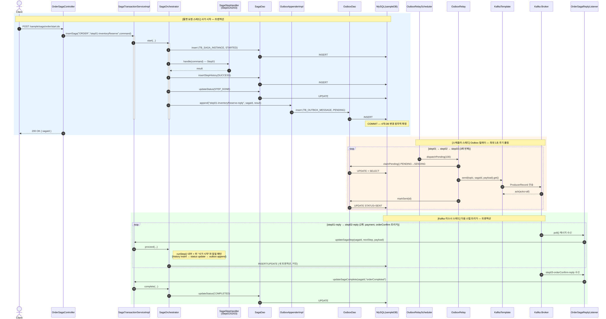

mermaid 소스 보기 (수정 시 이미지 재생성 필요)

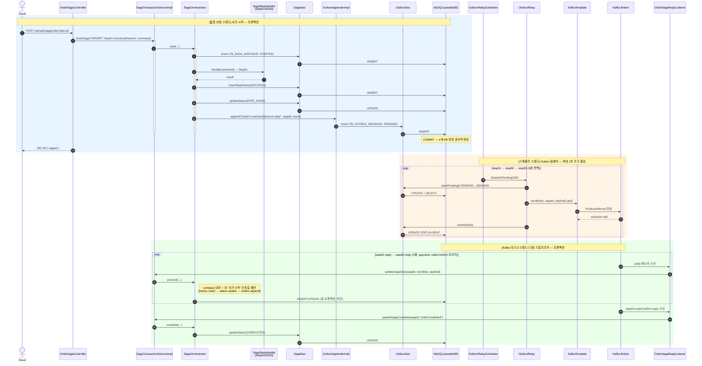

---

## 0단계. 사전 조건 — 애플리케이션 기동 시 컴포넌트 초기화

| 구성요소 | 역할 |
|---|---|
| `ConfigKafka` | `spring.kafka.enabled=true`면 `KafkaTemplate` 빈 + `kafkaListenerContainerFactory`(autoStartup=true) 생성 |
| `ConfigMessaging` | `OutboxAppender`, `OutboxRelay`, `SagaOrchestrator` 빈을 dstone-boot의 `OutboxDao`/`SagaDao`(둘 다 `sqlSessionCommon` = MySQL `sampleDB`)와 엮어줌 |
| `ConfigTransaction` | `*Service`/`*ServiceImpl` 클래스의 insert/update/delete 메소드에 AOP로 트랜잭션 경계(`txAdvisorCommon`)를 걸어줌 |
| `OrderSagaReplyListener`의 3개 `@KafkaListener` | 앱 기동 시점에 이미 각자의 컨슈머그룹으로 브로커에 접속해서 poll 루프 대기 중 |
| `OutboxRelayScheduler` | `@Scheduled`로 1초마다 `dispatchPending()` 호출 대기 중 |

이 중 하나라도 안 떠 있으면(예: `spring.kafka.enabled`가 false였던 지난번 오타 버그) 뒤에 나오는 단계들이 통째로 멈춥니다.

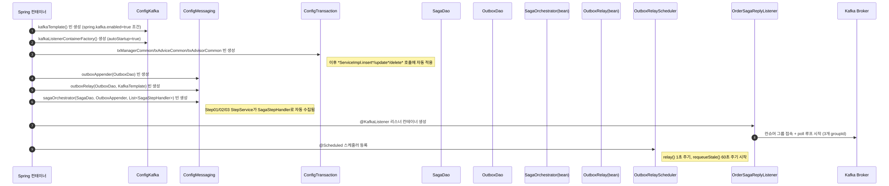

mermaid 소스 보기 (수정 시 이미지 재생성 필요)

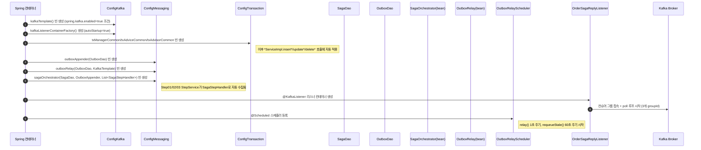

---

## 1~2단계. HTTP 요청 → 사가 시작 (스레드: 톰캣 요청 스레드)

`OrderSagaController.start()` (`OrderSagaController.java:46`)

1. 쿼리파라미터로 `command` Map 생성: `ORDER_ID`, `ITEM_ID`, `QTY`, `AMOUNT`, `IS_ORDER_COMPLETED="N"`
2. `sagaTransactionService.insertSaga("ORDER", "step01-inventoryReserve", command)` 호출

여기서 `SagaTransactionServiceImpl`은 클래스명이 `*ServiceImpl`이고 메소드명이 `insert*`라서, `ConfigTransaction`의 AOP 어드바이저(`txAdvisorCommon`)가 **이 시점부터 트랜잭션을 엽니다**(MySQL 커넥션 획득, autocommit off). 이 트랜잭션 하나가 아래 전체를 감쌉니다.

### `SagaOrchestrator.start()` (dstone-common, 같은 스레드/같은 트랜잭션) — `SagaOrchestrator.java:88`

1. `sagaId = UUID.randomUUID()` 생성
2. `sagaStore.insert(...)` → **[DB WRITE①]** `TB_SAGA_INSTANCE`에 1행 삽입: `STATUS=STARTED, CURRENT_STEP=step01-inventoryReserve`
3. `runStep(sagaId, "step01-inventoryReserve", command)` 호출

### `runStep()` 내부 — `SagaOrchestrator.java:163`

1. `existsSuccessStep(sagaId, "step01-inventoryReserve")` → 첫 실행이므로 false, 통과
2. `findHandler("step01-inventoryReserve")` → Spring이 모아준 `List<SagaStepHandler>` 중 `Step01InventoryReserveService` 를 찾음
3. **`Step01InventoryReserveService.handle(command)` 실행** (dstone-boot)
   - `QTY >= 100`이면 예외 → 아래 "실패 플로우"로 감
   - 정상이면 `command`를 그대로 반환 (재고차감은 로그만, 실제 재고 테이블은 없음 — 데모)
4. 반환된 result에 `result.put("SAGA_ID", sagaId)` 주입
5. `sagaStore.insertStepHistory(...)` → **[DB WRITE②]** `TB_SAGA_STEP_HISTORY`에 1행 삽입: `STEP_NAME=step01-inventoryReserve, RESULT=SUCCESS, PAYLOAD={ORDER_ID,ITEM_ID,QTY,AMOUNT,SAGA_ID}`
6. `sagaStore.updateStatus(sagaId, STEP_DONE, "step01-inventoryReserve")` → **[DB WRITE③]** `TB_SAGA_INSTANCE.STATUS=STEP_DONE`
7. `outboxAppender.append("step01-inventoryReserve-reply", sagaId, result)` 호출

### `OutboxAppenderImpl.append()` (dstone-common)

- result를 JSON 문자열로 직렬화
- **[DB WRITE④]** `TB_OUTBOX_MESSAGE`에 1행 삽입: `TOPIC=step01-inventoryReserve-reply, MSG_KEY=sagaId, PAYLOAD=(JSON), STATUS=PENDING`
- **주의: 이 시점까지 Kafka로는 아무것도 전송되지 않았습니다.** DB에 "나중에 보낼 예약"만 해둔 것.

### 트랜잭션 커밋

`start()` 호출이 `insertSaga()` 리턴까지 다 끝나면, AOP 어드바이저가 트랜잭션을 커밋합니다. 이 순간 **①~④ 4개의 DB 변경이 전부 한 번에 확정**됩니다(원자성 보장 — Transactional Outbox 패턴의 핵심). HTTP 응답이 `sagaId`를 담아 반환됩니다. → 여기서 사용자 요청은 끝.

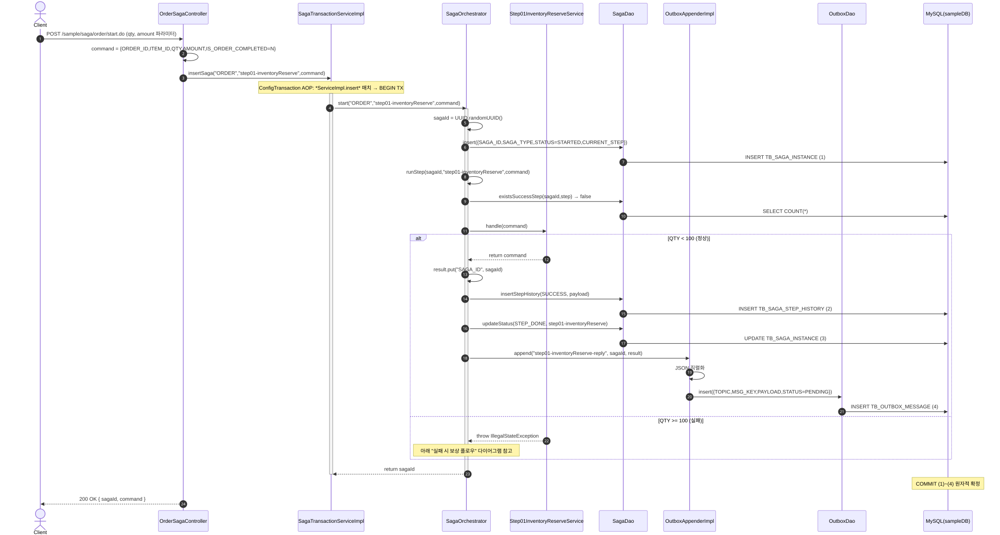

mermaid 소스 보기 (수정 시 이미지 재생성 필요)

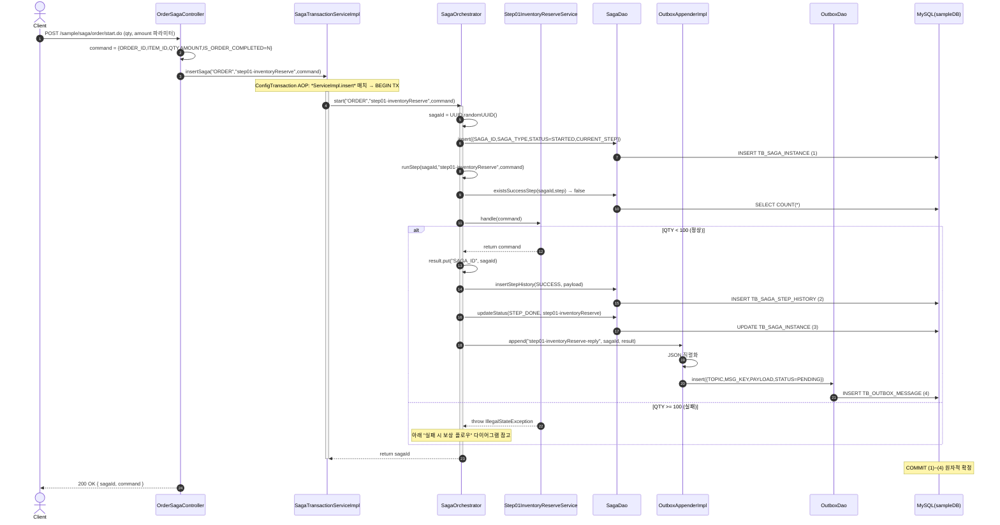

---

## 3단계. Outbox 릴레이 — 실제 Kafka 발행 (스레드: 스프링 스케줄러 스레드, 최대 1초 뒤)

`OutboxRelayScheduler.relay()` (`OutboxRelayScheduler.java:27`) → `OutboxRelay.dispatchPending(100)` (`OutboxRelay.java:52`)

1. `dispatchToken = UUID.randomUUID()` 발급
2. `outboxStore.claimPending(100, dispatchToken)` → **[DB WRITE]** `TB_OUTBOX_MESSAGE`에서 `STATUS='PENDING'`인 행을 오래된 순으로 최대 100건 `STATUS='SENDING'`으로 원자적 전환(다중 인스턴스여도 중복클레임 방지), 방금 전환한 행만 재조회
3. 방금 만든 그 1건(step01-inventoryReserve-reply)에 대해:
   - PAYLOAD(JSON 문자열) → Map으로 역직렬화
   - **`kafkaTemplate.send("step01-inventoryReserve-reply", sagaId, payload).get()` 호출 → 진짜로 Kafka 브로커에 전송하고 ack까지 동기 대기**
   - 성공하면 `outboxStore.markSent(id)` → **[DB WRITE]** `STATUS='SENT'`
   - 실패하면 `markFailed(id, ...)` → `RETRY_CNT+1`, 5회 넘으면 `FAILED`, 아니면 다시 `PENDING`(다음 폴링에서 재시도)

이 시점에 브로커의 `step01-inventoryReserve-reply` 토픽 파티션(key=sagaId로 결정된 파티션)에 메시지가 실제로 append 됩니다.

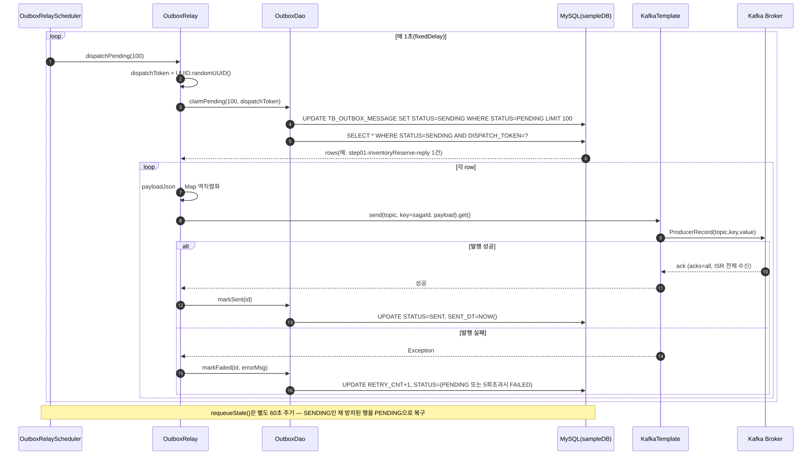

mermaid 소스 보기 (수정 시 이미지 재생성 필요)

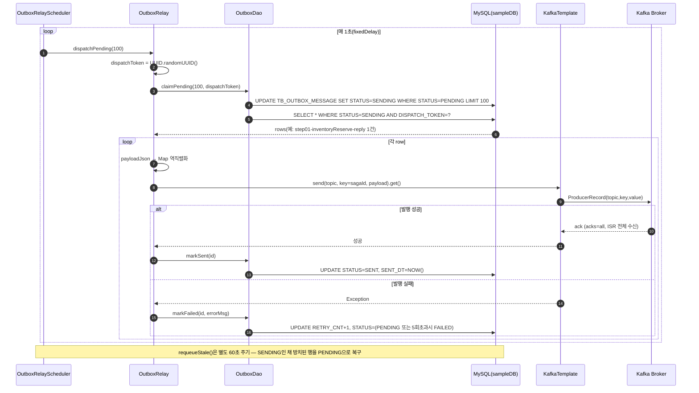

---

## 4단계. Kafka 컨슈머가 메시지 수신 → 다음 스텝 트리거 (스레드: Kafka 리스너 컨테이너 스레드)

`OrderSagaReplyListener.onInventoryReserved()` (`OrderSagaReplyListener.java:48`)
- groupId `step01-inventoryReserve-reply-consumer-group`이 해당 토픽 파티션을 poll 하고 있다가 메시지 수신
- `payload`(Map)에서 `SAGA_ID` 꺼냄
- `sagaTransactionService.updateSagaStep(sagaId, "step02-payment", payload)` 호출

→ 이 호출이 다시 `SagaTransactionServiceImpl.updateSagaStep()`(메소드명 `update*`)이므로 **새 트랜잭션이 열립니다.** → `SagaOrchestrator.proceed()` → `runStep(sagaId, "step02-payment", payload)`.

이후 흐름은 **1~2단계와 완전히 동일한 패턴**이 `step02-payment`에 대해 반복됩니다:
- `Step02PaymentService.handle()` 실행 (AMOUNT>=1000000이면 실패)
- `TB_SAGA_STEP_HISTORY` insert (step02-payment, SUCCESS)
- `TB_SAGA_INSTANCE.STATUS=STEP_DONE, CURRENT_STEP=step02-payment`
- `TB_OUTBOX_MESSAGE`에 `step02-payment-reply` PENDING 삽입
- 트랜잭션 커밋

메시지 오프셋 커밋: 리스너 메소드가 예외 없이 정상 리턴하면 Spring Kafka가 기본(BATCH ack mode)으로 이 poll 배치의 오프셋을 커밋합니다.

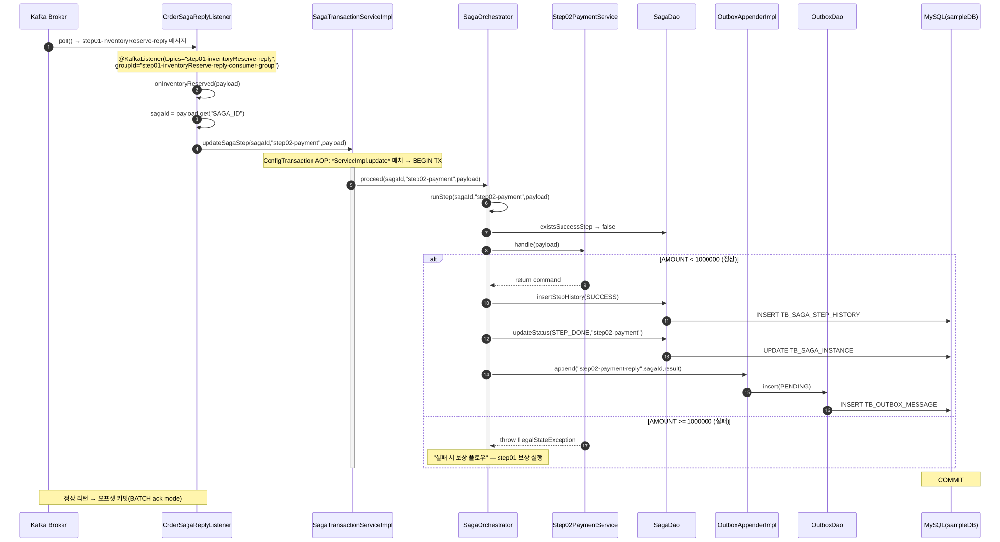

mermaid 소스 보기 (수정 시 이미지 재생성 필요)

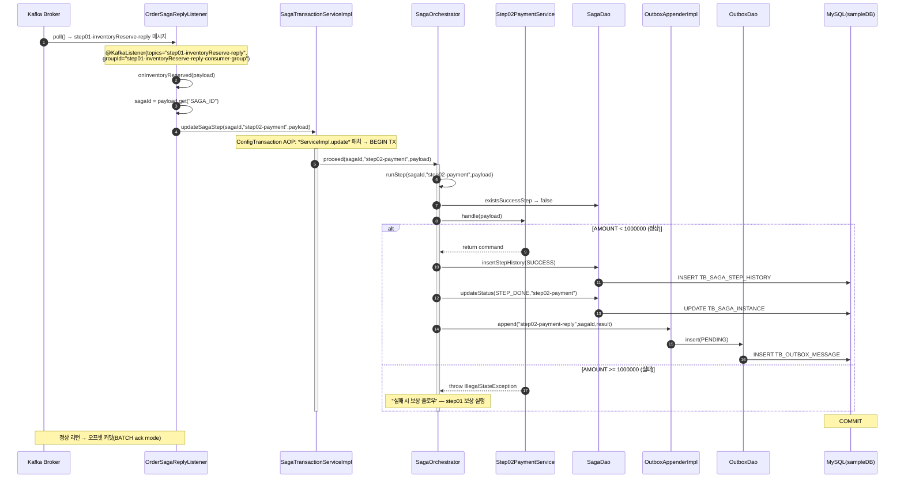

---

## 5~6단계. 위 3~4단계 반복 (payment-reply 발행 → orderConfirm 트리거)

- `OutboxRelayScheduler`가 다음 폴링(≤1초 후) 때 `step02-payment-reply`를 Kafka로 발행 → **3단계 다이어그램과 동일 패턴** (topic만 `step02-payment-reply`로 바뀜)
- `OrderSagaReplyListener.onPaid()` (groupId `step02-payment-reply-consumer-group`)가 수신 → `updateSagaStep(sagaId, "step03-orderConfirm", payload)` → `Step03OrderConfirmService.handle()` 실행 (`ITEM_ID=="GOLD"`면 실패) → 성공 시 `command.put("IS_ORDER_COMPLETED","Y")` → history/status/outbox 저장 → `step03-orderConfirm-reply` PENDING 등록 → 커밋 — **4단계 다이어그램과 동일 패턴** (handler만 `Step03OrderConfirmService`로 바뀜)

---

## 7단계. 마지막 릴레이 + 마지막 리스너 → 사가 종결

- `OutboxRelayScheduler`가 `step03-orderConfirm-reply`를 Kafka로 발행
- `OrderSagaReplyListener.onOrderConfirmed()` (groupId `step03-orderConfirm-reply-consumer-group`)가 수신
- `IS_ORDER_COMPLETED=="Y"` 확인 후 `sagaTransactionService.updateSagaComplete(sagaId, "orderCompleted")` 호출
- `SagaOrchestrator.complete()` → **[DB WRITE]** `TB_SAGA_INSTANCE.STATUS=COMPLETED` (이 메소드는 이벤트를 더 이상 발행하지 않음 — 사가 종료)

→ 여기서 사가 완료. `TB_SAGA_STEP_HISTORY`에는 3건(step01/02/03, 전부 SUCCESS)이 남아 있습니다.

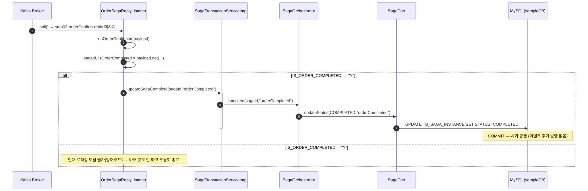

mermaid 소스 보기 (수정 시 이미지 재생성 필요)

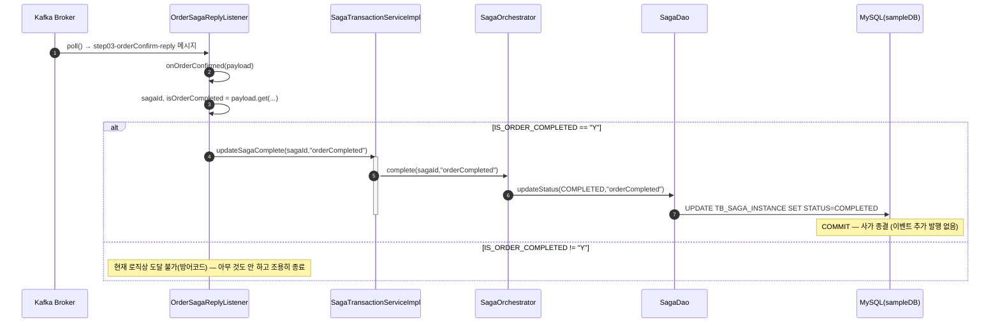

---

## 정리: DB/Kafka 왕복 횟수

정상 3스텝 사가 1건 완료까지:
- HTTP 요청 1번 (동기)
- DB 트랜잭션 4번 (start/proceed×2/complete — 각각 별도 커밋)
- Outbox 릴레이 폴링에 의한 실제 Kafka `send()` 3번
- Kafka 컨슈머 콜백(리스너 스레드) 3번

**핵심 포인트**: 1단계 HTTP 요청 스레드는 `step01-inventoryReserve`의 로컬 처리(=DB 커밋)까지만 책임지고 즉시 응답합니다. 이후 2번째 스텝부터는 전부 "릴레이 스케줄러 스레드"와 "Kafka 리스너 스레드"가 이어받아 진행하며, HTTP 요청 스레드와는 완전히 분리된 별도 흐름입니다. 그래서 `/start.do` 응답이 와도 사가는 아직 안 끝난 상태(`STEP_DONE`)이고, 실제 `COMPLETED`가 되기까지는 Outbox 릴레이 주기(최대 1초) × 3번만큼의 지연이 생깁니다.

---

## 실패 시 보상(compensate) 플로우 (예: QTY=100으로 호출)

1. 1~2단계 동일하게 진행하다가 `Step01InventoryReserveService.handle()`이 `IllegalStateException` 던짐
2. `runStep()`의 `catch(Exception e)` 진입 (`SagaOrchestrator.java:194`)
3. `insertStepHistory(...)` → `TB_SAGA_STEP_HISTORY`에 `RESULT=FAILED` 행 삽입
4. `compensate(sagaId, "step01-inventoryReserve")` 호출
   - `TB_SAGA_INSTANCE.STATUS=COMPENSATING`
   - `findSuccessStepHistory(sagaId)` → **이 케이스는 첫 스텝부터 실패했으므로 SUCCESS 이력이 없음 → 보상 대상 0건**
   - `TB_SAGA_INSTANCE.STATUS=FAILED`로 종결
5. **outbox에는 아무것도 쌓이지 않으므로 Kafka로는 아무 메시지도 안 나갑니다.** (실패한 스텝은 reply 이벤트를 발행하지 않음 — 다음 스텝이 트리거될 이유 자체가 없음)

만약 `step02-payment`(AMOUNT>=1000000)에서 실패했다면:
- `findSuccessStepHistory`가 `step01-inventoryReserve`(SUCCESS) 1건을 최신순으로 반환
- `Step01InventoryReserveService.compensate(payload)` 호출(재고복원 로그만) → `markCompensated(sagaId, "step01-inventoryReserve", null)` → `TB_SAGA_STEP_HISTORY.COMPENSATE_RESULT=SUCCESS`
- 마지막에 `TB_SAGA_INSTANCE.STATUS=FAILED`

이 보상 흐름은 **Kafka/Outbox를 전혀 거치지 않고, 실패가 발생한 그 트랜잭션/그 스레드 안에서 동기적으로** 즉시 실행됩니다.

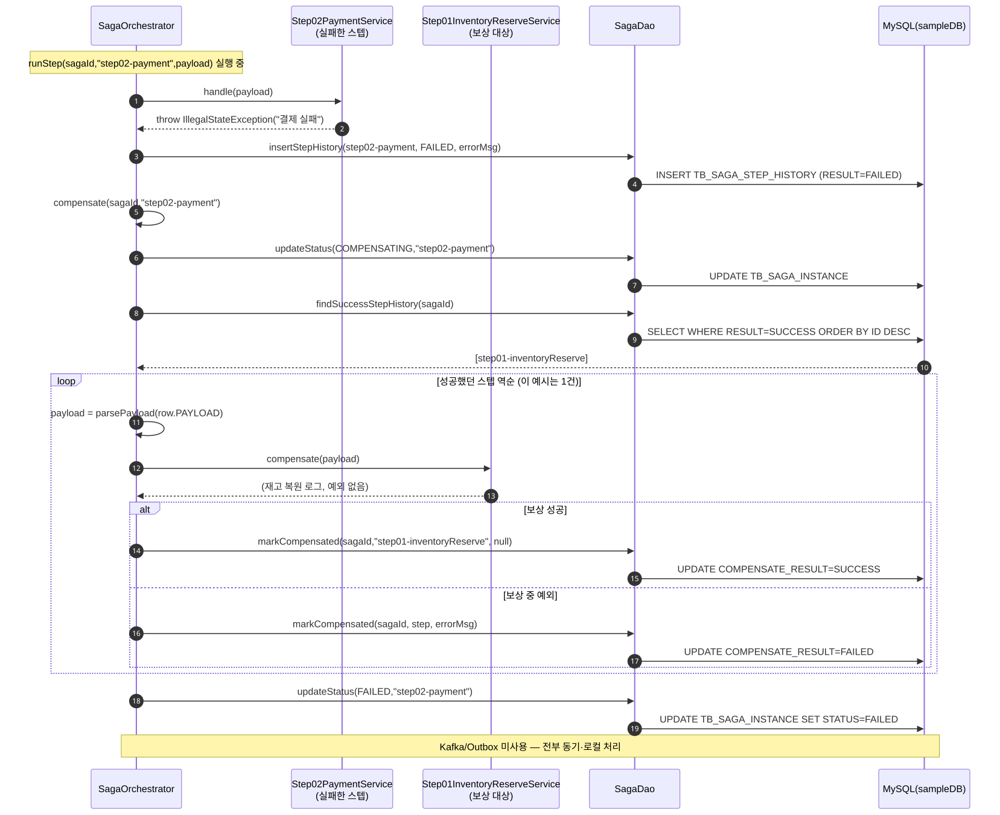

mermaid 소스 보기 (수정 시 이미지 재생성 필요)

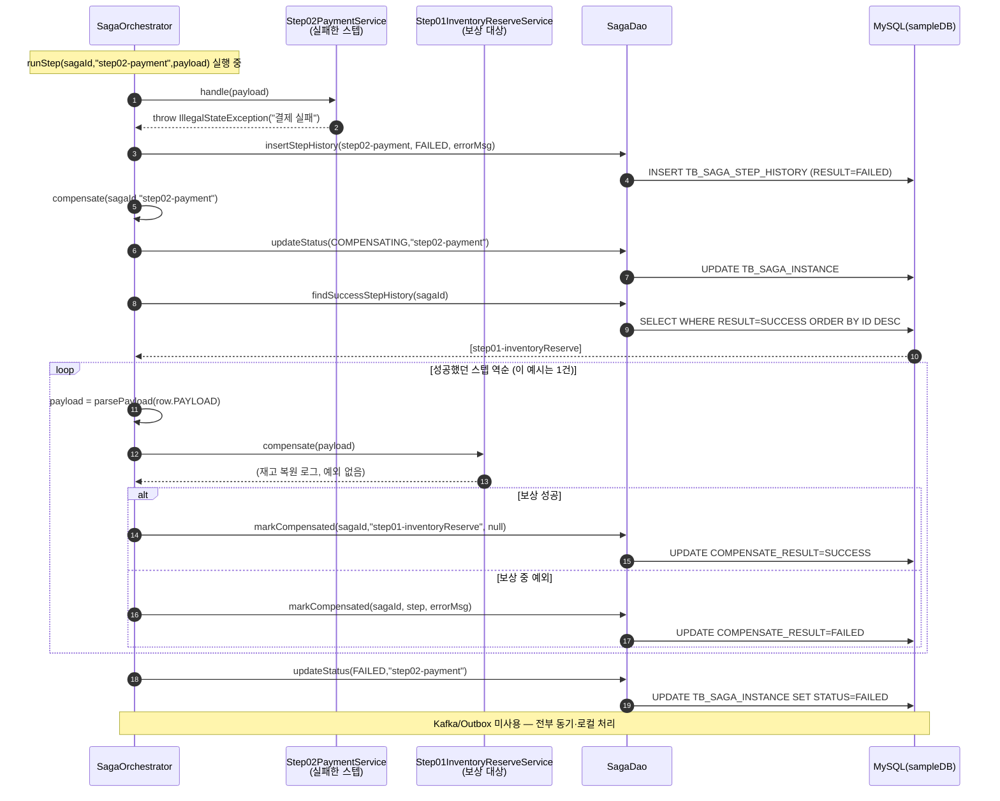

