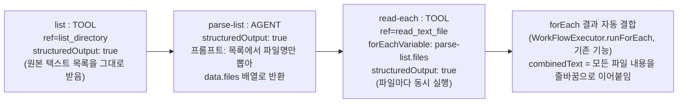

# dstone-ai-engine: TOOL step 데이터 흐름 일반화 계획 (2026-09-23, 두 번째)

## 0. 이 계획의 출발점 — "Java는 조립 부품만, 나머지는 전부 YAML"

이 프레임워크의 핵심 목표를 다시 한번 명시적으로 못박아 둔다: **Java 코드는 재사용 가능한 조립
부품(primitive)을 만들 때만, 그것도 가능한 한 적게, 한 번만 건드린다. 그 이후 모든 업무 로직/조합은
`resources/{workflows,agents,mcp}/**/*.yml`만으로 이뤄진다.** 오늘 `sample-mcp-filesystem-list`를
테스트하다가 막힌 지점("TOOL step이 성공하면 Tool의 실제 응답이 아니라 원본 입력을 그대로 돌려준다")은
이 원칙에 비춰보면 "설정 한 줄로 못 바꾸는 동작이 있다"는 신호이지, "이번만 YAML을 억지로 우회하자"는
신호가 아니다. 그래서 땜질이 아니라, **한 번만 Java를 고쳐서 앞으로 이런 종류의 요구가 전부 YAML로
끝나게 만드는** 설계를 이 문서에서 정리한다.

**이번 조사에서 확인한, 설계를 좌우하는 사실 하나**: `spring-ai-mcp:2.0.1`의
`SyncMcpToolCallback.call()`을 디컴파일해서 직접 확인했다(`javap -p -c`) - MCP 서버가 돌려주는
`CallToolResult`에는 `content`(사람이 읽는 텍스트/이미지 블록)와 `structuredContent`(도구가 스키마를
선언했을 때만 나오는, 진짜 구조화된 JSON) 두 필드가 있는데, **이 버전의 Spring AI는 `content`만
`jsonHelper.toJson(result.content())`로 직렬화해서 돌려주고 `structuredContent`는 아예 쓰지 않는다.**
즉 "MCP Tool의 구조화된 응답을 자동으로 `data`에 담는다"는 방향은 지금 의존성 버전에서는 애초에
불가능하다 - Spring AI를 업그레이드하거나 `McpSyncClient`를 직접 다루는 새 통로를 만들어야 하는데,
둘 다 "한 번의 작은 조립 부품 추가"의 범위를 넘어선다. 이 제약이 아래 설계를 결정지었다.

## 1. 문제 재정리

### 1.1 실제로 겪은 문제 (사용자 테스트 로그 기준)

`sample-mcp-filesystem-list.yml`의 `list`(list_directory)와 `read-notes`(read_text_file) 두 TOOL
step 모두, 로그의 `<output>`이 `Success[primaryText=<원본 입력 경로>, data={}]`로 찍힌다 - Tool이
실제로 돌려준 파일 목록/파일 내용이 다음 step으로 전혀 전달되지 않는다.

**원인**: `runtime.step.ToolStepRunner.run()`이 성공 시 항상 `StepOutcome.success(normalized)`를
돌려준다. `normalized`는 Tool을 부르기 *전의*, 방어적으로 정리만 된 원본 입력 텍스트다. Tool이 실제로
돌려준 응답(`toolResult`)은 성공 여부만 판정하는 데 쓰이고 버려진다. 이건 실수가 아니라 의도된
설계다 - `SqlSyntaxTool.validateSqlSyntax` 같은 "검증형" Tool은 "이 SQL이 문법적으로 맞는가"만
확인하면 되고, "문법 구조상 문제가 없습니다"라는 Tool의 응답 문구 자체는 다음 step에 아무 정보도
아니기 때문이다(`ToolStepRunner`의 기존 클래스 주석 참고). 문제는 **이 "검증형" 가정이 TOOL step의
유일한 동작으로 하드코딩돼 있다는 것** - `list_directory`/`read_text_file`처럼 "새 데이터를 가져오는"
Tool에는 이 가정이 아예 맞지 않는데도 빠져나갈 방법이 YAML에 없다.

### 1.2 곁가지로 발견한 두 번째 버그

`read_text_file`의 원본 응답을 로그로 보면 `[{"text":"...실제 파일 내용..."}]`처럼 JSON 배열
그대로다. `runtime.tool.ToolExecutor.unwrap()`은 로컬 `@Tool`이 String 하나를 돌려줄 때 Spring AI가
"JSON 문자열 리터럴 하나로 감싸는" 규칙만 알고 푸는데, MCP Tool은 그 규칙을 따르지 않고
"`CallToolResult.content()`를 통째로 JSON 배열로 직렬화"하는 완전히 다른 규칙을 쓴다(1절 참고).
`unwrap()`은 이 배열을 String으로 파싱하려다 실패하면 그냥 원본을 그대로 돌려주는 catch-all 경로로
빠지므로, 지금은 이 배열이 전혀 풀리지 않은 채로 흘러다닌다. **1.1을 고치더라도, 이 버그를 먼저(또는
함께) 고치지 않으면 "Tool의 실제 응답"이라는 게 결국 지저분한 JSON 배열 텍스트가 되어 버린다.**

### 1.3 더 큰 시야에서 본 근본 원인

AGENT step은 이미 출력 모양을 YAML로 고를 수 있다(`structuredOutput: false`(기본, 자유 텍스트) vs
`true`(구조화된 `{primaryText, data}`)). 반면 TOOL step은 출력 모양이 **하나뿐**이다(항상 "원본 입력
에코"). AGENT와 TOOL이 대칭적인 설계 언어를 쓰지 않고 있다는 것 자체가 근본 원인이다 - TOOL의 출력
모델이 AGENT에 비해 덜 설계된 채로 남아 있었다.

## 2. 설계안

### 2.0 이 설계는 MCP 전용이 아니다

**중요**: 아래 2.1~2.3은 MCP Tool만을 위한 수정이 아니다. `runtime.tool.ToolExecutor.call()`은
"TOOL step이 Tool 하나를 이름으로 직접 호출할 때 반드시 지나가는 유일한 통로"(클래스 자체
설명)이고, `ToolStepRunner.run()`은 StepType이 TOOL이기만 하면 그 Tool이 로컬 `@AiTool`이든
MCP Tool이든 완전히 동일한 코드 경로를 탄다. 즉 2.1~2.2에서 손보는 지점은 **"TOOL step이 성공했을
때 다음 step에 무엇을 넘길지"를 결정하는 단 하나의 공통 분기**이므로, 여기를 고치면 지금 이미
있는 로컬 Tool(`tools.http.HttpCallTool`, `tools.shell.ShellExecTool`,
`tools.python.PythonExecTool`처럼 "응답 자체가 곧 원하는 데이터"인 Tool들)과 앞으로 추가될 어떤
Tool(로컬이든, 다른 MCP 서버든, SSE 트랜스포트든)에도 **차별 없이** 똑같이 적용된다. 2.3(unwrap
수정)만 MCP의 특수한 응답 모양(`content` 배열)을 겨냥한 좁은 수정이고, 그 이유는 "MCP가 로컬
Tool과는 다른 JSON 포맷을 쓴다"는 프로토콜 차이 때문이지 MCP를 특별 취급하겠다는 의도가 아니다 -
오히려 이 수정이 없으면 MCP Tool만 `structuredOutput: true`를 써도 지저분한 JSON을 받게 되어,
로컬 Tool과 동등하게 취급받지 못하는 쪽이 된다.

이 설계 이후로 "Tool을 하나 붙였는데 그 응답을 다음 step이 못 받는다"는 문제 자체가 **Tool의 출처와
무관하게** `structuredOutput: true` 한 줄로 끝나야 한다는 것이 이번 계획의 기준선이다. 3절의 예시
A/B에 더해, 기존 로컬 Tool로도 같은 문제가 이미 있었다는 걸 보여주는 예시 C를 추가해 둔다(3.3).

### 2.1 기존 필드 재사용 — 새 필드를 만들지 않는다

`StepDefinition.structuredOutput`(`Boolean`)은 이미 존재하는 필드다. 지금은 `AgentStepRunner`만
읽고 `ToolStepRunner`는 완전히 무시한다(javadoc에도 "type이 AGENT인 step에서만 쓰입니다"라고
명시돼 있다). **새 필드(`returnToolResponse` 같은)를 추가하는 대신, 이 필드의 의미를 TOOL에도
동일한 이름·동일한 개념("원본 대신 실제 데이터를 달라")으로 확장한다.**

- 새 필드를 만들면 워크플로우 작성자가 "AGENT는 structuredOutput, TOOL은 또 다른 이름"을 따로
  외워야 한다 - 조립 부품이 늘어날수록 이런 비일관성이 배로 쌓인다.
- 지금 TOOL에서 이 필드는 100% 미사용 상태라, 의미를 넣어도 기존 YAML(전부 `structuredOutput` 미설정)에
  영향이 없다(5절에서 검증).

### 2.2 TOOL step에서 `structuredOutput`의 동작 규칙

| `structuredOutput` | 성공 시 `primaryText` | 성공 시 `data` |
|---|---|---|
| `false`/미설정(기본, 하위호환) | 지금과 동일 - 검증받은 **원본 입력**(`normalized`) | `{}` |
| `true`(신규) | Tool이 실제로 돌려준 응답(아래 파싱 규칙) | 아래 파싱 규칙 |

`structuredOutput: true`일 때 `toolResult`(1.2의 unwrap 수정을 거친, 깨끗한 텍스트)를 다음 순서로
해석한다:

1. **`runtime.step.StepOutcome.Success`(즉 `{primaryText, data}`) 모양의 JSON으로 파싱을 시도한다.**
   로컬 `@Tool` 메서드가 이 record를(또는 이 필드 이름과 정확히 일치하는 POJO를) 직접 돌려주면
   여기서 성공한다 - `AgentStepRunner.runStructuredAgent()`가 LLM 응답을 파싱하는 것과 **완전히
   같은 계약, 같은 타입**을 재사용한다. 이렇게 하면 "Tool이 구조화된 데이터를 내고 싶으면
   `StepOutcome.Success`를 돌려주면 된다"는 규칙이 AGENT와 TOOL 양쪽에서 하나로 통일된다.
2. **파싱에 실패하면(대부분의 Tool - MCP Tool 전부 포함, 1절에서 확인했듯 `structuredContent`가
   없으므로) 실패로 처리하지 않는다.** 대신 `toolResult` 텍스트 그 자체를 `primaryText`로,
   `data`는 빈 Map으로 써서 `StepOutcome.success(toolResult)`를 돌려준다.

**AGENT의 `structuredOutput: true`와 결정적으로 다른 지점**: AGENT는 파싱 실패를 fail-closed로
처리한다("LLM에게 이 스키마를 지키라고 시켰는데 안 지켰다 = 신뢰 못 함 = 실패"). TOOL은 그 반대로
**파싱 실패를 정상 경로로 처리한다**("애초에 이 스키마를 지키라고 시킨 적이 없다 - 대부분의 Tool은
그냥 텍스트/MCP 응답을 돌려줄 뿐이다"). 같은 필드 이름, 같은 "구조화된 데이터를 원한다"는 의도를
공유하지만, "그 의도를 지키지 않았을 때 안전한 기본값이 무엇인가"는 AGENT(신뢰할 수 없는 LLM)와
TOOL(결정적인 코드)이라는 호출 대상의 성격 차이 때문에 반대가 된다 - 이 비대칭은 의도적이며, 문서에
분명히 남겨야 한다(5절).

### 2.3 선행 조치: `ToolExecutor.unwrap()`이 MCP 응답을 제대로 풀게 고친다

1.2에서 확인한 대로, `content()` 배열이 JSON으로 직렬화된 형태(`[{"type":"text","text":"..."}, ...]`
또는 지금 로그에서 보이는 것처럼 `type`이 생략된 `[{"text":"..."}]`)를 감지해서, 각 항목의 `text`
값을 순서대로 꺼내 줄바꿈으로 이어붙인 "사람이 읽는 순수 텍스트"로 바꿔준다. 이 모양이 아니면(로컬
Tool이 `ToolOutcome`이나 그 밖의 POJO를 돌려준 경우 등) 지금처럼 원본을 그대로 쓴다. **이건
2.1/2.2와 독립적인 순수 버그 수정이다** - `structuredOutput` 값과 무관하게, TOOL step이 MCP
Tool의 응답을 쓰는 모든 경로(지금의 "실패 시 사유 메시지"까지 포함)가 이 수정의 혜택을 받는다.

## 3. 이 설계로 (Java를 더 건드리지 않고) 가능해지는 것

### 예시 A — 파일 하나를 읽어서 그 내용을 그대로 돌려받기 (지금 막힌 문제)

`sample-mcp-filesystem-list.yml`의 `read-notes` step에 `structuredOutput: true` 한 줄만 추가하면
끝난다:

```yaml
    - id: read-notes
      type: TOOL
      ref: read_text_file
      inputTemplate: '{"path":"${APP_HOME}/dstone-ai-engine/mcp/server-filesystem/sample/notes.txt"}'
      structuredOutput: true   # 추가: 원본 입력 에코 대신, read_text_file이 실제로 읽어온 파일 내용을 그대로 돌려받는다
      onSuccess: SUCCESS
      onFailure: FAIL
```

### 예시 B — 디렉토리 안의 모든 파일 내용을 이어붙여서 돌려받기 (사용자가 실제로 원했던 것)

Java를 더 건드리지 않고, **이미 있는 조립 부품(AGENT의 structuredOutput + TOOL의 새 structuredOutput
+ forEachVariable)만 조합**해서 만들 수 있다:



- `list` step은 `list_directory`의 원본 텍스트 목록("[FILE] a.txt\n[FILE] b.txt")을 있는 그대로
  다음 step에 넘긴다(예시 A와 같은 `structuredOutput: true`).
- **"목록 텍스트를 실제 배열로 바꾸는" 일은 Java가 아니라 AGENT(LLM)에게 맡긴다.** 1절에서 확인했듯
  MCP Tool의 응답에는 구조가 없으므로(순수 텍스트), 이 텍스트를 구조화된 데이터로 바꾸는 작업은
  이미 완성된 기능인 AGENT의 `structuredOutput: true`(자유 텍스트 → `{primaryText, data}`)가
  정확히 하는 일이다. 새 Java 코드가 전혀 필요 없다 - `agents/sample/`에 파싱 전용 Agent YAML
  파일 하나만 추가하면 된다.
- `read-each` step은 `forEachVariable: parse-list.files`로 `parse-list` step이 낸
  `data.files`(`{stepId.키}` 네임스페이싱을 거쳐 `variables["parse-list.files"]`에 이미 들어있는
  값 - 기존 동작 그대로)를 반복 소스로 그대로 쓴다. 각 반복이 `structuredOutput: true`로 실제 파일
  내용을 돌려주고, **여러 반복의 결과를 하나로 잇는 것도 이미 있는 기능**이다
  (`WorkFlowExecutor.runForEach()`의 `combinedText`/`<stepId>.results` - 지금 이 계획과 무관하게
  이미 동작하는 코드다).

즉 "여러 파일을 읽어서 다 이어붙이기"는 **Java를 한 번(2.1~2.3) 고치고 나면, 그 뒤로는 Workflow
YAML 1개 + Agent YAML 1개 추가만으로** 완성된다 - 이번 요청뿐 아니라 앞으로 "목록을 만들고 각
항목을 처리해서 결과를 모으는" 성격의 어떤 업무에도 재사용 가능한 패턴이 된다.

### 예시 C — MCP가 아닌 기존 로컬 Tool도 똑같은 문제를 갖고 있었다 (설계가 MCP 전용이 아님을 보여주는 예시)

`tools.http.HttpCallTool.httpGet(url)`은 응답 본문(`String`)을 그대로 돌려주는 Tool이다 - 이것도
"새 데이터를 가져오는" 성격이라 `list_directory`/`read_text_file`과 완전히 같은 문제를 갖는다.
지금 `sample-tool-gated-external.yml`은 이 문제를 애초에 피해서 설계돼 있다(호출 성공/실패
여부만 step 이력에서 확인하고, 본문 내용 자체는 다음 step에 넘기지 않는 구조). 이번 설계 이후로는
YAML만 바꿔서 본문을 실제로 다음 step에 넘길 수 있게 된다:

```yaml
    - id: fetch
      type: TOOL
      ref: httpGet
      inputTemplate: '{"url":"https://example.com/status.json"}'
      structuredOutput: true   # httpGet이 돌려준 응답 본문을 그대로 다음 step으로 넘긴다
      onSuccess: use-body
      onFailure: FAIL
```

`httpGet`은 MCP와 무관한 로컬 `@AiTool`이고, 여기엔 2.3(MCP `content` 배열 unwrap)이 전혀
관여하지 않는다 - 순수하게 2.1~2.2(TOOL의 `structuredOutput` 의미 확장)만으로 되는 예시다. 이걸로
"이번 수정이 MCP 전용이 아니라 TOOL step 전체에 적용되는 일반 규칙"이라는 걸 실제 YAML로 증명해
둔다.

## 4. 하위 호환성 검증

`resources/{workflows,agents}/**/*.yml` 전체를 훑어서, TOOL step 중 `structuredOutput`을 이미 쓰는
곳이 있는지 확인이 필요하다(계획 수립 시점 기준으로는 TOOL이 이 필드를 아예 읽지 않았으므로 설정해
둔 파일이 있어도 지금까지는 영향이 없었을 것이다 - 구현 시점에 `grep`으로 재확인). 미설정/`false`인
모든 기존 TOOL step(`sample-tool-chain-basic`, `sample-tool-gated-external`, `sample-mcp-
filesystem-list`의 `list` step 등)은 2.2의 표에서 "기존과 동일" 행 그대로이므로 **동작이 전혀
바뀌지 않는다.**

## 5. 문서/주석 갱신이 필요한 곳 (구현 시 함께 처리)

- `common.definition.StepDefinition.structuredOutput`의 javadoc - "type이 AGENT인 step에서만
  쓰입니다" → TOOL에서도 쓰이며 동작이 다르다는 점(2.2의 fail-closed vs graceful-fallback 차이)을
  명시.
- `runtime.step.ToolStepRunner`의 클래스 주석 - "검증받은 원본 값을 그대로 넘긴다"는 문장이 이제
  `structuredOutput: false`(기본값)일 때만 맞는 설명이 되므로 조건을 명시.
- `runtime.tool.ToolExecutor.unwrap()`의 javadoc - MCP `content` 배열 처리 규칙 추가.
- `docs/09.dstone-ai-engine.md` §6.2(StepOutput 표의 `structuredOutput`이 AGENT 전용이라는 서술),
  §6.3 ⑤ TOOL(전체 재작성 필요 - 지금은 "성공하면 원본 값을 그대로 넘긴다"고만 서술됨), §10
  YAML 작성법(TOOL에서 `structuredOutput` 쓰는 법 예시 추가), §8 MCP 절(unwrap 수정 반영).
- `mcp/sample/sample-filesystem-mcp.yml`/`agents/sample/`/`workflows/sample/`의 MCP 샘플 자체를
  예시 A(또는 A+B 둘 다)로 갱신해서 실제로 살아있는 예제로 만든다.

## 6. 구현 순서

1. `ToolExecutor.unwrap()`에 MCP `content` 배열 파싱 추가(2.3) - 순수 버그 수정, 독립적으로 먼저
   끝낼 수 있고 위험이 가장 적다.
2. `ToolStepRunner.run()`에서 `definition.structuredOutput()`을 읽어 2.2의 분기 추가(신규 helper
   메서드로, 기존 흐름 최대한 재사용 - `AgentStepRunner.runStructuredAgent()`의 파싱 로직과 최대한
   같은 모양으로 맞춘다).
3. 기존 YAML 전수 조사로 4절 하위 호환성 재확인.
4. `sample-mcp-filesystem-list.yml`을 예시 A로 갱신(`structuredOutput: true` 추가) - 최소 검증.
5. (선택, 사용자 확인 후) 예시 B용 `parse-list` Agent YAML + Workflow 갱신.
6. 5절 문서/주석 일괄 갱신.
7. `mvn compile` + 실제 기동 후 라이브 재검증(list→read-notes 체인이 이제 실제 파일 내용을
   돌려주는지, 기존 `sample-tool-chain-basic` 등이 여전히 예전과 동일하게 동작하는지 둘 다 확인).

## 7. 사용자 확인이 필요한 결정 사항 (2026-09-23 결정 완료, 구현·라이브 검증·커밋까지 끝남)

1. **필드 재사용(2.1) 동의 여부** - `structuredOutput`을 TOOL까지 의미를 넓히는 것 vs 새 이름의
   별도 필드를 쓰는 것. 재사용을 권장하지만, "AGENT와 TOOL은 실패 시 동작이 정반대(fail-closed vs
   graceful-fallback)인데 이름을 같이 쓰는 게 오히려 헷갈리지 않겠냐"는 반론도 있을 수 있음.
   → **결정: 재사용.** (`common.definition.StepDefinition.structuredOutput`, `runtime.step.ToolStepRunner.runStructuredOutput()`으로 구현)
2. **예시 B(디렉토리 전체 읽기)까지 이번에 같이 만들지, 예시 A(파일 하나)만 우선 처리하고 예시 B는
   실제 필요해졌을 때 그때 가서 YAML만 추가할지.** 어차피 Java 변경은 예시 A만으로 끝나고, 예시
   B는 그 이후 순수 YAML 추가이므로 "지금 당장 안 만들어도 나중에 언제든 Java 재배포 없이 추가
   가능"하다는 점을 참고.
   → **결정: 예시 A만.** (예시 B는 여전히 미구현 - 8절의 후속 논의가 정리되면 그때 다시 고려)
3. **로컬 Tool이 구조화 데이터를 내고 싶을 때 `runtime.step.StepOutcome.Success`를 직접
   import해서 반환 타입으로 쓰게 할지**(2.2안), 아니면 `tools` 패키지 전용의 별도 DTO를 하나 더
   만들지. 전자는 타입을 하나 더 줄이지만 `tools` 패키지가 `runtime.step` 패키지를 의존하게
   된다(지금은 `tools` → `runtime.tool`(`ToolOutcome`)만 의존하고 `runtime.step`을 몰라도 됨 -
   계층이 한 겹 더 얽힌다는 뜻). 후자는 타입이 하나 늘지만 `tools` 패키지의 의존 방향이 지금처럼
   깔끔하게 유지됨.
   → **결정: 후자.** (`runtime.tool.ToolPayload` 신설)

## 8. 후속 논의(2026-09-23, 미결) — step 간 I/O를 어떻게 일관되게 할 것인가

> → 2026-09-24 결론 및 구현: `docs/temp/dstone-ai-engine-refactory-20260924-1.md`

7절을 구현하고 `sample-mcp-filesystem-list`를 실제로 테스트하는 과정에서(파일명을 바꾸니 Workflow가
깨지는 걸 발견 → `list`도 `structuredOutput: true`로 켜고 `read-notes`가 `{previous}`로 파일명을
동적으로 받게 고침), `{previous}` 토큰이 정확히 뭘 의미하는지에 대한 질문이 나왔고, 거기서 더
근본적인 질문("여러 step/여러 Tool 사이의 I/O를 어떻게 일관되게 설계할 것인가")으로 이어졌다.
**아직 결론을 내리지 않았고, 코드도 건드리지 않았다** - 다음에 이어서 논의하기 위해 지금까지 나온
내용만 정리해 둔다.

### 8.1 지금까지 확인한 사실

- **AGENT와 TOOL은 애초에 "이전 step의 결과를 받는 방식" 자체가 다르다.** TOOL의 `inputTemplate`은
  `{previous}`(직전 step의 결과 텍스트)/`{변수명}`/`{stepId.키}` 세 종류 토큰을 문자열 치환하는
  명시적 템플릿이다. AGENT는 애초에 이런 템플릿이 없다 - 직전 step의 결과 텍스트 전체가 그대로
  LLM의 사용자 메시지가 된다(자연어 턴 전달이지 템플릿 치환이 아니다). 그래서 "`{previous}`가
  TOOL에서만 있다"는 관찰은 정확하지만, 그 원인은 "TOOL만 특별 취급해서"가 아니라 "AGENT는 애초에
  토큰이라는 개념 자체를 쓰지 않아서"다.
- **`{previous}`로 치환되는 값은 "가공 전 원본"이 아니라 "그 step 자신이 `stripLlmArtifacts()`로
  한 번 정리한 값"이다**(`ToolStepRunner.run()`의 `normalized`). `stripLlmArtifacts()`는 원래
  "LLM이 답변에 코드펜스나 `[레이블]`을 덧붙이는 습관"을 방어하려고 만든 로직인데,
  `list_directory`의 응답 형식(`[FILE] 파일명`)이 우연히 그 정규식과 겹쳐서 같이 벗겨진다 - 즉
  지금 `sample-mcp-filesystem-list.yml`의 동적 파일명 연결은 **의도된 기능이 아니라 두 정규식이
  우연히 맞아떨어진 결과**다. 파일이 여러 개면(다중 줄 목록) 깨진다.
- **`data`/`{stepId.키}`는 이미 "이름 붙은, 구조화된 핸드오프" 채널이다.** `structuredOutput: true`인
  step이 낸 `data`는 `{stepId.키}`로 네임스페이싱되어 `variables`에 합쳐지고, 다음 step이 그 키를
  정확히 지정해서 가져다 쓴다 - `{previous}`처럼 "직전 것"을 암묵적으로 가져오는 게 아니라, 누구의
  어떤 값인지 명시적으로 주소를 매긴다.

### 8.2 일반적으로 다른 시스템들은 어떻게 하는가

- **파이프 스타일(암묵적)** - Unix 파이프(`cmd1 | cmd2`)처럼, 직전 단계의 출력 전체가 그대로 다음
  단계의 입력이 된다. 간단하지만 "이게 정확히 무슨 형식인지"가 암묵적이라, 형식이 다른 여러 생산자
  (사람이 쓴 텍스트, JSON, MCP 고유 포맷 등)가 섞이면 소비하는 쪽이 방어적으로 정리해야 한다 - 지금
  `{previous}` + `stripLlmArtifacts()`가 정확히 이 패턴이다.
- **이름 붙은 타입드 핸드오프(명시적)** - Airflow의 XCom(`xcom_pull(task_ids=...)`),
  n8n/GitHub Actions의 `steps.<id>.outputs.<name>`, LangGraph의 공유 state 딕셔너리처럼, 각
  step의 출력을 **step id로 주소를 매긴 구조화된 값**(보통 JSON)으로 저장해두고, 다음 step이
  필요한 값을 명시적으로 가져다 쓴다. 이 엔진의 `data`/`{stepId.키}`가 이미 이 패턴이다.
- 성숙한 워크플로우 오케스트레이션 시스템일수록 방식 2로 수렴하는 경향이 있다 - 방식 1(파이프)은
  단순한 선형 파이프라인에서는 편리하지만, 생산자가 여러 형식을 섞어 쓰기 시작하는 순간(지금
  겪은 것처럼) 소비자 쪽에 정리 로직이 쌓이기 시작한다.

### 8.3 현재 잠정 방향 (미확정, 다음 논의에서 다시 다룰 것)

`{previous}`를 없애자는 게 아니라, **"진짜 데이터 전달"은 항상 `structuredOutput`+`data`(방식 2)로
하고, `{previous}`는 "직전 단계 텍스트를 대충 이어붙이는 편의 기능" 정도로 용도를 명확히 분리하는
쪽**을 제안했었다. 다만 이것도 아직 사용자와 합의된 결론이 아니고, 구체적으로 어떻게 나눌지(예:
`stripLlmArtifacts()`를 소비 시점이 아니라 생산 시점으로 옮길지, `{previous}`의 의미 자체를
문서화만 명확히 하고 둘 다 유지할지 등)는 더 논의가 필요하다. **다음 세션에서 이어서 진행.**
